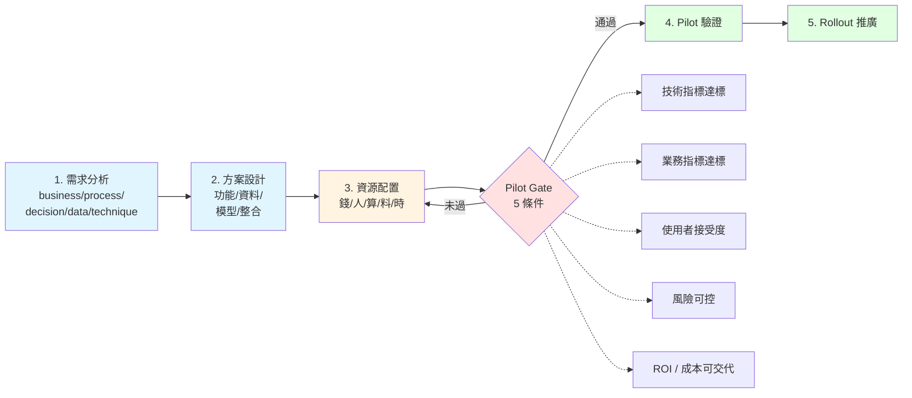

# AI 導入 5 階段 Roadmap + Pilot Gate

```mermaid
flowchart LR
    A[1. 需求分析<br/>business/process/<br/>decision/data/technique] --> B[2. 方案設計<br/>功能/資料/<br/>模型/整合]
    B --> C[3. 資源配置<br/>錢/人/算/料/時]
    C --> D{Pilot Gate<br/>5 條件}
    D -->|通過| E[4. Pilot 驗證]
    D -->|未過| C
    E --> F[5. Rollout 推廣]

    D -.-> G1[技術指標達標]
    D -.-> G2[業務指標達標]
    D -.-> G3[使用者接受度]
    D -.-> G4[風險可控]
    D -.-> G5[ROI / 成本可交代]

    style A fill:#e1f5ff
    style B fill:#e1f5ff
    style C fill:#fff4e1
    style D fill:#ffe1e1
    style E fill:#e1ffe1
    style F fill:#e1ffe1
```
