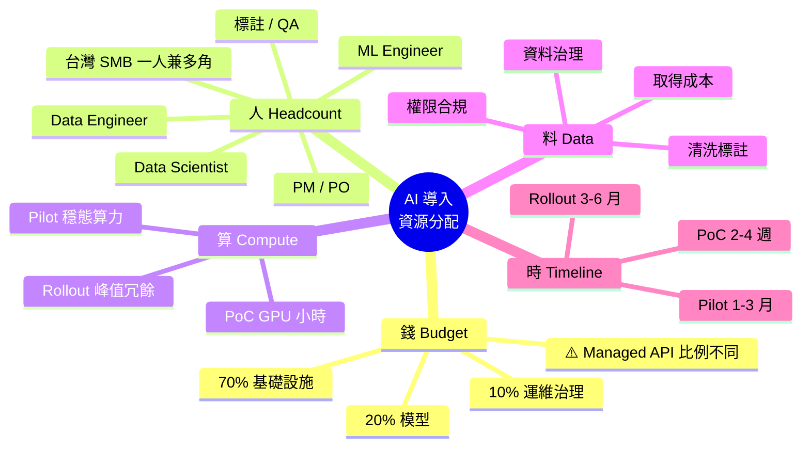

# 五向量資源分配（錢人算料時）

```mermaid
mindmap
  root((AI 導入<br/>資源分配))
    錢 Budget
      70% 基礎設施
      20% 模型
      10% 運維治理
      ⚠️ Managed API 比例不同
    人 Headcount
      PM / PO
      Data Scientist
      ML Engineer
      Data Engineer
      標註 / QA
      台灣 SMB 一人兼多角
    算 Compute
      PoC GPU 小時
      Pilot 穩態算力
      Rollout 峰值冗餘
    料 Data
      取得成本
      清洗標註
      權限合規
      資料治理
    時 Timeline
      PoC 2-4 週
      Pilot 1-3 月
      Rollout 3-6 月
```
