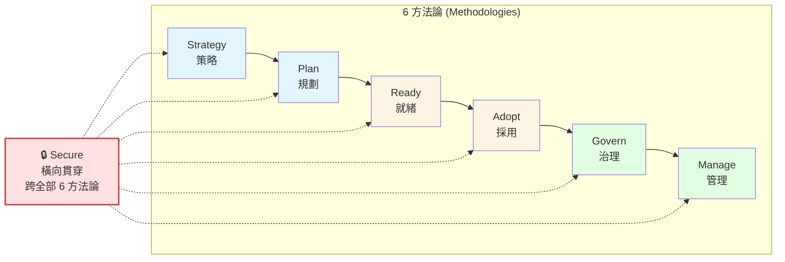

# Microsoft CAF for AI：6 方法論 + Secure 橫向貫穿

```mermaid
flowchart LR
    subgraph Methodologies["6 方法論 (Methodologies)"]
        direction LR
        S[Strategy<br/>策略] --> P[Plan<br/>規劃]
        P --> R[Ready<br/>就緒]
        R --> A[Adopt<br/>採用]
        A --> G[Govern<br/>治理]
        G --> M[Manage<br/>管理]
    end

    Sec[🔒 Secure<br/>橫向貫穿<br/>跨全部 6 方法論]

    Sec -.-> S
    Sec -.-> P
    Sec -.-> R
    Sec -.-> A
    Sec -.-> G
    Sec -.-> M

    style Sec fill:#ffe1e1,stroke:#c33,stroke-width:2px
    style S fill:#e1f5ff
    style P fill:#e1f5ff
    style R fill:#fff4e1
    style A fill:#fff4e1
    style G fill:#e1ffe1
    style M fill:#e1ffe1
```

**記憶**：S-P-R-A-G-M（策劃備採治管） ＋ Secure 貫穿。Secure 不是第七階段。
