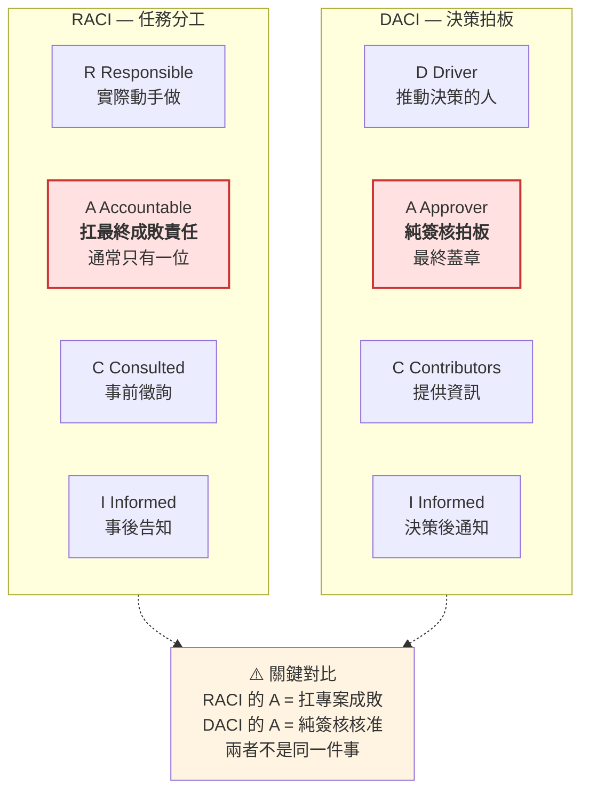

# RACI vs DACI：A 的意義不同

```mermaid
flowchart TB
    subgraph RACI["RACI — 任務分工"]
        R1[R Responsible<br/>實際動手做]
        A1[A Accountable<br/><b>扛最終成敗責任</b><br/>通常只有一位]
        C1[C Consulted<br/>事前徵詢]
        I1[I Informed<br/>事後告知]
    end

    subgraph DACI["DACI — 決策拍板"]
        D2[D Driver<br/>推動決策的人]
        A2[A Approver<br/><b>純簽核拍板</b><br/>最終蓋章]
        C2[C Contributors<br/>提供資訊]
        I2[I Informed<br/>決策後通知]
    end

    Note["⚠️ 關鍵對比<br/>RACI 的 A = 扛專案成敗<br/>DACI 的 A = 純簽核核准<br/>兩者不是同一件事"]

    RACI -.-> Note
    DACI -.-> Note

    style A1 fill:#ffe1e1,stroke:#c33,stroke-width:2px
    style A2 fill:#ffe1e1,stroke:#c33,stroke-width:2px
    style Note fill:#fff4e1
```

**適用場景**：每週任務分工用 RACI；方案 A/B 拍板會議用 DACI。
