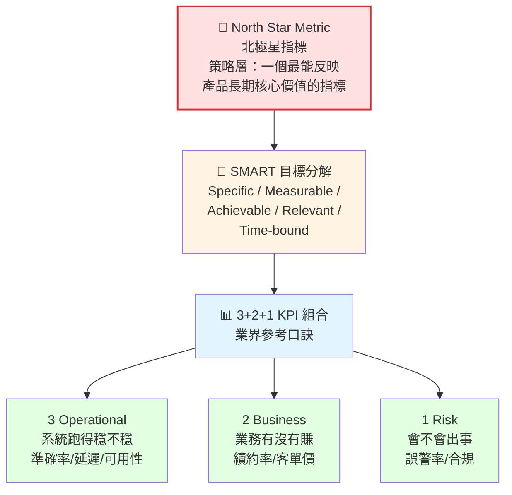

# 三層目標架構：North Star → SMART → 3+2+1 KPI

```mermaid
flowchart TB
    NS[🌟 North Star Metric<br/>北極星指標<br/>策略層：一個最能反映<br/>產品長期核心價值的指標]

    NS --> SMART[📏 SMART 目標分解<br/>Specific / Measurable /<br/>Achievable / Relevant /<br/>Time-bound]

    SMART --> KPI[📊 3+2+1 KPI 組合<br/>業界參考口訣]

    KPI --> Op[3 Operational<br/>系統跑得穩不穩<br/>準確率/延遲/可用性]
    KPI --> Biz[2 Business<br/>業務有沒有賺<br/>續約率/客單價]
    KPI --> Risk[1 Risk<br/>會不會出事<br/>誤警率/合規]

    style NS fill:#ffe1e1,stroke:#c33,stroke-width:2px
    style SMART fill:#fff4e1
    style KPI fill:#e1f5ff
    style Op fill:#e1ffe1
    style Biz fill:#e1ffe1
    style Risk fill:#e1ffe1
```

**記憶口訣**：先看系統跑得穩不穩（3 op），再看業務有沒有賺（2 biz），最後看會不會出事（1 risk）。
