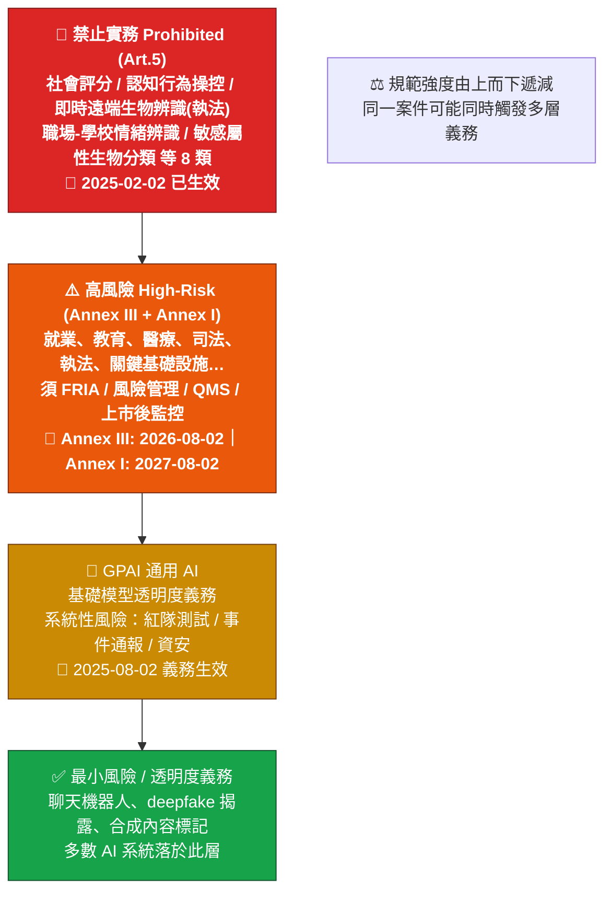

# Diagram 01 — EU AI Act 四層風險金字塔

**閱讀重點**
- 金字塔自上而下「禁止 → 高風險 → GPAI → 最小」對應規範密度。
- 「職場/學校情緒辨識」與「敏感屬性生物特徵分類」屬 Art.5 禁止，**不要** 再進高風險評估流程（study-guide §3.5.1）。
- 高風險義務分兩波生效（Annex III 2026-08-02、Annex I 2027-08-02），考題愛拿日期當誘答。
