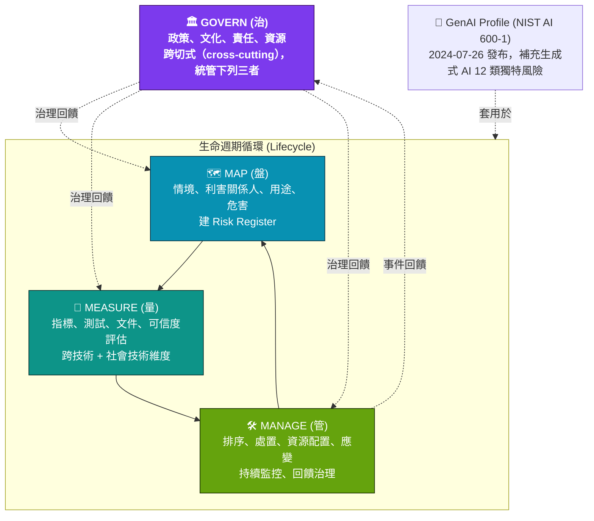

# Diagram 02 — NIST AI RMF 1.0 四功能循環

**口訣 vs 圖**
- 「治盤量管」= **Govern · Map · Measure · Manage**（與 study-guide §3.7、§5.3 一致）
- 「治」是中央管制塔台，恆常運轉；「盤量管」是繞著治轉的生命週期循環。
- 考題愛問「Govern 是分立步驟還是 cross-cutting？」→ 答：cross-cutting。
