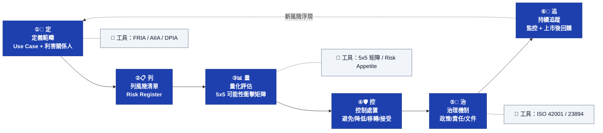

# Diagram 03 — AI 風險管理閉環（定列量控治追）

**口訣對齊（study-guide §5.7）**
| 步驟 | 字 | 對應動作 | 對應工具 |
|---|---|---|---|
| ① | 定 | 定義範疇 | Use Case Canvas、利害關係人地圖 |
| ② | 列 | 列風險清單 | Risk Register |
| ③ | 量 | 量化評估 | 5x5 可能性衝擊矩陣、Risk Appetite |
| ④ | 控 | 控制處置 | 4T（Treat/Tolerate/Transfer/Terminate） |
| ⑤ | 治 | 治理機制 | ISO 42001 AIMS、政策、責任分工 |
| ⑥ | 追 | 持續追蹤 | 上市後監控、事件通報、KRI/KPI |

**對應到 NIST AI RMF**：① ② = Map｜③ = Measure｜④ ⑥ = Manage｜⑤ = Govern
