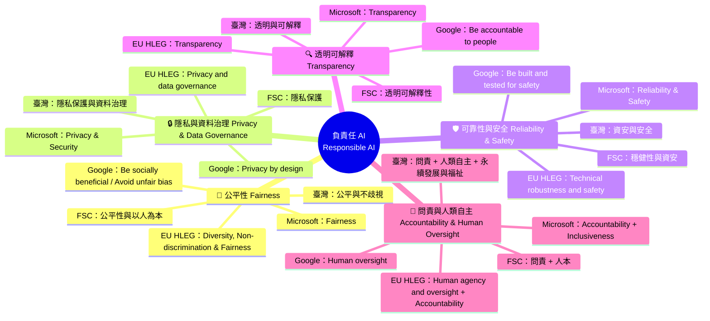

# Diagram 04 — 負責任 AI 五大支柱與各組原則對照

**閱讀重點**
- 五大支柱是「跨組織共識」的最大公因數；各 issuer 用不同字面把它們重組。
- 考題真正測的是「**誰提出哪一組**」（issuer matching），不是支柱意涵本身。
- 臺灣 7 原則 = 五大支柱 + 「永續發展與福祉」+「人類自主」。
- FSC 6 原則 = 五大支柱 + 「治理與問責」整合進原則 6。

**完整名單對照**（與 study-guide §3.11 一致）

| Issuer | 原則數 | 原則總清單 |
|---|---|---|
| Microsoft | 6 | Fairness、Reliability & Safety、Privacy & Security、Inclusiveness、Transparency、Accountability |
| Google | 7 | Be socially beneficial、Avoid unfair bias、Built for safety、Accountable to people、Privacy by design、Scientific excellence、Made available for uses that accord with these principles |
| EU HLEG | 7 | Human agency & oversight、Technical robustness & safety、Privacy & data governance、Transparency、Diversity/Non-discrimination/Fairness、Societal & environmental well-being、Accountability |
| FSC（金管會 2024-06-20） | 6 | 治理及問責、公平性與以人為本、隱私保護與資料治理、系統穩健性與資安、透明與可解釋、永續發展 |
| 臺灣 AI 基本法 | 7 | 永續發展與福祉、人類自主、隱私保護與資料治理、資安與安全、透明與可解釋、公平與不歧視、問責 |
