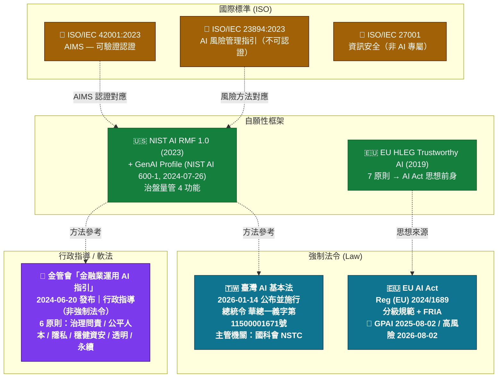

# Diagram 05 — 跨法域 / 跨框架對照

**易混淆對照（study-guide §3.11、§3.12 重點）**

| 維度 | EU AI Act | 臺灣基本法 | 金管會指引 | NIST AI RMF | ISO 42001 |
|---|---|---|---|---|---|
| 性質 | 強制法令 | 強制法令（基礎） | 行政指導 | 自願性框架 | 自願性標準 |
| 主管 | 各成員國 + AI Office | 國科會 NSTC | 金管會 | NIST（無強制） | ISO（驗證機構） |
| 對象 | 全產業 | 公部門優先（§19） | 金融業 | 任意組織 | 任意組織 |
| 核心 | 風險分級 + FRIA | 7 原則 + 治理 | 6 原則 | 治盤量管 4 功能 | AIMS PDCA |
| 認證 | 高風險須符合性評估 | — | — | — | 可第三方認證 |
| 違規處罰 | 最高 €35M / 7% 全球營收 | 公部門責任 + 細則待定 | 行政監管 | 無 | 認證撤銷 |

**考點提醒**
- 「金管會指引」常被誤判為強制法令——實為**行政指導**。
- ISO 42001 是**可認證**的 AIMS；ISO 23894 是**指引**（不可認證）；ISO 27001 是**資安**標準（非 AI 專屬）。
- NIST 另有 **Cybersecurity Framework (CSF)**，與 AI RMF 為不同框架，考題愛拿來互換誘答（study-guide §3.7）。
