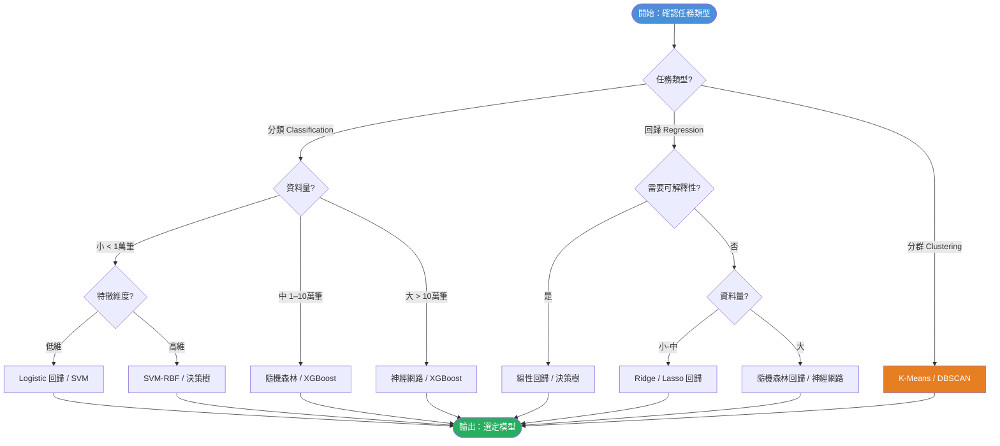

# Diagram 1: 模型選擇決策流程

```mermaid
flowchart TD
    A([開始：確認任務類型]) --> B{任務類型?}
    B -->|分類 Classification| C{資料量?}
    B -->|回歸 Regression| D{需要可解釋性?}
    B -->|分群 Clustering| E[K-Means / DBSCAN]

    C -->|小 < 1萬筆| F{特徵維度?}
    C -->|中 1–10萬筆| G[隨機森林 / XGBoost]
    C -->|大 > 10萬筆| H[神經網路 / XGBoost]

    F -->|低維| I[Logistic 回歸 / SVM]
    F -->|高維| J[SVM-RBF / 決策樹]

    D -->|是| K[線性回歸 / 決策樹]
    D -->|否| L{資料量?}
    L -->|小-中| M[Ridge / Lasso 回歸]
    L -->|大| N[隨機森林回歸 / 神經網路]

    I --> Z([輸出：選定模型])
    J --> Z
    G --> Z
    H --> Z
    K --> Z
    M --> Z
    N --> Z
    E --> Z

    style A fill:#4A90D9,color:#fff
    style Z fill:#27AE60,color:#fff
    style E fill:#E67E22,color:#fff
```
