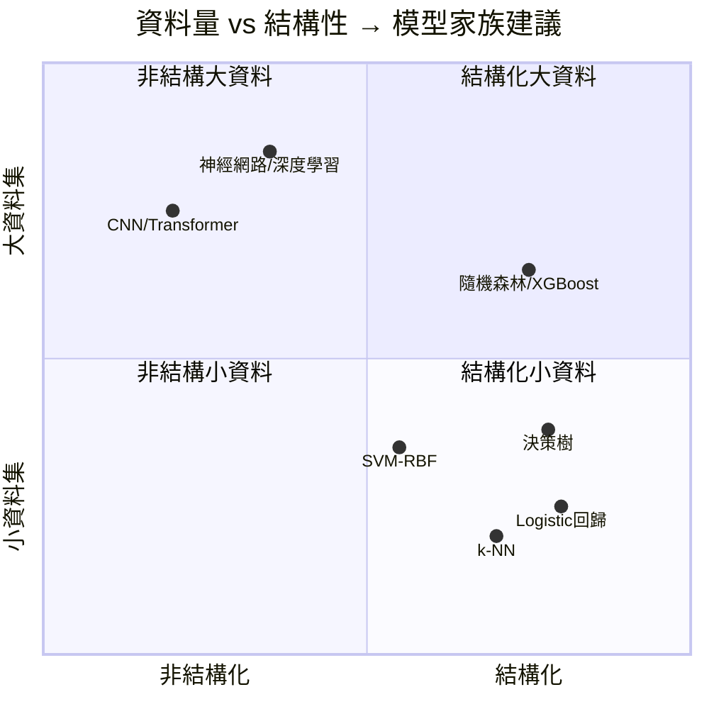

# Diagram 2: 資料量 × 結構類型 模型選擇啟發表

```mermaid
quadrantChart
    title 資料量 vs 結構性 → 模型家族建議
    x-axis 非結構化 --> 結構化
    y-axis 小資料集 --> 大資料集
    quadrant-1 結構化大資料
    quadrant-2 非結構大資料
    quadrant-3 非結構小資料
    quadrant-4 結構化小資料
    隨機森林/XGBoost: [0.75, 0.65]
    神經網路/深度學習: [0.35, 0.85]
    SVM-RBF: [0.55, 0.35]
    Logistic回歸: [0.8, 0.25]
    k-NN: [0.7, 0.2]
    CNN/Transformer: [0.2, 0.75]
    決策樹: [0.78, 0.38]
```
