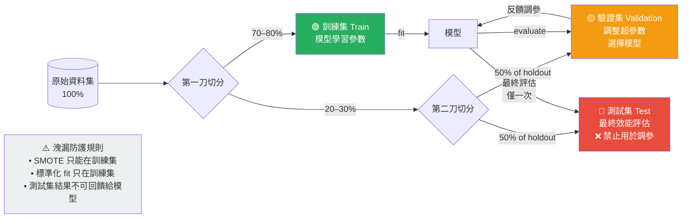

# Diagram 3: 訓練 / 驗證 / 測試集切分流程與洩漏防護

```mermaid
flowchart LR
    RAW[("原始資料集\n100%")] --> SPLIT1

    SPLIT1{第一刀切分} -->|70–80%| TRAIN
    SPLIT1 -->|20–30%| HOLDOUT

    HOLDOUT{第二刀切分} -->|50% of holdout| VAL
    HOLDOUT -->|50% of holdout| TEST

    TRAIN["🟢 訓練集 Train\n模型學習參數"]
    VAL["🟡 驗證集 Validation\n調整超參數\n選擇模型"]
    TEST["🔴 測試集 Test\n最終效能評估\n❌ 禁止用於調參"]

    TRAIN -->|fit| MODEL[模型]
    MODEL -->|evaluate| VAL
    VAL -->|反饋調參| MODEL
    MODEL -->|最終評估\n僅一次| TEST

    NOTE["⚠️ 洩漏防護規則\n• SMOTE 只能在訓練集\n• 標準化 fit 只在訓練集\n• 測試集結果不可回饋給模型"]

    style TRAIN fill:#27AE60,color:#fff
    style VAL fill:#F39C12,color:#fff
    style TEST fill:#E74C3C,color:#fff
    style NOTE fill:#ECF0F1,color:#333
```
