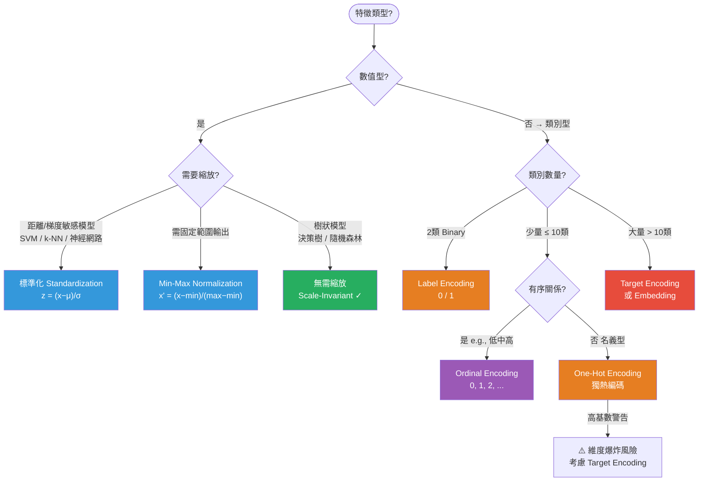

# Diagram 4: 特徵編碼選擇決策樹

```mermaid
flowchart TD
    A([特徵類型?]) --> B{數值型?}
    B -->|是| C{需要縮放?}
    B -->|否 → 類別型| D{類別數量?}

    C -->|距離/梯度敏感模型\nSVM / k-NN / 神經網路| E["標準化 Standardization\nz = (x−μ)/σ"]
    C -->|需固定範圍輸出| F["Min-Max Normalization\nx' = (x−min)/(max−min)"]
    C -->|樹狀模型\n決策樹 / 隨機森林| G["無需縮放\nScale-Invariant ✓"]

    D -->|2類 Binary| H["Label Encoding\n0 / 1"]
    D -->|少量 ≤ 10類| I{有序關係?}
    D -->|大量 > 10類| J["Target Encoding\n或 Embedding"]

    I -->|是 e.g., 低中高| K["Ordinal Encoding\n0, 1, 2, ..."]
    I -->|否 名義型| L["One-Hot Encoding\n獨熱編碼"]

    L -->|高基數警告| M["⚠️ 維度爆炸風險\n考慮 Target Encoding"]

    style E fill:#3498DB,color:#fff
    style F fill:#3498DB,color:#fff
    style G fill:#27AE60,color:#fff
    style H fill:#E67E22,color:#fff
    style K fill:#9B59B6,color:#fff
    style L fill:#E67E22,color:#fff
    style J fill:#E74C3C,color:#fff
```
