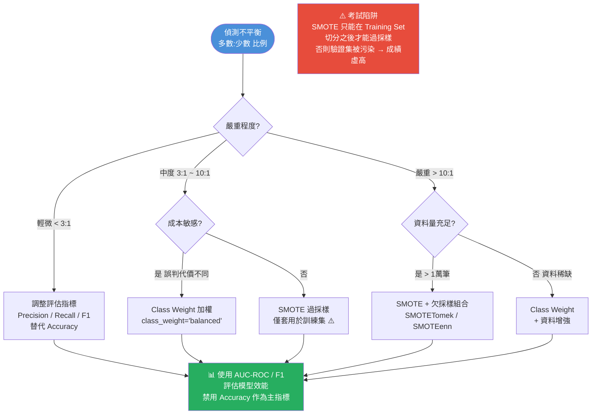

# Diagram 5: 類別不平衡處理策略決策矩陣

```mermaid
flowchart TD
    START([偵測不平衡\n多數:少數 比例]) --> RATIO{嚴重程度?}

    RATIO -->|輕微 < 3:1| A["調整評估指標\nPrecision / Recall / F1\n替代 Accuracy"]
    RATIO -->|中度 3:1 ~ 10:1| B{成本敏感?}
    RATIO -->|嚴重 > 10:1| C{資料量充足?}

    B -->|是 誤判代價不同| D["Class Weight 加權\nclass_weight='balanced'"]
    B -->|否| E["SMOTE 過採樣\n僅套用於訓練集 ⚠️"]

    C -->|是 > 1萬筆| F["SMOTE + 欠採樣組合\nSMOTETomek / SMOTEenn"]
    C -->|否 資料稀缺| G["Class Weight\n+ 資料增強"]

    A --> EVAL
    D --> EVAL
    E --> EVAL
    F --> EVAL
    G --> EVAL

    EVAL["📊 使用 AUC-ROC / F1\n評估模型效能\n禁用 Accuracy 作為主指標"]

    WARN["⚠️ 考試陷阱\nSMOTE 只能在 Training Set\n切分之後才能過採樣\n否則驗證集被污染 → 成績虛高"]

    style START fill:#4A90D9,color:#fff
    style EVAL fill:#27AE60,color:#fff
    style WARN fill:#E74C3C,color:#fff
```
