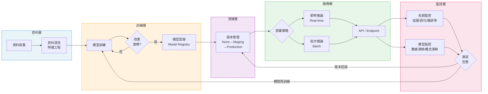

# 圖一：MLOps 完整生命週期

> 對應考點：AI技術系統架構設計 — 訓練→登錄→服務→監控→再訓練

```mermaid
flowchart LR
    subgraph 資料層
        D1[資料收集] --> D2[資料清洗\n特徵工程]
    end

    subgraph 訓練層
        D2 --> T1[模型訓練]
        T1 --> T2{效果\n達標?}
        T2 -- 否 --> T1
        T2 -- 是 --> R1
    end

    subgraph 登錄層
        R1[模型登錄\nModel Registry]
        R1 --> R2[版本管理\nNone→Staging\n→Production]
    end

    subgraph 服務層
        R2 --> S1{部署策略}
        S1 --> S2[即時推論\nReal-time]
        S1 --> S3[批次推論\nBatch]
        S2 & S3 --> API[API / Endpoint]
    end

    subgraph 監控層
        API --> M1[系統監控\n延遲/吞吐/錯誤率]
        API --> M2[模型監控\n數據漂移/概念漂移]
        M1 & M2 --> Alert{異常\n告警}
    end

    Alert -- 觸發再訓練 --> T1
    Alert -- 版本回滾 --> R2

    style 資料層 fill:#e8f4f8,stroke:#2196F3
    style 訓練層 fill:#fff3e0,stroke:#FF9800
    style 登錄層 fill:#f3e5f5,stroke:#9C27B0
    style 服務層 fill:#e8f5e9,stroke:#4CAF50
    style 監控層 fill:#fce4ec,stroke:#E91E63
```

**考試重點：**
- 🔥🔥 MLOps 是一個**閉環**（closed loop）— 監控觸發再訓練，不是線性流程
- 🔥 模型登錄是訓練與服務之間的**關卡**，未通過審核的模型不能上線
- 🔥 監控分兩層：系統健康（基礎設施）和模型健康（預測品質）
