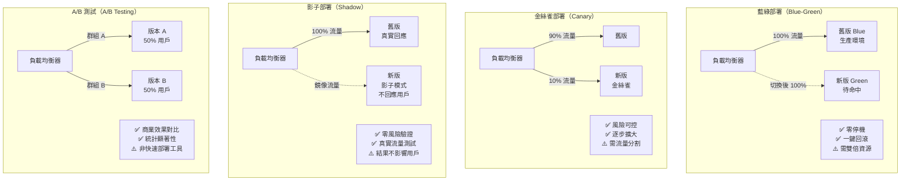

# 圖二：四大部署策略比較

> 對應考點：模型更新管理 — Canary / Shadow / Blue-Green / A/B Testing

## 🔥🔥 四策略快速對照表

| 策略 | 用戶看到新版？ | 核心目的 | 回滾方式 |
|---|---|---|---|
| 藍綠部署 | 切換後全部看到 | 零停機切換 | 流量打回 Blue |
| 金絲雀 | 部分用戶先看到 | 漸進式上線 | 減少金絲雀比例→0% |
| 影子部署 | **不看到** | 上線前無風險驗證 | 直接移除影子 |
| A/B 測試 | 各一半 | **商業效果比較** | 選勝出版本 |

**考試陷阱：**
- ❌ 「Canary = A/B Testing」→ 錯！Canary 是部署漸進策略，A/B 是商業效果實驗
- ❌ 「Shadow 部署的用戶會看到不同結果」→ 錯！Shadow 結果不回應給用戶
