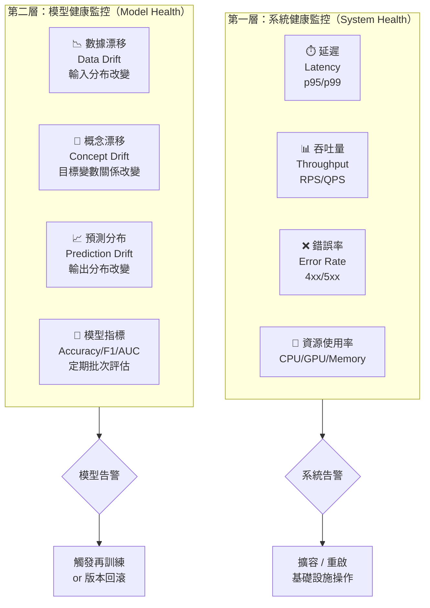

# 圖三：兩層監控架構

> 對應考點：模型效能監控 — 系統監控 vs. 模型監控



## 數據漂移 vs 概念漂移

```
數據漂移（Data Drift）
┌─────────────────────────────────────────┐
│  訓練時：用戶年齡分布 18-35 歲（主力）  │
│  上線後：用戶年齡分布 45-65 歲（改變）  │
│  → 輸入 X 的分布改變了                  │
└─────────────────────────────────────────┘
          ↓ 如果還沒改變 Y 的關係 = Data Drift
          ↓ 如果 X→Y 的關係也改變了 = Concept Drift

概念漂移（Concept Drift）
┌─────────────────────────────────────────┐
│  訓練時：「低價格 → 高購買意願」         │
│  上線後：「低價格 → 品質疑慮 → 低意願」 │
│  → X 和 Y 之間的關係本身改變了          │
└─────────────────────────────────────────┘
```

**考試口訣：**「數漂看輸入，概漂看關係」
- 數據漂移（Data Drift）= 輸入分布變了
- 概念漂移（Concept Drift）= X→Y 的映射關係變了（更嚴重，更難修復）

**🔥🔥 PSI（Population Stability Index）** 是偵測數據漂移最常見的指標：
- PSI < 0.1 → 穩定
- 0.1 ≤ PSI < 0.2 → 需注意
- PSI ≥ 0.2 → 明顯漂移，需再訓練
