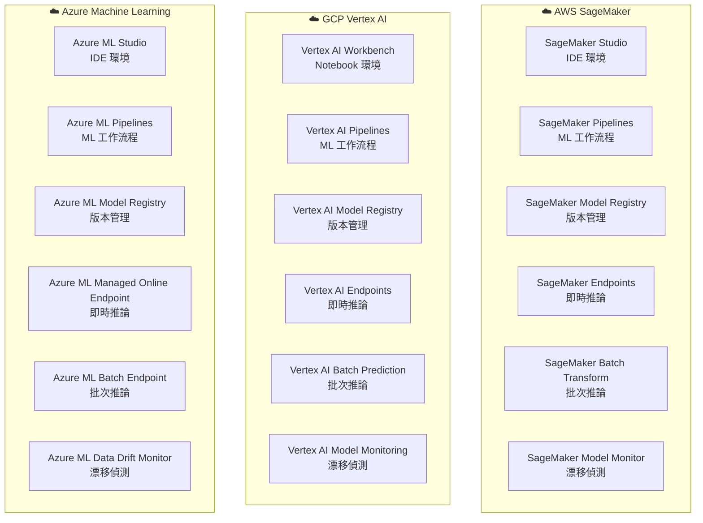

# 圖四：三大雲端 MLOps 平台比較

> 對應考點：雲端環境建置 — AWS SageMaker / GCP Vertex AI / Azure ML



## 🔥 考試重點對照表

| 功能 | AWS SageMaker | GCP Vertex AI | Azure ML |
|---|---|---|---|
| IDE 環境 | SageMaker Studio | Vertex AI Workbench | Azure ML Studio |
| 即時推論端點 | SageMaker Endpoint | Vertex AI Endpoint | Managed Online Endpoint |
| 批次推論 | Batch Transform | Batch Prediction | Batch Endpoint |
| 模型監控 | Model Monitor | Model Monitoring | Data Drift Monitor |
| 管道編排 | Pipelines | Vertex AI Pipelines | Azure ML Pipelines |

## MLflow 模型登錄（Model Registry）四階段

```
版本生命週期：
┌────────┐    ┌──────────┐    ┌────────────┐    ┌──────────┐
│  None  │ →  │ Staging  │ →  │ Production │ →  │ Archived │
│ 剛登錄  │    │ 測試驗證  │    │  正式上線   │    │  已封存   │
└────────┘    └──────────┘    └────────────┘    └──────────┘
     ↑              ↑                                  ↑
  剛 log        QA 測試中           可回滾         不再使用

🔥🔥 MLflow 傳統版本共 4 個階段：None / Staging / Production / Archived
（考試常見陷阱：只列 3 個，漏掉 None）
```

**🔥 雲端平台記憶口訣：「亞薩谷」**
- 亞 = AWS (Amazon)
- 薩 = SageMaker（英文諧音「沙」）
- 谷 = Google Vertex AI（Google = 谷歌）
- Azure 最後（字母順序 A 先但記憶放最後避免混淆）
