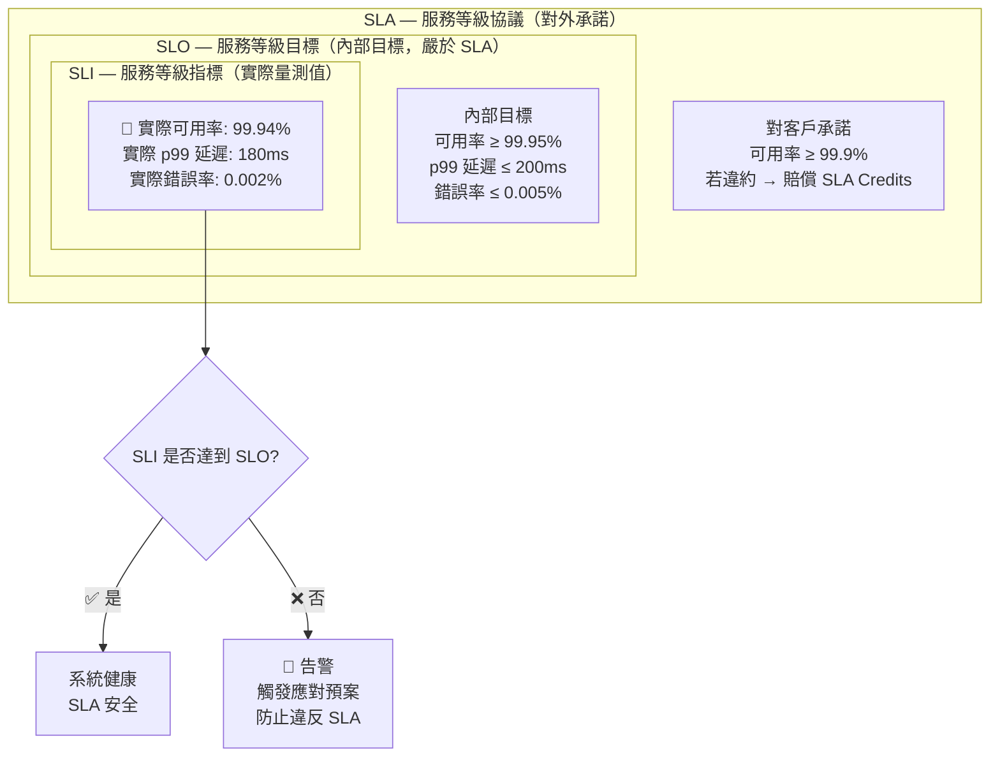

# 圖五：SLA / SLO / SLI 關係圖

> 對應考點：系統穩定性與可用性



## 三個概念的記憶框架

```
SLI（指標）= 實際量測的數字
             └── 例：過去 30 天可用率 = 99.94%

SLO（目標）= 內部設定的期望門檻（比 SLA 嚴）
             └── 例：可用率目標 ≥ 99.95%（對外只承諾 99.9%）

SLA（協議）= 對客戶的正式合約承諾
             └── 例：可用率 ≥ 99.9%，若不達標退費

  順序口訣：「量→標→約」
  I（指標）→ O（目標）→ A（協議）
```

## 🔥🔥 可用性 vs 停機時間換算

| 可用率 | 年停機時間 | 常用於 |
|---|---|---|
| 99% (2個9) | 87.6 小時 | 開發環境 |
| 99.9% (3個9) | 8.76 小時 | 一般 SaaS |
| 99.95% | 4.38 小時 | 生產 AI 系統 SLO |
| 99.99% (4個9) | 52.6 分鐘 | 高可用金融系統 |

**考試陷阱：**
- ❌ 「SLA = SLO」→ 錯！SLO 是內部目標，通常比 SLA **更嚴**（有緩衝帶）
- ❌ 「SLI 就是 SLO」→ 錯！SLI 是實際量測值，SLO 是目標值
