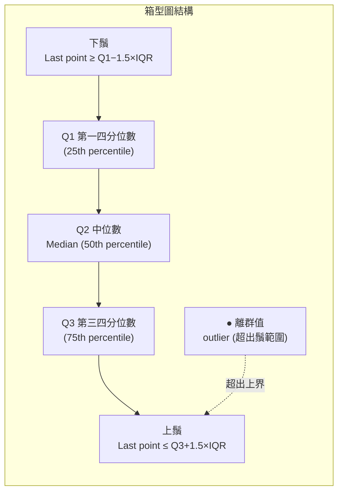

# 箱型圖解剖圖 (Boxplot Anatomy)

## Mermaid 版本



## ASCII 版本

```
                  IQR = Q3 − Q1
        ├─────────────────────────────────┤

  ●        ├──┤═══════════╪══════════════┤──┤        ●
離群值    下鬚  Q1     中位數(Q2)    Q3  上鬚   離群值

  ↑                                              ↑
Q1 − 1.5×IQR                           Q3 + 1.5×IQR
(下圍欄值，fence)                        (上圍欄值，fence)

注意：鬚（whisker）延伸到圍欄內的最後一個資料點，
      不是延伸到圍欄值本身。
```

## 計算範例

資料：[2, 5, 7, 8, 9, 10, 11, 12, 15, 30]（排序後）

| 統計量 | 計算 | 值 |
|--------|------|---|
| Q1 (25%) | 第2.5個值 → (5+7)/2 | 6 |
| Q2 (50%) | 第5.5個值 → (9+10)/2 | 9.5 |
| Q3 (75%) | 第7.5個值 → (11+12)/2 | 11.5 |
| IQR | Q3 − Q1 | 5.5 |
| 下圍欄 | 6 − 1.5×5.5 | −2.25 |
| 上圍欄 | 11.5 + 1.5×5.5 | 19.75 |
| 離群值 | 30 > 19.75 | **30 是離群值** |

> 🔥🔥 考試陷阱：上圍欄 = 19.75，但上鬚 = **15**（資料中 ≤19.75 的最大值），不是 19.75。
