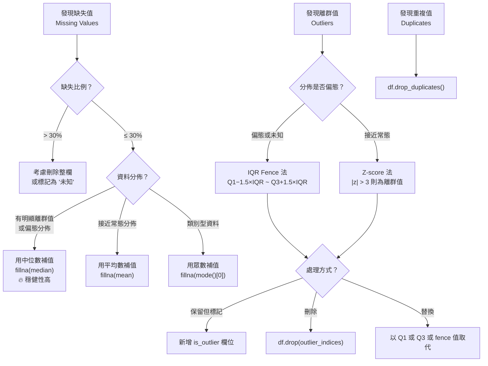

# 數據清理決策流程 (Data Cleaning Decision Flowchart)

## Mermaid 流程圖



## 快速判斷表

| 問題類型 | 偵測方法 | Python 函式 |
|----------|----------|------------|
| 缺失值 | `df.isnull().sum()` | `fillna()` / `dropna()` |
| 離群值（偏態）| IQR fence | 手動計算 Q1/Q3/IQR |
| 離群值（常態）| Z-score ±3σ | `scipy.stats.zscore()` |
| 重複列 | `df.duplicated()` | `df.drop_duplicates()` |
| 資料型別錯誤 | `df.dtypes` | `df.astype()` |

## 考試常見情境

```
情境：「欄位薪資有多個 outlier，分佈明顯右偏，有 5% 缺失值，
       想補缺失值但不受 outlier 影響」
→ 選 fillna(median)
   理由：分佈偏態 + 有 outlier → median 穩健，mean 會被 outlier 拉高
```

> 🔥 記憶：「有離群值/偏態 → 選 median 補值；常態無 outlier → 選 mean 補值」
