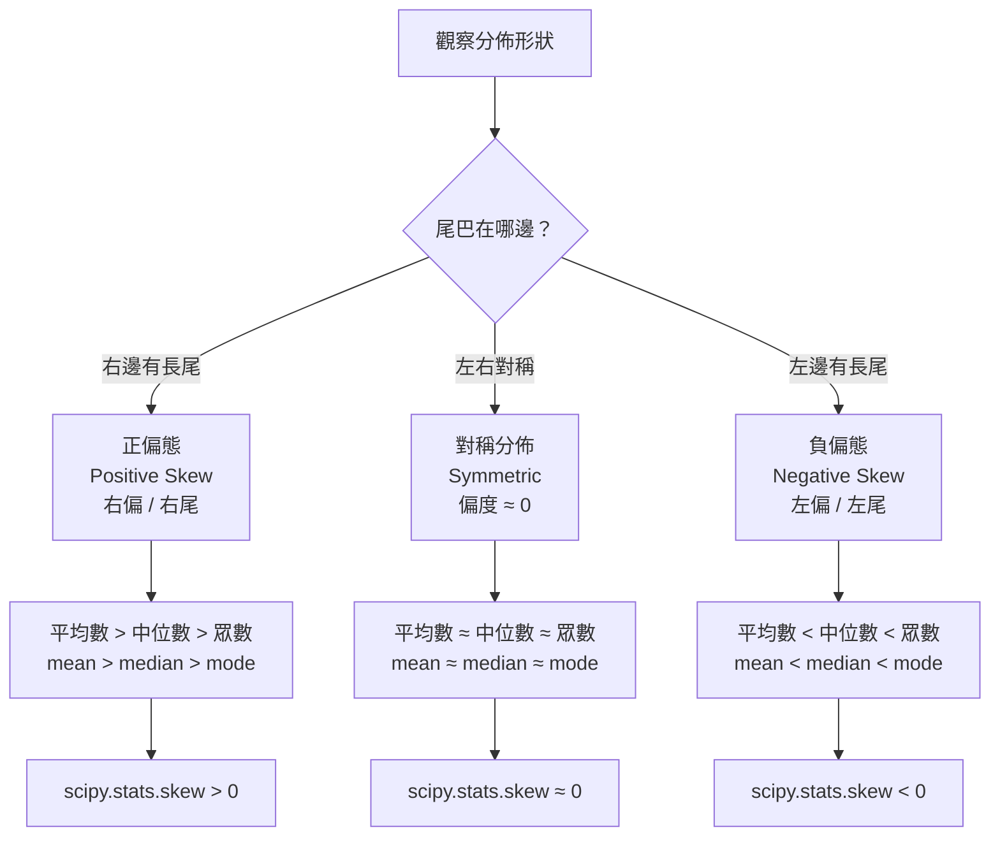

# 偏度方向比較圖 (Skewness Direction Comparison)

## Mermaid 決策樹



## ASCII 分佈曲線比較

```
負偏態（左偏）         對稱（正態）          正偏態（右偏）
Negative Skew         Symmetric             Positive Skew

     ▄█▄                  ▄█▄                    ▄
    ▄███▄                ▄█████▄                ▄███▄
  ▄████████             ██████████           ▄████████▄▄▄
←─────────            ──────────            ─────────────→
   長尾在左                                      長尾在右

mean<median<mode     mean≈median≈mode       mean>median>mode
skew < 0              skew ≈ 0               skew > 0
```

## 記憶口訣

> **「正偏右拉，均數最大；負偏左拉，均數最小」**
>
> - 正偏 → 右邊有人拉（高薪少數拉高平均）→ mean > median
> - 負偏 → 左邊有人拉（低分離群）→ mean < median

## 常見考試情境

| 情境描述 | 偏態類型 | mean vs median |
|----------|----------|----------------|
| 薪資分佈（少數高薪） | 正偏態 | mean > median |
| 考試成績（多數高分，少數爛到爆） | 負偏態 | mean < median |
| 身高分佈 | 對稱 | mean ≈ median |
| 房價分佈（豪宅拉高） | 正偏態 | mean > median |

> 🔥🔥 陷阱：看到「含少數極端高值」→ 正偏 → 選 median 描述中心。
