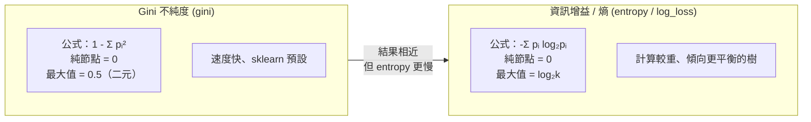

# 決策樹分裂準則比較

```mermaid
flowchart LR
    subgraph Gini["Gini 不純度 (gini)"]
        G1["公式：1 - Σ pᵢ²\n純節點 = 0\n最大值 = 0.5（二元）"]
        G2["速度快、sklearn 預設"]
    end
    subgraph Entropy["資訊增益 / 熵 (entropy / log_loss)"]
        E1["公式：-Σ pᵢ log₂pᵢ\n純節點 = 0\n最大值 = log₂k"]
        E2["計算較重、傾向更平衡的樹"]
    end
    Gini -- "結果相近\n但 entropy 更慢" --> Entropy
```

> sklearn API：`criterion='gini'` | `'entropy'` | `'log_loss'`
> ⚠️ **不存在** `criterion='information_gain'`
