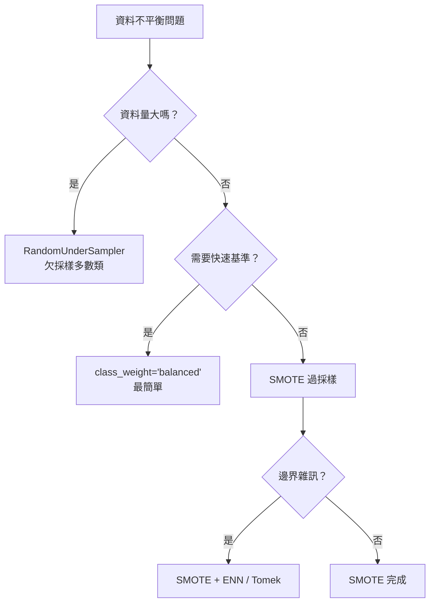

# 資料不平衡處理策略比較

| 策略 | 方法 | 優點 | 缺點 | 適用情境 |
|---|---|---|---|---|
| **過採樣** | SMOTE | 不丟失多數類資料；合成樣本多樣性 | 可能引入雜訊；訓練時間增加 | 資料量充足但少數類稀少 |
| **欠採樣** | RandomUnderSampler | 訓練快速；移除雜訊樣本 | 丟失多數類資訊；可能欠擬合 | 資料量非常大、多數類有冗餘 |
| **類別權重** | `class_weight='balanced'` | 不改變資料分布；實作最簡單 | 不增加少數類樣本數 | 快速基準線；資料量有限 |
| **混合策略** | SMOTE + ENN / Tomek Links | 合成後清理邊界樣本 | 流程複雜 | 追求最佳邊界品質 |

