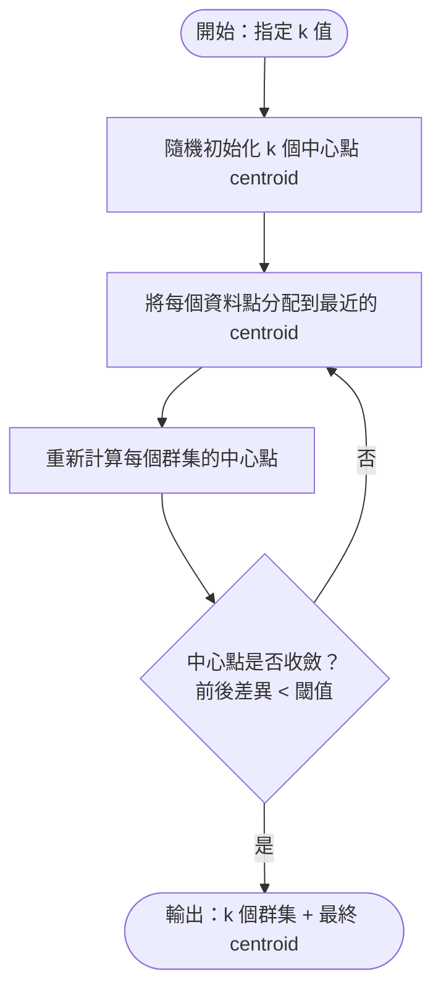

# K-Means 收斂流程

```mermaid
flowchart TD
    A([開始：指定 k 值]) --> B[隨機初始化 k 個中心點 centroid]
    B --> C[將每個資料點分配到最近的 centroid]
    C --> D[重新計算每個群集的中心點]
    D --> E{中心點是否收斂？\n前後差異 < 閾值}
    E -- 否 --> C
    E -- 是 --> F([輸出：k 個群集 + 最終 centroid])
```

**口訣：「初始 → 分配 → 更新 → 重複」**

目標：最小化群內平方和 SSE = Σ Σ ||xᵢ - μₖ||²
