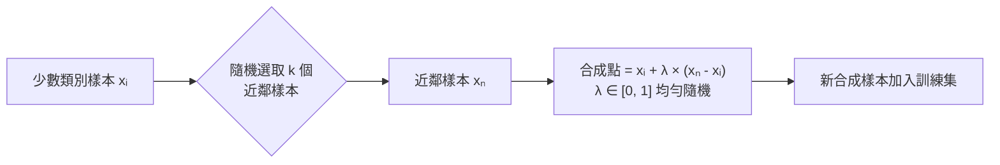

# SMOTE 合成少數類別樣本



> ⚠️ **關鍵規則：SMOTE 只能套用在訓練集（training split）**
> 在切分之後才做 SMOTE → 避免資料洩漏（data leakage）
> SMOTE 僅適用於**數值型特徵**，類別型特徵需先編碼

```python
from imblearn.over_sampling import SMOTE
sm = SMOTE(sampling_strategy='auto', random_state=42)
X_train_res, y_train_res = sm.fit_resample(X_train, y_train)  # 僅對訓練集
```
