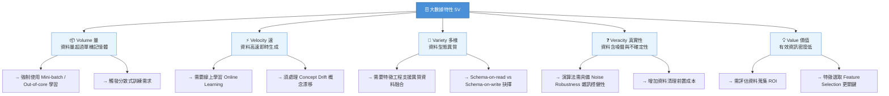

# 圖1：大數據 5V 對機器學習的影響地圖

```mermaid
graph TD
    BD["🗄️ 大數據特性 5V"]

    BD --> V1["📦 Volume 量<br/>資料量超過單機記憶體"]
    BD --> V2["⚡ Velocity 速<br/>資料高速即時生成"]
    BD --> V3["🔀 Variety 多樣<br/>資料型態異質"]
    BD --> V4["❓ Veracity 真實性<br/>資料含噪聲與不確定性"]
    BD --> V5["💡 Value 價值<br/>有效資訊密度低"]

    V1 --> I1["→ 強制使用 Mini-batch / Out-of-core 學習"]
    V1 --> I2["→ 觸發分散式訓練需求"]
    V2 --> I3["→ 需要線上學習 Online Learning"]
    V2 --> I4["→ 須處理 Concept Drift 概念漂移"]
    V3 --> I5["→ 需要特徵工程支援異質資料融合"]
    V3 --> I6["→ Schema-on-read vs Schema-on-write 抉擇"]
    V4 --> I7["→ 演算法需具備 Noise Robustness 雜訊穩健性"]
    V4 --> I8["→ 增加資料清理前置成本"]
    V5 --> I9["→ 需評估資料蒐集 ROI"]
    V5 --> I10["→ 特徵選取 Feature Selection 更關鍵"]

    style BD fill:#4A90D9,color:#fff,stroke:#2C5F8A
    style V1 fill:#E8F4FD,stroke:#4A90D9
    style V2 fill:#E8F4FD,stroke:#4A90D9
    style V3 fill:#E8F4FD,stroke:#4A90D9
    style V4 fill:#E8F4FD,stroke:#4A90D9
    style V5 fill:#E8F4FD,stroke:#4A90D9
```

> **考試重點**：每個 V 對應一個或多個 ML 挑戰，常以「下列哪個大數據特性導致 X 問題？」出題。
