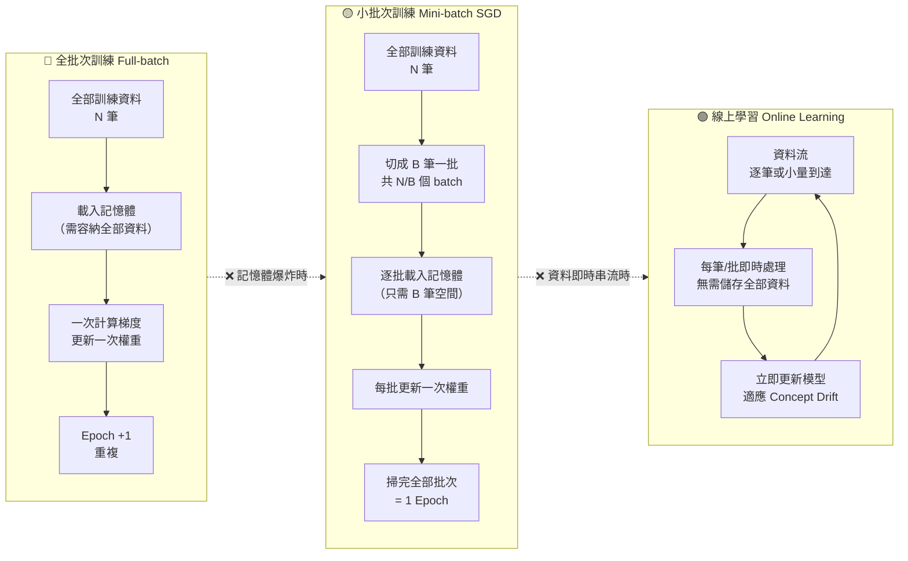

# 圖2：三種訓練模式資料流比較

| | Full-batch | Mini-batch SGD 🔥🔥 | Online Learning 🔥 |
|---|---|---|---|
| 觸發條件 | 小資料集，完全放入記憶體 | 標準大數據 ML 選擇 | 串流資料、需即時更新 |
| 記憶體需求 | 高（全部資料） | 低（僅一個 batch） | 最低 |
| 更新頻率 | 每 epoch 1 次 | 每 batch 1 次 | 每筆/批即時 |
| Concept Drift | 無法適應 | 需重新訓練 | **天生適應** |
