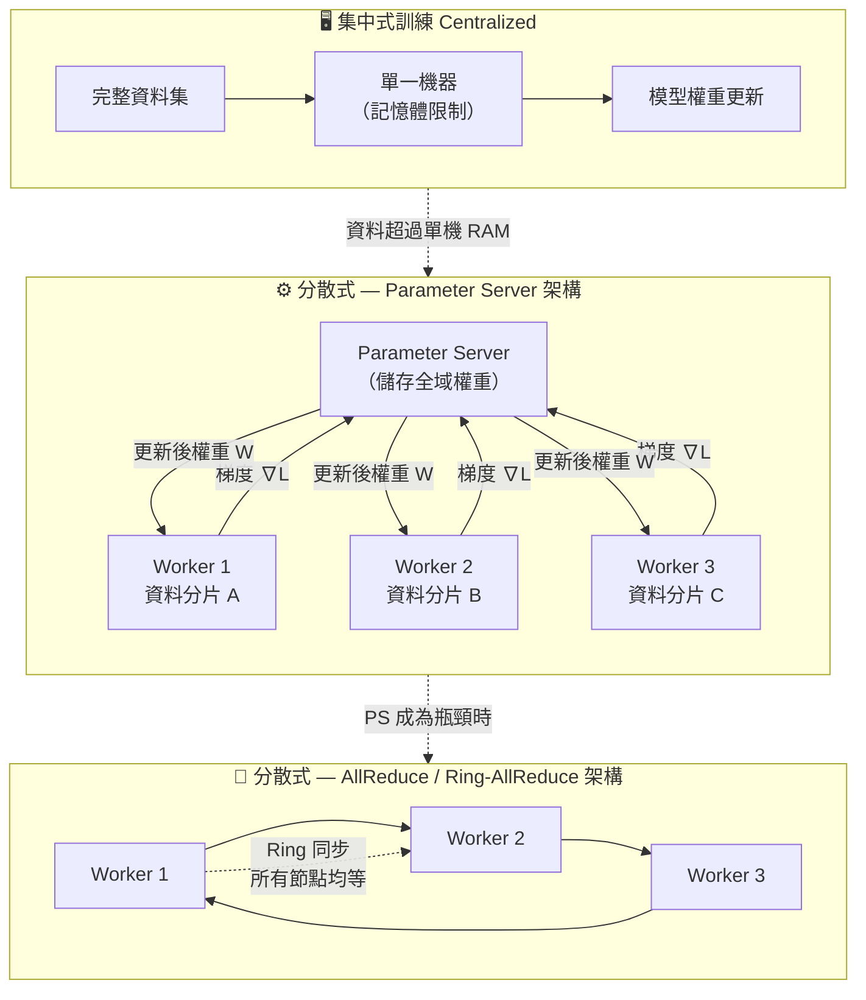

# 圖3：集中式 vs 分散式訓練架構

> **🔥🔥 考試區分重點**
> - **Parameter Server**：有中央協調節點，Worker 傳「梯度」→ PS 聚合 → 傳回「新權重」
> - **AllReduce / Ring-AllReduce**：無中央節點，所有 Worker 地位均等，環狀傳遞聚合
> - **Spark MLlib**：大數據分散式 ML 框架代表，基於資料並行
