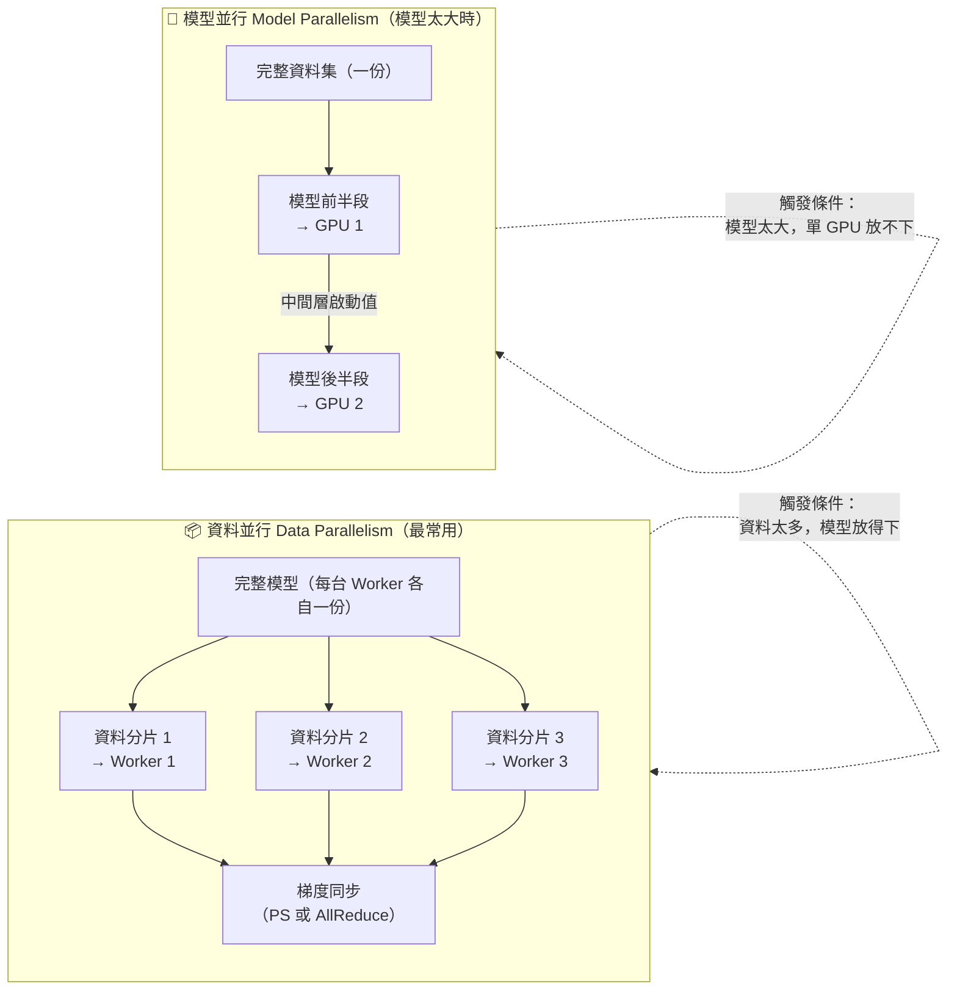

# 圖4：資料並行 vs 模型並行

| | 資料並行 Data Parallelism 🔥🔥 | 模型並行 Model Parallelism |
|---|---|---|
| 觸發情境 | 資料量大，模型可放入單機記憶體 | 模型本身太大，無法放入單一 GPU |
| 每個 Worker 持有 | **完整模型副本** + 資料分片 | **部分模型層** + 完整資料 |
| 常見框架 | Spark MLlib、Horovod、PyTorch DDP | DeepSpeed、Pipeline Parallelism |
| L22 考試範圍 | ✅ 必考 | ✅ 認識即可（觸發條件） |
