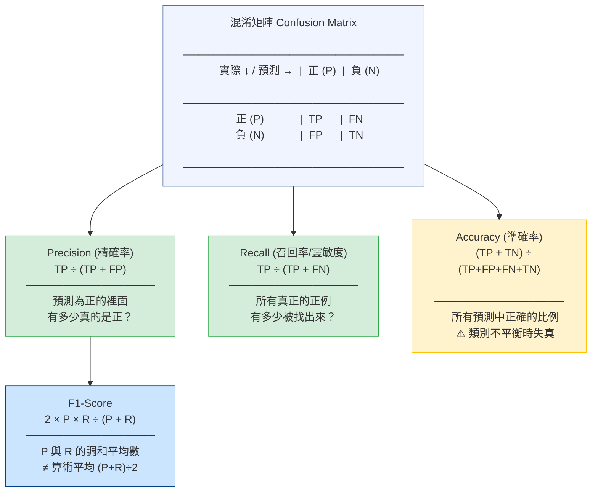

# Diagram 1: Confusion Matrix → Metrics Derivation

## 記憶口訣

| 指標 | 分母是誰？ | 核心問題 |
|------|-----------|---------|
| Precision | TP + FP（預測為正） | 我說正的，對嗎？ |
| Recall | TP + FN（實際為正） | 正的有沒有漏掉？ |
| Accuracy | 全部樣本 | 整體對幾成？ |
| F1 | 調和平均 | 兼顧 P 和 R |
