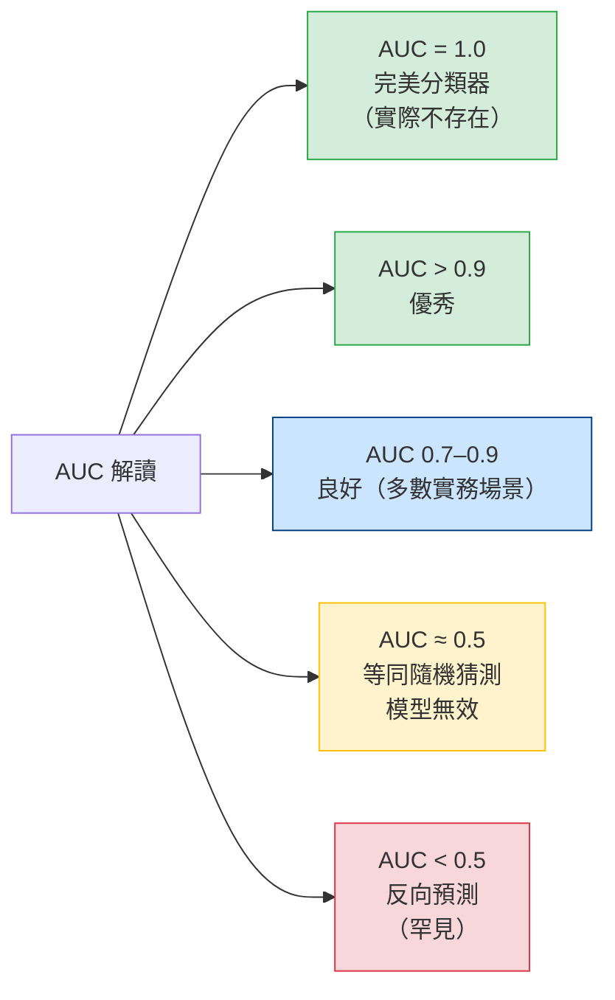

# Diagram 2: ROC Curve & AUC

```
ROC 曲線示意圖
TPR (Recall / 靈敏度)
1.0 |★ 完美分類器 (AUC = 1.0)
    |╲·····················
    | ╲·····  ◆ 典型分類器
    |  ╲···  /  (AUC ≈ 0.8)
    |   ╲·  /
    |    ╲ /
0.5 |     ╳ ← 對角線 = 隨機猜測 (AUC = 0.5)
    |    / ╲
    |   /   ╲
    |  /     ╲
0.0 └──────────────────────
   0.0       0.5       1.0
              FPR (1 - 特異度)
```



## 考試重點
- **X 軸 = FPR**（False Positive Rate = 1 - Specificity），**Y 軸 = TPR**（= Recall）
- AUC = ROC 曲線下面積，值域 [0, 1]
- 曲線越靠近左上角 → AUC 越大 → 模型越好
- 對角線（AUC = 0.5）= 隨機猜測基準線
