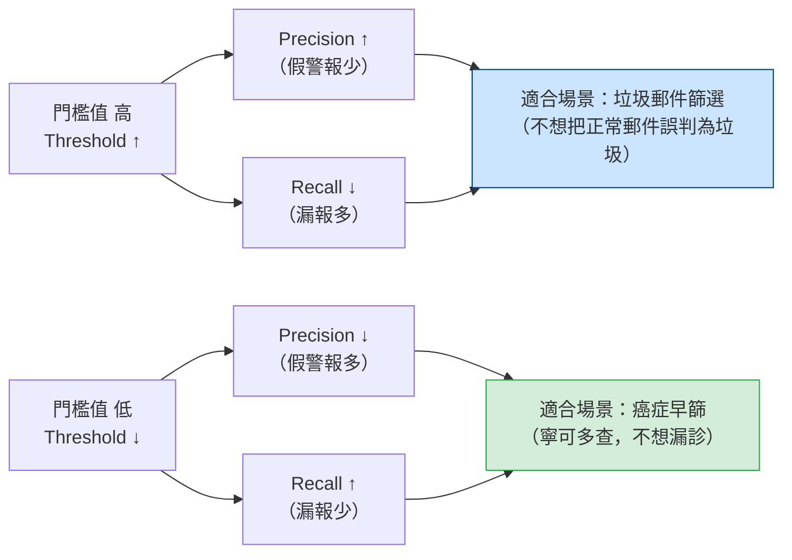

# Diagram 3: Precision–Recall Tradeoff (Threshold Effect)

```
門檻值 (Threshold) 拉高 →

Precision ↑  ────────────────→  更嚴格，只報最確定的正例
Recall    ↓  ←────────────────  漏掉更多真正的正例

門檻值 (Threshold) 拉低 →

Precision ↓  ←────────────────  報了更多假正例
Recall    ↑  ────────────────→  幾乎不漏掉任何正例
```



## 情境選題口訣

| 場景 | 重視 | 理由 |
|------|------|------|
| 詐欺偵測 (Fraud) | F1（兼顧 P & R） | 類別不平衡，Accuracy 失真 |
| 癌症篩查 (Cancer screening) | Recall ↑ | 漏診代價遠高於多查一次 |
| 垃圾郵件 (Spam) | Precision ↑ | 誤判重要信件代價高 |
| 客戶流失 (Churn) | Recall ↑ | 留住每個可能流失的客戶 |
