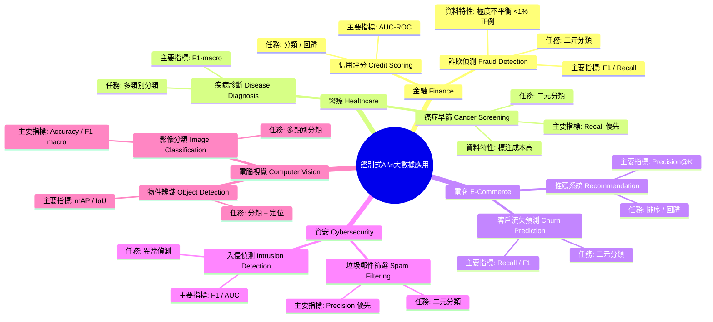

# Diagram 4: Discriminative AI Use-Case Catalogue

```mermaid
mindmap
  root((鑑別式AI\n大數據應用))
    金融 Finance
      詐欺偵測 Fraud Detection
        任務: 二元分類
        主要指標: F1 / Recall
        資料特性: 極度不平衡 <1% 正例
      信用評分 Credit Scoring
        任務: 分類 / 回歸
        主要指標: AUC-ROC
    醫療 Healthcare
      癌症早篩 Cancer Screening
        任務: 二元分類
        主要指標: Recall 優先
        資料特性: 標注成本高
      疾病診斷 Disease Diagnosis
        任務: 多類別分類
        主要指標: F1-macro
    電商 E-Commerce
      客戶流失預測 Churn Prediction
        任務: 二元分類
        主要指標: Recall / F1
      推薦系統 Recommendation
        任務: 排序 / 回歸
        主要指標: Precision@K
    資安 Cybersecurity
      垃圾郵件篩選 Spam Filtering
        任務: 二元分類
        主要指標: Precision 優先
      入侵偵測 Intrusion Detection
        任務: 異常偵測
        主要指標: F1 / AUC
    電腦視覺 Computer Vision
      影像分類 Image Classification
        任務: 多類別分類
        主要指標: Accuracy / F1-macro
      物件辨識 Object Detection
        任務: 分類 + 定位
        主要指標: mAP / IoU
```
