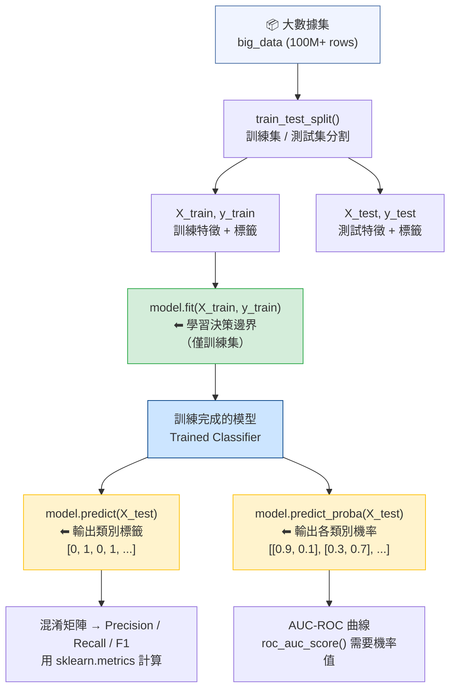

# Diagram 5: sklearn Classification Inference Pipeline

## 考試陷阱：predict vs predict_proba

| 方法 | 輸出 | 用途 |
|------|------|------|
| `.predict(X)` | 類別標籤 `[0, 1, 0]` | 計算 Precision / Recall / F1 / Accuracy |
| `.predict_proba(X)` | 各類別機率 `[[0.9, 0.1], ...]` | 畫 ROC 曲線、計算 AUC |
| `.fit(X, y)` | 無回傳（訓練模型） | **只能用訓練集**，不能用測試集 |
