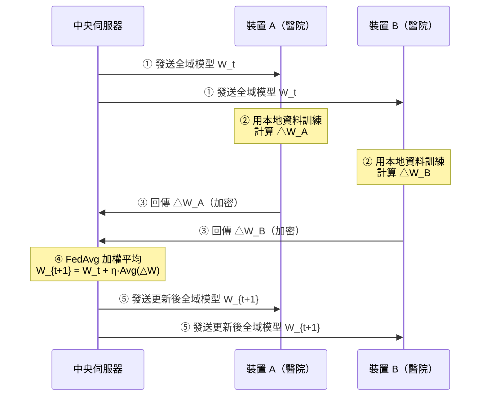

# 聯邦學習架構圖 (Federated Learning Architecture)

## ASCII 架構流程

```
┌─────────────────────────────────────────────────────────────────────┐
│                    聯邦學習（Federated Learning）架構                    │
└─────────────────────────────────────────────────────────────────────┘

  裝置端 / 資料持有方（Clients）         中央伺服器（Central Server）
  ──────────────────────────          ──────────────────────────

  ┌─────────────┐                        ┌──────────────────────┐
  │  醫院 A     │ 本地資料：永不離院        │                      │
  │ 病患資料 🏥  │──┐                      │   全域模型（Global   │
  │ [保留本機]  │  │  ① 下載全域模型        │      Model）         │
  └─────────────┘  │◄─────────────────────│                      │
                   │                      │                      │
  ┌─────────────┐  │  ② 本地訓練           │   ④ 加總聚合         │
  │  醫院 B     │  │     (用本地資料)       │   (FedAvg 加權平均)  │
  │ 病患資料 🏥  │──┤                      │                      │
  │ [保留本機]  │  │  ③ 只上傳模型權重差    │   全域模型更新        │
  └─────────────┘  │     △W（非原始資料）  │       ↓              │
                   │─────────────────────►│   重複 Round 1,2,3…  │
  ┌─────────────┐  │                      └──────────────────────┘
  │  醫院 C     │  │
  │ 病患資料 🏥  │──┘
  │ [保留本機]  │
  └─────────────┘

  關鍵原則：
  ✅ 原始資料（Raw Data）永遠不離開裝置
  ✅ 只傳輸模型更新（△W / Model Weight Diff）
  ⚠️  △W 仍可能被逆向推算 → 需要安全聚合（Secure Aggregation）
```

## 水平 vs 垂直聯邦學習

```
水平聯邦學習（Horizontal FL）        垂直聯邦學習（Vertical FL）
─────────────────────────          ─────────────────────────
同欄位、不同用戶                       同用戶、不同欄位

醫院A:  [用戶1行] [用戶2行]           銀行:  [用戶ID | 信用分 | 帳戶]
醫院B:  [用戶3行] [用戶4行]           電商:  [用戶ID | 購物紀錄]
醫院C:  [用戶5行] [用戶6行]           電信:  [用戶ID | 通話行為]

        ↓ FedAvg 聚合                         ↓ 只交換加密的中間向量
   同一模型，不同資料列                    不同特徵，同一批用戶
```

## Mermaid 流程圖


