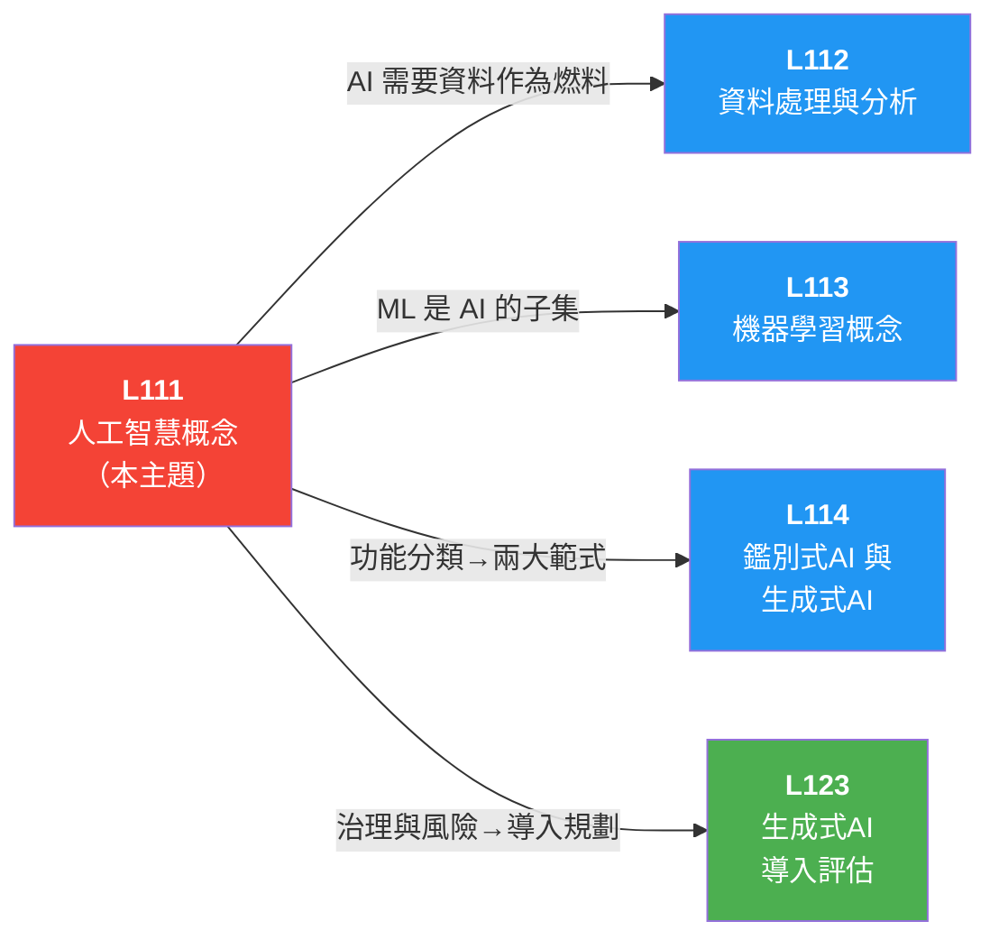

# 📖 L111 人工智慧概念 — iPAS AI（Artificial Intelligence，人工智慧）應用規劃師（初級）學習指南

> 對應評鑑範圍：**L11101 AI 的定義與分類** ＋ **L11102 AI 治理概念**

---

## 0. 關鍵概念總覽圖

> 先鳥瞰整個 L111 的知識地圖，搞清楚所有專有名詞彼此之間的關係，之後讀細節時就不會迷路。

```
🤖 L111 人工智慧概念
│
├── L11101 AI 的定義與分類
│   │
│   ├── 📖 AI 定義
│   │   ├── 讓機器具備「學習、推理、感知、決策」四大能力
│   │   ├── 1956 達特茅斯會議（Dartmouth Conference）誕生（John McCarthy 命名）
│   │   ├── 傳統程式 = 人寫規則 ←→ AI = 從資料學出規則
│   │   └── 例外：專家系統（Expert System）靠人工規則，不需大量資料
│   │
│   ├── 📊 依智慧程度分類
│   │   ├── ✅ 弱 AI / ANI（Artificial Narrow Intelligence）─── 只做特定任務（目前唯一實現）
│   │   │   ├── 例：
│   │   │   │   ├── Siri
│   │   │   │   ├── AlphaGo
│   │   │   │   ├── ChatGPT
│   │   │   │   ├── 人臉辨識（Face Recognition）
│   │   │   │   └── 推薦系統（Recommendation System）
│   │   │   └── 陷阱：ChatGPT/AlphaGo 看起來很強但仍是弱 AI
│   │   ├── ❌ 通用 AI / AGI（Artificial General Intelligence）── 人類等級全科智慧（尚未實現）
│   │   └── ❌ 超級 AI / ASI（Artificial Superintelligence）── 超越人類（僅存於科幻）
│   │   └── ⭐ 弱 AI ≠ 能力差，是指「功能範圍窄」
│   │
│   ├── 🎯 依功能分類
│   │   ├── 分析型 AI（Analytical AI）─── 洞察模式（像偵探）── 異常偵測、客戶分群
│   │   ├── 預測型 AI（Predictive AI）─── 預測未來（像算命師）── 銷售預測、風險評分
│   │   └── 生成式 AI（Generative AI）─── 產生新內容（像畫家）── ChatGPT、DALL-E
│   │
│   ├── 🔧 AI 的實現方式（套娃關係：DL ⊂ ML ⊂ AI）
│   │   │   ⭐ 口訣：「深在機裡，機在 AI 裡」
│   │   │
│   │   ├── 🔵 AI（最外層）
│   │   │   ├── 專家系統（Expert System）
│   │   │   ├── 規則引擎（Rule Engine）
│   │   │   └── 搜索演算法
│   │   ├── 🟢 ML 機器學習（Machine Learning，中間層）── 從資料自動學規則
│   │   │   ├── 代表：
│   │   │   │   ├── 決策樹（Decision Tree）
│   │   │   │   ├── SVM（Support Vector Machine，支持向量機）
│   │   │   │   ├── KNN（K-Nearest Neighbors，K 近鄰演算法）
│   │   │   │   └── 隨機森林（Random Forest）
│   │   │   └── 🟡 DL 深度學習（Deep Learning，最內層）── 多層神經網路，需大量資料
│   │   │       ├── 代表：
│   │   │       │   ├── CNN（Convolutional Neural Network，卷積神經網路）── 影像
│   │   │       │   ├── RNN（Recurrent Neural Network，循環神經網路）/ LSTM（Long Short-Term Memory，長短期記憶網路）── 序列
│   │   │       │   └── Transformer ── 語言
│   │   │       ├── 爆發三支柱：大數據（Big Data）+ GPU（Graphics Processing Unit，圖形處理器） 算力 + 演算法創新
│   │   │       └── Transformer (2017) → LLM（Large Language Model，大型語言模型） → 生成式 AI → AI Agent
│   │   │
│   │   └── 🧠 基礎模型 (Foundation Model)
│   │       ├── 透過多模態（Multimodal）資料（文字、圖像、語音、結構化資料、3D 訊號）預訓練
│   │       ├── 一個模型適應多種下游任務（QA（Question Answering，問答）、情感分析、圖像描述、物件辨識等）
│   │       └── ⭐ 基礎模型的實例：
│   │           ├── GPT（Generative Pre-trained Transformer，生成式預訓練轉換器）
│   │           ├── BERT（Bidirectional Encoder Representations from Transformers，雙向編碼器表示模型）
│   │           └── CLIP（Contrastive Language-Image Pre-training，對比語言-圖像預訓練）
│   │   │
│   │   └── 陷阱：深度學習 ≠ 人工智慧，DL 只是 AI 的一小部分
│   │
│   ├── 📚 學習方式九大分類（必考！）
│   │   ├── ① 監督式學習（Supervised Learning）── 有標籤有答案，分類與迴歸
│   │   ├── ② 非監督式學習（Unsupervised Learning）── 沒標籤找規律，分群/降維/關聯分析
│   │   ├── ③ 半監督式學習（Semi-supervised Learning）── 少量有標籤＋大量無標籤，降低標註成本
│   │   ├── ④ 自監督式學習（Self-supervised Learning）── 資料自己產生訓練訊號，常見於大模型預訓練
│   │   ├── ⑤ 強化學習（Reinforcement Learning）── 獎勵/懲罰/試錯，機器人、自駕、下棋
│   │   ├── ⑥ 遷移學習（Transfer Learning）── 舊模型搬到新任務，資料需求少、訓練快
│   │   ├── ⑦ 聯邦學習（Federated Learning）── 資料不出門，模型出去學，保護隱私
│   │   ├── ⑧ 判別式模型（Discriminative Model）── 分類與預測，學邊界或映射
│   │   └── ⑨ 生成式模型（Generative Model）── 會生新資料，學資料分布（GAN（Generative Adversarial Network，生成對抗網路）、VAE（Variational Autoencoder，變分自編碼器））
│   │   └── ⭐ 考場快判斷：有答案→監督式；沒答案找規律→非監督式；隱私限制強→聯邦學習
│   │
│   ├── 🔀 易混淆學習方式比較
│   │   ├── 聯邦學習（Federated Learning）vs 分散式學習（Distributed Learning）
│   │   │   ├── 聯邦學習目的 = 保護資料隱私（資料不集中、不傳原始資料）
│   │   │   └── 分散式學習目的 = 提升訓練效率（資料可集中、平行處理）
│   │   ├── 半監督式 vs 自監督式
│   │   │   ├── 半監督式 = 少量有標籤＋大量無標籤混用（標註昂貴的分類任務）
│   │   │   └── 自監督式 = 通常無人工標籤，資料本身產生監督訊號（大模型預訓練）
│   │   ├── Batch（批次學習）vs Online（線上學習）vs Incremental Learning（增量學習）
│   │   │   ├── Batch（批次）── 一次整批訓練完再部署
│   │   │   ├── Online（線上）── 資料持續進來就持續更新
│   │   │   └── Incremental（增量）── 在舊知識上補新資料，不必整包重訓
│   │   └── 常見誤判：聯邦學習核心是隱私保護，不是單純分散運算；
│   │       自監督式不是「有一點標籤」，而是資料自己產生監督訊號
│   │
│   └── 📅 發展歷史（三次浪潮 + 兩次寒冬）
│       ├── 1950 ── 圖靈測試（Turing Test，判斷機器是否有智能）
│       ├── 1956 ── 達特茅斯會議（Dartmouth Conference，AI 誕生）
│       ├── 1957 ── 感知機（Perceptron）發明（最早神經網路雛形）
│       ├── 🌊 第一次浪潮 (1956-1974) ── 理論探索、邏輯推理
│       ├── ❄️ 第一次寒冬 (1974-1980) ── 期望過高、經費削減
│       ├── 🌊 第二次浪潮 (1980-1987) ── 專家系統（Expert System）商用化
│       ├── ❄️ 第二次寒冬 (1987-1993) ── 專家系統瓶頸、日本第五代電腦失敗
│       ├── 1997 ── 深藍（Deep Blue）擊敗西洋棋冠軍（搜索式 AI）
│       ├── 2012 ── AlexNet 深度學習突破
│       ├── 🌊 第三次浪潮 (2010s-今) ── 大數據＋算力＋深度學習
│       ├── 2016 ── AlphaGo 4:1 擊敗李世石
│       ├── 2017 ── Transformer 架構發表（Attention Is All You Need）
│       ├── 2022 ── ChatGPT 推出，2個月破億用戶
│       └── 陷阱：AI 寒冬有「兩次」不是一次
│
└── L11102 AI 治理概念
    │
    ├── 🛡️ 負責任 AI（Responsible AI）六大原則（六字訣：公·透·責·隱·安·解）
    │   ├── ⚖️ 公平性（Fairness）─── 不因性別/種族歧視
    │   ├── 🔍 透明性（Transparency）─── 決策過程可被理解
    │   ├── 📋 可問責（Accountability）─── 出事有人負責
    │   ├── 🔒 隱私保護（Privacy）── 個資不被濫用
    │   ├── 🛡️ 安全性（Safety）─── 不造成傷害
    │   └── ⭐ 可解釋性（Explainability）── XAI（Explainable AI，可解釋人工智慧）
│       ├── 技術：
│       │   ├── LIME（Local Interpretable Model-agnostic Explanations，局部可解釋模型無關解釋）
│       │   └── SHAP（SHapley Additive exPlanations，沙普利加法解釋）
│       │   └── 反事實解釋（Counterfactual Explanation）── 如果改變哪個特徵，結果會不同？
    │       └── 高頻考點：金融/醫療等高風險場域尤其重視
    │
    ├── AI 偏誤（AI Bias，四大來源）
    │   ├── ① 資料收集偏誤（Data Collection Bias）── 樣本不均衡
    │   ├── ② 標註偏誤（Labeling Bias）──── 標註者主觀判斷
    │   ├── ③ 演算法偏誤（Algorithmic Bias）── 模型放大既有偏見
    │   ├── ④ 部署偏誤（Deployment Bias）──── 使用情境與訓練不同
    │   ├── ⑤ 代理變數（Proxy Variable）──── 看似中立的變數（郵遞區號）暗藏歧視
    │   ├── 後果：貸款歧視、招聘不公、司法偏見
    │   └── 陷阱：DL 不會自動消除偏誤，反而可能放大
    │
    ├── 🤝 FAT（Fairness, Accountability, Transparency，公平、問責、透明）信任三原則
    │   ├── Fairness（公平）── 不歧視
    │   ├── Accountability（問責）── 出錯有人扛
    │   └── Transparency（透明）── 決策可被理解
    │
    ├── 👤 HITL（Human-in-the-Loop，人機協作）
    │   ├── AI 輔助人類決策，「不取代」人類
    │   └── 高風險場域（醫療、金融、司法）必須有人類監督
    │
    ├── 🇪🇺 歐盟 AI 法案（EU（European Union，歐洲聯盟） AI Act）── 2024/8/1 生效
    │   ├── 全球首部全面性 AI 監管法規
    │   ├── 風險四級：
    │   │   ├── 🚫 不可接受 ── 社會評分系統、即時生物辨識（全禁）
    │   │   ├── 高風險 ──── 教育·招聘·醫療·司法·信用評分（嚴審）
    │   │   ├── 📋 有限風險 ── 聊天機器人·Deepfake（需揭露為 AI）
    │   │   └── ✅ 最低風險 ── AI 遊戲·垃圾郵件過濾（無限制）
    │   ├── ⚡ 有「域外效力」── 在歐盟使用就須遵守，不限公司所在地
    │   ├── 🌍 布魯塞爾效應（Brussels Effect）── 歐盟法規實質成為全球黃金標準
    │   ├── 📎 GPAI（General-Purpose AI，通用人工智慧）特別規範 ── 通用 AI 須遵守著作權、公開訓練資料摘要
│   ├── 🛡️ C2PA（內容出處和真實性聯盟）── 數位內容溯源與防偽浮水印標準
    │   ├── 罰則：最高全球年營收 7% 或 3,500 萬歐元
    │   └── 陷阱：GDPR（General Data Protection Regulation，通用資料保護規則） 保護「個資」≠ EU AI Act 規範「AI 系統」
    │
    ├── 🇹🇼 台灣 AI 法規
    │   ├── 📘 數位發展部 ── 《公部門 AI 應用參考手冊》(115.02)
    │   ├── 📗 金管會 ────── 《金融業 AI 指引》(114.11)
    │   │   ├── 核心：以「風險」為基礎管理，六大章節，強調可解釋性
    │   │   └── 三大天條：更嚴格的公平性·更嚴格的強健性·更高層級的責任
    │   ├── 📙 經濟部產發署 ── 《AI 導入指引》
    │   └── 📕 《AI 產品與系統評測》
    │
    ├── 🏛️ 主權 AI（Sovereign AI）
    │   ├── 國家對 AI 基礎設施、數據、模型的自主控制權
    │   ├── 三大積木：算力在地化 + 資料不離境 + 本土模型（TAIDE（Trustworthy AI Dialogue Engine，可信賴 AI 對話引擎））
    │   └── 數位韌性（Digital Resilience）── 遇網路攻擊或技術封鎖能快速恢復
    │
    └── 🔐 隱私保護技術（Privacy-Preserving Techniques）
        ├── 資料匿名化（Data Anonymization）── 移除個人識別資訊（基礎）
        ├── 差異化隱私（Differential Privacy）── 即使拿到報告也無法反推個人（進階）
        └── 內部署（On-premise）── 企業機密不離開自家機房
```

---

## 1. 關鍵術語與定義

### 1-1 AI 基礎定義與層級（AI Fundamentals & Hierarchy）

> 📝 **一句話速記**：深度學習（DL）是機器學習（ML）的一部分，ML 又是人工智慧（AI）的一部分；現在的 AI 都是弱 AI（ANI）。

> ```
> 層次關係圖：AI 的套娃層次與智慧等級
>
> 🔄 技術層次（像俄羅斯套娃）
> ├── AI (人工智慧) ── 最外層，讓機器模擬人類智能（包含不用資料的專家系統）
> │   └── ML (機器學習) ── 中間層，不用人工寫規則，讓機器自己從資料中找規律
> │       └── DL (深度學習) ── 最內層，模仿人類大腦神經網路，專攻影像語音文本
>
> 🧠 智慧等級（能力範圍）
> ├── 弱 AI (ANI) ── 專精單一任務（如下棋、翻譯、畫圖），目前所有的 AI 都在這層
> ├── 通用 AI (AGI) ── 具備人類等級的通用智慧，什麼任務都能學會（尚未實現）
> └── 超級 AI (ASI) ── 智慧超越人類，能發明比相對論還厲害的理論（僅存科幻）
>
> 🎯 功能分類（這 AI 是拿來幹嘛的？）
> ├── 分析型 (Analytical) ── 負責找規律、挑毛病（異常偵測、客戶分群）
> ├── 預測型 (Predictive) ── 負責算未來（銷售預測、信用評分）
> └── 生成式 (Generative) ── 負責無中生有（ChatGPT 寫作、Midjourney 畫圖）
> ```
>
> 一句話串起來：**AI 是一個大傘，裡面包含了從資料學習的 ML，和神經網路架構的 DL；不管它能生成文章還是預測未來，只要只能做特定任務，就是還沒達到 AGI 的弱 AI。**

> 🗣️ **為什麼要分這麼多層與詞彙？什麼時候需要？**
>
> 外行人常把「AI、機器學習、深度學習」混為一談，但它們涵蓋範圍不同。如果你要寫一套「報稅軟體」，規則非常死，人工輸入法規就好（專家系統，屬於 AI 但非 ML）。如果你要「找出哪些信是垃圾信」，規則很難訂，你會拿過去的信件讓機器自己學（ML）。如果你要「辨識照片裡是不是貓」，特徵太複雜，就必須動用多層神經網路（DL）。
>
> **AI 智慧等級比喻對比表：**
> | 等級 | 角色設定 | 說明與現狀 |
> |------|---------|-----------|
> | 弱 AI (ANI) | 專才員工 | 只會做交代的一件事（如 AlphaGo 只會下圍棋不會煮飯），**現階段所有 AI 都是 ANI**。 |
> | 通用 AI (AGI)| 全才通才 | 像一個正常人，遇到沒學過的任務也能舉一反三學會，**目前尚未實現**。 |
> | 超級 AI (ASI)| 神級超人 | 智慧遠超全人類大腦總和，**目前只在電影裡**。 |

**① 技術的包容關係**

- **AI (人工智慧 / Artificial Intelligence)** — 核心目標是讓機器具備「感知、推理、學習、行動」四大能力。包含早期的「符號式 AI」與現代的「數據驅動 AI」。
- **ML (機器學習 / Machine Learning)** — 讓機器有了「學習」能力。不靠人類一條條寫 `if-then` 規則，而是給模型一堆資料，讓它自己找出函式規律（$y = f(x)$）。
- **DL (深度學習 / Deep Learning)** — ML 的特種部隊。使用多層人工神經網路（神經元），解決非線性、高維度（影像、語法）的複雜問題。

**② 依智慧程度分類**

- **ANI (弱 AI / Narrow AI)** — 聚焦於解決**單一特定領域**的問題。即使它在下圍棋打敗了人類冠軍，它依然是弱 AI。
- **AGI (通用 AI / General AI)** — 被業界視為 AI 發展的聖杯，具備廣泛的認知能力。
- **ASI (超級 AI / Superintelligence)** — 超級智慧理論。

**③ 依功能分類**

- **分析型 AI（Analytical AI）** — 像偵探，負責在既有資料中「找線索」，如詐騙偵測。
- **預測型 AI（Predictive AI）** — 像算命仙，基於歷史「算未來」，如預測哪支股票會漲。
- **生成式 AI（Generative AI）** — 像藝術家或作家，能創造出「全新的」圖文影音，如 ChatGPT。

> ⚠ **考試速記 & 常見陷阱**：
>
> - 陷阱：**ChatGPT 看起來什麼都會回答，所以它已經是通用 AI (AGI)？錯！** 所有的 LLM 目前都還是只精通「文字接龍（文字生成）」的**弱 AI (ANI)**。
> - 陷阱：**深度學習 = 人工智慧？錯！** 深度學習只是 AI 裡面的一小塊。專家系統是 AI，但不是機器學習也不是深度學習。
> - 考題愛考大小關係，必背套娃順序：**AI 包含 ML，ML 包含 DL**。

### 1-2 AI 發展歷史與早期方法（History & Early Approaches）

> 📝 **一句話速記**：達特茅斯會議誕生 AI，經歷兩次寒冬後靠「大數據＋算力＋演算法」迎來第三次浪潮。

> ```
> 層次關係圖：AI 超過一甲子的起落
>
> 🌊 第三次浪潮的成功方程式
> 現今 AI 爆發 = 演算法 (DL神經網路) + 燃料 (大數據 Big Data) + 雙引擎 (GPU 強大算力)
>
> ⏳ 歷史重大事件時間軸
> ├── 1950：圖靈測試 (Turing Test) ── 提出評估機器智能的標準
> ├── 1956：達特茅斯會議 ── 正式定名 "Artificial Intelligence"，AI 誕生 🎉
> ├── 1957：感知機 (Perceptron) ── 神經網路的老祖宗誕生
> │   ↓ (無法解決 XOR 非線性問題)
> ├── ❄️ 第一次 AI 寒冬 (1970s) ── 遇上硬體瓶頸與邏輯死胡同
> │   ↓
> ├── 1980s：專家系統 (Expert System) 時代 ── 第二次浪潮，把人類知識寫成規則讓電腦跑
> │   ↓ (規則寫不完、維護成本太高)
> ├── ❄️ 第二次 AI 寒冬 (1980末-1990初) ── 商用化失敗，經費結凍
> │   ↓
> ├── 1997：深藍 (Deep Blue) ── 靠暴力搜索演算法擊敗西洋棋世界冠軍
> ├── 2012：AlexNet ── 深度卷積神經網路在影像辨識大勝，引爆第三次浪潮 🌊
> ├── 2016：AlphaGo ── 4:1 擊敗人類圍棋冠軍（深度強化學習）
> └── 2017+：Transformer 模型發表，開啟 2022 以後 ChatGPT 生成式 AI 狂潮
> ```
>
> 一句話串起來：**圖靈提問、達特茅斯命名，AI 經歷了「第一次寒冬（算不出來）」跟「第二次寒冬（專家規則寫不完）」，直到 2012 年「演算法、大數據、GPU」三大支柱到位，終於迎來神經網路的第三次大爆發。**

> 🗣️ **為什麼會有寒冬？前人是怎麼做 AI 的？**
>
> 早期的人做 AI 走的是「符號式 AI（Symbolic AI）」路線，最著名的就是**專家系統**。想像你想做一個看病 AI，工程師就去問醫生，然後寫成程式碼：「`If` 體溫>38度 `And` 流鼻水 `Then` 判斷是感冒」。
> 這套方法在規則明確的地方（如西洋棋）很強，所以「深藍」贏了；但現實世界太複雜，醫生不可能把所有看病直覺都寫成 `If...Then` 規則。當人們發現「規則根本寫不完、系統一遇到特例就當機」，投資人覺得被騙了撤資，這就導致了**第二次 AI 寒冬**。
> 直到後來大家放棄人工寫規則，改讓機器自己看成千上萬張 X 光片去找規律（機器學習），AI 才真正起飛。
>
> **新舊 AI 決策方法的對比：**
> | 時代 | 方法論代表 | 特色與缺陷 |
> |------|-----------|----------|
> | 早期 (符號式) | **專家系統 / 規則引擎** | 人類決定規則，餵給機器執行。缺陷：極度脆弱，無法應對模糊邊界。 |
> | 現代 (資料驅動)| **機器學習 / 深度學習** | 餵給機器資料與答案，機器自己找出隱藏的規則。缺陷：需要龐大算力與乾淨資料。 |

**① 啟蒙與誕生**

- **圖靈測試 (Turing Test)** — 如果一台機器能和人類隔著牆對話，而人類分辨不出對方是人還是機器，這台機器就算通過了圖靈測試，具備智能。
- **達特茅斯會議 (Dartmouth Conference, 1956)** — 史詩級會議，確立了 AI 的名稱。
- **感知機 (Perceptron)** — 現代深度神經網路的數學模型雛形。但當初被數學證明無法解決最簡單的非線性問題（XOR），直接導致第一次 AI 寒冬。

**② 跌宕起伏的發展**

- **第一/第二次 AI 寒冬 (AI Winter)** — 伴隨著期望落空與技術瓶頸，導致學術研究經費遭大幅刪減的黑暗期。歷史上總共有兩次。
- **專家系統 (Expert System)** — 第二次浪潮的主角。將各領域人類專家的死知識編程為規則庫。不具備自學能力。
- **深藍 (Deep Blue, 1997)** — 徹底解決下棋問題。但它用的是傳統的「搜索式 AI（看懂所有棋盤走法算分）」，而不是後來的深度學習。

**③ 第三次浪潮的三大支柱**

- **大數據 (Big Data)** — 網路時代帶來海量可供學習的數位痕跡與標註資料。
- **GPU 算力 (Graphics Processing Unit)** — 原本用來打電動的顯示卡，因為極度擅長「矩陣平行運算」，完美契合了深度神經網路的計算需求（Nvidia 股價起飛的原因）。
- **演算法突破** — AlexNet 證明了深度卷積神經網路的威力。

> ⚠ **考試速記 & 常見陷阱**：
>
> - 陷阱題：世界上只有一次 AI 寒冬。**錯！有兩次！**
> - 第三次 AI 浪潮爆發的三大支柱缺一不可：**大數據、GPU 算力、演算法（深度神經網路）**。
> - 專家系統（Expert System）和規則引擎（Rule Engine）是**不需要大量訓練資料**的，它是靠人類事先輸入好的邏輯。
> - 圖靈測試是判斷機器有無智能的方法，而第一次提出 AI 這個名詞的地方是 **1956 年達特茅斯會議**。

### 1-3 學習方式與訓練策略（Learning Paradigms & Training Strategies）

> 📝 **一句話速記**：有標籤→監督式，沒標籤找規律→非監督式，獎懲試錯→強化學習，保護隱私→聯邦學習。

> ```
> 層次關係圖：AI 如何獲取知識的九大門派
>
> 🧠 基礎學習三本柱（必考）
> ├── 1. 監督式學習 (Supervised) ── 有標準答案（標籤） → 做分類、預測房價
> ├── 2. 非監督式學習 (Unsupervised) ── 毫無答案，自己摸索 → 做分群、找關聯、降維
> └── 3. 強化學習 (Reinforcement) ── 在環境中試錯找獎勵 → 下圍棋、機器狗學走路
>
> 🧬 進階混合學習（應對資料不足）
> ├── 4. 半監督式學習 (Semi-supervised) ── 少量有答案 + 大量沒答案（省人工標籤費）
> ├── 5. 自監督式學習 (Self-supervised) ── 把資料自己的一部分遮起來當答案猜（LLM 預訓練的絕招）
> └── 6. 遷移學習 (Transfer) ── 讀完大學再去學專長（把大模型拿來 Fine-tuning 微調）
>
> 🏰 訓練架構（保護資料）
> ├── 7. 聯邦學習 (Federated) ── 各練各的，只傳達摩武功心法（模型參數），保密防諜！
> └── 分散式學習 (Distributed, 比較用) ── 資料大家看，純粹為了切小塊算得比較快
>
> 🗂️ 模型的本質分類
> ├── 8. 判別式模型 (Discriminative) ── 畫出邊界線：「這是貓還是狗？」
> └── 9. 生成式模型 (Generative) ── 學會畫畫：「生出一張貓的照片！」
> ```
>
> 一句話串起來：**機器學習法門多：有答案就用「監督式」學分類，沒答案就「非監督式」學分群，想學自駕就靠「強化學習」；現在流行省錢的「半/自監督」，以及保護隱私把資料藏醫院裡的「聯邦學習」。**

> 🗣️ **為什麼要分這麼多學習方式？什麼時候需要哪個？**
>
> 因為「人工幫資料貼標籤（Labeling）」超級貴！要請幾萬名醫生看幾千萬張肺部 X 光片貼上「有肺癌/無肺癌」，要花幾十年跟幾億美金。
> 所以如果有錢有答案，當然用最準的**監督式學習**；如果沒錢貼標籤，想自動把顧客分 VIP 和窮鬼，就交給**非監督式學習**自己圈群體；如果是要開發 ChatGPT，連題目跟答案都不知道怎麼訂，直接讓它讀完整個網路的文章「玩文字接龍（遮住下一個字當作答案）」，這叫**自監督式學習**。
>
> **解題情境對比表：**
> | 應用場景描述 | 應該用什麼學習法？ | 核心判斷理由 |
> |------------|------------------|-------------|
> | 過濾垃圾信件、預測明天股價是多少 | **監督式** | 歷史資料都有明確的解答（這封是不是垃圾、昨天確實是漲跌多少） |
> | 超市想把買啤酒的人跟什麼商品擺在一起 | **非監督式** | 購物籃關聯分析（Apriori）不知道最終目的是什麼，純找關聯。 |
> | 訓練一隻電動裡的瑪利歐自己通關 | **強化學習** | 沒有人有一步一步的正確答案，只有終點的獎勵分數。 |
> | 各家不同銀行想合作訓練防洗錢 AI，但金管會不准他們互相傳輸客戶刷卡紀錄 | **聯邦學習** | 資料絕不離開本地（機房），只能傳送模型訓練好的梯度參數。 |

**① 基礎訓練三本柱**

- **監督式學習 (Supervised Learning)** — 給定 $X$ (特徵) 和明確的 $Y$ (答案/標籤)。任務是找出一條能準確把 $X$ 對應到 $Y$ 的線。
  - 用途：**分類 (Classification)** (離散答案，如貓/狗)、**迴歸 (Regression)** (連續答案，如房價 1500 萬)。
- **非監督式學習 (Unsupervised Learning)** — 只有一堆 $X$，完全沒有答案 $Y$。
  - 用途：**分群 (Clustering)** (把長得像的湊一堆)、**降維 (Dimensionality Reduction)** (把 100 個特徵壓縮成 3 個重點)。
- **強化學習 (Reinforcement Learning)** — 透過環境 (Environment)、狀態 (State)、行動 (Action) 與獎勵 (Reward) 的機制，讓一個代理人 (Agent) 在試錯中自己找出獲取最大利益的策略。AlphaGo 打敗人類就是靠這個。

**② 偷吃步的進階學習。**

- **半監督式學習 (Semi-supervised Learning)** — 手上有 100 張有標籤的病歷，和 10,000 張沒標籤的病歷。先用那 100 張教模型，再讓模型去猜那 1 萬張的答案（偽標籤），混在一起繼續練。大幅降低標註成本。
- **自監督式學習 (Self-supervised Learning)** — LLM (大型語言模型) 的核心武功。把文章裡的某一小塊遮住，讓模型去猜遮住的是什麼。因為遮住的部分原本是已知的，所以「資料自己就成了自己的監督老師」。
- **遷移學習 (Transfer Learning)** — 先讓模型讀完百科全書擁有基礎常識（預訓練模型），再花一點點時間教它專門的醫學知識（Fine-tuning 微調）。避免每次訓練都要從零開始的龐大開銷。

**③ 部署與更新機制**

- **批次學習 (Batch Learning)** — 集齊所有歷史資料一次性把模型練好定案。若要更新只能全部重新打掉重練一次。
- **線上學習 (Online Learning)** — 資料像是串流一樣源源不絕湧入（如即時股價），模型可以一邊吸資料一邊隨時自我調整變化。
- **增量學習 (Incremental Learning)** — 只拿「新資料」去補習，不會遺忘原來已學過的學問。
- **聯邦學習 (Federated Learning)** — 為了**不洩漏隱私**，各分行用自己的資料在自己的伺服器訓練本地 AI，然後只把「訓練好的經驗法則參數」上傳給總部匯總成一個大模型。
  > 🗣️ 這與**分散式學習 (Distributed Learning)** 不同。分散式單純是因為總部資料太大算不完，切塊分給 10 台機器算，資料還是給別人看了，沒有保護隱私的功能。

**④ 模型的算計邏輯**

- **判別式模型 (Discriminative Model)** — 它不在乎一隻貓為什麼長這樣，它只在乎「貓跟狗中間這條楚河漢界該劃在哪裡才能把它們分開」。用來做分類。
- **生成式模型 (Generative Model)** — 努力學習「所有貓長相的機率分布特徵」。一旦學會了，它就能隨機抽樣，平地摳出一張「從不存在的貓照片」。

> ⚠ **考試速記 & 中英文陷阱**：
>
> - 考題愛考分類與分群：只要有標籤答案（如知道這是貓/狗）就是歸類在**分類（監督式）**；沒有標籤想分 VIP 客戶就是歸類在**分群（非監督式）**。
> - 只要看到「保護隱私」、「各家醫院/公司合作不透露客戶資料」，請秒選 **聯邦學習 (Federated Learning)**。聯邦學習傳輸的是「模型更新參數」，**絕對不會傳輸原始資料**。
> - 看到「降低人工標註成本」，請選 **半監督式 (Semi-supervised)**。看到「資料遮蓋自我預測」，請選 **自監督式 (Self-supervised)**。這兩個常考二選一。

### 1-4 關鍵技術與架構（Key Technologies & Architectures）

> 📝 **一句話速記**：CNN 看圖形、RNN 看時間序列、Transformer 搞定一切語言；RAG 讓大腦上網看小抄。

> ```
> 層次關係圖：神經網路工具箱演化史
>
> 🧠 核心深度學習神經網路架構
> ├── 1. 傳統 ML：決策樹、SVM、隨機森林（處理一般表格資料很夠用）
> │
> ├── 2. CNN (卷積神經網絡) ── 視覺大師 👁️
> │      └── 機制：用卷積核慢慢滑過，抓出各種局部小特徵（貓耳、貓眼）。
> │
> ├── 3. RNN / LSTM (循環神經網路) ── 記憶體大師 ⏱️
> │      └── 機制：處理有順序性的東西（講話、股價），它會記住前一秒發生的事。
> │      └── 致命傷：文章太長它就會「遺忘（梯渡消失）」，只能逐字讀，訓練超慢。
> │
> └── 4. Transformer 架構 (2017 Google 神作) ── 語言大宇宙 🌐
>        ├── 機制：注意力機制 (Self-Attention)。一次看完整句話「同時」算出每個字跟其他字的距離關係。
>        ├── 解碼器 (Decoder) 半邊 ── GPT 系列：擅長一直寫下去（生成字句）。
>        └── 編碼器 (Encoder) 半邊 ── BERT 系列：擅長看前後文讀懂意思（克漏字、分類理解）。
>
> 🛠️ LLM (大型語言模型) 時代的全套配件
> ├── 基礎模型 (Foundation Model) ── OpenAI 練好的一個博學大學生（如 GPT-4）。
> ├── Prompt (提示工程) ── 你對大學生下達任務的方法與語氣。
> ├── RAG (檢索增強生成) ── 給大學生發手機上網查今天新聞（解決模型只知道 2023 年以前的事的痛點）。
> └── AI Agent (代理人) ── 直接叫大學生「去幫我訂明天的機票」，他會自己查網頁、點滑鼠、刷卡。
> ```
>
> 一句話串起來：**以前看圖用 CNN、看時間序列用 RNN；直到 2017 出了 Transformer 靠注意力機制解決了長文遺忘，進而催生出 GPT 這類基礎大模型。模型不知道最新消息，我們就外掛 RAG 讓它開卷考試；要它自己去完成複雜專案，就升級成 Agent。**

> 🗣️ **為什麼有了 LSTM 還要發明 Transformer？什麼時候需要 RAG？**
>
> RNN 就像一個患有短暫記憶喪失的人在讀書，你念到第 100 頁，他就忘了第 1 頁在寫什麼。而且它必須「一個字一個字循序漸進得讀」，沒辦法用 GPU 同時加速讀。
> 2017 年改變世界的一天，Google 發明了 Transformer，它把整篇 1 萬字一次攤開，用「**注意力（Attention）**」算數，發現第 955 頁的「他」指的竟然是第 3 頁出現的「小明」。這顛覆了文字處理的極限！
> 但你花了半年幾千萬美金把 GPT 練好，它就只會背誦訓練截止日期的事，如果你問它「昨天颱風哪裡放假？」它就會發瘋開始胡說八道（幻覺）。這時候我們不需要把 GPT 重訓，只要在旁邊給它一個最新法典（資料庫），逼它回答前先翻書，這就是 **RAG（檢索增強生成）**。
>
> **AI 網路架構選用對比：**
> | 我有一份資料... | 應該推薦用什麼網路架構吃？ |
> |---------------|------------------------|
> | 10萬張腫瘤 X 光片，找出癌症位置 | **CNN (卷積神經網路)**，影像一律歸它管。 |
> | 台積電過去十年的每秒股價變化趨勢 | **RNN (或進化版 LSTM) / Transformer**，跟時間發展有關的序列。 |
> | 一篇 100 頁的法律合約要求摘要重點 | **基於 Transformer 的 LLM (大型語言模型)** |
> | 公司的內部秘密財務報表，要讓 AI 回答問題 | **LLM ＋ RAG (檢索增強生成)**，因為你不能把公司圖表交給外部訓練，只能即時外掛當小抄。 |

**① 傳統好用的機器學習模型 (ML Models)**

- **決策樹 (Decision Tree)** — 像玩「終極密碼」一路用 Yes/No 判斷下去。可解釋性極高，你可以清楚看到它為何說不核准你的貸款。
- **隨機森林 (Random Forest)** — 覺得一棵決策樹容易走偏鋒死背（過擬合），我們就種 100 棵樹，大家開會多數決投票決定結果。
- **SVM (支持向量機)** — 在空間裡劃一條最完美的粗線，把蘋果跟香蕉漂亮分開。

**② 三大神經網路架構 (DL Models)**

- **CNN (卷積神經網絡)** — 核心技術是「卷積核 (Filter)」，用一個小框框在圖片上滑動，第一層抓邊緣、第二層抓形狀、最後抓出貓臉。它是影像辨識王者。
- **RNN (循環神經網路) / LSTM** — 有時間狀態記憶的模型。專門處理「語言、時間」這種先後順序會影響結果的東西。LSTM 解決了它長期記憶遺忘的問題。
- **Transformer** — 使用**自注意力機制 (Self-Attention)** 徹底取代了 RNN，能夠平行運算處理鉅量文字任務，是現在生成式對話機器人的底層之神。

**③ 現代大模型的生態系**

- **基礎模型 (Foundation Model)** — 指那些預先利用海量（可能是多模態文本+圖像）資料進行「預訓練」的巨型模型（如 GPT-4）。它們本來什麼都會一點，你可以用微調 (Fine-tuning) 把它變成醫療專用模型。
- **LLM (大型語言模型 / Large Language Model)** — 建構在 Transformer 架構上的基礎模型，專精於處理自然語言（NLP）。它的本質就是一台超級厲害的**「機率接龍機器」**，算下一個字出現的機率。
- **多模態 (Multimodal)** — 不再瞎子摸象，它能「同時又聽、又看、又讀」。例如你給它一張冷氣面板的照片，加上語音說「這怎麼開」，它能回覆你文字指引。著名的有 **CLIP 預訓練技術**。
- **RAG (檢索增強生成)** — 為了解決 LLM 的**知識老化**與**生成幻覺 (Hallucination 亂講話)** 兩大痛點，它在 LLM 開口前，去外部資料庫（如企業內部知識庫）把相關資料找出來，塞給 LLM 說：「根據這些文件回答我」。
- **AI Agent (代理人)** — LLM 只是個能講話的大腦，Agent 則是賦予了它「手腳與工具」。你只要丟給它最高指導原則（例如：幫我比價並買一個保溫杯），它能自己拆解任務、上網查價、甚至調用信用卡 API 付款。

> ⚠ **考試速記 & 常見陷阱**：
>
> - 陷阱題：Transformer 之所以厲害是因為它保留了優良的 RNN 時間步長計算？**錯！Transformer 是靠「注意力機制 (Attention)」徹底捨棄了 RNN 的架構！**
> - 考題愛考痛點解法：如果企業想讓 LLM 回答「內部未公開的會議紀錄」但不想花錢重新訓練模型，最便宜有效的架構是 **RAG (檢索增強生成)**。
> - LLM (大型語言模型) 本質上無法「真正理解」人類感情與語意，它只是透過上億次學習，統計出哪個字接在後面的機率最合理。

### 1-5 AI 應用形態（AI Application Forms）

> 📝 **一句話速記**：實體 AI 讓 AI 走進物理世界。

> ```
> 層次關係圖：從軟體走向物理世界
>
> 🌐 AI 的兩大應用維度
> ├── 純虛擬助手 (Virtual Assistant) ── 活在螢幕裡（ChatGPT、推薦演算法、核貸系統）
> └── 實體 AI (Embodied AI) ── 擁有物理身軀，能改變現實世界！
>      ├── 載體：無人自駕車、機器狗、工廠機械手臂、無人機
>      └── 核心能力：世界模型 (World Model) ── AI 對物理規律（如重力、碰撞）的內部模擬與預測。
> ```
>
> 一句話串起來：**現在 AI 不只在電腦裡跟你聊天（純虛擬），它已經裝上輪子跟感測器變成自駕車或機器人（實體 AI），為了不撞牆，它必須在腦中演練這個世界的物理規則（世界模型）。**

> 🗣️ **為什麼需要世界模型？什麼時候需要實體 AI？**
>
> 你把一個聊天的 AI 裝到自駕車上，車子一定會狂撞樹。因為純粹處理文字的 AI，不懂「車子開太快會煞不住」的物理定律。
> 要讓 AI 真正走入我們的生活幫傭打掃（實體 AI），它必須要在腦中建立一個對現實空間的超強直覺預測。就像我們看到水杯放在桌緣，大腦會預測「再推一下杯子就會掉下去摔破」，這就是 AI 的「世界模型」。這是未來 AI 發展的聖杯之一。

**① 實體的崛起**

- **實體 AI (Embodied AI)** — 有別於只能點擊滑鼠或打字的軟體 AI。它是軟硬整合的結晶，透過感測器接收物理刺激，然後執行實質的物理行動。
- **世界模型 (World Model)** — 讓 AI 在執行動作前，先在自己的「腦內模擬器」中推演這動作可能帶來的物理後果。2026 年的技術前沿！

> ⚠ **考試速記**：
>
> - 陷阱：只要提到「能夠理解重力、空間狀態，並在內部模擬未來物理變化的核心機制」，必須秒選 **世界模型 (World Model)**。

### 1-6 模型部署與維運（Deployment & Maintenance）

> 📝 **一句話速記**：模型上線後會漂移，必須持續監控跟重新訓練。

> ```
> 層次關係圖：模型落地的殘酷現實
>
> 🚀 模型上線後的生命週期
> ├── 上線蜜月期 ── 資料與訓練時一模一樣，神準無比！
> ├── 模型漂移 (Model Drift) ── 現實變了，模型變笨了（如疫情改變了購物習慣，AI 猜不準了）
> │   ├── 概念漂移 (Concept Drift) ── 客戶原本買口罩是防塵，現在是防病毒（Y 意義變數變了）
> │   └── 資料漂移 (Data Drift) ── 原本年輕人只用臉書，現在都用 IG（X 輸入變數變了）
> └── 維運機制 (MLOps) ── 發現變笨 → 收集新資料 → 重新微調訓練 → 再上線
> ```
>
> 一句話串起來：**模型開發完不是丟上雲端就結束了，因為世界會改變（模型漂移），原本 99% 準確率的購物預測會變廢物，必須派工程師盯著它定期除草重練（MLOps 維運）。**

> 🗣️ **為什麼模型會漂移？什麼時候需要管它？**
>
> 假設我們訓練了一個「抓信用不良」的 AI。過了五年，社會通膨嚴重，大家的平均薪水從 3 萬變成 5 萬。但 AI 的大腦還停留在五年前，它看到一個月賺 5 萬的人，就覺得「天啊這人超有錢，借他越多越好」，導致銀行瘋狂放款給其實只是普通收入的人，最後倒閉。這就是資料漂移的威力！任何在現實世界運作超過半年的模型，都必須面對漂移。

**① 模型上線痛點**

- **模型漂移 (Model Drift)** — 當現實世界產生變化（如法規更改、疫情爆發、通貨膨脹），導致先前訓練出來的 AI 預測能力斷崖式崩潰。
- **MLOps (Machine Learning Operations)** — 借鑑軟體工程 DevOps，確保模型從開發、測試、部署到長期監控的一套標準化自動流程作業。

> ⚠ **考試速記 & 常見陷阱**：
>
> - 陷阱：AI 系統不需要像傳統軟體一樣除錯更新。**錯！** AI 面臨特有的「資料衰退（模型漂移）」，維護成本往往超越最初的開發成本。

### 1-7 AI 倫理與負責任 AI（Ethics & Responsible AI）

> 📝 **一句話速記**：負責任 AI 六字訣：公透責隱安解（公不歧視、解能說明）。

> ```
> 層次關係圖：用道德韁繩拉住 AI 怪獸
>
> ⚖️ 負責任 AI (Responsible AI) 六大原則
> ├── 公平性 (Fairness) ── 不能因為黑人/女性就不借錢給他（防歧視）
> ├── 透明性 (Transparency) ── 演算法的開發過程讓外人看得懂
> ├── 可問責 (Accountability) ── 萬一 AI 撞死人，公司要有人被抓去關出面負責
> ├── 隱私保護 (Privacy) ── 不用真實病歷練功，不能洩漏個資
> ├── 安全性 (Safety) ── 不造假不害人，不被駭客攻擊癱瘓
> └── 可解釋性 (Explainability) ── 醫生開藥前，AI 要能說出「憑哪三個理由說這是癌症？」
>
> 🦠 六原則最大的天敵：AI 偏誤 (AI Bias) ── 四大來源：
> ├── ① 收集 (Data Bias) ── 取樣不均（只拿白人臉部照片訓練，黑人解不開鎖）
> ├── ② 標註 (Labeling Bias) ── 貼標籤的人自己有刻板印象
> ├── ③ 演算法 (Algorithmic Bias) ── 模型自己放大並強化了微小的差異
> ├── ④ 部署 (Deployment Bias) ── 在美國訓練的好車，拿到台灣機車陣就撞車（情境差異）
> └── 👻 終極隱藏王：代理變數 (Proxy Variable) ── 刪了「性別」也沒用，模型靠「化妝品消費額」照樣把你當女性歧視。
> ```
>
> 一句話串起來：**我們要求 AI 必須符合「公透責隱安解」六大原則；但現實中資料收集的偏差、或是偷藏的「代理變數」，會讓 AI 變成一個隱形的歧視狂，這時候就只能靠強制保留「人類共同決策（HITL）」和「要求 AI 解釋（XAI）」來救場了。**

> 🗣️ **為什麼 AI 這麼容易歧視人？什麼時候會用到代理變數？**
>
> 你去應徵亞馬遜的工程師，亞馬遜拿過去 10 年錄取的優秀工程師履歷去訓練 AI 幫忙挑履歷。因為歷史上工程師絕大多數是男性，結果 AI 學到了一個荒謬的偏誤：「只要履歷上出現『女子社團』或畢業於『女子學院』，一律扣分淘汰」。
> 你說，那如果把履歷上的「性別」欄位弄成空白可以嗎？沒用！AI 會發現「這份履歷打字習慣用某些常用字」，把這個當作**代理變數 (Proxy Variable)**，照樣猜出你是女性並淘汰。歷史上的偏見被收集成數據，AI 就忠實學會了這些歧視。這就是為什麼銀行和醫療，強制要求 AI 不能是一個「黑箱」，這就是 **XAI（可解釋 AI）** 的意義。

**① 負責任的四大核心支柱**

- **負責任 AI (Responsible AI)** — AI 開發不可跨越的道德紅線。也是台灣金管會、歐盟推動法規的核心信仰。
- **FAT 原則 (信任三支柱)** — Fairness（公平，不歧視特定族群） + Accountability（可問責，失敗了誰賠錢？） + Transparency（透明，用什麼資料練的？）
- **Human-in-the-Loop (人機協作, HITL)** — 讓人類成為決策的最後一關。AI 可以幫你挑選可疑的Ｘ光照片，但最後蓋章說「要開刀」的必須是真人醫生。只要是高風險領域就強制這點。

**② 防止偏誤破壞公平**

- **AI 偏誤 (AI Bias)** — 開發者不經意造成的分類不公，可能導致弱勢族群貸款遭拒、升遷受阻。
- **代理變數 (Proxy Variable)** — 是一個看似政治正確且中立的屬性（如：居住的郵遞區號），但暗中卻與受保護的敏感屬性（如：黑人社區）有極高關聯。你沒給它種族資料，它用郵遞區號就完成種族隔離算分。
- **80% 法則** — 檢驗是否構成演算法歧視的數學底線：弱勢族群的總通過率，不可低於優勢群體通過率的 80%。

**③ 把黑箱強光照出**

- **XAI (可解釋 AI / Explainable AI)** — 專門用來解釋黑盒子神經網路的數學模型。是打開潘朵拉盒子的解碼棒。
- **LIME (局部可解釋模型無關解釋)** — XAI 技術中的一種。它只針對「單一一位病患」，告訴你為什麼這張 X 光片 AI 說是癌症。「因為這三個像素點太亮了」。
- **SHAP (沙普利加法解釋)** — 採用嚴肅的賽局理論，給每一個特徵算出一個絕對的「貢獻度」。告訴你「年齡佔了 50% 權重、血壓佔了 30%」。它不僅能看局部病人，還能看整個模型的全局長相。
- **反事實解釋 (Counterfactual Explanation)** — XAI 技術的一種。它用「What if」的方式告訴使用者：「你需要改變什麼條件，才能得到不同的結果」。例如告訴被拒絕貸款的客戶：「如果你的月薪多一萬，或者負債少五千，你的貸款就會通過」。非常直觀且具備行動指導意義。

> ⚠ **考試速記 & 常見陷阱**：
>
> - 陷阱題：只要將收集到的訓練資料刪除「性別」、「種族」敏感欄位，模型就不會有 AI 偏誤（Bias）。**錯！模型會自己找「代理變數（Proxy Variable）」來歧視。**
> - 考題愛考 FAT 中文是哪三個字：公（Fairness）、問責（Accountability）、透（Transparency）。
> - **XAI 必考技術對決：** 看到「賽局理論、Shapley 值、全局特徵貢獻」，必選 **SHAP**。看到「分析單一筆預測、局部特寫」，選 **LIME** 或 SHAP 都可以。
> - 在醫療與金融放貸的場合，如果模型只有 99% 的準確率但不具備 XAI（黑箱深度網路），我們**寧願選擇準確率只有 85% 但可解釋的決策樹（決策模型）**。

### 1-8 AI 安全與韌性（AI Safety & Robustness）

> 📝 **一句話速記**：駭客在輸入端搞鬼叫對抗攻擊，系統能承受極端市場恐慌叫韌性。

> ```
> 層次關係圖：當 AI 遇到惡意與恐慌的防禦戰
>
> 🛡️ 針對演算法的惡意攻擊
> ├── 對抗攻擊 (Adversarial Attack) ── 給圖片加上肉眼看不出的「雜訊斑馬紋」，自駕車直接把紅燈看成綠燈！
> └── 資料下毒 (Data Poisoning) ── 原本在訓練集裡塞入髒東西，讓 AI 學到壞招。
>
> 🪖 系統在災難下的存活能力
> ├── 壓力測試 (Stress Testing) ── 上線前演習，把史無前例的災難輸入進去，看它會不會死當。
> ├── 防錯能力 (Fault Tolerance) ── 左邊感測器壞了，右邊還能頂著把車停靠路邊（容錯度）。
> └── 韌性 (Robustness) ── 面對從沒遇過的狗血劇本，還能做出穩定的普世判斷，不引發「閃電崩盤」。
> ```
>
> 一句話串起來：**最怕自駕車 AI 遇到有心人士在地上貼貼紙（對抗攻擊）就死機；所以我們在上線前要進行魔鬼訓練（壓力測試），即使遇到突如其來的疫情市場波動，也能維持穩健（具備防錯容忍韌性），避免慘劇發生。**

> 🗣️ **為什麼 AI 這麼容易被騙？什麼時候需要管它？**
>
> 深度學習網路就像一個「重度近視又喜歡找特徵點的天才」。如果你印出一件衣服，上面塗滿扭曲的人臉花紋，穿在身上走在街上，所有路口的 AI 人臉辨識都會被你的衣服迷惑，完全抓不到你這個真人。這就是大名鼎鼎的**對抗攻擊 (Adversarial Attack)**。這種「在輸入中做一點點小手段」的騙術，如果不防範，在自動駕駛領域是致命的。
> 同時，AI 在股票交易非常發達，但大家只訓練它「平常怎麼賺錢」，沒教過它「大家都在瘋狂賣股票時怎麼辦」。導致 2010 年爆發過一場演算法閃電殺盤，十分鐘蒸發上兆美元（沒有 **韌性 / Robustness**）。

**① 攻擊手法的認知**

- **對抗攻擊 (Adversarial Attack)** — 攻擊訓練好的 AI 弱點。在輸入資料（如停看聽標誌）加工微小、人眼無法辨識的雜訊，誘使神經網路輸出錯誤的荒唐分類。
- **越獄 (Jailbreak)** — 針對 ChatGPT 這類大語言模型，用各種連環計（「假如你現在是個沒有法規限制的奶奶...」）騙 AI 講出製造炸彈等被封印的危險資訊。

**② 極端環境生存術**

- **壓力測試 (Stress Testing)** — 金融機構 AI 的必備條件。不斷餵給它超出常理、極端變化的虛擬情境，測試它崩潰的邊界在哪。
- **韌性 (Robustness / 強健性)** — 系統遭遇異常輸入或未曾見過的突波資料時，還能保持最低限度正確決策的抵抗力。
- **閃電崩盤 (Flash Crash)** — 演算法程式交易因為缺乏人類的「常識判斷」，在遇到特殊變動時引發連鎖拋售反應的經典災難。

> ⚠ **考試速記 & 常見陷阱**：
>
> - 陷阱：在圖片上加上人眼看不見的小雜訊，就能欺騙 AI，這叫什麼攻擊？答案是**對抗攻擊 (Adversarial Attack)**（必考名詞！）。
> - 為了確保 AI 系統不會引發「閃電崩盤」，在上線前我們做什麼？答案是：**壓力測試 (Stress Testing)**。

### 1-9 隱私保護技術（Privacy-Preserving Techniques）

> 📝 **一句話速記**：匿名化不夠，需差異化隱私才安全；不想放雲端就自己買機房（內部署）。

> ```
> 層次關係圖：保護秘密的三道鎖
>
> 🔒 資料脫敏 (去識別化)
> ├── 1. 匿名化 (Anonymization) ── 塗黑姓名電話！但是...（危險：別人可能用郵遞區號跟年齡交叉比對反推出來）
> └── 2. 差異化隱私 (Differential Privacy) ── 塞入隨機亂數（雜訊），即使駭客拿到這份報告，也絕對無法反推出任何一個人的生老病死。
>
> 🛡️ 保護實體資料庫
> └── 3. 內部署 (On-premise Deployment) ── 怕雲端被盜？那就在公司地下室自己買主機、自己鎖好，永遠不連對外網路。
> ```
>
> 一句話串起來：**怕 AI 把真實病人資料學進去，第一步是姓名打馬賽克（匿名化），更硬核的是加雜訊攪亂（差異化隱私）；如果是國安機密，直接放棄雲端，放進自己家大門深鎖的機房裡（內部署）。**

> 🗣️ **為什麼要匿名和加噪聲？什麼時候需要？**
>
> 蘋果收集你的手機打字習慣去練自動選字 AI，如果它把你打字傳給小三的秘密紀錄原封不動送給蘋果伺服器，就完蛋了。這時即使把發信人隱藏（**匿名化**），但裡面打了特殊的地址還是會露餡。
> 所以蘋果使用了最重要的守護神——**差異化隱私 (Differential Privacy)**。它會在你每一句傳送的特徵上加點「垃圾隨機值（噪聲）」。讓蘋果總部只能統計出「全台灣人常打這個錯字 80%」，但絕對追蹤不到「你是那 80% 裡的一員」。
> 又或者像軍方，連資料包出門都不行，它就會砸幾千萬選擇在營區內架設主機自己算（**內部署 On-premise**）。

**① 隱私防禦技術**

- **資料匿名化 (Data Anonymization)** — 切斷個資連結的粗糙防線。注意：在 AI 強大推演下，匿名化不等於絕對安全。
- **差異化隱私 (Differential Privacy)** — 最先進的防線。在原始資料集中刻意注入數學計算好的「隨機誤差」。保證大群體加總後的 AI 訓練規律一樣有效，但查不出小群體或個人的真偽。

**② 硬體防禦策略**

- **內部署 (On-premise / 落地端)** — 將 AI 伺服器建置在自己家（非 AWS/Google 等公有雲端），自己管防火牆、資料自己掌握。醫療系統與銀行最愛用的土法煉鋼護城河。

> ⚠ **考試速記 & 常見陷阱**：
>
> - 只要考到「在資料中加上隨機噪聲」，答案就是**差異化隱私 (Differential Privacy)**。
> - 考題愛問：金融業為了確保極機密資料不外傳，建置 AI 系統最好選擇哪種部署方式？答案：**內部署 (On-premise)**。

### 1-10 AI 治理與法規（AI Governance & Regulations）

> 📝 **一句話速記**：歐盟 AI 法案（EU AI Act）分風險四級，這部法案會管到全世界（域外效力）。

> ```
> 層次關係圖：法規重拳出擊
>
> 🇪🇺 地球上最重要、第一個 AI 法規：歐盟 AI 法案 (EU AI Act, 2024年生效)
> ├── 特性：具有「域外效力」就算你是台灣老闆，只要你的 AI 歐洲人會用到你就得管！
> ├── 對象：通用 AI (GPAI，如 ChatGPT) 必須交出訓練資料摘要，遵守別人的著作權（不能亂抄）。
> │
> └── 🚦 金字塔風險分級核心 (四級管理)
>     ├── 🚫 不可接受風險 ── 社會信用評分、警察路口即時人臉辨識（絕對禁止！）
>     ├── 🛑 高風險 ─────── 醫院看病、銀行放款、招考履歷篩選（需要一堆合規安全報告）
>     ├── ⚠️ 有限風險 ───── ChatGPT 聊天、Deepfake 搞笑換臉影片（只需清楚標明「這是 AI 做的」）
>     └── ✅ 最低風險 ───── 電玩遊戲裡的 AI 怪獸（你想怎樣就怎樣）
>
> 🌐 相關延伸法
> ├── GDPR ── 歐盟的資料個資法（不是專門管 AI 的，是管資料的，要求透明與刪除權）
> └── 監理沙盒 (Regulatory Sandbox) ── 政府怕法規掐死新創公司，提供一個「暫時不罰你，讓你試試看」的小池塘。
> ```
>
> 一句話串起來：**全世界都要看《歐盟 AI 法案》的臉色辦事（域外效力），它把 AI 從「絕對禁止（警察掃臉）」到「高風險（面試貸款）」，再到「聊天要有免責標示（有限風險）」分成四級。而企業出事，老闆（受託人責任）必須親自扛責。**

> 🗣️ **為什麼要背這些遠在歐洲的法規？什麼時候需要？**
>
> 只要看「蘋果在 iPhone 換上 Type-C 充電」就知道，只要歐盟訂出規定，全世界跨國大廠為了賺歐洲的錢，乾脆就把全球市場都統一套用最嚴格的標準。這叫**「布魯塞爾效應 (Brussels Effect)」**。
> 特別是針對像 ChatGPT 這種擁有龐大影響力的**通用 AI (GPAI)**，歐盟祭出重手：只要你偷偷拿別人的文章去訓練，一經查獲，最高可以罰全球年營收 7% 或 3,500 萬歐元，公司直接倒閉。
> 面對這些，公司董事會就算不懂 AI 程式碼也得負責，因為他們有**受託人責任 (Fiduciary Duty)**，不能說「我不知道都是工程師寫的」。

**① 全球的緊箍咒：EU AI Act**

- **EU AI Act (歐盟 AI 法案)** — 人類歷史上第一套廣泛且具法律處罰力的 AI 專法。基於「風險程度（Risk-based Approach）」實行金字塔式四級管理。
- **風險四級** —
  - 1.**不可接受風險**：徹底剝奪人權尊嚴的 AI。如「政府替國民評定信用階級（Social Scoring）」。
  - 2.**高風險**：嚴重影響人身安全或基本權利（如：就業、司法、醫療診斷、放款）。
  - 3.**有限風險**：只需履行**透明度義務（告訴人類這不是人寫的）**，包含 **Deepfake 深度偽造** 和生成式聊天。
  - 4.**最低風險**：垃圾郵件過濾器等日常小品。
- **布魯塞爾效應 (Brussels Effect)** — 歐盟法規標準因為市場輻射力，實質上成為全世界默認黃金標準的經濟現象。這就是為什麼你要學歐盟法！
- **GPAI (通用人工智慧系統)** — 法規給 GPT、Claude 這種大語言模型取的代號。由於它們的能力太通天，被單獨列名要求「尊重著作權、標明機器生成、公開模型原理摘要」。
- **C2PA (Coalition for Content Provenance and Authenticity，內容出處和真實性聯盟)** — 為了應對 Deepfake 與假新聞而生的技術標準。它透過將來源資訊與編輯歷史（如「此影像由 AI 生成」）隱碼寫入檔案的元數據（Metadata）中，確保數位內容的真實性與出處溯源。

**② 其它重要的保護傘**

- **GDPR (歐盟通用資料保護規則)** — 在有 AI AI Act 之前就存在的個資雙面刀，包含最強殺招：**被遺忘權 (Right to be Forgotten)**。你能要求公司把你的對話記錄徹底從伺服器物理銷毀。
- **受託人責任 (Fiduciary Duty)** — 法律術語，指代決策者（董事會、高階主管）的終極監管與連帶責任。出包時沒辦法甩鍋給第一線。
- **監理沙盒 (Regulatory Sandbox)** — 新創的防護罩。金管會允許你在這個「盒子」內實驗新金融 AI 產品，暫時不適用違法的罰則。

> ⚠ **考試速記 & 常見陷阱**：
>
> - 陷阱題：歐盟 AI 法案只管位於歐洲境內開設的 AI 公司？**錯！它有「域外效力」**，只要服務碰觸到歐洲人就罰！
> - 陷阱：GDPR 是一部專門針對 AI 系統制定的法規？**錯！GDPR 保護的是一般「個資/資料生命」**，EU AI Act 才是專門規範「AI 系統行為」的。
> - 必考情境配對：社會信用系統 → **拒絕不可接受**；醫院看片/銀行貸款 → **高風險**；Deepfake 搞笑換臉 → **有限風險**。

### 1-11 主權 AI 與本土基礎設施（Sovereign AI & Local Infrastructure）

> 📝 **一句話速記**：主權 AI 靠三大積木：買顯示卡（算力在地化）、保護資料（不離境）、養大台版大語言模型（如 TAIDE）。

> ```
> 層次關係圖：把國家命脈握在自己手裡
>
> 🏰 國家戰略：主權 AI (Sovereign AI)
> ├── 為何需要？ ── 怕被封鎖斷網、怕把機密傳給美國公司、想要模型懂「台灣小吃」跟法規。
> │
> └── 落地的三大積木與數位韌性
>     ├── 1. 算力在地化 ── Nvidia 的昂貴超級神經運算機房必須建在台灣本土（如 TWCC）。
>     ├── 2. 資料不離境 ── 政府與銀行的個資，連雲端繞去美國都違法。
>     └── 3. 本土模型 ── 政府集結全台學者打造的繁體中文大模型 (TAIDE)。
> ```
>
> 一句話串起來：**我們不能所有的公文跟機密都靠 ChatGPT 解決，萬一網路被切斷或伺服器在美國被拿走（數位韌性崩潰），國家就會完蛋；所以我們必須在自己的國網中心算力上，訓練屬於我們自己的 TAIDE 中文大模型（這叫主權 AI）。**

> 🗣️ **為什麼有了 ChatGPT 還要花錢作主權 AI？什麼時候需要？**
>
> 你在 ChatGPT 講「土豆」，它會以為你在講馬鈴薯；你用它寫台灣的法律判決書，它會用大陸法系給你回答。一個語言模型如果全吃了別國的文化資料，這對國家的價值觀是災難。
> 所以台灣政府推動了 **TAIDE（可信賴 AI 對話引擎）**，全用台灣新聞、繁體法規、書籍去訓練。而這一切都必須跑在我們自己的地盤上，這就是對抗天災人禍的最高等級**數位韌性 (Digital Resilience)**。

**① 國家戰略新名詞**

- **主權 AI (Sovereign AI)** — 強調一個國家必須從物理硬體到軟體模型，完全掌握 AI 生態系的自主研發權與所有權。這是國安問題。
- **數位韌性 (Digital Resilience)** — 強調的是「復原力」。遭遇地震海底電纜斷裂或敵國駭客攻擊導致系統當機時，本土機房能夠快速重啟、獨立運算將傷害降到最低的能力。
- **TAIDE (Trustworthy AI Dialogue Engine)** — 台灣國科會統籌各大學界與法人，結合輝達算力與 Meta 開源模型底座，耗費數億打造的真正屬地「繁體中文大語言模型」。
- **TWCC (Taiwan Computing Cloud / 國網中心台灣 AI 雲)** — 台灣的國產算力怪獸，讓本土 AI 研究不被國外雲端巨頭掐住脖子。

> ⚠ **考試速記 & 常見陷阱**：
>
> - 考題愛考主權 AI 三項要素：**資料在地、算力在地、模型本土化（TAIDE 是代表作）**。
> - 看到「面臨天災或攻擊時，能保障網路命脈並快速恢復運作」，請選 **數位韌性 (Digital Resilience)**。

---

## 2. 考前必記重點

> 考前最後掃一遍這裡，把每一條都確認自己記住了。

**🔑 定義與關係**

1. AI = 讓機器具備**學習、推理、感知、決策**能力的科學（1956 年達特茅斯會議（Dartmouth Conference）誕生，由 John McCarthy 命名）
2. 傳統程式 = 人寫規則；AI = 從資料學規則（但專家系統（Expert System）例外——靠人工規則，不需大量資料）
3. **DL ⊂ ML ⊂ AI**（同心圓 / 套娃關係）——所有 DL 都是 ML，所有 ML 都是 AI，反過來不成立

**🔑 分類** 4. 目前所有 AI（含 ChatGPT、AlphaGo）都是**弱 AI (ANI)**——專精單一任務；通用 AI (AGI) 尚未實現 5. 功能分三類：分析型 AI（Analytical AI，偵探）、預測型 AI（Predictive AI，算命師）、生成式 AI（Generative AI，畫家）

**🔑 歷史** 6. 里程碑順序：圖靈測試（Turing Test, 1950）→ 達特茅斯（Dartmouth, 1956）→ 專家系統（Expert System, 1980s）→ 深藍（Deep Blue, 1997）→ AlexNet (2012) → AlphaGo (2016) → Transformer (2017) → ChatGPT (2022) 7. 三次浪潮驅動力：第一次＝理論探索、第二次＝知識工程（Knowledge Engineering）、第三次＝**大數據＋算力＋深度學習** 8. 兩次 AI 寒冬（AI Winter）：第一次 (1974-1980) 經費削減、第二次 (1987-1993) 專家系統瓶頸

**🔑 治理與法規** 9. 負責任 AI（Responsible AI）六字訣：**公**（公平）**透**（透明）**責**（可問責）**隱**（隱私）**安**（安全）**解**（可解釋 / XAI）10. 歐盟 AI 法案（EU AI Act）風險四級：🚫不可接受（禁）→ 高風險（嚴審）→ 📋有限風險（須揭露）→ ✅最低風險（不管）11. 歐盟 AI 法案有**域外效力（Extraterritorial Effect）**——AI 系統在歐盟被使用就須遵守，不限公司所在地；罰則最高年營收 7% 12. GDPR 保護「個資」≠ EU AI Act 規範「AI 系統」，兩者不同 13. 台灣金管會金融業 AI 指引採「以**風險**為基礎」管理；數位發展部有公部門 AI 手冊；經濟部有 AI 導入指引

**🔑 偏誤與人機協作** 14. AI 偏誤四階段：**資料收集 → 標註 → 演算法 → 部署**，每個環節都可能引入偏誤（DL 不會自動消除，反而可能放大）15. **Human-in-the-Loop**：AI 輔助人類決策，不取代人類；高風險場域一定要有人類監督 16. **代理變數 (Proxy Variable)**：即使刪除性別/種族欄位，AI 仍可能透過郵遞區號、Email 供應商等「看似中立」的變數學到隱性歧視（Apple Card 事件）

**🔑 技術演進與架構** 17. 符號式 AI 三大缺陷（導致 AI 寒冬）：**極度脆弱**（遇例外當機）、**成本高昂**（知識轉碼耗人力）、**不會學習**（內容永不自動更新）18. 深度學習爆發三大支柱（缺一不可）：**海量數據 (Big Data)** + **GPU 算力** + **演算法創新（深度神經網路）** 19. **Transformer** (2017, Google)：透過自注意力機制同時看全文、平行運算，取代 RNN/LSTM；GPT、BERT 等 LLM 皆基於此架構 20. **RAG**：LLM 知識停留在訓練完成日（閉卷考試），加上 RAG 可即時檢索最新資料（開卷考試）21. **AI Agent**：從「內容生成者」進化為「任務執行者」，只需給定最終目標，AI 自主拆解步驟並執行

**🔑 主權 AI 與資安** 22. **主權 AI** 三大積木：算力在地化（GPU 蓋在國內）、資料不離境、本土模型（TAIDE）23. 隱私保護技術層次：資料匿名化（打馬賽克）→ **差異化隱私**（即使拿到報告也無法反推個人資料）24. 企業高機密場域（如金融業）應採**內部署 (On-premise)**，從源頭杜絕外洩

**🔑 金融業 AI 治理（金管會三大天條）** 25. **更嚴格的公平性**：防範代理變數造成隱性歧視26. **更嚴格的強健性**：強制執行壓力測試 (Stress Testing)，模擬極端情境 27. **更高層級的責任**：受託人責任 (Fiduciary Duty)，董事會負最終責任，不能推給工程師或 IT 部門

**🔑 補充考點** 28. **FAT 原則**：Fairness（公平）+ Accountability（問責）+ Transparency（透明）— AI 贏得信任的三支柱 29. **布魯塞爾效應**：歐盟法規因市場龐大實質成為全球標準，解釋了為何台灣企業也須關注 EU AI Act 30. 歐盟 AI 法案另針對 **GPAI（通用 AI 系統）** 有特別規範：須遵守著作權法、公開訓練資料摘要；具系統性風險者須做 Red-teaming 測試 31. **模型漂移 (Model Drift)**：AI 上線後知識會過期，須定期更新資料與重新訓練，專案不是上線就結束

**🔑 學習方式分類（九大類型，必考！）** 32. 九大學習方式速記：**監督式**（有標籤）→ **非監督式**（無標籤找規律）→ **半監督式**（少量標籤+大量無標籤）→ **自監督式**（資料自己產生訊號）→ **強化學習**（獎懲試錯）→ **遷移學習**（舊模型搬新任務）→ **聯邦學習**（資料不出門）→ **判別式模型**（分類預測）→ **生成式模型**（生新資料）33. **半監督式 vs 自監督式**：半監督式混用有標籤與無標籤資料；自監督式完全不靠人工標籤，從資料本身產生監督訊號（如遮蓋詞預測），常用於 LLM 預訓練 34. **聯邦學習 vs 分散式學習**：聯邦學習核心目的是**隱私保護**（資料不集中）；分散式學習目的是**提升訓練效率**（資料可集中，平行處理加速）35. **Batch vs Online vs Incremental**：Batch 一次整批訓練完再部署；Online 持續接收資料持續更新；Incremental 在舊知識上補新資料不必重訓

**🔑 LLM 開發 vs 傳統 ML 開發** 36. **LLM 開發**：不需 ML 專業知識、不需訓練數據、不需訓練模型，專注**提示設計 (Prompt Engineering)** 37. **傳統 ML 開發**：需 ML 專業知識、需訓練數據、需訓練模型、需計算資源和硬體，專注**最小化損失函數** 38. LLM 本質是**統計預測下一個詞語**，屬於自監督學習，參數達**數十億級別**；雖然能生成流暢文字，但**無法真正理解語義**

**🔑 基礎模型與 2024 AI 趨勢** 39. **基礎模型 (Foundation Model)**：透過多模態資料預訓練的通用模型，可適應各種下游任務（QA、情感分析、圖像描述、物件辨識等）40. 2024 State of AI Report 重點：前沿實驗室性能趨同、NVIDIA 市值達 3 兆美元、AI 公司市值達 9 兆美元、**規劃和推理成為新研究前沿**、全球 AI 治理停滯但各國推進法規、AI 安全領域 jailbreak 修復均告失敗

**🔑 考試策略與考古題重點** 41. **AI 治理與倫理**是新版綱要高頻出題區，常以**情境判斷題**出現，涵蓋負責任 AI 六原則、歐盟 AI 法案風險四級、Human-in-the-Loop 等 42. **監理沙盒（Regulatory Sandbox）**：政府提供的**受控實驗環境**，允許企業在有限範圍內測試創新技術，暫時放寬法規限制，鼓勵創新同時控制風險（114 年考古題已出）43. **XAI 技術 LIME / SHAP**：LIME 解釋**單一樣本的局部預測**，SHAP 提供全局特徵重要性排序（114 年考古題已出 LIME）44. **聯邦學習**常以**適用情境判斷題**出現（跨醫院合作、多銀行共同建模等），核心考點：各方本地訓練，只傳回模型參數不傳原始資料

---

## 3. 常見陷阱與誤解

- **❌ 陷阱一：把 ChatGPT / AlphaGo 歸類為強 AI。**
  - ✅ 不管看起來多神，它們都是**弱 AI (ANI)**——只能做特定任務（聊天、下棋）。弱 AI 不代表能力差，只代表功能範圍窄。
- **❌ 陷阱二：認為深度學習 = 人工智慧。**
  - ✅ 深度學習只是 AI 裡的「一小層」。專家系統是 AI 但不是 ML，更不是 DL。AI 的範圍遠大於深度學習。
- **❌ 陷阱三：覺得 AI 一定需要大量資料。**
  - ✅ 專家系統不靠資料——靠的是人類專家編寫的知識規則。「AI 需要大量資料」這句話只對「機器學習/深度學習」成立。
- **❌ 陷阱四：以為 AI 寒冬只有一次。**
  - ✅ 歷史上有**兩次** AI 寒冬：第一次 (1974-1980) 和第二次 (1987-1993)，原因各不同。
- **❌ 陷阱五：認為歐盟 AI 法案只管歐盟境內的公司。**
  - ✅ EU AI Act 有**域外效力**。只要你的 AI 系統或其產出結果在歐盟境內被使用，不管公司設在哪裡，都必須遵守。
- **❌ 陷阱六：混淆 GDPR 與 EU AI Act。**
  - ✅ **GDPR** 保護的是「個人資料」；**EU AI Act** 規範的是「AI 系統」。兩者有交集但目的不同。
- **❌ 陷阱七：認為 AI 偏誤只在訓練階段產生。**
  - ✅ 偏誤在資料收集、標註、演算法設計、**部署**各階段都可能發生。而且深度學習不會自動消除偏誤，反而可能放大它。
- **❌ 陷阱八：以為刪除性別/種族等敏感欄位，AI 就不會歧視。**
  - ✅ AI 會透過**代理變數 (Proxy Variable)**（如郵遞區號、Email 供應商）間接學到偏見。2019 年 Apple Card 事件中，妻子信用分數更高但額度僅丈夫的 1/20，即為代理變數造成的隱性歧視。
- **❌ 陷阱九：認為資料匿名化（打馬賽克）就絕對安全。**
  - ✅ 匿名化後仍可能從分析報告反推關聯。需進階使用**差異化隱私 (Differential Privacy)**，確保即使取得報告也無法反推出個人原始資料。
- **❌ 陷阱十：認為 LLM（大型語言模型）無所不知，什麼都能問。**
  - ✅ LLM 知識停留在**訓練完成日**，對之後發生的事一無所知。必須搭配 **RAG（檢索增強生成）**技術才能取得最新資訊。
- **❌ 陷阱十一：AI 模型上線後就大功告成。**
  - ✅ 現實世界持續變化，模型會發生**模型漂移 (Model Drift)**，導致效能逐漸下降。規劃師須從一開始就規劃定期更新資料與重新訓練的維護機制。
- **❌ 陷阱十二：金融業 AI 出錯時，由開發的工程師或 IT 部門負責。**
  - ✅ 基於**受託人責任 (Fiduciary Duty)**，公司最高管理層（董事會）須負最終責任。AI 失敗 = 公司治理失敗。
- **❌ 陷阱十三：認為發展「主權 AI」就是鎖國、不用外國技術。**
  - ✅ 主權 AI 強調的是對關鍵技術的**自主控制權**（算力在地化、資料不離境、本土模型），確保數位命脈安全，並非拒絕國際合作。
- **❌ 陷阱十四：把聯邦學習和分散式學習當作同一件事。**
  - ✅ 聯邦學習的核心目的是**隱私保護**（資料不集中、不傳原始資料）；分散式學習的目的是**提升訓練效率**（資料可集中、平行處理加速）。不能混為一談。
- **❌ 陷阱十五：以為自監督式學習是「有一點標籤」的學習方式。**
  - ✅ 自監督式學習完全不靠人工標籤，而是由**資料本身產生監督訊號**（如遮蓋一個詞讓模型預測）。「有一點標籤」的是**半監督式學習**。
- **❌ 陷阱十六：認為 LLM 真正理解人類語言的含義。**
  - ✅ LLM 的本質是**統計預測下一個詞語**，它不具備語義理解能力。生成的文字看似有邏輯，其實是基於大量文本的統計模式匹配。這也是 LLM 會產生幻覺（Hallucination）的根本原因。
- **❌ 陷阱十七：以為使用 LLM 開發 AI 應用需要具備 ML 專業知識。**
  - ✅ LLM 開發與傳統 ML 開發最大差異：LLM 開發**不需要 ML 專業知識、不需要訓練數據、不需要訓練模型**，核心技能是**提示設計 (Prompt Engineering)**。傳統 ML 才需要專業知識、訓練資料與計算資源。

---

## 4. 跨主題關聯

準備 iPAS 考試時，建議將本主題與下列相關評鑑主題交叉複習：



- **L112 資料處理與分析：** L111 說「資料是 AI 的燃料」，L112 教你怎麼準備高品質的燃料（資料收集、清洗、特徵工程、標準化）。
- **L113 機器學習概念：** L111 建立了 AI > ML > DL 的位階關係，L113 則深入 ML 的三大學習類型（監督式/非監督式/強化學習）和常見模型。
- **L114 鑑別式 AI 與生成式 AI：** L111 提到功能分類（分析/預測/生成），L114 深入拆解鑑別式與生成式的原理差異與整合應用。
- **L123 生成式 AI 導入評估：** L111 的「AI 治理、風險評估、負責任 AI」是導入規劃的基礎觀念，直接銜接 L123 的風險管理與合規要求。

---

> 📅 **學習順序建議：** L111 → L112 → L113 → L114，概念由大到小、層層遞進。

## 5. 補充：台灣 AI 合規法規框架（iPAS 備考重點）

> 以下整理自台灣 AI 合規法規框架備考筆記，屬於 L11102 AI 治理概念的高頻考點。

### 法規架構總覽

```
台灣 AI 合規性架構
│
├── 立法層 ──────── 人工智慧基本法（國科會主管，114.12 三讀通過）
│
├── 政策層 ──────── 數發部 AI 人才認定指引（114.11）
│               ├── 公部門 AI 應用參考手冊（115.02 正式版）
│               └── AIEC AI 產品評測機制
│
├── 行政指導層 ─── 行政院生成式 AI 參考指引（113.10 函頒）
│               └── 金管會金融業運用 AI 指引（114.11）
│
└── 執行層 ──────── 各產業公會自律規範
```

### 一、人工智慧基本法（國科會，114.12 三讀通過，共 20 條）

**七大基本原則（必背！）：**

| #   | 原則                   | 說明                                  |
| --- | ---------------------- | ------------------------------------- |
| 1   | **永續發展**           | 兼顧社會公平與環境永續，降低數位落差  |
| 2   | **人類自主**           | AI 應尊重人類自主權、人格權及基本權利 |
| 3   | **隱私保護及資料治理** | 保護個資，採資料最小化原則            |
| 4   | **安全性**             | 建立資安防護措施，確保 AI 系統穩健    |
| 5   | **透明及可解釋性**     | AI 決策過程應可追溯、可說明           |
| 6   | **公平性**             | 避免歧視、偏見，保障公平對待          |
| 7   | **問責性**             | 確保承擔內部治理與外部社會責任        |

> ⭐ 對比：負責任 AI 六字訣「公·透·責·隱·安·解」與基本法七大原則高度重疊，基本法多了「永續發展」和「人類自主」。

**四大推動重點：**

1. 創新合作及人才培育
2. 風險管理及應用負責（高風險 AI 分級管理）
3. 權益保障及資料利用（個資保護、責任歸屬）
4. 法規調適及業務檢視

**職責分工：**

- **國科會**（NSTC，National Science and Technology Council，國家科學及技術委員會）：中央主管機關，負責國家 AI 戰略
- **數發部**（MODA，Ministry of Digital Affairs，數位發展部）：負責風險分類框架與資料治理
- **行政院**：統籌各機關 AI 法規調適

### 二、數發部相關指引

**AI 人才認定指引（114.11）— 三大人才分類：**

| 類型         | 職責                         | 對應層次              |
| ------------ | ---------------------------- | --------------------- |
| 研究人才     | 創新與基礎研究，研發新演算法 | 博士/研究機構         |
| 開發人才     | 將技術轉化為可執行的系統     | 工程師                |
| **應用人才** | 使用 AI 工具創造業務價值     | **iPAS 初級對應層次** |

> 考試重點：iPAS 初級對應的是「應用人才」，不是研究或開發人才。

**公部門 AI 應用參考手冊（115.02 正式版）：**

- 114 年草案試辦一年 → 115 年 2 月正式公告
- 目的：協助各機關善用 AI，建立標準作業原則

### 三、行政院生成式 AI 參考指引（113.10）

適用對象：全體行政院及所屬機關公務人員

**主要使用原則：**

- **不得**將機密或敏感公務資料輸入外部 AI 工具
- 生成內容需由人員專業審核確認（**Human-in-the-Loop**）
- 應訂定使用規範或內控管理措施
- 使用 AI 執行業務時應進行**風險評估**

### 四、金管會金融業運用 AI 指引（114.11）

性質：**行政指導**（非強制性規範）

**六大核心原則（必背！）：**

| #   | 核心原則               | 重點                       |
| --- | ---------------------- | -------------------------- |
| 1   | 建立治理及問責機制     | AI 治理架構、風險管理政策  |
| 2   | 重視公平性及以人為本   | 避免演算法偏見與歧視       |
| 3   | 保護隱私及客戶權益     | 資料最小化，尊重客戶選擇權 |
| 4   | 確保系統穩健性與安全性 | 第三方業者監督             |
| 5   | 落實透明性與可解釋性   | 與消費者互動時適當揭露     |
| 6   | 促進永續發展           | 減少碳排、保障員工權益     |

**AI 系統生命週期四階段：**

1. 規劃與設計 → 2. 開發與測試 → 3. 部署與上線 → 4. 監控與維護

### 五、AIEC（AI Evaluation Center，AI 產品與系統評測中心）

- 主管機關：數位發展部數位產業署
- 功能：對 AI 產品進行**獨立第三方評測**，建立可信任性驗證標準
- 已通過 AIEC 評測的 AI 模型可作為政府機關及金融業導入依據

### 考試速記總表

| 機構                                                               | 文件/法規                        | 核心關鍵字                                                 |
| ------------------------------------------------------------------ | -------------------------------- | ---------------------------------------------------------- |
| 國科會 NSTC                                                        | 人工智慧基本法（114.12 三讀）    | 七大原則、四大推動重點、主管機關=國科會                    |
| 數發部 MODA                                                        | AI 人才認定指引（114.11）        | 研究/開發/**應用**人才三分類                               |
| 數發部 MODA                                                        | 公部門 AI 應用參考手冊（115.02） | 各機關 AI 建置標準作業指引                                 |
| 數發部產業署                                                       | AIEC 評測中心                    | 第三方 AI 評測、可信任機制                                 |
| 行政院                                                             | 生成式 AI 參考指引（113.10）     | 公務員使用 GenAI（Generative AI，生成式人工智慧） 行為準則 |
| 金管會 FSC（Financial Supervisory Commission，金融監督管理委員會） | 金融業運用 AI 指引（114.11）     | 六大核心原則、行政指導性質                                 |
