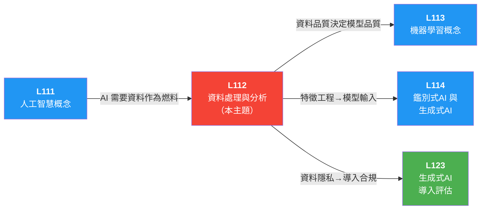

# 📖 L112 資料處理與分析概念 — iPAS AI應用規劃師（初級）學習指南

> 對應評鑑範圍：**L11201 資料基本概念與來源** ＋ **L11202 資料整理與分析流程** ＋ **L11203 資料隱私與安全**

---

## 0. 關鍵概念總覽圖

> 先鳥瞰整個 L112 的知識地圖，搞清楚所有專有名詞彼此之間的關係，之後讀細節時就不會迷路。

```
📊 L112 資料處理與分析概念
│
├── L11201 資料基本概念與來源
│   │
│   ├── 📖 資料在 AI 中的角色
│   │   ├── 「資料 = AI 的燃料」── 模型品質取決於資料品質
│   │   ├── 80/20 法則：80% 時間花在資料準備，20% 建模
│   │   ├── 資料生命週期：收集 → 儲存 → 處理/清理 → 分析 → 視覺化
│   │   ├── ETL 流程（Extract 擷取 → Transform 轉換 → Load 載入）
│   │   │   └── 先清洗再載入，確保合規與資料品質
│   │   └── ELT 流程（Extract 擷取 → Load 載入 → Transform 轉換）
│   │       └── 先載入原始資料再轉換，保留探索彈性，仰賴雲端算力
│   │
│   ├── 📂 資料結構分類（三大類）
│   │   ├── 🟢 結構化資料（Structured Data）── 行列格式，可直接查詢分析
│   │   │   └── 例：關聯式資料庫（MySQL、PostgreSQL）、Excel 表格
│   │   ├── 🟡 半結構化資料（Semi-structured Data）── 有標籤但格式彈性
│   │   │   └── 例：JSON（JavaScript Object Notation）、XML（eXtensible Markup Language，可擴展標記語言）、CSV（Comma-Separated Values，逗號分隔值）、HTML（HyperText Markup Language，超文本標記語言）
│   │   └── 🔴 非結構化資料（Unstructured Data）── 無固定格式，需處理後才能分析
│   │       └── 例：圖片、影片、音訊、電子郵件、社群貼文
│   │       └── 陷阱：非結構化 ≠ 沒有價值，只是需要額外處理
│   │
│   ├── 🔢 資料型態（Data Types）
│   │   ├── 數值型資料（Numerical Data）── 可量化計算（身高、溫度、銷售額）
│   │   │   ├── 連續型（Continuous）── 可取任意小數值（體重 65.3kg）
│   │   │   └── 離散型（Discrete）── 只能取整數值（人數、次數）
│   │   ├── 類別型資料（Categorical Data）── 分類標籤（性別、血型、顏色）
│   │   │   ├── 名目尺度（Nominal Scale）── 無順序（血型 A/B/O/AB）
│   │   │   └── 順序尺度（Ordinal Scale）── 有順序（教育程度：國中<高中<大學）
│   │   ├── 文字資料（Text Data）── 自然語言文本（新聞、評論、對話）
│   │   ├── 圖像資料（Image Data）── 像素矩陣（照片、X光片、衛星圖）
│   │   └── 音訊/影片資料（Audio/Video Data）── 時間序列多媒體
│   │
│   ├── 📥 資料蒐集方法（Data Collection Methods）
│   │   ├── 問卷與調查（Survey）──── 第一手資料，直接從目標受眾蒐集
│   │   ├── 自有產品數據 ── 網站/App/IoT（Internet of Things，物聯網）設備產生的資料
│   │   ├── 外部公開資料（Open Data）── 政府開放平台 API（Application Programming Interface，應用程式介面）、公開資料集
│   │   ├── 網路爬蟲（Web Scraping）── 抓取網站公開資料
│   │   └── 外部付費資料 ── 向第三方購買專業資料集
│   │
│   ├── 💾 大數據特性（Big Data 5V）
│   │   ├── Volume（資料量）── 資料量大（TB/PB 等級）
│   │   ├── Velocity（速度）─ 資料產生速度快（即時串流）
│   │   ├── Variety（多樣性）── 資料類型多樣（結構/非結構化混合）
│   │   ├── Veracity（真實性）─ 資料真實性/品質參差不齊
│   │   └── Value（價值）─── 最終目的：從資料中萃取商業價值
│   │   └── ⭐ 口訣：「量·速·多·真·值」
│   │
│   ├── 🏗️ 資料儲存架構（Data Storage Architecture）
│   │   ├── 資料庫（Database）── 結構清楚，快速查找
│   │   ├── 資料倉儲（Data Warehouse）── 已清洗的結構化資料，適合商業分析師做報表
│   │   │   └── Schema-on-write（寫入時定義綱要）：寫入前先定義好格式
│   │   ├── 資料湖（Data Lake）── 原始未整理資料，適合資料科學家探索
│   │   │   └── Schema-on-read（讀取時定義綱要）：讀取時再決定怎麼用
│   │   ├── 資料湖倉（Data Lakehouse）── 結合湖的彈性與倉儲的管理，現代架構趨勢
│   │   └── 資料孤島（Data Silo）── 系統間資料不互通，湖倉分離的痛點
│   │
│   ├── 🔧 大數據技術生態（Big Data Ecosystem）
│   │   ├── Hadoop 鐵三角
│   │   │   ├── HDFS（Hadoop Distributed File System，分散式檔案系統）── 分散式儲存（切塊＋備份）
│   │   │   ├── MapReduce（映射-歸約）── 分散式運算（拆解任務＋匯總）
│   │   │   └── YARN（Yet Another Resource Negotiator，資源調度器）── 資源調度（管理 CPU/記憶體）
│   │   ├── Kafka（訊息佇列）── 即時串流資料的高速傳輸管道
│   │   ├── 水平擴展（Scale Out）── 加機器分工，NoSQL（Not Only SQL，不僅是SQL）核心策略
│   │   └── 垂直擴展（Scale Up）── 升級單機硬體，傳統 SQL（Structured Query Language，結構化查詢語言）做法
│   │
│   ├── 🗄️ NoSQL（非關聯式資料庫）四大家族
│   │   ├── 鍵值儲存（Key-Value Store）── 速度極快（Redis）── 快取/排行榜
│   │   ├── 文件資料庫（Document Store）── 彈性極佳（MongoDB）── JSON 內容管理
│   │   ├── 寬列儲存（Wide-Column Store）── 巨量寫入（Cassandra）── IoT/感測器
│   │   └── 圖形資料庫（Graph Database）── 複雜關係（Neo4j）── 社交網路/詐騙偵測
│   │   └── ⭐ ACID vs BASE：
│   │       ├── ACID（Atomicity, Consistency, Isolation, Durability，原子性/一致性/隔離性/持久性）── SQL 強一致性
│   │       └── BASE（Basically Available, Soft state, Eventually consistent，基本可用/軟狀態/最終一致性）── NoSQL 最終一致性
│
│   └── 📊 抽樣與機率模型（Sampling & Probability Models）
│       ├── 抽樣變異（Sampling Variability）── 不同樣本的統計量因隨機性而有差異
│       └── 機率模型（Probability Model）── 量化統計估計值的不確定性，進行區間估計與假設檢定
│
├── L11202 資料整理與分析流程
│   │
│   ├── 資料洩漏（Data Leakage）── 鐵律：先分割測試集，再做預處理
│   │   └── 標準化/平均值等只能從訓練集學習，再套用到測試集
│   │
│   ├── 🧹 資料清洗（Data Cleaning）
│   │   ├── 遺缺值處理（Missing Value Treatment）
│   │   │   ├── 三種遺失類型：MCAR（Missing Completely At Random，完全隨機遺失）/ MAR（Missing At Random，隨機遺失）/ MNAR（Missing Not At Random，非隨機遺失，最難處理）
│   │   │   ├── 填補法（Imputation）── 平均值/中位數/眾數填補、插補法、預測模型
│   │   │   ├── 刪除法（Deletion）── 缺失比例過高時直接刪除
│   │   │   ├── 指標變數法（Indicator Variable）── 將「缺失」本身作為新特徵
│   │   │   └── 不能盲目填平均值，會壓縮變異性；需先診斷遺失原因
│   │   ├── 資料不平衡處理（Imbalanced Data）
│   │   │   └── SMOTE（Synthetic Minority Over-sampling Technique）── 合成少數類別過採樣
│   │   ├── 重複值處理（Duplicate Removal）── 透過主鍵/唯一識別碼檢查，保留一份
│   │   ├── 錯誤值處理（Error Correction）── 修正超出合理範圍的值（年齡 -5 歲）
│   │   └── 離群值處理（Outlier Treatment）
│   │       ├── 四分位距法（IQR，Interquartile Range，四分位距）── 超出 Q1-1.5×IQR 或 Q3+1.5×IQR
│   │       └── 標準差法 ── 距平均值超過 2-3 個標準差
│   │       └── 截尾（Truncation / Censoring）── 強制將極端值替換為設定的上下限邊界值
│   │       └── 陷阱：離群值不一定是錯誤，可能是有意義的異常
│   │
│   ├── 🔄 資料轉換（Data Transformation）
│   │   ├── 格式轉換（Format Conversion）── CSV ↔ JSON 等格式互轉
│   │   ├── 類型轉換（Type Casting）── 字串 → 數值等型態轉換
│   │   ├── 正規化/標準化（Normalization/Standardization）
│   │   │   ├── Min-Max Scaling ── 映射到 [0,1]
│   │   │   │   └── 公式：X_scaled = (X - X_min) / (X_max - X_min)
│   │   │   └── Z-score 標準化 ── 均值=0，標準差=1
│   │   │       └── 公式：X_scaled = (X - μ) / σ
│   │   │       └── ⭐ 消除不同特徵間的尺度差異，對梯度下降特別重要
│   │   ├── 離散化（Discretization）── 連續值 → 類別（年齡 → 青年/中年/老年）
│   │   ├── One-Hot 編碼（獨熱編碼）── 類別型 → 多個 0/1 欄位
│   │   │   └── 例：顏色{紅,綠,藍} → [1,0,0]、[0,1,0]、[0,0,1]
│   │   └── 特徵交叉（Feature Cross）── 組合多欄位建立新特徵
│   │       └── 例：「星期幾」×「時段」→ 預測通勤時間
│   │
│   ├── 🔬 特徵工程（Feature Engineering）
│   │   ├── 特徵選擇（Feature Selection）── 挑出對預測最有幫助的特徵
│   │   │   ├── 過濾法（Filter Method）── 皮爾森相關係數（Pearson Correlation）等統計量
│   │   │   ├── 包裝法（Wrapper Method）── 遞迴特徵消除（RFE，Recursive Feature Elimination）
│   │   │   └── 嵌入法（Embedded Method）── LASSO（Least Absolute Shrinkage and Selection Operator，最小絕對收縮與選擇算子）正則化（Regularization）自動篩選
│   │   └── 降維技術（Dimensionality Reduction，七大方法比較）
│   │       ├── PCA（Principal Component Analysis，主成分分析）── 不需標籤、線性、找最大變異方向、一般降維前處理
│   │       ├── LDA（Linear Discriminant Analysis，線性判別分析）── 需要標籤！線性、讓類別更好分開、分類前處理
│   │       ├── ICA（Independent Component Analysis，獨立成分分析）── 不需標籤、線性、找統計獨立成分、訊號分離/語音/腦波
│   │       ├── t-SNE（t-distributed Stochastic Neighbor Embedding，t-分布隨機鄰域嵌入）── 不需標籤、非線性、保留局部鄰近關係、偏視覺化不適合當前處理主力
│   │       ├── UMAP（Uniform Manifold Approximation and Projection，均勻流形逼近與投影）── 不需標籤、非線性、保留局部+部分全域結構、比 t-SNE 通常更快
│   │       ├── Autoencoder ── 不需標籤、可非線性、壓縮再重建、深度學習式降維
│   │       └── NMF（Non-negative Matrix Factorization，非負矩陣分解）── 不需標籤、線性、只適合非負資料、主題分析/推薦系統
│   │       └── ⭐ 降維題先問三件事：要不要標籤？是不是偏視覺化？是不是非線性？
│   │       └── 陷阱：降維後訊息量會「減少」，不會增加
│   │       └── 🔗 關聯：正則化（Regularization）── L1 (LASSO) 會把無用特徵權重變 0，等同「隱性降維」（嵌入法）
│   │           ├── 降維 = 資料前處理階段物理性刪減欄位
│   │           └── 正則化 = 模型訓練階段懲罰權重（L1 例外可歸零權重）
│   │
│   ├── 📊 敘述統計量（Descriptive Statistics）
│   │   ├── 📍 中央趨勢（Central Tendency）
│   │   │   ├── 平均數（Mean）── 所有值相加÷個數，易受極端值影響
│   │   │   ├── 中位數（Median）── 排序後正中間的值，不受極端值影響
│   │   │   └── 眾數（Mode）── 出現頻率最高的值，可能有多個或不存在
│   │   │   └── ⭐ 有極端值時 → 用中位數；分佈對稱時 → 平均數≈中位數
│   │   │
│   │   ├── 📏 分散度（Dispersion）
│   │   │   ├── 全距（Range）── 最大值 - 最小值，易受極端值影響
│   │   │   ├── 四分位數（Quartiles：Q1, Q2, Q3）── 分成四等份的三個切點
│   │   │   ├── 四分位距（IQR, Interquartile Range）── Q3 - Q1，中間 50% 的範圍
│   │   │   ├── 變異數（Variance）── 每個值與平均數的距離平方的平均
│   │   │   └── 標準差（Standard Deviation, SD）── 變異數的平方根，衡量分散程度
│   │   │       └── SD 越大 = 越分散 = 品管中代表品質越不穩定
│   │   │
│   │   └── 📐 偏態（Skewness）
│   │       ├── 正偏態（Positive/Right Skew）── 尾巴向右，平均數 > 中位數
│   │       ├── 負偏態（Negative/Left Skew）── 尾巴向左，平均數 < 中位數
│   │       └── 對稱分布（Symmetric Distribution）── 平均數 ≈ 中位數 ≈ 眾數
│   │
│   ├── 📈 常用圖表
│   │   ├── 直方圖（Histogram）── 連續資料分佈，看集中與分散
│   │   ├── 散佈圖（Scatter Plot）── 兩變數關係（相關性）
│   │   ├── 折線圖（Line Chart）── 時間序列趨勢變化
│   │   ├── 盒鬚圖（Box Plot）── 四分位數+離群值，不顯示標準差
│   │   ├── 熱圖（Heatmap）── 色彩強度顯示相關程度
│   │   ├── 長條圖（Bar Chart）── 類別型資料比較
│   │   ├── 雷達圖（Radar Chart）── 多維度綜合能力比較（用戶畫像）
│   │   └── 散佈圖矩陣（Scatter Plot Matrix）── 多變數兩兩配對的相關性總覽
│   │   └── 視覺化誠實鐵律：Y 軸必須從零開始，否則會誇大差異
│   │
│   ├── 🔍 四大分析層次（Four Levels of Analytics）
│   │   ├── ① 敘述性分析（Descriptive）── 發生了什麼？
│   │   │   └── 統計指標 + 圖表 → 總結與呈現數據
│   │   ├── ② 診斷性分析（Diagnostic）── 為什麼發生？
│   │   │   └── 鑽取分析（Drill-down）、關聯分析（Apriori）、因果分析（A/B 測試）
│   │   ├── ③ 預測性分析（Predictive）── 接下來會怎樣？
│   │   │   └── 迴歸模型、分類模型、時間序列模型、集成學習（Ensemble Learning）
│   │   └── ④ 指示性分析（Prescriptive）── 應該怎麼做？
│   │       └── 自動化決策與推薦（如 AI 主動推薦最佳套餐組合）
│   │       └── ⭐ 四層由低到高：描述→診斷→預測→指示
│   │
│   ├── 🔬 EDA（Exploratory Data Analysis，探索性資料分析）
│   │   ├── 無預設假設的開放探索，是建模前的必備步驟
│   │   ├── 工具：散佈圖矩陣、聚類分析（Clustering）、PCA、熱圖、異常檢測
│   │   └── EDA ≠ CDA（Confirmatory Data Analysis，驗證性資料分析）：EDA 探索未知；CDA 驗證已有假設
│   │
│   ├── ⛏️ 資料探勘（Data Mining）四大技術
│   │   ├── 分類（Classification）── 有標籤，預測「會/不會」
│   │   ├── 分群（Clustering）── 無標籤，自動找相似群體
│   │   ├── 關聯規則（Association Rules）── 找「A→B」搭檔關係（購物籃分析，Market Basket Analysis）
│   │   └── 異常偵測（Anomaly Detection）── 抓出與眾不同的異常點
│   │   └── 分類 vs 分群：分類有標準答案，分群沒有！
│   │
│   ├── 📊 模型評估指標（Model Evaluation Metrics）
│   │   ├── 混淆矩陣（Confusion Matrix）
│   │   │   ├── TP（True Positive，真陽性）── 正確抓到    TN（True Negative，真陰性）── 正確放行
│   │   │   ├── FP（False Positive，偽陽性）── 誤殺（Type I） FN（False Negative，偽陰性）── 漏抓（Type II）
│   │   │   └── FN 通常後果最嚴重（有病卻被放回家）
│   │   ├── 精確率（Precision）= TP/(TP+FP) ── 抓出來的有多少是真的
│   │   ├── 召回率（Recall）= TP/(TP+FN) ── 該抓的抓到多少
│   │   │   └── ⭐ Precision vs Recall 像翹翹板：寧可誤殺→重 Recall；不想擾人→重 Precision
│   │   ├── 準確度悖論（Accuracy Paradox）── 不平衡資料中準確率會誤導
│   │   ├── ROC（Receiver Operating Characteristic，接收者操作特徵曲線）/ AUC（Area Under the Curve，曲線下面積）── 整體分辨能力，AUC 越接近 1 越好
│   │   └── PR 曲線（Precision-Recall Curve，精確率-召回率曲線）── 不平衡資料下比 ROC 更可靠
│   │
│   ├── 🧪 假說檢定（Hypothesis Testing）
│   │   ├── 流程：猜想（假設）→ 蒐集資料 → 檢定 → 作決策（接受或拒絕）
│   │   ├── 統計假設（Statistical Hypotheses）
│   │   │   ├── 虛無假設（Null Hypothesis, H₀）── 表示「沒有顯著差異」，檢定的基準
│   │   │   └── 對立假設（Alternative Hypothesis, Hₐ / H₁）── 表示「存在顯著差異」，與 H₀ 相反
│   │   ├── 兩類錯誤（Two Types of Errors）
│   │   │   ├── Type I 錯誤（α，型一錯誤）── H₀ 為真卻拒絕（偽陽性 / 誤殺好人）
│   │   │   └── Type II 錯誤（β，型二錯誤）── H₀ 為假卻接受（偽陰性 / 漏放壞人）
│   │   ├── 顯著水準（Significance Level, α）── 常取 0.1、0.05 或 0.01
│   │   ├── p 值（p-value）
│   │   │   ├── 在 H₀ 為真下，觀察到目前數據或更極端的機率
│   │   │   └── p < α → 拒絕 H₀；p ≥ α → 無法拒絕 H₀
│   │   └── ⭐ 例：p=0.03, α=0.05 → 因 0.03<0.05，有 95% 信心拒絕 H₀
│   │
│   └── 📋 統計方法分類（依變數類型 × 因果關係）
│       │
│       │                 類別變數                  連續變數
│       │                 (Categorical)             (Continuous)
│       │  ─────────────────────────────────────────────────────
│       │  無因果關係   敘述性統計、交叉分析        主成份分析、因素分析
│       │              （Cross Tabulation）、      （Factor Analysis）、
│       │              卡方檢定（Chi-square Test） 集群分析、偏相關分析
│       │  ─────────────────────────────────────────────────────
│       │  有因果關係   二元羅吉斯迴歸              迴歸分析（Regression）、
│       │              （Logistic Regression）、   多變量變異數分析
│       │              區別分析                    （MANOVA，Multivariate Analysis
│       │              （Discriminant Analysis）   of Variance）、偏最小平方迴歸
│       │                                          （PLS，Partial Least Squares
│       │                                          Regression）
│       │  ─────────────────────────────────────────────────────
│       └── ⭐ 選擇方法：先看變數類型，再看是否探討因果
│
└── L11203 資料隱私與安全
    │
    ├── AI 資料隱私風險（AI Data Privacy Risks）
    │   ├── 資料敏感性（Data Sensitivity）── AI 常處理個資、健康、財務等高敏感資料
    │   ├── 模型隱私洩露（Model Privacy Leakage）── 模型可能「記住」訓練資料中的敏感資訊
    │   │   └── 攻擊手法：模型反轉攻擊（Model Inversion Attack）
    │   └── 過度蒐集風險（Over-collection Risk）── 蒐集超過必要範圍的個人資料
    │
    ├── 🛡️ 8 大隱私保護方法
    │   ├── ① 最小化資料蒐集（Data Minimization）── 只收集必要資料
    │   ├── ② 匿名化 / 去識別化（De-identification）── 移除或替換可識別個資
    │   │   ├── 匿名化（Anonymization）── 不可逆，永久移除身分，適合對外公開
    │   │   ├── 假名化（Pseudonymization）── 可逆，代號替換，適合內部分析
    │   │   │   └── 必考：匿名化≠假名化，關鍵在「可逆性」
    │   │   ├── 泛化（Generalization）── 精確值→範圍（25歲→20-30歲）
    │   │   └── 抑制（Suppression）── 隱藏部分欄位
    │   ├── ③ 加密保護（Encryption）
    │   │   ├── 靜態資料（Data at Rest）── 儲存加密（AES（Advanced Encryption Standard，進階加密標準）-256）
    │   │   └── 動態資料（Data in Transit）── 傳輸加密（TLS（Transport Layer Security，傳輸層安全協定）/SSL（Secure Sockets Layer，安全通訊端層協定））
    │   └── 同態加密（Homomorphic Encryption）── 不解密直接對密文運算（最高級隱私保護）
    │   ├── ④ 存取控制（Access Control）
    │   │   ├── RBAC（Role-Based Access Control，角色權限管理）── 依職位給予對應權限
    │   │   ├── MFA（Multi-Factor Authentication，多因素驗證）── 密碼＋手機驗證碼
    │   │   └── 最小權限原則（Principle of Least Privilege）── 只給完成工作剛好夠用的權限
    │   ├── ⑤ 差分隱私（Differential Privacy）
    │   │   ├── 在資料中加入隨機噪聲，保護個人隱私
    │   │   └── 核心：單一數據點不會顯著影響模型輸出
    │   ├── ⑥ 聯邦學習（Federated Learning）
    │   │   ├── 資料留在本地設備，只傳輸模型更新（非原始資料）
    │   │   ├── 適合醫療 AI 等高敏感場景
    │   │   └── 高頻考點：與差分隱私一起出現在情境題
    │   ├── ⑦ 透明與同意（Transparency & Consent）── 說明資料用途，取得用戶知情同意
    │   ├── ⑧ 監控與應急（Monitoring & Incident Response）── 即時監控偵測異常 + 洩露應變計畫
    │   └── ⑨ 零信任架構（ZTA，Zero Trust Architecture）── 「永不信任，一律驗證」，不分內外網
    │
    ├── 📜 重要法規
    │   ├── 🇪🇺 GDPR（General Data Protection Regulation，歐盟通用資料保護規則）
    │   │   ├── 資料最小化原則（Data Minimization）── 只處理必要個資
    │   │   ├── 明確同意（Explicit Consent）── 收集前須取得用戶同意
    │   │   ├── 被遺忘權（Right to be Forgotten）── 用戶可要求刪除個人資料
    │   │   ├── 域外效力（Extraterritorial Effect）── 處理歐盟居民資料就須遵守
    │   │   └── 第 22 條 ── 人民可拒絕純自動化 AI 決策
    │   │       └── 例外：履行合約必須/法律授權/本人明確同意
    │   ├── 🇺🇸 CCPA（California Consumer Privacy Act，加州消費者隱私法）
    │   │   └── 賦予用戶查詢、拒絕資料銷售的權利
    │   ├── 🇹🇼 台灣個人資料保護法（Personal Data Protection Act）
    │   │   └── 核心：「告知後同意」（Informed Consent）── 收集前須明確告知用途並取得同意
    │   └── 陷阱：GDPR 保護「個資」≠ EU AI Act 規範「AI 系統」
    │
    └── 🔐 應用場景的隱私策略選擇
        ├── 醫療 AI ── 優先差分隱私 + 聯邦學習 + 加密（資料極敏感）
        ├── 金融 AI ── 去識別化 + 存取控制 + 加密
        └── 行銷分析 ── 匿名化 + 最小化蒐集（兼顧商業價值）
```

---

## 1. 關鍵術語與定義

### 1-1 資料層級與角色（Data Hierarchy & Role）

> 📝 **一句話速記**：資料是 AI 的燃料，80% 時間花在資料準備（收集→儲存→處理→分析→視覺化）。

> ```
> 層次關係圖：資料的知識層次與生命週期
>
> 知識金字塔（DIKW 架構簡化版）：
> ├── 資料（Data）── 原始事實（如「38.5」）
> │      ↓ 處理與賦予意義
> ├── 資訊（Information）── 可解讀的結果（如「體溫 38.5 度」）
> │      ↓ 洞察與應用
> └── 知識（Knowledge）── 指導行動的原則（如「發燒了，需要吃退燒藥」）
>
> 🔄 資料生命週期（Data Lifecycle）：
> 收集（Collection） ── 爬蟲、API、問卷
>       ↓
> 儲存（Storage）    ── SQL、NoSQL、資料湖
>       ↓ (佔專案 80% 時間)
> 處理（Processing） ── 清洗、合併、特徵工程
>       ↓
> 分析（Analysis）   ── 統計、機器學習建模
>       ↓
> 視覺化（Visualization）── 產出圖表供決策
> ```
>
> 一句話串起來：**原始「資料」經過生命週期的處理變成「資訊」，再萃取出「知識」。其中「處理/清理」階段是 AI 專案最苦差事，佔了 80% 時間。**

> 🗣️ **為什麼要懂資料生命週期？什麼時候需要？**
>
> 很多人以為做 AI 就是整天在寫神經網路模型，其實不然。如果資料也就是「AI 的燃料」品質很差，訓練出來的模型只會是「Garbage In, Garbage Out」（垃圾進，垃圾出）。了解生命週期才能知道什麼階段該用什麼工具。
>
> **各階段的重點任務：**
> | 階段 | 核心任務 | 常見情境 |
> |------|---------|---------|
> | 收集 | 從來源取得原始資料 | 寫爬蟲抓社群貼文、接政府 API 抓天氣 |
> | 儲存 | 安全保存供後續使用 | 把抓下來貼文存進 MongoDB |
> | 處理 | 清理雜訊、補缺漏值 | 把亂碼刪掉、把空缺年齡補上平均值 |
> | 分析 | 建立模型、找尋規律 | 訓練情感分析模型，判斷貼文是正向或負向 |
> | 視覺化| 轉化為圖表供決策 | 畫出「每月正負向貼文比例變化折線圖」給老闆看 |

**① 核心概念**

- **資料→資訊→知識 (Data→Information→Knowledge)** — 資料（Data）是未經處理的原始事實；資訊（Information）是將資料整理處理後可被解讀理解的結果；知識（Knowledge）是基於資訊的理解與洞察，用於指導決策或行動。
- **資料生命週期 (Data Lifecycle)** — 資料從產生到退役的完整歷程：收集 → 儲存 → 處理/清理 → 分析 → 視覺化。理解此週期有助於掌握每個階段任務，是資料治理（Data Governance）的基礎框架。
  > 🗣️ 像一場廚藝秀：買菜（收集）→ 放冰箱（儲存）→ 洗菜切菜（處理，最花時間）→ 炒菜（分析）→ 擺盤上桌（視覺化）。
- **資料飛輪 (Data Flywheel)** — 以數據驅動的自我強化商業循環。
  > 🗣️ 像 Netflix：推薦越準 → 越多人看 → 收集到更多觀看記錄 → 訓練出更聰明演算法，雪球越滾越大。

> ⚠ **考試速記**：
>
> - 考題常問資料專案中最花時間的階段，答案必定是**「資料處理與清理（Data Processing / Cleaning）」**，約佔 80% 時間。
> - 在知識金字塔中，AI 模型的**預測結果**（如預測明天會下雨）屬於**資訊（Information）**，而**根據結果採取的行動方案**（如決定帶傘出門）屬於**知識（Knowledge）**。

### 1-2 資料結構與型態（Data Structure & Types）

> 📝 **一句話速記**：結構化＝表格，半結構化＝JSON/XML，非結構化＝圖片影音；連續型有小數，離散型限整數。

> ```
> 層次關係圖：資料結構的「整齊度」與資料型態的「量尺」
>
> 📂 資料結構分類（依據整齊程度）
> ├── 結構化資料（Structured）── Excel 規矩表格，關聯式資料庫專用（佔 <20%）
> ├── 半結構化資料（Semi-structured）── 有彈性標籤的筆記本（JSON、XML、HTML）
> └── 非結構化資料（Unstructured）── 沒格式的影音圖文，AI 主要處理對象（佔 >80%）
>
> 📏 資料型態分類（依據計算方式）
> ├── 數值型（Numerical，能量化計算）
> │   ├── 連續型（Continuous）── 任意小數（身高 175.3、溫度 36.5）
> │   └── 離散型（Discrete）── 只能整數（人數 3 人、購買次數 5 次）
> │
> └── 類別型（Categorical，僅為標籤不可計算）
>     ├── 順序尺度（Ordinal）── 有高低順序（學歷：高中<大學<碩士）
>     └── 名目尺度（Nominal）── 無高低順序（血型 A/B/O/AB、性別）
> ```
>
> 一句話串起來：**資料先看「整不整齊」（結構/半結構/非結構），再看裡面的欄位是「能算數學的數值型」（連績/離散），還是「只能分組的類別型」（順序/名目）。**

> 🗣️ **為什麼要分這些型態？什麼時候需要管它？**
>
> 對電腦來說，「字」和「數字」天差地遠。如果血型欄位填了 [1=A型, 2=B型, 3=O型, 4=AB型]，你沒先告訴 AI 這是「類別（名目）」，它會以為 O 型（3）加 A 型（1）等於 AB 型（4），鬧出大笑話。
>
> **什麼時候怎麼處理？**
> | 資料型態 | 電腦會怎麼看待 | 處理策略 |
> |---------|--------------|---------|
> | 連續型數值 (如薪資) | 真正的數字，可比大小算平均 | 可以做標準化（Standardization）或正規化 |
> | 離散型數值 (如人數) | 真正的數字，但跳躍式 | 同上，可以直接放入迴歸模型 |
> | 順序類別 (如滿意度) | 有順序的標籤（低=1, 中=2, 高=3）| 用 Label Encoding 換成數字，讓模型知道大小關係 |
> | 名目類別 (如顏色) | 沒順序的標籤（紅, 綠, 藍） | 必須用 One-Hot Encoding 給他們各自獨立的 0/1 欄位 |

**① 資料結構（整齊度）**

- **結構化資料 (Structured Data)** — 具有固定行列格式的資料，可直接查詢分析。如關聯式資料庫（MySQL）、Excel。
- **半結構化資料 (Semi-structured Data)** — 有一定結構標籤但格式彈性的資料。如 JSON、XML。重點：能用程式解析標籤。
- **非結構化資料 (Unstructured Data)** — 無固定格式的資料，佔全球資料量最大宗（>80%）。如圖片、影片、音訊、自由文本。深度學習的強項。

**② 資料型態（量度尺度）**

- **數值型資料 (Numerical Data)** — 可量化計算的資料。
  - **連續型 (Continuous)**：可取任意小數值（如體重、溫度）。
  - **離散型 (Discrete)**：只能取整數值（如購買次數、網站點擊數）。
- **類別型資料 (Categorical Data)** — 用於分類標籤的資料，不可做加減乘除。
  - **順序尺度 (Ordinal Scale)**：有高低順序但間距不等（如教育程度、滿意度）。
  - **名目尺度 (Nominal Scale)**：無先後順序（如血型、顏色）。

> ⚠ **考試速記 & 常見陷阱**：
>
> - 陷阱：JSON ≠ 非結構化！JSON 有鍵值對（Key-Value）的標籤，屬於**半結構化資料**。
> - 陷阱：離散型 ≠ 類別型！離散型（如人數 3 人）仍是**數值型**，能比較大小；類別型不能。
> - 名目尺度絕對不能直接用 1, 2, 3 編碼（會給模型錯誤的順序感），必須用 **One-Hot Encoding（獨熱編碼）**。

### 1-3 資料蒐集與整合（Data Collection & Integration）

> 📝 **一句話速記**：ETL 先清洗再載入（重合規），ELT 先載入再轉換（重彈性）。

> ```
> 層次關係圖：資料搬運的兩大流派
>
> 資料採集源頭：問卷、爬蟲、API、IoT 設備、日誌
>        ↓
> 怎麼把資料搬進倉庫？
>
> 流派一：傳統 ETL (Extract → Transform → Load)
> 來源端 ──(抽取)──> 中間清洗區 ──(轉換/過濾)──> 目標儲存庫 (Data Warehouse)
> 🌟 特點：先在家把菜洗好切好，再帶去餐廳。
>
> 流派二：現代 ELT (Extract → Load → Transform)
> 來源端 ──(抽取)───────(直接載入)───────> 目標儲存庫 (Data Lake) ──(內部轉換)──> 分析模型
> 🌟 特點：把所有食材先堆進大廚房，要煮什麼現場再處理。
> ```
>
> 一句話串起來：**資料從收集到儲存，傳統走 ETL（先轉換過濾敏感資料再存），現代愛走 ELT（全存進資料湖，靠雲端強大算力要用再轉換）。**

> 🗣️ **為什麼要分 ETL 和 ELT？什麼時候需要？**
>
> 以往儲存空間和算力很貴，所以要先「Transform（轉換、過濾、壓縮）」再存入資料庫（ETL）。現在雲端儲存超便宜、大數據算力強大，資料科學家希望看到「最原汁原味的資料」，所以先全部「Load（載入）」再說，需要時再轉換（ELT）。
>
> **什麼時候選哪種？**
> | 情境 | 選擇流派 | 原因 |
> |------|---------|------|
> | 醫療或金融單位，法規要求個資絕對不能存入公開分析區 | ETL | 必須在半路就把敏感資料去除或匿名化（Transform），才能放進分析庫（Load） |
> | 訓練 AI 大模型，現在不知道哪些特徵未來會有用 | ELT | 把所有原始圖文、日誌先倒進資料湖（Load），要試新點子時隨時轉換（Transform） |

**① 資料整合管線**

- **ETL (Extract-Transform-Load)** — 資料整合流程：從來源擷取 (E)、清洗與變換格式 (T)、最終載入目標儲存庫 (L)。適合重視資料品質與合規性（如金融隱私）的場景。
  > 🗣️ 流程嚴謹，但建立管線耗時，且原始資料在轉換中可能遺失細節。
- **ELT (Extract-Load-Transform)** — 現代資料管線：先擷取 (E) 並全部載入 (L) 到資料湖/雲端倉儲，再依需求以強大雲端算力進行轉換 (T)。
  > 🗣️ 保留原始資料的完整性，給資料科學家無窮的探索彈性。

**② 其他蒐集術語**

- **資料標註 (Data Labeling)** — 注入人類智慧告訴機器「這筆資料是什麼」的過程（如圈出圖片中的癌症細胞）。
  > 🗣️ 非結構化資料要拿來做監督式學習，這是必經的痛苦但高價值的過程。
- **網路爬蟲 (Web Scraping)** — 透過程式自動化抓取和解析網站上公開的 HTML 資訊轉為結構化資料。

> ⚠ **考試速記**：
>
> - 考題常出順序題，ETL 順序固定為**擷取 → 轉換 → 載入**（不能隨便對調，考過混淆選項 TEL）。
> - ELT 的強大在於仰賴**目標端（如雲端資料倉儲/資料湖）的強大運算能力**，不需要獨立的中間轉換伺服器。
> - 會破壞原始資料完整性的是 **ETL**。

### 1-4 資料儲存架構（Data Storage Architecture）

> 📝 **一句話速記**：資料倉儲存乾淨表格（Schema-on-write），資料湖存各種原始檔案（Schema-on-read）。

> ```
> 層次關係圖：演進中的資料儲存架構
>
> 企業的資料存哪裡？
> │
> ├── 第一代：資料庫（Database）── 負責應用程式的日常交易（如購物車增刪改查）
> │
> ├── 第二代：資料倉儲（Data Warehouse）── 負責產生商業報表
> │   └── 特性：結構化乾淨表格、Schema-on-write（先想好欄位再存入）
> │
> ├── 第三代：資料湖（Data Lake）── 負責 AI 訓練與大數據探索
> │   └── 特性：包山包海（原始日誌/影音圖文）、Schema-on-read（讀出來時再看怎麼切）
> │
> └── 第四代：資料湖倉（Data Lakehouse）── 現代趨勢，把湖與倉打通
>     └── 目的：解決「資料孤島（Data Silo）」問題，兼具湖的彈性與倉的管理
> ```
>
> 一句話串起來：**資料庫管交易，倉儲管報表（要整理好），資料湖餵 AI（原始隨便丟）。最新趨勢是「湖倉一體」，打破資料孤島。**

> 🗣️ **為什麼有倉又有湖？什麼時候需要？**
>
> 「資料倉儲」就像高級圖書館，所有的書都編目整理得整整齊齊，老闆問「上個月營收多少」馬上能查到，但你要把書放進去非常費工。「資料湖」就像大倉庫，各式各樣的雜物、照片、廢紙先丟進去再說，適合資料科學家去「尋寶」找新靈感。
>
> **誰用什麼架構？**
> | 角色 | 最愛用 | 原因 |
> |------|-------|------|
> | 商業分析師 (BI Analyst) | 資料倉儲 | 只要拉乾淨的結構化表格做 Dashboard，不要給我聽不懂的非結構資料 |
> | 資料科學家 (Data Scientist)| 資料湖 | 我需要幾十 TB 的原始 Log 跟圖片，拿來訓練最新的神經網路 |

**① 核心儲存庫**

- **資料庫 (Database)** — 結構嚴謹，針對快速、即時的單筆讀寫（OLTP 交易處理）進行最佳化，如使用者註冊、下單。
- **資料倉儲 (Data Warehouse)** — 儲存已清洗、結構化的乾淨歷史資料，由 ETL 流程載入，專為複雜的大型數據分析與報表生成（OLAP）設計。採用 **Schema-on-write（寫入時定義綱要）**。
  > 🗣️ 進門前要先安檢、分類好。
- **資料湖 (Data Lake)** — 儲存未經整理的各類原始資料（含大量非結構化），採用 **Schema-on-read（讀取時定義綱要）**。
  > 🗣️ 像個百寶箱，什麼都往裡倒，要用的時候再決定要拿這坨東西當什麼。

**② 企業痛點與新架構**

- **資料湖倉 (Data Lakehouse)** — 揉合資料湖的彈性儲存成本與資料倉儲的管理分析能力，是目前的現代資料架構趨勢。
- **資料孤島 (Data Silo)** — 企業內部不同系統或部門把持自己的資料，互不相通，導致難以進行跨部門的聯合分析。資料湖倉通常被用來打破孤島。

> ⚠ **考試速記**：
>
> - 考題常將兩者對比：
>   - 見到「**Schema-on-write**（寫入時定義）」 ➡️ **資料倉儲 (Data Warehouse)**。
>   - 見到「**Schema-on-read**（讀取時定義）」、「**存放大量非結構化原始資料**」 ➡️ 答案絕對是**資料湖 (Data Lake)**。
> - 考題常配對：**ETL 通常對應資料倉儲**；而 **ELT 通常對應資料湖**。
> - 資料孤島（Data Silo）是負面名詞，妨礙資料價值的發揮。

### 1-5 大數據技術與資料庫（Big Data Technology & Databases）

> 📝 **一句話速記**：SQL 重交易正確（ACID，重直擴展），NoSQL 拼海量儲存與速度（BASE，水平擴展）。

> ```
> 層次關係圖：巨量資料儲存與運算生態
>
> 🔧 大數據技術生態
> ├── 傳統 RDBMS（關聯式資料庫）── 表格間有緊密關聯的交易系統
> │   └── ACID 原則（原子性/一致性/隔離性/持久性）── 強一致性，不容出錯
> │   └── 擴展方式：Scale Up（垂直擴展，升級 CPU/記憶體）
> │
> ├── 大數據底層框架：Hadoop 鐵三角
> │   ├── HDFS ── 分散式儲存（檔案切塊存多台）
> │   ├── MapReduce ── 分散式運算（映射拆解＋歸約匯總）
> │   └── YARN ── 資源調度器（管 CPU 與記憶體分配）
> │
> ├── 高速公路：Kafka ── 即時串流資料的高速傳輸管道（訊息佇列）
> │
> └── 🗄️ NoSQL 四大家族（非關聯式資料庫，Not Only SQL）
>     ├── 鍵值儲存（Key-Value） ── Redis（快取、排行榜、購物車）
>     ├── 文件庫（Document）    ── MongoDB（JSON 樹狀結構、型錄）
>     ├── 寬列儲存（Wide-Column）── Cassandra（時間序列、IoT 感測器）
>     └── 圖形庫（Graph）       ── Neo4j（社交網路推薦、詐騙偵測）
>
> 🌟 NoSQL 特性：
> └── BASE 模型（基本可用/軟狀態/最終一致性）── 容忍短暫不同步，換高可用性
> └── 擴展方式：Scale Out（水平擴展，加幾台破電腦便宜分擔）
> ```
>
> 一句話串起來：**「大數據」生態就是用 Hadoop 分散硬體、用 Kafka 當高速信差；存錢就用強一致性的 SQL，存社群文章影片就用好擴充的 NoSQL 四大家族。**

> 🗣️ **為什麼有考 NoSQL 四大家族？什麼時候需要？**
>
> 如果資料長得千變萬化、數量又是幾百 TB，傳統的 SQL 關聯表根本存不下，強塞進去查一筆要等半小時。這時需要「不只有 SQL（Not Only SQL）」的 NoSQL 資料庫登場。
>
> **什麼場景選誰？**
> | 應用場景 | 適用的 NoSQL 家族 | 知名代表 |
> |---------|------------------|---------|
> | 購物車、遊戲排行榜、每秒百萬次的快取讀取 | 鍵值 (Key-Value) | Redis |
> | CMS 系統、存成千上萬種不同架構的 JSON 電商型錄 | 文件 (Document) | MongoDB |
> | 工廠上萬台機器每秒回傳的 IoT 感測器數據 | 寬列 (Wide-Column)| Cassandra |
> | 臉書的好友的好友推薦、銀行抓詐騙集團資金流向網絡 | 圖形 (Graph) | Neo4j |

**① 關聯式與非關聯式**

- **ACID 原則** — 關聯式資料庫遵守的「強一致性」鐵律。
  - **A**tomicity（原子性）：交易要嘛全做，要嘛全不做。
  - **C**onsistency（一致性）：交易前後資料庫都維持合法狀態。
  - **I**solation（隔離性）：同時多筆交易互不干擾。
  - **D**urability（持久性）：完成後結果永久保存（不怕斷電）。
    > 🗣️ 這就是為什麼你轉帳給朋友，不會發生你戶頭扣了 1000 元，朋友卻沒收到的狀況。
- **NoSQL (Not Only SQL)** — 泛指非關聯式資料庫，主打彈性結構與容易分多台電腦儲存。
- **BASE 模型** — NoSQL 遵守的「最終一致性」妥協。
  - **B**asically **A**vailable（基本可用）：系統不會整個癱瘓。
  - **S**oft State（軟狀態）：允許資料在中間過程暫時不一致。
  - **E**ventually Consistent（最終一致性）：經過一段時間後資料終將同步。
    > 🗣️ 你在臉書對一篇文按讚，你在台灣看到了，但美國朋友可能晚個幾秒才看到讚數增加。沒關係，社群網站死不了（高可用性），最後數字對就好。

**② 大數據擴展與基礎框架**

- **擴展方式 (Scaling)** — 系統效能不足時的作法。
  - **Scale Up (垂直擴展)**：幫電腦升級更好的 CPU 跟 RAM，傳統 SQL 愛用。
  - **Scale Out (水平擴展)**：直接買 10 台便宜電腦並聯分頭做，NoSQL 與大數據的最愛。
- **Hadoop 鐵三角** — 開源大數據框架。
  - **HDFS (Hadoop Distributed File System)**：負責切塊「儲存」，把大檔案切碎丟給各個子節點。
  - **MapReduce**：負責「運算」，先把任務拆解（Map）給各地計算，再匯總（Reduce）。
  - **YARN**：負責「調度資源」，決定誰用多少 CPU 和 RAM。
- **Kafka** — 負責大數據即時傳輸的訊息佇列（Message Queue）。
  > 🗣️ 像一列永不停駛的高速貨車，源頭不斷丟包裹（資料）上去，處理端在後方隨時接包裹，確保巨量資料不塞車、不遺失。

> ⚠ **考試速記 & 常見陷阱**：
>
> - 陷阱：考題會問「MongoDB 是圖形資料庫嗎？」不，**MongoDB 是文件（Document）資料庫**！圖形資料庫是 **Neo4j**。IoT 最愛 **Cassandra（寬列）**，快取最愛 **Redis（鍵值）**。
> - 只要看到「強一致性」、「金融交易」、「不可分割」，必選 **ACID** / **SQL**。
> - 只要看到「高可用性」、「社群按讚」、「容許短暫不同步」，必選 **BASE** / **NoSQL**。
> - **水平擴展 = Scale Out = NoSQL；垂直擴展 = Scale Up = SQL**。

### 1-6 資料清洗與前處理（Data Cleaning & Preprocessing）

> 📝 **一句話速記**：遺失值對稱補平均、偏態補中位；離群值用 IQR 或 Z-score 抓；資料洩漏是大忌。

> ```
> 層次關係圖：垃圾進垃圾出（GIGO）防衛戰
>
> 🧹 資料清洗四大任務
> ├── 1. 遺缺值（Missing Value）── 有人沒填問卷
> │      └── 處理：補平均數 / 中位數 / 眾數；嚴重缺直接刪除
> │
> ├── 2. 重複值（Duplicate）── 不小心上傳兩次
> │      └── 處理：依據唯一識別碼（如身分證字號）去重
> │
> ├── 3. 錯誤值（Error）── 年齡填 -5 歲
> │      └── 處理：依常理或業務規則修正或剔除
> │
> └── 4. 離群值（Outlier）── 突然有一筆超級高或低的數值
>        └── 偵測：IQR 四分位距法（找偏態）或 標準差法（找常態）
>        └── 注意：離群值 ≠ 錯誤！可能是有意義的罕見事件！
>
> ⚠ 鐵律：資料洩漏（Data Leakage）防範
> └── 先分割訓練集 / 測試集 → 然後才能針對訓練集做平均數填補或標準化
> ```
>
> 一句話串起來：**拿到髒資料，先抓「漏填、重複、亂填、極端點」，用統計量去補洞除蟲；但切記要「先分割考卷（測試集）」再讀書（預處理），免得作弊導致上線翻車。**

> 🗣️ **為什麼要補遺缺值？什麼時候需要管資料洩漏？**
>
> 大部分的神經網路模型或機器學習演算法「不接受空白」作為輸入，你留個洞給它，程式會直接報錯崩潰。所以你必須猜一個「最合理的數字」塞進去。而「資料洩漏」是新手最容易犯的致命傷，像考試前把答案卷混進練習題裡看了。如果在「切分資料」之前，就拿「包含測試集的全體平均值」去填補空洞，等於讓模型偷偷知道了測試集的情報，做出來的成績會好得不真實。
>
> **填補遺缺值的情境對比表：**
> | 空缺資料長什麼樣 | 適用填補法 | 為什麼？ |
> |-----------------|------------|---------|
> | 連續數值、無極端（如全班身高的空缺）| 平均值 (Mean) | 大家差不多高，塞均值最客觀且破壞力最小 |
> | 連續數值、有極端或偏態（如薪水的空缺）| 中位數 (Median)| 一個郭董會把平均值拉超高，補均值太假，用中位數才穩 |
> | 分類標籤（如血型、職業的空缺） | 眾數 (Mode) | 文字標籤不能算數學，只能看「大家都選什麼」就當第一志願 |

**① 遺缺值 (Missing Value)**

- **填補法 (Imputation)** vs **刪除法 (Deletion)** — 資料有缺失時，看比例決定。缺失 < 5% 且隨機可刪除該筆資料（列）；某一欄超過 60% 都空著，直接把那整個欄位刪除（欄）；其他時候用平均/中位/眾數填補。
- **遺缺類型的三個層次**：
  - **MCAR（完全隨機遺失）**：純靠運氣缺漏，跟資料本身無關（問卷被風吹走）。
  - **MAR（隨機遺失）**：跟其他變數有關（女性較少填寫體重欄），可用模型推估。
  - **MNAR（非隨機遺失）**：最難處理，跟自己有關（高收入者故意不填收入）。
- **指標變數法 (Indicator Variable Method)** — 把「有沒有填」這件事變成一個新特徵（1=沒填，0=有填），丟給模型學。有時「故意不填」本身就是一個強烈的預測訊號（如 MNAR）。

**② 離群值 (Outlier)**

- 遠離大部隊的極端數值不代表它「錯了」，有時「抓出這個異常者」正是分析的最終目的（如：盜刷偵測信用卡）。
- **IQR 四分位距法**：資料夾在中間 50%（Q3-Q1）的範圍。超過 Q1 往下 1.5 倍的 IQR，或 Q3 往上 1.5 倍的 IQR，就視為離群值。這個方法最穩健（Robost），就算資料分布嚴重偏癱也不怕。
- **標準差法（Z-score）**：必須假設資料呈現漂亮的常態分布（鐘形），超過均值 ±2~3 個標準差（σ）就視為極端值。容易被極端值本身誤導均值與標準差。
- **截尾 (Truncation / Censoring)** — 處理極端離群值的方法之一。直接設定一個天花板或地板，把超出範圍的值強制替換為邊界值（例如：年收入大於 300 萬的，一律記錄為 300 萬），避免極端值拉垮模型，又保留了該筆資料的其他特徵。
- **SMOTE (Synthetic Minority Over-sampling Technique，合成少數類別過採樣技術)** — 針對資料不平衡（Imbalanced Data，如 99%正常 vs 1%盜刷）的處理技術。它不是單純複製少數類別的資料，而是在少數類別的資料點之間「線性插值」，無中生有合成出新的假樣本，藉此平衡正負類比例。

**③ 致命錯誤：資料洩漏 (Data Leakage)**

- 在無意間讓模型於訓練階段看到了「未來」或「測試集」的資訊。
- **最常犯的錯**：在執行 `train_test_split` 切開資料「之前」，就把全體資料丟進 StandardScaler 做標準化，或者求全體平均去填補遺缺值。這導致測試集（未來的考試卷）的尺度資訊洩漏給了訓練集（練習題本）。

> ⚠ **考試速記 & 常見陷阱**：
>
> - 陷阱：**離群值（Outlier）絕對不等於錯誤值（Error）！** 它可能非常珍貴，考試如果說「所有離群值都應刪去」一定錯！
> - 如果資料偏態（Skewed），遺失值絕對要用 **中位數（Median）** 填補，用平均數是錯的！
> - 遇到文字/類別型的遺失，選擇填補 **眾數（Mode）**！
> - 預處理前，**先分割資料（Train/Test Split）**是為了避免**資料洩漏（Data Leakage）**。

### 1-7 資料轉換與特徵工程（Data Transformation & Feature Engineering）

> 📝 **一句話速記**：無序類別用 One-Hot（展開）、資料尺度要 Normalization（縮放）、模型防死背要 Regularization（懲罰複雜度）。

> ```
> 層次關係圖：把原石打磨成神經網路吃得下的飼料
>
> 🔄 資料轉換（改變形式）
> ├── 類別型處理
> │   └── One-Hot 編碼 ── 針對無順序狀態（紅/綠/藍 → [1,0,0], [0,1,0]），展開成多個 0/1 欄位
> │   └── Label 編碼   ── 針對有順序狀態（低/中/高 → 1, 2, 3），保留大小關係
> │
> ├── 數值型處理（正規化/縮放 Normalization）
> │   ├── Min-Max 縮放 ── 把數值全部擠壓對齊到 [0, 1] 之間
> │   └── Z-score 標準化 ── 轉成均值為 0，標準差為 1，抗極端值能力較強
> │
> └── 特徵工程（無中生有或去蕪存菁）
>     ├── 特徵交叉（Feature Cross）── 人工組合特徵（禮拜五 × 晚上 → 塞車高峰特徵）
>     └── 特徵選擇（Feature Selection）── 拔掉沒用的雜訊欄位
>         ├── 1. 過濾法（Filter）  ── 算完相關係數就獨立淘汰（快）
>         ├── 2. 包裝法（Wrapper） ── 把模型當評委，各組搭配下場試跑（慢但準）
>         └── 3. 嵌入法（Embedded）── 模型邊訓練就自己邊砍掉無用特徵（L1 LASSO 原理）
>
> 🛡️ 守門員：正則化（Regularization）
>     └── L1 (LASSO) / L2 (Ridge) ── 叫模型不要亂背題，藉由懲罰太複雜的權重來防過擬合
> ```
>
> 一句話串起來：**因為模型只懂數字，要把「類別」轉數字（One-Hot）並把各種「尺度」拉平（正規化），再用「過濾/包裝/嵌入」三大法寶挑出最精華的特徵，最後套上「正則化」防過擬合死背。**

> 🗣️ **為什麼要正規化？什麼時候需要特徵選擇？**
>
> 如果你有個預測薪水的模型，輸入是「年資（3 年）」和「年營業額（20 億元）」。如果不做**正規化（Normalization）**，模型會覺得 20 億這個數字「超級巨大」，誤以為營業額權重遠大於年資。你需要把它們都壓縮到 [0,1] 之間，放在同一把尺上比較。
> 而**特徵選擇**是因為如果把「穿幾號鞋」這種垃圾特徵也丟進模型預測薪水，模型可能會被雜訊干擾，所以要把沒用的欄位拔掉。但要怎麼拔？
>
> **特徵選擇的三種策略比喻：**
> | 選拔人才策略 | 工具術語 | 說明 |
> |------------|---------|------|
> | 篩履歷（看有沒有學歷） | 過濾法 (Filter) | 算統計量（如相關係數），沒過門檻直接刷掉。不用花時間面試（訓練），非常快。 |
> | 丟出任務不同組合試跑 | 包裝法 (Wrapper) | 把各種人湊一組實戰觀察，看哪組最強。效果最準但非常花時間（要重跑神經網路無數次）。 |
> | 試用期（看誰適應就留） | 嵌入法 (Embedded)| 直接讓模型訓練一邊自我淘汰，像是用 L1 LASSO 正則化直接把沒用的人（特徵）權重歸零。 |

**① 處理無序標籤的必殺技**

- **One-Hot 編碼 (One-Hot Encoding, 獨熱編碼)** — 專門處理「名目尺度（無高低順序的類別）」。因為不能用 123 編碼代表紅白藍（紅綠會產生大小關係），必須將一個欄位拆成三個欄位：紅[1,0,0]、白[0,1,0]、藍[0,0,1]。這會讓資料欄位數量暴增（維度災難）。
- **離散化 (Discretization)** — 將連續性數值（如 23.5歲）強行打包成類別型區間（如：18-25歲青年族群）。

**② 把大家放在同一把尺**

- **Min-Max Scaling**：公式 `(x - min) / (max - min)`。把所有數值都等比例鎖在 **[0, 1]** 區間。對離群值非常敏感（一個 1000 萬的數值會把其他 1 萬的數值全壓縮在 0.001 附近附著）。
- **Z-score Standardization (標準化)**：公式 `(x - μ) / σ`。把資料轉成**平均值為 0、標準差為 1**。若有嚴重極端值比 Min-Max 穩固，常用於神經網路或支援向量機 (SVM)。

**③ 模型訓練過程中的防爆措施**

- **正則化 (Regularization)** — 在模型計算損失值（Loss）時加入「懲罰項」，限制權重變數不要變得太大。這是用來防止**過擬合（Overfitting）**的絕招。
- **LASSO (L1 正則化)** — 除了防過擬合，它還有一個殘酷的特性：會**把不重要的特徵權重直接變成 0**。因此 L1 正則化常被當作「特徵選擇的嵌入法工具」。
- **Ridge (L2 正則化)** — 會讓特徵權重變很小，但不會歸零，用來懲罰過於複雜的模型。

> 🔍 **特徵選擇 vs 正則化：都能「減少特徵」，但手段完全不同**
>
> | 維度             | 降維技術 (Dimensionality Reduction)                         | 正則化 (Regularization)                                        |
> | ---------------- | ----------------------------------------------------------- | -------------------------------------------------------------- |
> | **作用階段**     | **資料前處理階段** — 在訓練前物理性刪減欄位                 | **模型訓練階段** — 在訓練中懲罰權重                            |
> | **手段**         | **物理性轉換/移除特徵**：把 10,000 個欄位壓縮成 50 個主成分 | **保留所有特徵，但縮小權重**：不刪欄位，只是讓模型「不敢用力」 |
> | **目的**         | ① 加速運算<br>② 移除共線性<br>③ 擺脫維度災難                | 防止**過擬合** — 叫模型不要死背訓練集                          |
> | **代表工具**     | PCA, LDA, t-SNE, Autoencoder（💡 詳見 L112-1.8）            | L1 (LASSO), L2 (Ridge)                                         |
> | **是否刪除特徵** | ✅ 是 — 物理性減少欄位數量                                  | ❌ 否 — 保留所有欄位（L1 例外，見下）                          |
>
> **🤝 特殊交集：L1 正則化 (LASSO) 可做「隱性降維」**
>
> - **一般降維**（如 PCA）= 你親手把 100 個欄位壓成 10 個再餵給模型
> - **L1 正則化** (LASSO) = 你把 100 個欄位全丟進去，但模型訓練後自己把其中 90 個權重變成 0，**等同自動做了特徵選擇**（嵌入法 Embedded）
> - **L2 正則化** (Ridge) = 不會歸零，只會讓所有權重都變小（防過擬合但不刪特徵）
>
> 💡 **一句話總結**：降維是「物理性壓縮欄位」的資料前處理；正則化是「懲罰權重」的模型訓練技巧。但 L1 正則化 (LASSO) 特殊在於會把無用特徵權重變 0，等同隱性做了特徵選擇，介於兩者之間。

**④ 文字資料專屬轉換**

- **詞形還原 (Lemmatization)** — NLP 領域用，要把 "running" 變回原本的 "run"，考慮字典存在。與直接硬切字尾的「詞幹提取（Stemming）」不同，更精確但也更慢。

> ⚠ **考試速記 & 中英文陷阱**：
>
> - 陷阱：**正規化 (Normalization)** vs **正則化 (Regularization)**。這兩個中文只差一個字，考生必死地雷！
>   - **正規化 (Normalization)**：處理**資料**的尺度（把數字變 0~1），屬於前處理。
>   - **正則化 (Regularization)**：處理**模型**的複雜度（懲罰權重防死背），屬於模型優化。
> - 看見「無順序層次的文字（如性別/城市/顏色）」，必須選 **One-Hot 編碼**！用 1, 2, 3 會誤導模型有階級大小。
> - 會自動把權重壓縮到精準為 0、附帶「特徵篩選」功能的是 **L1 正則化 (LASSO)**。
> - 陷阱：**降維技術 vs 正則化**。降維（如 PCA）是**物理性刪除欄位**（資料前處理階段），正則化是**保留欄位但懲罰權重**（模型訓練階段）。唯一例外：**L1 正則化會把無用特徵權重變 0**，等同隱性做特徵選擇（嵌入法）。
> - **L2 正則化 (Ridge)** 只會縮小權重但**不會歸零**，無法做特徵選擇。

### 1-8 降維技術（Dimensionality Reduction）

> 📝 **一句話速記**：沒標籤找變異最大用 PCA，有標籤想分開用 LDA，想畫炫砲分群圖用 t-SNE / UMAP。

> ```
> 層次關係圖：七大降維武器庫
>
> 降維技術（把超多欄位壓縮成幾個核心維度，擺脫維度災難）
> │
> ├── 線性降維三劍客
> │   ├── 1. PCA (主成分分析) ── 萬能前處理，無標籤 (非監督式)，轉向「變異量最大」的角度
> │   ├── 2. LDA (線性判別分析) ── 分類前處理，✅ 需要標籤 (監督式)！努力把「不同類別撕開」
> │   └── 3. ICA (獨立成分分析) ── 解麻花捲，無標籤，把混在一起的原始訊號（語音、腦波）拆開
> │
> ├── 非線性視覺化雙嬌（不適合給模型吃，專門畫圖給老闆看）
> │   ├── 4. t-SNE ── 捨棄全域的結構，專心保留「局部鄰近關係」（計算極慢，只適合視覺化）
> │   └── 5. UMAP ── t-SNE 的進化版，能保留全域結構，運行更快（可做視覺化或初步前處理）
> │
> ├── 神經網路本家
> │   └── 6. Autoencoder (自編碼器) ── 壓縮成瓶頸層再還原，能抓出複雜的非線性關係
> │
> └── 特殊限定版
>     └── 7. NMF (非負矩陣分解) ── 適用於「數值必定全正」的資料，如商品推薦、文本主題提取
> ```
>
> 一句話串起來：**降維考題就是畫鬼腳：先看要不要「標籤」（要就 LDA）、再看是不是純畫圖圖（視覺化找 t-SNE/UMAP）、找變異最大是王者 PCA、聽音頻分離必選 ICA。**

> 🗣️ **為什麼要降維？什麼時候需要？**
>
> 如果你有 10,000 個欄位的客戶資料表，全部丟進模型會讓電腦算到當機，而且充斥著雜訊與互相高度依賴的廢話（共線性）。降維就像是「把 3D 立體的模型壓扁成 2D 影子」，雖然失去了一些細節資訊，但只要拿捏好角度，輪廓依然清晰可辨，而且速度快了幾百倍！
>
> **解題三支箭對比：**
> | 題目線索 | 該選誰？ | 解析 |
> |---------|---------|------|
> | 這是「監督式」降維、需要提供「類別標籤」來最大化類別間的距離 | **LDA** | 只有 LDA 是監督式，這題考 100 次了！PCA 沒有標籤是盲眼看變異！ |
> | 目的是高維度資料「視覺化」、而且是非線性演算法 | **t-SNE / UMAP** | t-SNE 是專注於保留局部鄰居關係的畫圖神氣。 |
> | 用於處理混雜音軌或 EEG 腦波，拆分出統計上最獨立的成分 | **ICA** | 看到分離訊號必選獨立成分分析 (ICA)。 |

> **七大降維方法選擇決策樹：**
>
> ```
> 有無「類別標籤」？
> ├── ✅ 有標籤（監督式）→ LDA（最大化類別間距離）
> └── ❌ 無標籤 → 繼續
>     │
>     ├── 資料全為「非負數值」（次數、評分、詞頻）？
>     │   └── ✅ 是 → NMF（推薦系統、文本主題提取）
>     │
>     ├── 目的是「分離混合訊號」（語音、EEG 腦波）？
>     │   └── ✅ 是 → ICA（找統計獨立的來源訊號）
>     │
>     ├── 目的是「視覺化」（畫圖給人看）？
>     │   ├── ✅ 是 → 資料量大 / 需保留全域結構？
>     │   │           ├── ✅ 是 → UMAP（快、保留全域）
>     │   │           └── ❌ 否 → t-SNE（慢、局部群聚更精準）
>     │   └── ❌ 否（要給模型吃的前處理）→ 繼續
>     │
>     ├── 存在「複雜非線性關係」？
>     │   └── ✅ 是 → Autoencoder（神經網路瓶頸層學非線性壓縮）
>     │
>     └── 線性關係為主 → PCA（找變異量最大方向，萬能前處理首選）
> ```
>
> 一句話決策口訣：**有標籤 LDA → 全正數 NMF → 分訊號 ICA → 畫圖 t-SNE/UMAP → 非線性 Autoencoder → 其他 PCA**

**① 主流巨頭對決：PCA vs LDA**

- **PCA (主成分分析)** — 最通用的**非監督式（不需要標籤答案）**線性降維法。它在空間中旋轉座標軸，找到「資料分散最廣」（變異量最大）的第一主成分方向。不僅減少計算，還能完美消除「共線性（Multicollinearity）」問題。
- **LDA (線性判別分析)** — 少數的**監督式（需要提供標籤類別）**線性降維法。它在空間中找一個角度，使得投影後「不同顏色的點離得越遠越好、同顏色的點擠得越緊越好」，大幅提升後續分類器的準確率。

**② 其他應用型降維**

- **ICA (獨立成分分析)** — 也是非監督式，但不看變異量，而是找出彼此統計上完全「獨立」的成分子源。解決盲源分離（Blind Source Separation）問題。
  > 🗣️ 像在吵雜的雞尾酒晚宴裡（麥克風錄到混合聲音），用 ICA 把「你的聲音」跟「背景音樂」剝離成乾淨的兩軌。
- **t-SNE** — 非常強大的非線性降維，核心精神是「高維空間靠得近的點，在低維 2D 空間也要靠得很近」。
  > 🗣️ 致命傷：計算極慢，多用於資料探索的圖表視覺化，幾乎不會用來當實際 ML 模型跑上線前的前處理。
- **UMAP** — 基本上就是 t-SNE 的改善版，計算更快，且不會像 t-SNE 為了局部鄰居而扭曲整個世界觀，保留了部分全局結構。
- **Autoencoder (自編碼器)** — 左邊接一個編碼（壓縮）神經網路，中間一個小瓶頸層（降維特徵向量），右邊接一個解碼（還原）神經網路。如果還原誤差極小，代表中間那層完美學到了非線性的降維特徵！
- **NMF (非負矩陣分解)** — 強制資料矩陣裡**不能有負數**。因為沒有負數，它必須用多個局部特徵「相加」來拼湊原貌。
  > 🗣️ 最常用來做文本的主題分析（這篇新聞是 30% 政治 + 70% 經濟）、或是協同過濾的推薦系統。

> ⚠ **考試速記 & 常見陷阱**：
>
> - 陷阱：**PCA 是非監督式（無標籤）；LDA 是監督式（需要標籤）！** 考試超常把這兩者的有無標籤身分互換來騙人！
> - 陷阱：降維之後，因為維度遭到壓縮，資料整體的「訊息量一定會下降」，如果某選項說降維能「增加原始特徵的資訊量」絕對是錯的！
> - 唯一限制「資料必須大於等於零」的降維方法是：**NMF（非負矩陣分解）**。
> - 大量用來呈現分群視覺化（Visualization）的非線性演算法：**t-SNE / UMAP**。
> - 陷阱：**降維技術 vs 正則化**（基本概念見 L112-1.7）。降維是**物理性刪除欄位**（前處理階段），正則化是**懲罰權重**（訓練階段）。但 **L1 正則化 (LASSO)** 會把無用特徵權重變 0，等同「隱性降維」。

### 1-9 敘述統計與視覺化（Descriptive Statistics & Visualization）

> 📝 **一句話速記**：看分散程度找變異數/標準差；看穩定度不被帶偏找 IQR；分布偏斜時中位數比平均數更可靠。

> ```
> 層次關係圖：搞懂資料長什麼樣子
>
> 📊 敘述統計的核心三面向
> ├── 1. 集中趨勢（大家通常考幾分？）
> │   ├── 平均數 (Mean) ── 全部加總除以人數（最準確，但也最容易被極端值帶偏）
> │   ├── 中位數 (Median) ── 排行榜正中間那個人（最穩健，不怕郭董拉高平均）
> │   └── 眾數 (Mode) ── 最多人考的分數（唯一能處理「類別文字」的中心點）
> │
> ├── 2. 離散程度（大家的分數差很多嗎？）
> │   ├── 全距 (Range) ── 最高分減最低分（太粗糙，一顆老鼠屎壞了一鍋粥）
> │   ├── 四分位距 (IQR) ── 中間 50% 的差距（找離群值的神兵利器）
> │   ├── 變異數 (Variance) ── 每個人距離平均的差距平方和平均（數學推導愛用）
> │   └── 標準差 (Standard Deviation) ── 變異數開根號（還原尺度，標準差越大 = 品質越不穩定）
> │
> └── 3. 分布形狀（考卷太難還是太簡單？）
>     ├── 正偏態 (Right Skew) ── 尾巴拖向右，平均數 > 中位數（如薪水，少數人超高薪）
>     ├── 對稱分布 (Symmetric) ── 常態鐘形，平均數 ≈ 中位數（如身高）
>     └── 負偏態 (Left Skew) ── 尾巴拖向左，平均數 < 中位數（如考題太簡單，少數人慘敗）
>
> 📈 視覺化圖表選用指南：看你到底想表達什麼？
> ├── 找關係：散佈圖 (Scatter Plot, 數值x數值)、熱圖 (Heatmap, 把相關係數上色)
> ├── 看分佈：直方圖 (Histogram, 連續數值的長相)、盒鬚圖 (Box Plot, 點出中位與離群值)
> ├── 抓趨勢：折線圖 (Line Chart, 橫軸必為時間)
> └── 比大小：長條圖 (Bar Chart, 分類比較，柱子有空隙)
> ```
>
> 一句話串起來：**分析資料第一步就是「畫圖算指標」；要知道中心在哪看均值中位數，知道散得多開看標準差 IQR，畫連續分佈用緊貼的直方圖、分類比較用有空隙的長條圖。**

> 🗣️ **為什麼要學偏態？什麼時候需要管它？**
>
> 政府每次公布「全台平均月薪 6 萬」，大家就罵聲連連「我拉低了平均」。這是因為薪水根本不是對稱分佈，少數郭董月薪上億，把平均數往右拉到不合理的地步。這就是「正偏態（Right Skew）」。只要分布偏斜，平均數就是在騙人，這時候你必須拿出「中位數（Median）」才能看出多數百姓的真實生活水準（4 萬多）。
>
> **圖表選擇的三分鐘防呆表：**
> | 我有一份資料，我想知道... | 我該選什麼圖？ | 絕對不能搞錯的雷區 |
> |-------------------------|--------------|------------------|
> | 業績這五年來是漲是跌？ | 折線圖 (Line Chart) | 橫軸不是連續時間就不要用它。 |
> | 各部門這個月的業績比賽排名？| 長條圖 (Bar Chart) | 這是「分類」，每根柱子要分開。 |
> | 各營業所員工年齡區間的分佈？| 直方圖 (Histogram) | 這是「連續」，每根柱子要緊緊貼著！ |
> | 氣溫跟飲料銷量有沒有正向關係？| 散佈圖 (Scatter Plot) | 只能看相關，不代表因果。 |
> | 這 20 個變數之間誰跟誰關係最鐵？| 散佈圖矩陣 / 熱圖 (Heatmap)| 只是視覺化相關係數表而已。 |

**① 集中與離散的數字遊戲**

- **集中趨勢 (Central Tendency)** — 代表整群資料聚集中心的單一數值。
  - **平均數 (Mean)**：數值運算最精確，但最怕極端值的「一顆老鼠屎」。
  - **中位數 (Median)**：非常穩健（Robust），不受極端值影響，最適合描述偏斜的真實世界（房價、薪資）。
  - **眾數 (Mode)**：最常出現的數值，是唯一能處理「類別型資料（文字選項）」的代表值。
- **離散程度 (Dispersion)** — 代表資料多散漫。
  - **標準差 (SD) 與 變異數 (Variance)**：變異數是差距平方的平均；標準差是為了**把單位還原（開根號）**。在品管（QC）的世界裡，標準差越「大」代表這批瑕疵越「多」、品質越「不穩定」。
  - **四分位距 (IQR)**：即 Q3 減 Q1，只看中間穩定的 50% 範圍。是用來抓**離群值（Outlier）**的神器。

**② 圖形騙局與破解：直方圖 vs 長條圖**

- **直方圖 (Histogram)** — 用於展現**連續數值資料**的分佈。因為 155~160 公分和 160~165 公分是連續無縫的，所以它的柱子必須**緊緊相連沒有縫隙**！
- **長條圖 (Bar Chart)** — 用於比較**無關聯的類別型資料**（一科一科比分數、一果一果比銷量），因為蘋果跟香蕉中間沒有過渡帶，所以柱子**必須有空隙分開**！

**③ 視覺化圖表大觀園**

- **盒鬚圖 (Box Plot)** — 由中位數（中間的粗線）、上下四分位數（盒子的頂跟底）、極值（兩根鬚與單獨的點）構成。<br/>
  > 🗣️ 致命傷：雖然很萬能，但它**完全無法顯示「標準差（Standard Deviation）」與「平均值」！** 它是用來看偏斜度的。
- **雷達圖 (Radar Chart)** — 像蜘蛛網，適合看個體在多個維度的全方位能力（如寶可夢能力值）。
  > 🗣️ 致命傷：不適合用來表示資料分機率的分佈與估計。
- **Distribution Plot (連續機率分佈圖)** — 畫出一條平滑的起伏曲線，比直方圖的一根根柱子更適合展現身高、體重的流暢常態機率分布。

> ⚠ **考試速記 & 常見陷阱**：
>
> - 陷阱：**「正偏態（Right Skew）」＝「右偏」＝ 尾巴拉向右邊 ＝ 平均數大於中位數 ＝ 資料大多聚集在「左邊」！**（因為少數人在右邊拉尾巴，多數人在左邊，這是考試最容易搞反的題型！）
> - 考試只要看到「看離群值」、「不被極端值影響的單一圖表」，請秒選 **盒鬚圖 (Box Plot)**。
> - 考題常騙人：「盒鬚圖可用來觀察變異數和標準差」── 錯！盒鬚圖看的是四分位數。
> - 比較 5 個部門的業績差異，要用**長條圖（Bar Chart）**，不是直方圖。

### 1-10 分析層次與資料探勘（Analytics Levels & Data Mining）

> 📝 **一句話速記**：描述看過去，診斷找原因，預測算未來，指示幫決策。探勘四天王：分類有標籤，分群沒標籤。

> ```
> 層次關係圖：從看報表到 AI 自動駕駛的四階進化
>
> 📈 數據分析的四個成熟度層次
> ├── 1. 敘述性分析（Descriptive）── 發生了什麼事？（看 Dashboard 報表、統整歷史資料）
> ├── 2. 診斷性分析（Diagnostic）── 為什麼發生？（A/B 測試、找關聯規則的 Apriori）
> ├── 3. 預測性分析（Predictive）── 接下來會怎樣？（建迴歸模型猜房價、時間序列預測）
> └── 4. 指示性分析（Prescriptive）── 我們應該怎麼做？（最高等級！AI 給出最佳化套餐推薦）
>
> ⛏️ 資料探勘（Data Mining）四大核心技術
> ├── 有標準答案（有標籤）
> │   └── 分類（Classification）── 預測這是好人還是壞人（垃圾信過濾）
> │
> └── 無標準答案（無標籤）
>     ├── 分群（Clustering）── 把長得像的自動圈成一組（VIP客戶分群）
>     ├── 關聯規則（Association）── 找出一組一組的「搭訕關係」（啤酒與尿布）
>     │      ├── Support (支持度) ── 這組合常不常見？
>     │      ├── Confidence (信賴度) ── 買 A 之後買 B 的機率？
>     │      └── Lift (增益) ── >1 是互相拉抬（正關聯），=1 是陌生人，<1 是互斥
>     │
>     └── 異常偵測（Anomaly Detection）── 抓出那個不一樣的傢伙（信用卡盜刷）
> ```
>
> 一句話串起來：**資料分析是爬四層樓：描述現狀、診斷原因、預測未來、指示決策。而資料探勘就是用各種武器（分類、分群、找關聯買組合、抓異常盜刷）來達成這些分析。**

> 🗣️ **為什麼要分層次？什麼時候需要？**
>
> 分析層次越高，對商業的價值就越大，但技術難度也呈指數上升。很多公司以為自己有「大數據」，其實只是停留在第一層看 Excel 圖表。
>
> **以醫療看病的情境來說明：**
>
> - **敘述性分析**：護理師幫你量體溫說「38.5度」。（只是一個統計顯示）
> - **診斷性分析**：醫生檢查喉嚨說「為什麼發燒？因為你扁桃腺發炎」。（找到原因）
> - **預測性分析**：醫生說「如果不吃藥，明天會燒到 40 度」。（預知未來）
> - **指示性分析**：醫生開處方「你應該吃這顆抗生素，立刻退燒」。（給出最佳行動）

**① 分析四層次**

- **敘述性分析 (Descriptive Analytics)** — 基本款。透過圖表或指標將複雜資料簡化為可理解的總結。如：本月營收比上月衰退 5%。
- **診斷性分析 (Diagnostic Analytics)** — 找病因。透過鑽取（Drill-down）探索「為什麼」。如：因為中南部分店遇到颱風天放假導致衰退。用來做因果驗證（A/B Testing）。
- **預測性分析 (Predictive Analytics)** — 算命仙。把歷史資料丟進機器學習找規律，預測未來發生的機率。如：預測下個月的銷量會反彈。
- **指示性分析 (Prescriptive Analytics)** — 最難的軍師。不僅預測，還能自動最佳化推薦行動。如：Google Maps 自動幫你計算出「最快不塞車且省過路費的路徑導航」。

**② 資料探勘四天王**

- **分類 (Classification)** — 給定新的資料，決定它屬於哪一個已知的群體（標籤）。如：信用卡核卡會過或不過。
- **分群 (Clustering)** — 事前不知道有什麼群體，放任演算法自己去歸納「物以類聚」。如：把 10 萬名會員自動切成「價格敏感客」、「品牌忠誠客」等。
- **關聯規則 (Association Rules)** — 最著名的就是 **Apriori 演算法**（購物籃分析），找出「如果發生 A，通常會伴隨發生 B」的強法則。
- **異常偵測 (Anomaly Detection)** — 找出與預期模式完全不符的異狀。異常不是錯的，異常通常是你最想抓到的關鍵（如防洗錢）。

**③ 深入解剖：Apriori 的三個數字**

- **支持度 (Support)**：代表這組套餐在全部訂單出現的頻率。`Support = [A 且 B 出現的筆數] / [總筆數]`。太低的套餐沒商業價值。
- **信賴度 (Confidence)**：代表「先買了 A 作為條件下」，會順便拿 B 的機率。`Confidence = [A 且 B 筆數] / [只有 A 的筆數]`。
- **增益 (Lift)**：最重要！大於 1 才是真愛。`Lift(A→B) = Confidence(A→B) / Support(B)`。如果算出來 > 1 代表買 A 確實提升了買 B 的機率；若等於 1 代表這兩件商品根本沒關聯（例如衛生紙，大家本來就會買，不管有沒有買啤酒）。

> ⚠ **考試速記 & 中英文陷阱**：
>
> - 陷阱題：自動調整庫存補貨、AI 導航最佳路線，這不只是預測而已，因為已經介入決策了，所以是最高的**指示性分析 (Prescriptive)**。
> - **分類與分群一定有一題：** 有標籤（Label）的是**分類**，無標籤的是**分群**。
> - Apriori 最愛考 Lift：如果 **Lift < 1** 代表示這兩樣東西是**負相關、互斥**的（買了便當就不會買泡麵）！Lift = 1 就是沒關係。

### 1-11 假說檢定與抽樣（Hypothesis Testing & Sampling）

> 📝 **一句話速記**：H0 預設沒事，Ha 想要推翻；Type I 誤報狼來了，Type II 漏報大白鯊；p 越小越能拒絕 H0。

> ```
> 層次關係圖：法庭上的科學邏輯
>
> ⚖️ 假說檢定 (Hypothesis Testing) 的二把刀
> ├── 虛無假設 (H0, Null) ── 基準常態：「沒有罪、沒有效、沒差別」（你想推翻的防守方）
> └── 對立假設 (Ha, Alternative) ── 實驗目標：「有罪、有效、有顯著差異」（你想證明的進攻方）
>
> 🚨 判斷工具：p 值 (p-value)
> └── 當 H0 是對的，卻能抽出這包樣本的機率。
>        └── p 非常小（< 0.05）：這種「巧合」太難發生了！→ 拒絕 H0，證明 Ha 存在！
>        └── p 不夠小（≥ 0.05）：可能只是運氣好/抽樣誤差 → 無法推翻 H0（不代表 H0 一定對！）
>
> 💥 檢定過程會犯的兩種錯誤
> ├── Type I Error (α 型一錯誤) ── 偽陽性：H0 為真卻拒絕它（法庭：冤枉無辜好人）
> └── Type II Error (β 型二錯誤) ── 偽陰性：H0 為假卻接受它（法庭：放走真實罪犯）
>
> 🎲 抽樣理論
> └── 抽樣變異 (Sampling Variability) ── 明明母體一樣，每次抽 30 個人算出來的平均數都會隨機波動。
> ```
>
> 一句話串起來：**我們無法量完 2300 萬人的血壓，只能抽 100 人來猜整體（機率模型）。先假設新藥「沒效（H0）」，如果 p 值小於 0.05，代表「沒效卻看到好數據」的機率太低，於是我們拒絕 H0 認定「新藥有效」，但小心犯了「以為有效其實沒效」的型一錯誤（Type I）。**

> 🗣️ **為什麼搞這麼複雜的 H0/Ha？什麼時候需要？**
>
> 科學是很嚴格的，你不能只是說「A 班平均 80，B 班平均 82，所以 B 班比較聰明」。這可能只是剛好 B 班考的都是會寫的（抽樣變異）。你要證明 B 班比較聰明（Ha），你必須先把基準設定為「兩班一樣聰明（H0）」。
> 只有當你算出的 p-value 低到爆表（連 5% 的巧合率都不到），你才能理直氣壯的拒絕「兩班一樣」這個預設。
>
> **犯錯對比表：你承擔得起哪種錯？**
> | 犯錯情境 | 發生什麼事？ | 嚴重性代價 | 統計學術語 |
> |---------|-------------|-----------|-----------|
> | 沒事響警報 | 這家沒失火，火災探測器卻大叫（誤報）。 | 你會覺得很吵，氣到拔電池，很煩。| Type I (偽陽性, False Positive) |
> | 有事裝死 | 這家失火了，火災探測器卻安靜無聲（漏報）。 | 你被燒死了，這是絕對不能發生的！| Type II (偽陰性, False Negative) |
> | 新藥上市審查 | 新藥其實沒用，衛福部卻以為有效讓它上市。| 浪費幾百億健保，病人吃無效藥。 | Type I (α 錯誤) |

**① 設立陣營**

- **虛無假設 (H0)** — 充滿保守主義的防線。永遠包含等號（=、≤、≥），代表「沒有顯著差別、某某產品沒有偷工減料」。
- **對立假設 (Ha / H1)** — 你急著想證實的新發現。包含不等號（≠、<、>），代表「有差異、有偷工減料」。
- 檢定結果只有兩種寫法：「拒絕 H0（證明有效）」或「不拒絕 H0（證據不足，不代表 H0 絕對正確）」。

**② 機率的判官**

- **p 值 (p-value)** — 核心指標。在「H0 為真」的大前提下，產生出你手上這組數據的極端機率。p 越小，H0 越站不住腳。
- **顯著水準 (Significance Level, α)** — 你的底線。通常設為 0.05（容許 5% 的誤報風險）。
- 鐵則：**只要 p < α，我們就拒絕 H0。**

**③ 兩種類型的眼盲**

- **Type I 錯誤 (型一錯誤, α)**：H0 是對的，你卻心急拒絕了它（假警報：冤枉好人）。這就是我們常說的「顯著水準設定為 0.05」，代表我們願意承擔 5% 殺錯人的風險。
- **Type II 錯誤 (型二錯誤, β)**：H0 是錯的，你卻瞎了眼死抱著不放（漏網之魚：放過壞人）。
- 這兩個錯誤像蹺蹺板，你想降低冤枉好人的機率，就會增加放過壞人的機率。

> ⚠ **考試速記 & 中英文陷阱**：
>
> - 陷阱：p = 0.02，α = 0.05。因為 0.02 < 0.05，所以有 95% 信心水準可以**拒絕（Reject）虛無假設（H0）**。
> - p 值 < α，代表有「統計上的顯著差異（Statistically Significant）」，但**不代表這是一個「很有實用價值（巨大差異）」的重要發現。** 只要樣本數夠大，微觀到不行的差別都會 p < 0.05。
> - 考古題大考點：Type I Error (型一錯誤) ＝ 拒絕了真實的 H0 ＝ **偽陽性（False Positive）**。

### 1-12 模型評估指標（Model Evaluation Metrics）

> 📝 **一句話速記**：Precision 看預測準不準，Recall 看漏掉多少，資料不平衡時看 PR 曲線不看 ROC。

> ```
> 層次關係圖：模型成績單的三維視角
>
> 🎯 混淆矩陣 (Confusion Matrix)
> ├── TP (真陽性) ── 正確抓到壞人
> ├── TN (真陰性) ── 正確放走好人
> ├── FP (偽陽性) ── 冤枉好人 (Type I Error)
> └── FN (偽陰性) ── 漏抓壞人 (Type II Error)
>
> 📏 核心四大指標
> ├── 準確率 (Accuracy) ── (TP+TN) / 總數 ── 在類別極度不平衡時會被多數類綁架，形同廢紙！
> ├── 精確率 (Precision) ── TP / (TP+FP) ── 「我說你有病，你真的病的機率」。怕誤診就看這個！
> ├── 召回率 (Recall) ── TP / (TP+FN) ── 「你真的有病，我抓出來的機率」。怕漏診就看這個！
> └── F1-Score ── 2xPxR / (P+R) ── Precision 和 Recall 的調和平均數（不平衡時的綜合考卷）
>
> 📈 綜合能力曲線
> ├── ROC / AUC ── X軸(FP率) vs Y軸(TP率)，越凸向左上角(AUC=1)越好。適合平衡資料。
> └── PR 曲線 ── X軸(Recall) vs Y軸(Precision)。只在乎少數目標（如百萬交易抓 1 個盜刷）時比 ROC 準！
> ```
>
> 一句話串起來：**在小偷極少的社會裡不能用「準確率（Accuracy悖論）」評估警察。如果寧殺錯不放過（如抓傳染病），要挑高 Recall 的警察；如果不拔錯草驚擾良民（如投資信號），要挑高 Precision 的警察。**

> 🗣️ **為什麼有這麼多指標？什麼時候需要？**
>
> 假設一個 AI 模型用來預測隕石撞地球，1萬天裡只有 1 天會撞。如果 AI 直接寫死回傳「不會撞地球」，它的 **準確率（Accuracy）高達 99.99%**！但這有意義嗎？
> 所以你需要看 **Recall（召回率）** 來知道它那 1 天有沒有真的抓出來；更進階會用 F1 分數來平衡 Precision 與 Recall。這就是「準確率悖論（Accuracy Paradox）」。
>
> **魚與熊掌對比表：**
> | 應用場景 | 最怕發生什麼錯？ | 該選高 Precision 還是高 Recall？ |
> |---------|----------------|------------------------------|
> | 醫院篩檢癌症 | 說沒病放他走，回家變末期 | **Recall (召回率)**。寧可誤判抓來抽血，也不准漏掉任何病患！ |
> | YouTube 自動封死頻道 | 說他是假消息，導致良民網紅被封 | **Precision (精確率)**。寧可漏抓一些假頻道，也不准亂封殺正常人。 |
> | 刑事辦案定罪 | 說他有罪就槍決，抓錯賠慘了 | **Precision (精確率)**。有幾分證據說幾分話。 |

**① 混淆矩陣 (Confusion Matrix)**

- 模型所有表現的地基，就是一個 2x2 的二維表格。
- 真 (True) 代表「我預測對了」，偽 (False) 代表「我猜錯了」。陽性 (Positive) 代表我想抓的目標（如壞人），陰性 (Negative) 代表非目標。
  > 🗣️ FN（偽陰性）：預測它沒事（陰），結果它是壞人（因此是錯的＝偽），也就是「漏網之魚」。代價通常最大。
  > 🗣️ FP（偽陽性）：預測他是壞人（陽），結果他是好人（因此是錯的＝偽），也就是「狼來了」。

**② 單點指標（Metrics）**

- **精確率 (Precision)** — TP/(TP+FP)。所有被警報器發出認定為異常的事件中，真正異常的比例。
- **召回率 (Recall)** — TP/(TP+FN)。在所有真實的異常事件中，警報器成功抓出來的比例。也是醫學界常說的**敏感度 (Sensitivity)**。
- **F1 Score** — (2 x P x R) / (P + R)。這是一個調和平均數，若 Precision 和 Recall 其中一個很低，F1 就會崩盤。只有兩者都很高，F1 才會高。

**③ 整體評分曲線（AUC）**

- **ROC 曲線** — 把不同判斷門檻下，抓到壞人的能力（TPR）對上冤枉好人的代價（FPR）畫成曲線。這條線下方的面積稱為 **AUC (Area Under the Curve)**，0.5 代表跟猴子亂猜沒兩樣，1.0 代表完美神明。
- **PR 曲線 (Precision-Recall Curve)** — 當你要找的東西非常稀缺（如一百萬筆交易才 1 筆偽冒），因為這時基數極度偏差，ROC 曲線會被龐大的多數類給灌水變得看起來很漂亮。這時改用 PR 曲線更嚴苛、更真實。

> ⚠ **考試速記 & 常見陷阱**：
>
> - 陷阱：只要看到「嚴重不平衡分類問題」、「大量數據中尋找極少數異常」，一定要小心**準確率悖論 (Accuracy Paradox)**，這個時候看**準確率 (Accuracy)** 沒有意義。
> - 在不平衡的情境下要看哪張圖？答案是：**PR 曲線**（不是 ROC 曲線！）。
> - 考題愛問情境：醫院快篩、產品不良品剔除，因為「漏掉代價極大」，所以要優化 **Recall（召回率）**。

### 1-13 資料隱私與安全（Data Privacy & Security）

> 📝 **一句話速記**：假名化可還原，匿名化不可還原；聯邦學習傳模型不動資料，差分隱私大隱隱於噪聲。

> ```
> 層次關係圖：AI 世代的隱私護城河
>
> 🛡️ 去識別化 (De-identification) 兩種結局
> ├── 假名化 (Pseudonymization) ── 把名字變「X先生」，有對照表就能還原！(仍屬 GDPR 管轄個資)
> └── 匿名化 (Anonymization) ── 直接把身分證與名字燒毀，神仙也還原不了！(脫離個資管轄範圍)
>
> 🤖 AI 時代特有隱私保護法
> ├── 差分隱私 (Differential Privacy) ── 在真實數據裡放煙霧彈（加噪聲），大家混在一起猜不出身分。
> └── 聯邦學習 (Federated Learning) ── 各家醫院用各自病歷訓練 AI，不傳資料只傳「模型學到的知識參數」。
>
> 🔐 安全金三角 CIA
> ├── 機密性 (Confidentiality) ── 只給能看的人看（鎖住）
> ├── 完整性 (Integrity) ── 傳輸途中不被竄改（防毒）
> └── 可用性 (Availability) ── 想用的時候隨時連得上（防 DdoS 癱瘓）
> ```
>
> 一句話串起來：**GDPR 規定個資處理必須符合「CIA 金三角」並取得使用者「同意」；當 AI 遇上隱私，可以用「假名/匿名化」掩蓋身分，更進階可以加入隨機噪聲的「差分隱私」，或者乾脆不下雲端改用「聯邦學習」合作訓練。**

> 🗣️ **為什麼要匿名和加噪聲？什麼時候需要？**
>
> 政府曾經想公佈新冠肺炎的確診地圖，如果直接寫「中山區林小姐」，這就違反了機密性（Confidentiality）。後來改成「台北市某 20-30 歲女性」，你以為安全了？但如果整條街只有一個年輕女生足不出戶，大家還是猜得出是林小姐（資料太稀疏，一對比就曝光）。
> 此時就必須加上「隨機噪聲」（差分隱私），故意把年齡層亂報成 30-40 歲，或者把定位打亂在五公里範圍，讓大家都能合理「否認這不是我」。
>
> **保護方法適用場景表：**
> | 隱私要求 | 該選什麼技術？ | 為什麼？ |
> |---------|---------------|---------|
> | 公司想把客戶消費紀錄公開出去舉辦駭客松比賽 | **匿名化** | 必須永不可逆（連公司自己也無法還原），否則駭客拼湊出真實身分公司要賠死。 |
> | 醫院內部想用病歷訓練預測大麻的 AI 模型 | **假名化** | 需要把王大明換成 A123 訓練，但訓練完後要通知可能的人來檢查，所以還是得留著對照表。 |
> | 多家競爭銀行想合作訓練一個超強的防洗錢 AI | **聯邦學習** | 金管會不准把帳單匯集到同一個資料庫，只好在各自家裡練好小 AI 的「知識參數」，再傳到中央合併出最強 AI。 |

**① 去識別化雙雄**

- **假名化 (Pseudonymization)** — 隱私防禦的「初級護城河」。你拿代號替換掉身分證，但保有一本密碼對照表。因為它是**可逆的 (Reversible)**，在歐盟 GDPR 中它**仍然算是個資**，萬一密碼表外洩就會出大事。
- **匿名化 (Anonymization)** — 隱私防禦的「終極殺手」。把所有可以推測出身分的蛛絲馬跡（年齡區間、地址）全部刪除或模糊泛化到極致，直到宇宙毀滅也**不可逆 (Irreversible)**。這時它就不受個資法管轄了，因為它不再代表人類。

**② AI 模型的防竊技術**

- **差分隱私 (Differential Privacy)** — 防止駭客利用惡意的「模型反轉攻擊 (Model Inversion Attack)」把訓練的人臉照片從神經網路吐出來。差分隱私透過加入嚴格計算過的機率誤差（噪聲），確保少了一個人、多了一個人，AI 算出來的總體數字幾乎一樣。保護單一個體的隱私。
- **聯邦學習 (Federated Learning)** — 分散式協作的巔峰。打破了「AI 必須要有海量集中資料」的迷思。資料留在手機裡（如 Google 鍵盤學你的打字習慣），算好的梯度參數再加密回傳給 Google。
- **同態加密 (Homomorphic Encryption)** — 密碼學的聖杯。允許模型在「不解密」的情況下，直接對密文資料進行數學運算，算出來的結果解密後跟用明文算的結果一模一樣。徹底解決資料外洩的疑慮，但目前計算成本極高。

**③ 守護資料庫的法寶**

- **零信任架構 (ZTA)** — 最著名的資安思維。不再相信「在公司網域連線的就是好人」。每次請求、每個動作，不管是副總裁還是實習生，都必須經過雙重驗證（MFA）與權限審核。
- **最小權限原則 (Least Privilege)** — 假設駭客入侵了實習生的電腦，那他也只能看到實習生本來就能看的菜單，不會連帶燒掉公司的核心主庫。這就是由 **RBAC (角色權限控制)** 來完成的分配。

> ⚠ **考試速記 & 常見陷阱**：
>
> - 陷阱：**匿名化 ≠ 假名化**。只要考到「可逆」、「有還原對照表」、「受 GDPR 規範」，答案必定是**假名化（Pseudonymization）**！
> - 陷阱：**聯邦學習絕對不會傳輸你的照片或真實交易紀錄！** 它傳輸的是神經網路學習後的「更新參數（Model Weights / Gradients）」。
> - 只要看到「在模型中加入隨機噪聲（Random Noise）」，這就是**差分隱私 (Differential Privacy)** 的核心關鍵字。
> - 台灣個資法最核心的觀念是「**告知後同意（Informed Consent）**」。不是自己默默蒐集就可以。

### 1-14 統計方法分類（Statistical Methods by Variable Type）

> 📝 **一句話速記**：兩個類別找關聯靠「卡方檢定」；多個連續數字想合併看「因素分析」或「PCA」。

> ```
> 層次關係圖：找尋現象與原因的幾把數學鑰匙
>
> 🧩 統計方法兩大靈魂叩問
> 第一問：你的資料是「類別框框」還是「連續數字」？
> 第二問：你想探討的是「誰導致了誰果（因果）」，還是只看「誰跟誰常在一起（關聯）」？
>
> ├── 類別型資料 (Categorical) ── 如性別、買不買
> │   ├── 無因果 (只看關聯) ── 交叉分析 (畫九宮格) + 卡方檢定 (算這九宮格巧不巧？)
> │   └── 有因果 (誰預測誰) ── 羅吉斯迴歸 (Logistic Regression, 算出要不要買的機率)
> │
> └── 連續型數值 (Continuous) ── 如身高、年資、業績
>     ├── 無因果 (只看背後共同元兇) ── 因素分析 (發現「理科腦」驅動了數學物理分數)
>     └── 有因果 (誰預測誰的多寡) ── 迴歸分析 (Regression)、MANOVA (看教學法對多科成績影響)、PLS迴歸
> ```
>
> 一句話串起來：**碰到問卷類別想看性別跟買氣有沒有關係，先「交叉分析」畫表格並用「卡方檢定」看 p 值是否顯著；碰到類別變數預測通過或不通過的二元難題，交給「羅吉斯迴歸」。**

> 🗣️ **為什麼要因果與變數類別？什麼時候需要？**
>
> 老闆丟給你一本會員問卷，叫你分析「性別（男女）」與「滿意度（高低）」是否有關聯。因為這是「類別 vs 類別」，如果你傻傻地套入算連續數字的「相關係數（Pearson）」，程式會直接跑出無法理解的廢物。這時候你必須拿出類別專屬的看家本領──「卡方檢定」。
>
> **解題三招對比表：**
> | 考題線索 | 你該從口袋掏出的方法 | 它是做什麼的？ |
> |---------|--------------------|--------------|
> | 將問卷題目兩個類別做成 2x2 表格、並檢測是否統計獨立 | **交叉分析 / 卡方檢定** | 它只看關聯「男生確診比例是不是特別高？」，沒有誰生出誰的因果關係。 |
> | 目標是要預測是否罹患某疾病、或信用卡是否核卡 | **羅吉斯迴歸** | 利用指數轉換成 0~1 的機率，解決非黑即白的二元分類問題。 |
> | 有一堆心理測驗的分數，想找出隱藏在背後的潛在人格特質 | **因素分析** | 把表面的成績（連續數值），收斂成幾個隱藏關卡的元兇因子。 |

**① 專治類別型資料**

- **交叉分析 (Cross Tabulation)** — 把兩個以上的類別選項畫成棋盤表格（列聯表），數各有幾個人頭。如：把性別放行、喜好放列，算出各組的 %。<br/>
  > 🗣️ 它只能看出「表面上的分佈」，不能跟你保證「統計上是否達顯著水準」。
- **卡方檢定 (Chi-square Test)** — 交叉分析的好兄弟，用來算這個 % 數的差別，是不是純粹運氣抽樣導致的巧合。如果算出來 p < 0.05，我們就認為這兩個類別「真的有關聯（彼此拒絕獨立性虛無假設）」。

  > 📌 **交叉分析 vs 卡方檢定——兩步驟流程**
  >
  > | 比較項目         | 交叉分析 (Cross Tabulation)    | 卡方檢定 (Chi-square Test)             |
  > | ---------------- | ------------------------------ | -------------------------------------- |
  > | **性質**         | 描述性統計（Descriptive）      | 推論性統計（Inferential）              |
  > | **做什麼**       | 把兩個類別變數做成表格，數次數 | 用數學檢驗表格中的關聯是否「真的存在」 |
  > | **輸出**         | 一張次數／百分比表格           | p 值（判斷顯著與否）                   |
  > | **能下結論嗎？** | ❌ 只能「看起來有關聯」        | ✅ 能說「統計上顯著相關」              |

- **羅吉斯迴歸 (Logistic Regression)** — 請注意它名字裡有迴歸，但它骨子裡是**「分類（預測有或無）」模型**！它是所有醫療預測、二面廣告點擊率的始祖演算法。

**② 專治連續型數值**

- **因素分析 (Factor Analysis)** — 一種**降維尋根**的非因果方法。就像我們不只知道你國文80分、英文90分，因素分析能揪出影響這兩個分數背後的「文科腦（潛在核心因素）」到底多強大。這跟 PCA（找最大變異保留訊號）的目的不同。
- **多變量變異數分析 (MANOVA)** — 它是 ANOVA 的加強版。當你要比較的不是單一個因變數（如：男生女生「歷史」成績比較），而是多個因變數綜合表現（如：男生女生在「歷史、地理、公民」的總體表現），因為這幾科有共線性會互相影響，MANOVA 直接大鍋炒檢測。
- **PLS 迴歸 (Partial Least Squares Regression，偏最小平方迴歸)** — 結合降維與迴歸的統計方法，特別適合自變數數量多於樣本數或自變數間存在高度共線性（Multicollinearity）的情境。先將自變數投影到少數潛在成分，再以這些成分進行迴歸預測。

> ⚠ **考試速記 & 中英文陷阱**：
>
> - 陷阱：**羅吉斯迴歸（Logistic Regression）是拿來做「分類」的！不是用來做連續數值預測的！**
> - 陷阱：只要看到「**類別變數與類別變數的無因果關聯檢定**」，無腦選 **卡方檢定（Chi-square Test）**。
> - 若有太多連續變數導致模型出現「共線性（自己人打自己人）」，在迴歸前我們可以用 **PCA 或 PLS迴歸（偏最小平方迴歸）** 來降維壓成幾個綜合指標就好。

---

## 2. 考前必記重點

> 考前最後掃一遍這裡，把每一條都確認自己記住了。

**🔑 資料結構與型態**

1. 資料三大結構：**結構化**（行列表格）→ **半結構化**（JSON/XML/CSV）→ **非結構化**（圖片/影片/音訊/文字），越往右越難直接分析
2. 數值型（Numerical）分連續（Continuous）/離散（Discrete）；類別型（Categorical）分名目尺度（Nominal Scale，無順序）/順序尺度（Ordinal Scale，有順序）
3. 大數據 5V：**Volume（量）·Velocity（速）·Variety（多）·Veracity（真）·Value（值）**，前四項是挑戰，Value 是最終目的

**🔑 資料蒐集與 ETL/ELT** 4. ETL = Extract → Transform → Load，**順序固定不可調換**（考古題考過 TEL 選項，是錯的）5. **ELT** = Extract → Load → Transform，先載入原始資料再轉換，保留探索彈性，仰賴雲端算力6. ETL vs ELT 選擇：重合規/過濾敏感資料 → ETL；重彈性/保留原始資料探索 → ELT 7. 五大蒐集方法：問卷調查、自有產品數據、公開資料/API、網路爬蟲、付費購買

**🔑 資料整理流程順序（高頻考點！）** 8. 正確順序：**資料清理（Data Cleaning）→ 資料集成（Data Integration）→ 特徵工程（Feature Engineering）→ 模型訓練（Model Training）**（清理在集成之前！先把各來源資料清乾淨，再合併整合）

**🔑 資料清洗** 9. 四大清洗任務：**遺缺值（Missing Value）→ 重複值（Duplicate）→ 錯誤值（Error）→ 離群值（Outlier）** 10. 遺缺值填補：數值型用平均值（Mean）/中位數（Median），類別型用眾數（Mode）；偏態分布建議用中位數 11. 離群值偵測：IQR 法（超出 Q1-1.5×IQR 或 Q3+1.5×IQR）或標準差法（超過 2-3σ）12. 離群值 ≠ 錯誤值——可能是有意義的異常（如詐欺交易），要依業務需求判斷
12a. ⭐ **截尾（Truncation）**：處理離群值的手段，將超出範圍的極端值強制替換為邊界值，防干擾。
12b. ⭐ **SMOTE**：針對極度稀疏與不平衡的類別資料，合成出新的少數類別假樣本，避免模型偏向多數類。
12c. ⭐ **二分搜尋法（Binary Search）**：在已排序陣列中尋找目標值的高效演算法。每次對半切，時間複雜度為 $O(\log N)$。例如給定一個矩陣，用二分法找特定值最多只需幾次（$2^{10} \approx 1000$，1000 筆資料約 10 次）。13. **資料洩漏（Data Leakage）**鐵律：**先分割測試集，再做預處理**——標準化/平均值只能從訓練集學習

**🔑 資料轉換與特徵工程** 14. **Min-Max Scaling** 映射到 [0,1]：(X-X_min)/(X_max-X_min)；**Z-score** 轉為均值 0、標準差 1：(X-μ)/σ 15. **One-Hot 編碼**：類別 → 多個 0/1 欄位（紅=[1,0,0]）；**特徵交叉**：組合多欄位建新特徵 16. 特徵選擇（Feature Selection）三方法：**過濾法（Filter）**（統計量）、**包裝法（Wrapper）**（RFE）、**嵌入法（Embedded）**（LASSO）17. **PCA 降維**：壓縮特徵保留最大變異；好處 = 減少運算、移除共線性、便於視覺化；但訊息量會減少

**🔑 降維方法七大比較（必背！）** 18. **PCA vs LDA**：PCA 不看類別（非監督式），LDA 需要標籤（監督式）；PCA 找最大變異方向，LDA 找最大類別分離方向 19. **PCA vs ICA**：PCA 找最大變異的方向，ICA 找彼此統計獨立的成分；ICA 常用於訊號分離（語音、腦波）20. **t-SNE vs UMAP**：兩者都偏視覺化用途、都是非線性，但 UMAP 通常更快且能保留部分全域結構 21. 降維題快速判斷三步驟：**①要不要標籤？**（要→LDA）**②是不是偏視覺化？**（是→t-SNE/UMAP）**③是不是非線性？**（是→t-SNE/UMAP/Autoencoder）22. **Autoencoder** 是深度學習式降維，可學非線性映射；**NMF** 只適合非負資料，常用於主題分析與推薦系統

**🔑 統計量** 23. 中央趨勢（Central Tendency）三指標：**平均數（Mean）**（易受極端值影響）、**中位數（Median）**（不受極端值影響）、**眾數（Mode）**（出現最多次）24. 標準差（Standard Deviation）越大 = 資料越分散 = 品管中品質越不穩定 25. 偏態（Skewness）判斷：**正偏態**（右偏）= 平均數 > 中位數；**負偏態**（左偏）= 平均數 < 中位數；對稱 = 三者約相等 26. **盒鬚圖（Box Plot）**顯示中位數、Q1、Q3 和離群值，但**不顯示標準差**（必記！考古題常考）

**🔑 圖表選擇** 27. 兩數值變數相關性 → **散佈圖（Scatter Plot）**；時間序列趨勢 → **折線圖（Line Chart）**；連續資料分佈 → **直方圖（Histogram）**；離群值與四分位 → **盒鬚圖（Box Plot）**

**🔑 四大分析層次** 28. **敘述性（Descriptive）**（發生什麼）→ **診斷性（Diagnostic）**（為什麼發生）→ **預測性（Predictive）**（會怎樣）→ **指示性（Prescriptive）**（該怎麼做），四層由低到高29. **指示性分析（Prescriptive）**是最高層次，能自動推薦行動方案（如 AI 主動推薦套餐）30. EDA 強調無預設假設的開放探索；CDA 注重驗證已有假設

**🔑 大數據技術與資料庫** 31. **Hadoop 鐵三角**：HDFS（分散式儲存）+ MapReduce（映射-歸約運算）+ YARN（資源調度）32. **水平擴展（Scale Out）** = 加機器分工（NoSQL）；**垂直擴展（Scale Up）** = 升級單機硬體（SQL）33. **NoSQL 四大家族**：鍵值（Redis/快取）、文件（MongoDB/JSON）、寬列（Cassandra/IoT）、圖形（Neo4j/社交網路）34. **ACID**（SQL 強一致性，適合金融）vs **BASE**（NoSQL 最終一致性，適合社群）35. **資料湖** = 原始資料探索（Schema-on-read）；**資料倉儲** = 乾淨報表（Schema-on-write）36. **資料湖倉（Data Lakehouse）** = 湖＋倉合一，解決資料孤島

**🔑 模型評估指標** 37. **混淆矩陣（Confusion Matrix）**：TP（True Positive，真陽性）、TN（True Negative，真陰性）、FP（False Positive，偽陽性/誤殺）、FN（False Negative，偽陰性/漏抓）38. **Precision**（精確率）= 抓出來有多少是真的；**Recall**（召回率）= 該抓的抓到多少 39. 寧可誤殺不漏抓 → 重 **Recall**；不想擾人求精準 → 重 **Precision** 40. **準確度悖論**：不平衡資料中準確率會誤導（全猜多數類就 99%），此時改看 **PR 曲線** 41. **ROC/AUC**：AUC 越接近 1 越好；**不平衡資料**用 PR 曲線比 ROC 更可靠 42. **80% 法則**：受保護群體錄取率不低於優勢群體的 80%，否則可能存在演算法歧視

**🔑 假說檢定** 43. 虛無假設（Null Hypothesis）**H₀** = 沒有顯著差異（基準）；對立假設（Alternative Hypothesis）**Hₐ** = 存在顯著差異 44. **Type I 錯誤 (α)**：H₀ 真卻拒絕（偽陽性）；**Type II 錯誤 (β)**：H₀ 假卻接受（偽陰性）45. **p < α → 拒絕 H₀**（例：p=0.03, α=0.05 → 有 95% 信心拒絕虛無假設）46. 顯著水準（Significance Level）α 常取 **0.05**（95% 信心）、0.01（99% 信心）、0.1（90% 信心）

**🔑 統計方法選擇** 47. 類別變數 + 無因果 → **卡方檢定（Chi-square Test）、交叉分析（Cross Tabulation）**；類別變數 + 有因果 → **羅吉斯迴歸（Logistic Regression）、區別分析（Discriminant Analysis）** 48. 連續變數 + 無因果 → **主成份分析（PCA）、因素分析（Factor Analysis）、集群分析（Clustering）**；連續變數 + 有因果 → **迴歸分析（Regression）、多變量變異數分析（MANOVA）**

**🔑 資料隱私與安全** 49. **資料最小化原則（Data Minimization）**：只蒐集與處理必要的資料（GDPR 核心要求）50. **匿名化（Anonymization）vs 假名化（Pseudonymization）**：匿名化**不可逆**（適合對外公開）；假名化**可逆**（適合內部分析）——必考區別！51. **聯邦學習**：資料留本地，只傳模型更新——適合醫療等高敏感場景52. **差分隱私**：加入隨機噪聲，「見林不見樹」——平衡隱私與資料效用53. GDPR 三大權利：明確同意權（Right to Consent）、資料可攜權（Right to Data Portability）、**被遺忘權（Right to be Forgotten）**（可要求刪除個資）54. **GDPR 第 22 條**：人民可拒絕純自動化 AI 決策；例外：合約必須/法律授權/本人同意55. **台灣個資法**核心：「**告知後同意**」——收集前須明確告知用途56. **零信任架構（ZTA）**：「永不信任，一律驗證」，現代雲端資安金標準57. **存取控制（Access Control）三法寶**：RBAC（Role-Based Access Control，角色權限）+ MFA（Multi-Factor Authentication，多因素驗證）+ 最小權限原則（Principle of Least Privilege）58. 加密分兩種：靜態資料（Data at Rest）用儲存加密；傳輸中（Data in Transit）用 TLS/SSL

**🔑 考古題高頻考點** 59. 完整資料處理流程（含標註步驟）：**收集 → 清洗 → 標註 → 轉換/特徵工程 → 分割**（排序題常考）60. **RDBMS vs NoSQL**：關聯式 = 固定 Schema + SQL + 垂直擴展（交易系統）；NoSQL = 彈性結構 + 水平擴展（大量非結構化/即時存取）（114 年考古題已出）61. **圖表選擇延伸**：直方圖（Histogram）= 連續數值頻率分佈（柱體緊貼）；Distribution Plot = 連續數值機率分佈（身高體重）；長條圖（Bar Chart）= 類別比較（柱體有間隔）；圓餅圖 = 類別佔比（114 年考古題已出直方圖與分佈圖）62. ETL 的 Transform 步驟負責**資料清理與排序**（114 年考古題考 ETL 步驟說明）63. One-Hot Encoding 考題選項常含 **Feature Crossing（特徵交叉）**作為干擾項，注意區分64. **Apriori 三指標必背**：Support = P(A∩B)（組合出現頻率）；Confidence = P(B|A)（條件機率）；**Lift > 1 正相關、= 1 無關、< 1 負相關**（判斷關聯強度的關鍵指標）🔥🔥🔥

---

## 3. 常見陷阱與誤解

- **❌ 陷阱一：以為 ETL 順序可以調整。**
  - ✅ ETL 的順序是固定的：先 Extract（擷取）→ 再 Transform（轉換）→ 最後 Load（載入）。考古題出過 "TEL" 選項，那是錯的。

- **❌ 陷阱二：以為離群值（Outlier）一定是錯誤值，應該直接刪除。**
  - ✅ 離群值可能是有意義的異常（例如金融詐欺交易、罕見疾病案例），必須根據業務需求判斷處理方式，不能一律刪除。

- **❌ 陷阱三：以為盒鬚圖（Box Plot）可以顯示標準差（Standard Deviation）。**
  - ✅ 盒鬚圖顯示的是**中位數（Median）、四分位數（Quartiles，Q1/Q3）和離群值（Outliers）**，它**不顯示標準差**。要看分散程度可以從 IQR（Interquartile Range，箱體寬度）判斷。

- **❌ 陷阱四：以為降維（Dimensionality Reduction / PCA）後訊息量會增加。**
  - ✅ PCA 降維的好處是減少運算時間和移除共線性（Multicollinearity），但訊息量一定會**減少**（因為壓縮了維度），只是盡量保留最重要的變異。

- **❌ 陷阱五：平均數一定比中位數更能代表資料中心。**
  - ✅ 當資料有極端值或偏態分布時，**中位數**比平均數更能反映資料的典型水平。例如房價資料中有少數豪宅，平均數會被拉高，中位數更準確。

- **❌ 陷阱六：以為正偏態（Positive Skew）= 平均數 < 中位數。**
  - ✅ 正好相反！**正偏態**（Right Skew）= 尾巴向右 = **平均數（Mean）> 中位數（Median）**；**負偏態**（Left Skew）= 尾巴向左 = **平均數 < 中位數**。

- **❌ 陷阱七：以為聯邦學習（Federated Learning）會傳輸原始資料。**
  - ✅ 聯邦學習的核心就是「資料不動，模型動」——原始資料留在本地設備，**只傳輸模型更新參數**，這正是它保護隱私的關鍵。

- **❌ 陷阱八：混淆正規化 (Normalization) 與正則化 (Regularization)。**
  - ✅ **正規化/標準化 (Normalization/Standardization)**：縮放資料到特定範圍（Min-Max、Z-score），屬於資料前處理。**正則化 (Regularization)**：在模型訓練中加入懲罰項（L1/L2），防止過擬合，屬於模型優化。兩者完全不同！

- **❌ 陷阱九：以為 p 值 = 0.03 代表「有 97% 的信心拒絕 H₀」。**
  - ✅ p=0.03 表示在 H₀ 為真時，觀察到目前或更極端數據的機率是 3%。若 α=0.05，因 p < α 所以拒絕 H₀，我們有 **95% 的信心**（由 α=0.05 決定），不是 97%。信心水準由 α 決定，不是由 p 值決定。

- **❌ 陷阱十：以為雷達圖（Radar Chart）適合做資料分布估計。**
  - ✅ 雷達圖主要用於比較個體在**多個維度上的表現**，無法直觀呈現機率密度或分布情況。資料分布估計應用**直方圖（Histogram）**或**盒鬚圖（Box Plot）**等。

- **❌ 陷阱十一：以為匿名化（Anonymization）和假名化（Pseudonymization）是一樣的。**
  - ✅ **匿名化**是不可逆的（永久移除身分，適合對外公開資料）；**假名化**是可逆的（用代號替換，適合內部 AI 訓練分析）。考題最愛出這個區別。

- **❌ 陷阱十二：在分割資料前就對整個資料集做標準化（資料洩漏，Data Leakage）。**
  - ✅ 這會讓模型「偷看」測試集的統計分佈，導致訓練時成績完美、上線即崩潰。鐵律：**先分割出測試集，預處理規則只能從訓練集學習**。

- **❌ 陷阱十三：在不平衡資料（Imbalanced Data）中看到 99% 準確率就以為模型很好。**
  - ✅ 這是**準確度悖論（Accuracy Paradox）**。例如 100 萬人中只有 10 人生病，模型全猜「沒病」就有 99.999% 準確率，但一個病人都沒抓到。不平衡資料應看 **PR 曲線（Precision-Recall Curve）**，而非準確率。

- **❌ 陷阱十四：以為刪除性別欄位就能消除 AI 偏見。**
  - ✅ AI 會透過「郵遞區號」等**代理變數 (Proxy Variables)** 間接學到偏見關聯。必須從根源審視整體資料，而非只刪除敏感欄位。

- **❌ 陷阱十五：以為 NoSQL 是要取代 SQL。**
  - ✅ NoSQL 全稱是「**Not Only SQL**」，兩者是互補而非互斥。金流交易用 SQL（ACID 強一致性），高流量彈性需求用 NoSQL（BASE 最終一致性），現代架構常混搭使用。

- **❌ 陷阱十五½：搞混 ACID 與 BASE 的適用場景。**
  - ✅ 考場口訣：**「錢的事用 ACID，量的事用 BASE」**。題目出現「銀行」「轉帳」「訂單」「庫存」→ 選 ACID（SQL，強一致性）；題目出現「大數據」「高流量」「分散式」「社群」→ 選 BASE（NoSQL，最終一致性）。部分 NoSQL（如 MongoDB 4.0+）已支援多文件 ACID，但考試預設仍是 **NoSQL = BASE**。

- **❌ 陷阱十六：以為 ELT 永遠優於 ETL。**
  - ✅ 若公司對**資料合規性**（如個資保護）要求極高，在載入前先清洗敏感資訊的 **ETL** 反而更安全。ELT 適合需要保留原始資料的探索型場景。

- **❌ 陷阱十七：以為 LDA（Linear Discriminant Analysis，線性判別分析）是非監督式方法。**
  - ✅ LDA **需要標籤**（監督式降維，Supervised），目的是讓不同類別最大化分離。PCA 才是不看類別的非監督式降維（Unsupervised）。考題常以「以下哪個降維方法不需要標籤」出題來混淆。

- **❌ 陷阱十八：以為 Apriori 的 Confidence（信賴度）高就代表 A 和 B 有強關聯。**
  - ✅ Confidence 只看「買了 A 的人中有多少也買 B」，但如果 B 本身就是熱銷品（Support(B) 很高），Confidence 自然偏高卻不代表真正關聯。必須看 **Lift**：Lift > 1 才是正相關，Lift = 1 表示無關（純粹是 B 本身賣得好）。考題常用高 Confidence + Lift ≈ 1 的情境來誤導。

- **❌ 陷阱十八：以為 t-SNE 適合當模型前處理的主力降維工具。**
  - ✅ t-SNE 主要用途是**高維資料視覺化**（偏畫圖），不太適合當一般模型前處理的主力。前處理降維首選 PCA 或 LDA。

- **❌ 陷阱十九：以為 Autoencoder（自動編碼器）只能做線性降維。**
  - ✅ Autoencoder 是深度學習架構，**可以學習非線性映射（Nonlinear Mapping）**，這正是它相比 PCA 等傳統方法的優勢。

- **❌ 陷阱二十：以為 NMF（Non-negative Matrix Factorization，非負矩陣分解）可以用在任何資料上。**
  - ✅ NMF 有嚴格限制：**只適用於非負資料**。不能拿含有正負值的資料來用 NMF，否則結果無意義。

- **❌ 陷阱二十一：混淆直方圖（Histogram）與長條圖（Bar Chart）。**
  - ✅ 直方圖用於**連續數值**的頻率分佈，相鄰柱體**緊貼**；長條圖用於**類別型**資料的比較，柱體之間**有間隔**。兩者看似相似但用途完全不同。

- **❌ 陷阱二十二：以為 Distribution Plot（分佈圖）和直方圖（Histogram）完全一樣。**
  - ✅ 直方圖是將數據**離散化為區間**顯示頻率；Distribution Plot 是呈現**連續機率密度曲線**。身高體重等連續變數分佈用 Distribution Plot 更適合。

---

## 4. 跨主題關聯

準備 iPAS 考試時，建議將本主題與下列相關評鑑主題交叉複習：



- **L111 人工智慧概念：** L111 說「資料是 AI 的燃料」，L112 教你怎麼準備高品質的燃料（資料收集、清洗、轉換、分析）。L111 的 AI 偏誤概念也直接連結到 L112 的資料品質問題。
- **L113 機器學習概念：** L112 的資料前處理（清洗、標準化、特徵工程）是 L113 模型訓練前的必要步驟。L113 的過擬合/欠擬合問題也與 L112 的特徵選擇和降維密切相關。
- **L114 鑑別式 AI 與生成式 AI：** L112 的特徵工程直接決定了鑑別式模型的輸入品質；生成式模型的訓練資料品質也依賴 L112 的資料處理流程。
- **L123 生成式 AI 導入評估：** L112 的資料隱私與安全（GDPR、聯邦學習、差分隱私）是導入規劃時合規評估的基礎，直接銜接 L123 的風險管理要求。

---

> 📅 **學習順序建議：** L111 → L112 → L113 → L114，概念由大到小、層層遞進。
