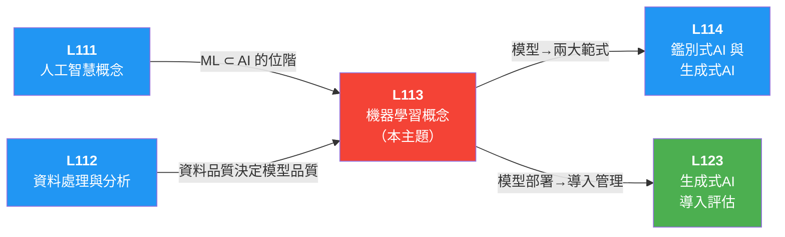

# 📖 L113 機器學習概念 — iPAS AI應用規劃師（初級）學習指南

> 對應評鑑範圍：**L11301 機器學習基本原理** ＋ **L11302 常見的機器學習模型**

---

## 0. 關鍵概念總覽圖

> 先鳥瞰整個 L113 的知識地圖，搞清楚所有專有名詞彼此之間的關係，之後讀細節時就不會迷路。

```
🧠 L113 機器學習概念
│
├── L11301 機器學習基本原理
│   │
│   ├── 📖 ML（Machine Learning，機器學習）核心定義
│   │   ├── 讓電腦從「資料」自動學習規則，不需人工逐條編寫
│   │   ├── 三大核心要素：資料（Data）＋ 模型（Model）＋ 損失函數（Loss Function）
│   │   ├── 傳統程式 = 人寫規則 ←→ ML = 從資料學出規則
│   │   └── DL（Deep Learning，深度學習）⊂ ML ⊂ AI（Artificial Intelligence，人工智慧）（套娃關係，見 L111）
│   │
│   ├── 🔄 ML 完整流程（三大階段）
│   │   │
│   │   ├── ① 資料處理（見 L112 詳細內容）
│   │   │   ├── 資料清洗（Data Cleaning）── 遺缺值/重複值/異常值處理
│   │   │   ├── 資料標準化（Data Normalization）── Min-Max / Z-score
│   │   │   └── 特徵選擇（Feature Selection）與降維（Dimensionality Reduction）── 過濾/包裝/嵌入法、PCA（Principal Component Analysis，主成分分析）
│   │   │
│   │   ├── ② 模型訓練
│   │   │   ├── 損失函數（Loss Function）── 衡量預測與實際的差異
│   │   │   │   ├── MSE（Mean Squared Error，均方誤差）── 迴歸任務，平方放大大錯誤
│   │   │   │   └── 交叉熵損失（Cross-Entropy）── 分類任務
│   │   │   │   └── ⭐ 損失越小 = 模型越準確
│   │   │   │
│   │   │   ├── 優化演算法（Optimization Algorithm）── 調整參數以最小化損失函數
│   │   │   │   ├── BGD（Batch Gradient Descent，批次梯度下降）── 用全部資料計算梯度
│   │   │   │   ├── SGD（Stochastic Gradient Descent，隨機梯度下降）── 每次用一筆樣本，快但不穩
│   │   │   │   ├── Mini-batch GD（Mini-batch Gradient Descent，小批次梯度下降）── 少量批次（如32/128筆），兼顧速度與穩定
│   │   │   │   │   └── ⭐ 現代深度學習幾乎都用 Mini-batch GD
│   │   │   │   └── Adam（Adaptive Moment Estimation，自適應矩估計）── 結合動量法（Momentum）+RMSProp（Root Mean Square Propagation，均方根傳播），自適應學習率，最常用
│   │   │   │
│   │   │   ├── 📉 梯度下降（Gradient Descent）常見問題
│   │   │   │   │
│   │   │   │   │   Loss
│   │   │   │   │    │
│   │   │   │   │    │╲    ╱╲
│   │   │   │   │    │ ╲  ╱  ╲       ╱╲
│   │   │   │   │    │  ╲╱    ╲     ╱  ╲
│   │   │   │   │    │  局部    ╲   ╱    ╲
│   │   │   │   │    │  最小值   ╲─╱      ╲___
│   │   │   │   │    │          鞍點      全域
│   │   │   │   │    └──────────────────── 最小值 ──→ 參數
│   │   │   │   │
│   │   │   │   │   學習率過大              學習率過小
│   │   │   │   │    │  ╳←╳               │
│   │   │   │   │    │╱    ╲              │  ·
│   │   │   │   │    │ 震盪！╲             │  · (龜速)
│   │   │   │   │    │╲    ╱              │   ·
│   │   │   │   │    │  ╳→╳               │    ·___卡住
│   │   │   │   │    └→ 發散               └→ 困在局部最小值
│   │   │   │   │
│   │   │   │   ├── 局部最小值（Local Minimum）── 小坑非最深谷底
│   │   │   │   ├── 鞍點（Saddle Point）── 某方向谷底、另方向山頂，梯度為零
│   │   │   │   ├── 學習率（Learning Rate）過大 → 震盪不收斂（發散）
│   │   │   │   └── 學習率（Learning Rate）過小 → 訓練過慢，可能卡在局部最小值
│   │   │   │
│   │   │   ├── 📉 梯度消失（Vanishing Gradient）與梯度爆炸（Exploding Gradient）（深度學習重要考點）
│   │   │   │   │
│   │   │   │   │   反向傳播時梯度經過每一層的變化：
│   │   │   │   │
│   │   │   │   │   梯度消失（Vanishing Gradient）        梯度爆炸（Exploding Gradient）
│   │   │   │   │   ──────────────────────               ──────────────────────
│   │   │   │   │   輸出層  ←  梯度 = 1.0               輸出層  ←  梯度 = 1.0
│   │   │   │   │     ↓    ×0.2（Sigmoid飽和區）           ↓    ×5.0（權重過大）
│   │   │   │   │   隱藏層3 ←  梯度 = 0.2               隱藏層3 ←  梯度 = 5
│   │   │   │   │     ↓    ×0.2                          ↓    ×5.0
│   │   │   │   │   隱藏層2 ←  梯度 = 0.04              隱藏層2 ←  梯度 = 25
│   │   │   │   │     ↓    ×0.2                          ↓    ×5.0
│   │   │   │   │   隱藏層1 ←  梯度 ≈ 0.008 😵          隱藏層1 ←  梯度 = 125 💥
│   │   │   │   │     ↓                                   ↓
│   │   │   │   │   淺層學不動！                          Loss → NaN！
│   │   │   │   │
│   │   │   │   │   解法：ReLU（梯度恆=1）               解法：梯度裁剪 + 權重初始化
│   │   │   │   │
│   │   │   │   ├── 梯度消失（Vanishing Gradient）── 訊號越傳越弱，淺層無法學習
│   │   │   │   │   ├── 成因：Sigmoid/Tanh 的飽和區（Saturation Region）（曲線兩端極平坦）
│   │   │   │   │   └── 解法：改用 ReLU（Rectified Linear Unit，修正線性單元）（正數照傳，梯度恆為1）
│   │   │   │   ├── 梯度爆炸（Exploding Gradient）── 梯度指數級增長，Loss 出現 NaN
│   │   │   │   │   └── 解法：梯度裁剪（Gradient Clipping）＋權重初始化（Weight Initialization）＋學習率排程（Adam）
│   │   │   │   └── 🔥 Loss 出現 NaN = 梯度爆炸的典型特徵
│   │   │   │
│   │   │   └── 過擬合（Overfitting）防範（🔥 超高頻考點）
│   │   │       ├── 什麼是過擬合（Overfitting）？訓練好、測試差 = 模型記住雜訊
│   │   │       ├── 什麼是欠擬合（Underfitting）？訓練差、測試也差 = 模型太簡單
│   │   │       ├── 偏差-變異權衡（Bias-Variance Tradeoff）
│   │   │       │   └── 在偏差（underfitting）與變異（overfitting）間取平衡
│   │   │       │
│   │   │       ├── 【資料面】增加資料量、資料增強（Data Augmentation）、資料清理
│   │   │       ├── 【特徵面】特徵選擇、PCA 降維
│   │   │       ├── 【模型面】降低複雜度、正則化（Regularization，L1/L2）、Dropout、剪枝（Pruning）
│   │   │       ├── 【訓練面】Early Stopping（早停法）、Batch Normalization（批次正規化）
│   │   │       └── 【評估面】驗證集（Validation Set）、交叉驗證（Cross-Validation）、避免資料洩漏（Data Leakage）
│   │   │           └── 🔥 L1 可使權重變 0（稀疏）；L2 使權重變小但不為 0
│   │   │
│   │   └── ③ 模型評估與優化
│   │       │
│   │       ├── 📊 分類評估指標（混淆矩陣家族）
│   │       │   │
│   │       │   │   預測正    預測負
│   │       │   │   ┌────────┬────────┐
│   │       │   │   │  TP    │  FN    │ ← 實際正
│   │       │   │   ├────────┼────────┤
│   │       │   │   │  FP    │  TN    │ ← 實際負
│   │       │   │   └────────┴────────┘
│   │       │   │
│   │       │   ├── 準確率/精確度 Accuracy = (TP+TN) / 全部
│   │       │   │   └── 錯誤率 Error Rate = (FP+FN) / 全部 ← Accuracy + Error Rate = 100%
│   │       │   ├── 精確率 Precision（精確率）= TP / (TP+FP)  ⚠ 與「精確度」僅一字之差！
│   │       │   │   └── 問：「預測為正的裡面，有幾個真的是正？」
│   │       │   ├── 召回率 Recall（召回率）= TP / (TP+FN)
│   │       │   │   └── 問：「所有真正為正的，我找回了幾個？」
│   │       │   ├── F1 Score = 2 × Precision × Recall / (Precision + Recall)
│   │       │   │   └── Precision 與 Recall 的調和平均（Harmonic Mean），適合不平衡資料
│   │       │   ├── 選取率 Selection Rate = 判定為正類的比例（反映模型攔截傾向）
│   │       │   ├── ⚖️ 門檻蹺蹺板：門檻嚴 → Recall ↑ Precision ↓；門檻鬆 → Precision ↑ Recall ↓
│   │       │   └── 🔥 資料不平衡時，Accuracy 會誤導，用 F1 更好
│   │       │
│   │       ├── 📏 迴歸評估指標（五兄弟）
│   │       │   ├── MSE（Mean Squared Error，均方誤差）── 平方放大大錯誤（嚴厲老師）
│   │       │   ├── RMSE（Root Mean Squared Error，均方根誤差）── √MSE，還原原始單位（直觀解讀）
│   │       │   ├── MAE（Mean Absolute Error，平均絕對誤差）── 絕對值均值，一視同仁（穩健不怕離群值）
│   │       │   ├── MAPE（Mean Absolute Percentage Error，平均絕對百分比誤差）── 誤差百分比，跨尺度可比（🔥 y=0 時無法算）
│   │       │   └── R²（決定係數，Coefficient of Determination）── 模型解釋力 0~1（越接近 1 越好）
│   │       │
│   │       ├── 🔀 資料切分（Data Splitting）
│   │       │   ├── 訓練集（Training Set）── 學習用（最大份）
│   │       │   ├── 驗證集（Validation Set）── 調超參數用（中間份）
│   │       │   └── 測試集（Test Set）── 最終評估用（不參與訓練與調參）
│   │       │   └── 🔥 資料洩漏（Data Leakage）= 測試資訊流入訓練 → 虛假高準確率
│   │       │
│   │       ├── 🔄 交叉驗證（K-Fold Cross-Validation）
│   │       │   ├── 分成 K 份，輪流用 1 份測試、K-1 份訓練，重複 K 次取平均
│   │       │   └── 優點：更穩定評估、降低過擬合風險
│   │       │
│   │       └── 🎛️ 超參數調整（Hyperparameter Tuning）
│   │           ├── 網格搜索（Grid Search）── 逐一嘗試所有組合
│   │           ├── 隨機搜索（Random Search）── 隨機抽取組合
│   │           └── 貝葉斯優化（Bayesian Optimization）── 根據歷史結果智慧搜索
│   │
│   └── 📅 模型部署（Model Deployment）與效能管理
│       ├── 線上推論（Real-time Inference）── 即時回應（如推薦系統）
│       ├── 批次推論（Batch Inference）── 定期大量處理（如月報預測）
│       ├── 資料漂移（Data Drift）── 新資料分布偏離訓練資料
│       └── 持續監控（Continuous Monitoring）── 上線後須定期追蹤模型效能
│
└── L11302 常見的機器學習模型
    │
    ├── 📘 監督式學習（Supervised Learning）── 需要標籤資料
    │   │
    │   ├── 🔢 迴歸任務（Regression，預測連續值）
    │   │   ├── 線性迴歸（Linear Regression）── 擬合直線，預測房價/銷售額
    │   │   └── 邏輯迴歸（Logistic Regression）── 名字有「迴歸」但其實做分類（輸出 0~1 機率）
    │   │       └── 🔥 陷阱：邏輯迴歸是「分類」模型，不是迴歸模型！
    │   │
    │   ├── 🏷️ 分類任務（Classification，預測離散類別）
    │   │   ├── 決策樹（Decision Tree）── 像 if-else 流程圖，可解釋性最佳
    │   │   │   └── 缺點：容易過擬合 → 用剪枝（Pruning）解決
    │   │   ├── 隨機森林（Random Forest）── 集成多棵決策樹＋投票，降低過擬合
    │   │   ├── SVM（Support Vector Machine，支援向量機）── 找最佳分類超平面
    │   │   │   └── 適合小資料集的二元分類
    │   │   ├── KNN（K-Nearest Neighbors，K 近鄰）── 依距離找最近 K 個鄰居投票
    │   │   │   └── 例：K=3，鄰居 A/B/A → 預測為 A（多數決）
    │   │   ├── 貝氏分類器（Naive Bayes）
    │   │   │   ├── 基於機率的分類，假設特徵彼此獨立
    │   │   │   ├── 常用於文字分類、垃圾郵件過濾
    │   │   │   └── 🔥 屬於生成式模型（學習 P(x,y)），不是鑑別式
    │   │   └── 神經網路（Neural Network）── 模仿人腦神經元，處理複雜非線性問題
│   │       ├── 結構化預測（Structured Prediction）── 預測內部結構複雜的物件
│   │       └── Wide & Deep ── 結合記憶（線性）與泛化（DNN），推薦系統最愛
    │   │
    │   └── 📊 集成學習（Ensemble Learning）
    │       ├── Bagging（自助聚合法）── 多模型平行訓練＋投票（代表：隨機森林）
    │       ├── Boosting（提升法）── 模型串接，後者修正前者錯誤
    │       │   └── 代表：XGBoost（eXtreme Gradient Boosting，極端梯度提升）、GBM（Gradient Boosting Machine，梯度提升機）
    │       └── Stacking（堆疊法）── 多模型輸出當新特徵，再訓練元模型（Meta Model）
    │
    ├── 📗 非監督式學習（Unsupervised Learning）── 不需標籤
    │   │
    │   ├── 🔵 聚類 / 分群（Clustering）── 將相似資料分群
    │   │   ├── K-Means ── 最常考！
    │   │   │   ├── 指定 K 個群，隨機選初始中心，迭代更新
    │   │   │   ├── 🔥 不同初始中心 → 可能不同結果
    │   │   │   ├── 🔥 不適合非球形、密度不均、有離群值
    │   │   │   └── 🔥 不能處理類別型資料
    │   │   ├── 層次聚類（Hierarchical Clustering）── 由下而上合併或由上而下分裂
    │   │   └── DBSCAN（Density-Based Spatial Clustering of Applications with Noise，基於密度的空間聚類）── 密度型分群，可發現任意形狀群聚
    │   │
    │   └── 🔻 降維（Dimensionality Reduction）
    │       ├── PCA（Principal Component Analysis，主成分分析）── 線性、非監督、找最大變異方向（最常考）
    │       ├── LDA（Linear Discriminant Analysis，線性判別分析）── 線性、監督式（需標籤）、找類別最可分方向
    │       ├── t-SNE（t-distributed Stochastic Neighbor Embedding，t-分布隨機鄰域嵌入）── 非線性，主要用於視覺化，不適合做模型前處理
    │       ├── UMAP（Uniform Manifold Approximation and Projection，均勻流形近似與投影）── 類似 t-SNE 但更快
    │       └── Autoencoder（自編碼器）── 深度學習式降維，處理非線性
    │       └── ⭐ PCA vs LDA：PCA 看整體變異，LDA 看類別分離
    │
    ├── 📙 半監督式學習（Semi-supervised Learning）
    │   ├── 少量有標籤 + 大量無標籤資料
    │   ├── 目的：降低標註成本
    │   └── 適用：標註成本高的場景（醫療影像、文本分類）
    │
    ├── 📕 強化學習（Reinforcement Learning）
    │   ├── 三要素：代理（Agent）＋環境（Environment）＋獎勵（Reward）
    │   ├── 核心：透過「試錯學習（Trial and Error）」最大化累積獎勵
    │   ├── 流程：觀察狀態 → 選行動 → 獲獎勵 → 更新策略
    │   ├── Q-Learning ── 學習每個行動的長期價值（Q 值）
    │   │   └── 🔥 高維狀態空間時 Q 表太大 → 用 Deep Q-Learning
    │   ├── Deep Q-Learning ── 用深度神經網路近似 Q 值
    │   │   └── 技術：經驗回放（Experience Replay）＋ 目標網路（Target Network）
    │   └── 應用：AlphaGo、Atari 遊戲、自動駕駛路徑規劃、機器人控制
    │
    ├── 📓 自監督學習（Self-supervised Learning）
    │   ├── 由資料本身產生監督訊號，不需人工標註
    │   └── 大型語言模型預訓練的基礎：
│       ├── GPT（Generative Pre-trained Transformer，生成式預訓練轉換模型）系列
│       └── BERT（Bidirectional Encoder Representations from Transformers，雙向編碼器表徵轉換模型）
    │
    ├── 🌐 多模態學習（Multimodal Learning）
    │   ├── 同時處理多種類型資料（文字+圖像+音訊+影片）
    │   └── 例：GPT-4V 同時理解文字與圖像
    │
    └── 🔷 深度學習常見架構
        ├── CNN（Convolutional Neural Network，卷積神經網路）── 擅長影像
        │   ├── 卷積層（Convolutional Layer）提取空間特徵 + 池化層（Pooling Layer）降維
        │   ├── 權值共享（Weight Sharing）→ 大幅減少參數量
        │   ├── 應用：影像分類、物件偵測、人臉辨識
        │   └── 電腦視覺（Computer Vision, CV）三大任務階梯
        │       ├── 影像分類（Image Classification）── 只貼標籤（「這是什麼？」）
        │       ├── 物件偵測（Object Detection）── 標籤＋位置（畫 Bounding Box）
        │       │   ├── YOLO（You Only Look Once）── 速度優先（即時場景首選）
        │       │   └── Faster R-CNN（Faster Region-based Convolutional Neural Network，快速區域卷積神經網路）── 準確度優先
        │       └── 影像分割（Image Segmentation）── 像素級輪廓塗色（最精細）
        │           ├── U-Net ── 醫學影像首選
        │           └── Mask R-CNN（Mask Region-based Convolutional Neural Network，遮罩區域卷積神經網路）── 偵測＋分割結合
        │
        ├── RNN（Recurrent Neural Network，循環神經網路）── 擅長序列
        │   ├── 有「記憶」能力，可處理可變長度序列
        │   ├── 🔥 長序列會梯度消失 → 用 LSTM / GRU（Gated Recurrent Unit，門控循環單元）解決
        │   └── 應用：語音辨識、時間序列預測、機器翻譯
        │
        ├── LSTM（Long Short-Term Memory，長短期記憶）── RNN 的改良版
        │   ├── 記憶閘門機制（Gate Mechanism），解決 RNN 梯度消失問題
        │   └── 應用：長期氣候預測、股價趨勢分析
        │
        └── Transformer（轉換器）── 目前最主流架構
            ├── 核心：自注意力機制（Self-Attention）
            ├── 完全拋棄 RNN/CNN，可平行處理
            ├── 論文：《Attention is All You Need》(2017)
            ├── BERT（Bidirectional Encoder Representations from Transformers，雙向編碼器表徵轉換模型）── 偏 Encoder-only（擅長理解、分類）
            ├── GPT（Generative Pre-trained Transformer，生成式預訓練轉換模型）── 偏 Decoder-only（擅長生成）
            └── 應用：GPT、BERT、所有主流大型語言模型
```

---

## 1. 關鍵術語與定義

### 1-1 學習範式（Learning Paradigms）

> 📝 **一句話速記**：先分清監督式（有標籤）、非監督式（無標籤）、強化學習（獎勵回饋）三大範式，再記半監督、自監督、多模態的差異。

> ```
> 層次關係圖：機器學習的三大基礎範式與進階延伸
>
> 機器學習（Machine Learning）
> │
> ├── 🔑 基礎學習範式（以「有無標籤」區分）
> │   ├── 監督式學習（Supervised Learning）── 100% 有標籤，有標準答案
> │   │   ├── 分類（Classification）── 預測離散標籤
> │   │   └── 迴歸（Regression）── 預測連續數值
> │   │
> │   ├── 非監督式學習（Unsupervised Learning）── 0% 有標籤，自己找規律
> │   │   ├── 聚類（Clustering）── 把相似的分一群
> │   │   └── 降維（Dimensionality Reduction）── 減少特徵數量
> │   │
> │   └── 半監督式學習（Semi-supervised Learning）── 少量標籤 + 大量無標籤
> │
> ├── 🎮 從互動中學習
> │   └── 強化學習（Reinforcement Learning）── 透過獎勵與懲罰學習最佳策略（無標準答案）
> │
> └── 🚀 現代進階範式
>     ├── 自監督學習（Self-supervised Learning）── 自己生標籤（語言模型核心）
>     └── 多模態學習（Multimodal Learning）── 同時看懂圖文音訊
>
> 關鍵對比：
>   有標籤？ ── 監督式（全有）、半監督（少有）、非監督（全無）
>   有獎懲？ ── 強化學習（互動試錯）
> ```
>
> 一句話串起來：**機器學習先看「有沒有標準答案（標籤）」分出監督、半監督和非監督；如果沒有答案只有「分數（獎勵）」，那就是強化學習；進階版則是自己造答案（自監督）和看圖聽音（多模態）。**

> 🗣️ **為什麼要分學習範式？什麼時候需要？**
>
> 選擇模型就像請員工解決問題：你要先看「手上有什麼資源（標籤資料）」，然後決定「要解決什麼問題」。
> - **有標籤**就像有標準答案的題庫，可以直接教模型（監督式）。
> - **沒標籤**就需要模型自己摸索歸納（非監督式）。
> - 如果目標是**學騎腳踏車**，你沒辦法教標準動作，只能讓他試騎，摔倒（扣分）或往前溜（加分），這就是強化學習。
>
> **什麼時候該用哪種？**
> | 情境 | 選擇 | 原因 |
> |------|------|------|
> | 預測房價、判斷信件是否為垃圾郵件 | 監督式學習 | 手上已經有歷史價格與是否為垃圾信的「標準答案」 |
> | 客戶分群、發掘異常交易 | 非監督式學習 | 沒有預先定義什麼是好客戶或異常，靠資料特徵找規律 |
> | 醫療影像判讀，但只有 10% 影像有醫生標註 | 半監督式學習 | 標註成本太高，結合少量標註與大量未標註資料 |
> | 訓練 AI 下圍棋、自動駕駛路徑規劃 | 強化學習 | 無標準答案，僅有最終輸贏或是否撞車的延遲獎勵 |
> | 訓練 ChatGPT 理解語言 | 自監督學習 | 直接把文章挖空讓模型猜字，節省億萬級文字的標註成本 |

**① 核心概念**

- **機器學習 (Machine Learning, ML)** — AI 的子集，讓電腦從「資料」中自動學習規則，不需人工逐條編寫程式，實現分類、迴歸、聚類等任務。
  > 🗣️ 像教小孩認蘋果：不是寫規則「紅色的、圓的」，而是拿一堆蘋果和香蕉給他看（資料），他自己會歸納出蘋果的特徵。

**② 基礎學習範式**

- **監督式學習 (Supervised Learning)** — 使用有標籤資料訓練，學習輸入與輸出的映射關係。主要任務：分類（預測離散類別）和迴歸（預測連續數值）。
  > 🗣️ 像有老師批改作業：每題都有標準答案，做錯了老師告訴你正確答案，慢慢學會規則。
- **非監督式學習 (Unsupervised Learning)** — 使用無標籤資料，探索資料內在結構。主要任務：聚類（分群）和降維。
  > 🗣️ 像把一堆雜亂的襪子自己分類：沒人告訴你怎麼分，你自己按顏色、長短摸索出分法。
- **半監督式學習 (Semi-supervised Learning)** — 結合少量有標籤和大量無標籤資料學習，目的是降低標註成本。
  > 🗣️ 老師只批改了 10 題，剩下 990 題你參考那 10 題的規律自己做。省下老師的時間。

**③ 互動與進階範式**

- **強化學習 (Reinforcement Learning)** — 代理（Agent）透過與環境互動，根據獎勵/懲罰回饋學習最佳策略，核心是「試錯學習」和最大化累積獎勵。
  > 🗣️ 像訓練小狗：做對了給零食（獎勵），做錯了不給。小狗透過不斷試錯學會哪些行為能拿到最多零食。
- **自監督學習 (Self-supervised Learning)** — 由資料本身產生監督訊號，不需人工標註。大語言模型預訓練的基礎。
  > 🗣️ 像做克漏字填空：把文章遮住一個字自己猜答案，答案就藏在文章裡，不需要老師。
- **多模態學習 (Multimodal Learning)** — 同時處理並整合多種類型資料（文字、圖像、音訊、影片）的學習方式。
  > 🗣️ 像人同時用眼睛看、耳朵聽、手摸來認識一個東西，綜合多種感官做判斷。

> ⚠ **學習範式考試速記**：
> - **有沒有標籤**是最核心的區分：監督式（全有）、半監督（少量有）、非監督（全無）。
> - 強化學習**沒有標準答案**，靠的是「互動＋延遲回饋（獎勵）」。
> - 自監督學習與非監督學習不同：自監督**有標籤**，只是標籤是從「資料本身」挖出來的，而不需要「人工」標註。
> - 大語言模型（LLM）的預訓練階段使用的是**自監督學習**。

### 1-2 傳統機器學習模型（Classical ML Models）

> �� **一句話速記**：邏輯迴歸是分類不是迴歸、K-Means 是分群不是分類、KNN 靠距離投票，三者最易混淆必考。

> ```
> 層次關係圖：傳統機器學習模型的兩大陣營
>
> 傳統機器學習模型
> │
> ├── 📘 監督式模型（有標籤）
> │   ├── 迴歸（Regression ── 預測數值）
> │   │   └── 線性迴歸（Linear Regression）── 畫最貼合的直線
> │   │
> │   └── 分類（Classification ── 預測類別）
> │       ├── 邏輯迴歸（Logistic Regression）── 二分類基線（⚠ 是分類！）
> │       ├── 決策樹（Decision Tree）── if-else 流程圖
> │       ├── 隨機森林（Random Forest）── 多棵樹投票（Bagging 集成）
> │       ├── SVM（支援向量機）── 找最大邊界超平面
> │       ├── KNN（K近鄰）── 看最近鄰居投票（Lazy Learning）
> │       └── 貝氏分類器（Naive Bayes）── 用貝氏定理算機率（⚠ 本質是生成式模型）
> │
> └── 📗 非監督式模型（無標籤）
>     ├── 聚類（Clustering ── 相似分群）
>     │   ├── K-Means ── 指定 K 群，找群心
>     │   ├── 層次聚類（Hierarchical Clustering）── 畫樹狀圖
>     │   └── DBSCAN ── 基於密度找任意形狀
>     │
>     └── 關聯分析（Association）
>         └── Apriori 演算法 ── 找「常一起出現」的組合（購物籃分析）
>
> 關鍵對比：
>   找答案：線性迴歸（預測數值）、邏輯迴歸（基準分類）、決策樹（好解釋）、隨機森林（穩）、SVM（高維小資料）、KNN（免訓練）、貝氏分類器（機率推理）
>   找規律：K-Means（圓形群）、層次聚類（樹狀圖）、DBSCAN（任意形狀）、關聯分析（商品搭配）
> ```
>
> 一句話串起來：**傳統模型分兩大陣營，有答案的監督式專攻「迴歸（預測數值）」和「分類（預測類別）」；沒答案的非監督式專攻「聚類（相似分群）」和「關聯分析（找搭配）」。**

> 🗣️ **為什麼要傳統模型？什麼時候需要？**
>
> 雖然深度學習（神經網路）很強，但它像一把「殺牛刀」，當資料量不大或計算資源有限時，傳統模型才是首選。而且決策樹等模型提供極高的「可解釋性」，這在注重合規的金融或醫療業是深度學習無法取代的。
>
> **什麼時候選哪個模型？**
> | 情境 | 選擇 | 原因 |
> |------|------|------|
> | 快速建立效能基準（Baseline）或二元分類 | 邏輯迴歸 | 簡單、速度極快、容易解釋 |
> | 需要向老闆解釋「為什麼拒絕貸款」 | 決策樹 | if-else 的規則人眼看得懂 |
> | 表格資料多，追求高準確率且不想調太多參數 | 隨機森林 | 多棵樹投票，穩定且不易過擬合 |
> | 資料量小但特徵維度極高（如基因資料） | SVM | 擅長在高維空間找分類邊界 |
> | 超市想發掘「買尿布的人常買啤酒」的規律 | 關聯分析（Apriori） | 非監督式尋找項目間的共現規則 |
> | 想把客戶分群定位目標客群，但不知道有幾種客 | 聚類（K-Means/DBSCAN） | 利用相似度自動分群 |

**① 監督式：迴歸與分類模型**

- **線性迴歸 (Linear Regression)** — 最基礎的迴歸模型，擬合一條直線來預測連續數值（如房價、銷售額）。
  > 🗣️ 把過去的房價點在圖上，畫一條最剛好穿過它們的線，用這條線來猜未來的房價。
- **邏輯迴歸 (Logistic Regression)** — 名為「迴歸」但實際上做「分類」，輸出 0~1 的機率值，適合二元分類。
  > 🗣️ 像算及格率：算出一個 0~100% 的機率，大於 60% 就判及格（類別 1），小於就判不及格（類別 0）。
- **決策樹 (Decision Tree)** — 透過一系列 if-else 條件逐步分類資料，可解釋性極高，但易過擬合。（需用「剪枝 Pruning」改善）
  > 🗣️ 像玩「20 問」遊戲：「有房嗎？」「月薪 > 5 萬嗎？」一路問下去決定核准信用卡與否。一目了然但容易死記答案。
- **隨機森林 (Random Forest)** — 集成多棵隨機生成的決策樹並進行投票（Bagging）。有效降低單一樹過擬合的風險。
  > 🗣️ 找 100 個決策樹組成委員會，大家獨立判斷後少數服從多數。人多智慧高，不容易出錯。
- **SVM (Support Vector Machine，支援向量機)** — 在兩群資料間尋找能區分彼此的「最寬的馬路」（最大邊界超平面）。適合小樣本、高維度資料。
  > 🗣️ 在桌上的紅豆和綠豆中間畫一條線分開它們，且線要盡量離豆子越遠越好。混在一起的放高空（高維空間核函數）再切。
- **KNN (K-Nearest Neighbors，K 近鄰)** — 不需要預先訓練模型（惰性學習 Lazy Learning）。預測時找出距離最近的 K 個資料點做多數決。
  > 🗣️ 「近朱者赤」：看你身邊最近的 3 個鄰居是什麼人，多數決定你的類別。因為算距離，**必須先做特徵標準化**。
- **貝氏分類器 (Naive Bayes)** — 基於機率與貝氏定理的分類演算法，假設每個特徵彼此獨立。本質是**生成式模型**（學習 P(x,y)）。
  > 🗣️ 像福爾摩斯辦案：發現案發現場有雪茄灰和泥土，根據過去犯罪檔案（機率）推算兇手身分。常用於垃圾郵件過濾。

> 🔍 **分類模型進階比較**
>
> | 比較項目 | 邏輯迴歸 | 決策樹 | 隨機森林 | SVM | KNN |
> |---------|---------|--------|---------|-----|-----|
> | **核心思路** | 算機率切門檻 | yes/no 流程圖 | 多棵樹投票 | 最大邊界超平面 | 找最近 K 個鄰居 |
> | **可解釋性** | ⭐⭐⭐ 高 | ⭐⭐⭐最高 | ⭐⭐ 中 | ⭐ 低 | ⭐⭐ 中 |
> | **過擬合風險**| 🟢 低 | 🔴 高（須剪枝）| 🟢 低 | 🟡 中 | 🔴 K小則高 |
> | **需特徵縮放?**| 🟡 建議 | ❌ 不需 | ❌ 不需 | ✅ 必須 | ✅ 必須 |

**② 非監督式：聚類與關聯分析**

- **K-Means** — 最常見的聚類演算法，需預先指定分成 K 個群，反覆更新群心直到穩定。不同初始中心點可能導致不同結果，且不適合奇形怪狀的群聚。不能處理文字等類別資料。
  > 🗣️ 操場上插 K 面旗子，要大家走到最近的旗子旁集合；接著把旗子移到各群的中心點，大家再重新挪位置。重複直到沒人換位置。
- **層次聚類 (Hierarchical Clustering)** — 不需預設群數。可由下而上（凝聚式）逐步合併，或由上而下（分裂式）逐步切分，形成樹狀圖（Dendrogram）。
  > 🗣️ 像編族譜：找最像的兩個人合成一個小家庭，再找最像的家庭合成大家族，最後變成一整棵樹。
- **DBSCAN (基於密度的空間聚類)** — 透過尋找高密度區域來分群。不需預設群數，能自動辨識並排除離群值（噪音點），且能抓出任意形狀的群聚。
  > 🗣️ 找「夜市裡人擠人」的區域框成一群。如果有人在旁邊空地上發呆（密度低），自動標為「邊緣人（離群值）」。
- **關聯分析 (Association Analysis)** — 從大量交易中發掘項目間的共現規則（如「若買 A 則也買 B」）。核心演算法為 Apriori。
  > 🗣️ 超市發現「買尿布的爸爸常常順便買啤酒」，於是把這兩樣東西擺一起賣（購物籃分析）。

> 🔍 **聚類模型進階比較**
>
> | 比較項目 | K-Means | 層次聚類 | DBSCAN |
> |---------|---------|---------|--------|
> | **需預設群數 K？** | ✅ 必須 | ❌ 不需 | ❌ 不需 |
> | **群的形狀** | 只能是球型（圓形） | 任意形狀 | 任意形狀 |
> | **能偵測離群值？** | ❌ 容易受干擾 | ❌ 不能 | ✅ 自動標記噪音點 |

**③ 跨類別：神經網路**

- **神經網路 (Neural Network)** — 模仿人腦神經元結構的模型，處理複雜的非線性問題，是深度學習的基礎架構。
- **結構化預測 (Structured Prediction)** — 預測目標不再是單一數值（迴歸）或單一標籤（分類），而是具有內部結構的複雜物件。例如：將一段法文翻譯成語法結構正確的英文句子、或在 NLP 中做序列標注。
- **Wide & Deep Learning** — Google 提出的經典推薦系統架構。Wide 部分（線性模型）負責「死背」歷史中頻繁出現的特定組合；Deep 部分（深層神經網路）負責發掘並「泛化」未知的特徵關聯。兩者結合廣泛用於 App 推薦與廣告點擊預測。
- **Sigmoid vs Softmax (激活函數雙雄)** — 
  - **Sigmoid**：將數值壓縮到 0~1 之間。各類別機率獨立，常用於**二元分類**或多標籤分類（例如一張圖可以同時判定是「貓」且是「白色」）。
  - **Softmax**：將多個輸出轉換為機率分布，保證「所有類別的機率總和必定為 1」。常用於**互斥的多類別分類**（例如一張圖只能是貓、狗或兔子其中一種，不可能同時是兩種）。

> ⚠ **傳統模型考試速記**：
> - 邏輯迴歸（Logistic Regression）是**分類**模型，不是迴歸模型。
> - KNN 是監督式「分類」，K-Means 是非監督式「聚類」，別搞混。
> - 決策樹容易過擬合，解法是**剪枝（Pruning）**；隨機森林能抗過擬合，因為是**集成法（Bagging）**。
> - SVM 和 KNN 依賴計算「距離」，所以訓練前**必須做特徵標準化/正規化**；決策樹/隨機森林不需要。
> - 貝氏分類器（Naive Bayes）名為分類器，但它是**生成式模型（Generative Model）**。

### 1-3 深度學習模型（Deep Learning Models）

> 📝 **一句話速記**：CNN 看圖、RNN 看序列（但會梯度消失→用 LSTM）、Transformer 靠自注意力平行處理，是所有 LLM 的基礎；GPT 用 Decoder 生成，BERT 用 Encoder 理解。

> ```
> 層次關係圖：深度學習架構演進與 Transformer 內部結構
>
> 深度學習架構
> │
> ├── CNN（Convolutional Neural Network，卷積神經網路）── 影像專家
> │   └── 卷積層提取空間特徵 + 池化層降維
> │
> ├── RNN（Recurrent Neural Network，循環神經網路）── 序列專家（但有缺陷）
> │   ├── ⚠ 瓶頸：梯度消失（長序列會遺忘）
> │   ├── LSTM（Long Short-Term Memory）── 閘門機制解決遺忘
> │   └── GRU（Gated Recurrent Unit）── 簡化版 LSTM
> │
> └── Transformer ── 目前最主流架構（取代 RNN）
>     │
>     ├── 🔧 內部結構
>     │   ├── 編碼器-解碼器（Encoder-Decoder）── 整體骨架
>     │   ├── 自注意力機制（Self-Attention）── 核心引擎（每個字看見所有字）
>     │   │   └── 多頭注意力（Multi-Head Attention）── 多角度同時看
>     │   └── 位置編碼（Positional Encoding）── 補回平行處理丟失的順序感
>     │
>     ├── 🔀 架構變體
>     │   ├── GPT（Decoder-only）── 擅長生成（單向，左→右）
>     │   └── BERT（Encoder-only）── 擅長理解（雙向，前後文）
>     │
>     └── 🖼️ 跨領域延伸
>         └── ViT（Vision Transformer）── 文字→影像
>
> 演進脈絡：
>   RNN（會忘）→ LSTM（不會忘但逐字讀）→ Transformer（一次全看完）
>
> 選用決策：
>   影像分類？ ──── CNN
>   時間序列？ ──── RNN / LSTM
>   文字生成？ ──── Transformer（GPT）
>   文字理解？ ──── Transformer（BERT）
>   圖片+文字？ ── Transformer（ViT / 多模態）
> ```
>
> 一句話串起來：**CNN 專攻影像、RNN/LSTM 專攻序列但有遺忘問題，Transformer 用自注意力機制一次看全部取代了 RNN，內部由編碼器-解碼器骨架 + 自注意力引擎 + 位置編碼組成，再衍生出 GPT（生成）和 BERT（理解）兩大變體，ViT 則把同一套架構搬到影像領域。**

> 🗣️ **為什麼要理解深度學習架構？什麼時候需要？**
>
> 不同的資料類型需要不同的架構，選錯架構就像用錘子切菜——工具不對，結果不會好。考試常考「什麼情境該用什麼架構」，以及「Transformer 為什麼能取代 RNN」。
>
> **什麼時候該用哪種架構？**
> | 情境 | 選擇 | 原因 |
> |------|------|------|
> | 醫療影像分類、物件偵測 | CNN | 擅長提取影像空間特徵 |
> | 語音辨識、股價預測 | RNN / LSTM | 擅長處理時間序列 |
> | 聊天機器人、文字生成 | Transformer（GPT） | Decoder 逐詞生成 |
> | 文本分類、命名實體辨識 | Transformer（BERT） | Encoder 雙向理解上下文 |
> | 圖片描述生成、多模態任務 | Transformer（ViT） | 把圖片切塊當 Token 處理 |
> | 長序列且需平行加速 | Transformer | 自注意力機制解決長距離依賴 + 可平行化 |

**① 三大基礎架構：CNN vs RNN/LSTM vs Transformer**

- **CNN (Convolutional Neural Network，卷積神經網路)** — 擅長影像任務，用卷積層提取空間特徵、池化層降維，權值共享減少參數。（基本概念見 L111）
  > 🗣️ 像拿放大鏡掃描照片：只看局部區域的特徵（邊緣、紋理），一層層拼出全貌。天生適合有「空間結構」的資料（影像），但不懂順序。
- **RNN (Recurrent Neural Network，循環神經網路)** — 擅長序列任務，有記憶能力但長序列會梯度消失。（基本概念見 L111）
  > 🗣️ 像逐字朗讀文章：必須一個字一個字處理，無法跳著看，所以訓練慢。讀到後面就忘了前面。
- **LSTM (Long Short-Term Memory，長短期記憶)** — RNN 的改良版，用記憶閘門機制（遺忘門 Forget Gate + 輸入門 Input Gate + 輸出門 Output Gate）解決梯度消失問題，適合長序列。（基本概念見 L111）
  > 🗣️ RNN 加了筆記本（閘門）：該忘的忘、該記的記，解決遺忘問題，但「一個接一個讀」的本質沒變，還是慢。
- **GRU (Gated Recurrent Unit，門控循環單元)** — RNN 的改良版，與 LSTM 類似都能解決梯度消失問題，但結構更簡單（只有重置門和更新門，沒有 LSTM 的遺忘門）。計算效率比 LSTM 高，在較短序列或資料量較小時表現相當。
  > 🗣️ LSTM 的精簡版：把三道閘門縮成兩道，效果差不多但跑更快。

> 🔍 **LSTM vs GRU 比較**
>
> | 比較項目 | LSTM | GRU |
> |---------|------|-----|
> | **閘門數量** | 3（遺忘門、輸入門、輸出門） | 2（重置門、更新門） |
> | **模型複雜度** | 較高 | 較低 |
> | **計算速度** | 較慢 | 較快 |
> | **適合序列長度** | 長序列 | 短至中等序列 |
> | **適合資料量** | 大量資料 | 資料量較小時表現相當 |
> | **解決梯度消失？** | ✅ 是 | ✅ 是 |

- **Transformer** — 基於自注意力機制（Self-Attention）的架構，可平行處理，目前所有主流 LLM（Large Language Model，大型語言模型）的基礎。其主要訓練挑戰是**巨大的計算資源需求**（高耗能與延遲），而非梯度消失（梯度消失主要是 RNN 的問題）。（基本概念見 L111）
  > 🗣️ 像開卷考試：把整篇文章攤開，用螢光筆標記「哪些字跟哪些字有關」（Self-Attention），一次全部處理完。速度快、效果好，但需要很大的考桌（計算資源）。

> 🔍 **三大架構比較——適用資料類型與架構差異**
>
> | 比較項目 | CNN | RNN / LSTM | Transformer |
> |---------|-----|-----------|-------------|
> | **擅長資料類型** | 影像（空間結構） | 序列（時間序列、文字） | 幾乎所有類型（文字、影像、多模態） |
> | **核心機制** | 卷積核（Kernel）滑動提取局部特徵 | 隱藏狀態（Hidden State）逐步傳遞記憶 | 自注意力（Self-Attention）全局關聯 |
> | **處理方式** | 局部 → 全局（逐層擴大感受野） | 逐步（Sequential，一個接一個） | 平行（Parallel，一次看全部） |
> | **長距離依賴** | ❌ 受限於感受野大小 | ⚠ RNN 差 / LSTM 改善但仍有限 | ✅ 直接建立任意位置間的關聯 |
> | **訓練速度** | 中等 | 🐢 慢（無法平行化） | ⚡ 快（可平行化） |
> | **主要瓶頸** | 不擅長序列/順序資訊 | 梯度消失（RNN）、訓練慢 | 計算資源需求巨大（O(n²) 注意力） |
> | **代表應用** | 影像分類、物件偵測 | 語音辨識、時間序列預測 | LLM、機器翻譯、多模態 |

**② Transformer 內部結構**

- **編碼器-解碼器架構 (Encoder-Decoder)** — Transformer 的核心架構。編碼器將輸入轉換為特徵表示，解碼器根據特徵生成新的文本序列。
  > 🗣️ 像翻譯官的工作流程：編碼器先「聽懂」原文（把輸入壓縮成重點筆記），解碼器再根據筆記「說出」譯文。
- **自注意力機制 (Self-Attention)** — Transformer 的核心機制，讓序列中每個字都能「環顧」所有其他字，計算彼此的關聯程度，自動找出最相關的上下文。例如讀到「牠很可愛」時，「牠」會自動關注前文的「小貓」，理解指代關係。
  > 🗣️ 像讀一句話時，每個字都「環顧」所有其他字，自動找出誰跟自己最有關——「牠很可愛」中的「牠」會自動連結到前文的「小貓」。
- **多頭注意力 (Multi-Head Attention)** — Transformer 中的關鍵改進，讓模型能同時關注不同層次的語義信息，增強表示能力。
  > 🗣️ 像同時派好幾個偵探看同一份文件——一個注意文法、一個注意情感、一個注意主題，各自抓不同角度的線索再彙整。
- **位置編碼 (Positional Encoding)** — Transformer 因平行處理所有字詞而失去順序感，必須額外加入位置資訊，告訴模型每個字的相對位置與前後順序，確保產出文意正確。
  > 🗣️ Transformer 一次看完所有字，但不知道誰在前誰在後。位置編碼就像幫每個字貼上座號，讓模型知道順序。

**③ Transformer 變體：GPT vs BERT**

- **GPT (Generative Pre-trained Transformer，生成式預訓練轉換模型)** — Decoder-only 架構，自迴歸生成（從左到右逐 token 預測下一個詞），擅長文字生成、對話、程式碼生成。預訓練任務為 CLM（Causal Language Modeling，因果語言建模）。（基本概念見 L111）
  > 🗣️ 像作文高手：看了前面的句子，接著往下寫。只能往前看（單向），所以擅長「接龍生成」。ChatGPT 回答問題時就是一個字一個字往後寫出來的。
- **BERT (Bidirectional Encoder Representations from Transformers，雙向編碼器表徵轉換模型)** — Encoder-only 架構，雙向理解上下文，擅長文本分類、命名實體辨識（NER, Named Entity Recognition）、問答等理解型任務。預訓練任務為 MLM（Masked Language Modeling，遮罩語言建模）。（基本概念見 L111）
  > 🗣️ 像閱讀理解高手：把整篇文章看完，理解每個字在上下文中的意思。因為前後都看（雙向），所以特別擅長「理解」類任務。

> 🔍 **GPT vs BERT 比較——解碼器 vs 編碼器、適用任務**
>
> | 比較項目 | GPT | BERT |
> |---------|-----|------|
> | **Transformer 組件** | Decoder-only（解碼器） | Encoder-only（編碼器） |
> | **看文方向** | 單向（左→右，只看前文） | 雙向（同時看前後文） |
> | **預訓練任務** | CLM（預測下一個詞） | MLM（填入被遮住的詞） |
> | **擅長任務** | 文字**生成**（寫作、對話、程式碼） | 文字**理解**（分類、問答、NER） |
> | **代表產品** | ChatGPT、GPT-4 | Google 搜尋排序 |
> | **輸出特性** | 逐 token 自迴歸生成 | 一次輸出所有位置的表徵 |
>
> **考試口訣**：**G**PT = **G**enerate（生成）、**B**ERT = **B**idirectional（雙向理解）。

**④ 生成式模型：GAN vs VAE**

- **GAN (Generative Adversarial Network，生成對抗網路)** — 由生成器（Generator）與判別器（Discriminator）對抗訓練的生成式模型，生成器產生假資料、判別器辨別真假，兩者博弈直到生成器騙過判別器。擅長生成高品質逼真影像。（基本概念見 L111）
  > 🗣️ 像偽鈔集團 vs 驗鈔員：偽鈔師（Generator）不斷印假鈔，驗鈔員（Discriminator）不斷鑑定真假，兩邊互相進步，最後假鈔逼真到驗鈔員也分不出來。結果品質高但訓練不穩定（有時偽鈔師會「擺爛」只學會印一種鈔票——這就是模式崩潰 Mode Collapse）。
- **VAE (Variational Autoencoder，變分自編碼器)** — 將資料編碼為潛在空間（Latent Space）的機率分布（而非固定向量），再從分布中取樣並解碼生成新資料。生成結果多樣但品質通常不如 GAN 銳利。（基本概念見 L111）
  > 🗣️ 像壓縮與解壓縮：把一張照片壓縮成幾個數字（潛在空間的分布），再從這些數字解壓縮回一張新照片。因為壓縮過程加了隨機性，所以每次解壓出來的照片都不一樣。結果比 GAN 模糊，但訓練穩定且可以精準控制生成內容。

> 🔍 **GAN vs VAE 比較——兩種主流生成式模型的差異**
>
> | 比較項目 | GAN | VAE |
> |---------|-----|------|
> | **生成方式** | 對抗訓練（生成器 vs 判別器博弈） | 編碼→潛在分布取樣→解碼 |
> | **核心結構** | Generator + Discriminator | Encoder + Decoder + 機率分布 |
> | **生成品質** | ⭐⭐⭐ 高（逼真銳利） | ⭐⭐ 中（偏模糊） |
> | **多樣性控制** | ⭐⭐ 較難控制 | ⭐⭐⭐ 容易（操作潛在空間） |
> | **訓練穩定性** | 🔴 不穩定（模式崩潰 Mode Collapse） | 🟢 穩定 |
> | **可否計算機率** | ❌ 隱式密度模型 | ✅ 顯式密度模型（有明確機率） |
> | **代表應用** | Deepfake 換臉、藝術風格生成、資料擴增 | 藥物分子生成、異常偵測、影像插值 |

> ⚠ **深度學習模型考試速記**：
> - Transformer 的主要挑戰是**計算資源需求大**，不是梯度消失！梯度消失是 RNN 的問題。
> - GPT 是 **Decoder**、BERT 是 **Encoder**，別搞反！記法：GPT 要「生成」新內容所以用 Decoder（解碼輸出），BERT 要「理解」輸入所以用 Encoder（編碼輸入）。
> - 自注意力是「機制」，Transformer 是「架構」——Self-Attention 是 Transformer 的核心引擎，但兩者不是同一個東西。
> - GAN 的模式崩潰（Mode Collapse）是指生成器只產生少數幾種輸出、缺乏多樣性，不是指整個訓練崩潰。
> - VAE 生成的影像通常比 GAN **模糊**，但訓練更**穩定**。
> - CNN 是**鑑別式**模型（用於分類），不要因為 GAN 裡有 CNN 就誤認 CNN 是生成式。

### 1-4 訓練與優化（Training & Optimization）

> 📝 **一句話速記**：迴歸用 MSE、分類用交叉熵；現代深度學習標準用 Mini-batch GD + Adam 優化器。

> ```
> 層次關係圖：神經網路訓練的完整流程
>
> 模型預測 → 損失函數（Loss Function）計算誤差
>              ├── 迴歸任務 → MSE
>              └── 分類任務 → 交叉熵損失（Cross-Entropy Loss）
>                                │
>                    反向傳播（Backpropagation）── 從輸出層往回逐層算出每個權重的梯度
>                                │
>                    梯度下降（Gradient Descent）── 沿著梯度方向更新權重
>                    ├── BGD（用全部資料）── 穩但慢
>                    ├── SGD（用 1 筆資料）── 快但晃
>                    └── Mini-batch GD（用一小批）── 又快又穩 ✅ 標準做法
>                                │
>                    優化器（Optimizer）── 讓梯度下降更聰明
>                    └── Adam ✅ 最常用 ── 自動調整學習率（Learning Rate）
>                                │
>                    可能遇到的障礙：
>                    ├── 局部最小值（Local Minimum）── 小坑，非全域最低
>                    └── 鞍點（Saddle Point）── 梯度為零但非最優解
> ```
>
> 一句話串起來：**模型先預測 → 損失函數算「錯多少」→ 反向傳播把誤差往回傳 → 梯度下降沿坡更新權重 → 優化器（Adam）讓更新更聰明 → 重複直到損失夠小。**

> 🗣️ **為什麼要做訓練與優化？什麼時候需要？**
>
> 模型一開始就像什麼都不懂的新手，權重都是瞎猜的。訓練的過程就是讓它做題（預測），對對答案（損失函數），然後檢討哪裡做錯了（反向傳播），最後調整自己的做法（梯度下降和優化器）。
>
> **什麼時候該用哪種設定？**
> | 情境 | 選擇 | 原因 |
> |------|------|------|
> | 要模型預測房價（迴歸） | 損失函數選 MSE | 需要計算預測數值與真實數值的差距，且對大誤差重罰 |
> | 要模型判斷是否為惡性腫瘤 | 損失函數選交叉熵（二元） | 分類問題，衡量機率分布的差距 |
> | 資料集有 100 萬筆，想兼顧速度與穩定 | Mini-batch GD（小批次梯度下降） | 一次看幾十筆（如 64、128），速度快且能平滑梯度 |
> | 不知道學習率該設多少，怕調不好 | Adam 優化器 | 能自適應調整每個參數的學習率，減少人工調參壓力 |

**① 基礎訓練元件**

- **損失函數 (Loss Function)** — 衡量模型預測值與實際值差異的函數。損失越小表示模型越準確。迴歸任務用 MSE，分類任務用交叉熵。
  > 🗣️ 像考試分數的「扣分表」——告訴你答案離正確答案差多遠，差越多扣越多。
- **交叉熵損失 (Cross-Entropy Loss)** — 分類任務的標準損失函數，衡量預測機率分布與真實標籤之間的差異。二元分類用 Binary Cross-Entropy，多分類用 Categorical Cross-Entropy。
  > 🗣️ 像選擇題的扣分規則：答對不扣分，答錯扣分，而且「明明是 A 卻很篤定選 B」扣得比「不太確定選 B」更重。
- **反向傳播 (Backpropagation)** — 神經網路的核心訓練演算法。透過計算損失函數對每個權重的梯度，從輸出層往輸入層逐層反向傳遞誤差，使模型知道如何調整。
  > 🗣️ 考試改完卷後，老師把錯誤從最後一題往前逐題標記，告訴每一步「你錯在哪、該怎麼改」。

**② 更新與優化機制**

- **梯度下降 (Gradient Descent)** — 透過計算損失函數的梯度，逐步調整模型參數以最小化損失的優化方法。
  > 🗣️ 像在濃霧的山上下山：看不到全貌，只能摸腳下哪邊比較低就往那邊走一步，一步步走到谷底。
- **BGD (Batch Gradient Descent，批次梯度下降)** — 每次使用全部訓練資料計算梯度。方向最穩但極慢，占用大量記憶體。
  > 🗣️ 每次把整座山的地形全部測量完才走一步——方向最準但測量太久。
- **SGD (Stochastic Gradient Descent，隨機梯度下降)** — 每次只用一筆樣本計算梯度。速度快但方向搖晃，收斂路徑呈鋸齒狀。
  > 🗣️ 每次只摸腳下一小塊地就馬上走——速度飛快，但方向搖搖晃晃。
- **Mini-batch GD (小批次梯度下降)** — 每次用少量批次（如 32、128 筆）計算梯度，兼顧穩定與速度，現代深度學習標準做法。
  > 🗣️ BGD 和 SGD 的折衷：每次測量一小片區域再走，又快又穩。
- **學習率 (Learning Rate)** — 控制每次參數更新步伐大小的超參數。過大會震盪發散；過小則訓練過慢、易卡住。
  > 🗣️ 下山步伐大小。太大會跨過谷底彈來彈去；太小會走到天荒地老。
- **Adam (Adaptive Moment Estimation，自適應矩估計)** — 結合動量法與 RMSProp，能自適應調整學習率，最常用的優化器。
  > 🗣️ 聰明的登山嚮導：記住過去趨勢，並根據陡峭程度自動調整腳步。

**③ 潛在障礙**

- **局部最小值 (Local Minimum)** — 損失曲面上的小坑，非全域最低點，梯度下降可能被困住。
  > 🗣️ 下山時走進小水坑，以為到了底部，但其實山腳還在更遠處。
- **鞍點 (Saddle Point)** — 某方向是谷底、另方向是山頂的點，梯度為零但非最優解。
  > 🗣️ 站在馬鞍上：左右看谷底，前後看山頂。梯度為零「走不動」。

> 🗣️ **統一視覺類比：下山找谷底**
>
> ```
> 損失值                你在這裡 ★
> (Loss)              /
>              ______/\_____         _____
>             /             \       /     \
>            /   局部最小值   \     / 鞍點   \__________
>           /   (Local Min)   \___/ (Saddle)            \
>          /    ← 小水坑，                               \ ← 全域最小值
>         /       以為到底了                              \  (Global Min)
>        /________________________________________________谷底\
>                           參數值 →
>
>   反向傳播（Backpropagation）= 從你站的位置，量腳下每個方向的坡度
>   損失函數（Loss Function）  = 你離谷底還有多高？
>
> ──────────────────────────────────────────────────
> 同樣的山，不同的「走法」：
>
>   BGD（批次梯度下降）
>   ★ ──────────────────────────────────→ 谷底
>     每步前先把整座山測量完，方向最準、最慢
>
>   SGD（隨機梯度下降）
>   ★ →↗↘→↘↗→↘→↗→↘→↗↘→ 谷底（大概）
>     每步只看腳下一塊，超快但搖搖晃晃
>
>   Mini-batch GD（小批次梯度下降）← 現代標準
>   ★ ──→──→──→──→──→──→──→ 谷底
>     每步測一小片區域，又快又穩
>
>   Adam（自適應優化器）
>   ★ ──→──→─→→→→→→→→→→→ 谷底（更快）
>     記住過去走的慣性，陡就小步、平就大步
>
> ──────────────────────────────────────────────────
> 學習率（Learning Rate）= 每步的步伐大小：
>
>   太大：  ★          跨過谷底，彈來彈去，永遠到不了
>            \  /\  /
>             \/  \/
>
>   剛好：  ★ ──→──→──→ ✓ 谷底
>
>   太小：  ★ →→→→→→→→→→→→→ ... 走到天荒地老
>
> ──────────────────────────────────────────────────
> 危險陷阱：
>
>   局部最小值（Local Minimum）    鞍點（Saddle Point）
>
>   ★                              ★
>    ↓                              ↓ ← 往這方向是谷底
>   _↓_                         ────●────
>  /   \___  ← 走進去，           ↑        ↑
>             以為到底了        往這方向是山頂
>                               梯度=0，「走不動」
> ```
>
> 一句串起來：**損失函數量你有多高 → 反向傳播算腳下坡度 → 梯度下降決定往哪走（BGD 最準、SGD 最快、Mini-batch 最實用）→ 學習率決定步伐大小 → Adam 自動調步伐 → 小心別掉進局部最小值或鞍點**

> ⚠ **訓練優化考試速記**：
> - 迴歸用 MSE，分類用交叉熵（Cross-Entropy）── **絕不能混用**。
> - 現代深度學習幾乎都用 **Mini-batch GD** 搭配 **Adam** 優化器。
> - 學習率是**超參數**（由人設定），模型權重才是模型參數（由資料學出）。
> - 反向傳播解決的是「如何把端點的誤差，分配給前面所有步驟的節點」的問題。

### 1-5 梯度問題（Gradient Problems）

> 📝 **一句話速記**：梯度消失用 ReLU 解、梯度爆炸看 Loss 出現 NaN 用梯度裁剪解，Sigmoid 飽和區是萬惡根源。

> ```
> 層次關係圖：梯度問題的因果關係
>
> 反向傳播（Backpropagation）每層逐層相乘梯度
>    │
>    ├── 乘數 < 1（Sigmoid/Tanh 飽和區）
>    │      └── 梯度消失（Vanishing Gradient）── 淺層學不動
>    │             └── 解法：ReLU（正數梯度恆=1，打破連乘衰減）
>    │             └── 衍生問題：Dying ReLU（神經元死掉）→ 解法：Leaky ReLU
>    │
>    └── 乘數 > 1（權重過大）
>           └── 梯度爆炸（Exploding Gradient）── Loss 變 NaN
>                  └── 解法：梯度裁剪（Gradient Clipping）── 設上限強制壓回
>
> 共同預防措施（兩種問題都能緩解）：
>    ├── 權重初始化（Weight Initialization）── 一開始就讓乘數 ≈ 1
>    │      ├── Xavier 初始化 → 配 Sigmoid/Tanh
>    │      └── He 初始化 → 配 ReLU
>    └── Adam 優化器 ── 自適應調整學習率，減少極端更新
> ```
>
> 一句話串起來：**反向傳播逐層相乘梯度，乘數 < 1 就消失、> 1 就爆炸。消失換 ReLU（讓乘數 = 1），爆炸用梯度裁剪（設天花板）。兩者都可透過好的權重初始化從源頭預防。**

> 🗣️ **為什麼會有梯度問題？什麼時候需要管它？**
>
> 想像你在玩「傳話遊戲」，第一個人聽到的指令如果被每一棒都打個折（乘數 < 1），傳到最後一句話都沒了（梯度消失）。如果每棒都加料放大（乘數 > 1），最後聲音大到喇叭爆掉（梯度爆炸）。這通常發生在**「網路很深」**或**「處理長序列（RNN）」**的時候。
>
> **什麼時候用哪種解法？**
> | 情境 | 選擇 | 原因 |
> |------|------|------|
> | 訓練到一半，Loss 突然變成 NaN（Not a Number） | 使用梯度裁剪 | 此為梯度爆炸典型症狀，需強制截斷過大的梯度 |
> | 深層網路的前幾層權重幾乎不更新，訓練停滯 | 激活函數改用 ReLU | 此為梯度消失症狀（尤見於 Sigmoid），ReLU 正數梯度為 1 可打破衰減 |
> | 用了 ReLU 後，發現有些神經元永遠輸出 0（死掉了） | 換成 Leaky ReLU | 讓負數區也有微小梯度，避免 Dying ReLU |
> | 建立新模型時的標準起手式 | 權重初始化與 Adam | 防患於未然，Xavier 配 Sigmoid、He 配 ReLU |

**① 問題與成因**

- **梯度消失 (Vanishing Gradient)** — 深層網路中誤差訊號反向傳播時以指數級速度變小，導致淺層無法更新權重，訓練停滯。
  > 🗣️ 傳話遊戲：每人只聽到前一人音量的 20%，傳幾層就聽不見了。
- **飽和區 (Saturation Region)** — Sigmoid/Tanh 曲線兩端極度平坦的區域，輸入變化大但輸出幾乎不動，導數（梯度）趨近於零，是導致梯度消失的元凶。
  > 🗣️ 像踩在結冰的平地上——不管你怎麼用力，都滑不動。
- **梯度爆炸 (Exploding Gradient)** — 梯度在反向傳播時指數級增長，導致權重更新過大，Loss 出現 NaN（數值溢位），訓練崩潰。
  > 🗣️ 傳話遊戲：每人把音量放大 5 倍（1→5→25→125），最後爆音了。

**② 解決方案**

- **ReLU (Rectified Linear Unit，修正線性單元)** — 隱藏層最常用的激活函數，正數照原值輸出、負數歸零，正數區梯度恆為 1，有效解決梯度消失。
  > 🗣️ 傳聲桶：別人傳多少正數就一字不漏傳下去（梯度 1），打破衰減。
- **Leaky ReLU** — ReLU 的變形，當輸入為負時，保留微小斜率（例如 0.01x）而不是直接歸零，解決 Dying ReLU 問題。
- **梯度裁剪 (Gradient Clipping)** — 設定梯度最大閾值，超過則強制縮小，是防止梯度爆炸的煞車機制。
  > 🗣️ 像音量限制器：音量超過上限就自動壓下來保護喇叭。
- **權重初始化 (Weight Initialization)** — 為網路各層設定適當初始權重，防止一開始就陷入梯度消失或爆炸。Xavier 適合 Sigmoid/Tanh，He 適合 ReLU。
  > 🗣️ 確保第一個人講話的音量剛剛好，不要太小聲也不要太大聲。

> ⚠ **梯度問題考試速記**：
> - Loss 變成 NaN = **梯度爆炸**（Exploding Gradient）；解法找**梯度裁剪**（Gradient Clipping）。
> - 淺層不學習、網路太深 = **梯度消失**（Vanishing Gradient）；解法找 **ReLU** 開發家族。
> - Sigmoid 的飽和區是梯度消失的主要元凶，這是為什麼現代深層網路隱藏層不愛用它的原因。
> - 梯度消失是 **RNN 的致命缺點**，後來才發明了 LSTM 來裝「閘門」解決這個問題。

> 🗣️ **統一視覺類比：傳話遊戲**
>
> ```
> 場景：誤差訊號從輸出層「往回傳」給每一層，告訴它「該怎麼修正」
>
>   輸出層 → 第4層 → 第3層 → 第2層 → 第1層（最淺層）
>
> ════════════════════════════════════════════════════
> ❌ 梯度消失（Vanishing Gradient）── Sigmoid 飽和區是元凶
>
>   訊號強度：  100 → 20 → 4 → 0.8 → 0.002  ← 幾乎聽不見
>
>   為什麼？Sigmoid 的飽和區：
>
>   輸出                        飽和區（斜率≈0）
>    1 |          _______________
>      |        /
>    0 |_______/
>         ↑                  ↑
>      飽和區（斜率≈0）    正常區
>
>   輸入值很大或很小時，梯度幾乎 = 0，乘下去每層都在打折
>   → 最淺層什麼都學不到，訓練停滯
>
> ════════════════════════════════════════════════════
> ❌ 梯度爆炸（Exploding Gradient）
>
>   訊號強度：  1 → 5 → 25 → 125 → 3125  ← 喇叭爆了！
>
>   Loss 突然變成 NaN = 這個的典型症狀
>
> ════════════════════════════════════════════════════
> ✅ 解法一：換 ReLU 激活函數（解決梯度消失）
>
>   輸出
>    |              ／  ← 正數區：斜率恆 = 1，梯度不打折！
>    |            ／
>    |__________／
>               0    輸入
>               ↑
>          負數歸零
>
>   訊號強度：  100 → 100 → 100 → 100 → 100  ✓ 完整傳到底
>
>   但問題：負數全歸零 → 有些神經元永遠輸出 0（Dying ReLU）
>
>   ✅ 改用 Leaky ReLU：
>
>   輸出
>    |              ／
>    |            ／
>  __↗__________／        負數區保留微小斜率（如 0.01x）
>               0    輸入  → 神經元不會死掉
>
> ════════════════════════════════════════════════════
> ✅ 解法二：梯度裁剪（Gradient Clipping）（解決梯度爆炸）
>
>   設定天花板，超過就強制壓回來：
>
>   梯度值
>    ────────────── ← 天花板（閾值）
>           ╱|
>          ╱ |  ← 超過天花板的部分被切掉
>         ╱  |
>        ╱   → 實際用這個值更新
>
> ════════════════════════════════════════════════════
> ✅ 解法三：權重初始化（Weight Initialization）（從源頭預防）
>
>   第一個人講話的音量決定一切：
>
>   太小聲 → 訊號一開始就弱 → 更快消失
>   太大聲 → 訊號一開始就強 → 更快爆炸
>   剛剛好 → Xavier（配 Sigmoid）/ He（配 ReLU）
> ```
>
> 一句串起來：**Sigmoid 飽和區讓梯度每層打折（消失）→ 換 ReLU 讓正數梯度恆為 1；梯度爆炸讓 Loss 變 NaN → 用梯度裁剪設天花板；兩者都能靠好的權重初始化從源頭預防。**

### 1-6 過擬合與泛化（Overfitting & Generalization）

> 📝 **一句話速記**：訓練好測試差就是過擬合，六大防範招數（正則化、Early Stopping、Dropout、增資料、交叉驗證、剪枝）必背。

> ```
> 層次關係圖：過擬合與泛化的因果與解法
>
> 核心目標：泛化能力（Generalization）── 模型面對新資料還能準確預測
>    │
>    └── 偏差-變異權衡（Bias-Variance Tradeoff）── 找到剛好的甜蜜點
>           │                          │
>           ▼                          ▼
>       模型太簡單                  模型太複雜
>       偏差高（Bias↑）            變異高（Variance↑）
>           │                          │
>           ▼                          ▼
>       欠擬合（Underfitting）      過擬合（Overfitting）
>       訓練差、測試也差            訓練好、測試差
>           │                          │
>       解法：增加模型複雜度        解法（六大招）：
>                                  ├──【模型面】
>                                  │   ├── 正則化（L1/L2）── 懲罰項限制複雜度
>                                  │   ├── Dropout ── 隨機關閉神經元
>                                  │   ├── 剪枝（Pruning）── 砍掉決策樹多餘分支
>                                  │   └── Batch Normalization ── 穩定訓練（附帶效果）
>                                  ├──【訓練面】
>                                  │   └── Early Stopping ── 驗證集開始變差就停
>                                  └──【資料面】
>                                      ├── 資料增強（Data Augmentation）── 旋轉/翻轉擴充資料
>                                      └── 交叉驗證（Cross-Validation）── 更可靠的評估
>
> 部署後的隱患：
>    ├── 資料漂移（Data Drift）── 新資料分布變了 → 模型失準 → 需持續監控
>    └── 資料洩漏（Data Leakage）── 訓練時偷看測試資訊 → 成績虛高 → 部署才現形
> ```
>
> 一句話串起來：**模型追求的是泛化能力，太簡單會欠擬合、太複雜會過擬合，需在偏差與變異間取平衡。過擬合用六大招從模型面、訓練面、資料面三管齊下防範；部署後還要小心資料漂移和資料洩漏。**

> 🗣️ **為什麼要防止過擬合？什麼時候需要擔心？**
>
> 我們要的是一個「能實戰」的模型，而不是一個「只會做死背考題」的模型。當你在訓練時發現模型在歷史資料上拿到 99 分，但一拿去跑全新的資料就只剩 60 分，這就是過擬合。這表示模型偷懶，記住了雜訊而不是真正學會了規律。
>
> **什麼時候用哪種解法防過擬合？**
> | 情境 | 選擇解法 | 具體做法 |
> |------|---------|---------|
> | 訓練次數太多，模型開始死記硬背 | Early Stopping（早停法） | 當驗證集誤差連續 N 次不再下降，直接強制停止訓練 |
> | 特徵太多（比如幾千個基因），但大多沒用 | L1 正則化（LASSO） | 強制把不重要的特徵權重歸零，自動做特徵選擇 |
> | 所有特徵都有一點用，不想丟掉任何一個 | L2 正則化（Ridge） | 把所有特徵的權重壓小，避免某個特徵權重過大主導模型 |
> | 神經網路太大，過於依賴某些神經元 | Dropout | 訓練時每次隨機關閉 20%~50% 神經元，逼每個人都要做事 |
> | 決策樹太深，連只有一筆資料的分支都建出來 | 剪枝（Pruning） | 限制樹的最大深度，或長完之後把太細的枝葉剪掉 |
> | 圖像資料太少（只有 1000 張貓的圖片） | 資料增強（Data Augmentation）| 對圖片旋轉、翻轉、調亮暗，憑空變出幾萬張不同的變化 |

**① 診斷模型狀態**

- **泛化能力 (Generalization)** — 模型面對全新、未見過的資料時仍能準確預測的能力，是衡量模型實用的核心。
  > 🗣️ 學生面對沒看過的新題目還能答對的能力——這才是真正懂了。
- **過擬合 (Overfitting)** — 訓練好、測試差。代表模型過度複雜，記住了雜訊。
  > 🗣️ 像死背考古題的學生，連題目印錯的標點符號都背下來，換新考卷就完蛋。
- **欠擬合 (Underfitting)** — 訓練差、測試差。代表模型太簡單，連基本規律都抓不到。
  > 🗣️ 像完全沒讀書的學生，不管考哪張考卷都考不好。
- **偏差-變異權衡 (Bias-Variance Tradeoff)** — 偏差高（欠擬合）與變異高（過擬合）的拉扯，目標是找甜蜜點。

**② 防禦機制**

- **正則化 (Regularization)** — 在損失函數中加入對權重的「懲罰項」。L1（LASSO）會產生稀疏解（權重為 0），適合特徵選擇；L2（Ridge）使權重變小但通常不為 0，適合穩定權重。
  > 🗣️ 像老師規定作文不能超過 500 字——逼模型只留精華，不准寫廢話。
- **Early Stopping (早停法)** — 當驗證集指標不再進步或開始變差時提前終止訓練。
  > 🗣️ 剛好 3 分鐘泡麵最好吃，煮太久爛掉。
- **Dropout** — 訓練神經網路時隨機關閉部分神經元，降低共適應性（Co-adaptation）。
  > 🗣️ 隨機遮住筆記，逼你每個章節都要真懂。
- **資料增強 (Data Augmentation)** — 對原始資料進行旋轉、翻轉、裁切等變換擴充多樣性。
  > 🗣️ 拿一張照片從各種角度翻來翻去，變出好幾張「看起來不一樣」的照片。
- **剪枝 (Pruning)** — 刪除決策樹不重要的分支。預先限制生長叫預剪枝，生長完再剪叫後剪枝。
  > 🗣️ 把盆栽多餘的枝葉剪掉。

**③ 部署風險**

- **資料洩漏 (Data Leakage)** — 訓練模型時不當地使用了未來的資訊（測試集或目標答案），導致成績虛高。
  > ��️ 考試前不小心看到答案卷。
- **資料漂移 (Data Drift)** — 部署後新湧入的資料分布發生變化，偏離原訓練資料。
  > 🗣️ 用去年的流行預測今年的銷量。

> ⚠ **過擬合與泛化考試速記**：
> - 訓練Loss持續下降，驗證Loss先降後升 = **正在發生過擬合（發出Early Stopping信號）**。
> - L1 可自動選擇特徵（讓權重等於 0）；L2 用來縮減係數規模（趨近於 0 但不為 0）。
> - 資料增強（Data Augmentation）和交叉驗證（Cross-Validation）都是在**不改模型結構**的前提下防過擬合。
> - 模型測試成績超高但在真實世界很笨，先懷疑兩件事：是不是發生了**過擬合**，或者有沒有**資料洩漏**。

### 1-7 特徵工程（Feature Engineering）

> 📝 **一句話速記**：特徵縮放分標準化（SVM/線性迴歸）與正規化（神經網路），共線性會讓權重不穩定要用 PCA 或正則化處理。

> ```
> 層次關係圖：特徵工程的問題與解法
>
> 原始特徵的兩大問題：
>    │
>    ├── 問題 1：尺度不一致（如身高 cm vs 體重 kg）
>    │      └── 特徵縮放（Feature Scaling）
>    │             ├── 標準化（Standardization）── 均值→0、標準差→1
>    │             │      └── 適合：SVM、線性迴歸、邏輯迴歸（離群值穩健）
>    │             └── 正規化（Normalization）── 縮放至 0~1
>    │                    └── 適合：神經網路、KNN（需要固定範圍）
>    │
>    └── 問題 2：特徵重複（如坪數 vs 平方公尺）
>           └── 特徵共線性（Multicollinearity）── 權重不穩定、解釋性差
>                  └── 三種解法：
>                         ├── PCA 降維 ── 合併重複特徵為新主成分
>                         ├── L1 正則化（LASSO）── 砍掉不重要的（權重→0）
>                         └── L2 正則化（Ridge）── 壓小所有權重（但不為 0）
> ```
>
> 一句話串起來：**特徵工程解決兩個問題——尺度不一致用特徵縮放（標準化 or 正規化），特徵重複（共線性）用 PCA 降維或 L1/L2 正則化。**
>
> 一句話：**特徵工程不是讓模型「更聰明」，而是把資料整理成模型看得懂的語言 — 尺度一致、資訊不重複。**

> 🗣️ **為什麼要做特徵工程？什麼時候需要？**
>
> 資料往往帶有各種度量衡或冗餘。比如算距離的模型（如 KNN 或 SVM），如果 x 軸是月薪（50000），y 軸是年紀（30），月薪的數值壓倒性地大，模型會覺得只有月薪重要。我們需要把它們縮放到同一個起跑線。或者，如果資料裡放了「坪數」跟「平方公尺」，這兩個高度相關的特徵會讓模型搞不清楚功勞該算誰的（共線性）。
>
> **什麼時候哪種方法？**
> | 情境 | 解法選擇 | 原因 |
> |------|---------|------|
> | 訓練影像神經網路，像素值 0-255 | 正規化（Normalization） | 神經網路喜歡 0~1 的固定範圍，穩定且加速收斂 |
> | 訓練 SVM、資料含有極端高薪的人 | 標準化（Standardization） | 不會硬把所有人擠在 0~1，保留了離群值的空間，更穩健 |
> | 發現有很多非常相關的特徵（如年收和月收） | 用 PCA 降維 | 把相關的特徵融合成「收入」一個主成分，消除共線性 |
> | 不想用 PCA，想直接看哪些特徵最沒用 | L1 正則化（LASSO） | 自動把多餘的共線特徵權重打成 0 |

**① 特徵縮放（Feature Scaling）**

- **特徵縮放 (Feature Scaling)** — 調整不同特徵的數值範圍至同一尺度，加速梯度下降收斂，避免依賴距離的模型（如 SVM、KNN）被大數值特徵主導。決策樹和隨機森林**不需要**特徵縮放。
- **標準化 (Standardization / Z-score)** — 將資料減去平均值再除以標準差。變換後平均值為 0，標準差為 1，無固定範圍上下限，對離群值具一定穩健性。
  > 🗣️ 像中學會考的「標示等級」或「PR值」，看你離群體平均有多遠。
- **正規化 (Normalization / Min-Max Scaling)** — 將資料按比例縮放至常規的 [0, 1] 區間。
  > 🗣️ 像計算「達標率」，全部擠在 0% 到 100% 之間。

**② 特徵共線性（Multicollinearity）**

- **特徵共線性 (Multicollinearity)** — 回歸模型中兩個或多個特徵高度線性相關。這會讓模型「左右為難」，導致權重忽大忽小、模型變得極不穩定且無法解釋。
  > 🗣️ 像兩個主管管同一件事。業績好了，老闆不知道是誰的功勞，獎金亂發（權重不穩定）。
  > **解法**：用 PCA合併主管（降維）、用 L1 開除其中一個（權重變 0）、用 L2 統扣點薪水讓他們乖一點（權重變小）。

> ⚠ **特徵工程考試速記**：
> - 一句話： 特徵工程不是讓模型「更聰明」，而是把資料整理成模型看得懂的語言 — 尺度一致、資訊不重複。
> - 模型需要「算距離」就一定需要特徵縮放（SVM、KNN、K-Means）。
> - 「標準化」和「正規化」中文很像但公式不同！「標準化」處理 mean 和 std；「正規化」處理 max 和 min。
> - 消除共線性的最主要方法：PCA、L1、L2，考題若問「如何處理特徵過度相關」，找這幾個字。 

### 1-8 模型評估 — 分類指標（Classification Metrics）

> 📝 **一句話速記**：資料不平衡時 Accuracy 會騙人，要看 F1；漏掉代價高用 Recall、誤報代價高用 Precision。

> ```
> 層次關係圖：分類評估指標的層次與關係
>
> 混淆矩陣（Confusion Matrix）── 所有指標的基礎（TP / TN / FP / FN）
>    │
>    ├── 整體表現指標
>    │   ├── Accuracy（準確率）= (TP+TN) / 全部 ── 類別平衡時好用
>    │   └── Error Rate（錯誤率）= (FP+FN) / 全部 ── 與 Accuracy 互補 = 100%
>    │          └── ⚠ 類別不平衡時兩者都會騙人！
>    │
>    ├── 正類聚焦指標（蹺蹺板關係 ⚖️）
>    │   ├── Precision（精確率）= TP/(TP+FP) ── 「抓的準不準」── 重：不要誤報
>    │   ├── Recall / Sensitivity（召回率/敏感度）= TP/(TP+FN) ── 「漏掉多不多」── 重：不要漏掉
>    │   │      └── 調門檻：門檻↓ → Recall↑ Precision↓（Selection Rate↑）
>    │   │                門檻↑ → Precision↑ Recall↓（Selection Rate↓）
>    │   └── F1 Score = 2×P×R/(P+R) ── 兩者的調和平均 ── 類別不平衡時比 Accuracy 可靠
>    │
>    ├── 負類聚焦指標
>    │   └── Specificity（特異度）= TN/(TN+FP) ── 「負類排得準不準」── 醫療排除診斷常考
>    │
>    ├── 視覺化評估工具
>    │   ├── ROC 曲線 ── 橫軸 FPR、縱軸 TPR(=Recall)，越靠左上越好
>    │   │   └── AUC ── ROC 曲線下面積，1=完美、0.5=亂猜 ── 適合類別平衡
>    │   └── PR 曲線（Precision-Recall Curve）── 橫軸 Recall、縱軸 Precision
>    │          └── ⭐ 類別不平衡時比 ROC 更可靠（詳見 L112）
>    │
>    └── 驗證方法
>        └── K-Fold 交叉驗證 ── 資料分 K 份輪流測試，降低過擬合風險
> ```
>
> 一句話串起來：**混淆矩陣是根基，從中長出 Accuracy（整體）、Precision/Recall（正類蹺蹺板）、Specificity（負類）三個方向的指標。Precision 和 Recall 此消彼長，F1 是它們的平衡點。視覺化看 ROC/AUC（平衡資料）或 PR 曲線（不平衡資料）。最後用 K-Fold 交叉驗證確保評估結果穩定。**

> 🗣️ **為什麼要分這麼多評估指標？什麼時候需要？**
>
> 把模型看成一個警報器。如果 1000 天裡只有 1 天有小偷，警報器為了追求「高準確率（Accuracy）」，它大可永遠不響——這樣它的準確率高達 99.9%，但它是一個徹底沒用的廢物。在醫療、金融等資料極度不平衡的場景，比起整體準不準，我們更在乎「抓得準不準（Precision）」和「有沒有漏掉（Recall）」。
>
> **什麼時候優先看哪個指標？**
> | 應用場景 | 最優先指標 | 原因 | 可接受的代價 |
> |---------|----------|------|------------|
> | **機場安檢** | Recall（召回率） | 絕不能讓違禁品通過，寧可誤判也不能漏掉 | 無辜旅客被攔下翻找行李（Precision 降低） |
> | **醫療診斷** | Precision + Recall 都要極高 | 漏掉病灶危及生命，誤診引發醫療糾紛 | 必須搭配醫師專業知識輔助，不可完全由 AI 決定 |
> | **金融詐騙防範** | Recall 為主，兼顧使用者體驗 | 不能漏掉詐騙交易，但誤攔正常交易會造成客戶不便 | 適度容忍誤報但不能太多 |
> | **自動駕駛** | 標準最嚴格，兩者皆須極高 | 漏判行人或障礙物會導致嚴重交通事故 | 幾乎不可接受任何漏判或誤判 |

**① 基礎與整體指標**

- **混淆矩陣 (Confusion Matrix)** — 以 2×2 表格呈現分類結果：TP（真正）、TN（真負）、FP（假正/偽陽性）、FN（假負/偽陰性）。
  > 🗣️ 像醫院檢查：有病且驗出來（TP）、沒病且驗正常（TN）、沒病卻誤報有病（FP）、有病卻漏掉（FN）。記法：**第一個字看「對不對」，第二個字看「模型說什麼」**。
- **Accuracy (準確率/精確度)** — (TP+TN) / 全部樣本數。衡量模型整體預測正確的比例。類別平衡時好用，類別不平衡時會嚴重誤導。
- **Error Rate (錯誤率)** — (FP+FN) / 全部樣本數。與 Accuracy 互為互補（Accuracy + Error Rate = 100%）。

**② 正類與負類聚焦指標**

- **Precision (精確率)** — TP/(TP+FP)。「預測為正的裡面，有多少真的是正」。評估模型「不要誤報」的能力。（注意與「精確度 Accuracy」區分）
  > 🗣️ 「你說有病的人裡，真的有幾個？」——垃圾郵件過濾要高 Precision，因為把正常信誤判成垃圾很煩（FP 惹人厭）。
- **Recall (召回率/敏感度)** — TP/(TP+FN)。「所有真正為正的裡面，找回了多少」。評估模型「不要漏掉」的能力。又稱 Sensitivity。
  > 🗣️ 「真的有病的人裡，你抓到了幾個？」——癌症篩檢要高 Recall，因為漏掉一個病人的代價（FN）極大。
- **F1 Score** — Precision 和 Recall 的調和平均。適合資料不平衡的場景，是兩者的折衷分數。
- **Selection Rate (選取率)** — 系統將樣本判定為正類的比例。反應該模型的偏激程度。
- **Specificity (特異度)** — TN/(TN+FP)。實際為負者中，被正確判為負的比例。衡量模型「排除負類」的能力。
  > 🗣️ 「沒病的人裡，你確認幾個真的沒病？」——常用於醫療排除診斷。

**③ 視覺化評估工具**

- **ROC 曲線 (Receiver Operating Characteristic Curve)** — 橫軸 FPR、縱軸 TPR(=Recall)。曲線越靠左上角越好。
  > 🗣️ 把「抓對壞人率」和「錯抓好人率」畫成圖。曲線往左上彎，表示「多抓壞人、少冤枉好人」。
- **AUC (Area Under the Curve)** — ROC 曲線下方面積。AUC = 1 為完美模型，AUC = 0.5 等同丟硬幣亂猜。
- **PR 曲線 (Precision-Recall Curve)** — 橫軸 Recall、縱軸 Precision。當**類別嚴重不平衡時，PR 曲線比 ROC 曲線更可靠**。

**④ 驗證方法**

- **K-Fold 交叉驗證 (K-Fold Cross-Validation)** — 將資料集分成 K 份（通常 K=5 或 10），每次輪流用其中一份當測試集、其餘 K-1 份當訓練集，重複 K 次後取平均。可更全面評估模型表現，降低因單次切分運氣好壞導致的過擬合風險。
  > 🗣️ 像考試出 10 份考卷，每個學生都考完 10 次後取平均分，比只考一次更能看出真實實力。避免「剛好這次題目簡單」或「剛好訓練集都是容易的樣本」這種運氣成分。

> 🔍 **Precision-Recall 門檻蹺蹺板**
>
> 調整分類門檻（Threshold）時，兩者會拉扯：
> - 門檻設得越嚴格（寧可錯殺不可放過） → Recall 上升，但 Precision 下降（誤報增加）。
> - 門檻設得越寬鬆（只對高信心案例發警報） → Precision 上升，但 Recall 下降（漏判增加）。

> ⚠ **分類指標考試速記**：
> - 考題看到「資料不平衡、極端分布、異常診斷」，第一反應必定是摒棄 Accuracy，改看 F1 / PR 曲線。
> - Precision 和 Recall 中文常混淆：Precision = 預測出來「準不準」，Recall = 所有犯人「抓回多少」。
> - Precision 和 Recall 是蹺蹺板：你要抓得多（Recall高），就一定會混入幾個無辜的（Precision低）。

### 1-9 模型評估 — 迴歸指標（Regression Metrics）

> 📝 **一句話速記**：MSE 嚴懲大錯、MAE 一視同仁、RMSE 還原單位好報告、MAPE 跨尺度但 y=0 不能算、R² 看解釋力。

> ```
> 層次關係圖：迴歸評估指標的两大家族
>
> 迴歸模型的預測結果要怎麼評分？
>    │
>    ├── 家族 A：誤差類指標（越小越好）── 衡量「預測差多少」
>    │      │
>    │      ├── MAE（平均絕對誤差）── 最基礎，一視同仁
>    │      │      └── MAPE（平均絕對百分比誤差）── MAE 的百分比版本
>    │      │             └── ⚠ y=0 時分母為零，無法算
>    │      │
>    │      └── MSE（均方誤差）── 平方放大大錯誤
>    │             └── RMSE（均方根誤差）── MSE 開根號，還原原始單位
>    │
>    │   演進邏輯：MAE 太溫和 → MSE 加重懲罰 → RMSE 讓 MSE 好讀
>    │             MAE 只看絕對值 → MAPE 換成百分比可跨尺度比較
>    │
>    └── 家族 B：解釋力指標（越接近 1 越好）── 衡量「模型解釋了多少」
>           ├── R²（決定係數）── 解釋了多少 % 的資料變異
>           └── Adjusted R²（調整後決定係數）── 修正變數數量的灌水效果
>                  └── 多元迴歸比較模型時，用 Adjusted R² 更公平
>
> ⚠ 方向別搞混：誤差類 → 越小越好；解釋力類 → 越接近 1 越好
> ```
>
> 一句話串起來：**迴歸指標分兩族——「差多少」（MAE/MSE/RMSE/MAPE，越小越好）和「解釋多少」（R²/Adjusted R²，越接近 1 越好）。MAE 和 MSE 是兩條演進路線：MAE→MAPE 走百分比，MSE→RMSE 走還原單位。**

> 🗣️ **為什麼要分這麼多迴歸指標？什麼時候需要？**
>
> 同樣是預測房價，你希望模型是「每一次都只差一點點（溫和誤差）」，還是「大部分很準，但偶爾錯得超級離譜（極端大錯）」？MAE 看不出大錯，MSE 對大錯極度敏感。而且，跟主管報告 MSE（「平方萬台幣」）沒人聽得懂，必須開根號成 RMSE 才能還原單位。
>
> **什麼時候優先看哪個指標？**
> | 應用場景 | 最優先指標 | 原因 |
> |---------|----------|------|
> | 預測氣溫，偶爾有極端值干擾 | MAE | 對所有誤差一視同仁，不會因為幾個偶發的極端氣候讓模型分數崩盤 |
> | 比較預測「房價（萬台幣）」與「銷售數量（個）」兩個不同單位的模型 | MAPE | 百分比指標，能跨越不同尺度與單位的限制進行比較 |
> | 預測股票或自動駕駛數值 | MSE | 一次極端的大錯可能造成災難性後果，必須重罰大誤差 |
> | 預測房價並向業務員報告 | RMSE | 保留了對大錯的懲罰，並將單位還原成「萬台幣」，主管才聽得懂 |
> | 比較加入了 10 個新特徵和只有 5 個舊特徵的模型 | Adjusted R² | R² 只要加入不相干的新特徵就會上升，Adjusted R² 會校正「變數灌水」 |

**① 誤差類指標（越小越好）**

- **MAE (平均絕對誤差)** — 對所有誤差取絕對值後平均，一視同仁，不受離群值影響。
  > 🗣️ 像老師改考卷「錯多少扣多少」，差 1 分扣 1，差 10 分扣 10，不會被一顆老鼠屎毀了一鍋粥。
- **MAPE (平均絕對百分比誤差)** — 將 MAE 以百分比表示，可跨不同尺度比較。
  > 🗣️ 將誤差換成「差了幾 %」。注意：**當實際值 y = 0 時分母為零，無法計算。**

> 🔍 **MAE vs MAPE**：MAE 告訴你「差了多少」，MAPE 告訴你「差了幾 %」— 需要跨模型或跨資料集比較時用 MAPE，但小心實際值為零的資料。

- **MSE (均方誤差)** — 迴歸評估指標，誤差平方後平均，對離群預測極敏感。
  > 🗣️ 像老師改考卷「錯越多罰越重」：差 1 分罰 1，差 10 分罰 100。對大錯特別嚴格。
- **RMSE (均方根誤差)** — MSE 開根號，還原原始單位，便於解讀。
  > 🗣️ MSE 的翻譯機：把抽象的「罰分」換回實際的「萬元、公斤」，但依舊嚴懲大錯。兩個模型 MAE 一樣時，若一個的 RMSE 飆高，代表它偶爾會犯災難性大錯。

> 🔍 **MSE vs RMSE**：MSE 告訴你「平方後的誤差有多大」，RMSE 把它開根號還原單位讓人看得懂 — 單位要與原始資料一致時用 RMSE，數學推導用 MSE。

**② 解釋力指標（越近 1 越好）**

- **R² (決定係數)** — 衡量模型解釋力，範圍 0~1，越接近 1 表示模型越能解釋資料變異。
  > 🗣️ 像考試「答對率」：R² = 0.85 表示模型搞定了 85% 的資料變化，剩 15% 束手無策。
- **Adjusted R²（調整後決定係數）** — 考慮變數數量對 R² 的修正版本。
  > 🗣️ 防作弊版 R²。R² 加入任何廢話變數都會無腦上升；Adjusted R² 只有在變數「真的有用」時才會升，適合比較不同特徵數量的多元迴歸模型。

> 🔍 **R² vs Adjusted R²**：R² 告訴你「模型解釋了幾 % 的資料變異」，Adjusted R² 扣除無用變數的灌水效果 — 比較不同特徵數量的模型時一定用 Adjusted R²，單一模型看解釋力用 R²。

> ⚠ **迴歸指標考試速記**：
> - MAE / MSE / RMSE / MAPE 是誤差，「越小越好」；R² 是解釋力，「越近 1 越好」。方向絕不能搞錯。
> - 若資料中**大量存在 0 的真實值**，絕對不可以使用 MAPE。
> - 若題目強調「不想被少數極端離群值干擾」，答案是 MAE。
> - R² 常用在比較特徵相同的模型，如果是比較「多變數」 vs 「少變數」模型，要用 Adjusted R²。

### 1-10 電腦視覺應用（Computer Vision）

> 📝 **一句話速記**：CV 三階梯——分類（貼標籤）→ 偵測（畫框）→ 分割（像素塗色），YOLO 拚速度、U-Net 看醫療。

> ```
> 層次關係圖：電腦視覺的三大基礎任務（從粗到細）
>
> 電腦視覺（Computer Vision, CV）── 重點都是 CNN 架構
> │
> ├── 任務一：影像分類（Image Classification）
> │   ├── 任務：給整張圖片貼上「一個」標籤
> │   └── 精度：★☆☆（最粗：只知道「圖片裡有什麼」）
> │
> ├── 任務二：物件偵測（Object Detection）
> │   ├── 任務：辨識類別 ＋ 標出位置（畫 Bounding Box 邊界框）
> │   ├── 精度：★★☆（中等：知道「什麼東西在哪裡」）
> │   │      └── 模型路線分歧：
> │   │            ├── 速度派：YOLO（You Only Look Once）── 一次看完全圖
> │   │            └── 準確派：Faster R-CNN ── 兩階段看圖
> │   │
> │   └── 特殊衍生：OCR（光學字元辨識）── 看圖讀字
> │
> └── 任務三：影像分割（Image Segmentation）
>     ├── 任務：把物體的邊界「逐一像素」精準塗色描繪出來
>     └── 精度：★★★（最細：知道「每一顆像素屬於誰」）
>            └── 代表模型：
>                  ├── U-Net ── 醫學影像首選（擅長微小細節）
>                  └── Mask R-CNN ── 偵測（畫框）＋ 分割（塗色）結合
>
> 選用決策：
>   要最快且能畫框？ ── YOLO（自駕、安防）
>   要慢慢看求準確？ ── Faster R-CNN
>   要精細到像素級邊緣？ ── U-Net（醫學）、Mask R-CNN（工業瑕疵）
> ```
>
> 一句話串起來：**CV 任務像爬樓梯，從整張圖塞標籤（分類）、畫方框找位置（偵測），一路精細到沿著輪廓塗色（分割）。即時場景用 YOLO 拚速度，醫療與細緻輪廓用 U-Net 等分割模型拚精度。**

> 🗣️ **為什麼要區分 CV 任務？什麼時候需要？**
>
> 看懂圖片有深淺之分。把蘋果和香蕉分堆，只需要「分類」。如果要在工廠流水線上派機器手臂把蘋果抓起來，機器手臂不僅要知道那是蘋果，還得知道蘋果的座標（偵測）。如果要計算腦部核磁共振圖裡的腫瘤確切面積，畫方框不夠用，必須精確到每顆像素（分割）。
>
> **什麼時候選哪個任務與模型？**
> | 情境 | 選擇的任務與模型 | 原因 |
> |------|-----------------|------|
> | 手機相簿把「狗」的照片自動集中 | 影像分類 | 只需要知道照片裡主要有什麼，不用標出狗在哪裡 |
> | 自動駕駛偵測路口的行人、交通號誌 | 物件偵測（使用 YOLO 模型） | 需要找出位置（畫框）以便車輛避讓，且要求幾十毫秒內的極速即時反應 |
> | 工廠檢測晶片表面的一條極短、不規則刮痕 | 影像分割（Mask R-CNN） | 刮痕形狀不規則，畫方框會包含太多正常背景，必須完全貼合輪廓切割 |
> | 醫生在 X 光片中標示形狀崎嶇的癌細胞並計算面積 | 影像分割（U-Net 模型） | 醫學影像的細節關乎生命，U-Net 能完美保留微小的醫療細節 |
> | 將收據或名片拍照，自動轉成文字存檔 | OCR（光學字元辨識） | 專門從影像中擷取文字資訊 |

**① 基礎任務與術語**

- **電腦視覺 (Computer Vision)** — AI 處理和分析影像的技術，主要任務由粗到細分為：分類、偵測、分割。基礎神經網路架構多為 CNN（卷積神經網路）。
  > 🗣️ 像給電腦裝上眼睛和腦，讓它能「看懂」並「解讀」照片。
- **影像分類 (Image Classification)** — 為整張圖片貼上單一或多個類別標籤的任務（最粗顆粒度）。
  > 🗣️ 只管回答「這是什麼」——看一眼說：「這是一隻貓」。
- **物件偵測 (Object Detection)** — 辨識影像中多個物件的類別，並用邊界框（Bounding Box）標出位置。
  > 🗣️ 回答「這是什麼＋在哪裡」——用紅框標出左邊有一隻貓、右邊有一條狗。
- **影像分割 (Image Segmentation)** — 像素級的精細分類，精準描繪物體的不規則輪廓（最細顆粒度）。
  > 🗣️ 回答「在哪片區域」——不但知道是貓，還沿著貓的毛髮邊緣一筆一筆用彩色筆塗滿。
- **OCR (Optical Character Recognition，光學字元辨識)** — 從圖片或掃描文件中辨識並擷取文字。
  > 🗣️ 像人拿著報紙讀字。⚠ 千萬別跟 ASR（語音辨識，聽懂聲音）搞混！

**② 經典模型**

- **YOLO (You Only Look Once)** — 極速的物件偵測模型。顧名思義「只看一眼」就輸出類別與位置，適合高時效性的即時應用（自駕車、監視器）。
  > 🗣️ 掃一眼就知道房間裡有什麼、在哪裡。速度極快，稍微犧牲一點準確度。
- **Faster R-CNN** — 兩階段的物件偵測模型。先找可疑位置（Region Proposal），再仔細辨識，準確度高但速度較慢。
  > 🗣️ 先粗掃可疑區域，再拿放大鏡仔細看。
- **U-Net** — 著名的影像分割模型。U 型壓縮與解碼結構能極好地保留微小細節，是**醫學影像分析**（如細胞分割、腫瘤定位）的絕對首選。
  > 🗣️ 醫生的最強輔助器，特別會沿著細胞的崎嶇輪廓畫線。
- **Mask R-CNN** — 結合物件偵測（畫框）與影像分割（塗色）的雙效模型。
  > 🗣️ 先找物體畫出大框框，再在框裡面精細塗色描邊，一石二鳥。

> ⚠ **電腦視覺考試速記**：
> - 考題看到「自動駕駛、即時防撞、速度優先」選 **YOLO**。
> - 考題看到「醫學影像、細胞、腫瘤」選 **U-Net** 或 **影像分割**。
> - 不要以為畫方框（物件偵測）能解決所有不規則形狀（如水漬、布料破洞、不規則刮痕）的問題，這類情境必須選**影像分割**。
> - **OCR** 屬於電腦視覺（看圖），辨識聲音的叫 **ASR**（語音辨識/自然語言處理），不要混淆感官。

### 1-11 降維方法（Dimensionality Reduction）

> 📝 **一句話速記**：PCA 線性非監督看變異最常考，LDA 線性監督看類別分離，t-SNE/UMAP 非線性主攻視覺化，Autoencoder 深度學習式降維。

> ```
> 層次關係圖：七大降維方法的分類與選用
>
> 降維（Dimensionality Reduction）── 解決維度災難、加速訓練、視覺化
>    │
>    ├── 線性方法（假設資料關係是直線型的）
>    │   ├── 不需標籤（非監督式）
>    │   │   ├── PCA ── 找最大變異方向 ── 通用降維首選 ⭐ 最常考
>    │   │   ├── ICA ── 找統計獨立成分 ── 訊號分離（雞尾酒派對問題）
>    │   │   └── NMF ── 非負分解 ── 主題分析、推薦系統（限非負資料）
>    │   └── 需要標籤（監督式）
>    │       └── LDA ── 找類別最可分離方向 ── 分類前處理
>    │
>    └── 非線性方法（能處理複雜曲面關係）
>        ├── 傳統方法（主攻視覺化，不適合模型前處理）
>        │   ├── t-SNE ── 保留局部鄰近 ── 慢、結果不穩定
>        │   └── UMAP ── 保留局部＋部分全域 ── 更快、更穩定 ⭐ t-SNE 升級版
>        └── 深度學習方法
>            └── Autoencoder ── 壓縮再重建 ── 降維＋異常偵測＋生成式（VAE）
>
> 選用決策：
>   通用前處理？ ── 是 → PCA
>   分離訊號？ ─── 是 → ICA
>   非負資料？ ─── 是 → NMF
>   需要標籤？ ─── 是 → LDA
>   偏視覺化？ ─── 是 → t-SNE / UMAP
>   資料關係複雜？─ 是 → Autoencoder
> ```
>
> 一句話串起來：**降維方法先分「線性 vs 非線性」，線性再分「要不要標籤」（PCA/ICA/NMF 不要，LDA 要）；非線性分「視覺化用」（t-SNE/UMAP）和「深度學習」（Autoencoder）。PCA 是最通用的起點，其他方法各有專長。**

> 🗣️ **為什麼要降維？什麼時候需要？**
>
> 想像你有一份資料表有 500 個欄位（特徵），直接拿去訓練模型會遇到三個問題：
> - **維度災難（Curse of Dimensionality）**：特徵越多，資料點在高維空間中越稀疏，模型越難找到規律，反而容易過擬合。
> - **計算太慢**：500 個欄位比 10 個欄位慢幾十倍，有些演算法（如 KNN）在高維下幾乎跑不動。
> - **人眼看不懂**：超過 3 維就畫不出圖，無法用視覺化探索資料結構。
>
> **什麼時候該降維？**
> | 情境 | 適合的方法 | 類型 | 需要標籤？ |
> |------|----------|------|----------|
> | 特徵太多、想加速訓練或消除共線性 | PCA | 線性 | 非監督式 |
> | 想分離混合訊號（如音訊、腦波） | ICA | 線性 | 非監督式 |
> | 非負資料的主題分析、推薦系統 | NMF | 線性 | 非監督式 |
> | 有標籤、想找最能區分類別的方向 | LDA | 線性 | 監督式 ⭐ |
> | 想把高維資料畫成 2D/3D 散佈圖觀察群聚 | t-SNE / UMAP | 非線性 | 非監督式 |
> | 資料關係複雜（非線性）、或需結合異常偵測 | Autoencoder | 非線性 | 非監督式 |

- **PCA (Principal Component Analysis，主成分分析)** — 最常見的線性降維方法，屬於非監督式。找到資料中變異最大的方向（主成分）進行投影，將高維資料壓縮至低維空間，同時保留最多資訊。常用於資料前處理、消除共線性與視覺化。
  > 🗣️ 像把一張 3D 照片投影到牆上變成影子（2D），選一個角度讓影子保留最多細節（變異最大的方向）。不需要知道資料的類別，只看「哪個方向資料最分散」。
- **ICA (Independent Component Analysis，獨立成分分析)** — 線性降維方法，屬於非監督式。目標是找出彼此統計獨立的成分。常用於訊號分離（如從混合音訊中分離出個別聲源）、腦波分析。與 PCA 差異：PCA 找最大變異，ICA 找獨立成分。
  > 🗣️ 像在吵雜的派對裡，麥克風錄到所有人的聲音混在一起，ICA 能把每個人的聲音分離出來（雞尾酒派對問題）。
- **NMF (Non-negative Matrix Factorization，非負矩陣分解)** — 線性降維方法，屬於非監督式。將矩陣分解為兩個非負矩陣的乘積。限制：只適用於非負資料。常用於主題分析與推薦系統。
  > 🗣️ 像把一道菜拆解成食材和比例——「這道菜 = 30% 番茄 + 50% 牛肉 + 20% 洋蔥」，所有數字不能為負（食材不能是負數）。
- **LDA (Linear Discriminant Analysis，線性判別分析)** — 線性降維方法，屬於監督式（需要標籤）。目標是找到使不同類別最可分離的投影方向，最大化類間距離、最小化類內距離。與 PCA 的核心差異：PCA 看整體變異，LDA 看類別分離。
  > 🗣️ 同樣是投影成影子，但 LDA 知道「哪些是貓、哪些是狗」，會特別選一個角度讓貓的影子和狗的影子離得最遠、各自最集中。
- **t-SNE (t-distributed Stochastic Neighbor Embedding，t-分布隨機鄰域嵌入)** — 非線性降維方法，擅長將高維資料降至 2-3 維進行視覺化，能保留局部鄰近關係。計算量大且結果不穩定（每次執行可能不同），不適合做模型前處理，主要用於探索性資料分析與群聚結構視覺化。
  > 🗣️ 像把一團纏在一起的耳機線小心解開攤平在桌上——原本靠近的點還是靠近，但整體形狀可能每次解開都不太一樣。專門用來「畫圖看結構」，不拿來訓練模型。
- **UMAP (Uniform Manifold Approximation and Projection，均勻流形近似與投影)** — 類似 t-SNE 的非線性降維方法，但速度更快且能更好地保留全域結構。同樣主要用於視覺化，在大規模資料集上比 t-SNE 更實用。
  > 🗣️ t-SNE 的快速升級版——解耳機線的速度更快，而且不只保留「誰跟誰靠近」，連「哪群離哪群遠」的全局距離也保留得更好。
- **Autoencoder (自編碼器)** — 深度學習式的降維方法，由編碼器（Encoder）壓縮資料至低維潛在空間，再由解碼器（Decoder）重建原始資料。能處理非線性關係，也可用於異常偵測（重建誤差大的即為異常）和生成式模型（如 VAE）。
  > 🗣️ 像把一篇長文寫成摘要（編碼），再試著從摘要還原全文（解碼）。如果還原得很像，表示摘要抓到了精華。還原不出來的資料就是異常（跟正常的差太多）。

> **🔍 七大降維技術總覽比較**：
>
> | 方法 | 類型 | 核心概念 | 白話解釋 | 主要用途 |
> |------|------|---------|---------|---------|
> | **PCA** | 線性／非監督 | 找最大變異方向 | 找「最能看出差異的角度」，用最少維度保留最多資訊 | 通用降維、去雜訊 |
> | **ICA** | 線性／非監督 | 找統計獨立成分 | 派對裡多人同時講話，把每個人的聲音分離出來 | 訊號分離、腦波分析 |
> | **NMF** | 線性／非監督 | 非負分解 | 把一道菜拆解成食材和比例，所有數字不能為負 | 主題分析、推薦系統 |
> | **LDA** | 線性／監督 | 找最大類別分離方向 | 找一個角度讓不同組別站最開、最好分辨 | 分類前處理 |
> | **t-SNE** | 非線性 | 保留局部鄰近關係 | 把高維的「鄰居關係」忠實畫到平面上，近的還是近 | 視覺化（畫圖用） |
> | **UMAP** | 非線性 | 保留局部＋部分全域 | 跟 t-SNE 類似但更快，還能保留部分遠距離關係 | 視覺化、探索分析 |
> | **Autoencoder** | 非線性／深度學習 | 壓縮再重建 | 像 zip 壓縮，能解壓還原就代表壓縮品質好 | 複雜高維資料降維 |
>
> ⭐ **降維題快速判斷**：做模型前處理 → PCA；分離訊號 → ICA；非負資料 → NMF；要標籤 → LDA；偏視覺化 → t-SNE/UMAP。
> ⚠ 降維後訊息量會「減少」，不會增加。

### 1-12 集成學習（Ensemble Learning）

> 📝 **一句話速記**：Bagging 平行投票降變異（代表：隨機森林），Boosting 串接修正降偏差（代表：XGBoost），Stacking 多模型堆疊再學一層。

> ```
> 層次關係圖：集成學習的三大策略
>
> 集成學習（Ensemble Learning）── 多個模型合作，比單打獨鬥更準更穩
>    │
>    ├── Bagging（平行投票）── 降低變異（Variance）
>    │   └── 隨機森林（Random Forest）⭐ 代表
>    │       └── 原理：Bootstrap 抽樣 → 多棵樹各自訓練 → 投票／平均
>    │       └── 解決：單一模型過擬合（太不穩定）
>    │
>    ├── Boosting（串接修正）── 降低偏差（Bias）
>    │   ├── AdaBoost ── 加重錯誤樣本的權重
>    │   ├── GBM ── 用梯度下降逐步修正殘差
>    │   └── XGBoost ⭐ 代表 ── GBM + 正則化防過擬合
>    │       └── 原理：第 1 棵樹先猜 → 第 2 棵修正第 1 棵的錯 → 第 3 棵修正剩餘的錯 → ...
>    │       └── 解決：單一模型太簡單（準確度不夠）
>    │
>    └── Stacking（堆疊組合）── 結合不同模型的優勢
>        └── 原理：多個不同類型模型各自預測 → 預測結果當新特徵 → 元模型再學一層
>        └── 解決：想同時利用多種模型的長處
>
> 關鍵對比：
>   Bagging：模型們「平行」工作 → 各自獨立 → 投票
>   Boosting：模型們「串接」工作 → 後者修正前者 → 逐步改進
>   Stacking：模型們「分層」工作 → 基礎層各顯神通 → 元模型做最終決策
> ```
>
> 一句話串起來：**集成學習三大策略——Bagging 靠「平行投票」壓住過擬合（隨機森林），Boosting 靠「串接修正」補足欠擬合（XGBoost），Stacking 靠「分層組合」融合不同模型的專長。**

> 🗣️ **為什麼要集成學習？什麼時候需要？**
>
> 單一模型就像問一個人的意見，可能有偏見或不穩定；集成學習就是「三個臭皮匠勝過一個諸葛亮」——找一群模型一起做決定，結果更準更穩。
>
> **什麼時候該用集成？**
> | 問題/目標 | 集成策略 | 推薦演算法 |
> |---------|--------|----------|
> | 單一模型過擬合、預測不穩定（高變異） | Bagging | Random Forest |
> | 需要模型可解釋性、特徵重要度分析 | Bagging | Random Forest ⭐ |
> | 單一模型太簡單、準確度不夠（高偏差） | Boosting | XGBoost / GBM |
> | 結構化資料追求競賽級準確度 | Boosting | XGBoost ⭐ |
> | 想結合多種不同類型模型的優勢 | Stacking | （依實際模型組合） |


**① Bagging（平行投票 → 降變異）**

- **Bagging (Bootstrap Aggregating，自助聚合法)** — 從原始資料中有放回地抽樣（Bootstrap）產生多個子集，分別訓練模型後以投票（分類）或平均（迴歸）方式聚合結果。模型平行訓練，主要降低變異（Variance），代表演算法為隨機森林（Random Forest）。
  > 🗣️ 像班上分成好幾組，每組拿到的題目略有不同，各自做完後全班投票選答案。因為每組看到的資料不同，個別的偏差會互相抵消，結果更穩定。

**② Boosting（串接修正 → 降偏差）**

- **Boosting (提升法)** — 多個弱模型串接訓練，每個後續模型專注修正前一個模型的錯誤，逐步提升整體效能。主要降低偏差（Bias），代表演算法為 AdaBoost、GBM、XGBoost。
  > 🗣️ 像考試訂正：第一次考完，把錯的題目標記出來加強練習；第二次考只專攻上次錯的題；第三次再修正⋯⋯一輪一輪下來越考越好。每個模型都在「補前一個的漏洞」。
- **XGBoost (eXtreme Gradient Boosting，極端梯度提升) / GBM (Gradient Boosting Machine，梯度提升機)** — Boosting 家族的代表演算法，透過梯度提升框架串接決策樹。XGBoost 加入了正則化項防止過擬合，在結構化資料（表格數據）的比賽與實務中表現極為優異，被稱為「結構化資料之王」。
  > 🗣️ Boosting 的「滿血進化版」——不但一輪一輪修正錯誤，還加了防過擬合的煞車（正則化），跑得快又穩。處理 Excel 表格類資料幾乎是無腦首選。

**③ Stacking（分層組合 → 融合優勢）**

- **Stacking (堆疊法)** — 將多個不同類型基礎模型的預測輸出當作新特徵，再訓練一個元模型（Meta Model）做最終預測。結合不同模型的優勢，通常能獲得比單一模型更好的表現。
  > 🗣️ 像找了一個醫生、一個律師、一個工程師各自給建議，再請一位「總顧問」綜合三人的意見做最終決定。每個專家擅長不同面向，總顧問學會怎麼組合他們的判斷。

> ⚠ **集成學習考試速記**：
> - 隨機森林是 **Bagging** 不是 Boosting（平行投票，不是串接修正）
> - Bagging 降**變異**（Variance），Boosting 降**偏差**（Bias）——方向別搞混
> - XGBoost 是 Boosting 家族，不是獨立的第四種方法
> - 結構化資料（表格）→ XGBoost；非結構化資料（影像/文字）→ 深度學習（CNN/Transformer）
> - Stacking 的「元模型」是用基礎模型的**預測結果**當輸入，不是用原始資料

### 1-13 強化學習方法（Reinforcement Learning Methods）

> 📝 **一句話速記**：Q-Learning 學每個行動的長期價值，狀態空間太大就用 Deep Q-Learning（DQN）以神經網路近似 Q 值。

> ```
> 層次關係圖：強化學習的三大要素與兩大模型
>
> ⭐ 三大要素（必背）：
>   ① 環境（Environment）── 迷宮、遊戲、真實世界
>   ② 代理（Agent）── AI 玩家、智能體
>   ③ 獎勵（Reward）── 回饋訊號（做對 +分，做錯 -分）
>
> 核心運作迴圈（State-Action-Reward Loop）：
> ┌─────────── ① 環境（Environment）───────────┐
> │                                           │
> │   狀態（State）         ③ 獎勵（Reward）    │
> │        │                      │           │
> └────────┼──────────────────────┼───────────┘
>          ▼                      ▼
>        ② 代理（Agent）根據策略（Policy）做出動作（Action）
>
> 兩大模型演進：
>    ├── Q-Learning ── 把所有狀態與動作寫死在表格裡（Q-Table）
>    │      └── 局限：狀態太多（如圍棋、超級瑪利歐畫面）會記不下
>    │
>    └── Deep Q-Learning (DQN) ── 用「神經網路」取代表格
>           ├── 經驗回放（Experience Replay）── 把玩過的歷史存起來隨機複習，打破相關性
>           └── 目標網路（Target Network）── 用舊網路算目標，穩定訓練過程
> ```
>
> 一句話串起來：**強化學習就是 Agent 在 Environment 透過 Reward 試錯。簡單環境用 Q-Learning（查表）；複雜環境用 DQN（神經網路），並搭配經驗回放與目標網路兩大技術來穩定訓練。**

> 🗣️ **為什麼要強化學習？什麼時候需要？**
>
> 監督式學習需要「標準答案」，但有些問題沒有標準答案——只有「做了之後好不好」的延遲回饋。例如下棋、自駕車、遊戲 AI，每一步的好壞要等到整局結束才知道。強化學習就是讓 AI 像訓練小狗一樣：不斷試錯，做對了給零食（獎勵）、做錯了扣分，慢慢學出全盤最佳策略。
>
> **什麼時候該用強化學習？**
> | 情境 | 說明 |
> |------|------|
> | 沒有標準答案，只有延遲的獎勵回饋 | 圍棋、電玩 AI、德州撲克 |
> | 需要做一連串連續決策，而非單次預測 | 機器人行走控制、自動駕駛路徑規劃 |
> | 環境會隨 AI 的行動而改變狀態 | 互動式推薦系統、股票程式交易、動態定價 |

**① 核心與演算法**

- **Q-Learning** — 經典的強化學習演算法，透過建立 Q 表（Q-Table）記錄每個「狀態-動作」配對的長期累積獎勵值（Q 值），根據 Q 值選擇最佳行動。適合狀態空間較小的離散環境，狀態空間過大時 Q 表會爆炸性增長。
  > 🗣️ 像帶一本筆記本玩迷宮：每到一個路口，記下「往左走最後得了幾分、往右走得了幾分」。玩了幾百次之後，筆記本上就寫滿了每個路口的最佳方向。但如果迷宮太大（幾百萬個路口），筆記本就寫不下了。
- **Deep Q-Learning / DQN (Deep Q-Network，深度Q網路)** — 用深度神經網路取代 Q 表來近似 Q 值函數，解決高維狀態空間下 Q 表過大的問題。應用於 Atari 遊戲、機器人控制等。
  > 🗣️ 筆記本寫不下了怎麼辦？換一個「AI 大腦」（神經網路）來記！不用逐條寫，而是學會「看到類似的路口就知道該怎麼走」的直覺。DeepMind 用這招讓 AI 學會玩 Atari 遊戲。

**② DQN 關鍵穩定技術**

- **經驗回放 (Experience Replay)** — 將過去的互動經驗儲存在記憶池中，訓練時隨機抽取少量經驗來更新神經網路。能打破相鄰經驗間的時間相關性，使訓練更穩定。
  > 🗣️ 像考前複習：不是只看昨天教的，而是從整學期的筆記裡隨機抽幾題出來算，才不會只記得最新學的東西而忘記舊的。
- **目標網路 (Target Network)** — 使用兩個結構相同但參數更新頻率不同的神經網路（預測網路與目標網路）來計算 Q 值誤差，避免訓練目標一直變動導致模型無法收斂。
  > 🗣️ 像射擊移動靶：如果你一邊瞄準一邊靶還在亂跑，很難射中。目標網路就是先讓靶固定幾秒鐘，等你射完再換位置。

> ⚠ **強化學習考試速記**：
> - 強化學習三大要素必背：**代理（Agent）、環境（Environment）、獎勵（Reward）**。
> - 考題只要問到「沒有標準答案，只有試錯回饋、延遲獎勵」必選強化學習。
> - DQN 解決了 Q-Learning **無法處理龐大/連續狀態空間**的問題。
> - 考古題常考：DQN 成功結合了深度學習與強化學習，其關鍵技術包含了**經驗回放（Experience Replay）**與**目標網路（Target Network）**。

### 1-14 資料切分與超參數調整（Data Splitting & Hyperparameter Tuning）

> 📝 **一句話速記**：資料切三份（訓練/驗證/測試）各司其職，超參數用網格搜索暴力試、隨機搜索省時間、貝葉斯優化最聰明。

> ```
> 層次關係圖：資料切分與超參數調整的完整流程
>
> 原始資料
>    │
>    └── 資料切分（Data Splitting）── 切成三份各司其職
>           ├── 訓練集（Training Set）── 模型從這裡學習（佔比最大）
>           ├── 驗證集（Validation Set）── 調超參數 + 監控過擬合（可反覆用）
>           │      └── 驗證方法：
>           │             ├── Hold-out ── 切一次（快但不穩）
>           │             ├── K-fold ── 切 K 份輪流驗（穩定）⭐ 最常考
>           │             └── Stratified K-fold ── K-fold + 維持類別比例（不平衡資料用）
>           └── 測試集（Test Set）── 最終評估泛化能力（只用一次，絕不參與訓練！）
>                  │
>                  └── 超參數調整（Hyperparameter Tuning）── 在驗證集上找最佳設定
>                         ├── 網格搜索（Grid Search）── 全部組合都試（暴力但保證最佳）
>                         ├── 隨機搜索（Random Search）── 隨機抽取組合（快但不保證）
>                         └── 貝葉斯優化（Bayesian Optimization）── 根據歷史智慧選擇（最聰明）
> ```
>
> 一句話串起來：**原始資料先切三份（訓練/驗證/測試），模型在訓練集學習，在驗證集上用三種方法（Grid/Random/Bayesian）調超參數，最後在測試集做一次性公平考試。**

> 🗣️ **為什麼要切分資料？為什麼要調超參數？**
>
> 如果拿全部資料訓練模型，再用同一份資料測試，就像拿考古題當正式考試——分數很高但不代表真的學會了（過擬合）。切分資料是為了**公平評估模型的真實能力**。超參數則是模型「學不會」的設定（如學習率、K 值），必須由人來調，調得好壞直接影響模型表現。

**① 資料切分（Data Splitting）**

- **資料切分 (Data Splitting)** — 將資料集分成多個互不重疊的子集，確保模型訓練與評估使用不同資料，避免資料洩漏並獲得公正的效能評估。最常見的切分方式為三份制（訓練集/驗證集/測試集）。
- **訓練集 (Training Set) / 驗證集 (Validation Set) / 測試集 (Test Set)** — 訓練集用於模型學習（佔比最大）；驗證集用於調整超參數與監控過擬合（可反覆使用）；測試集用於最終公平評估模型泛化能力（理想上只用一次，絕不參與訓練與調參）。

> 🗣️ **白話解釋**——像把一疊考卷分三堆：
> - **訓練集 = 練習題**——盡量多做，模型從這裡學會解題
> - **驗證集 = 模擬考**——反覆考來調整讀書策略（超參數），但不算正式成績
> - **測試集 = 正式考試**——只考一次，考完才知道真正實力（泛化能力）。絕對不能拿來練習！

**② 驗證方法（Validation Methods）**

- **Hold-out 驗證 (Hold-out Validation)** — 最簡單的驗證方法，將資料一次性切分為訓練集與測試集（如 70/30 或 80/20）。優點是快速簡單，缺點是評估結果受切分方式影響大，穩定性不如交叉驗證。
  > 🗣️ 像只考一次模擬考就決定策略——快但可能剛好那次考得特別好或特別差，不夠準。
- **K-fold 交叉驗證 (K-fold Cross-Validation)** — 將資料分成 K 份，輪流用 1 份測試、K-1 份訓練，重複 K 次取平均，降低過擬合風險。（定義見 § 1-8）
  > 🗣️ 像輪流換考卷：全班分 K 組，每次換一組當考試、其他人當練習，考 K 次取平均，成績更公平。
- **Stratified K-fold (分層 K 折交叉驗證)** — K-fold 的改良版，在切分時維持每一折中各類別的比例與原始資料一致。特別適合類別不平衡的資料，能更準確地評估模型效能。
  > 🗣️ K-fold 的公平版——如果班上男女比 3:7，每次模擬考也要維持 3:7，才不會某次剛好全是男生導致成績失真。

> **🔍 驗證方法比較**：
>
> | 項目 | Hold-out | K-fold | Stratified K-fold |
> |------|---------|--------|-------------------|
> | 方法 | 切一次訓練/測試 | 平均切成 K 份，輪流驗證 | 切成 K 份且維持類別比例 |
> | 優點 | 快速、簡單 | 評估較穩定 | 穩定＋保留類別分布 |
> | 缺點 | 受切分影響大 | 計算成本較高 | 計算成本較高 |
> | 適用情境 | 資料量大 | 資料量較小或想穩定評估 | 類別不平衡的分類問題 |
> | 考試重點 | 單次切分 | K-fold 最常考 | 類別不平衡時更適合 |

**③ 超參數調整（Hyperparameter Tuning）**

- **超參數調整 (Hyperparameter Tuning)** — 超參數是訓練前需人工設定、無法由模型自動學習的參數（如學習率、樹的深度、K 值）。超參數調整的目標是找到使模型在驗證集上表現最佳的參數組合。
  > 🗣️ 像考試前要決定的「讀書策略」——每天讀幾小時（學習率）、讀幾科（樹的深度）、問幾個同學（K 值）。這些不是從課本學來的，是你自己要先決定好的。
- **網格搜索 (Grid Search)** — 窮舉所有超參數組合，逐一訓練與評估，保證找到搜索空間中的最佳組合。缺點是組合數隨參數增加呈指數增長，計算成本極高。
  > 🗣️ 把所有讀書策略排列組合全試一遍——每天 1/2/3 小時 × 讀 1/2/3 科 = 9 種全試。一定找到最好的，但太花時間。
- **隨機搜索 (Random Search)** — 在超參數空間中隨機抽取組合進行評估。研究顯示在高維空間中效率通常優於網格搜索，因為能以較少次數探索更廣的參數範圍。
  > 🗣️ 隨機挑幾種策略試試看——不保證找到最好的，但通常用更少時間就能找到「夠好的」。
- **貝葉斯優化 (Bayesian Optimization)** — 根據已評估過的超參數組合及其結果，建立機率模型預測哪些區域可能有更好的組合，智慧地決定下一次要嘗試的參數。兼顧探索（Exploration）與利用（Exploitation），是三種方法中最聰明但實作較複雜的方式。
  > 🗣️ 像一個聰明的家教：看你前幾次的成績，推測「接下來試哪種策略最可能進步」，越試越精準。最聰明但最複雜。

> **🔍 超參數調整方法比較**：
>
> | 項目 | 網格搜索 | 隨機搜索 | 貝葉斯優化 |
> |------|---------|---------|-----------|
> | 策略 | 全部組合都試 | 隨機抽取組合 | 根據歷史結果智慧選擇 |
> | 保證最佳？ | ✅ 搜索空間內保證 | ❌ 不保證 | ❌ 不保證但通常更好 |
> | 計算成本 | 🔴 最高（指數增長） | 🟡 中等 | 🟢 最低（同預算下效果最好） |
> | 適合情境 | 參數少、搜索空間小 | 參數多、想快速找到好組合 | 每次評估成本高、想最聰明地花預算 |

> ⚠ **資料切分與超參數調整考試速記**：
> - 測試集**絕對不能**參與訓練或調參，否則就是資料洩漏（Data Leakage）
> - 超參數（如學習率、K 值）≠ 模型參數（如權重）——超參數由人設定，模型參數由訓練學出
> - 類別不平衡時用 **Stratified K-fold**，不要用普通 K-fold
> - 網格搜索保證最佳但慢，隨機搜索夠好又快，貝葉斯最聰明——考試問「效率最高」答貝葉斯
> - 先切分再做預處理（如標準化），不能反過來，否則測試集資訊會洩漏到訓練集

### 1-15 模型部署（Deployment）

> 📝 **一句話速記**：線上推論求極速（聊天/推薦）、批次推論吞吐大（報表）、Edge AI 零延遲不斷線、持續監控防漂移。

> ```
> 層次關係圖：模型部署架構與維運
>
> 模型訓練完成後的上線選擇：
>    │
>    ├── 推論模式（Inference Mode）
>    │   ├── 線上推論（Real-time Inference）── 隨呼隨答，毫秒級延遲
>    │   │      └── 挑戰：需強大伺服器支撐瞬間高併發流量
>    │   └── 批次推論（Batch Inference）── 累積一大批，定時一次算完
>    │          └── 挑戰：需處理海量資料吞吐（不要求即時性）
>    │
>    ├── 部署位置（Deployment Location）
>    │   ├── 雲端部署（Cloud）── 算力強、彈性大，依賴網路
>    │   ├── 地端部署（On-premise）── 伺服器放自家，資安隱私最高
>    │   └── 邊緣運算（Edge AI）── 模型直接塞進終端設備（攝影機、手機）
>    │          └── 優勢：零延遲、省頻寬、斷網也能跑
>    │
>    └── 上線後的維運監控（MLOps 核心）
>        └── 持續監控（Continuous Monitoring）
>               └── 預防指標：資料漂移（Data Drift）── 真實世界變了，模型變笨了
> ```
>
> 一句話串起來：**模型部署要決定怎麼算（線上即時 vs 批次定時）、在哪算（雲端/地端/邊緣端）。上線不是結束，必須持續監控揪出「資料漂移」，確保模型不會隨時間退化。**

> 🗣️ **為什麼要規劃部署模式？什麼時候需要？**
>
> 在實驗室訓練好的模型是一回事，讓真實世界的一百萬個用戶同時點擊是另一回事。如果你做的是推薦系統，用戶滑手機不能等超過 1 秒；如果你做的是月底結算信用評等，算個 3 小時也沒關係。
>
> **什麼場景該用哪種部署？**
> | 應用場景 | 選擇模式 | 原因 |
> |---------|---------|------|
> | 串流平台的影片推薦、客服聊天機器人 | 線上推論 (Real-time) | 必須在使用者察覺不到的毫秒內給出預測結果 |
> | 銀行每月底大量給 100 萬名信用卡戶重新評分 | 批次推論 (Batch) | 不需即時，半夜利用伺服器閒置算力一次跑完即可 |
> | 高速產線上的瑕疵檢測器、防撞自駕車系統 | 邊緣運算 (Edge AI) | 不能容忍傳送資料到雲端再回傳的網路延遲，甚至不能斷線 |
> | 醫院病人隱私病歷的 AI 輔助診斷系統 | 地端部署 (On-premise)| 法規嚴格禁止醫療敏感資料上雲，只允許在內部網域計算 |

**① 推論模式**

- **線上推論 (Real-time Inference / 即時推論)** — 模型部署後對單筆或少量請求即時回應的推論方式，延遲要求極低（毫秒級）。基礎設施挑戰在於處理突發流量高併發。
  > 🗣️ 像得來速點餐，點完馬上拿到，但如果突然來了 100 台車就會塞爆。
- **批次推論 (Batch Inference)** — 對大量資料進行定期批量預測的推論方式，不要求即時回應。挑戰在於資料吞吐量。
  > 🗣️ 像工廠接大批訂單，慢慢做，下個月統一代工廠出貨。

**② 部署位置與架構**

- **邊緣運算 (Edge AI)** — 將 AI 模型部署在資料產生的終端設備（如智慧相機、手機、感測器機上盒）中進行運算。能實現零網路延遲、節省頻寬，並在無網路狀態下運作。
  > 🗣️ 像在每個監視器裡裝一個微型大腦，不用把影片全部傳回總部，監視器自己就能馬上判斷有無異狀。
- **地端部署 (On-premise Deployment)** — 將系統建置在企業實體的、自有的伺服器房內。
  > 🗣️ 適合注重極高隱私或受法規嚴格管制的金融、醫療產業。

**③ 維尼與優化**

- **持續監控 (Continuous Monitoring)** — 模型上線後定期追蹤其預測效能、資料分布變化與系統健康狀態的流程。
  > 🗣️ 像員工入職後，要定時考核他有沒有怠惰或跟不上時代。
- **資料漂移 (Data Drift)** — 部署後新湧入的資料分布發生變化，偏離原訓練資料，導致模型預測失準。及早發現資料漂移是決定是否重新訓練模型的關鍵指標。
  > 🗣️ 拿 10 年前的「熱門手機款式」模型來預測今年的市場，真實世界的趨勢已經漂移了，模型當然不準。

> ⚠ **模型部署考試速記**：
> - 即時推論（線上）vs 批次推論（離線）是考古題常客。即時推論著重於**快速回應與高併發處理**；批次推論著重於**大吞吐量**。
> - 產線防延遲、無網路環境，絕對是選 **Edge AI（邊緣運算）**。
> - 醫療、金融怕洩漏隱私，要選**地端部署（On-premise）**而非雲端。
> - 模型上線後變笨，最可能發生了**資料漂移（Data Drift）**，解決方案是持續監控與重新訓練新資料。

---

## 2. 考前必記重點

> 考前最後掃一遍這裡，把每一條都確認自己記住了。

**🔑 基本原理**
1. ML 三大核心要素：**資料 + 模型 + 損失函數** 🔥🔥
2. ML 三大階段：**資料處理 → 模型訓練 → 模型評估與優化** 🔥
3. 損失函數：迴歸用 **MSE**，分類用**交叉熵（Cross-Entropy）**；損失越小 = 模型越準 🔥🔥

**🔑 學習類型**
4. **監督式**：有標籤 → 分類/迴歸；**非監督式**：無標籤 → 聚類/降維；**強化學習**：獎勵回饋 → 策略優化 🔥
5. **半監督式**：少量標籤 + 大量無標籤，降低標註成本
6. **自監督學習**：資料自己產生訊號，大語言模型預訓練的基礎
7. **多模態學習**：同時處理文字 + 圖像 + 音訊 + 影片

**🔑 過擬合 vs 欠擬合（超高頻考點）**
8. 過擬合（Overfitting）= **訓練好、測試差**（記住雜訊）；欠擬合（Underfitting）= **訓練差、測試也差**（模型太簡單） 🔥🔥
9. **偏差-變異權衡（Bias-Variance Tradeoff）**：偏差大 → 欠擬合；變異大 → 過擬合；目標是找中間平衡 🔥🔥
10. 防過擬合六大招：**正則化（Regularization，L1/L2）、Early Stopping（早停法）、Dropout、增加資料、交叉驗證（Cross-Validation）、剪枝（Pruning）** 🔥🔥
11. **L1 正則化**對大係數懲罰強，可使權重變 0（稀疏解，自動特徵選擇）；**L2** 使權重變小但通常不為 0 🔥🔥

**🔑 分類評估指標（必背！）**
12. 混淆矩陣（Confusion Matrix）四格：**TP**（True Positive，真正）、**TN**（True Negative，真負）、**FP**（False Positive，假正/偽陽）、**FN**（False Negative，假負/偽陰） 🔥🔥
13. **Precision** = TP/(TP+FP)「預測正中幾個真正」；**Recall** = TP/(TP+FN)「真正中找回幾個」 🔥🔥
14. **F1** = 2×P×R/(P+R)，Precision 與 Recall 的調和平均，**資料不平衡時比 Accuracy 更好用** 🔥🔥
15. Accuracy 在**類別不平衡**時會誤導（99% 正常只猜正常就 99% 準確率） 🔥🔥
16. 指標選擇口訣：**漏掉代價高 → Recall（召回率）**（醫療、安檢、資安）；**誤報代價高 → Precision（精確率）**（垃圾郵件、法律）；**兩者都重要 → F1** 🔥🔥
16.1. **Accuracy + Error Rate = 100%**（互補關係）。例如錯誤率 7% → 準確率 93% 🔥🔥
16.2. 四大情境指標對應：**機場安檢 → Recall 最優先**（寧錯殺不放過）；**醫療診斷 → Precision + Recall 都極高 + 醫師輔助**；**金融詐騙 → 高 Recall 但兼顧使用者體驗**；**自動駕駛 → 標準最嚴格，兩者皆須極高** 🔥🔥🔥
16.3. **Precision-Recall 門檻蹺蹺板**：調高攔截門檻（更嚴格） → Recall ↑ 但 Precision ↓（誤報增加）；反之亦然 🔥🔥
16.5. **Specificity（特異度）** = TN/(TN+FP)，衡量負類排除能力；**Sensitivity（敏感度）= Recall**。兩者常在醫療檢測題目一起考 🔥🔥
16.6. **ROC 曲線**橫軸 = FPR，縱軸 = TPR（= Recall），曲線越靠左上越好；**AUC** 越接近 1 越好，AUC = 0.5 等同亂猜 🔥🔥

**🔑 迴歸評估指標（五兄弟）**
17. **MSE（均方誤差）** = 嚴懲大錯；**RMSE（均方根誤差）** = MSE 開根號還原單位；**MAE（平均絕對誤差）** = 一視同仁穩健；**MAPE（平均絕對百分比誤差）** = 百分比跨尺度比較（y=0 時無法算）；**R²（決定係數）** = 模型解釋力 0~1 🔥🔥
18. 預測房價用 **MSE**；需直觀解讀用 **RMSE**；不同尺度比較用 **MAPE** 🔥🔥
19. 兩個模型 MAE 接近時，**必須再看 RMSE**，因為其中一個可能偶爾爆出災難性大錯（RMSE 會飆高） 🔥🔥
17.5. **Adjusted R²** 考慮變數數量，加入無用變數時不會上升，比較多元迴歸模型時比 R² 更合理 🔥

**🔑 常見模型與任務配對**
20. 分類任務：決策樹（Decision Tree）、隨機森林（Random Forest）、SVM（支援向量機）、KNN（K 近鄰）、邏輯迴歸（Logistic Regression）、Naive Bayes（貝氏分類器）、神經網路（Neural Network） 🔥
21. 迴歸任務：線性迴歸（Linear Regression）、多元迴歸（Multiple Regression）（邏輯迴歸雖名迴歸但做分類！） 🔥
22. 聚類任務：K-Means、層次聚類（Hierarchical Clustering）、DBSCAN 🔥
23. 降維任務：PCA（主成分分析，最常考）、LDA（線性判別分析，需標籤）、t-SNE（視覺化用） 🔥

**🔑 深度學習架構與訓練**
24. **CNN（卷積神經網路）** = 影像（卷積+池化，權值共享）；**RNN（循環神經網路）** = 序列（有記憶但梯度消失）；**LSTM（長短期記憶）** = 長序列（閘門解決梯度消失） 🔥
25. **Transformer** = 自注意力機制，可平行處理，GPT/BERT 等 LLM 的基礎架構 🔥
26. RNN 長序列挑戰 = **梯度消失** → 解法是 LSTM 或 GRU 🔥🔥
27. Transformer 主要挑戰 = **巨大計算資源需求**（高耗能與延遲），**不是**梯度消失（那是 RNN 的問題） 🔥
28. **梯度消失（Vanishing Gradient）**成因 = Sigmoid/Tanh 的**飽和區（Saturation Region）** → 解法：改用 **ReLU**（正數照傳，梯度恆為 1） 🔥🔥
29. **梯度爆炸（Exploding Gradient）**特徵 = Loss 出現 **NaN** → 解法：**梯度裁剪（Gradient Clipping）+ 權重初始化（Weight Initialization）+ Adam 優化器** 🔥🔥
30. **Dying ReLU（ReLU 死亡問題）**：神經元持續收到負輸入 → 永久輸出 0（死亡）→ 解法：改用 **Leaky ReLU（Leaky Rectified Linear Unit，帶洩漏修正線性單元）** 🔥
31. 現代深度學習標準用 **Mini-batch GD**，Adam 等優化器都基於此改良 🔥🔥

**🔑 電腦視覺（CV）**
32. CV 三大任務階梯：**影像分類（Image Classification）**（貼標籤）→ **物件偵測（Object Detection）**（畫框＋標籤）→ **影像分割（Image Segmentation）**（像素級輪廓） 🔥
33. 物件偵測演算法：**YOLO** = 速度優先（自駕車、交通監控）；**Faster R-CNN** = 準確度優先 🔥
34. 影像分割演算法：**U-Net** = 醫學影像首選；**Mask R-CNN** = 偵測＋分割結合 🔥
35. 產線防延遲部署 → **Edge AI（邊緣運算）**，不透過雲端傳輸
36. 場景決策鐵律：交通重**速度**、醫療重**準確度**、製造重**效率與一致性**

**🔑 強化學習**
37. 三要素：**Agent（代理）+ Environment（環境）+ Reward（獎勵）** 🔥
38. Q-Learning → 高維空間用 **Deep Q-Learning / DQN（Deep Q-Network，深度Q網路）**（神經網路近似 Q 值） 🔥
39. Deep Q-Learning 技術：**經驗回放（Experience Replay）+ 目標網路（Target Network）**（可搭配，考古題考過） 🔥

**🔑 模型部署**
40. **資料漂移（Data Drift）**：部署後新資料分布偏離訓練資料 → 需持續監控 🔥
41. 資料切分三份：訓練集（學）、**驗證集（調參與監控過擬合）**、**測試集（最後公平評估，不參與任何調參）** 🔥🔥
41.5. **Hold-out** 快但不穩（受切分影響大）；**K-fold** 慢但穩定；**Stratified K-fold** 在類別不平衡時維持類別比例，更適合分類任務 🔥🔥
41.6. **測試集不能拿來調參數**，只能用於最終評估；拿來調參的是**驗證集** 🔥🔥

**🔑 特徵工程**
42. **特徵共線性（Multicollinearity）**會導致權重不穩定、解釋性差 → 解法：PCA 降維或 L1/L2 正則化 🔥
43. **特徵縮放（Feature Scaling）**：SVM/線性迴歸 → **標準化（Standardization）**（均值0、標準差1）；神經網路 → **正規化（Normalization）**（縮放至 0~1） 🔥
44. L1 適用場景：特徵遠多於樣本（如基因篩選），需自動特徵選擇；L2 適用場景：所有特徵都重要（如金融信用評分），需穩定性 🔥🔥

**🔑 Transformer 架構必記（🔥 必考）**
45. **BERT** 偏 **Encoder-only**（擅長理解、填空、分類）；**GPT** 偏 **Decoder-only**（擅長生成文字） 🔥

**🔑 情境題快速判斷口訣**
46. 解題第一步：先抓「資料有沒有標籤」→「要不要保護隱私」→「是不是持續更新」→「是分類還是迴歸」 🔥
47. 情境關鍵字速查：房價/連續數值 → **迴歸（Regression）**；是否違約/垃圾郵件 → **二元分類 + Logistic Regression（邏輯迴歸）+ Sigmoid**；手寫數字/多類別 → **多分類 + Softmax** 🔥
48. 情境關鍵字速查：購物籃/常一起買 → **關聯分析（Association Analysis）**；醫學資料不能外流 → **聯邦學習（Federated Learning）**；標註很貴想挑最值得標的 → **主動學習（Active Learning）** 🔥
49. 情境關鍵字速查：持續吃新資料又不能整包重訓 → **增量學習（Incremental Learning）**；推薦系統/稀疏矩陣 → **SVD（Singular Value Decomposition，奇異值分解）**；高維資料畫成 2D → **t-SNE / UMAP** 🔥
50. 情境關鍵字速查：自駕車/機器人/下棋/試錯 → **強化學習（Reinforcement Learning）**；舊模型移到新任務、資料不多 → **遷移學習（Transfer Learning）** 🔥

**🔑 快速判題句型（🔥 看到就選）**
51. 訓練誤差降、驗證誤差升 → **Early Stopping（早停法）** 🔥🔥
52. 測試資訊偷跑進訓練 → **Data Leakage（資料洩漏）** 🔥🔥
53. 隨機關閉神經元 → **Dropout（隨機丟棄）** 🔥🔥

**🔑 易混淆配對必記**
54. ⭐ **K-Means** 是「分群」（非監督式）；**KNN** 常用於「分類/迴歸」（監督式），不要混！ 🔥
55. ⭐ **MSE** 對異常值影響大（誤差平方放大）；**MAE** 較穩健（誤差絕對值） 🔥🔥

**🔑 損失函數與任務配對（考古題實證）**
56. 損失函數選擇鐵律：**迴歸** → MSE / MAE；**二元分類** → Binary Cross-Entropy（二元交叉熵）；**多元分類** → Categorical Cross-Entropy（類別交叉熵）。交叉熵**只能用於分類**，不能用於迴歸（考古題：預測房價 → MSE） 🔥
57. **即時推論（Real-time Inference）** = 低延遲逐筆即時回應（聊天機器人、即時推薦）；**批次推論（Batch Inference）** = 累積大批資料一次處理（報表生成、大量預測）。即時推論挑戰在**高效能基礎設施需求** 🔥
58. **地端部署（On-premise Deployment）**：資料和模型部署在企業自有伺服器，適合資料隱私要求高的場景（醫療、金融），與雲端部署（Cloud Deployment）互為對比
59. ML 與傳統規則式程式設計的核心差異：傳統程式由人寫規則，ML 由**資料自動學出規則**（Data-driven）；考試常以「下列何者最能描述機器學習特性」出題

**🔑 模型評估指標選用速查（🔥 情境題必考）**
60. 想看整體分類正確率 → **Accuracy**；誤報代價高 → **Precision**（要少 FP）；漏判代價高 → **Recall**（要少 FN）；想兼顧 Precision 與 Recall → **F1-score** 🔥🔥
61. 比較分類模型整體區分能力 → **AUC**（不受單一閾值限制，越接近 1 越好） 🔥
62. 迴歸且想容易解讀誤差 → **MAE**（原單位、直觀）；迴歸且重視大誤差 → **MSE / RMSE**（會放大大誤差） 🔥
63. 比較多元迴歸模型解釋力 → **Adjusted R²**（考慮變數數量） 🔥
64. 資料量較少時驗證模型 → **K-fold CV**（評估較穩定）；分類且類別不平衡 → **Stratified K-fold**（維持類別比例） 🔥

**🔑 常考關鍵字→演算法配對（🔥 看到關鍵字就選）**
65. Sigmoid → **Logistic Regression（邏輯迴歸）** 🔥
66. Gini / Entropy（Information Gain） → **Decision Tree（決策樹）** 🔥
67. Bagging / 多棵樹投票 → **Random Forest（隨機森林）** 🔥
68. Maximum Margin / Kernel / 超平面 → **SVM（支援向量機）** 🔥
69. 距離 / K 值 / 鄰居 → **KNN（K 近鄰）** 🔥
70. 群中心 / 分群 / 非監督 → **K-means** 🔥
71. 主成分 / 最大變異 / 降維 → **PCA（主成分分析）** 🔥
72. Support / Confidence / Lift → **Apriori（關聯規則）** 🔥
73. 卷積 / 影像 → **CNN（卷積神經網路）** 🔥
74. 序列 / 時間依賴 → **RNN（循環神經網路）** 🔥
75. Attention / Self-Attention → **Transformer** 🔥
76. Reward / Agent / Policy → **Reinforcement Learning（強化學習）** 🔥
77. AdaBoost / XGBoost / 序列式訓練 / 修正前面錯誤 → **Boosting** 🔥
78. 特徵獨立假設 / Bayes theorem → **Naive Bayes（貝氏分類器）** 🔥
79. 樹狀圖（Dendrogram） → **Hierarchical Clustering（層次聚類）** 🔥
---

## 3. 常見陷阱與誤解

- **❌ 陷阱一：以為邏輯迴歸是迴歸模型。**
  - ✅ 邏輯迴歸（Logistic Regression）名字有「迴歸」，但它是一個**分類**模型。它輸出的是 0~1 的機率值，用來判斷樣本屬於哪個類別。

- **❌ 陷阱二：以為 K-Means 可以處理任何類型的資料。**
  - ✅ K-Means **不能處理類別型資料**，只適用數值型。而且它不適合非球形群聚、密度不均的資料，也容易受離群值影響。不同的初始群心可能導致不同結果。

- **❌ 陷阱三：混淆正則化 L1 和 L2 的效果。**
  - ✅ **L1（LASSO）**可使部分權重直接變 0，達到自動特徵選擇（稀疏解）。**L2（Ridge）**使權重變小但通常不會變 0。考古題常考：「L1 對大係數懲罰較強，促使稀疏解」。

- **❌ 陷阱四：以為準確率（Accuracy）永遠是最好的評估指標。**
  - ✅ 在**類別不平衡**的場景下，Accuracy 會嚴重誤導。例如 99% 的資料是正常，只猜正常就有 99% 準確率。此時應使用 **F1 Score** 或分別看 Precision/Recall。

- **❌ 陷阱四之二：混淆「精確度（Accuracy）」與「精確率（Precision）」。**
  - ✅ 兩者中文僅一字之差但完全不同！**精確度（Accuracy）**= 整體對錯比例（總分）；**精確率（Precision）**= 在「系統判斷為正」的樣本中真正有問題的比例（警報可信度）。精確率太低代表誤報太多，影響檢驗人員效率。

- **❌ 陷阱五：以為 Naive Bayes（貝氏分類器）是鑑別式模型（Discriminative Model）。**
  - ✅ Naive Bayes 是**生成式模型（Generative Model）**，它學習的是資料的聯合分布 P(x,y)，再透過貝氏定理推算條件機率，和 SVM、Logistic Regression 等鑑別式模型不同。

- **❌ 陷阱六：以為 RNN 無法處理可變長度的序列。**
  - ✅ RNN **可以**處理可變長度的序列輸入，這正是它的優勢。RNN 真正的挑戰是**長序列的梯度消失**問題，解法是用 LSTM 或 GRU。

- **❌ 陷阱七：以為 t-SNE 適合做模型前處理。**
  - ✅ t-SNE 主要是**視覺化工具**，適合把高維資料降到 2-3 維來畫圖看群聚結構，不太適合當正式模型的前處理步驟。模型前處理常用 PCA。

- **❌ 陷阱八：以為 Deep Q-Learning 無法搭配經驗回放。**
  - ✅ 這是考古題的錯誤選項！Deep Q-Learning **可以且通常會搭配**經驗回放（Experience Replay）和目標網路（Target Network），這兩個技術是穩定 DQN 訓練的關鍵。

- **❌ 陷阱九：以為 MAPE 可以用在任何迴歸評估場景。**
  - ✅ 當實際值 y = 0 時，MAPE 的分母為零，**無法計算**。遇到可能有零值的場景，應改用 MAE 或 RMSE。

- **❌ 陷阱十：以為模型訓練時 Loss 突然出現 NaN 是程式 bug。**
  - ✅ NaN（Not a Number）是**梯度爆炸**最典型的特徵，代表梯度值大到電腦無法處理。解法：啟動**梯度裁剪**（設定梯度最大閾值）、合理的**權重初始化**、以及使用 **Adam** 等自適應學習率優化器。

- **❌ 陷阱十一：以為 ReLU 完美無缺，可以無腦使用。**
  - ✅ ReLU 的「負數歸零」特性雖然解決了梯度消失，但若神經元持續收到負輸入，會永久輸出 0（**Dying ReLU**），再也學不到東西。解法：改用 **Leaky ReLU**，讓負數有微小輸出。

- **❌ 陷阱十二：以為物件偵測（Object Detection）能解決所有瑕疵檢測問題。**
  - ✅ 物件偵測只能畫**方框（Bounding Box）**標示位置。當需要精確計算不規則形狀面積或微小瑕疵輪廓時，必須使用**影像分割（Image Segmentation）**（如 U-Net、Mask R-CNN）做像素級分析。

- **❌ 陷阱十三：以為準確度最高的演算法永遠是最佳選擇。**
  - ✅ 在自駕車等即時場景中，速度比極致準確度更重要（如 YOLO 優於 Faster R-CNN）。沒有最好的技術，只有**最適合特定應用場景**的技術。

- **❌ 陷阱十四：忽略特徵共線性（Multicollinearity）直接建模。**
  - ✅ 若模型中存在高度相關的特徵（如「坪數」與「平方公尺」），會導致權重**忽正忽負極不穩定**，喪失模型解釋力。必須用 PCA 降維或 L2 正則化處理。

- **❌ 陷阱十五：以為 MSE 的數值可以直接向非技術主管匯報。**
  - ✅ MSE 的單位是原始單位的**平方**（如「平方百萬台幣」），不直觀。向主管報告誤差時應使用 **RMSE**，開根號後還原為原始單位。

- **❌ 陷阱十六：以為聯邦學習（Federated Learning）是為了加速運算。**
  - ✅ 聯邦學習的核心目的是**保護資料隱私**（資料不集中、不傳原始資料），不是單純把運算分散。想提升訓練效率應該用**分散式學習（Distributed Learning）**（平行處理訓練）。

- **❌ 陷阱十七：以為自監督學習是「有一點標籤」的學習方式。**
  - ✅ 自監督學習**完全不需要人工標籤**，而是由資料自己產生監督訊號（如遮住文字讓模型預測）。「有一點標籤 + 大量無標籤」的是**半監督學習**。

- **❌ 陷阱十八：混淆 K-Means 和 KNN。**
  - ✅ **K-Means** 是「分群」演算法（非監督式），將資料分成 K 個群。**KNN** 是「分類/迴歸」演算法（監督式），找最近的 K 個鄰居投票。兩者名字都有 K，但用途完全不同。

- **❌ 陷阱十九：混淆驗證集和測試集的用途。**
  - ✅ **驗證集（Validation Set）** 用來調參數與監控過擬合，可以反覆使用。**測試集（Test Set）** 是最後的公平評估，理想上只用一次，絕對不參與訓練與調參。

- **❌ 陷阱二十：以為 BERT 和 GPT 用的是同一種 Transformer 架構。**
  - ✅ **BERT** 偏 **Encoder-only**（擅長理解、填空、文本分類），**GPT** 偏 **Decoder-only**（擅長生成文字）。兩者雖都基於 Transformer，但架構取向不同。

- **❌ 陷阱二十一：以為交叉熵損失（Cross-Entropy Loss）可以用於迴歸任務。**
  - ✅ 交叉熵損失**只適用於分類任務**（二元分類用 Binary Cross-Entropy，多元分類用 Categorical Cross-Entropy）。迴歸任務必須用 MSE 或 MAE。考古題實例：預測房價應使用 MSE，不是交叉熵。

- **❌ 陷阱二十二：混淆即時推論（Real-time Inference）和批次推論（Batch Inference）的適用場景。**
  - ✅ 即時推論要求**低延遲**，逐筆即時回應（聊天機器人、即時推薦）；批次推論可接受較高延遲，累積大批資料一次處理（報表生成、大量預測）。即時推論的主要挑戰是需要**高效能基礎設施**，不是資料量。

- **❌ 陷阱二十三：以為 Q-learning 和 Deep Q-learning 只是名字不同。**
  - ✅ **Q-learning** 是表格型強化學習，用 Q 表格儲存每個狀態-動作對的價值，只適用**小型離散狀態空間**。**Deep Q-learning（DQN）** 用神經網路近似 Q 值，能處理**高維連續狀態空間**（如影像輸入的 Atari 遊戲）。

- **❌ 陷阱二十四：以為異常檢測一定要用監督學習。**
  - ✅ 在工廠等場景中，異常樣本極少（類別極度不平衡），難以收集足夠標籤資料做監督學習。此時應考慮**非監督式異常檢測**方法，學習正常模式再標記偏離者為異常。

- **❌ 陷阱二十五：混淆 Precision 和 Specificity。**
  - ✅ **Precision** = TP/(TP+**FP**)，看「預測正類的可信度」，分母是所有預測為正的樣本。**Specificity** = TN/(TN+**FP**)，看「負類排除能力」，分母是所有實際為負的樣本。兩者分母不同！常見用途也不同：Precision 用於垃圾郵件/詐欺警報，Specificity 用於醫療排除診斷。

- **❌ 陷阱二十六：以為 R² 越高模型一定越好。**
  - ✅ R² 會隨著加入新變數而上升，即使新變數完全無用。比較不同變數數量的迴歸模型時，應使用 **Adjusted R²**（調整後決定係數），它會考慮變數數量，只在變數真正有解釋力時才上升。

- **❌ 陷阱二十七：以為 ROC 曲線的 AUC = 0.5 代表模型很差。**
  - ✅ AUC = 0.5 代表模型的區分能力**等同亂猜**（隨機分類），確實沒有用。但「很差」的程度可以更低——AUC < 0.5 代表模型把正負類搞反了，此時只要反轉預測結果就能改善。

- **❌ 陷阱二十八：以為 Random Forest 屬於 Boosting。**
  - ✅ **Random Forest 屬於 Bagging**，多棵決策樹**平行**訓練再投票，降低變異（Variance）。**Boosting** 是**序列**訓練，後面的模型修正前面的錯誤，降低偏差（Bias）。代表：AdaBoost、XGBoost。

- **❌ 陷阱二十九：混淆 KNN 和 K-means 的「K」。**
  - ✅ **KNN 的 K** = 看幾個最近鄰居（監督式分類/迴歸），**K-means 的 K** = 分成幾個群（非監督式分群）。兩者名字都含 K，容易混淆。KNN 有標籤，K-means 沒有標籤。

- **❌ 陷阱三十：以為 PCA 是分群或分類方法。**
  - ✅ PCA 是**降維**方法，不是分群也不是分類。PCA 把多個特徵壓縮成較少的主成分，目的是減少特徵數量，不是把資料分組或預測類別。

---

## 4. 跨主題關聯

準備 iPAS 考試時，建議將本主題與下列相關評鑑主題交叉複習：



- **L111 人工智慧概念：** L111 建立了 AI > ML > DL 的位階關係，L113 深入 ML 的三大學習類型和常見模型。L111 的 AI 治理概念（可解釋性、偏誤）也直接影響 L113 模型的選擇。
- **L112 資料處理與分析：** L112 的資料前處理（清洗、標準化、特徵工程）是 L113 模型訓練前的必要步驟。沒有好的資料就訓練不出好的模型——「Garbage In, Garbage Out」。
- **L114 鑑別式 AI 與生成式 AI：** L113 的監督式模型大多是鑑別式（SVM、邏輯迴歸、決策樹），但 Naive Bayes 是生成式。L113 的深度學習架構（CNN、Transformer）在 L114 會進一步用於鑑別與生成的具體應用。
- **L123 生成式 AI 導入評估：** L113 的模型部署概念（線上/批次推論、資料漂移、持續監控）直接銜接 L123 的 AI 導入規劃與風險管理。

---

> 📅 **學習順序建議：** L111 → L112 → L113 → L114，概念由大到小、層層遞進。

---

## 5. 補充：機器學習分類總表（0313 線上分享資料）

> 以下內容整理自 0313 線上分享講座，以多種角度分類機器學習方法，幫助建立完整概念地圖。

### 一、依學習訊號／標籤有無分類

| 分類 | 定義 | 特色 | 常見任務/例子 |
|---|---|---|---|
| 監督學習（Supervised） | 使用有標籤資料訓練 | 已知正確答案 | 分類、迴歸 |
| 非監督學習（Unsupervised） | 使用無標籤資料找規律 | 無需答案標籤 | 分群、降維、關聯分析 |
| 半監督學習（Semi-supervised） | 少量有標籤 + 大量無標籤 | 降低標註成本 | 圖像分類、文本分類 |
| 自監督學習（Self-supervised） | 由資料本身產生監督訊號 | 不需人工標註 | 預訓練語言模型、對比學習 |
| 強化學習（Reinforcement） | 透過獎勵與懲罰學習策略 | 與環境互動 | 遊戲 AI、機器人控制 |

### 二、依資料到達方式分類

| 分類 | 定義 | 特色 | 例子 |
|---|---|---|---|
| 批次學習（Batch Learning） | 一次用整批資料訓練 | 訓練後再部署 | 傳統機器學習模型 |
| 線上學習（Online Learning） | 資料持續進來時即時更新模型 | 可適應新資料 | 即時推薦、股價流資料分析 |
| 增量學習（Incremental Learning） | 在舊知識上持續加入新資料學習 | 不必全部重訓 | 持續更新分類器 |

### 三、依知識轉移與學習能力分類

| 分類 | 定義 | 特色 | 例子 |
|---|---|---|---|
| 遷移學習（Transfer Learning） | 把舊任務知識轉到新任務 | 降低資料需求 | 預訓練模型微調（Fine-tuning） |
| 多任務學習（Multi-task Learning） | 同時學多個相關任務 | 任務彼此幫助 | 同時做情感分析與主題分類 |
| 元學習（Meta-learning） | 學習如何更快學新任務 | learning to learn | few-shot（少樣本）任務適應 |
| 終身學習（Lifelong/Continual Learning） | 模型持續面對新任務且保留舊知識 | 避免災難性遺忘（Catastrophic Forgetting） | 長期更新智慧代理 |

### 四、依標註稀少或特殊資料情境分類

| 分類 | 定義 | 特色 | 例子 |
|---|---|---|---|
| 主動學習（Active Learning） | 模型主動挑最值得標註的資料 | 節省人工標註成本 | 醫療影像標註 |
| 弱監督學習（Weakly Supervised Learning） | 使用不完整、不精確或有雜訊標籤 | 標籤品質較弱 | 網頁自動標記資料 |
| 少樣本學習（Few-shot Learning） | 只用極少樣本學新任務 | 適合資料稀缺 | 新類別辨識 |
| 一樣本學習（One-shot Learning） | 每類只有一個樣本 | 比 few-shot 更極端 | 人臉辨識 |
| 零樣本學習（Zero-shot Learning） | 完全沒有見過目標類別樣本 | 靠語義或知識遷移 | 文字描述導向分類 |

### 五、依模型目的分類

| 分類 | 定義 | 特色 | 例子 |
|---|---|---|---|
| 判別式學習（Discriminative Learning） | 學習輸入到輸出的邊界或映射 | 重分類與預測 | Logistic Regression、SVM、CNN |
| 生成式學習（Generative Learning） | 學習資料生成分布 | 可生成新資料 | GAN（Generative Adversarial Network，生成對抗網路）、VAE（Variational Autoencoder，變分自編碼器）、Naive Bayes |
| 表徵學習（Representation Learning） | 自動學有效特徵表示 | 減少人工特徵工程 | Autoencoder（自編碼器）、深度神經網路 |

### 六、依模型組合與架構分類

| 分類 | 定義 | 特色 | 例子 |
|---|---|---|---|
| 集成學習（Ensemble Learning） | 結合多個模型提升表現 | 降低偏差或變異 | Bagging、Boosting、Stacking |
| 深度學習（Deep Learning） | 使用多層神經網路學習特徵 | 適合複雜資料 | CNN、RNN、Transformer |
| 機率式學習（Probabilistic Learning） | 以機率分布建模 | 可解釋不確定性 | Bayesian Network（貝氏網路）、HMM（Hidden Markov Model，隱馬可夫模型） |

### 七、依資料分布與隱私架構分類

| 分類 | 定義 | 特色 | 例子 |
|---|---|---|---|
| 聯邦學習（Federated Learning） | 資料不集中，模型分散訓練 | 保護隱私 | 手機輸入法模型更新 |
| 分散式學習（Distributed Learning） | 運算分散在多台機器上 | 提升訓練效率 | 大型模型平行訓練 |
| 隱私保護學習（Privacy-preserving Learning） | 在隱私限制下訓練模型 | 強調資料安全 | 差分隱私（Differential Privacy）、同態加密（Homomorphic Encryption） |

> **聯邦學習 vs 分散式學習：** 聯邦學習的目的是**保護資料隱私**（資料不集中、不傳原始資料）；分散式學習的目的是**提升運算效率**（資料可集中或邏輯上切分）。

### 八、依任務形式分類

| 分類 | 定義 |
|---|---|
| 分類（Classification） | 預測離散類別 |
| 迴歸（Regression） | 預測連續數值 |
| 分群（Clustering） | 將相似資料分群 |
| 降維（Dimensionality Reduction） | 壓縮特徵數量 |
| 異常偵測（Anomaly Detection） | 找出異常樣本 |
| 排序學習（Learning to Rank） | 學習排序結果 |
| 推薦系統（Recommendation System） | 預測偏好與推薦項目 |

### 最常考的重點對照

**監督 vs 非監督：**

| 項目 | 監督學習 | 非監督學習 |
|---|---|---|
| 是否有標籤 | 有 | 無 |
| 目的 | 預測結果 | 發現結構 |
| 常見任務 | 分類、迴歸 | 分群、降維 |

**半監督 vs 自監督：**

| 項目 | 半監督學習 | 自監督學習 |
|---|---|---|
| 標籤情況 | 少量有標籤 + 大量無標籤 | 通常無人工標籤 |
| 核心概念 | 結合有標籤與無標籤資料 | 從資料本身製造訓練訊號 |
| 常見用途 | 標註成本高的分類任務 | 大模型預訓練 |

---

## 6. 補充：避免過擬合方法彙整（0313 線上分享資料）

### 過擬合的意義

過擬合（Overfitting）是指模型在訓練資料上表現很好，但在測試資料或新資料上表現變差。模型不只學到真正規律，還把訓練資料中的雜訊、例外、偶然性也學進去了，因此泛化能力（Generalization）差。

- **欠擬合（Underfitting）**：模型太簡單，無法學習數據的規律，訓練和測試誤差都很高
- **正常（Normal Fitting）**：模型複雜度適中，良好地捕捉了數據規律，訓練和測試誤差都較低
- **過擬合（Overfitting）**：模型太複雜，學習了訓練數據中的噪聲，訓練誤差極低，但測試誤差很高

### 避免過擬合的主要方法總表

| 方法 | 核心概念 | 作用 | 常見例子/關鍵字 |
|---|---|---|---|
| 增加資料量 | 提供更多樣本 | 降低模型死記資料的機會 | more data |
| 資料增強（Data Augmentation） | 人工擴充資料變化 | 提高泛化能力 | rotation（旋轉）、flip（翻轉）、noise（雜訊） |
| 資料清理 | 去除錯誤、異常、重複資料 | 減少模型學到雜訊 | outlier、noisy data |
| 特徵選擇（Feature Selection） | 保留重要特徵、刪除無關特徵 | 減少雜訊與冗餘 | filter（過濾法）、wrapper（包裝法）、embedded（嵌入法） |
| 特徵降維（Feature Reduction） | 將高維特徵壓縮 | 降低高維過擬合風險 | PCA、LDA |
| 降低模型複雜度 | 讓模型不要太複雜 | 避免記住太多細節 | fewer layers、smaller model |
| 正則化（Regularization） | 對過大參數加懲罰 | 限制模型複雜度 | L1、L2、weight decay（權重衰減） |
| 早停法（Early Stopping） | 驗證表現變差就停止訓練 | 防止訓練過久 | early stopping |
| Dropout | 隨機關閉部分神經元 | 降低神經元過度依賴 | dropout |
| Batch Normalization（批次正規化） | 穩定訓練過程 | 有時附帶正則化效果 | BN |
| 驗證集（Validation Set） | 用額外資料評估泛化能力 | 避免只看訓練表現 | validation set |
| 交叉驗證（Cross-Validation） | 多次切分資料評估 | 更穩定檢查過擬合 | k-fold cross-validation |
| 避免資料洩漏（Data Leakage） | 防止測試資訊流入訓練 | 避免虛假高準確率 | data leakage |
| 集成學習（Ensemble Learning） | 用多模型共同決策 | 降低單一模型過擬合 | bagging、random forest |
| 剪枝（Pruning） | 刪除不必要分支 | 降低決策樹複雜度 | pruning |

### 最常考的方法解釋

**1. 正則化（Regularization）**
- 對模型參數加上懲罰，避免權重過大
- **L1**：可使部分權重變成 0（稀疏解，自動特徵選擇）
- **L2**：使權重變小但通常不會直接變 0

**2. Early Stopping**
- 訓練時若發現：訓練誤差持續下降、但驗證誤差開始上升 → 表示模型開始過擬合，應提前停止

**3. Dropout**
- 神經網路訓練時隨機關閉部分神經元，避免模型過度依賴某些局部特徵
- 效果：相當於訓練多個不同網絡的集成，減少過擬合

**4. 剪枝（Pruning）**
- 決策樹長太深容易過擬合，因此要把不重要分支刪掉，讓樹變簡單
- **預剪枝（Pre-pruning，前剪枝）**：在訓練過程中提早停止生長
- **後剪枝（Post-pruning）**：訓練完成後移除不重要的分枝

### 分類整理

**(一) 資料面方法**

| 方法 | 重點 |
|---|---|
| 增加資料量 | 資料越多，越不易記住個別雜訊 |
| 資料增強 | 增加資料多樣性 |
| 資料清理 | 降低錯誤資料影響 |

**(二) 特徵面方法**

| 方法 | 重點 |
|---|---|
| 特徵選擇 | 去掉不重要特徵 |
| 特徵降維 | 減少維度，降低高維災難與過擬合 |

**(三) 模型面方法**

| 方法 | 重點 |
|---|---|
| 降低模型複雜度 | 減少層數、參數、深度 |
| 正則化 | 限制權重過大 |
| 剪枝 | 簡化決策樹結構 |
| Dropout | 防止神經網路過度依賴局部節點 |

**(四) 訓練面方法**

| 方法 | 重點 |
|---|---|
| 早停法 | 驗證集變差就停止訓練 |
| Batch Normalization | 穩定訓練並可能降低過擬合 |

**(五) 評估面方法**

| 方法 | 重點 |
|---|---|
| 驗證集 | 監控泛化能力 |
| 交叉驗證 | 更穩定評估模型 |
| 避免資料洩漏 | 避免錯誤高表現假象 |

**(六) 集成方法**

| 方法 | 重點 |
|---|---|
| Bagging / Random Forest | 降低單一模型過擬合 |
| Boosting 複雜度控制 | 控制樹深、學習率、子樣本比例 |

---

## 7. 補充：降維方法比較總表（0313 線上分享資料）

### 大分類

| 大分類 | 說明 | 代表方法 |
|---|---|---|
| 特徵選取（Feature Selection） | 從原有特徵中挑出重要特徵保留 | Filter（過濾法）、Wrapper（包裝法）、Embedded（嵌入法）、Lasso |
| 特徵萃取／特徵轉換（Feature Extraction） | 將原特徵轉成較少的新特徵 | PCA、LDA、ICA（Independent Component Analysis，獨立成分分析）、SVD、t-SNE、UMAP、Autoencoder（自編碼器）、NMF（Non-negative Matrix Factorization，非負矩陣分解） |

### 常見降維方法總比較表

| 方法 | 類型 | 是否需標籤 | 線性/非線性 | 核心概念 | 常見用途 | 考試重點 |
|---|---|---|---|---|---|---|
| **PCA** | 特徵萃取 | 否 | 線性 | 找最大變異方向 | 一般降維、前處理 | 最常考，非監督式 |
| **LDA** | 特徵萃取 | 是 | 線性 | 類別間距最大、類別內距最小 | 分類前處理 | 監督式，常拿來和 PCA 比 |
| **ICA**（Independent Component Analysis，獨立成分分析） | 特徵萃取 | 否 | 線性 | 找彼此獨立的成分 | 訊號分離、腦波、語音 | 重點是「獨立」不是「最大變異」 |
| **SVD**（Singular Value Decomposition，奇異值分解） | 特徵萃取 | 否 | 線性 | 矩陣分解保留主要成分 | 文字探勘、推薦系統 | 與 PCA 關係密切 |
| **Kernel PCA**（核主成分分析） | 特徵萃取 | 否 | 非線性 | 先映射到高維再做 PCA | 非線性資料降維 | PCA 的非線性延伸 |
| **t-SNE** | 特徵萃取 | 否 | 非線性 | 保留局部鄰近關係 | 高維資料視覺化 | 適合畫圖，不常做正式前處理 |
| **UMAP** | 特徵萃取 | 否 | 非線性 | 保留局部與部分全域結構 | 高維視覺化、探索分析 | 常與 t-SNE 比較，速度較快 |
| **Autoencoder** | 特徵萃取 | 否 | 非線性 | 用神經網路壓縮再重建 | 複雜高維資料 | 深度學習式降維 |
| **NMF**（Non-negative Matrix Factorization，非負矩陣分解） | 特徵萃取 | 否 | 線性 | 非負矩陣分解 | 主題分析、影像分解 | 結果較易解釋，只處理非負資料 |
| **Random Projection**（隨機投影） | 特徵萃取 | 否 | 線性（近似） | 用隨機矩陣投影到低維 | 大規模高維資料 | 快速、近似型方法 |

### 特徵選取方法比較表

| 方法 | 類型 | 是否需標籤 | 核心概念 | 優點 | 缺點 | 例子 |
|---|---|---|---|---|---|---|
| **Filter**（過濾法） | 特徵選取 | 可有可無 | 用統計指標挑特徵 | 快、與模型無關 | 可能忽略特徵交互作用 | 相關係數（Correlation）、卡方檢定（Chi-squared Test）、資訊增益（Information Gain） |
| **Wrapper**（包裝法） | 特徵選取 | 通常需要 | 用模型表現挑特徵組合 | 準確度常較高 | 計算量大 | Forward selection（前向選擇）、Backward elimination（後向淘汰） |
| **Embedded**（嵌入法） | 特徵選取 | 通常需要 | 特徵選擇融入模型訓練 | 效率與效果折衷 | 依賴特定模型 | Lasso、決策樹特徵重要度（Feature Importance） |

### 最常考的對照

**PCA vs LDA：**
- PCA 重視「資料變異最大化」（非監督式，不需標籤）
- LDA 重視「類別區分最大化」（監督式，需要標籤）
- 一句話：PCA 看整體變異，LDA 看類別分離

**PCA vs ICA：**
- PCA 找最大變異方向（成分彼此正交）
- ICA 找彼此統計獨立的成分（不是找最大變異）
- 一句話：PCA 找變異最大的方向，ICA 找隱藏且彼此獨立的來源

**PCA vs t-SNE：**
- PCA 是線性，常拿來建模前處理，較能保留全域結構，可解釋性較高
- t-SNE 是非線性，主要用於視覺化，側重局部鄰近關係，可解釋性較低
- 一句話：PCA 常拿來建模前處理，t-SNE 常拿來畫圖看群聚

**t-SNE vs UMAP：**
- UMAP 常被視為 t-SNE 的較快替代方案
- UMAP 保留局部結構 + 部分全域結構，速度通常較快

**PCA vs Autoencoder：**
- PCA 是傳統統計方法（線性），簡單可解釋，資料需求較低
- Autoencoder 是深度學習方法（可非線性），彈性高但較複雜，資料需求較高
- 一句話：PCA 簡單可解釋，Autoencoder 彈性高但較複雜

### 考試最愛問的角度整理

**1. 哪些是監督式降維？** → 只有 **LDA**

**2. 哪些是非監督式降維？** → PCA、ICA、SVD、Kernel PCA、t-SNE、UMAP、Autoencoder、NMF

**3. 哪些主要用來視覺化？** → **t-SNE**、**UMAP**

**4. 哪些適合分類前處理？** → **LDA**、**PCA**（也常見）

**5. 哪些是非線性降維？** → Kernel PCA、t-SNE、UMAP、Autoencoder

**6. 哪些較容易解釋？** → PCA、LDA、NMF

### 選擇題最常見陷阱

| 陷阱 | 正確觀念 |
|---|---|
| LDA 和 PCA 都是不需標籤 | **錯**，LDA 需要類別標籤，PCA 不需要 |
| t-SNE 很適合一般模型前處理 | **不完全正確**，它主要偏向視覺化 |
| ICA 和 PCA 都是在找最大變異 | **錯**，ICA 找的是統計獨立成分 |
| Autoencoder 一定是線性降維 | **錯**，通常可做非線性降維 |
| NMF 可用於任意正負資料 | **不對**，NMF 主要處理非負資料 |

---

## 8. 補充：激勵函數 / 激活函數（Activation Functions）總表（0313 線上分享資料）

### 基礎四大激勵函數

| 函數 | 輸出範圍 | 是否 zero-centered | 梯度消失 | 典型用途 |
|---|---|---|---|---|
| **Sigmoid** | (0,1) | 否 | 嚴重 | 二元分類輸出 |
| **Tanh** | (-1,1) | 是 | 有 | RNN / hidden layer |
| **ReLU** | [0,∞) | 否 | 幾乎沒有 | Hidden layer（最常用） |
| **Softmax** | 機率分布 | 是 | 不適用 | 多分類輸出 |

### 完整激勵函數比較表

| 函數 | 公式 | 輸出範圍 | Zero-centered | 優點 | 缺點 | 常見用途 |
|---|---|---|---|---|---|---|
| **Sigmoid** | σ(x) = 1/(1+e⁻ˣ) | (0,1) | 否 | 可解釋為機率 | 梯度消失 | 二元分類 |
| **Tanh** | tanh(x) | (-1,1) | 是 | 比 sigmoid 收斂快 | 仍有梯度消失 | RNN |
| **ReLU** | f(x) = max(0,x) | [0,∞) | 否 | 計算快、梯度穩定 | Dying ReLU | Hidden layer |
| **Leaky ReLU（Leaky Rectified Linear Unit，帶洩漏修正線性單元）** | max(αx, x) | (-∞,∞) | 否 | 避免 dying ReLU | 需設定 α | CNN |
| **PReLU（Parametric ReLU，參數化修正線性單元）** | max(ax, x)，α 可學習 | (-∞,∞) | 否 | α 可學習，複雜度較高 | — | 深度 CNN |
| **ELU（Exponential Linear Unit，指數線性單元）** | x(x>0); α(eˣ-1)(x≤0) | (-α,∞) | 是 | 收斂更快 | 計算較慢 | 深度網路 |
| **SELU（Scaled Exponential Linear Unit，縮放指數線性單元）** | scaled ELU | (-∞,∞) | 是 | 自我正規化 | 限制較多 | Self-normalizing NN |
| **Softplus** | ln(1+eˣ) | (0,∞) | 否 | ReLU 平滑版 | 計算慢 | 理論模型 |
| **Swish** | x·sigmoid(x) | (-∞,∞) | 是 | 表現優於 ReLU | 計算較慢 | Google research |
| **GELU（Gaussian Error Linear Unit，高斯誤差線性單元）** | xΦ(x) | (-∞,∞) | 是 | Transformer 常用 | 計算複雜 | BERT / GPT |

### 考試重點速記

- **Sigmoid** 用在**二元分類的輸出層**，輸出可解釋為機率，但隱藏層不推薦（梯度消失）
- **Softmax** 用在**多分類的輸出層**，輸出為機率分布（總和為 1）
- **ReLU** 是隱藏層最常用的激勵函數，計算快且梯度穩定，但可能有 Dying ReLU 問題
- **GELU**（Gaussian Error Linear Unit，高斯誤差線性單元）是 Transformer（BERT/GPT）常用的激勵函數
- **Tanh**（雙曲正切）常用在 RNN 的隱藏層
- Dying ReLU（ReLU 死亡問題）：當輸入為負時，ReLU 輸出恆為 0，梯度也為 0，神經元「死亡」→ 解法：Leaky ReLU

---
