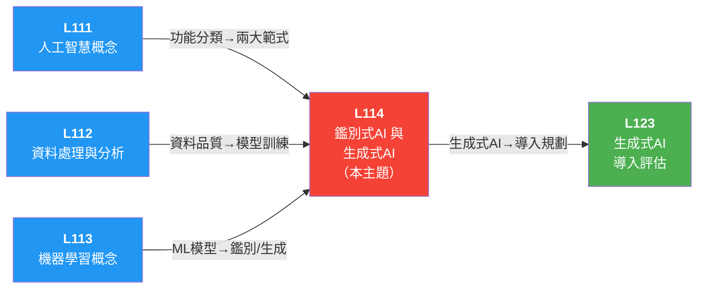

# 📖 L114 鑑別式 AI（Artificial Intelligence，人工智慧） 與生成式 AI 概念 — iPAS AI應用規劃師（初級）學習指南

> 對應評鑑範圍：**L11401 鑑別式 AI 與生成式 AI 的基本原理** ＋ **L11402 鑑別式 AI 與生成式 AI 的整合應用**

---

## 0. 關鍵概念總覽圖

> 先鳥瞰整個 L114 的知識地圖，搞清楚所有專有名詞彼此之間的關係，之後讀細節時就不會迷路。

```
🎯 L114 鑑別式 AI 與生成式 AI 概念
│
├── L11401 鑑別式 AI 與生成式 AI 的基本原理
│   │
│   ├── 🔍 鑑別式 AI（Discriminative AI）
│   │   ├── 核心：學習條件機率（Conditional Probability）P(y|x) ── 「給定輸入 x，預測輸出 y」
│   │   ├── 目標：找分類邊界（Boundary），區分不同類別
│   │   ├── 輸出：分類標籤 或 數值預測
│   │   ├── 特性：準確、高效、輸出確定性高
│   │   │
│   │   ├── 常見模型
│   │   │   ├── 邏輯迴歸（Logistic Regression）── 二元分類基礎
│   │   │   ├── SVM（Support Vector Machine，支援向量機）── 最大化類別間隔的超平面
│   │   │   ├── 決策樹（Decision Tree）── 樹形結構，可解釋性高
│   │   │   ├── 隨機森林（Random Forest）── 多棵決策樹集成投票，穩定性佳
│   │   │   └── 神經網路（Neural Network, CNN（Convolutional Neural Network，卷積神經網路）/RNN（Recurrent Neural Network，循環神經網路））── 深度學習，處理非線性問題
│   │   │
│   │   ├── 應用場域
│   │   │   ├── 📷 電腦視覺（Computer Vision）── 影像辨識、人臉辨識、物件偵測
│   │   │   ├── 🎤 語音辨識（Speech Recognition）── 語音轉文字、語音助理
│   │   │   ├── 📝 自然語言處理（NLP, Natural Language Processing）── 情感分析、語意理解、文本分類
│   │   │   ├── 💰 金融風險（Financial Risk）── 信用評分、詐欺偵測、違約預測
│   │   │   └── 🏥 醫療診斷（Medical Diagnosis）── 醫學影像分類（良性/惡性）
│   │   │
│   │   └── 技術挑戰
│   │       ├── 資料偏見（Data Bias）── 模型學到資料中的偏見
│   │       ├── 過擬合（Overfitting）── 泛化能力不足
│   │       └── 標記成本（Labeling Cost）── 監督式學習需大量標記資料
│   │
│   ├── 🎨 生成式 AI（Generative AI）
│   │   ├── 核心：學習聯合分佈（Joint Distribution）P(x,y) 或邊際分佈（Marginal Distribution）P(x)
│   │   ├── 目標：理解資料分佈，生成「新的」資料樣本
│   │   ├── 輸出：新內容（文字/圖像/音訊/影片）
│   │   ├── 特性：創造性、多樣性、相同輸入可產生不同輸出
│   │   │   └── 關鍵區別：鑑別式=確定輸出；生成式=變異輸出
│   │   │
│   │   ├── 📖 NLP 與語言模型基礎
│   │   │   ├── NLP（自然語言處理）── 使計算機能理解、解釋和生成人類語言
│   │   │   ├── 語言模型（Language Model）── 根據前文預測下一個詞的機率
│   │   │   │   ├── 統計語言模型（Statistical Language Model）── n-gram 模型，計算詞頻共現機率
│   │   │   │   └── 神經語言模型（Neural Language Model）── RNN、Transformer，學深層語義
│   │   │   └── Transformer 三大組件（詳見 L113 Section 1-3）
│   │   │       ├── 自注意力機制（Self-Attention）── 衡量詞與詞的關聯性
│   │   │       ├── 編碼器-解碼器架構（Encoder-Decoder）── 編碼器處理輸入→解碼器生成輸出
│   │   │       └── 多頭注意力（Multi-Head Attention）── 同時關注不同層次語義
│   │   │
│   │   ├── 🔄 語言模型工作流程
│   │   │   ├── Token（標記）：單詞的基本處理單位，轉換為向量表示
│   │   │   └── Next Word Prediction（下一詞預測）：基於輸入序列計算最可能的下一個單詞，按概率排序
│   │   │
│   │   ├── 三大生成模型（必背！）
│   │   │   │
│   │   │   ├── 🥊 GAN（Generative Adversarial Network，生成對抗網路）
│   │   │   │   │   ├── 由「生成器（Generator）+ 鑑別器（Discriminator）」組成（不是編碼器+解碼器）
│   │   │   │   ├── 生成器（Generator）：從雜訊生成假資料，試圖「欺騙」鑑別器
│   │   │   │   ├── 鑑別器（Discriminator）：判斷資料是真是假，試圖「揭穿」生成器
│   │   │   │   ├── 對抗學習（Adversarial Training）：兩者互相博弈，越來越強
│   │   │   │   ├── 應用：圖像生成（StyleGAN）、風格遷移（Style Transfer）、醫療影像生成
│   │   │   │   └── 挑戰：模式崩潰（Mode Collapse）、訓練不穩定
│   │   │   │       └── 解法：WGAN（Wasserstein GAN，沃瑟斯坦生成對抗網路）改進損失函數（Loss Function）
│   │   │   │
│   │   │   ├── 🔄 VAE（Variational Autoencoder，變分自編碼器）
│   │   │   │   │   ├── 由「編碼器（Encoder）+ 解碼器（Decoder）」組成（與 GAN 不同）
│   │   │   │   ├── 編碼器（Encoder）：將資料壓縮到潛在空間（Latent Space）
│   │   │   │   ├── 解碼器（Decoder）：從潛在空間重建資料
│   │   │   │   ├── 引入隨機變量（Random Variable）+正則化（Regularization），平衡生成力與穩定性
│   │   │   │   └── 應用：資料修復、異常檢測（Anomaly Detection）、醫療資料增強（Data Augmentation）
│   │   │   │
│   │   │   └── 🌫️ 擴散模型（Diffusion Models）
│   │   │       ├── 訓練：逐步向資料加雜訊（Noise）→ 變成純雜訊
│   │   │       ├── 生成：逐步去除雜訊（Denoising）→ 從雜訊重建資料
│   │   │       ├── 生成品質極高，細節豐富
│   │   │       └── 應用：高品質圖像生成、文生圖（Text-to-Image, DALL-E、Stable Diffusion）
│   │   │
│   │   ├── 🤖 大型語言模型（LLM, Large Language Model）
│   │   │   ├── 基於深度學習，使用大量文本數據學習語言模式和語義關聯
│   │   │   ├── 核心：自我監督學習（Self-supervised Learning）+ Transformer 架構
│   │   │   ├── 三大特徵（必背！）
│   │   │   │   ├── Large（大規模）── 大規模數據與參數
│   │   │   │   ├── General purpose（通用性）── 非特定任務
│   │   │   │   └── Pre-trained and fine-tuned（預訓練與微調）── 先預訓練再微調
│   │   │   ├── 提示工程（Prompt Engineering）── 調整輸入以控制輸出
│   │   │   ├── 參數量越大 → 表達能力越強（但需足夠訓練資料支撐）
│   │   │   ├── 微調（Fine-tuning）── 在特定資料上再訓練
│   │   │   │   └── 災難性遺忘（Catastrophic Forgetting）：微調後可能遺忘預訓練知識
│   │   │   ├── 剪枝（Pruning）── 移除冗餘權重，縮小模型提升推理效率
│   │   │   ├── 📝 GPT vs BERT 比較
│   │   │   │
│   │   │   │            GPT                          BERT
│   │   │   │            (Generative Pretrained        (Bidirectional Encoder
│   │   │   │             Transformer)                  Representations from Transformers)
│   │   │   │   ┌────────┬───────────────────────────┬───────────────────────────┐
│   │   │   │   │ 類型   │ 自回歸生成模型            │ 雙向編碼器                │
│   │   │   │   │        │ 從左到右預測下一詞        │ 同時考慮前後文            │
│   │   │   │   ├────────┼───────────────────────────┼───────────────────────────┤
│   │   │   │   │ 擅長   │ 文本生成、對話系統        │ 文本分類、問答系統        │
│   │   │   │   │        │ 內容創作                  │ 命名實體識別（NER）       │
│   │   │   │   ├────────┼───────────────────────────┼───────────────────────────┤
│   │   │   │   │ 特點   │ 只關注前文的順序信息      │ 理解任務，非直接生成      │
│   │   │   │   ├────────┼───────────────────────────┼───────────────────────────┤
│   │   │   │   │ 差異   │ 用於「生成」              │ 用於「理解」              │
│   │   │   │   └────────┴───────────────────────────┴───────────────────────────┘
│   │   │   └── 📋 著名 LLM 模型一覽
│   │   │       ├── GPT 系列（OpenAI）
│   │   │       ├── BERT（Google）
│   │   │       ├── LLaMA（Large Language Model Meta AI，Meta，開源）
│   │   │       ├── Claude（Anthropic）
│   │   │       ├── PaLM（Pathways Language Model） / LaMDA（Language Model for Dialogue Applications，對話應用語言模型）（Google）
│   │   │       └── Wu Dao 2.0（中國，悟道）
│   │   │
│   │   └── 技術挑戰
│   │       ├── 幻覺（Hallucination）── 生成看似合理但不正確的內容
│   │       │   ├── 原因：語言模型統計特性、缺乏知識驗證、訓練數據局限性、過度泛化（Over-generalization）
│   │       │   ├── 影響：誤導用戶、降低信任度、商業風險
│   │       │   └── 減少策略：RAG（Retrieval-Augmented Generation，檢索增強生成）、後驗訓練、模型反思機制、限制生成範圍
│   │       ├── 可控性低（Low Controllability）── 難以精確控制輸出
│   │       ├── 計算成本高（High Computational Cost）── 需要大量計算資源
│   │       └── 倫理問題（Ethical Issues）── Deepfake（深偽技術）、版權、隱私
│   │
│   ├── 🧪 快速判斷法：生成式 vs 非生成式
│   │   ├── 非生成式 AI（y 的輸出是）：Number（數值如房價）、Discrete（離散如分類）、Class（類別）、Probability（概率）
│   │   ├── 生成式 AI（y 的輸出是）：Natural Language（自然語言）、Image（圖像）、Audio（音頻）
│   │   └── ⭐ 判斷口訣：輸出是「新內容」=生成式；輸出是「數字/標籤」=非生成式
│   │
│   ├── 📊 Predictive ML（Machine Learning，機器學習） Model vs Gen AI Model
│   │   ├── Predictive：Data + Labels 輸入 → 學習數據與標籤關係 → 輸出預測標籤
│   │   ├── Gen AI：非結構化內容（文本、圖像、音頻）輸入 → 學習模式 → 生成新內容
│   │   └── 關鍵區分：Predictive 輸入是結構化數據；Gen AI 輸入是非結構化內容
│   │
│   ├── 🌐 大語言模型（LLM）生態 Zone 結構
│   │   ├── Zone 1：核心功能（語言生成、對話、知識問答、語音識別、翻譯）
│   │   ├── Zone 2：語言模型應用（文字生成、嵌入（Embedding）、分類）
│   │   ├── Zone 3：開源及雲端技術（Meta AI, NVIDIA, BLOOM）
│   │   ├── Zone 4：本地推理服務（離線部署）
│   │   ├── Zone 5：基礎設施和工具（量化技術（Quantization）、向量存儲、流程構建器）
│   │   └── Zone 6：應用層面（內容創意生成、資料提取、生成式助手）
│   │
│   └── ⚖️ 鑑別式 vs 生成式 關鍵比較
│       │
│       │  面向          鑑別式 AI              生成式 AI
│       │  ─────────────────────────────────────────────────
│       │  學習目標      P(y|x) 條件機率        P(x,y) 聯合分佈
│       │  核心任務      分類 / 預測            生成新內容
│       │  輸出          標籤 / 數值            新資料（文/圖/音/影）
│       │  確定性        相同輸入→相同輸出      相同輸入→不同輸出
│       │  代表模型      SVM、決策樹、CNN       GAN、VAE、Diffusion
│       │  優勢          精準分析與決策          創造性內容生成
│       │  ─────────────────────────────────────────────────
│       └── ⭐ 一句話：鑑別式=偵探（分辨真假）；生成式=畫家（創造新作）
│
└── L11402 鑑別式 AI 與生成式 AI 的整合應用
    │
    ├── 🤝 整合應用的三大價值
    │   │
    │   ├── ① 資料增強與分析的協同
    │   │   ├── 生成式 AI 生成多樣化資料（解決資料稀缺/不平衡）
    │   │   ├── 鑑別式 AI 對生成資料進行分類與分析
    │   │   └── 例：GAN 生成病理影像 → CNN 訓練提升腫瘤辨識
    │   │
    │   ├── ② 多模態（Multimodal）資料的處理
    │   │   ├── 生成式 AI：跨模態資料生成與轉換
    │   │   ├── 鑑別式 AI：多模態資料的分類與決策
    │   │   └── 例：自動駕駛中生成各種天氣場景→鑑別式學習應對策略
    │   │
    │   └── ③ 提升模型泛化能力（Generalization）
    │       ├── 生成式 AI 擴展學習邊界（模擬未見過的場景）
    │       ├── 鑑別式 AI 在擴展資料上訓練，泛化更強
    │       └── 例：教育系統模擬學生行為→分析學習特徵→個人化方案
    │
    ├── 🔧 整合應用的技術優勢
    │   ├── 數據生成與判斷融合 ── 生成高品質資料＋精確判斷
    │   ├── 即時分析與回饋 ── 動態模擬＋即時決策
    │   │   └── 例：自駕模擬濃霧→即時識別環境→路徑規劃
    │   └── 系統靈活性 ── 動態調整生成與決策流程
    │       └── 例：智慧客服（生成回應）＋（鑑別過濾不當內容）
    │
    ├── 🏭 應用場景總覽
    │   ├── 🏥 醫療 ── GAN 生成稀缺病理影像＋CNN 提升診斷準確率
    │   ├── 🚗 自動駕駛 ── 生成模擬場景＋鑑別式即時環境識別
    │   ├── 🛡️ 網路安全 ── 生成模擬攻擊＋鑑別式即時偵測異常
    │   ├── 🏭 工業製造 ── 生成異常數據＋鑑別式故障偵測
    │   ├── 📰 內容審核 ── 生成式產出文案＋鑑別式品質合規檢測
    │   └── 🎓 教育 ── 生成模擬學習場景＋分析個人化學習方案
    │
    └── 整合挑戰
        ├── 模型訓練穩定性 ── GAN 模式崩潰（Mode Collapse）→解法：WGAN
        ├── 資料偏差（Data Bias）與公平性（Fairness）── 生成資料可能放大偏差→去偏演算法（Debiasing）
        ├── 災難性遺忘（Catastrophic Forgetting）── 微調後遺忘預訓練知識
        └── 架構設計 ── 分層架構＋共享層＋動態學習框架
```

---

## 1. 關鍵術語與定義

### 1-1 鑑別式與生成式基礎（Discriminative vs Generative Fundamentals）

> 📝 **一句話速記**：鑑別式學 P(y|x) 做分類預測，生成式學 P(x,y) 創造新內容，兩者目標與輸出本質完全不同。

> ```
> 層次關係圖：鑑別式 vs 生成式 AI 的機率基礎
>
> P(x, y) 聯合分佈（Joint Distribution）── 最完整的資訊
> │
> ├── 除以 P(x) → P(y|x) 條件機率（Conditional Probability）
> │   └── 已知輸入 x，預測輸出 y 的機率
> │       └── 鑑別式 AI（Discriminative AI）── 學 P(y|x)
> │           ├── 能力：分類與迴歸，畫出分類邊界
> │           ├── 特性：給同一張照片，永遠回答同一個答案
> │           └── 代表模型：SVM、邏輯迴歸、決策樹、隨機森林、CNN
> │
> └── 對 y 求和/積分 → P(x) 邊際分佈（Marginal Distribution）
>     └── 只看資料本身的分佈特徵，不管標籤
>         └── 生成式 AI（Generative AI）── 學 P(x,y) 或 P(x)
>             ├── 能力：生成全新的文字、圖像、音訊、影片
>             ├── 特性：給同一個指令，每次輸出可能不同
>             └── 代表模型：GAN、VAE、Diffusion Models
>
> 關鍵對比：
>   資訊量排序：P(x,y) > P(x) > P(y|x)
>   學得越精簡 → 分類更準更快，但只能判斷、不能創造
>   學得越完整 → 能生成，但訓練越難
>   問「是什麼」→ 鑑別式；問「畫一個」→ 生成式
> ```
>
> 一句話串起來：**聯合分佈 P(x,y) 是最完整的資訊源頭，往下拆可得條件機率 P(y|x)（鑑別式的基礎）或邊際分佈 P(x)（生成式的基礎），兩條路線決定了 AI「能創造」還是「只能判斷」。**

> 🗣️ **為什麼要分鑑別式與生成式？什麼時候需要？**
>
> AI 模型的目標不外乎兩件事：**判斷現有的東西**或**創造新的東西**。這兩個目標對應完全不同的數學基礎和模型設計：
>
> - **鑑別式**：只需學「輸入→輸出」的映射，效率高、分類準，但無法從無到有產出新內容。
> - **生成式**：需要理解資料的完整結構，訓練更難，但能生成從未見過的全新樣本。
>
> **什麼時候該用哪種？**
> | 情境 | 選擇 | 原因 |
> |------|------|------|
> | 辨識照片中的物體是貓還是狗 | 鑑別式 AI | 只需畫分類邊界，學 P(y\|x) 即可 |
> | 判斷郵件是否為垃圾信 | 鑑別式 AI | 二分類任務，不需生成新內容 |
> | 醫療影像輔助診斷 | 鑑別式 AI | 精確分類「有病灶 vs 無病灶」 |
> | 根據文字描述生成一張圖片 | 生成式 AI | 需從分佈中取樣，創造全新影像 |
> | 自動撰寫文章或翻譯 | 生成式 AI | 需理解語言分佈，生成新文本序列 |
> | 擴充稀缺訓練資料（Data Augmentation） | 生成式 AI | 學習資料分佈後生成合成樣本 |

**① 機率基礎概念**

- **聯合分佈 (Joint Distribution)** — 描述兩個或多個隨機變數同時取特定值的機率分佈，記為 P(x,y)。生成式 AI 透過學習聯合分佈來理解資料的完整結構，進而生成新樣本。
  > 🗣️ 「我同時學會了貓的長相（x）和貓的標籤（y）的關係。」——既知道什麼是貓，也知道貓長什麼樣，所以能畫出新的貓。
- **條件機率 (Conditional Probability)** — 在已知某事件發生的條件下，另一事件發生的機率，記為 P(y|x)。鑑別式 AI 的核心學習目標，意即「給定輸入 x，預測輸出 y 的機率」。
  > 🗣️ 「已知你給我這張照片（x），我判斷它是貓的機率（y）是 95%。」——只管分類，不管貓長什麼樣。
- **邊際分佈 (Marginal Distribution)** — 從聯合分佈中對部分變數求和或積分所得的單一變數機率分佈，記為 P(x)。生成式 AI 可透過學習邊際分佈直接建模資料本身的分佈特徵。
  > 🗣️ 「我只學貓的長相（x）本身長什麼樣，不管有沒有標籤。」——純粹學資料的分布特徵，像素描練習只看不分類。

**② 兩大 AI 類型**

- **鑑別式 AI (Discriminative AI)** — 學習條件機率 P(y|x)，專注於分類與迴歸任務，找出資料的分類邊界。代表模型：SVM、邏輯迴歸、決策樹、隨機森林、CNN。
  > 🗣️ 像海關人員——看你的護照和長相，判斷「你是不是本人」（畫分類邊界）。給同一張照片，永遠回答同一個答案。
- **生成式 AI (Generative AI)** — 學習聯合分佈 P(x,y) 或邊際分佈 P(x)，能生成全新的文字、圖像、音訊、影片等內容。代表模型：GAN、VAE、Diffusion Models。
  > 🗣️ 像畫家——學會了人臉長什麼樣之後，能憑空畫出一張逼真的新臉。給同一個指令，每次畫出來的都不一樣。

> 🔍 **鑑別式 vs 生成式 AI 對比**：
>
> | 比較維度     | 鑑別式 AI                  | 生成式 AI                       |
> | ------------ | -------------------------- | ------------------------------- |
> | **學習目標** | P(y\|x) 條件機率           | P(x,y) 聯合分佈 / P(x) 邊際分佈 |
> | **核心能力** | 分類、迴歸（畫邊界）       | 生成新內容（取樣）              |
> | **輸出特性** | 確定性——同輸入同輸出       | 隨機性——同指令不同輸出          |
> | **訓練難度** | 較低（只學映射）           | 較高（需理解完整分佈）          |
> | **代表模型** | SVM、邏輯迴歸、決策樹、CNN | GAN、VAE、Diffusion Models      |
> | **典型應用** | 影像辨識、垃圾信偵測       | 文字生成、圖像合成、資料擴充    |

> ⚠ **鑑別式 vs 生成式考試速記**：
>
> - 問「這是什麼」→ 鑑別式 P(y\|x)；問「畫一個 / 寫一段」→ 生成式 P(x,y) 或 P(x)。
> - 資訊量排序：P(x,y) > P(x) > P(y\|x)——聯合分佈資訊最完整，條件機率最精簡。
> - 鑑別式**無法生成新資料**，只能判斷；生成式**能創造**但訓練更難。
> - SVM、邏輯迴歸、決策樹、隨機森林、CNN 屬鑑別式；GAN、VAE、Diffusion Models 屬生成式。
> - 容易混淆：CNN 雖常與影像生成一起出現，但 CNN 本身是**鑑別式**模型（用於分類），生成影像的是 GAN 中的生成器網路。

### 1-2 自然語言處理與語言模型基礎（NLP & Language Model Foundations）

> 📝 **一句話速記**：NLP 讓機器理解人類語言，語言模型透過預測下一個詞來學習語義，Token 是最小處理單位。

> ```
> 層次關係圖：NLP → 語言模型 → 現代 LLM 的技術演進
>
> NLP（Natural Language Processing，自然語言處理）── 最廣的領域
> └── 語言模型（Language Model）── NLP 的核心技術
>     │
>     ├── 統計語言模型（Statistical Language Model）── 傳統方法
>     │   └── n-gram 模型 ── 具體實作（bigram / trigram）
>     │       ├── 原理：根據前 n-1 個字的詞頻統計猜下一個字
>     │       ├── 優點：簡單高效
>     │       └── ⚠ 瓶頸：無法處理「長距離依賴」
>     │
>     └── 神經語言模型（Neural Language Model）── 現代方法
>         ├── 解決：長距離依賴問題（Long-range Dependency）
>         │   └── RNN 逐字讀會遺忘 → Transformer 自注意力一次看全部
>         ├── 基本單位：Token（標記）── 文字→向量
>         ├── 核心機制：Next Word Prediction（下一詞預測）
>         └── 學習方式：自我監督學習（Self-supervised Learning）── 無需人工標註
>
> 關鍵對比：
>   統計 vs 神經：詞頻統計 vs 深度學習，短距離 vs 長距離
>   演進方向：n-gram → RNN → Transformer → 現代 LLM
> ```
>
> 一句話串起來：**NLP 是大領域，語言模型是其核心技術；從統計語言模型（n-gram）到神經語言模型（Transformer），關鍵突破在於解決長距離依賴，最終以 Token + 下一詞預測 + 自我監督學習三大支柱構成現代 LLM。**

> 🗣️ **為什麼要理解語言模型的演進？什麼時候需要？**
>
> 生成式 AI（如 ChatGPT）的核心就是語言模型，理解其演進脈絡才能掌握「為什麼 Transformer 能勝出」這個考試高頻考點。
>
> - **統計語言模型**是起點，但只能「看前面幾個字猜」，長句就失靈。
> - **神經語言模型**用深度學習克服此限制，Transformer 更是一次性解決了長距離依賴。
> - 理解 Token、下一詞預測、自我監督學習這三個概念，就能解釋 LLM 為何能「不需人工標註就學會語言」。
>
> **什麼時候該區分統計 vs 神經語言模型？**
> | 情境 | 對應概念 |
> |------|---------|
> | 考題問「傳統語言模型的限制」 | n-gram 無法處理長距離依賴 |
> | 考題問「Transformer 解決了什麼問題」 | 長距離依賴（RNN 的遺忘問題） |
> | 考題問「LLM 如何學習」 | 自我監督學習（遮蔽詞預測 / 下一詞預測） |
> | 考題問「語言模型的輸入輸出單位」 | Token（標記） |
> | 考題問「GPT 的核心生成機制」 | Next Word Prediction（下一詞預測） |

**① NLP 與語言模型總論**

- **自然語言處理 (NLP / Natural Language Processing)** — AI 處理和理解人類語言的技術，包括情感分析、機器翻譯、文本分類。
  > 🗣️ 讓電腦「聽懂人話」的所有技術的總稱——從翻譯、摘要到聊天機器人，都算 NLP 的範疇。
- **語言模型 (Language Model)** — 根據前文預測下一個詞的機率的統計或神經網路模型，是生成式 AI 的基礎。分為統計語言模型（如 n-gram）與神經語言模型（如 RNN、Transformer）兩大類。
  > 🗣️ 語言模型就是「猜下一個字」的機器——你打「今天天氣」，它猜下一個字可能是「很好」。猜得越準，語言能力越強。

**② 統計語言模型（傳統方法）**

- **統計語言模型 (Statistical Language Model)** — 基於詞頻共現統計來計算詞序列機率的傳統語言模型，代表為 n-gram 模型。優點是簡單高效，缺點是無法捕捉長距離語義關聯。
  > 🗣️ 像查字典裡「哪兩個字最常連在一起」來猜下一個字——簡單但死板，只看統計頻率，不懂語意。
- **n-gram 模型** — 統計語言模型的具體實作，透過計算詞與詞之間的出現頻率來預測詞序列。典型代表為 bigram（二元）和 trigram（三元）模型。
  > 🗣️ 像手機打字的「聯想詞」功能——你打「早安」，手機根據過去大家常打的習慣猜你下一個字可能是「你好」。bigram 只看前 1 個字猜，trigram 看前 2 個字猜，看越多字猜越準，但也越吃記憶體。

**③ 神經語言模型（現代方法）**

- **神經語言模型 (Neural Language Model)** — 以神經網路（如 RNN（Recurrent Neural Network，循環神經網路）、Transformer）為基礎的語言模型，能學習深層語義特徵，克服統計模型在長距離依賴上的不足。
  > 🗣️ 不再只靠「查頻率」，而是用深度學習真正「理解」語意——能抓住句子裡遠距離的關聯，例如「他昨天買的那本……很好看」中的「書」。
- **長距離依賴問題 (Long-range Dependency)** — 傳統 RNN 在處理長序列時，讀到後面容易遺忘前面的資訊，Transformer 透過自注意力機制一次看見所有字來解決此問題。
  > 🗣️ 像讀一本 500 頁的小說，RNN 是一頁一頁翻著讀，讀到第 500 頁時早就忘了第 1 頁寫了什麼。Transformer 的做法是把整本書攤開在桌上，任何一頁都能直接看到其他頁（自注意力機制），不管隔多遠都不會忘。

**④ 現代 LLM 的三大支柱**

- **Token (標記)** — 語言模型中單詞的基本處理單位，輸入文本會先被拆分為 Token，再轉換為向量表示供模型運算。LLM 的輸入輸出皆以 Token 為計量單位。
  > 🗣️ 像把一句話切成一塊塊積木——「我喜歡貓」可能被切成「我」「喜歡」「貓」三個 Token，模型一塊一塊處理。
- **Next Word Prediction (下一詞預測)** — 語言模型的核心生成機制，基於輸入序列計算最可能的下一個單詞，並按概率排序選取。GPT 系列即基於此機制運作。
  > 🗣️ 就是「猜下一個字」的遊戲——模型讀完前面所有字後，從詞彙表中挑出機率最高的下一個字，一個字一個字接龍出完整句子。
- **自我監督學習 (Self-supervised Learning)** — LLM 的核心學習方式，模型從大量未標註文本中自行產生學習信號（如遮蔽詞預測、下一詞預測），無需人工標註即可學習語言模式。
  > 🗣️ 像小孩自己看了幾百萬本書，沒有老師教，但透過「把字遮起來自己猜」的方式學會了語言——不需要人工一句一句標註「這句話的意思是什麼」。
- **Flash Attention** — 針對 Transformer 注意力機制進行底層 GPU 硬體（記憶體 IO）最佳化的演算法。它解決了處理超長文本時記憶體爆炸與運算極慢的瓶頸，是近代大模型能支援超長上下文（Long Context）的關鍵核心技術。

> 🔍 **統計 vs 神經語言模型對比**：
>
> | 比較維度       | 統計語言模型（n-gram） | 神經語言模型（RNN / Transformer）                                 |
> | -------------- | ---------------------- | ----------------------------------------------------------------- |
> | **原理**       | 詞頻共現統計           | 深度學習語義特徵                                                  |
> | **長距離依賴** | ✗ 無法處理             | ✓ Transformer 完全解決                                            |
> | **語意理解**   | 只看頻率，不懂語意     | 能學習深層語義關聯                                                |
> | **計算資源**   | 低                     | 高（需 GPU）                                                      |
> | **代表**       | bigram、trigram        | RNN → LSTM（Long Short-Term Memory，長短期記憶網路）→ Transformer |
> | **現況**       | 已被取代               | 現代 LLM 的基礎                                                   |

> ⚠ **NLP 與語言模型考試速記**：
>
> - 語言模型的核心任務就是「預測下一個詞」——不管統計還是神經模型，目標相同，方法不同。
> - n-gram 的致命缺陷是**長距離依賴**——考題常以此引出 Transformer 的優勢。
> - Token ≠ 字 ≠ 詞——一個中文字可能是一個 Token，一個英文單詞可能被拆成多個 Token（如 "unbelievable" → "un" + "believ" + "able"）。
> - 自我監督學習 ≠ 無監督學習——自我監督學習仍有「標籤」，只是標籤由資料本身自動產生（如遮蔽的詞），無需人工標註。
> - GPT 用「下一詞預測」，BERT 用「遮蔽詞預測（MLM）」——兩者都是自我監督學習，但預測方式不同。

### 1-3 生成式模型架構（Generative Model Architectures）

> 📝 **一句話速記**：GAN 靠對抗博弈、VAE 靠壓縮重建、擴散模型靠加噪去噪——三大架構各有取捨，考試愛考「哪個模型適合哪種任務」。（Transformer 架構與內部結構詳見 L113 Section 1-3）

> ```
> 層次關係圖：三大生成式模型架構 + 跨模態延伸
>
> 生成式模型架構
> │
> ├── GAN（Generative Adversarial Network，生成對抗網路）── 對抗博弈
> │   ├── 生成器（Generator）── 從雜訊「造假」
> │   ├── 鑑別器（Discriminator）── 判斷真假「抓假」
> │   └── 對抗學習（Adversarial Training）── 兩者互相博弈的訓練機制
> │   ⚠ 弱點：模式崩潰（Mode Collapse）── 只產出少數幾種結果
> │
> ├── VAE（Variational Autoencoder，變分自編碼器）── 壓縮重建
> │   ├── 編碼器 → 潛在空間（Latent Space）→ 解碼器
> │   ├── 隨機變量（Random Variable）── 取樣帶隨機性 → 多樣化輸出
> │   └── 正則化（Regularization）── KL 散度約束潛在空間 → 穩定訓練
> │   ⚠ 弱點：生成結果偏模糊
> │
> ├── 擴散模型（Diffusion Models）── 加噪去噪
> │   └── 結構最簡潔：無需對抗、無需編解碼，純粹學「從雜訊還原資料」
> │   ⚠ 弱點：生成速度慢（需多步去噪）
> │
> └── ViT（Vision Transformer，視覺轉換器）── 跨模態延伸
>     └── 把圖片切成 Patch 當 Token → 讓 Transformer 也能「看圖」
>
> 選用決策：
>   要逼真影像？ ──── GAN（但訓練不穩定）
>   要穩定+可控？ ── VAE（但略模糊）
>   要最高品質？ ──── Diffusion Models 擴散模型（但慢）
>   要跨模態？ ────── ViT + Transformer
>
> 品質排序：擴散模型 > GAN > VAE
> 穩定排序：VAE > 擴散模型 > GAN
> 速度排序：GAN > VAE > 擴散模型
> ```
>
> 一句話串起來：**三大生成式架構各有取捨——GAN 靠對抗博弈出圖逼真但訓練不穩、VAE 靠壓縮重建穩定可控但偏模糊、擴散模型靠加噪去噪品質最高但速度慢；ViT 則把 Transformer 從文字搬到影像，實現跨模態生成。**

> 🗣️ **為什麼要區分三大生成式模型？什麼時候需要？**
>
> 不同生成任務對「品質」「速度」「穩定性」「可控性」的需求不同，選錯模型就像用錯工具。考試常考「哪個模型的特性是什麼」和「哪個適合什麼場景」。
>
> **什麼時候該用哪種模型？**
> | 情境 | 選擇 | 原因 |
> |------|------|------|
> | 生成逼真人臉、Deepfake 換臉 | GAN | 對抗訓練產出品質高、銳利 |
> | 藥物分子設計、需精準控制生成內容 | VAE | 可操作潛在空間微調輸出 |
> | 異常偵測（重建誤差大 = 異常） | VAE | 壓縮重建機制天然適合 |
> | 高品質圖像生成（如 AI 繪圖） | 擴散模型 | 品質最高，DALL-E/Stable Diffusion 皆用此架構 |
> | 資料擴增（Data Augmentation） | GAN 或擴散模型 | 生成合成訓練樣本 |
> | 圖片理解、圖文多模態任務 | ViT | 把圖片轉成 Token 讓 Transformer 處理 |

**① GAN（生成對抗網路）**

- **GAN (生成對抗網路 / Generative Adversarial Network)** — 由生成器（Generator）和鑑別器（Discriminator）組成的生成式模型，兩者透過對抗學習互相博弈，生成器產出越來越逼真的資料。
  > 🗣️ 像偽鈔集團 vs 警察：偽鈔師（生成器）拼命做假鈔，警察（鑑別器）拼命抓假鈔，兩邊互相較勁，假鈔越做越逼真。
- **生成器 (Generator)** — GAN 中負責從隨機雜訊生成假資料的網路，目標是「欺騙」鑑別器。
  > 🗣️ 偽鈔集團裡的「印鈔師傅」——從一堆隨機墨水（雜訊）中印出假鈔，目標是印到連驗鈔機都分不出來。
- **鑑別器 (Discriminator)** — GAN 中負責判斷資料真假的網路，目標是「揭穿」生成器。
  > 🗣️ 偽鈔集團的對手「驗鈔員」——拿到一張鈔票就判斷真假，逼印鈔師傅不斷提高技術。
- **對抗學習 (Adversarial Training)** — GAN 的核心訓練機制，生成器與鑑別器互相博弈、交替優化，生成器試圖產出逼真資料欺騙鑑別器，鑑別器試圖正確區分真假資料，兩者在對抗中同步提升能力。
  > 🗣️ 偽鈔師傅和驗鈔員的「軍備競賽」——一方進步另一方也跟著進步，交替升級直到假鈔幾乎無法辨識。

**② VAE（變分自編碼器）**

- **VAE (變分自編碼器 / Variational Autoencoder)** — 由編碼器和解碼器組成的生成式模型。編碼器將資料壓縮到潛在空間（Latent Space），解碼器從潛在空間重建資料。
  > 🗣️ 像把一張照片壓縮成一句話（潛在空間），再根據這句話畫回一張新照片。壓縮的「那句話」就是低維表示。
- **潛在空間 (Latent Space)** — VAE 中的低維表示空間，編碼器將高維資料壓縮到此空間，解碼器從此空間重建資料。
  > 🗣️ 像把一張複雜的照片「壓縮成幾個關鍵數字」（如亮度、表情、角度），這些數字就住在潛在空間裡。調整數字就能生出不同的照片。
- **隨機變量 (Random Variable)** — 數學中描述隨機現象結果的變數。在 VAE 中，編碼器輸出的潛在表示帶有隨機性（從機率分佈中取樣），使模型能生成多樣化的輸出。
  > 🗣️ VAE 壓縮照片時不是壓成「一個固定數字」，而是壓成「一個骰子的範圍」（機率分佈），每次擲骰子結果不同，所以每次生成的照片也不同。
- **正則化 (Regularization)** — 在模型訓練中加入額外約束（如 L1/L2 懲罰項）以防止過擬合的技術。VAE 透過 KL 散度（KL Divergence）正則化潛在空間，平衡生成能力與穩定性。
  > 🗣️ 像規定骰子的範圍不能太離譜——用 KL 散度把潛在空間拉回接近標準常態分佈，確保生成結果不會太奇怪，訓練也更穩定。

**③ 擴散模型與跨模態延伸**

- **擴散模型 (Diffusion Models)** — 訓練時逐步加雜訊，生成時逐步去雜訊，能生成高品質、細節豐富的資料。代表應用：DALL-E、Stable Diffusion。
  > 🗣️ 像把一張清晰的照片慢慢灑沙子蓋住（加噪），然後學會怎麼一粒一粒把沙子撥掉（去噪），最終能從一堆沙子中「變」出一張新照片。
- **ViT (Vision Transformer，視覺轉換器)** — 將 Transformer 架構延伸至影像領域的技術，把圖片切成小方塊（Patch）當成 Token 處理，讓 AI 能直接分析圖片並生成相關描述，實現跨模態生成應用。（Transformer 架構詳見 L113 Section 1-3）
  > 🗣️ 把一張圖片切成很多小方塊（像拼圖），每塊當成一個「字」丟給 Transformer 讀，讓原本只懂文字的 Transformer 也能「看圖」。

> 🔍 **三大生成式模型全方位比較**：
>
> | 比較維度         | GAN                          | VAE                          | 擴散模型                  |
> | ---------------- | ---------------------------- | ---------------------------- | ------------------------- |
> | **生成方式**     | 對抗訓練（生成器 vs 鑑別器） | 編碼→潛在分布取樣→解碼       | 逐步加噪→逐步去噪         |
> | **核心結構**     | Generator + Discriminator    | Encoder + Decoder + 機率分布 | 加噪 + 去噪網路           |
> | **生成品質**     | ⭐⭐⭐ 高（逼真銳利）        | ⭐⭐ 中（偏模糊）            | ⭐⭐⭐⭐ 最高（細節豐富） |
> | **生成速度**     | ⚡ 快（一次生成）            | ⚡ 快（一次解碼）            | 🐢 慢（需多步去噪）       |
> | **訓練穩定性**   | 🔴 不穩定（模式崩潰）        | 🟢 穩定                      | 🟢 穩定                   |
> | **多樣性控制**   | ⭐⭐ 較難控制                | ⭐⭐⭐ 容易（操作潛在空間）  | ⭐⭐⭐ 容易（條件引導）   |
> | **可否計算機率** | ❌ 隱式密度模型              | ✅ 顯式密度模型              | ✅ 顯式密度模型           |
> | **代表應用**     | DeepFake、StyleGAN           | 藥物分子生成、異常偵測       | DALL-E、Stable Diffusion  |

> ⚠ **生成式模型架構考試速記**：
>
> - GAN 的模式崩潰（Mode Collapse）= 生成器只產出少數幾種結果、缺乏多樣性，**不是**整個訓練崩潰。
> - VAE 生成影像通常比 GAN **模糊**，但訓練更**穩定**且可控（操作潛在空間）。
> - 生成品質排序：擴散模型 > GAN > VAE；訓練穩定排序：VAE > 擴散模型 > GAN。
> - GAN 由「生成器 + 鑑別器」組成，**不是**「編碼器 + 解碼器」——編碼器 + 解碼器是 VAE 的結構。
> - ViT 把圖片切成 Patch 當 Token——考題若問「如何讓 Transformer 處理影像」，答案是 ViT。
> - 正則化在 VAE 中的角色是用 KL 散度約束潛在空間，與防止過擬合的 L1/L2 正則化是同一個概念的不同應用場景。

### 1-4 大型語言模型（Large Language Models）

> 📝 **一句話速記**：LLM 三大特徵 = Large + General purpose + Pre-trained/Fine-tuned；GPT（Decoder）擅長生成，BERT（Encoder）擅長理解，其他模型記名字和開發者。（GPT vs BERT 架構比較詳見 L113 Section 1-3）

> ```
> 層次關係圖：LLM 生態系——架構範式與主要模型
>
> LLM（Large Language Model，大型語言模型）
> │── 三大特徵：Large（大規模）+ General purpose（通用）+ Pre-trained/Fine-tuned（預訓練+微調）
> │
> ├── 兩大架構範式（必考！詳見 L113 Section 1-3）
> │   ├── Decoder-only（自回歸生成）── 擅長「生成」
> │   │   └── GPT（Generative Pretrained Transformer，OpenAI）── 從左到右預測下一詞
> │   │
> │   └── Encoder-only（雙向編碼）── 擅長「理解」
> │       └── BERT（Bidirectional Encoder Representations from Transformers，Google）── 同時看前後文
> │           └── 代表任務：命名實體識別（NER, Named Entity Recognition）
> │
> └── 其他著名 LLM（記名字+開發者+特色）
>     ├── LLaMA（Large Language Model Meta AI，Meta）── 開源，可自行部署
>     ├── Claude（Anthropic）── 強調 AI 安全性
>     ├── PaLM（Pathways Language Model，Google）── 多語言推理
>     ├── LaMDA（Language Model for Dialogue Applications，Google）── 專攻對話
>     └── Wu Dao 2.0（悟道，中國）── 超大規模，中文優勢
>
> 關鍵對比：
>   GPT = Decoder-only = 生成（G = Generate）
>   BERT = Encoder-only = 理解（B = Bidirectional）
>   其他模型 = 記「誰開發 + 一句話特色」即可
> ```
>
> 一句話串起來：**LLM 是基於 Transformer 的大規模通用語言模型總稱，依架構分為 GPT（Decoder，生成派）和 BERT（Encoder，理解派）兩大陣營，其他模型各有定位（LLaMA 開源、Claude 安全、PaLM 推理、LaMDA 對話、悟道中文）。**

> 🗣️ **為什麼要認識 LLM 生態系？什麼時候需要？**
>
> 考試不只考 GPT 和 BERT 的架構差異，也會考「哪個模型是誰開發的」「哪個模型的特色是什麼」這類記憶題。掌握 LLM 三大特徵和各模型定位，就能快速解題。
>
> **什麼時候需要區分這些模型？**
> | 考題情境 | 答案 |
> |---------|------|
> | 「哪種架構擅長文字生成？」 | GPT（Decoder-only） |
> | 「哪種架構擅長文本分類、NER？」 | BERT（Encoder-only） |
> | 「哪個模型是開源的？」 | LLaMA（Meta） |
> | 「哪個模型強調 AI 安全？」 | Claude（Anthropic） |
> | 「哪個模型專攻多輪對話？」 | LaMDA（Google） |
> | 「中國開發的超大規模模型？」 | Wu Dao 2.0（悟道） |

**① LLM 定義與兩大架構範式**

- **LLM (大型語言模型 / Large Language Model)** — 基於深度學習與 Transformer 架構，使用大量文本數據訓練的大規模語言模型。具備三大特徵：Large（大規模數據與參數）、General purpose（通用性）、Pre-trained and fine-tuned（預訓練與微調）。
  > 🗣️ 像一個讀了幾百萬本書的超級學霸——知識量龐大（Large）、什麼都能聊（General purpose）、先打好基礎再針對特定科目加強（Pre-trained + Fine-tuned）。
- **GPT (Generative Pretrained Transformer，生成式預訓練轉換模型)** — OpenAI 開發的自回歸生成式語言模型，專注從左到右的序列生成，依賴前文預測下一個詞。擅長文本生成、對話系統、內容創作。（架構比較詳見 L113 Section 1-3）
  > 🗣️ 像一個作家，只能從左往右寫——根據前文猜下一個字，一路寫下去。擅長「生成」。
- **BERT (Bidirectional Encoder Representations from Transformers，雙向編碼器表徵轉換模型)** — Google 開發的雙向 Transformer 編碼器模型，同時考慮句子中詞語的前後文信息。擅長文本分類、命名實體識別、問答系統。注意：BERT 用於理解任務，不直接用於生成。（架構比較詳見 L113 Section 1-3）
  > 🗣️ 像一個閱讀理解高手，能同時看前後文來理解一個字的意思（完形填空）。擅長「理解」，不直接生成。
- **命名實體識別 (NER / Named Entity Recognition)** — NLP 中的核心任務之一，自動從文本中辨識並分類特定實體（如人名、地名、組織名、日期等）。BERT 擅長此類理解型任務。
  > 🗣️ 像一個記者讀新聞稿時自動用螢光筆標出所有人名、地名、公司名——這就是 NER 在做的事。

**② 其他著名 LLM**

- **LLaMA (Large Language Model Meta AI)** — Meta 開發的開源大型語言模型系列，讓學術界和開發者可自行部署與研究。
  > 🗣️ GPT 的開源版本——讓大家都能免費下載、自己改、自己用，推動了開源 LLM 生態。
- **Claude** — Anthropic 開發的大型語言模型，強調 AI 安全性與有用性，為目前主流 LLM 之一。
  > 🗣️ 特別注重「安全」的 LLM——設計理念是既聰明又不會亂講話。
- **PaLM (Pathways Language Model)** — Google 開發的大型語言模型，具備強大的多語言和推理能力。
  > 🗣️ Google 的推理特長生——特別擅長邏輯推理和跨語言任務。
- **LaMDA (Language Model for Dialogue Applications，對話應用語言模型)** — Google 開發的專注於對話應用的語言模型，設計目標為進行自然、開放式的多輪對話。
  > 🗣️ 專門為「聊天」而生的模型——不只回答問題，還能進行自然、開放的多輪閒聊。
- **Wu Dao 2.0 (悟道)** — 中國開發的超大規模語言模型，參數量達兆級別，展現中文語境下的強大能力。
  > 🗣️ 中國版的超大模型——參數量破兆，專攻中文場景。

> 🔍 **主要 LLM 速查表**：
>
> | 模型           | 開發者    | 架構         | 核心特色     | 考試記憶點                |
> | -------------- | --------- | ------------ | ------------ | ------------------------- |
> | **GPT**        | OpenAI    | Decoder-only | 自回歸生成   | G = Generate（生成）      |
> | **BERT**       | Google    | Encoder-only | 雙向理解     | B = Bidirectional（理解） |
> | **LLaMA**      | Meta      | Decoder-only | 開源可部署   | 開源                      |
> | **Claude**     | Anthropic | —            | AI 安全性    | 安全                      |
> | **PaLM**       | Google    | —            | 多語言推理   | 推理                      |
> | **LaMDA**      | Google    | —            | 對話應用     | 對話                      |
> | **Wu Dao 2.0** | 中國      | —            | 超大規模中文 | 兆級參數、中文            |

> ⚠ **大型語言模型考試速記**：
>
> - GPT 是 **Decoder-only**（生成），BERT 是 **Encoder-only**（理解）——最常考的對比，記法：**G**PT = **G**enerate，**B**ERT = **B**idirectional。
> - BERT **不能直接生成文字**，它只做理解任務（分類、NER、問答）。
> - LLM 三大特徵缺一不可：Large + General purpose + Pre-trained/Fine-tuned——考題可能問「以下哪個不是 LLM 特徵」。
> - NER 是「從文本中標出人名、地名、組織名」的任務——考題常拿來當 BERT 擅長任務的例子。
> - LLaMA 的考點是「開源」；Claude 的考點是「安全」；LaMDA 的考點是「對話」——記住「一個模型 = 一個關鍵詞」。

### 1-5 模型訓練與優化（Training & Optimization）

> 📝 **一句話速記**：微調讓預訓練模型適應新任務，但要小心災難性遺忘；GAN 訓練要注意模式崩潰，可用 WGAN 改善。

> ```
> 層次關係圖：模型訓練與優化
>
> 損失函數（Loss Function）── 所有訓練的基礎（最小化預測與真實的差距）
> │
> ├── LLM 訓練後優化
> │   ├── 微調（Fine-tuning）── 用領域資料再訓練，適應新任務
> │   │   └── ⚠ 災難性遺忘（Catastrophic Forgetting）── 微調的副作用（忘了舊知識）
> │   ├── 提示工程（Prompt Engineering）── 不改模型，只改輸入方式來控制輸出
> │   └── 剪枝（Pruning）── 移除冗餘權重，縮小模型提升效率
> │
> └── GAN 訓練問題與改進
>     ├── 模式崩潰（Mode Collapse）── 生成器只產出少數樣本
>     └── WGAN（Wasserstein GAN）── 改用 Wasserstein 距離作為損失函數來解決
>
> 選用決策：
>   要適應新領域？ → 微調（改模型權重）
>   要控制輸出方向？ → 提示工程（改輸入提示）
>   要縮小模型部署？ → 剪枝（移除冗餘權重）
>   GAN 訓練不穩定？ → 改用 WGAN（換損失函數）
> ```
>
> 一句話串起來：**損失函數是所有訓練的共同基礎；LLM 優化三把刀 = 微調（改模型）+ 提示工程（改輸入）+ 剪枝（瘦模型）；GAN 優化重點 = 用 WGAN 解決模式崩潰。**

> 🗣️ **為什麼要做模型訓練與優化？什麼時候需要？**
>
> 預訓練模型雖然強大，但直接拿來用往往不夠好——可能不懂你的專業領域、回答品質不穩定、或模型太大跑不動。訓練與優化就是讓模型「從通才變專才、從笨重變輕巧」的過程。GAN 則有自身獨特的訓練穩定性問題需要處理。
>
> **什麼時候該用哪種優化方式？**
> | 情境 | 選擇 | 原因 |
> |------|------|------|
> | 要讓 LLM 學會醫療/法律等專業知識 | 微調（Fine-tuning） | 用領域資料再訓練，讓模型吸收專業知識 |
> | 不想改模型，只想改善輸出品質 | 提示工程（Prompt Engineering） | 零成本、即時調整，適合快速迭代 |
> | 模型太大，要部署到邊緣裝置 | 剪枝（Pruning） | 移除冗餘權重，縮小模型但保留核心能力 |
> | GAN 生成結果缺乏多樣性 | WGAN | 改用 Wasserstein 距離，穩定訓練並解決模式崩潰 |
> | 微調後舊任務表現變差 | 檢查災難性遺忘 | 需要用漸進式微調等策略保留舊知識 |

**① 訓練基礎**

- **損失函數 (Loss Function)** — 衡量模型預測值與真實值之間差距的數學函數，模型訓練的目標就是最小化損失函數。WGAN 透過改用 Wasserstein 距離作為損失函數來改善 GAN 訓練穩定性。
  > 🗣️ 像考試的「扣分標準」——告訴模型「你的答案離正確答案差多遠」，模型的目標就是讓扣分越少越好。

**② LLM 訓練後優化**

- **微調 (Fine-tuning)** — 在預訓練模型的基礎上，用特定領域資料再次訓練以適應新任務。

  > 🗣️ 像一個會說英文的人去學醫學英文——不用從 ABC 重學，只要在既有基礎上補充專業知識就好。

- **災難性遺忘 (Catastrophic Forgetting)** — 模型在微調後過度適應新資料，遺忘先前預訓練學到的廣泛知識，導致在原有任務上表現變差。

  > 🗣️ 像那個人學了太多醫學英文，結果日常英文反而忘了怎麼說——新知識把舊知識「覆蓋」掉了。

- **提示工程 (Prompt Engineering)** — 設計和調整輸入提示（Prompt）以控制生成式 AI 的輸出品質與方向。

  > 🗣️ 像跟一個很聰明但需要精確指令的助手說話——你問的方式決定了他回答的品質。問得好，答得好。

- **剪枝 (Pruning)** — 移除模型中影響較小或冗餘的權重參數，以減小模型大小並提升推理效率。
  > 🗣️ 像修剪盆栽：把多餘的枝葉剪掉，樹變小了但形狀更好看。模型變小、推論更快，但核心能力不受影響。

> 🔍 **LLM 優化三把刀對比**：
> | 方式 | 改什麼 | 成本 | 效果 |
> |------|--------|------|------|
> | 微調 | 模型權重 | 高（需資料+算力） | 深度適應專業領域 |
> | 提示工程 | 輸入提示 | 低（零訓練成本） | 快速調整輸出方向 |
> | 剪枝 | 模型結構 | 中 | 縮小模型、加速推理 |

**③ GAN 訓練問題與改進**

- **模式崩潰 (Mode Collapse)** — GAN 訓練中的常見問題，生成器只產出少數幾種樣本，缺乏多樣性。

  > 🗣️ 像一個畫家不管你要什麼都只畫同一張臉——生成器「偷懶」只產出少數幾種樣本，失去多樣性。

- **WGAN (Wasserstein GAN)** — GAN 的改進版本，透過改進損失函數（使用 Wasserstein 距離）解決訓練不穩定和模式崩潰問題。
  > 🗣️ 給 GAN 換了一把更好的尺（Wasserstein 距離），讓訓練過程更穩定，畫家不再只畫同一張臉。

> ⚠ **模型訓練與優化考試速記**：
>
> - 微調 vs 提示工程：微調「改模型權重」，提示工程「只改輸入不改模型」——考試常考兩者差異。
> - 災難性遺忘是「微調的副作用」，不是預訓練的問題——題目問「微調的風險」就選它。
> - 模式崩潰是 GAN 特有問題（生成器偷懶），不會出現在 VAE 或 LLM 中。
> - WGAN 的改進核心 = 換損失函數（Wasserstein 距離），不是換網路架構。
> - 剪枝是「部署優化」手段（讓模型變小變快），與量化技術（見 1-10）功能互補。

### 1-6 生成品質與可解釋性（Generation Quality & Explainability）

> 📝 **一句話速記**：幻覺是 LLM 最大挑戰，可用 RAG 等策略減輕；XAI 讓黑箱模型決策透明化。

> ```
> 層次關係圖：生成式 AI 的品質與信任問題
>
> 生成式 AI 的品質與信任
> │
> ├── 問題：幻覺（Hallucination）── 生成看似合理但錯誤的內容
> │   └── 原因之一：過度泛化（Over-generalization）── 把局部模式錯誤套用到不相關領域
> │
> ├── 解法 ①：正確性 → RAG（檢索增強生成）── 生成前先檢索外部知識
> │
> └── 解法 ②：信任與透明
>     ├── XAI（可解釋 AI）── 讓人理解 AI 為什麼這樣決策
>     │   └── LIME── 解釋「單一樣本」的局部預測
>     └── 信賴度閾值（Confidence Threshold）── 信心不足時強制人工介入
>
> 關鍵對比：
>   幻覺解法比較：
>     RAG → 解決「正確性」問題（補外部知識）
>     XAI → 解決「透明度」問題（解釋決策邏輯）
>     信賴度閾值 → 解決「安全網」問題（人機協作兜底）
> ```
>
> 一句話串起來：**幻覺是生成式 AI 最大的信任問題 → RAG 從「正確性」角度解決（補外部知識）→ XAI 從「透明度」角度解決（解釋決策）→ 信賴度閾值從「安全網」角度解決（人機協作兜底）。**

> 🗣️ **為什麼要關注生成品質與可解釋性？什麼時候需要？**
>
> 生成式 AI 能寫文章、回答問題，但它可能「一本正經地胡說八道」（幻覺），而且決策過程像黑箱，無法解釋為什麼這樣回答。在醫療、法律、金融等高風險場景，不正確或不透明的 AI 輸出可能造成嚴重後果，因此必須從正確性、透明度、安全網三個角度同時把關。
>
> **什麼時候該用哪種策略？**
> | 情境 | 選擇 | 原因 |
> |------|------|------|
> | LLM 回答包含錯誤事實 | RAG（檢索增強生成） | 先檢索外部知識再生成，確保事實正確 |
> | 需要向用戶解釋 AI 為何這樣判斷 | XAI / LIME | 提供決策透明度，滿足法規與信任需求 |
> | 高風險決策（醫療、金融） | 信賴度閾值 + 人工介入 | 信心不足時交由人類把關，避免高代價錯誤 |
> | AI 回答過於籠統或套用不相關知識 | 檢查過度泛化問題 | 模型可能把局部模式錯誤推廣到不適用情境 |

**① 問題：幻覺與成因**

- **幻覺 (Hallucination)** — 生成式 AI 產出看似合理但事實上不正確的內容，是目前 LLM 的主要挑戰之一。

  > 🗣️ 像一個口才很好但不查資料的演講者——說得頭頭是道，但內容可能是瞎編的。

- **過度泛化 (Over-generalization)** — 模型將訓練資料中的局部模式過度推廣到不適用的情境，是造成生成式 AI 幻覺的原因之一。例如模型學到某些語句模式後，錯誤地套用到不相關的知識領域。
  > 🗣️ 像一個學生在歷史課學到「革命帶來進步」，就在每一科都套用這個結論——把局部經驗錯誤當成萬用公式。

**② 解法：提升正確性**

- **RAG (檢索增強生成 / Retrieval-Augmented Generation)** — 結合外部知識檢索與語言模型生成的技術，模型在生成回答前先從外部資料庫檢索相關資訊，有效減少幻覺並提升回答的正確性與時效性。
  > 🗣️ 像寫報告前先去圖書館查資料，而不是憑記憶瞎寫——有了參考依據，內容才可靠。

**③ 解法：提升信任與透明度**

- **XAI (可解釋 AI / Explainable AI)** — 讓人類能理解 AI 決策過程的技術。LIME（Local Interpretable Model-agnostic Explanations，局部可解釋模型無關解釋法）用於解釋單一樣本的局部預測。

  > 🗣️ 像要求法官判決時必須附上判決理由——不能只說「有罪」，還要解釋「為什麼認定有罪」。

- **Saliency Map (顯著圖)** — 電腦視覺（CV）領域常用的 XAI 技術。以熱力圖（Heatmap）的方式，高亮標示出照片中「哪些像素區域對神經網路的最終分類決策影響最大」，讓人類一眼看懂 AI 是因為看到哪個特徵才做判斷。

- **信賴度閾值 (Confidence Threshold)** — 評估 AI 模型輸出的信心程度，針對信心不足的高風險案例強制設計「人工介入」流程，在自動化效率與品質間取得平衡。
  > 🗣️ 像醫院的分級制度——AI 有把握的小病自動處理，沒把握的疑難雜症就轉給真人醫師。

> 🔍 **三種解法的角度對比**：
> | 解法 | 解決什麼問題 | 核心手段 | 適用場景 |
> |------|-------------|---------|---------|
> | RAG | 正確性（事實錯誤） | 生成前檢索外部知識 | 需要事實準確的問答 |
> | XAI / LIME | 透明度（黑箱決策） | 解釋模型決策邏輯 | 法規要求可解釋的場景 |
> | 信賴度閾值 | 安全性（高風險決策） | 信心不足時人工介入 | 醫療、金融等高風險場景 |

> ⚠ **生成品質與可解釋性考試速記**：
>
> - 幻覺 ≠ 模型故意說謊——是模型「不知道自己不知道」，統計推斷產生的副產品。
> - RAG 解決「正確性」，XAI 解決「透明度」——兩者目標不同，考試常考差異。
> - LIME 是「局部」解釋方法（解釋單一樣本），不是全局解釋——看到「解釋單筆預測」就選 LIME。
> - 過度泛化是幻覺的「原因之一」，不是唯一原因——題目問「幻覺成因」時要注意用詞。
> - 信賴度閾值的重點是「人機協作」——不是取代人類，而是讓 AI 知道什麼時候該交給人類。

### 1-7 應用技術與場景（Application Techniques & Domains）

> 📝 **一句話速記**：鑑別式 AI 應用於影像辨識與語音辨識等分類任務，生成式 AI 應用於風格遷移與資料增強等創造任務，DAI 結合領域知識解決專業問題。

> ```
> 層次關係圖：AI 應用技術與場景
>
> AI 應用技術與場景
> │
> ├── 鑑別式 AI 應用（判斷 / 分類）
> │   ├── 電腦視覺（Computer Vision）── 影像/影片分析
> │   │   └── 影像分割（Image Segmentation）── CV 的子任務（像素級分類）
> │   ├── 語音辨識（ASR）── 聽聲轉字 👂
> │   └── OCR（光學字元辨識）── 看圖讀字 👁️
> │
> ├── 生成式 AI 應用（創造 / 生成）
> │   ├── 風格遷移（Style Transfer）── GAN 實現，照片→油畫風格
> │   ├── Deepfake── GAN 合成假影像/影片（倫理問題）
> │   ├── 資料增強（Data Augmentation）── 生成額外訓練資料
> │   └── 異常檢測（Anomaly Detection）── VAE 透過重建誤差偵測異常
> │
> └── 跨領域 / 進階應用
>     ├── 多模態模型（Multimodal Models）── 同時處理圖 + 聲 + 文
>     └── DAI（Domain AI）── 通用 AI + 領域知識 → 解決專業問題
>
> 選用決策：
>   要判斷圖片是什麼？ → 電腦視覺（CV）
>   要把語音變文字？ → ASR（聽聲轉字）
>   要從圖片讀文字？ → OCR（看圖讀字）⚠ 常與 ASR 混淆！
>   要轉換圖片風格？ → 風格遷移（GAN）
>   要擴充訓練資料？ → 資料增強（生成式 AI）
>   要偵測異常樣本？ → 異常檢測（VAE）
>   要解決特定產業問題？ → DAI（領域 AI）
> ```
>
> 一句話串起來：**鑑別式應用都是「判斷某個輸入屬於什麼」（CV 看圖判類、ASR 聽聲轉字、OCR 看圖讀字）；生成式應用都是「創造新的東西」（風格遷移、Deepfake、資料增強）或「利用生成能力做偵測」（異常檢測）；多模態和 DAI 是橫跨兩者的進階應用。**

> 🗣️ **為什麼要了解 AI 應用技術與場景？什麼時候需要？**
>
> AI 技術最終要落地到實際應用場景才有價值。了解不同技術適合解決什麼問題，才能在考試和實務中正確配對「需求→技術」。鑑別式 AI 擅長「看懂、聽懂」，生成式 AI 擅長「創造、生成」，而真正的產業問題往往需要結合領域知識（DAI）或多種感官（多模態）。
>
> **什麼時候該用哪種技術？**
> | 情境 | 選擇 | 原因 |
> |------|------|------|
> | 工廠產品外觀檢測 | 電腦視覺 + 影像分割 | 需要像素級判斷瑕疵位置 |
> | 會議語音即時轉文字 | ASR（語音辨識） | 將語音訊號轉為文字記錄 |
> | 掃描紙本文件數位化 | OCR（光學字元辨識） | 從影像中辨識並擷取文字 |
> | 藝術創作（照片轉油畫風） | 風格遷移（Style Transfer） | GAN 將圖像從一種風格轉換為另一種 |
> | 訓練資料不足、類別不平衡 | 資料增強（Data Augmentation） | 用生成式 AI 產生額外訓練資料 |
> | 工業品管 / 金融詐欺偵測 | 異常檢測（Anomaly Detection） | VAE 透過重建誤差偵測異常樣本 |
> | 需要同時理解圖片+文字+語音 | 多模態模型 | 跨感官內容理解與生成 |
> | 半導體微米級瑕疵檢測 | DAI（領域 AI） | 通用 AI 無法處理的專業問題需領域知識 |

**① 鑑別式 AI 應用（判斷 / 分類）**

- **電腦視覺 (Computer Vision)** — AI 處理和分析影像/影片的技術，主要任務包括影像分類、物件偵測、人臉辨識。

  > 🗣️ 像給電腦裝上眼睛——讓它能「看懂」照片和影片裡的內容。

- **影像分割 (Image Segmentation)** — 將影像中的每個像素分配到對應類別或物件的技術。語義分割（Semantic Segmentation）區分類別，實例分割（Instance Segmentation）進一步區分同類別中的不同個體。常用於自動駕駛、醫學影像分析。

  > 🗣️ 像用不同顏色的螢光筆把照片裡的每一塊區域標出來——語義分割標「這是路、這是車」，實例分割還能分出「這是第 1 輛車、第 2 輛車」。

- **語音辨識 (Speech Recognition / ASR, Automatic Speech Recognition)** — AI 將語音訊號轉換為文字的技術，如語音助理、語音轉文字。注意：ASR 是「聽聲轉字」，不要與 OCR 混淆。

  > 🗣️ 像一個速記員用耳朵聽你說話，然後打成文字。

- **OCR (Optical Character Recognition，光學字元辨識)** — AI 從圖片或掃描文件中辨識並擷取文字的技術。OCR 是「看圖讀字」，與 ASR（語音辨識，聽聲轉字）完全不同：OCR 用眼睛（影像），ASR 用耳朵（語音）。
  > 🗣️ 像一個人拿著紙本文件用眼睛讀上面的字，然後打成電子檔。

> 🔍 **ASR vs OCR 對比（常考混淆點）**：
> | 比較項目 | ASR（語音辨識） | OCR（光學字元辨識） |
> |---------|----------------|-------------------|
> | 輸入 | 語音訊號（聲音） | 影像/掃描文件（圖片） |
> | 感官類比 | 耳朵（聽聲轉字） | 眼睛（看圖讀字） |
> | 典型應用 | 語音助理、會議逐字稿 | 文件數位化、車牌辨識 |

**② 生成式 AI 應用（創造 / 生成）**

- **風格遷移 (Style Transfer)** — 將圖像從一種風格轉換為另一種（如照片→油畫風格），通常由 GAN 實現。

  > 🗣️ 像請一位畫家把你的照片「重畫」成梵谷的星空風格——內容不變，風格全換。

- **Deepfake** — 利用生成式 AI（通常是 GAN）合成逼真但虛假的人臉影像或影片的技術，引發倫理與法規問題。

  > 🗣️ 像一個超高明的化妝師，能把 A 的臉「貼」到 B 的影片上，真假難辨——技術強大但濫用有害。

- **影片生成大模型 (Video Generation Models)** — 如 OpenAI 的 **Sora**（採用 Diffusion Transformer 架構，能生成具備物理規律的長影片）與 Google 的 **Veo**（強調高畫質與電影級視覺一致性），代表了圖生影片/文生影片的最新前沿。

- **資料增強 (Data Augmentation)** — 透過生成式 AI 產生額外訓練資料以擴充資料集，解決資料稀缺或不平衡問題。

  > 🗣️ 像考試前把少數幾道練習題「改編」出更多變化題來練習——讓模型有更多樣本可學。

- **異常檢測 (Anomaly Detection)** — 從資料中識別不符合預期模式的異常樣本的技術。VAE 可透過重建誤差來偵測異常（正常樣本重建誤差小，異常樣本重建誤差大），廣泛應用於工業品管與金融詐欺偵測。
  > 🗣️ 像品管員記住了正常產品的樣子，遇到長得不一樣的就標記為異常——VAE 用「重建不回來 = 有問題」的邏輯來抓異常。

**③ 跨領域 / 進階應用**

- **多模態模型 (Multimodal Models)** — 能同時處理並串聯圖片（視覺）、聲音（聽覺）、文字等不同類型資訊的 AI 模型，實現跨感官的內容理解與生成。

  > 🗣️ 像一個人同時用眼睛看、耳朵聽、嘴巴說——不只單一感官，而是多種感官協同工作。

- **DAI (Domain AI / 領域人工智慧)** — 結合特定產業知識（Domain Knowledge）與 AI 技術的系統，專門解決某領域獨特且深層的問題。通用 AI 無法處理的微米級瑕疵、專業焊接點等，需透過 DAI 才能有效辨識。
  > 🗣️ 像一位有 20 年經驗的老師傅——不只會「看」，還懂這個產業的專業眉角，知道什麼才是真正的問題。

> ⚠ **應用技術與場景考試速記**：
>
> - ASR vs OCR 是高頻考點：ASR =「耳朵聽聲音轉文字」，OCR =「眼睛看圖片讀文字」——輸入媒介完全不同。
> - 異常檢測雖歸在生成式 AI 應用下，但目的是「偵測」不是「生成」——VAE 用重建誤差做判斷，這是生成能力的間接應用。
> - Deepfake 的技術基礎是 GAN——題目問「GAN 的應用」時記得包含 Deepfake。
> - DAI ≠ 通用 AI 加大算力——DAI 的核心是「領域知識（Domain Knowledge）」，不只是模型更大。
> - 語義分割 vs 實例分割：語義分割只分「類別」（所有車=同色），實例分割還分「個體」（第 1 輛車、第 2 輛車=不同色）。

### 1-8 鑑別式常見模型（Common Discriminative Models）

> 📝 **一句話速記**：邏輯迴歸做二分類、SVM 找最大間隔超平面、決策樹可解釋、隨機森林集成穩定、CNN 擅影像、RNN 擅序列。

> ```
> 層次關係圖：鑑別式常見模型
>
> 鑑別式常見模型
> │
> ├── 傳統機器學習模型
> │   ├── 邏輯迴歸（Logistic Regression）── 最基礎，二元分類
> │   ├── SVM（支援向量機）── 找最大間隔超平面
> │   ├── 決策樹（Decision Tree）── 可解釋性高，但易過擬合
> │   └── 隨機森林（Random Forest）── 決策樹的集成升級版（多棵投票，更穩定）
> │
> └── 深度學習模型
>     ├── CNN（卷積神經網路）── 擅長空間結構（影像）
>     └── RNN（循環神經網路）── 擅長序列結構（語音/時序）
>         └── ⚠ 長距離依賴問題 → 被 Transformer 取代（詳見 L113 Section 1-3）
>
> 關鍵對比：
>   演進路線：邏輯迴歸（最簡單）→ SVM（更強分界）→ 決策樹（可解釋）→ 隨機森林（集成穩定）
>   深度學習分工：CNN 處理空間結構（影像）vs RNN 處理序列結構（語音/時序）
>   決策樹 → 隨機森林 = 單棵 → 多棵投票（Bagging 集成）
> ```
>
> 一句話串起來：**傳統模型從簡單到集成（邏輯迴歸 → SVM → 決策樹 → 隨機森林），深度學習按資料結構分工（CNN 處理空間、RNN 處理序列）；決策樹→隨機森林是「單棵→多棵投票」的升級關係。**

> 🗣️ **為什麼要認識鑑別式常見模型？什麼時候需要？**
>
> 不同的分類任務適合不同的模型。簡單問題用邏輯迴歸就夠，需要高穩定性就用隨機森林，影像任務必上 CNN，序列任務用 RNN。考試常考「什麼場景該選哪個模型」以及各模型的核心特徵與優缺點。
>
> **什麼時候該用哪個模型？**
> | 情境 | 選擇 | 原因 |
> |------|------|------|
> | 簡單的是/否二分類（垃圾郵件） | 邏輯迴歸 | 最基礎、最快速，透過 Sigmoid 輸出機率 |
> | 高維資料分類（文本、小樣本） | SVM | 找最大間隔超平面，高維表現優異 |
> | 需要向用戶解釋決策邏輯 | 決策樹 | 可視覺化決策過程，可解釋性最高 |
> | 需要高穩定性（金融風險評估） | 隨機森林 | 多棵樹投票，比單棵決策樹穩定 |
> | 影像辨識、物件偵測 | CNN | 卷積層自動擷取空間特徵 |
> | 語音辨識、時間序列預測 | RNN | 記憶機制保留前序資訊 |

**① 傳統機器學習模型**

- **邏輯迴歸 (Logistic Regression)** — 最基礎的二元分類模型，透過 Sigmoid 函數將線性計算結果映射為 0～1 之間的機率值，常用於判斷是/否類型的分類問題（如垃圾郵件判斷）。

  > 🗣️ 像一位只回答「是或否」的面試官，根據分數畫一條及格線，分數高就錄取、低就淘汰。

- **SVM (支援向量機 / Support Vector Machine)** — 透過尋找最大化類別間隔的超平面（Hyperplane）來進行分類的模型，對高維資料表現優異，常用於文本分類與影像辨識。

  > 🗣️ 像在兩群人之間拉一條最寬的封鎖線，讓兩邊離線越遠越好，確保分界最清楚。

- **決策樹 (Decision Tree)** — 以樹形結構進行分類或迴歸的模型，透過一系列是/否問題逐步分類。優點是可解釋性高（可視覺化決策過程），缺點是容易過擬合。

  > 🗣️ 像玩「二十問」猜謎遊戲，每次問一個是/否問題，逐步縮小答案範圍。

- **隨機森林 (Random Forest)** — 由多棵決策樹組成的集成學習（Ensemble Learning）模型，透過多棵樹的投票機制做最終預測，穩定性與泛化能力優於單棵決策樹。常用於金融風險評估等需要高穩定性的場景。
  > 🗣️ 像讓 100 位評審各自獨立打分再投票，比聽一個人的意見更穩定可靠。

> 🔍 **傳統模型對比**：
> | 模型 | 核心機制 | 優點 | 缺點 | 適用場景 |
> |------|---------|------|------|---------|
> | 邏輯迴歸 | Sigmoid 映射機率 | 簡單快速 | 只能線性分界 | 二元分類 |
> | SVM | 最大間隔超平面 | 高維表現好 | 大資料集慢 | 文本、小樣本分類 |
> | 決策樹 | 逐步是/否分裂 | 可解釋性高 | 容易過擬合 | 需要解釋性的場景 |
> | 隨機森林 | 多棵決策樹投票 | 穩定、泛化好 | 可解釋性較差 | 高穩定性需求（金融） |

**② 深度學習模型**

- **CNN (卷積神經網路 / Convolutional Neural Network)** — 專為處理具有空間結構資料（如影像）設計的深度學習模型，透過卷積層自動擷取特徵。廣泛應用於影像辨識、物件偵測、醫學影像分類。（基本白話比喻見 L111 / L113）

  > 🗣️ 像用放大鏡從左上角掃到右下角，逐區域找特徵再拼出全貌。

- **RNN (循環神經網路 / Recurrent Neural Network)** — 專為處理序列資料設計的神經網路，具有記憶機制可保留前序資訊。適用於語音辨識、時間序列預測、自然語言處理，但存在長距離依賴問題。（基本白話比喻見 L111 / L113）
  > 🗣️ 像逐字讀一封信，每讀一個字都記住前面的內容來理解語意。

> 🔍 **CNN vs RNN 對比**：
> | 比較項目 | CNN（卷積神經網路） | RNN（循環神經網路） |
> |---------|-------------------|-------------------|
> | 擅長資料類型 | 空間結構（影像） | 序列結構（語音/時序/文字） |
> | 核心機制 | 卷積層擷取局部特徵 | 記憶機制保留前序資訊 |
> | 已知問題 | — | 長距離依賴問題 |
> | 後繼者 | — | Transformer（詳見 L113） |

> ⚠ **鑑別式常見模型考試速記**：
>
> - 邏輯迴歸是「分類」模型，不是「迴歸」模型——名字有「迴歸」但做的是分類，用 Sigmoid 輸出機率。
> - 決策樹 → 隨機森林 = 單棵 → 多棵投票：隨機森林是決策樹的「集成升級版」，穩定性更好但犧牲可解釋性。
> - CNN 擅長「空間」（影像），RNN 擅長「序列」（語音/時序）——按資料結構選模型。
> - RNN 的長距離依賴問題是它被 Transformer 取代的主因——考試問「Transformer 為什麼取代 RNN」就答這個。
> - SVM 的核心概念是「最大間隔超平面」——看到「超平面」「最大間隔」關鍵字就選 SVM。

### 1-10 技術挑戰與優化（Technical Challenges & Optimization）

> 📝 **一句話速記**：資料偏見導致不公平、過擬合導致泛化差、標記成本高是監督學習瓶頸，量化與嵌入是部署優化關鍵。

> ```
> 層次關係圖：技術挑戰與優化
>
> 技術挑戰與優化
> │
> ├── 訓練階段挑戰
> │   ├── 資料偏見（Data Bias）── 訓練資料不夠多元 → 模型學會偏見
> │   │   └── 去偏演算法（Debiasing）── 解法：修正模型中的不公平偏差
> │   ├── 擬合問題
> │   │   ├── 欠擬合（Underfitting）── 模型太簡單，連訓練資料都學不好
> │   │   ├── 過擬合（Overfitting）── 模型太複雜，死記訓練資料
> │   │   └── 泛化能力（Generalization）── 兩者的平衡目標：新資料也表現好
> │   └── 標記成本（Labeling Cost）── 監督學習的資源瓶頸
> │
> └── 部署階段優化
>     ├── 嵌入（Embedding）── 文字→向量，語義距離可計算
>     └── 量化技術（Quantization）── 高精度→低精度，模型瘦身加速
>
> 關鍵對比：
>   欠擬合 vs 過擬合：
>     欠擬合 = 模型太簡單（訓練資料都學不好）
>     過擬合 = 模型太複雜（死記答案、泛化差）
>     目標 = 找到泛化能力的最佳平衡點
>   嵌入 vs 量化：
>     嵌入 = 讓模型「理解語義」（文字→向量）
>     量化 = 讓模型「跑得動」（精度壓縮→瘦身加速）
> ```
>
> 一句話串起來：**訓練階段面對三大挑戰（偏見→用去偏演算法修、過擬合/欠擬合→追求泛化能力、標記成本→資源瓶頸）；部署階段靠嵌入（讓模型理解語義）和量化（讓模型跑得動）來優化。**

> 🗣️ **為什麼要了解技術挑戰與優化？什麼時候需要？**
>
> AI 模型不是訓練完就上線——訓練時可能學到偏見、死記答案、資料標記成本太高；部署時模型太大跑不動、文字沒辦法直接運算。這些問題在每個 AI 專案中都會遇到，考試也頻繁出題。理解挑戰和對應的解法，才能在實務和考試中正確配對問題與解方。
>
> **什麼時候該關注哪些問題？**
> | 情境 | 關注問題 | 解法 |
> |------|---------|------|
> | 模型對特定族群預測不公平 | 資料偏見（Data Bias） | 去偏演算法（Debiasing） |
> | 訓練表現好但測試表現差 | 過擬合（Overfitting） | 正則化、增加訓練資料、降低模型複雜度 |
> | 訓練表現就很差 | 欠擬合（Underfitting） | 增加模型複雜度、增加特徵、延長訓練 |
> | 缺乏標記資料 | 標記成本過高 | 半監督學習、主動學習、資料增強 |
> | 要讓 NLP 模型理解語義 | 文字無法直接運算 | 嵌入（Embedding） |
> | 模型太大無法在手機上跑 | 部署資源受限 | 量化技術（Quantization） |

**① 資料品質挑戰**

- **資料偏見 (Data Bias)** — 訓練資料中存在的系統性偏差，導致模型學到並放大這些偏見，產出不公平或歧視性的預測結果。生成式 AI 生成的資料也可能放大既有偏差。

  > 🗣️ 像只看台北市的房價資料就預測全台房價，結果對鄉村地區的判斷完全失準——訓練資料不夠多元，模型就學會偏見。

- **去偏演算法 (Debiasing)** — 用於減少或消除 AI 模型中資料偏見的演算法，確保模型輸出在不同族群間保持公平性。在整合應用中尤為重要，因為生成式 AI 可能放大既有偏差。
  > 🗣️ 像考試出題時請不同背景的老師審題，確保題目不會偏向某一群學生——專門修正模型中的不公平偏差。

**② 擬合問題與泛化能力**

- **過擬合 (Overfitting)** — 模型過度擬合訓練資料中的細節與雜訊，導致在新資料上表現不佳（泛化能力不足）。常見於訓練資料量不足或模型過於複雜的情況。

  > 🗣️ 像把考古題答案背得滾瓜爛熟，換一份新題目就考不好——模型死記訓練資料，碰到新資料就失靈。（基本白話比喻見 L113）

- **欠擬合 (Underfitting)** — 模型過於簡單，連訓練資料中的基本模式都無法學會，導致在訓練資料與新資料上表現都差。常見於模型複雜度不足或訓練不充分的情況。與過擬合相反，是模型能力的另一個極端。

  > 🗣️ 像一個學生連課本例題都看不懂，考什麼都不及格——模型太簡單，訓練資料和新資料都學不好。

- **泛化能力 (Generalization)** — 模型在未見過的新資料上仍能維持良好預測表現的能力。整合應用中，生成式 AI 可擴展學習邊界，幫助鑑別式 AI 提升泛化能力。
  > 🗣️ 像一個真正理解數學原理的學生，不管題目怎麼變都能解——模型能在沒見過的資料上依然表現好（欠擬合與過擬合之間的平衡點）。

> 🔍 **過擬合 vs 欠擬合對比**：
> | 比較項目 | 過擬合（Overfitting） | 欠擬合（Underfitting） |
> |---------|---------------------|----------------------|
> | 原因 | 模型太複雜 / 訓練資料太少 | 模型太簡單 / 訓練不充分 |
> | 訓練表現 | 很好（死記答案） | 很差（連基礎都學不會） |
> | 測試表現 | 差（泛化不足） | 差（根本沒學會） |
> | 解法方向 | 正則化、增加資料、降低模型複雜度 | 增加模型複雜度、增加特徵、延長訓練 |

**③ 資源瓶頸**

- **標記成本 (Labeling Cost)** — 監督式學習需要大量人工標記的訓練資料，標記過程耗時耗力且成本高昂，是制約模型開發的重要瓶頸之一。
  > 🗣️ 像請專業醫師逐張標注 X 光片「有病灶 / 無病灶」，每張都要花時間和錢，資料越多成本越高。

**④ 部署階段優化**

- **嵌入 (Embedding)** — 將離散的符號（如文字、詞語）轉換為連續的低維向量表示的技術，使語義相近的詞在向量空間中距離較近。是 NLP 與 LLM 的基礎技術。

  > 🗣️ 像把每個詞變成 GPS 座標，意思相近的詞（如「開心」和「快樂」）座標會很靠近，方便電腦用距離衡量語意。

- **量化技術 (Quantization)** — 將模型權重從高精度（如 32 位浮點數）轉換為低精度（如 8 位整數）的技術，大幅減少模型大小與推理時間，便於在資源受限的裝置上部署。
  > 🗣️ 像把高畫質照片壓縮成較小的 JPEG——犧牲一點精度，換來檔案小很多、傳輸快很多，讓模型能跑在手機上。

> 🔍 **嵌入 vs 量化對比**：
> | 比較項目 | 嵌入（Embedding） | 量化技術（Quantization） |
> |---------|------------------|------------------------|
> | 目的 | 讓模型理解語義 | 讓模型瘦身加速 |
> | 做什麼 | 文字→低維向量 | 高精度權重→低精度權重 |
> | 階段 | 模型輸入層（前處理） | 模型部署前（後處理） |
> | 效果 | 語義相近的詞距離近 | 模型變小、推理更快 |

> ⚠ **技術挑戰與優化考試速記**：
>
> - 過擬合 vs 欠擬合是高頻考點：過擬合 =「訓練好、測試差」，欠擬合 =「訓練差、測試也差」——看訓練表現就能判斷。
> - 資料偏見的問題不只在訓練階段——生成式 AI 的輸出也可能「放大」既有偏差，整合應用時要特別注意。
> - 標記成本是「監督式學習」的瓶頸——非監督式學習和自監督式學習不需要人工標記，這也是它們被重視的原因。
> - 嵌入是 NLP/LLM 的「基礎設施」——沒有 Embedding 就無法做語義搜尋、RAG 等應用。
> - 量化 vs 剪枝（見 1-5）：量化是「降精度」（32 位→8 位），剪枝是「砍權重」（移除冗餘參數）——兩者都是讓模型變小，但手段不同。

---

## 2. 考前必記重點

> 考前最後掃一遍這裡，把每一條都確認自己記住了。

**🔑 核心區別**

1. **鑑別式 AI** 學習 P(y|x)（條件機率），做分類/預測；**生成式 AI** 學習 P(x,y)（聯合分佈），生成新內容
2. 鑑別式 = 相同輸入→相同輸出（確定性）；生成式 = 相同輸入→**不同輸出**（變異性）
3. 鑑別式代表：SVM、邏輯迴歸（Logistic Regression）、決策樹（Decision Tree）、隨機森林（Random Forest）、CNN；生成式代表：**GAN、VAE、Diffusion**

**🔑 GAN（最高頻考點）** 4. GAN 兩大組件 = **生成器（Generator）+ 鑑別器（Discriminator）**（不是編碼器+解碼器，那是 VAE）5. 生成器（Generator）「欺騙」鑑別器，鑑別器（Discriminator）「揭穿」生成器 → 對抗學習（Adversarial Training），越來越強 6. GAN 挑戰：**模式崩潰**（Mode Collapse）→ 解法是 **WGAN**（改進損失函數）7. GAN 應用：圖像生成（StyleGAN）、風格遷移（Style Transfer）、醫療影像生成、虛擬場景

**🔑 VAE** 8. VAE 兩大組件 = **編碼器（Encoder）+ 解碼器（Decoder）**（與 GAN 組件不同！）9. 編碼器（Encoder）：資料 → 潛在空間（Latent Space）（壓縮）；解碼器（Decoder）：潛在空間 → 重建資料 10. VAE 應用：資料修復/重建、**異常檢測（Anomaly Detection）**、醫療資料增強（Data Augmentation）

**🔑 擴散模型** 11. 訓練 = 逐步加雜訊（資料→純雜訊）；生成 = 逐步去雜訊（純雜訊→資料）12. 生成品質極高，適合高品質圖像生成、**文生圖（Text-to-Image）**（DALL-E、Stable Diffusion）

**🔑 鑑別式 AI 應用場域** 13. **電腦視覺（Computer Vision）**：影像辨識、人臉辨識、物件偵測（主要用 CNN）14. **語音辨識（Speech Recognition）**：語音轉文字、語音助理（RNN/LSTM（Long Short-Term Memory，長短期記憶網路）/Transformer）15. **NLP（自然語言處理）**：情感分析（Sentiment Analysis）、語意理解、文本分類16. **金融**：信用評分（Credit Scoring）、詐欺偵測（Fraud Detection）、違約風險預測（隨機森林常用於高維特徵+穩定性需求）

**🔑 生成式 AI 應用場域** 17. **內容生成（Content Generation）**：ChatGPT（文字）、DALL-E（圖像）、語音合成（Speech Synthesis）18. **風格轉換（Style Transfer）**：照片→油畫/動漫風格19. **資料增強（Data Augmentation）**：生成額外訓練資料解決資料稀缺/不平衡20. **影音合成**：Deepfake（深偽技術），引發倫理問題

**🔑 整合應用** 21. 整合三大價值：**資料增強協同**（生成→分類）＋**多模態處理**＋**泛化提升** 22. 經典案例：GAN 生成病理影像 → CNN 訓練 → 提升腫瘤辨識準確率 23. 自動駕駛：生成式模擬各種天氣/路況 → 鑑別式學習應對策略 24. 智慧客服：生成式產出回應文字 → 鑑別式過濾不當內容 25. 網路安全：生成式模擬攻擊模式 → 鑑別式即時偵測異常

**🔑 LLM 相關概念** 26. 參數量越大 → 表達能力越強，但需**足夠訓練資料**支撐（不會線性提升效能）27. **災難性遺忘（Catastrophic Forgetting）**：微調後遺忘預訓練知識，在原有任務上表現變差28. **剪枝（Pruning）**：移除冗餘權重參數，減小模型大小+提升推理效率29. Transformer 推理瓶頸：**自注意力層（Self-Attention Layer）**計算量隨序列長度**平方級增長** 30. **LIME（Local Interpretable Model-agnostic Explanations）**：解釋單一樣本（局部）的黑箱模型決策，不是提升整體準確度 31. GPT = 自回歸（Autoregressive，左到右生成），擅長**文本生成**；BERT = 雙向編碼（Bidirectional Encoding），擅長**文本理解**（分類/問答）32. Transformer 三大核心組件：**自注意力機制（Self-Attention）+ 編碼器-解碼器架構（Encoder-Decoder）+ 多頭注意力（Multi-Head Attention）** 33. 語言模型分兩類：**統計語言模型（Statistical Language Model）**（n-gram）靠詞頻；**神經語言模型（Neural Language Model）**（RNN/Transformer）學深層語義

**🔑 Transformer 進階細節** 34. Transformer 由 **Google 於 2017 年提出**，完全放棄傳統 RNN 與 CNN，全面採用注意力機制（Attention Mechanism）35. **位置編碼**（Positional Encoding）：Transformer 平行處理所有字詞會失去順序感 → 必須額外加入位置資訊確保文意正確（常考陷阱）36. 自注意力機制（Self-Attention）解決了 RNN 的**長距離依賴問題（Long-range Dependency）**（讀到後面忘記前面）37. **ViT**（Vision Transformer）：將 Transformer 延伸至影像領域，可分析圖片並生成描述

**🔑 DAI 與多模態** 38. **DAI（Domain AI / 領域人工智慧）**= 通用 AI + 領域知識（Domain Knowledge）→ 專門解決特定產業深層問題 39. DAI 落地四步驟：**向專家學領域知識 → 精準資料標註 → 模型微調 → 整合企業系統** 40. **信賴度閾值（Confidence Threshold）**：模型信心不足時，必須設計**人工介入流程**（人機協作），不能追求 100% 全自動化 41. **多模態模型**（Multimodal Models）：同時處理圖片、聲音、文字等多種資訊，實現跨感官創作 42. DAI 的資料標註需由**領域專家（Domain Expert）**執行，不能交給一般工讀生（影響模型品質）

**🔑 生成式 vs 非生成式快速判斷** 46. 判斷是否為生成式 AI 看**輸出類型**：輸出是 Number/Discrete/Class/Probability → **非生成式**；輸出是 Natural Language/Image/Audio → **生成式** 47. **Predictive ML** 輸入結構化資料（Data + Labels）→ 預測標籤；**Gen AI** 輸入非結構化內容（文本/圖像/音頻）→ 生成新內容

**🔑 LLM 三大特徵與著名模型** 48. LLM 三大特徵：**Large**（大規模數據與參數）+ **General purpose**（通用性）+ **Pre-trained and fine-tuned**（預訓練與微調）49. LLM 核心學習方式 = **自我監督學習**（Self-supervised Learning）+ Transformer 架構 50. 著名 LLM 模型：**GPT**（OpenAI）、**BERT**（Google）、**LLaMA**（Meta，開源）、**Claude**（Anthropic）、**PaLM/LaMDA**（Google）、**Wu Dao 2.0**（中國）

**🔑 Transformer 工作流程細節** 51. Transformer 流程：Input → **Encoding**（自然語言轉嵌入向量）→ **Decoding**（根據編碼生成輸出）→ Output 52. **Token（標記）** = 單詞的基本處理單位，先轉為向量表示再輸入模型 53. **Next Word Prediction（下一詞預測）**：基於輸入序列計算最可能的下一個單詞，按概率排序 → GPT 的核心生成機制

**🔑 幻覺的原因與對策** 54. 幻覺（Hallucination）四大原因：語言模型**統計特性**、缺乏**知識驗證**、**訓練數據局限性**、**過度泛化（Over-generalization）** 55. 幻覺四大減少策略：**RAG（Retrieval-Augmented Generation，檢索增強生成）**（結合外部知識來源）、加強**後驗訓練**、引入**模型反思機制**、**限制生成範圍**

**🔑 LLM 生態 Zone 結構** 56. Zone 1（核心功能）→ Zone 2（語言模型應用）→ Zone 3（開源雲端）→ Zone 4（本地推理）→ Zone 5（基礎設施工具）→ Zone 6（應用層面）

**🔑 RAG 與微調搭配** 57. **RAG（檢索增強生成）+ Fine-tuning（微調）搭配原則**：RAG 確保產出符合既有規範（**正確性**），Fine-tuning 訓練 AI 的品味與風格（**風格預測**）→ 企業實務中兩者互補，非二選一 58. **GAI（Generative AI，生成式人工智慧）風險防護三要素**：① 必備**人工審核**機制應對 AI 幻覺 ② 確保符合資料保護法規（如 **GDPR（General Data Protection Regulation，一般資料保護規範）**）③ 隨時檢查生成內容是否侵犯現有**版權**（智財權檢核）59. LLM 參數量代表模型規模（如 **GPT-3 有 1750 億個參數**），是現今聊天機器人背後的核心技術

**🔑 考古題高頻出題模式（114年第四場實測）** 60. **鑑別式 vs 生成式核心差異**幾乎每屆必考，P(y|x) vs P(x,y) 務必能秒答，常以觀念比較題型出現 61. **VAE 定義**常以選擇題考出：重點是「透過**機率分佈**生成新資料」，組件為編碼器+解碼器，不要與 GAN 的生成器+鑑別器混淆62. **Fine-tuning（微調）的困難**橫跨科目一與科目二，需從多角度掌握：**災難性遺忘**（Catastrophic Forgetting）、需要標註資料、運算成本高63. **RNN（循環神經網路）** 的定義與應用是常見考點：處理**序列資料**（時間序列、語言），具備**記憶能力**，注意與 Transformer 的差異（RNN 逐步處理 vs Transformer 平行處理）64. 三大生成式模型考法以**配對/選擇題**為主，記住各自用途即可，不需背細節公式：GAN（圖像生成/風格遷移）、VAE（資料修復/異常檢測）、Diffusion（高品質文生圖）65. 生成式 AI 的輸出範圍包含**程式碼**（Code Generation），不僅限於文字、圖像、音訊

---

## 3. 常見陷阱與誤解

- **❌ 陷阱一：混淆 GAN 和 VAE 的組件。**
  - ✅ **GAN** = 生成器（Generator）+ 鑑別器（Discriminator）；**VAE** = 編碼器（Encoder）+ 解碼器（Decoder）。兩者組件名稱完全不同，考題常用「編碼器與解碼器」當 GAN 的干擾選項。

- **❌ 陷阱二：以為生成式 AI 的核心能力是「從大量資料學習」。**
  - ✅ 生成式 AI 最核心的能力是**生成新的、原創的內容**。「從大量資料學習」是所有 ML 的共同特性，不是生成式 AI 的獨特定義。

- **❌ 陷阱三：以為分類醫學影像屬於生成式 AI 的應用。**
  - ✅ 分類醫學影像是**鑑別式 AI** 的任務（判斷良性/惡性）。生成式 AI 在醫療中的角色是**生成**稀缺的病理影像供鑑別式模型訓練。

- **❌ 陷阱四：以為增加模型參數量就能線性提升效能。**
  - ✅ 更大的參數量能提升表達能力，但**需要足夠訓練資料支撐**。參數增加不會線性提升效能，且會增加記憶體使用和計算成本。

- **❌ 陷阱五：以為災難性遺忘（Catastrophic Forgetting）是「模型無法學習新知識」。**
  - ✅ 災難性遺忘不是學不會新東西，而是**過度適應微調資料後，遺忘先前預訓練的廣泛知識**，導致在原有任務上表現變差。

- **❌ 陷阱六：以為 LIME 的目的是提升模型準確度。**
  - ✅ LIME 的核心目的是**解釋單一樣本的局部預測**（局部可解釋性），幫助人類理解黑箱模型為什麼對某個特定樣本做出某個決策，不是提升整體準確度。

- **❌ 陷阱七：以為剪枝（Pruning）是「縮小所有權重」。**
  - ✅ 剪枝是**移除影響較小或冗餘的權重參數**，不是按比例縮小所有權重。剪枝的目的是減小模型大小、提升推理效率，同時盡量維持效能。

- **❌ 陷阱八：以為 Transformer 的推理瓶頸是詞嵌入（Word Embedding）查找。**
  - ✅ Transformer 長序列推理的主要瓶頸是**自注意力層（Self-Attention Layer）的計算和記憶體使用**，因為注意力矩陣大小隨序列長度呈**平方級增長**（O(n²)）。

- **❌ 陷阱九：以為鑑別式 AI 和生成式 AI 只能獨立使用。**
  - ✅ 整合兩者是 AI 發展的重要趨勢。典型模式：生成式 AI 產出資料/內容 → 鑑別式 AI 進行分類/判斷/過濾，形成**協同決策系統**。

- **❌ 陷阱十：以為 BERT 可以用來做文本生成。**
  - ✅ BERT 是雙向**編碼器（Encoder）**模型，專長是**理解**任務（如文本分類、問答系統）。文本生成應使用 GPT 等**自回歸（Autoregressive）**模型。兩者架構和用途不同。

- **❌ 陷阱十一：以為 Transformer 天生就懂句子的前後順序。**
  - ✅ Transformer 因為是瞬間平行掃描全部字詞，反而會**失去順序感**。必須額外加入**位置編碼（Positional Encoding）**來補救，確保文意前後邏輯正確。

- **❌ 陷阱十二：以為通用 AI 可以直接解決專業瑕疵檢測問題。**
  - ✅ 通用 AI 無法理解微米等級的微小瑕疵或複雜焊接點，必須透過**領域知識萃取與微調**，轉化為**DAI（Domain AI / 領域人工智慧）**才能發揮作用。資料標註需由**領域專家（Domain Expert）**執行。

- **❌ 陷阱十三：以為 DAI 導入後可以完全取代人工，追求 100% 全自動化。**
  - ✅ 必須設定**信賴度閾值（Confidence Threshold）**，對模型信心不足的高風險案例強制**人工介入**。在自動化效率與品質間取得平衡，不能完全淘汰人力。

- **❌ 陷阱十四：以為輸出「自然語言文字」的模型就一定是生成式 AI。**
  - ✅ 判斷生成式 vs 非生成式要看**輸出的本質**。如果輸出是分類標籤（如「正面/負面」情感分類）即使結果用文字呈現，本質仍是**鑑別式**（離散分類）。只有輸出是**全新的自然語言段落、圖像、音頻**等內容時才算生成式。

- **❌ 陷阱十五：以為 LLM 只需要大量參數就夠了。**
  - ✅ LLM 有三大特徵缺一不可：**Large**（大規模數據與參數）、**General purpose**（通用性，非僅限特定任務）、**Pre-trained and fine-tuned**（先預訓練再微調）。單純參數大但缺乏通用性或微調能力，不算完整的 LLM。

- **❌ 陷阱十六：以為幻覺只是因為「模型不夠聰明」。**
  - ✅ 幻覺有四大成因：語言模型的**統計特性**（本質上是概率預測）、缺乏**知識驗證機制**、**訓練數據局限性**（未涵蓋所有知識）、**過度泛化**。減少幻覺需多管齊下：RAG（檢索增強生成）、後驗訓練、模型反思機制、限制生成範圍。

- **❌ 陷阱十七：以為 Fine-tuning（微調）只會在科目一出題。**
  - ✅ 考古題顯示微調相關問題**橫跨科目一與科目二**，科目一考原理（災難性遺忘、運算成本），科目二考應用場景（何時該微調 vs 何時用 RAG）。準備時需從**技術原理與實務應用**兩個角度同時掌握。

- **❌ 陷阱十八：以為準備 GAN / VAE / Diffusion 需要背數學公式。**
  - ✅ iPAS 初級考試以**觀念理解與用途配對**為主，不考細節公式推導。只要記住三者的**核心機制**（對抗/壓縮重建/加噪去噪）和**典型應用場景**即可作答。

- **❌ 陷阱十九：混淆 OCR 和 ASR。**
  - ✅ **OCR（光學字元辨識）** 是「看圖讀字」——從影像中辨識文字（用眼睛）。**ASR（自動語音辨識）** 是「聽聲轉字」——從語音中辨識文字（用耳朵）。兩者輸入來源完全不同：OCR 處理影像，ASR 處理音訊。

---

## 4. 跨主題關聯

準備 iPAS 考試時，建議將本主題與下列相關評鑑主題交叉複習：



- **L111 人工智慧概念：** L111 提到 AI 的功能分類（分析型/預測型/生成型），L114 深入拆解兩大技術範式（鑑別式 vs 生成式）的原理差異與整合應用。L111 的 AI 治理概念（偏誤、可解釋性）也直接對應 L114 中的技術挑戰。
- **L112 資料處理與分析：** L112 的資料品質直接影響 L114 模型的訓練效果。L114 的資料增強（用 GAN 生成訓練資料）正是解決 L112 中資料稀缺/不平衡問題的方法。
- **L113 機器學習概念：** L113 介紹的模型大多是鑑別式（SVM、決策樹、CNN），但 Naive Bayes（單純貝氏）是生成式。L113 的過擬合（Overfitting）/評估指標概念在 L114 中持續適用。L113 的深度學習架構（CNN/RNN/Transformer）在 L114 中被用於鑑別式與生成式的具體應用。
- **L123 生成式 AI 導入評估：** L114 的生成式 AI 原理與挑戰（幻覺、偏差、計算成本）直接銜接 L123 的導入評估、風險管理與合規要求。微調、RAG、剪枝等技術也是 L123 評估的重要考量。

---

> 📅 **學習順序建議：** L111 → L112 → L113 → L114，概念由大到小、層層遞進。L114 是科目一的最後一個主題，也是連接科目二（生成式 AI 應用與規劃）的橋樑。
