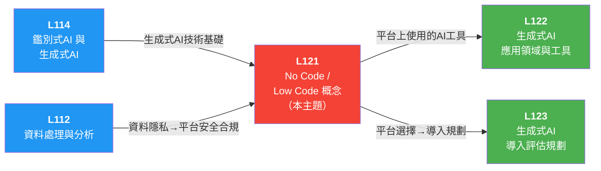

# L121 No Code / Low Code 概念 — iPAS AI（Artificial Intelligence，人工智慧）應用規劃師（初級）學習指南

> 對應評鑑範圍：**L12101 No Code / Low Code 的基本概念** ＋ **L12102 No Code / Low Code 的優勢與限制**

---

## 0. 關鍵概念總覽圖

> 先鳥瞰整個 L121 的知識地圖，搞清楚所有專有名詞彼此之間的關係，之後讀細節時就不會迷路。

```
🛠️ L121 No Code / Low Code 概念
│
├── L12101 No Code / Low Code 的基本概念
│   │
│   ├── 📖 核心定義與定位
│   │   ├── No Code / Low Code = 推動「AI 民主化」的關鍵力量
│   │   ├── 目標：降低技術門檻，讓非技術人員也能開發 AI 應用
│   │   └── 背景：數位轉型（Digital Transformation）浪潮 + 生成式 AI 興起，加速普及
│   │
│   ├── 🟢 No Code 平台
│   │   ├── 定義：完全無需寫程式碼，透過視覺化介面（Visual Interface）與拖放（Drag-and-Drop）操作開發
│   │   ├── 三大核心機制：拖放（Drag-and-Drop）、視覺化流程管理（Visual Workflow Management）、預建模組（Templates）
│   │   ├── 目標用戶：非技術背景使用者（公民開發者）
│   │   ├── 適用場景：快速原型設計（Rapid Prototyping / MVP（Minimum Viable Product，最小可行產品））、簡單業務工具、內部工作流程
│   │   └── 代表工具：Bubble、Airtable、Zapier、Langflow、Flowise、Coze、Dify
│   │
│   ├── 🔵 Low Code 平台
│   │   ├── 定義：結合視覺化開發工具 + 少量程式碼擴充功能
│   │   ├── 特色：支援程式碼擴展（Code Extension）的視覺化介面，可整合第三方 API（Application Programming Interface，應用程式介面）
│   │   ├── 目標用戶：具有基本技術背景的開發者
│   │   ├── 適用場景：企業級應用、複雜邏輯、高彈性需求
│   │   └── 代表工具：OutSystems、Mendix、Power Apps、AppSheet
│   │
│   ├── ⚡ No Code vs Low Code 比較
│   │   ├── 程式碼需求：No Code = 零 ｜ Low Code = 少量
│   │   ├── 目標用戶：No Code = 非技術人員 ｜ Low Code = 有技術基礎
│   │   ├── 客製化（Customization）程度：No Code = 受限 ｜ Low Code = 靈活可擴展
│   │   ├── 開發速度：No Code = 更快 ｜ Low Code = 較快但需調整
│   │   ├── 適用範圍：No Code = 簡單應用 ｜ Low Code = 複雜應用
│   │   ├── 適用規模：No Code = 小型/原型 ｜ Low Code = 中大型企業
│   │   └── 陷阱：兩者「不完全相同」，也「不是」只給 IT（Information Technology，資訊科技）團隊用
│   │
│   ├── 🤖 生成式 AI × No Code / Low Code 結合
│   │   ├── ① 自動生成程式碼 ── AI 協助開發客製化功能
│   │   ├── ② 模板設計優化（Template Optimization） ── AI 提供設計建議，快速完成 UI（User Interface，使用者介面）/UX（User Experience，使用者體驗）
│   │   ├── ③ 數據分析與決策 ── AI 基於專案數據提供自動化操作建議
│   │   ├── ④ AI 驅動 UI/UX 設計 ── 文字描述 → 自動生成介面方案
│   │   ├── ⑤ 自動化行銷文案 ── 輸入產品資訊 → 即時產出行銷內容
│   │   └── ⑥ 個人化 App 快速開發 ── 用戶數據分析 → 客製化體驗
│   │
│   ├── 🏭 各行業應用實例
│   │   ├── 🏥 醫療保健 ── 藥物發現、個人化治療、病歷自動生成
│   │   ├── 🏭 製造業 ── 產品設計原型、生產流程優化
│   │   ├── 🏦 金融業 ── 風險評估、投資組合優化、合規監管
│   │   ├── 🛒 零售業 ── 個人化行銷、庫存管理、顧客體驗優化
│   │   ├── 🎓 教育領域 ── 自動化教材生成、個人化學習路徑、互動課程
│   │   ├── 📞 客戶服務 ── 虛擬智慧客服、自動化回應、客訴分析
│   │   ├── 📢 行銷 ── 社群內容生成、文案自動化
│   │   ├── 🛍️ 電商 ── 商品資料庫管理、推薦系統
│   │   └── 🏢 內部系統 ── 工單管理、報告生成、資源分配
│   │
│   └── 🌍 AI 民主化（AI Democratization）
│       ├── 定義：將 AI 從少數專家/大企業擴展到更廣泛的社會層面
│       ├── 公民開發者（Citizen Developer）── 非技術人員也能開發 AI 應用
│       ├── 創意民主化（Democratization of Creativity） ── 更多人參與應用開發與 AI 技術創新
│       ├── 五大影響：降低門檻（Lower Barriers）、擴大可訪問性（Accessibility）、跨領域創新（Cross-domain Innovation）、
│       │   普及化應用、啟動全球性影響
│       └── 挑戰：過度依賴可能導致缺乏深層理解 → 模型偏差/誤用
│
└── L12102 No Code / Low Code 的優勢與限制
    │
    ├── ✅ 核心優勢
    │   ├── ① 降低開發成本
    │   │   ├── 簡化開發流程（視覺化 + 拖放設計）
    │   │   ├── 節省人力資源（無需大量專業程式設計師）
    │   │   ├── 雲端工具減少硬體投入
    │   │   └── 提高資源運用效率（團隊專注核心業務）
    │   ├── ② 縮短上市時間（Time-to-Market）
    │   │   ├── 內建即用型模組（Ready-to-Use Modules）、元件與 API 整合工具
    │   │   ├── 快速開發適用 MVP（最小可行產品）
    │   │   └── 敏捷開發（Agile Development）與調整（快速回應市場變化）
    │   ├── ③ 加速數位轉型（Digital Transformation）
    │   │   ├── 跨部門協作（Cross-department Collaboration）（IT + 業務部門）
    │   │   ├── 靈活應對市場變化
    │   │   └── 導入 AI 與自動化（Automation）
    │   ├── ④ 去中心化開發（Decentralized Development） ── 業務人員可直接參與設計，非技術背景也能參與
    │   └── ⑤ 功能模組化（Modular Functionality） ── 豐富插件生態（Plugin Ecosystem）與第三方整合能力
    │
    ├── ️限制與缺點
    │   ├── 客製化受限（Limited Customization） ── No Code 尤其明顯，無法提供程式碼層級控制
    │   ├── 效能瓶頸（Performance Bottleneck） ── 高流量/複雜運算可能不足
    │   ├── 大規模擴展難（Scalability Limitations） ── 企業級擴展有上限
    │   ├── 平台依賴性（Platform Dependency） ── 廠商鎖定（Vendor Lock-in）+ 平台間相容性問題
    │   ├── 資料安全性（Data Security） ── 數據存儲於第三方雲端，合規性（Compliance）問題
    │   ├── 緊密耦合（Tight Coupling） ── Low Code 程式碼與平台設定緊密耦合，維護困難
    │   └── 技術支持需求 ── Low Code 仍需技術背景人員進行深度維護
    │
    ├── 📋 平台選擇評估（6 大因素）
    │   ├── ① 目標用戶與技術需求 ── No Code 面向非技術；Low Code 面向有基礎者
    │   ├── ② 功能與擴展性（Functionality & Scalability） ── 系統整合能力（CRM（Customer Relationship Management，客戶關係管理）、ERP（Enterprise Resource Planning，企業資源規劃））+ 高度自訂性
    │   ├── ③ 安全性與合規性（Security & Compliance） ── 資料加密（Encryption）、身份驗證（Authentication）、MFA（Multi-Factor Authentication，多因素驗證）、權限管理
    │   ├── ④ 成本與效益（Cost & Benefit） ── TCO（Total Cost of Ownership，總擁有成本）+ ROI（Return On Investment，投資回報率）
    │   ├── ⑤ 技術支援與社群 ── 技術文件、論壇、社群活躍度
    │   └── ⑥ 市場評價與案例 ── 用戶評價 + 同行業成功案例
    │
    ├── 🔧 常見工具分類
    │   ├── No Code 工具：Airtable、Zapier、Webflow、MAKE、Langflow、Flowise、Coze、Dify
    │   ├── Low Code 工具：AppSheet、OutSystems
    │   ├── Web 開發：Webflow（設計者友好）、Wix（小型商業網站）
    │   ├── 流程自動化：Zapier（連接不同應用）、Integromat（可視化流程, 多平台整合）
    │   └── 生成式 AI：ChatGPT（文字生成）、DALL-E（圖像生成）
    │
    └── 🚧 生成式 AI × No Code/Low Code 的四大挑戰
        ├── ① 模型準確性與可靠性（Model Accuracy & Reliability） ── 輸出錯誤、驗證機制不足
        │   └── 解方：多層次驗證 + 自動化檢測 + 人工審核
        ├── ② 資料隱私與安全性（Data Privacy & Security） ── 敏感資料洩漏、合規風險（GDPR（General Data Protection Regulation，一般資料保護規範）/CCPA（California Consumer Privacy Act，加州消費者隱私法））
        │   └── 解方：資料加密 + 匿名化 + 權限控管
        ├── ③ 道德與倫理風險（Ethical Risks） ── 虛假資訊（Misinformation）、偏見與歧視（Bias & Discrimination）
        │   └── 解方：倫理準則 + 公平性檢測工具
        └── ④ 技術整合與平台適配性（Technical Integration & Platform Compatibility） ── 系統整合難度、效能優化
            └── 解方：API 擴充 + 雲端運算分散負載
```

---

## 1. 關鍵術語與定義

### 1-1 核心概念與開發範式（Core Concepts & Development Paradigms）

> 📝 **一句話速記**：AI 民主化讓非技術的公民開發者也能透過 No Code / Low Code 工具開發應用，核心在於降低門檻而非消除專業需求。

> ```
> 數位轉型 (Digital Transformation)  ← 大目標
>   └─ 需要什麼？
>       ├─ AI 民主化 (AI Democratization)  ← 理念
>       │   └─ 創意民主化 (Democratization of Creativity)  ← 延伸理念
>       │
>       ├─ 誰來做？
>       │   └─ 公民開發者 (Citizen Developer)  ← 執行者
>       │
>       ├─ 怎麼做？（開發方法論）
>       │   ├─ 敏捷開發 (Agile Development)  ← 大框架：迭代+回饋
>       │   └─ 快速應用開發 (RAD)  ← 具體手段：快速原型
>       │
>       ├─ 先做什麼？
>       │   └─ MVP (最小可行產品 / Minimum Viable Product)  ← 第一步產出
>       │
>       └─ 組織如何改變？
>           └─ 去中心化開發 (Decentralized Development)  ← 組織型態轉變
>
> ──── 關鍵對比 ────
> 敏捷開發（Agile Development） vs RAD（Rapid Application Development，快速應用開發）：方法論（迭代+回饋） vs 開發策略（快速原型）
> AI 民主化（AI Democratization） vs 創意民主化（Democratization of Creativity）：技術普及（大概念） vs 創新參與（延伸）
> 公民開發者（Citizen Developer） vs 去中心化開發（Decentralized Development）：角色（人） vs 組織模式（結構）
> ```
>
> 一句話串起來：企業推動**數位轉型**，核心理念是**AI 民主化**（進而實現**創意民主化**），讓**公民開發者**用 No Code / Low Code 工具，採用**敏捷開發**與 **RAD** 方法，先做出 **MVP** 驗證需求，最終形成**去中心化開發**的組織模式。

**① 理念層（目標與願景）**

- **數位轉型 (Digital Transformation)** — 企業運用數位科技（雲端、AI、自動化等）全面改造業務流程、商業模式與組織文化的過程。No Code / Low Code 平台是加速數位轉型的重要推手，讓企業能快速開發與部署應用。

> 🗣️ 把紙本作業的傳統商店改造成線上線下整合的智慧門市，從流程到文化全面升級。

- **AI 民主化 (AI Democratization)** — 將 AI 技術的使用和應用從少數專家和大型企業擴展到更廣泛的社會層面，使非技術背景人士和中小企業也能參與 AI 開發並受益。

> 🗣️ 以前只有大廚才能進廚房，現在有了氣炸鍋和懶人食譜，人人都能做出像樣的菜。

- **創意民主化 (Democratization of Creativity)** — AI 民主化的延伸概念，指透過低門檻工具讓更多非技術背景的人也能參與應用開發與技術創新。No Code / Low Code 平台正是實現創意民主化的具體途徑。

> 🗣️ 不只能「照食譜做菜」，還能自己發明新菜色——工具簡單到讓每個人都能當創作者。

**② 執行者（誰來做）**

- **公民開發者 (Citizen Developer)** — 非技術背景的人員，透過 No Code / Low Code 工具自行開發應用程式，實現日常工作自動化，大幅提高生產力。

> 🗣️ 不會寫程式的業務人員，靠拖拉工具自己做出一個內部管理 App，就像用 Canva 做海報一樣。

**③ 開發方法論（怎麼做）**

- **敏捷開發 (Agile Development)** — 強調快速迭代、持續交付與靈活回應變化的軟體開發方法論。No Code / Low Code 平台天然支援敏捷開發，能快速產出原型並根據回饋即時調整。

> 🗣️ 不等整棟房子蓋好才驗收，每週蓋一層就讓住戶試住、給回饋，邊蓋邊改。

- **快速應用開發 (RAD（Rapid Application Development，快速應用開發))** — 強調快速原型迭代的開發方法，與 No Code / Low Code 理念高度吻合。

> 🗣️ 先用保麗龍做一個房子模型給客戶看，確認方向對了再動工——重點是「快速出原型」。

- **MVP (最小可行產品 / Minimum Viable Product)** — 以最少功能快速推出的產品版本，用於驗證市場需求。No Code 平台特別適合快速建構 MVP。

> 🗣️ 先開一台餐車試賣招牌菜，生意好再開實體店——用最小成本驗證市場。

**④ 組織變革（組織如何改變）**

- **去中心化開發 (Decentralized Development)** — 透過 No Code / Low Code 工具，讓業務部門人員不再依賴 IT 部門，可直接參與應用程式設計與開發。

> 🗣️ 以前點餐要透過服務生（IT 部門），現在每桌都有平板自己點——業務部門自己動手開發。

> ⚠ **核心概念與開發範式 考試速記**：
>
> - 敏捷開發是**方法論**（迭代+回饋），RAD 是**開發策略**（快速原型）；RAD 可視為敏捷的一種實踐，題目常互換考
> - AI 民主化是**大概念**（技術普及），創意民主化是其**延伸**（創新參與）；題目常混淆兩者範圍
> - 公民開發者是「**人**」（角色），去中心化開發是「**組織模式**」（結構）——問「誰」選前者，問「怎樣的組織」選後者
> - MVP 強調的是「**驗證市場需求**」而非「功能完整」，選項中出現「完整功能」即為陷阱
> - No Code / Low Code 的目標是「**降低門檻**」而非「消除專業需求」——複雜應用仍需專業開發者介入

### 1-2 平台類型與特性（Platform Types & Characteristics）

> 📝 **一句話速記**：No Code 靠拖拉完全免寫程式碼，Low Code 則在視覺化基礎上允許少量程式碼擴充，兩者目標用戶與客製化程度截然不同。

> ```
> No Code / Low Code 平台
> ├─ No Code 平台（No Code Platform）← 非技術者
> │   三大核心機制：
> │   ├─ 拖拉介面（Drag-and-drop）
> │   ├─ 視覺化流程管理（Visual Workflow Management）
> │   └─ 預建模組 / 模板（Templates）
> │
> ├─ Low Code 平台（Low Code Platform）← 有技術背景的開發者
> │   核心特色：
> │   ├─ 模型（Model）← 抽象描述資料結構與流程
> │   └─ 程式碼擴展（Code Extension）← 少量程式碼深度客製化
> │
> └─ 共用基礎設施（兩者皆適用）
>     ├─ 即用型模組（Ready-to-Use Modules）← 內建即裝即用元件
>     ├─ 功能模組化（Modular Functionality）← 拆分為可重用模組
>     └─ 插件生態（Plugin Ecosystem）← 第三方擴充功能
>
> ─── 關鍵對比 ───
> No Code vs Low Code
> ┌──────────┬──────────────────┬──────────────────┐
> │ 比較維度 │ No Code          │ Low Code         │
> ├──────────┼──────────────────┼──────────────────┤
> │ 目標用戶 │ 非技術背景者     │ 有技術背景開發者 │
> │ 程式碼   │ 完全不需要       │ 允許少量擴充     │
> │ 客製化   │ 低（模板範圍內） │ 高（程式碼擴展） │
> │ 適用場景 │ 原型/小型應用    │ 中大型企業應用   │
> └──────────┴──────────────────┴──────────────────┘
> ```
>
> 一句話串起來：No Code 靠**拖拉介面 + 視覺化流程管理 + 預建模板**三大機制讓非技術者直接上手；Low Code 則多了**模型**抽象與**程式碼擴展**能力供開發者深度客製。兩者共享**即用型模組、功能模組化、插件生態**這套組裝式基礎設施。

**① No Code 三大核心機制**

- **No Code 平台** — 透過視覺化介面和拖放操作，讓使用者無需撰寫任何程式碼即可快速開發應用，特別適合非技術背景者用於快速原型設計或小型應用開發。
> 🗣️ 像樂高積木——照說明書拼就好，完全不用自己製造零件。

- **拖拉介面 (Drag-and-drop)** — No Code / Low Code 平台的核心操作方式，使用者透過拖曳元件來設計網頁、行動應用介面與設定邏輯流程。
> 🗣️ 用滑鼠把元件「拖」到畫面上「放」好，就像在簡報軟體裡排版一樣。

- **視覺化流程管理 (Visual Workflow Management)** — No Code 平台的三大核心機制之一，讓使用者透過圖形化介面設計與管理業務邏輯流程，無需撰寫程式碼即可定義條件判斷、分支與觸發動作。
> 🗣️ 用流程圖畫出「如果→那麼」的邏輯，像畫心智圖一樣設計業務規則。

- **預建模組 / 模板 (Templates)** — No Code 平台提供的現成元件與版型，使用者可直接套用並微調，大幅縮短開發時間。是 No Code 三大核心機制之一（拖放 + 視覺化流程管理 + 預建模組）。
> 🗣️ 現成的蛋糕模具——倒麵糊進去就能烤出形狀，不用從零雕刻。

**② Low Code 核心特色**

- **Low Code 平台** — 結合視覺化開發工具與程式碼擴充功能，讓具有技術背景的開發者能在視覺化基礎上透過少量程式碼實現深度客製化與複雜邏輯，適合中大型企業級應用。
> 🗣️ 像 IKEA 家具——大部分照說明書組裝，但可以自己鑽孔、改尺寸做客製化。

- **模型 (Model) — Low Code 語境** — 在 Low Code 平台中，模型是用來抽象描述資料結構、業務流程與介面邏輯的核心元素，影響應用的設計與維護（非僅視覺化輔助工具）。
> 🗣️ 設計圖紙——先畫好資料長什麼樣、流程怎麼走，再據此組裝應用。

- **程式碼擴展 (Code Extension)** — Low Code 平台的核心特色，允許開發者在視覺化介面基礎上撰寫少量程式碼（如 JavaScript、SQL）來實現深度客製化與複雜邏輯，彌補純視覺化操作的不足。
> 🗣️ 模具不夠用時，自己手工捏一小塊裝飾上去——用少量程式碼補足客製需求。

**③ 共用基礎設施**

- **即用型模組 (Ready-to-Use Modules)** — No Code / Low Code 平台內建的即裝即用元件（如表單、圖表、API 連接器），搭配預設 API 整合工具，讓使用者快速組裝應用功能，是縮短上市時間的關鍵。
> 🗣️ 超市的冷凍微波食品——拆封加熱就能吃，表單、圖表、API 連接器拿來就用。

- **功能模組化 (Modular Functionality)** — 將平台功能拆分為獨立、可重複使用的模組，使用者按需組合即可建構應用。模組化設計搭配豐富的插件生態，是 No Code / Low Code 平台的重要優勢之一。
> 🗣️ 把廚房設備拆成獨立單元（烤箱、冰箱、洗碗機），按需要組合成理想廚房。

- **插件生態 (Plugin Ecosystem)** — 平台周邊由第三方開發者提供的擴充功能集合，涵蓋支付、通知、數據分析等各類整合。豐富的插件生態能大幅擴展 No Code / Low Code 平台的應用範圍與功能深度。
> 🗣️ App Store 裡的第三方 App——平台本身功能不夠，裝個插件就能擴充（支付、通知、分析）。

> ⚠ **平台類型與特性 考試速記**：
>
> 🔍 **易混淆名詞比較表**：
>
> ┌────────────────────────┬──────────────────────────────────────┬──────────────────────────────────────┬──────────────────────────────────────────┐
> │ 比較對象               │ 左側概念解析                         │ 右側概念解析                         │ 考試判斷關鍵                             │
> ├────────────────────────┼──────────────────────────────────────┼──────────────────────────────────────┼──────────────────────────────────────────┤
> │ 預建模組 vs 即用型模組 │ 預建模組（No Code 專屬）：模板/版型  │ 即用型模組（兩者通用）：表單等元件   │ 問 No Code 核心選預建，問通用選即用      │
> │ 功能模組化 vs 插件生態 │ 功能模組化：平台自身的架構單元         │ 插件生態：第三方提供的擴充功能       │ 關鍵字「第三方」直接指向插件生態         │
> │ 模型 vs 視覺化流程管理 │ 模型（Low Code 專屬）：資料抽象層    │ 流程管理（No Code 專屬）：設計工具   │ 兩者分屬不同平台，切忌混淆                 │
> └────────────────────────┴──────────────────────────────────────┴──────────────────────────────────────┴──────────────────────────────────────────┘
>
> - **No Code 三大核心機制**：拖拉介面 + 視覺化流程管理 + 預建模組/模板，缺一不可；「程式碼擴展」屬於 Low Code 而非 No Code
> - **Low Code ≠ No Code 加強版**：Low Code 的核心差異在於「模型抽象」與「程式碼擴展」，目標用戶是有技術背景的開發者，不是單純比 No Code 多寫一點程式碼

### 1-3 成本效益評估（Cost-Benefit Evaluation）

> 📝 **一句話速記**：選平台先算 TCO 看總花費，再算 ROI 確認投資值不值得。

> ```
> 平台選擇的成本效益評估
> │
> ├─ TCO（總擁有成本 / Total Cost of Ownership）← 花多少？
> │   └─ 購買 + 維護 + 培訓 + 隱性成本
> │
> └─ ROI（投資回報率 / Return On Investment）← 值不值？
>     └─ 縮短開發週期 + 提升效率 + 加速上市
>
> ──── 關鍵對比 ────
> TCO vs ROI：TCO 算「總共花多少」，ROI 算「賺回多少」
> ```
>
> 一句話串起來：先用 **TCO** 盤點所有成本（買、養、學），再用 **ROI** 驗證投入能帶回多少效益，兩者搭配才能做出理性的平台選擇決策。

**① 成本面（花多少？）**

- **總擁有成本 (TCO / Total Cost of Ownership)** — 考量平台的購買、維護、培訓等所有相關成本，評估其對企業的整體財務影響。

> 🗣️ 買車不能只看車價，還要算保險、油錢、保養、停車費，全部加起來才是真正的花費。

**② 效益面（值不值？）**

- **投資回報率 (ROI / Return On Investment)** — 衡量平台在縮短開發週期、產品上市時間、提升開發效率等方面的效益，確保投資有實際價值。

> 🗣️ 花了 10 萬買工具，結果省下 30 萬的人力成本，ROI 就是正的，這筆投資值得。

> ⚠ **成本效益評估 考試速記**：
>
> - TCO 不只是購買價格，還包含維護、培訓、整合等**隱性成本**，考題常用「只算授權費」來誤導
> - ROI 衡量的是**效益與成本的比值**，不是單純看省了多少錢
> - 選平台的正確順序：先算 TCO（能不能負擔）→ 再算 ROI（值不值得）
> - TCO 高不代表不該選，要看 ROI 是否足夠高來彌補成本

### 1-4 平台依賴與遷移風險（Platform Dependency & Migration Risks）

> 📝 **一句話速記**：廠商鎖定讓你搬不走，緊密耦合讓你改不動，平台依賴性是兩者的總稱。

> ```
> 平台依賴性 (Platform Dependency)  ← 總稱
> │
> ├─ 廠商鎖定 (Vendor Lock-in)  ← No Code 為主
> │   └─ 搬不走：轉換成本高、資料遷移難
> │
> └─ 緊密耦合 (Tight Coupling)  ← Low Code 為主
>     └─ 改不動：程式碼與平台設定高度相依
>
> ─── 關鍵對比 ───
> 廠商鎖定 vs 緊密耦合
> ┌──────────┬──────────────────┬──────────────────┐
> │ 比較維度 │ 廠商鎖定         │ 緊密耦合         │
> ├──────────┼──────────────────┼──────────────────┤
> │ 核心風險 │ 「換平台」的風險 │ 「改程式」的風險 │
> │ 平台影響 │ No Code 更怕     │ Low Code 更怕    │
> └──────────┴──────────────────┴──────────────────┘
> ```
>
> 一句話串起來：**平台依賴性**是總風險，底下分兩條路 —— **廠商鎖定**讓你綁死在一家平台搬不走，**緊密耦合**讓你的程式碼跟平台黏太緊改不動。

**① 總稱**

- **平台依賴性 (Platform Dependency)** — 使用 No Code / Low Code 平台開發應用時，對特定平台產生高度依賴的風險。包含兩個面向：廠商鎖定（Vendor Lock-in）導致轉換成本高昂，以及不同平台間的相容性問題影響資料遷移。

> 🗣️ 租屋簽了長約又裝潢了整間房，想搬家就得放棄所有投入，這就是平台依賴。

**② 兩大風險面向**

- **廠商鎖定 (Vendor Lock-in)** — 所有應用程式都建構在特定 No Code 平台上，未來若想搬家或換平台，轉換成本會非常高昂。是評估 No Code 風險時的重要考量。

> 🗣️ 手機照片全存在某家雲端，換品牌就要花大把時間搬資料，搬到一半還可能遺失。

- **緊密耦合 (Tight Coupling)** — Low Code 平台中程式碼與平台設定高度相依的狀態，導致後續維護困難、遷移成本高。

> 🗣️ 樂高積木如果用強力膠黏死，以後想拆掉某一塊重組就幾乎不可能了。

> ⚠ **平台依賴與遷移風險 考試速記**：
>
> - 平台依賴性是**上位概念**，廠商鎖定和緊密耦合是其兩個子面向
> - **廠商鎖定**主要影響 No Code 平台（完全依賴平台，無程式碼可帶走）
> - **緊密耦合**主要影響 Low Code 平台（有程式碼但與平台設定高度相依）
> - 考題常混淆「廠商鎖定」與「緊密耦合」：前者是「換不了平台」，後者是「改不了程式」
> - 降低平台依賴的策略：採用開放標準、模組化設計、保留資料匯出能力

### 1-5 效能與擴展限制（Performance & Scalability Limitations）

> 📝 **一句話速記**：流量一大就卡（效能瓶頸），規模一大就撐不住（擴展難），可測試性則是品質保障的關鍵。

> ```
> No Code / Low Code 平台的技術限制
> │
> ├─ 效能瓶頸 (Performance Bottleneck)  ← 當下跑不動
> │   └─ 高流量 / 複雜運算 → 平台架構撐不住
> │
> ├─ 大規模擴展難 (Scalability Limitations)  ← 未來長不大
> │   └─ 應用規模成長 → 系統擴展能力不足
> │
> └─ 可測試性 (Testability)  ← 品質難把關
>     └─ 跨部門流程 + 外部整合 → 自動化測試困難
>
> ─── 關鍵對比 ───
> 效能瓶頸 vs 擴展難
> ┌──────────┬──────────────────┬──────────────────┐
> │ 比較維度 │ 效能瓶頸         │ 擴展難           │
> ├──────────┼──────────────────┼──────────────────┤
> │ 核心問題 │ 現在跑得慢       │ 未來撐不住       │
> │ 平台影響 │ No Code 更嚴重   │ Low Code 可緩解  │
> └──────────┴──────────────────┴──────────────────┘
> ```
>
> 一句話串起來：平台的技術限制分三層 —— **效能瓶頸**是當下高負載跑不動，**大規模擴展難**是未來規模長不大，**可測試性**是整合後品質難以驗證。

**① 效能面（跑得動嗎？）**

- **效能瓶頸 (Performance Bottleneck)** — No Code / Low Code 平台在面對高流量存取或複雜運算需求時，因平台架構限制而出現效能不足的情況。是選擇平台時須評估的重要限制之一。

> 🗣️ 平時用家用 Wi-Fi 上網沒問題，但全家同時追劇＋視訊會議就開始卡頓，這就是效能瓶頸。

**② 擴展面（長得大嗎？）**

- **大規模擴展難 (Scalability Limitations)** — No Code / Low Code 平台在應用規模成長至企業級時，面臨系統擴展能力不足的問題。No Code 平台尤其明顯，Low Code 平台透過程式碼擴展可部分緩解。

> 🗣️ 路邊攤生意好想開分店，但攤車的設計只能一個人顧一攤，沒辦法直接複製成連鎖店。

**③ 品質面（測得了嗎？）**

- **可測試性 (Testability)** — No Code / Low Code 系統在跨部門流程與外部服務整合下，維持可重複自動化測試的能力。最佳實踐：導入自動化測試流程，透過 API 或服務虛擬化進行模組化驗證。

> 🗣️ 拼裝家具如果沒有說明書和檢查清單，裝完才發現少鎖一顆螺絲就得全部拆掉重來。

> ⚠ **效能與擴展限制 考試速記**：
>
> - 效能瓶頸是**當下**的問題（高流量/複雜運算），大規模擴展難是**未來**的問題（規模成長）
> - No Code 平台的三項限制**都比 Low Code 嚴重**，因為完全無法透過程式碼優化
> - Low Code 可透過**程式碼擴展**部分緩解效能與擴展問題，但仍受平台架構限制
> - 可測試性的解法關鍵字：**自動化測試**、**API 測試**、**服務虛擬化**
> - 考題常問「哪項不是 No Code 的限制」，可測試性容易被忽略——它也是限制之一

### 1-6 安全性與合規（Security & Compliance）

> 📝 **一句話速記**：資料存在第三方雲端要注意安全，加密＋身份驗證＋MFA 是防護三本柱，GDPR/CCPA 是合規兩大法規。

> ```
> 資料安全性 (Data Security)  ← 總議題
> ├─ 技術防護手段
> │   ├─ 資料加密 (Encryption)  ← 保護資料本身
> │   │   ├─ 傳輸中加密 (In-transit)
> │   │   └─ 靜態加密 (At-rest)
> │   └─ 身份驗證 (Authentication)  ← 保護存取權限
> │       └─ MFA (Multi-Factor Authentication)  ← 強化版身份驗證
> │
> └─ 法規合規要求
>     └─ 合規性 (Compliance)  ← 法規遵循框架
>         ├─ GDPR  ← 歐盟：個資保護
>         └─ CCPA  ← 美國加州：消費者隱私
>
> ──── 關鍵對比 ────
> 技術防護 vs 法規合規：加密與身份驗證（管控誰能存取） vs 遵循 GDPR/CCPA（確保處理流程合法）
> ```
>
> 一句話串起來：資料安全分兩條線：**技術防護**靠加密保護資料、靠身份驗證（尤其 MFA）管控誰能存取；**法規合規**靠 GDPR / CCPA 確保處理流程合法。兩條線缺一不可。

**① 總議題**

- **資料安全性 (Data Security)** — No Code / Low Code 平台的數據通常存儲於第三方雲端，存在資料外洩與未授權存取的風險。企業須評估平台的安全防護機制是否符合自身資安要求。
  > 🗣️ 把貴重物品寄放在別人的倉庫（雲端），要確認倉庫的鎖夠不夠牢。

**② 技術防護手段**

- **資料加密 (Encryption)** — 將資料轉換為密文以防止未授權存取的安全機制。是平台安全性評估的關鍵指標之一，包含傳輸中加密（In-transit）與靜態加密（At-rest）。
  > 🗣️ 把信件內容翻譯成只有收件人看得懂的暗號，路上被攔截也讀不懂。
- **身份驗證 (Authentication)** — 確認使用者身份是否合法的安全機制，常見方式包括密碼、生物辨識與多因素驗證。是 No Code / Low Code 平台安全性與合規性評估的核心要素。
  > 🗣️ 進大樓要刷門禁卡——確認「你是你」才放行。
- **MFA (Multi-Factor Authentication，多因素驗證)** — 結合兩種以上不同類型的驗證因子（如密碼 + 手機驗證碼 + 指紋）來確認使用者身份的安全機制。在平台安全性評估中，支援 MFA 是重要的加分項。
  > 🗣️ 不只刷卡，還要輸密碼再按指紋——多重關卡確認身份，像銀行轉帳要密碼 + 簡訊驗證碼。

**③ 法規合規要求**

- **合規性 (Compliance)** — 平台在資料處理、儲存與傳輸方面是否符合相關法律法規（如 GDPR、CCPA）的要求。選擇平台時須確認其合規認證與資料治理機制。
  > 🗣️ 餐廳要拿到衛生許可證才能營業——平台處理資料也要符合法規才能上線。
- **GDPR (General Data Protection Regulation，一般資料保護規範)** — 歐盟制定的個人資料保護法規，對資料蒐集、處理、儲存有嚴格規範，違規可處高額罰款。No Code / Low Code 平台若處理歐盟用戶資料，必須符合 GDPR 要求。
  > 🗣️ 歐盟的「個資保護嚴格管家」——未經同意不能蒐集資料，違規罰款極重。
- **CCPA (California Consumer Privacy Act，加州消費者隱私法)** — 美國加州的消費者隱私保護法規，賦予消費者對個人資料的知情權、刪除權與拒絕出售權。與 GDPR 同為平台合規性評估的重要法規參考。
  > 🗣️ 加州版的個資保護法——消費者有權知道你蒐了什麼、要求刪除、拒絕被賣資料。

> ⚠ **安全性與合規 考試速記**：
>
> 🔍 **易混淆名詞比較表**：
>
> ┌──────────────────┬──────────────────────────────────────────┬──────────────────────────────────────────────┬──────────────────────────────────────────────┐
> │ 比較對象         │ 左側概念解析                             │ 右側概念解析                                 │ 考試判斷關鍵                                 │
> ├──────────────────┼──────────────────────────────────────────┼──────────────────────────────────────────────┼──────────────────────────────────────────────┤
> │ 加密 vs 身份驗證 │ 加密：保護「資料內容」不被看懂           │ 身份驗證：管控「誰能進門」存取資料           │ 對象不同：加密對資料，身份驗證對使用者       │
> │ 身份驗證 vs MFA  │ 身份驗證：通稱概念（可以只用密碼）       │ MFA：特指「兩種以上因子」的強化版驗證        │ MFA 等同於「身份驗證 + 更多關卡」            │
> │ GDPR vs CCPA     │ GDPR：歐盟法規（範圍更廣、罰則更重）     │ CCPA：美國加州法規（聚焦消費者權利）         │ 地區不同：一為歐盟，一為美國加州             │
> └──────────────────┴──────────────────────────────────────────┴──────────────────────────────────────────────┴──────────────────────────────────────────────┘

### 1-7 企業系統整合（Enterprise System Integration）

> 📝 **一句話速記**：CRM 管客戶關係、ERP 管企業資源，平台能否與這兩大系統整合是選型關鍵。

> ```
> 企業系統整合（Enterprise System Integration）
> │
> ├── CRM（Customer Relationship Management，客戶關係管理）
> │   └── 對外：管理客戶互動（銷售、行銷、客服）
> │
> └── ERP（Enterprise Resource Planning，企業資源規劃）
>     └── 對內：整合企業資源（財務、生產、人資、供應鏈）
>
> ─── 關鍵對比 ───
> CRM = 對外（客戶端） ｜ ERP = 對內（營運端）
> 兩者皆為評估 No Code / Low Code 平台整合能力的重要指標
> ```
>
> 一句話串起來：CRM 顧外面的客戶、ERP 管裡面的資源，No Code / Low Code 平台選型時要看能否同時串接這兩大系統。

**① CRM — 客戶關係管理（對外）**

- **CRM（Customer Relationship Management，客戶關係管理）** — 管理企業與客戶互動關係的系統，涵蓋銷售、行銷與客服流程。評估 No Code / Low Code 平台的功能與擴展性時，能否與 CRM 系統無縫整合是關鍵考量。

> 🗣️ CRM 就像餐廳的訂位本加熟客筆記——記錄每位客人喜歡坐哪、點過什麼、多久沒來，讓服務生下次見面就能叫出名字、推薦愛吃的菜。

**② ERP — 企業資源規劃（對內）**

- **ERP（Enterprise Resource Planning，企業資源規劃）** — 整合企業各部門（財務、生產、人資、供應鏈等）資源與流程的大型管理系統。與 CRM 同為評估平台系統整合能力的重要指標。

> 🗣️ ERP 就像一間大公司的中央神經系統——把財務、倉庫、生產線、人事全部串在同一條線上，任何一個部門的動靜，其他部門立刻知道。

> ⚠ **企業系統整合 考試速記**：
> - CRM 對外管客戶、ERP 對內管資源，兩者定位不同不可混淆
> - 題目問「評估平台整合能力」時，CRM 與 ERP 是最常出現的兩大指標
> - No Code / Low Code 平台的「系統整合能力」＝能否透過 API 或內建連接器與 CRM / ERP 對接
> - CRM 常見產品：Salesforce、HubSpot；ERP 常見產品：SAP、Oracle——題目可能以產品名稱出題

### 1-8 No Code 工具（No Code Tools）

> 📝 **一句話速記**：記住各工具的定位——Bubble 做網站、AppSheet 把 Excel 變 App、Zapier/Make 串接自動化、Langflow/Flowise/Coze/Dify 建構 AI 工作流。

> ```
> No Code 工具 (No Code Tools)
> ├─ 網站與行動應用 (Web & Mobile Apps)
> │   ├─ Bubble  ← 複雜網頁原型
> │   ├─ Webflow  ← 重視設計感網站
> │   ├─ Wix  ← 簡單商業網站
> │   └─ AppSheet / Glide  ← Excel 轉 App
> │
> ├─ 流程自動化與整合 (Workflow Automation)
> │   ├─ Zapier  ← 跨平台串接
> │   └─ Make.com / Integromat  ← 視覺化複雜流程
> │
> ├─ AI 工作流與機器人 (AI Workflow & Bots)
> │   ├─ Langflow / Flowise  ← 視覺化 LLM 工作流
> │   └─ Coze / Dify  ← 智能助理開發
> │
> └─ 資料與專案管理 (Data & Project Management)
>     └─ Airtable  ← 試算表資料庫
>
> ─── 關鍵對比 ───
> Webflow vs Wix
> ┌──────────┬──────────────────┬──────────────────┐
> │ 比較維度 │ Webflow          │ Wix              │
> ├──────────┼──────────────────┼──────────────────┤
> │ 目標客群 │ 專業網頁設計師   │ 無技術的商業用戶 │
> │ 核心優勢 │ 像素級設計控制   │ 易用性、豐富模板 │
> └──────────┴──────────────────┴──────────────────┘
> ```
>
> 一句話串起來：No Code 工具各有專攻，選工具等於選戰場：**網站開發**找 Bubble/Webflow、**自動化流程**用 Zapier/Make、**AI 助理**選 Coze/Dify、**資料庫**靠 Airtable。

**① 網站與行動應用（Web & Mobile Apps）**

- **Bubble** — No Code 網站應用製造機，專門用於快速製作功能完整的網站原型。
  > 🗣️ 像是一套全能的樂高城市組——什麼都能搭，適合做完整的網站應用。
- **AppSheet / Glide** — 能將靜態的 Excel 試算表瞬間轉換為動態手機 App 的 No Code 工具。
  > 🗣️ 像是一台印鈔機——把原本平躺的試算表放進去，馬上產出一個可供操作的手機 App。
- **Webflow** — 設計者友好的 No Code 網站開發平台，提供高度視覺化的設計工具，適合需要精細設計控制的網站專案。
  > 🗣️ 像是高級畫布——讓設計師不寫程式也能精準控制每個像素的呈現。
- **Wix** — 面向小型商業網站的 No Code 網站建構平台，提供豐富的模板與拖放式編輯器。與 Webflow 相比更強調易用性。
  > 🗣️ 像是現成的樣品屋——挑喜歡的風格住進去，適合馬上要開店的小老闆。

**② 流程自動化與整合（Workflow Automation）**

- **Zapier** — No Code 流程自動化工具，核心功能是將不同應用程式串接起來，透過觸發器（Trigger）與動作（Action）實現自動化工作流。
  > 🗣️ 就像是一萬個軟體中間的萬能轉接頭——信箱收到新信，它馬上幫你轉發到 Slack。
- **Make.com / Integromat** — 視覺化流程自動化工具，支援多平台整合，可將不同應用串接為複雜的自動化流程。
  > 🗣️ 像是工廠輸送帶的設計圖——它能把好幾個複雜的軟體串聯成一條自動化工廠流水線。

**③ AI 工作流與機器人（AI Workflow & Bots）**

- **Langflow / Flowise** — No Code 的生成式 AI 應用開發工具，透過視覺化節點拖放方式建構 LLM（大型語言模型）工作流程。
  > 🗣️ 像是組裝大腦神經的開關板——把 AI 的各種能力像積木一樣一塊塊連起來。
- **Coze / Dify** — No Code AI 應用平台，讓使用者無需程式碼即可建構 AI 聊天機器人與智能助理。
  > 🗣️ 像是幫你捏造一個可以對話的客服機器人——餵它資料，它就能幫你回答客人問題。

**④ 資料與專案管理（Data & Project Management）**

- **Airtable** — 結合試算表與資料庫功能的 No Code 協作平台，適合團隊進行專案管理、內容規劃與資料追蹤。
  > 🗣️ 像是長了腦袋的 Excel——不只能算數字，還能關聯圖片、卡片、日曆看專案進度。

> ⚠ **No Code 工具 考試速記**：
>
> 🔍 **易混淆名詞比較表**：
>
> ┌────────────────────────┬──────────────────────────────────────┬──────────────────────────────────────┬──────────────────────────────────────────┐
> │ 比較對象               │ 左側概念解析                         │ 右側概念解析                         │ 考試判斷關鍵                             │
> ├────────────────────────┼──────────────────────────────────────┼──────────────────────────────────────┼──────────────────────────────────────────┤
> │ Webflow vs Wix         │ Webflow：專業設計師友好、高自由度    │ Wix：小商業網站、拖放排版、簡單易用  │ 設計師選 Webflow，簡單開店選 Wix         │
> │ Zapier vs Make         │ Zapier：強調簡單 A 到 B 串接         │ Make：強調可視化、多步驟複雜整合     │ 問「視覺化多平台複雜自動化」選 Make      │
> │ Langflow vs Coze       │ Langflow：編排背後的 LLM 流程節點    │ Coze：偏向終端應用的 AI 助理/機器人  │ 節點拖放選 Langflow，聊天助理選 Coze      │
> └────────────────────────┴──────────────────────────────────────┴──────────────────────────────────────┴──────────────────────────────────────────┘

### 1-9 Low Code 工具（Low Code Tools）

> 📝 **一句話速記**：Retool 做內部工具可嵌入 JS/SQL，Copilot Studio 建 AI 聊天機器人並整合微軟生態系。

> ```
> Low Code 工具 (Low Code Tools)
> ├─ 原生微軟生態 (Microsoft Ecosystem)
> │   ├─ Power Apps  ← 企業業務應用
> │   └─ Copilot Studio  ← AI 聊天機器人
> │
> ├─ 企業級開發與維運 (Enterprise Dev & DevOps)
> │   ├─ OutSystems  ← 注重高效能與擴展性
> │   └─ Mendix  ← 注重團隊協作與 DevOps
> │
> └─ 內部工具開發 (Internal Tools)
>     └─ Retool  ← 嵌入 SQL/JS 做後台
>
> ─── 關鍵對比 ───
> OutSystems vs Mendix
> ┌──────────┬──────────────────┬──────────────────┐
> │ 比較維度 │ OutSystems       │ Mendix           │
> ├──────────┼──────────────────┼──────────────────┤
> │ 核心強項 │ 效能、跨平台擴展 │ DevOps、團隊協作 │
> │ 適用場景 │ 大型系統高效擴展 │ 敏捷開發團隊協作 │
> └──────────┴──────────────────┴──────────────────┘
> ```
>
> 一句話串起來：Low Code 工具是用來寫大型專案的：微軟全餐用 **Power Apps / Copilot Studio**，開發後台管理看板用 **Retool**，搞大企業系統架構選 **OutSystems** 或 **Mendix**。

**① 原生微軟生態（Microsoft Ecosystem）**

- **Power Apps** — 微軟推出的 Low Code 應用開發平台，深度整合 Microsoft 365、Azure 與 Dynamics 365 生態系，適合已使用微軟技術棧的企業快速建構業務應用。
  > 🗣️ 像是用 Word 和 Excel 原班人馬搞出的一個新軟體——因為是微軟自家骨肉，整合得渾然天成。
- **Copilot Studio** — 微軟推出的 Low Code 平台，專注於建立 AI 驅動聊天機器人，可深度整合微軟生態系並保留擴充彈性。
  > 🗣️ 像是請了個專門會跟微軟系統溝通的秘書機器人。

**② 企業級開發與維運（Enterprise Dev & DevOps）**

- **OutSystems** — 企業級 Low Code 開發平台，提供完整的應用生命週期管理，支援快速建構跨平台企業應用，適合需要高擴展性與效能的大型專案。
  > 🗣️ 像是總部幫你蓋的一條超級生產線——從開發到測試到上線一條龍包辦，擴展力極強。
- **Mendix** — 企業級 Low Code 開發平台，強調視覺化建模與協作開發，內建 DevOps 功能，適合需要快速交付且注重團隊協作的企業應用開發。
  > 🗣️ 像是讓開發者跟業務部門在同一個白板前畫圖蓋房子——特別重視 DevOps 和團隊協作溝通。

**③ 內部工具開發（Internal Tools）**

- **Retool** — 專門用來打造公司內部工具（如訂單管理系統）的 Low Code 平台，允許直接嵌入 JavaScript 與 SQL 進行客製化。
  > 🗣️ 像是直接拉資料庫做成管理員的控制台介面——可以塞一小段 SQL 碼把客人訂單抓出來。

> ⚠ **Low Code 工具 考試速記**：
>
> 🔍 **易混淆名詞比較表**：
>
> ┌────────────────────────┬──────────────────────────────────────┬──────────────────────────────────────┬──────────────────────────────────────────┐
> │ 比較對象               │ 左側概念解析                         │ 右側概念解析                         │ 考試判斷關鍵                             │
> ├────────────────────────┼──────────────────────────────────────┼──────────────────────────────────────┼──────────────────────────────────────────┤
> │ Power Apps vs Copilot  │ Power Apps：多功能企業應用與表單開發 │ Copilot Studio：專注於「AI 機器人」  │ 看到「助理/聊天機器人」選 Copilot Studio │
> │ OutSystems vs Mendix   │ OutSystems：強調整體效能與大範圍擴展 │ Mendix：強調 DevOps 溝通與敏捷開發   │ 關鍵字「DevOps/團隊協作」選 Mendix       │
> │ Retool vs AppSheet     │ Retool（Low Code）：寫 SQL 建後台    │ AppSheet（No Code）：拉 Excel 建 App │ 問「嵌入 JS/SQL」必選 Retool             │
> └────────────────────────┴──────────────────────────────────────┴──────────────────────────────────────┴──────────────────────────────────────────┘

### 1-10 AI 輔助開發工具（AI-Assisted Development Tools）

> 📝 **一句話速記**：GitHub Copilot 是 VS Code 插件專注單檔補全，Cursor 是獨立編輯器能跨檔案重構，兩者定位不同切勿混淆。

> ```
> AI 輔助開發工具（AI-Assisted Development Tools）
> │
> ├── 🔌 插件型（Plugin）
> │   └── GitHub Copilot ── 安裝在 VS Code 的 Extension
> │       └── 定位：單一檔案行內補全（Inline Completion）
> │
> └── 🖥️ 獨立編輯器型（Standalone Editor）
>     └── Cursor ── 內建 AI 的完整 IDE
>         └── 定位：跨檔案理解 + 全域重構（Cross-file Refactoring）
>
> ─── 關鍵對比 ───
> GitHub Copilot vs Cursor
> ┌──────────┬──────────────────┬──────────────────┐
> │ 比較維度 │ GitHub Copilot   │ Cursor           │
> ├──────────┼──────────────────┼──────────────────┤
> │ 型態定位 │ 插件 (Plugin)    │ 獨立編輯器 (IDE) │
> │ 運作範圍 │ 單檔行內補全     │ 跨檔案全域重構   │
> │ 適用場景 │ 日常編碼加速     │ 大規模專案改寫   │
> └──────────┴──────────────────┴──────────────────┘
> ```
>
> 一句話串起來：Copilot 像是幫你打字的副駕駛（插件），Cursor 像是整台車就內建自動駕駛系統（獨立編輯器），一個加速單行、一個統籌全局。

**① 插件型（Plugin）**

- **GitHub Copilot** — GitHub 與 OpenAI 合作推出的 AI 程式碼補全工具，以插件（Extension）形式安裝在 VS Code（Visual Studio Code）中，根據上下文自動建議與補全程式碼。專注於單一檔案的行內補全，適合加速日常編碼工作。
  > 🗣️ 像是你打字時旁邊坐著一位經驗豐富的同事，隨時幫你把下半句寫完——但他只看得到你眼前這一頁文件。

**② 獨立編輯器型（Standalone Editor）**

- **Cursor** — 內建 AI 的獨立編輯器，具備跨越單一檔案、理解全域專案架構與進行大規模重構的能力。與 GitHub Copilot（需安裝在 VS Code 的插件）定位不同。
  > 🗣️ 像是一位理解整個建築藍圖的總工程師，不只幫你砌眼前這面牆，還能同時協調所有樓層的管線配置。

> ⚠ **AI 輔助開發工具 考試速記**：
>
> - 實務提醒：先優化 Prompt 寫法再考慮換工具——好的提示詞在任何工具上都能提升產出品質
>
> 🔍 **易混淆名詞比較表**：
>
> ┌────────────────────────┬──────────────────────────────────────┬──────────────────────────────────────┬──────────────────────────────────────────┐
> │ 比較對象               │ 左側概念解析                         │ 右側概念解析                         │ 考試判斷關鍵                             │
> ├────────────────────────┼──────────────────────────────────────┼──────────────────────────────────────┼──────────────────────────────────────────┤
> │ Copilot vs Cursor      │ Copilot：插件，單檔行內補全            │ Cursor：獨立編輯器，跨檔案全域重構     │ 補全選 Copilot，跨檔或重構選 Cursor      │
> └────────────────────────┴──────────────────────────────────────┴──────────────────────────────────────┴──────────────────────────────────────────┘

### 1-11 生成式 AI 挑戰（Generative AI Challenges）

> 📝 **一句話速記**：生成式 AI 結合 No Code / Low Code 面臨虛假資訊與偏見歧視兩大道德倫理風險，須透過倫理準則與公平性檢測工具防範。

> ```
> 生成式 AI 挑戰（Generative AI Challenges）
> │
> ├── ❌ 虛假資訊（Misinformation）
> │   ├── 成因：AI 幻覺（Hallucination）── 模型「自信地胡說」
> │   └── 解方：多層次驗證 + 自動化檢測 + 人工審核
> │
> └── ⚖️ 偏見與歧視（Bias & Discrimination）
>     ├── 成因：訓練資料含有偏見 → 模型放大偏見
>     └── 解方：公平性檢測工具（Fairness Detection Tools）+ 倫理準則
>
> ─── 關鍵對比 ───
> 共同點：兩者皆屬「道德倫理風險」，非單純技術限制
> ```
>
> 一句話串起來：生成式 AI 在 No Code / Low Code 平台上有兩大倫理地雷——一個是「說錯話」（虛假資訊），一個是「帶偏見」（歧視），分別需要驗證機制和公平性工具來排雷。

**① 虛假資訊（Misinformation）**

- **虛假資訊 (Misinformation)** — 生成式 AI 可能產出看似合理但實際錯誤的內容（即 AI 幻覺（Hallucination）），在 No Code / Low Code 平台上大規模部署時，若缺乏驗證機制，錯誤資訊可能快速擴散。解方包括多層次驗證、自動化檢測與人工審核。
  > 🗣️ 像是一位口才極好但沒查過資料的演講者——講得頭頭是道，但內容可能完全是編的，聽眾若不交叉查證就會被誤導。

**② 偏見與歧視（Bias & Discrimination）**

- **偏見與歧視 (Bias & Discrimination)** — 生成式 AI 模型若以含有偏見的資料訓練，其輸出將反映甚至放大既有的社會偏見與歧視。在 No Code / Low Code 平台中使用 AI 功能時，須導入公平性檢測工具（Fairness Detection Tools）並建立倫理準則加以防範。
  > 🗣️ 像是一面哈哈鏡——它忠實反映放在它面前的東西，但如果原始資料本身就歪斜，鏡子會把歪斜放大得更誇張。

> ⚠ **生成式 AI 挑戰 考試速記**：
>
> - 題目問「道德倫理風險」或「社會影響」→ 答虛假資訊 + 偏見歧視；這是倫理層面的挑戰，不要誤選純技術限制（如模型效能不足）
> - No Code / Low Code 平台讓非技術人員也能部署 AI → 倫理風險擴散更快，因此更需要防範機制
> - 常見陷阱：題目可能將「幻覺」與「偏見」混為一談——幻覺是「說錯」，偏見是「說偏」，兩者成因與對策皆不同
>
> 🔍 **易混淆名詞比較表**：
>
> ┌────────────────────────┬──────────────────────────────────────┬──────────────────────────────────────┬──────────────────────────────────────────┐
> │ 比較對象               │ 左側概念解析                         │ 右側概念解析                         │ 考試判斷關鍵                             │
> ├────────────────────────┼──────────────────────────────────────┼──────────────────────────────────────┼──────────────────────────────────────────┤
> │ 虛假資訊 vs 偏見歧視   │ 虛假資訊：說錯，內容不正確的「幻覺」 │ 偏見歧視：說偏，內容不公平的「偏見」 │ 解方不同：驗證防虛假，公平檢測防偏見     │
> └────────────────────────┴──────────────────────────────────────┴──────────────────────────────────────┴──────────────────────────────────────────┘

---

## 2. 考前必記重點

> 考前最後掃一遍這裡，把每一條都確認自己記住了。

**🔑 No Code vs Low Code 核心區別**
1. **No Code** = 完全無程式碼 + 視覺化拖拉介面 + 目標用戶是**非技術背景者**
2. **Low Code** = 少量程式碼 + 視覺化工具 + 目標用戶是**有技術基礎的開發者** + 更高客製化與擴展性
3. 兩者**不完全相同**：No Code 適合小型/原型；Low Code 適合企業級、複雜邏輯應用
4. Low Code 中的「模型 (Model)」= 用來**抽象描述資料結構、業務流程與介面邏輯**的核心元素（不僅是視覺化輔助）

**🔑 共同優勢**
5. 三大市場價值：**降低開發成本（Reduce Development Cost）、縮短上市時間（Time-to-Market）、加速數位轉型（Digital Transformation）**
6. 核心特色 = 提供**視覺化界面與模板**，讓使用者不需寫或僅需少量程式碼即可快速建立應用程式
6a. ⭐ 額外兩大優勢：**去中心化開發（Decentralized Development）**（業務人員直接參與設計）+ **功能模組化（Modular Functionality）**（豐富插件與第三方整合）
6b. ⭐ No Code 特別適合快速開發 **MVP（最小可行產品）**，迭代速度快
7. **不能完全消除**對專業技術人員的依賴——高度客製化或複雜邏輯仍需工程師（常考陷阱！）

**🔑 共同限制**
8. 四大限制：**客製化受限（Limited Customization）、效能瓶頸（Performance Bottleneck）、大規模擴展難（Scalability Limitations）、安全隱憂（Security Concerns）**
9. No Code 平台**無法無限客製化**（考古題：選項 "No Code 可以無限客製化" 是錯的）
9a. ⭐ **平台依賴性**有兩個面向：廠商鎖定（Vendor Lock-in）+ 平台間**相容性**問題
9b. ⭐ Low Code 的程式碼與平台設定**緊密耦合（Tight Coupling）**，後續維護困難是重要限制
9c. ⭐ 數據存儲於**第三方雲端**帶來合規性問題（GDPR 等法規要求）

**🔑 平台選擇評估 6 因素**
10. ① 目標用戶與技術需求 ② 功能與擴展性 ③ 安全性與合規性 ④ 成本與效益 ⑤ 技術支援與社群 ⑥ 市場評價與案例
11. 評估**功能與擴展性（Functionality & Scalability）**時，關鍵看：**系統整合能力（System Integration）**（能否與 CRM、ERP 無縫連接）+ **高度自訂性**
12. 成本評估用 **TCO**（總擁有成本）和 **ROI**（投資回報率）

**🔑 生成式 AI × No Code / Low Code 結合**
13. 六大應用：自動生成程式碼、模板設計優化、數據分析決策、AI 驅動 UI/UX、自動化行銷文案、個人化 App
14. 整合策略重點：生成式 AI 在 No Code 平台中**自動建立介面模板** + 結合用戶數據**即時生成個人化功能與行銷內容**
15. **不適合**的應用：自動化生成法律判決（需專業法律知識與合規性審查，超出平台能力範圍）

**🔑 四大挑戰與解方**
16. 模型準確性（Model Accuracy） → 多層次驗證（自動化 + 人工審核）
17. 資料隱私（Data Privacy） → 加密 + 匿名化（Anonymization） + 權限控管 + 遵循 GDPR/CCPA
18. 道德倫理（Ethics） → 倫理準則 + 公平性檢測工具（Fairness Detection Tools）
19. 技術整合（Technical Integration） → API 擴充 + 雲端運算（Cloud Computing）分散負載

**🔑 AI 民主化**
20. No Code / Low Code 是推動 **AI 民主化 (AI Democratization)** 的重要力量
21. **公民開發者 (Citizen Developer)** = 非技術人員利用這些工具自行開發應用
22. AI 民主化的挑戰：過度依賴 No Code 工具 → 使用者缺乏 AI 深層理解 → 可能引發**模型偏差（Model Bias）或誤用（Misuse）**
23. 推動民主化的同時需要加強**相關教育和規範**（不是提供昂貴工具就能解決）

**🔑 各行業應用**
24. 醫療 = 藥物發現 + 個人化治療 + 病歷自動生成；金融 = 風險評估 + 投資優化 + 合規監管
25. **自動化生成病歷**是醫療領域應用，**不是**金融業應用（考古題考過）

**🔑 MLOps × No Code**
26. No Code 平台在 MLOps（Machine Learning Operations，機器學習維運）中的價值：**透過可視化建模介面，降低技術門檻並促進跨部門協作**

**🔑 廠商鎖定與工具選型**
27. **廠商鎖定（Vendor Lock-in）**是 No Code 的重要風險：所有應用建構在單一平台上，未來轉換成本極高
28. AI 應用規劃師四大核心決策：**需求分析（Requirements Analysis） → 工具選擇（Tool Selection） → 架構設計（Architecture Design） → 擴展性評估（Scalability Assessment）**
29. 常見 No Code 工具對應：**Make.com**（自動化串接）、**Bubble**（網站原型）、**AppSheet/Glide**（Excel 轉 App）
30. 常見 Low Code 工具對應：**Retool**（內部工具，可嵌入 JS/SQL）、**Copilot Studio**（AI 聊天機器人）、**Power Apps**（微軟生態系）

**🔑 No Code / Low Code 適用場景（按領域）**
37. 行銷 = 社群內容生成 + 文案自動化；電商 = 商品資料庫 + 推薦系統
38. 教育 = 互動課程設計；內部系統 = 工單管理 + 報告生成 + 資源分配
39. ⭐ No Code 三大核心操作機制：**拖放（Drag-and-Drop）+ 視覺化流程管理（Visual Workflow Management） + 預建模組（Templates）**

**🔑 工具分類記憶（按用途）**
40. Web 開發：**Webflow**（設計者友好）vs **Wix**（小型商業網站）
41. 流程自動化：**Zapier**（連接不同應用）vs **Integromat/Make**（可視化流程、多平台整合）
42. 生成式 AI 工作流：**Langflow / Flowise**（No Code LLM 工作流）、**Coze / Dify**（No Code AI 助理）

**🔑 開發工具區別（115 年考綱新增）**
31. **GitHub Copilot** = 需安裝在 VS Code 的**插件**，專注**單一檔案**行內程式碼補全（超級實習生）
32. **Cursor** = **獨立編輯器**，能理解**跨檔案**全域專案架構，適合大規模重構（資深架構師）
33. 考題陷阱：Copilot 是**插件**、Cursor 是**獨立編輯器**，兩者定位不同，切勿混淆
34. 產出不如預期時 → **優化提示詞（Prompt Engineering）**，不要隨便更換工具
35. 現代 AI 開發智勝方程式：**Low Code 視覺化效率 + 少量程式碼客製化彈性 + AI 輔助工具（Copilot）加速** = 在資源有限下快速解決商業問題
36. 聰明的開發分工：讓 **Copilot 處理基礎打底加速**，複雜架構問題交給**資深工程師或 Cursor**，各司其職

**🔑 考試題型與策略提示**
43. No Code vs Low Code 差異題常以**比較/選擇題**出現，須能區分定義、目標用戶與適用場景
44. 優缺點判斷題常以**情境判斷題**出現（快速原型、降低門檻 vs 客製化受限、擴展性差）
45. **RAD（Rapid Application Development，快速應用開發）**概念可能以獨立觀念題出題
46. 114 年第四場考試科目二**未直接出 No Code / Low Code 考題**，但此範圍仍屬 L12 評鑑內容，基本概念（定義差異、優缺點、公民開發者）不可忽略

---

## 3. 常見陷阱與誤解

- **❌ 陷阱一：以為 No Code 和 Low Code 完全相同。**
  - ✅ 兩者有明顯差異。No Code 完全無需程式碼，面向非技術使用者；Low Code 允許少量程式碼，面向有技術基礎的開發者，具備更大的**靈活性（Flexibility）與擴展性（Scalability）**。

- **❌ 陷阱二：以為 No Code / Low Code 可以完全消除對專業技術人員的需求。**
  - ✅ 這些平台可以大幅**降低**對專業技術人員的依賴，但**不能完全取代**他們，尤其在需要高度客製化或複雜邏輯的應用場景中仍需工程師介入。

- **❌ 陷阱三：以為 No Code 平台可以無限客製化。**
  - ✅ No Code 平台的客製化程度**受限**，因為它透過預建模組（Pre-built Modules）和模板（Templates）運作。若需高度客製化，應選擇 Low Code 或傳統開發方式。

- **❌ 陷阱四：以為 No Code / Low Code 已經完全取代傳統 AI 開發模式。**
  - ✅ No Code 平台是一種**降低 AI 技術複雜性和開發成本的新興方法**，但並未完全取代傳統開發方式，各類工具的功能和效能也不完全相同。

- **❌ 陷阱五：以為 No Code / Low Code 主要針對傳統 IT 團隊設計。**
  - ✅ No Code 的主要目標群體是**非技術背景使用者**（公民開發者）；Low Code 則兼顧有技術基礎的開發者。兩者的共同目標是讓更多人能參與應用開發。

- **❌ 陷阱六：以為推動 AI 民主化的挑戰是「提供昂貴的開發工具」。**
  - ✅ 實際挑戰包括：使用者缺乏 AI 深層理解、可能引發模型偏差（Model Bias）或誤用、以及需要加強相關教育和規範。**不是**提供昂貴工具的問題（恰好相反，這些平台降低了成本）。

- **❌ 陷阱七：以為生成式 AI 結合 No Code / Low Code 可以自動化生成法律判決。**
  - ✅ 法律判決的生成需要專業法律知識和嚴格的合規性審查，這**超出了** No Code / Low Code 平台的主要功能範疇。法律文件的準確性和合法性至關重要，通常需要專業律師的參與和審核。

- **❌ 陷阱八：以為 Low Code 中的「模型」只是視覺化輔助工具。**
  - ✅ 在 Low Code 平台中，模型是用來**抽象描述資料結構、業務流程與介面邏輯的核心元素**，影響應用的設計與維護，不僅僅是視覺化的輔助工具。

- **❌ 陷阱九：以為限制使用者自訂生成內容是 AI 工具的優化方向。**
  - ✅ 恰好相反，AI 工具應提供**更直觀的操作介面和更多自訂空間**，讓使用者能依需求調整生成內容，而非限制自訂能力。

- **❌ 陷阱十：忽視廠商鎖定（Vendor Lock-in）風險。**
  - ✅ 所有應用建構在特定 No Code 平台上，未來若需搬遷或更換平台，**轉換成本極高**。評估 No Code 平台時，必須將廠商鎖定風險納入考量。

- **❌ 陷阱十一：混淆 GitHub Copilot 與 Cursor 的定位。**
  - ✅ **GitHub Copilot** 是安裝在 VS Code 中的**插件（擴充功能）**，只能看到當前開啟的單一檔案；**Cursor** 是**獨立編輯器**，能理解整個專案架構、進行跨檔案大規模重構。題目問「安裝插件補全程式碼」選 Copilot，問「跨檔案專案重構」選 Cursor。

- **❌ 陷阱十二：以為規劃師只要學會操作工具介面就好。**
  - ✅ 工具只是輔助，AI 應用規劃師的真正價值在於具備**需求分析（Requirements Analysis）、工具選擇（Tool Selection）、架構設計（Architecture Design）、擴展性評估（Scalability Assessment）**的系統思考能力。

- **❌ 陷阱十三：以為 Low Code 不需要任何技術支持。**
  - ✅ Low Code 雖然降低了技術門檻，但仍需要具備技術背景的人員進行**深度維護**。其程式碼與平台設定**緊密耦合（Tight Coupling）**，複雜的客製化與長期維護仍需技術人員介入。

- **❌ 陷阱十四：以為 No Code 平台的資料都安全無虞。**
  - ✅ No Code 平台的數據通常存儲於**第三方雲端**，存在合規性問題。企業需評估平台是否符合 GDPR 等法規要求，並注意**平台間相容性**問題影響資料遷移。

- **❌ 陷阱十五：混淆 Zapier 與 Integromat (Make) 的定位。**
  - ✅ 兩者都是流程自動化工具，但 **Zapier** 主要功能是**連接不同應用**實現自動化，**Integromat (Make)** 則強調**可視化流程設計**與**多平台整合**能力。

---

## 4. 跨主題關聯

準備 iPAS 考試時，建議將本主題與下列相關評鑑主題交叉複習：



- **L114 鑑別式 AI 與生成式 AI：** L114 介紹生成式 AI 的基本原理（GAN（Generative Adversarial Network，生成對抗網路）、VAE（Variational Autoencoder，變分自編碼器）、Transformer），L121 則探討如何將這些生成式 AI 技術整合到 No Code / Low Code 平台中，實現自動化與智慧化開發。
- **L122 生成式 AI 應用領域與工具：** L121 提供了開發平台的基礎概念，L122 則深入各種生成式 AI 工具（ChatGPT、Midjourney、Copilot 等）的實際應用，兩者結合理解「用什麼平台 + 用什麼工具」。
- **L123 生成式 AI 導入評估規劃：** L121 的平台選擇評估（TCO、ROI、安全合規）直接銜接 L123 的導入規劃流程（POC（Proof of Concept，概念驗證）驗證、KPI（Key Performance Indicator，關鍵績效指標）設定、風險管理），是導入決策的基礎。
- **L112 資料處理與分析：** L112 的資料隱私與安全（GDPR、聯邦學習、差分隱私）直接關聯到 L121 平台評估中的安全性與合規性要求。

---

> 📅 **學習順序建議：** L114 → L121 → L122 → L123，從 AI 技術基礎 → 開發平台概念 → 工具應用 → 導入規劃，層層遞進。
