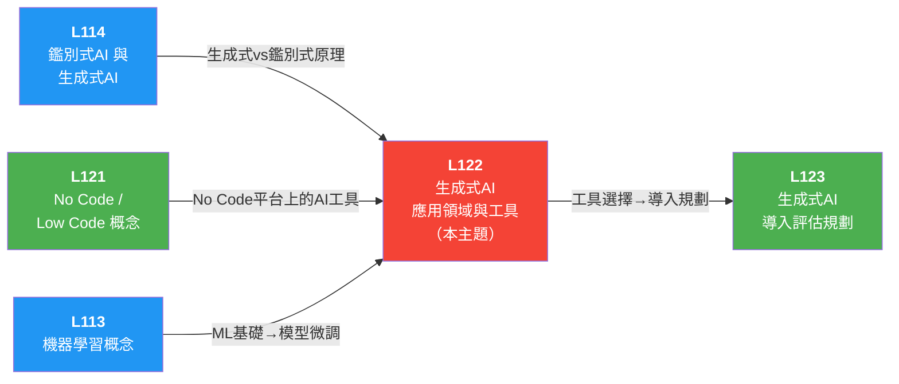

# L122 生成式 AI 應用領域與工具使用 — iPAS AI應用規劃師（初級）學習指南

> 對應評鑑範圍：**L12201 生成式 AI 應用領域與常見工具** ＋ **L12202 如何善用生成式 AI 工具**

---

## 0. 關鍵概念總覽圖

> 先鳥瞰整個 L122 的知識地圖，搞清楚所有專有名詞彼此之間的關係，之後讀細節時就不會迷路。

```
🤖 L122 生成式 AI 應用領域與工具使用
│
├── L12201 生成式 AI 應用領域與常見工具
│   │
│   ├── 📖 生成式 AI 基本概念
│   │   ├── 定義：透過模型學習能力「生成新內容」，而非僅分析或辨識現有數據
│   │   ├── 核心技術架構
│   │   │   ├── GAN（Generative Adversarial Network，生成對抗網路）── 生成器 vs 判別器對抗訓練
│   │   │   ├── VAE（Variational Autoencoder，變分自編碼器）── 穩定性和機率生成
│   │   │   ├── Diffusion Model（擴散模型）── 圖像生成極高準確性和自然感
│   │   │   └── Transformer + Self-Attention（自注意力機制）── GPT（Generative Pre-trained Transformer，生成式預訓練轉換器）系列核心架構
│   │   ├── 關鍵特點
│   │   │   ├── 強大的上下文理解能力
│   │   │   ├── 遷移學習（Transfer Learning）特性（預訓練 + 微調）
│   │   │   ├── 多模態（Multi-modal）處理支持
│   │   │   └── 透過提示詞（Prompt）進行可控生成
│   │   └── RLHF（Reinforcement Learning from Human Feedback，人類回饋強化學習）── 使生成結果更貼近用戶需求
│   │
│   ├── 🧠 大型語言模型（LLM, Large Language Model）
│   │   ├── 定義：以 GPT 系列為代表的超大參數語言模型
│   │   ├── 模型規模：7B、13B、175B 參數等級
│   │   │   └── 模型越大 Benchmark 可能提升，但幅度取決於訓練數據品質與資源配置
│   │   ├── 代表工具：ChatGPT、Gemini、Claude
│   │   ├── 開源模型（Open-source Model）部署：本地部署可確保敏感資料不外傳，提升資料隱私和自主控制
│   │   └── 評估基準（Benchmark）
│   │       ├── MMLU（Massive Multitask Language Understanding，大規模多任務語言理解）── 多領域多任務語言理解（人文、科學、社會科學）
│   │       ├── GSM8K（Grade School Math 8K，小學數學 8K 題庫）── 數學推理
│   │       └── MMLU 涵蓋多領域，非專門用於數學推理或中文專業知識
│   │
│   ├── 🎨 常見生成式 AI 工具
│   │   ├── 💬 文字生成（Text Generation）
│   │   │   ├── ChatGPT ── 對話、文案、摘要、翻譯
│   │   │   ├── Claude ── 長文分析、安全對話
│   │   │   └── Gemini ── Google 多模態 AI
│   │   ├── 🖼️ 圖像生成（Image Generation）
│   │   │   ├── DALL-E ── 文生圖（Text-to-Image），基於文本描述生成高品質圖像
│   │   │   ├── Midjourney ── 藝術風格圖像
│   │   │   └── Stable Diffusion ── 開源擴散模型
│   │   ├── 💻 程式碼生成（Code Generation）
│   │   │   └── GitHub Copilot ── 由 OpenAI Codex 模型支援
│   │   │       ├── 可即時在開發者編輯程式碼時給出整行或整個函式建議
│   │   │       ├── 可在私有程式碼庫或本地環境中使用（非僅開源專案）
│   │   │       └── 不是用靜態分析技術，而是基於 AI 模型推導
│   │   ├── 🎵 音訊/音樂生成（Audio/Music Generation）
│   │   │   ├── Whisper ── 語音辨識（ASR, Automatic Speech Recognition，自動語音辨識）
│   │   │   ├── TTS（Text-to-Speech，文字轉語音）── 語音合成
│   │   │   ├── MuseNet（OpenAI）── 基於 Transformer 的音樂生成
│   │   │   │   └── 可生成古典到流行各種風格，結合多種樂器
│   │   │   └── AIVA（Artificial Intelligence Virtual Artist，人工智慧虛擬藝術家）── AI 音樂創作平台（交響樂、鋼琴曲）
│   │   ├── 🎬 影片生成（Video Generation）
│   │   │   ├── 文字描述 → 自動生成影片內容
│   │   │   ├── Runway ML ── AI 影片創作工具（場景特效、風格轉換）
│   │   │   └── DeepDream（Google）── 增強圖像/視頻，藝術風格生成
│   │   │   └── 前沿模型：Sora (OpenAI)、Veo (Google)
│   │   └── 🤗 AI 開放平台
│   │       └── Hugging Face ── 開放模型平台，提供各類預訓練模型
│   │           └── 可測試文本生成、圖像生成等不同模型效果
│   │
│   ├── 🗺️ 生成式 AI 應用全景圖（七大類）
│   │   ├── Text ── Marketing content, Sales email, Support chat, General writing, Note taking
│   │   ├── Code ── Code generation, Documentation, Text to SQL（Structured Query Language，結構化查詢語言）, Web app builders
│   │   ├── Image ── Image generation, Consumer/Social, Media/Advertising, Design
│   │   ├── Speech ── Voice Synthesis（語音合成）
│   │   ├── Video ── Video editing / generation
│   │   ├── 3D ── 3D models / scenes
│   │   └── Other ── Gaming, RPA（Robotic Process Automation，機器人流程自動化）, Music, Audio, Biology & Chemistry
│   │
│   ├── 🏭 五大應用領域
│   │   ├── 🎨 ① 藝術與設計/內容創作
│   │   │   │   ├── 數位藝術（Digital Art）與插畫 ── 文本描述 → 精緻圖像
│   │   │   ├── 時尚設計 ── 流行趨勢分析 → 預測潮流
│   │   │   ├── 動畫與影視 ── 劇本撰寫、故事板、動畫場景生成
│   │   │   └── 音樂創作 ── 自動生成背景音樂與旋律
│   │   │   └── 趨勢：AI 作為輔助工具，專注細節與技術性工作
│   │   ├── 🏥 ② 醫療與生物科技
│   │   │   ├── 藥物開發（Drug Discovery）── 生成潛在藥物分子結構，縮短研發週期
│   │   │   ├── 醫學影像分析（Medical Imaging）── 生成合成影像數據，優化模型訓練
│   │   │   │   ├── 超分辨率重建（Super-Resolution）── GAN 將低解析度醫療影像轉為高解析度
│   │   │   ├── 個人化醫療（Personalized Medicine）── 病歷+基因數據 → 個人化治療計畫
│   │   │   └── 醫學教育 ── VR（Virtual Reality，虛擬實境）/AR（Augmented Reality，擴增實境）模擬病例，手術練習
│   │   │   └── 醫療 AI 的主要風險：可能生成與實際影像不符的診斷結論
│   │   ├── 🎓 ③ 教育與培訓
│   │   │   ├── 個人化學習內容 ── 依學習者需求自動生成教材與練習題
│   │   │   ├── 智慧教學助理 ── ChatGPT 即時回應學生問題
│   │   │   ├── 互動式教材 ── 3D 模型、VR 教學資源
│   │   │   └── 語言學習 ── 模擬真實對話情境
│   │   │   └── 教師引導：訂立清晰使用規範，非禁止也非無限制使用
│   │   ├── 🎮 ④ 娛樂與媒體
│   │   │   ├── 遊戲開發 ── 自動生成地圖、角色、劇情支線
│   │   │   ├── 劇本與故事創作 ── 角色對話、初步劇本草案
│   │   │   ├── 虛擬偶像與主播 ── 即時互動與內容生成
│   │   │   └── 音樂與影片 ── 背景音效、影片剪輯、視覺特效
│   │   └── 🏭 ⑤ 產品設計與製造
│   │       ├── 創新產品設計 ── 功能需求 → 設計草圖
│   │       ├── 快速原型（Rapid Prototyping）── 3D 列印 + AI 設計 → 實體樣品
│   │       ├── 模擬與測試（Simulation & Testing）── 自動生成效能模擬報告
│   │       └── 供應鏈管理（Supply Chain Management）── 預測市場需求，自動調整生產配置
│   │
│   └── 📊 市場價值與影響力
│       ├── 市場規模預計 2030 年達數百億美元
│       ├── 就業市場雙面性
│       │   ├── 工作取代 ── 部分重複性/低技能工作被 AI 取代
│       │   └── 新興職務 ── AI 訓練師、提示工程師（Prompt Engineer）
│       ├── 挑戰與風險
│       │   ├── 技術層面 ── 資料安全、模型可靠性、系統穩定性
│       │   ├── 商業層面 ── 投資回報不確定性、法規要求增高
│       │   └── 社會層面 ── 就業變動、數位落差、倫理道德
│       └── 最迫切挑戰 ── 資料隱私與道德規範問題
│
└── L12202 如何善用生成式 AI 工具
    │
    ├── 🎯 Prompt Engineering（提示工程）
    │   ├── Zero-shot Prompting（零樣本提示）── 無範例直接提問
    │   │   └──  可能因缺乏示範而失敗的情境：從表格中擷取特定結構化資訊
    │   ├── Few-shot Prompting（少樣本提示）── 提供 1-2 個範例引導
    │   │   ├── 設計原則：提供對話範例，讓模型依照相同風格回覆
    │   │   └──  僅 1-2 個範例遇到領域偏移時 → 範例過少導致泛化不足
    │   ├── Chain-of-Thought（CoT, 思維鏈）── 引導逐步推理
    │   │   └── 適合：線性推理任務（如客服查詢退款流程）
    │   ├── Tree of Thoughts（ToT, 思維樹）── 多分支探索
    │   │   └── 適合：需同時比較多方案的複雜決策（如跨部門行銷規劃）
    │   ├── Graph Prompting（圖提示）── 處理複雜關係資料
    │   │   ├── 能捕捉非線性結構與上下文關聯
    │   │   └──  圖結構轉換為文字提示時，可能導致部分關聯資訊遺失
    │   ├── Automatic Prompt Engineer（APE, 自動提示工程）
    │   │   └──  超長上下文最大限制：模型記憶容量有限，無法完整保留長篇資訊
    │   └── 角色扮演（Role-playing）── 指定 AI 扮演特定角色回應
    │
    ├── ⚙️ 關鍵參數調整
    │   ├── Temperature（溫度參數）── 控制生成隨機性
    │   │   ├── 低溫度 = 較保守、確定性高（適合事實查詢）
    │   │   ├── 高溫度 = 較創意、多樣性高（適合創意寫作）
    │   │   └──  即使溫度固定為 0.6，品質仍可能波動 → 需配合其他策略
    │   ├── Top-k Sampling（前 k 採樣）── 選擇機率最高的前 k 個選項生成
    │   ├── Top-p / Nucleus Sampling（核採樣）── 累積機率達閾值（如 0.9）的選項中採樣
    │   ├── Max Tokens（最大令牌數）── 控制生成長度上限
    │   └── Control Tokens（控制令牌）/ 風格標籤 ── 在同一模型內動態調整回覆風格
    │       └── 適合需依不同客戶群體調整風格且兼顧即時性的場景
    │
    ├── 🔧 模型客製化技術
    │   ├── Fine-tuning（微調）── 在預訓練模型（Pre-trained Model）上用特定數據進一步訓練
    │   │   ├── 全參數微調（Full Fine-tuning）── 調整所有參數
    │   │   └── PEFT（Parameter-Efficient Fine-Tuning, 參數高效微調）── 只調部分參數，低成本高效
    │   │       └── LoRA（Low-Rank Adaptation, 低秩適應）── 最常見的 PEFT 方法
    │   ├── PETM（Parameter-Efficient Tuning Methods，參數高效調整方法）── 參數高效調整
    │   │   ├── 不複製整個模型，只調整部分關鍵參數
    │   │   └── Prompt Tuning（提示調整）── 最簡單的 PETM，不改變模型內部參數，只調整輸入提示
    │   ├── RAG（Retrieval-Augmented Generation, 檢索增強生成）── 結合外部知識庫檢索 + LLM 生成
    │   │   ├── 減少幻覺（Hallucination），確保資訊即時性
    │   │   ├── 主要用於擴展知識庫內容
    │   │   ├── 結合 Fine-tuning：語氣用 Fine-tune 控制，新文件用 RAG 即時檢索
    │   │   ├── 三階段流程：Retrieval（檢索）→ Augmentation（資料結合）→ Generation（生成）
    │   │   ├── 檢索方法：基於嵌入（Embedding）的向量檢索（Vector Search）
    │   │   ├── 向量資料庫（Vector Database）工具
    │   │   │   ├── FAISS（Facebook AI Similarity Search，Facebook AI 相似度搜尋）── 高效向量檢索，支援 GPU（Graphics Processing Unit，圖形處理器）加速
    │   │   │   ├── Pinecone ── 雲端託管，即時檢索
    │   │   │   ├── Chroma ── 開源，支援多模態
    │   │   │   ├── Milvus ── 開源，支援百萬級向量
    │   │   │   ├── Weaviate ── 開源，語義檢索
    │   │   │   └── ElasticSearch ── 全文檢索 + 向量搜索
    │   │   └── 完整流程：自己的資料(pdf等) → 轉向量 → 向量資料庫 → 相似搜尋 → 相關資訊當上下文 → LLM 輸出
    │   ├── GraphRAG（Microsoft 2024 開源）
    │   │   ├── 結合知識圖譜（Knowledge Graph）與 RAG
    │   │   ├── 流程：Source Documents → Text Chunks → Element Instances → Element Summaries → Graph Communities → Community Answers → Global Answer
    │   │   └── 特點：知識圖譜整合、語義連結、擴展性強
    │   ├── Knowledge Distillation（知識蒸餾）
    │   │   └── 小模型（Student Model）學習大模型（Teacher Model）知識，降低運算成本同時維持品質
    │   ├── Context Engineering（上下文工程）
    │   │   └── 核心目的：優化提示與上下文（非縮短訓練時間或增加參數）
    │   └── Chunking（文本切分）
    │       └── 目的：提高檢索相關性（Retrieval Relevance）與降低長上下文噪音
    │
    ├── 📐 Prompt Design vs Prompt Engineering
    │   ├── Prompt Design ── 根據具體任務創建合適提示，確保正確執行任務（設計層面）
    │   └── Prompt Engineering ── 通過優化提示提升系統性能，反覆測試改進（工程層面）
    │
    ├── 🛡️ 安全與品質控制
    │   ├── AI 幻覺（AI Hallucination）── 生成看似合理但不正確的內容
    │   │   ├── 輸入矛盾資訊時 → 可能生成幻覺或隨機採信其中一方
    │   │   └──  不會自動判斷並只選擇正確資訊
    │   ├── Prompt Injection（提示注入攻擊）
    │   │   ├── 惡意提示（Malicious Prompt）試圖讓系統洩漏內部資訊
    │   │   └── 最佳防範：導入輸入檢測（Input Detection）與回應審核流程
    │   ├── Guardrails（防護機制）
    │   │   ├── 檢查輸入內容避免觸發錯誤或危險需求
    │   │   ├── 過濾與驗證 AI 輸出確保符合安全標準
    │   │   ├── 確保操作建議符合法規與產業安全規範
    │   │   └──  主要目的不是重建並追蹤模型全部推理過程
    │   ├── 內容品質確保 ── 適當標注引用來源（非直接用於學術報告）
    │   └── 版權與合法性 ── 圖像生成需考慮解析度、版權、推論時間
    │
    ├── 🔗 進階架構
    │   ├── MCP（Model Context Protocol, 模型上下文協議）
    │   │   ├── 運作流程：AI Host → MCP Client → MCP Server → 資料查詢 → 結果回傳
    │   │   ├── 著重於動態工具與 API（Application Programming Interface，應用程式介面）呼叫的整合
    │   │   └── RAG 著重擴展知識庫，MCP 著重工具整合（兩者差異）
    │   ├── A2A（Agent-to-Agent, 代理人對代理人協定）
    │   │   └── Client Agent 發起任務，Remote Agent 執行並回傳結果
    │   ├── Multi-agent LLMs（多代理人系統）
    │   │   └──  未清楚定義角色分工 → 多個代理重複做同樣任務，效率低落
    │   ├── Agentic AI（代理式 AI）
    │   │   ├── Solution Graph（解決方案圖譜）搜尋策略：廣度優先（BFS, Breadth-First Search，廣度優先搜尋）、深度優先（DFS, Depth-First Search，深度優先搜尋）、最佳優先等演算法
    │   │   └── 解決方案圖譜作為參考框架，組織決策步驟並支援任務推理
    │   ├── Multi-Vector Retriever（多向量檢索器）
    │   │   └── 支援同時處理多種資訊表示，提升跨文本型態的檢索效果
    │   ├── LangChain ── 開源框架，根據 LLM 打造應用程式
    │   │   ├── 提供工具和抽象化，改善客製化、準確度和關聯性
    │   │   ├── LangChain Agent：驅動決策的實體，可訪問工具集，根據輸入決定調用哪個工具
    │   │   └── Model 三類：LLM（文本→文本）、Chat Model（聊天消息）、Text Embedding Models（文本→嵌入向量）
    │   ├── AutoGen（Microsoft）── 多代理協作框架
    │   │   ├── 創建和管理多個自主代理，協同完成複雜任務
    │   │   ├── 代理可自訂、可對話，支持人類參與
    │   │   └── 可採用 LLM、人力投入和工具組合的各種模式
    │   ├── LangFlow ── 視覺化多代理實作工具
    │   │   ├── 支援多種 LLM 及 API、預設工作流操作簡便
    │   │   ├── 支援中文、無程式碼、可看到執行過程
    │   │   └── 範例：Agent1（行銷策略）→ Agent2（資料收集）→ Agent3（行銷文寫作）
    │   └── ReAct 模型 ── 結合推理（Reason）與行動（Act）的策略
    │       ├── ICLR（International Conference on Learning Representations，國際學習表徵會議）2023 論文提出
    │       └── AI Agent 交替進行推理思考與外部行動，提升任務完成品質
    │
    └── 📝 文本生成任務分類
        ├── Text Generation（文本生成 / 生成式語言建模）── 依上下文持續產生新內容
        │   └── 適合：部落格自動續寫工具
        ├── Seq2Seq（Sequence-to-Sequence, 序列到序列）── 輸入序列 → 產生新的輸出序列
        ├── Masked Language Modeling（遮罩語言模型）── 補齊文字中缺失的詞語或片段
        └── Text Classification（文本分類）── 判斷文本情感、主題或標籤（屬鑑別式）
```

---

## 1. 關鍵術語與定義

### 1-1 四大生成模型（Four Generative Model Architectures）

> 📝 **一句話速記**：GAN 拚逼真、VAE 求穩定、Diffusion 品質最高但慢、Transformer 通吃序列——考試愛考「哪個模型適合哪種任務」。

> ```
> 生成式 AI (Generative AI)  ← 總稱
> ├─ 早期架構
> │   ├─ GAN (生成對抗網路) ← 對抗訓練：生成器 vs 判別器
> │   └─ VAE (變分自編碼器) ← 機率生成：編碼壓縮→解碼重建
> │
> └─ 現代架構
>     ├─ Diffusion Model (擴散模型) ← 加噪→去噪，圖像生成王者
>     └─ Transformer ← 自注意力機制，語言/多模態生成基石
>         └─ GPT 系列（Transformer 的代表應用）
>
> ─── 關鍵對比 ───
> GAN vs VAE：對抗博弈（兩網路競爭） vs 壓縮重建（編碼→潛在空間→解碼）
> Diffusion vs GAN：加噪去噪品質高但慢 vs 對抗速度快但訓練不穩
> Transformer vs 其他三者：通用架構（語言+多模態） vs 偏重圖像生成
> ```
>
> 一句話串起來：GAN/VAE 是第一代生成架構（各有取捨：GAN 逼真但訓練不穩、VAE 穩定但略模糊）；Transformer 革新了序列生成、Diffusion Model 革新了圖像生成，兩者成為當前主流。

**① 總稱**

- **生成式 AI（Generative AI，生成式人工智慧）** — AI（Artificial Intelligence，人工智慧）的核心分支，專注於透過深度學習和大數據集訓練來生成新的內容（文字、圖像、音訊、影片），而非僅僅分析或辨識現有數據。
  > 🗣️ 生成式 AI 就像一位「創作者」，不只能讀懂現有資料，還能自己產出全新的作品。

**② 早期架構**

- **GAN（Generative Adversarial Network，生成對抗網路）** — 由生成器和判別器組成的對抗訓練架構，是生成式 AI 的核心技術之一，擅長生成逼真的圖像和數據。（基本概念見 L111）

  > 🗣️ 像「對決型廚師」：一個負責做菜（生成器），一個負責挑毛病（判別器），兩人互相較勁，菜越做越逼真。但不擅長寫菜單（文字生成）。

- **VAE（Variational Autoencoder，變分自編碼器）** — 提供穩定性和機率生成方法，使生成模型在更廣泛的應用中穩定運行。（基本概念見 L111）
  > 🗣️ 像「穩定型廚師」：不求每道菜驚艷，但出品穩定、可控，還能分析食材成分（潛在空間），適合需要「可控變化」的場景。

**③ 現代架構**

- **Diffusion Model (擴散模型)** — 透過逐步加噪再去噪的過程生成內容，在圖像生成中展現極高的準確性和自然感。代表工具：Stable Diffusion、DALL-E。

  > 🗣️ 像「精雕細琢型廚師」：從一團混亂的食材（噪點）開始，一步步雕琢出精緻料理（去噪），品質最高但上菜最慢。

- **Transformer** — 基於自注意力機制（Self-Attention）的神經網路架構，是 GPT 系列模型的核心，徹底改變了語言生成方式並支持大規模多模態生成。（基本概念見 L111）
  > 🗣️ 像「全能型廚師」：讀完整本食譜（Self-Attention 看全文），能做任何料理（文字、圖像、程式碼），但需要超大廚房和大量食材（大參數 + 大數據）。

**四大生成模型比較表（應用選型視角）**：

L111 講的是「它們是什麼」，這裡講「什麼時候該選哪個」：

┌─────────────────────┬──────────────────────────────────────────┬─────────────────────────────────────────────┬────────────────────────────────────────────────────────┬────────────────────────────────────────────┐
│ 模型 │ 核心原理 │ 最強項 │ 典型應用場景 │ 不適合的場景 │
├─────────────────────┼──────────────────────────────────────────┼─────────────────────────────────────────────┼────────────────────────────────────────────────────────┼────────────────────────────────────────────┤
│ **GAN** │ 生成器 vs 判別器對抗訓練 │ 生成逼真圖像、資料擴增（Data Augmentation） │ 醫療影像合成、人臉生成、藝術風格轉換 │ 文字生成（不擅長序列任務） │
│ **VAE** │ 編碼器壓縮 → 潛在空間取樣 → 解碼器還原 │ 穩定生成 + 可控潛在空間（Latent Space） │ 異常檢測、資料壓縮、藥物分子生成 │ 需要極高逼真度的圖像（不如 GAN/Diffusion） │
│ **Diffusion Model** │ 逐步加噪 → 學習反向去噪 │ 圖像品質最高、細節自然 │ 高品質文生圖（DALL-E、Stable Diffusion）、超分辨率重建 │ 即時生成（推論速度慢，需多步去噪） │
│ **Transformer** │ Self-Attention 捕捉全局依賴 │ 序列理解與生成（文字、程式碼、多模態） │ LLM 對話、程式碼補全、多模態理解 │ 小資料集任務（參數量大，需大量訓練資料） │
└─────────────────────┴──────────────────────────────────────────┴─────────────────────────────────────────────┴────────────────────────────────────────────────────────┴────────────────────────────────────────────┘

> ⚠ **四大生成模型 考試速記**：
>
> - 題目問「生成式 AI 的核心技術」→ 答 GAN（選項常混入決策樹、隨機森林等非生成模型）。
> - 問「圖像生成品質最佳」→ 答 Diffusion Model（非 GAN）。
> - GAN vs VAE：GAN 靠「對抗博弈」（兩個網路互相競爭），VAE 靠「壓縮重建」（編碼→潛在空間→解碼），兩者都偏圖像生成。
> - Transformer 是通用架構（語言+多模態），GAN/VAE/Diffusion 偏重圖像生成——別搞混適用範圍。
> - Diffusion 靠「加噪去噪」品質更高但速度慢，GAN 靠「對抗」速度快但訓練不穩——考試常考兩者取捨。

### 1-1b LLM 核心機制與訓練技術（LLM Core Mechanisms & Training）

> 📝 **一句話速記**：LLM 建立在 Transformer + Self-Attention 之上，透過「預訓練 + RLHF 微調」流程從通用模型變成好用的對話 AI。

> ```
> LLM (大型語言模型)  ← 模型本體
> ├─ 架構基礎
> │   └─ Self-Attention (自注意力機制)  ← Transformer 的核心引擎
> │
> ├─ 訓練流程（由通用→專用）
> │   ├─ 遷移學習 (Transfer Learning)  ← 方法論：預訓練知識→下游任務
> │   └─ RLHF (人類回饋強化學習)  ← 最後一哩：對齊人類偏好
> │
> └─ 能力擴展
>     └─ 多模態 (Multi-modal)  ← 從純文字→文字+圖像+音訊+影片
>
> ─── 關鍵對比 ───
> Self-Attention vs Transformer：「機制」（注意力計算） vs 「架構」（完整模型結構）
> 遷移學習 vs RLHF：知識遷移（預訓練→微調） vs 行為校準（對齊人類偏好）；先遷移、後 RLHF
> 遷移學習 vs Fine-tuning：方法論（大概念） vs 具體手段之一
> LLM vs 多模態：LLM 原本只處理文字，多模態是能力擴展方向
> ```
>
> 一句話串起來：LLM 的底層靠 **Self-Attention** 捕捉長距離語意關係；訓練上先透過**遷移學習**（預訓練+微調）獲得任務能力，再用 **RLHF** 對齊人類偏好；最終向**多模態**擴展，處理多種資料類型。

**① 架構基礎**

- **LLM（Large Language Model，大型語言模型）** — 以 GPT（Generative Pre-trained Transformer，生成式預訓練轉換器）系列為代表的超大參數語言模型，具備強大的語言理解與生成能力。常見模型：ChatGPT、Gemini、Claude。（基本概念見 L111）
  - **應用選型關鍵**：直接使用 LLM ≠ 最佳方案，需根據任務性質選擇「直接 Prompting」、「RAG」或「Fine-tuning」（詳見 1-9 比較表）。
    > 🗣️ 把 LLM 想成一位「百科全書型員工」：什麼都知道一點，但要針對特定崗位才能真正好用。

- **Self-Attention（自注意力機制）** — Transformer 架構的核心機制，讓模型在處理序列中的每個元素時，能動態計算該元素與序列中所有其他元素的關聯程度，從而捕捉長距離依賴關係。GPT 系列模型的語言理解與生成能力即建立在此機制之上。
  > 🗣️ 像讀文章時能同時看到所有段落的關聯，不用逐字逐句慢慢讀，一眼就能抓住重點之間的連結。

**② 訓練流程（由通用到專用）**

- **遷移學習（Transfer Learning）** — 將在大規模資料集上預訓練好的模型知識，遷移應用到特定下游任務的技術。生成式 AI 的典型流程為「預訓練（Pre-training）+ 微調（Fine-tuning）」，大幅降低從零訓練的成本與資料需求。（基本概念見 L111）

  > 🗣️ 學過英文再學法文比從零開始快——已有的知識基礎可以「遷移」到新任務上。

- **RLHF（Reinforcement Learning from Human Feedback，人類回饋強化學習）** — 透過人類回饋來強化學習，使生成結果更貼近用戶需求和期望。
  > 🗣️ 像主管給新人回饋、糾正態度——讓 AI 學會「說人話」而非亂答，是 ChatGPT 之所以好用的關鍵技術。

> 💡 **進階補充：RLHF 的背後功臣（PPO vs GRPO）**
> 為了實現 RLHF，讓模型有效學習人類的回饋，業界主要使用兩種強化學習最佳化演算法：
>
> 1. **PPO（Proximal Policy Optimization，近端策略最佳化）** ── **目前最主流的老大哥**
>    - **機制**：在訓練時，除了需要「被訓練的模型」外，還需要額外訓練一個「獎勵模型（Reward Model，類似老師）」來專門打分數。PPO 的特色是限制模型每次更新的幅度（Proximal），避免模型為了追求高分而「學壞」（例如：瘋狂重複正確答案的關鍵字卻失去語法）。
>    - **特性**：穩定、效果好，但非常消耗運算資源與記憶體（因為要同時載入多個巨大模型）。
>    - **代表應用**：OpenAI 的 ChatGPT (GPT-4)。
> 2. **GRPO（Group Relative Policy Optimization，群體相對策略最佳化）** ── **近期爆紅的省資源新星**
>    - **機制**：不需要額外養一個龐大的「獎勵模型」來打絕對分數。它是讓 AI 對同一個問題一次產出「一群 (Group)」答案，再透過規則（例如數學正誤）或簡單評分，讓這些答案「互相比較 (Relative)」，藉由排序的優劣來進行自我學習。
>    - **特性**：大幅節省記憶體與硬體需求（訓練成本極低），讓平民算力也有機會訓練出頂尖模型。
>    - **代表應用**：DeepSeek 推出的 DeepSeek-R1 模型。

**③ 能力擴展**

- **多模態（Multi-modal）** — 指 AI 模型能同時處理與理解多種資料類型（如文字、圖像、音訊、影片）的能力。代表模型如 GPT-4、Gemini 均支援多模態輸入與輸出，是生成式 AI 的重要發展趨勢。（基本概念見 L111）
  > 🗣️ 從只會讀字的書呆子，進化成能看圖、聽音、看影片的全能感官者。

**LLM 關鍵技術比較表**：

┌────────────────────┬────────────────────────┬────────────────────────────────────┬──────────────────────────────────────┐
│ 技術 │ 角色定位 │ 白話比喻 │ 考試重點 │
├────────────────────┼────────────────────────┼────────────────────────────────────┼──────────────────────────────────────┤
│ **Self-Attention** │ Transformer 的「眼睛」 │ 讀文章時能同時看到所有段落的關聯 │ 是 Transformer 的核心，非 RNN 的核心 │
│ **遷移學習** │ LLM 的「學習策略」 │ 學過英文再學法文比從零開始快 │ 「預訓練 + 微調」是典型流程 │
│ **RLHF** │ LLM 的「禮儀訓練」 │ 讓 AI 學會「說人話」而非亂答 │ ChatGPT 之所以好用的關鍵技術 │
│ **多模態** │ LLM 的「感官擴展」 │ 從只會讀字 → 能看圖、聽音、看影片 │ GPT-4、Gemini 是代表模型 │
└────────────────────┴────────────────────────┴────────────────────────────────────┴──────────────────────────────────────┘

> ⚠ **LLM 核心機制與訓練技術 考試速記**：
>
> - Self-Attention 是「機制」，Transformer 是「架構」——題目問 Transformer 核心是什麼，答 Self-Attention（非 RNN/LSTM）。
> - 遷移學習是方法論（大概念），Fine-tuning 是遷移學習的具體手段之一——別把兩者當同義詞。
> - 流程順序：預訓練 → 微調（Fine-tuning）→ RLHF，先學知識再校準行為。
> - LLM 原本只處理文字，多模態是 LLM 的能力擴展方向（加入圖像、音訊等）——GPT-4、Gemini 是代表。
> - RLHF 是「行為校準」而非「知識學習」——它讓模型輸出符合人類期望，不是教模型新知識。

### 1-1c 資料前處理流水線（Data Preprocessing Pipeline）

> 📝 **一句話速記**：文字進入 LLM 前必經「Tokenization → Vectorization → Embedding」三步轉換，考試常考三者的順序與差異。

> ```
> 資料前處理流水線 (Data Preprocessing Pipeline)
> │
> ├─ ① Tokenization (標記化處理) ← 原始文字→token 序列（斷詞切塊）
> │
> ├─ ② Vectorization (向量化表示) ← token→數值向量（編上座標號碼）
> │
> └─ ③ Embedding (嵌入) ← 數值向量→語意向量空間（語意地圖）
>
> ─── 關鍵對比 ───
> Vectorization vs Embedding：泛稱「轉成數字」 vs 特指「帶語意關係的低維向量」
> Embedding 是一種更高級的 Vectorization
> ```
>
> 一句話串起來：文字先「斷詞」（Tokenization）、再「數值化」（Vectorization）、最後放進「語意地圖」（Embedding），三步缺一不可，順序不能亂。

**① 斷詞**

- **Tokenization (標記化處理)** — 將文本數據拆分為基本單元（詞或子詞）以便模型處理的前處理步驟。LLM 的輸入與輸出都以 token 為單位計算。
  > 🗣️ 像把整篇文章切成一個個小卡片（token），把句子拆成積木塊，方便後續一塊塊處理。

**② 數值化**

- **Vectorization (向量化表示)** — 將文本或其他數據轉換為數值向量形式，使模型能進行數學運算。是 RAG 檢索流程中 Embedding 的基礎。
  > 🗣️ 像把每張小卡片轉成一組數字座標，讓只懂數學的電腦能開始運算。

**③ 語意映射**

- **Embedding（嵌入）** — 將離散的文字、圖像等資料映射為連續的低維數值向量的技術，使語意相近的內容在向量空間中距離也相近。是 RAG 流程中將文件轉為向量以進行相似度檢索的關鍵步驟。
  > 🗣️ 像把數字座標放進一個「語意地圖」，意思相近的詞會被放在附近位置（「國王」和「皇帝」很近，「國王」和「冰箱」很遠）。

**三步驟比較表**：

┌───────────────────┬──────────────────────────┬──────────────────────┬─────────────────────────────────┐
│ 步驟 │ 輸入 → 輸出 │ 白話比喻 │ 與 RAG 的關係 │
├───────────────────┼──────────────────────────┼──────────────────────┼─────────────────────────────────┤
│ **Tokenization** │ 原始文字 → token 序列 │ 把文章切成積木塊 │ LLM 輸入的第一步 │
│ **Vectorization** │ token → 數值向量 │ 把積木塊編上座標號碼 │ 將文件數值化的基礎 │
│ **Embedding** │ 數值向量 → 語意向量空間 │ 把座標放進語意地圖 │ RAG 檢索靠 Embedding 找相似文件 │
└───────────────────┴──────────────────────────┴──────────────────────┴─────────────────────────────────┘

> ⚠ **資料前處理流水線 考試速記**：
>
> - Vectorization 和 Embedding 容易混淆：Vectorization 是泛稱「轉成數字」，Embedding 特指「帶有語意關係的低維向量」——Embedding 是一種更高級的 Vectorization。
> - 三步驟順序固定：Tokenization → Vectorization → Embedding，考試常考順序。
> - Tokenization 是 LLM 輸入的第一步，模型的輸入與輸出都以 token 為單位計算。
> - Embedding 是 RAG 檢索的關鍵：靠 Embedding 計算語意相似度來找相關文件。

### 1-2 文字生成工具與摘要（Text Generation Tools & Summarization）

> 📝 **一句話速記**：ChatGPT/Claude/Gemini 三大文字生成工具各有定位；抽取式摘要從原文「選句」，生成式摘要由 AI「造句」——考試愛考兩者區別。

> ```
> 文字生成工具與摘要（Text Generation Tools & Summarization）
> ├─ 對話式文字生成工具（Conversational AI Tools）
> │   ├─ ChatGPT ← OpenAI，GPT 系列，通用文字任務最廣泛
> │   ├─ Claude ← Anthropic，安全性強，長文分析能力突出
> │   └─ Gemini ← Google，多模態，整合搜尋生態系統
> │
> └─ 文本摘要技術（Summarization Techniques）
>     ├─ 抽取式摘要（Extractive） ← 從原文「選句」，不改原句
>     └─ 生成式摘要（Abstractive） ← 由 AI「造句」，重新組織語意
>
> ─── 關鍵對比 ───
> ChatGPT vs Claude vs Gemini：通用性 vs 安全長文 vs 多模態生態
> 抽取式 vs 生成式摘要：原句擷取 vs 語意重寫
> ```
>
> 一句話串起來：三大工具各有強項（通用／安全／多模態），摘要技術分「選句」和「造句」兩條路線。

**① 對話式文字生成工具（Conversational AI Tools）**

- **ChatGPT** — OpenAI 開發的對話式 AI 工具，基於 GPT 系列模型，擅長對話、文案撰寫、摘要生成與翻譯等文字任務。是目前最廣泛使用的生成式 AI 應用之一。

  > 🗣️ 像一位什麼都能聊的全能秘書——寫信、翻譯、摘要、腦力激盪樣樣來，是大多數人接觸生成式 AI 的第一個工具。

- **Claude** — Anthropic 開發的對話式 AI 工具，強調安全性與長文分析能力，適合需要處理大量文本與注重安全對話的應用場景。

  > 🗣️ 像一位特別謹慎的法律顧問——回答前會再三確認安全性，而且能一次讀完整本合約（長文處理能力強）。

- **Gemini** — Google 開發的多模態 AI 模型，能同時處理文字、圖像、音訊等多種輸入，整合 Google 生態系統的搜尋與知識能力。
  > 🗣️ 像一位會看圖、聽聲音、又能上網查資料的助理——因為背後就是 Google 搜尋引擎在撐腰。

**② 文本摘要技術（Summarization Techniques）**

- **抽取式摘要 (Extractive Summarization)** — 直接從原文本中選取最重要的句子進行摘要，不改變原句。

  > 🗣️ 像用螢光筆在文章上畫重點——把最重要的原句直接挑出來貼在一起，一個字都不改。

- **生成式摘要 (Abstractive Summarization)** — 模型基於理解文本內容，自行生成全新的摘要語句，可能使用原文中沒有的詞彙。
  > 🗣️ 像讀完整篇報告後用自己的話重新說一遍——可能出現原文沒有的詞，但意思更精煉。

> ⚠ **文字生成工具與摘要 考試速記**：
>
> - ChatGPT 強調**通用性與廣泛應用**，Claude 強調**安全性與長文分析**，Gemini 強調**多模態與 Google 生態整合**——三者定位不同，不要搞混。
> - 抽取式摘要 = 原文**選句**（不改字），生成式摘要 = AI **造句**（可能用新詞彙）——問「哪種摘要可能出現原文沒有的詞」→ 答生成式。
> - 三大工具都是基於 LLM（大型語言模型）的對話式 AI，但 Gemini 額外支援**多模態**輸入（圖像、音訊），這是與 ChatGPT/Claude 最大的區別點。
> - 抽取式摘要**忠於原文但可能不流暢**，生成式摘要**更流暢但可能偏離原意或產生幻覺**——各有優缺點。

### 1-3 圖像生成與處理（Image Generation & Processing）

> 📝 **一句話速記**：超分辨率重建（Super-Resolution）用 GAN 把低解析度醫療影像變清晰，是醫療 AI 代表應用。

> ```
> 圖像生成與處理（Image Generation & Processing）
> ├─ 文生圖工具（Text-to-Image） ← 從文字描述生成圖像
> │   ├─ DALL-E ← 商業級品質，語意理解強
> │   ├─ Midjourney ← 藝術風格突出，美感最佳
> │   └─ Stable Diffusion ← 開源可客製化，社群豐富
> │
> ├─ 風格轉換工具（Style Transfer）
> │   └─ DeepDream ← CNN 特徵可視化，夢幻藝術風格
> │
> ├─ 新一代模型
> │   └─ Nano Banana 2 ← Google 最新圖像生成與編修
> │
> └─ 圖像增強技術（Image Enhancement）
>     └─ 超分辨率重建（Super-Resolution） ← GAN 驅動，低解析度→高解析度
>         └─ 應用：醫療影像（MRI/CT）、衛星圖像
>
> ─── 關鍵對比 ───
> DALL-E vs Midjourney vs Stable Diffusion：語意精準 vs 美感最佳 vs 開源自建
> DeepDream vs 文生圖：風格轉換（現有圖像→夢幻化） vs 從零生成（文字→圖像）
> 超分辨率重建 vs 圖像生成：增強現有圖像 vs 創造全新圖像
> ```
>
> 一句話串起來：前三者（DALL-E/Midjourney/Stable Diffusion）都是 Diffusion Model 驅動的**文生圖**工具，差異在開源性與風格定位；DeepDream 是早期 CNN 技術的**風格轉換**；超分辨率重建則是 GAN 驅動的**圖像增強**，屬於不同任務類型。

**① 文生圖工具（Text-to-Image）**

- **DALL-E** — OpenAI 開發的文生圖（Text-to-Image）模型，能根據文本描述生成高品質圖像，是圖像生成領域的代表性工具。

  > 🗣️ 跟專業插畫師描述「一隻穿太空衣的貓」，他就能畫出來——語意理解最精準。

- **Midjourney** — 專注於藝術風格圖像生成的 AI 工具，透過文字提示詞生成高品質的藝術創作與設計圖像，廣泛應用於設計與創意領域。

  > 🗣️ 跟藝術家說同樣的話，畫出來特別有藝術感、像油畫——美感最強。

- **Stable Diffusion** — 開源的擴散模型（Diffusion Model）圖像生成工具，因開源特性可供使用者自行部署與客製化，社群生態豐富。
  > 🗣️ 開源的畫畫工具包，可以自己改筆刷、換風格、訓練新模型——自由度最高。

**② 風格轉換工具（Style Transfer）**

- **DeepDream** — Google 開發的圖像增強與藝術風格生成工具，透過神經網路的特徵可視化技術，將圖像或影片轉化為夢幻般的藝術風格。
  > 🗣️ 把照片丟進萬花筒，出來的影像像在做夢一樣迷幻——神經網路「看到」的世界。

**③ 新一代模型**

- **Nano Banana 2** — Google 推出的新一代圖像生成與編修模型，代表圖像生成技術的最新進展。屬於近半年 AI 領域新興名詞。
  > 🗣️ Google 最新推出的畫家，能畫也能修圖——代表技術最前沿。

**④ 圖像增強技術（Image Enhancement）**

- **超分辨率重建 (Super-Resolution)** — 利用 GAN 等技術將低解析度影像轉換為高解析度影像，常用於醫療影像（MRI（Magnetic Resonance Imaging，磁振造影）/CT（Computed Tomography，電腦斷層掃描））增強與衛星圖像處理。
  > 🗣️ 把模糊的舊照片「放大增強」變清晰，像 CSI 影集裡「enhance!」的效果——醫療影像和衛星圖的救星。

> 🔍 **圖像生成工具比較表**：
>
> ┌──────────────────────┬──────────────┬─────────────────┬──────────────────────────┬───────────────┬──────────────────────────────────┐
> │ 工具 │ 開發者 │ 核心技術 │ 最強項 │ 開源？ │ 典型使用場景 │
> ├──────────────────────┼──────────────┼─────────────────┼──────────────────────────┼───────────────┼──────────────────────────────────┤
> │ **DALL-E** │ OpenAI │ Diffusion Model │ 文生圖品質高、語意理解強 │ 否（API） │ 商業設計、行銷素材、概念圖生成 │
> │ **Midjourney** │ Midjourney │ Diffusion Model │ 藝術風格突出、美感最佳 │ 否（Discord） │ 藝術創作、設計提案、視覺概念探索 │
> │ **Stable Diffusion** │ Stability AI │ Diffusion Model │ 開源可客製化、社群豐富 │ 是 │ 自建部署、客製化模型、研究用途 │
> │ **DeepDream** │ Google │ CNN 特徵可視化 │ 夢幻藝術風格轉換 │ 是 │ 藝術風格實驗、神經網路可視化教學 │
> │ **超分辨率重建** │ （技術通稱） │ GAN │ 低解析度 → 高解析度 │ — │ 醫療影像增強（MRI/CT）、衛星圖像 │
> └──────────────────────┴──────────────┴─────────────────┴──────────────────────────┴───────────────┴──────────────────────────────────┘

> ⚠ **圖像生成與處理 考試速記**：
>
> - DALL-E、Midjourney、Stable Diffusion 都基於 **Diffusion Model**，但 DeepDream 用的是 **CNN 特徵可視化**（不是 Diffusion）——問核心技術時別搞混。
> - 問「開源圖像生成工具」→ 答 **Stable Diffusion**（DALL-E 和 Midjourney 都不開源）。
> - DeepDream 是**風格轉換**（輸入現有圖像→夢幻化），文生圖是**從零生成**（輸入文字→產出圖像）——任務類型完全不同。
> - 超分辨率重建是**增強現有圖像**（低解析度→高解析度），不是創造全新圖像——和圖像生成是不同任務。
> - DALL-E 強項是**語意理解**（商業用），Midjourney 強項是**美感風格**（藝術用），Stable Diffusion 強項是**開源自建**（客製用）——三者定位互補。

### 1-4 音訊與影片生成工具（Audio & Video Generation Tools）

> 📝 **一句話速記**：MuseNet 用 Transformer 生成多風格音樂，AIVA 專攻交響樂創作，Runway ML 做 AI 影片——記住各工具定位。

> ```
> 音訊與影片生成（Audio & Video Generation）
> ├─ 音樂生成（Music Generation）
> │   ├─ MuseNet ← Transformer 架構，多風格多樂器
> │   └─ AIVA ← 專攻古典／交響樂創作
> │
> ├─ 語音處理（Speech Processing）
> │   ├─ Whisper ← 語音→文字（ASR，語音辨識）
> │   └─ TTS ← 文字→語音（語音合成）
> │
> └─ 影片生成（Video Generation）
>     └─ Runway ML ← AI 影片特效、風格轉換、自動編輯
>
> 【關鍵對比】
>   MuseNet vs AIVA → 多風格通才 vs 古典專家
>   Whisper vs TTS  → 語音→文字 vs 文字→語音（方向相反）
>   Runway ML vs 圖像工具 → 影片（有時間軸） vs 靜態圖片
> ```
>
> 一句話串起來：三大領域各司其職——**音樂生成**靠 MuseNet（通才）和 AIVA（古典專家）；**語音處理**中 Whisper 和 TTS 方向相反（語音⇄文字）；**影片生成**由 Runway ML 代表。

**① 音樂生成（Music Generation）**

- **MuseNet** — OpenAI 開發的基於 Transformer 的音樂生成神經網路，可生成從古典到流行各種風格的音樂，支援多種樂器組合。

  > 🗣️ AI 版的全能樂手——你說要爵士風鋼琴配搖滾吉他，它就即興演奏出來。

- **AIVA（Artificial Intelligence Virtual Artist，人工智慧虛擬藝術家）** — AI 音樂創作平台，可根據用戶輸入自動創作交響樂、鋼琴曲等音樂作品。
  > 🗣️ AI 版的古典作曲家——專門寫交響樂和鋼琴曲，像請了一位虛擬貝多芬。

**② 語音處理（Speech Processing）**

- **Whisper** — OpenAI 開發的自動語音辨識（ASR, Automatic Speech Recognition）模型，能將語音轉換為文字，支援多語言辨識與翻譯，是語音處理領域的代表工具。

  > 🗣️ AI 版的速記員——聽你說話，即時打成文字，還會多國語言。

- **TTS（Text-to-Speech，文字轉語音）** — 將文字內容轉換為自然語音輸出的技術，即語音合成（Voice Synthesis）。廣泛應用於虛擬助理、有聲書、無障礙輔助等場景。
  > 🗣️ AI 版的播音員——把文字稿唸出來，語氣自然像真人在說話。

**③ 影片生成（Video Generation）**

- **Runway ML** — 基於生成式 AI 的影片創作工具，支援場景特效生成、影片風格轉換、自動編輯等功能。

  > 🗣️ AI 版的剪輯師＋特效師——自動幫影片加特效、換風格、做後期。

- **Sora / Veo** — OpenAI 的 Sora 採用 Diffusion Transformer 架構，理解物理規律；Google 的 Veo 強調高畫質與電影級視覺一致性，兩者為文生影片的頂尖模型機制。

> ⚠ **音訊與影片生成工具 考試速記**：
>
> - MuseNet 基於 **Transformer** 架構，是 OpenAI 產品；AIVA **專攻古典／交響樂**，兩者定位不同，勿混淆。
> - Whisper 和 TTS 方向相反：Whisper = 語音→文字（**辨識**），TTS = 文字→語音（**合成**）。
> - Runway ML 處理的是**影片**（有時間軸），不要與 Stable Diffusion、DALL-E 等**靜態圖像**生成工具混淆。
> - Whisper 支援**多語言**辨識與翻譯，這是常考的特色功能。

### 1-5 程式碼生成與開發工具（Code Generation & Development Tools）

> 📝 **一句話速記**：Copilot 是 VS Code 插件做單檔補全，Cursor 是獨立編輯器做跨檔重構——兩者定位必考。

> ```
> 程式碼生成與開發工具（Code Generation & Development Tools）
> ├─ 插件型（Plugin）
> │   └─ GitHub Copilot ← VS Code 插件，單檔行內補全
> │
> └─ 獨立編輯器型（Standalone Editor）
>     └─ Cursor ← 獨立 IDE，跨檔案理解與大規模重構
>
> 【關鍵對比】
>   Copilot vs Cursor → 插件 vs 獨立編輯器
>                     → 單檔補全 vs 跨檔重構
>                     → Codex 驅動 vs 多模型支援
> ```
>
> 一句話串起來：兩者都是 AI 程式碼助手，但 **Copilot** 是嵌入現有編輯器的「副駕駛」，**Cursor** 則是自帶 AI 的「整台車」，理解範圍從單檔擴展到整個專案。

- **GitHub Copilot** — 由 OpenAI 的 Codex 模型提供技術支援的程式碼輔助工具，可即時在開發者編輯程式碼時給出整行或整個函式建議。

  > 🗣️ 像坐在你旁邊的資深工程師，你打幾個字它就猜出你想寫什麼，自動幫你補完整段程式碼。

- **Cursor** — 內建 AI 的獨立編輯器，具備跨檔案理解全域專案架構與大規模重構能力。與 GitHub Copilot（VS Code 插件，專注單一檔案行內補全）定位不同。
  > 🗣️ 像一位懂整個專案的架構師，不只幫你補一行程式碼，還能看懂多個檔案之間的關係，幫你做大規模重構。

> ⚠ **程式碼生成與開發工具 考試速記**：
>
> - Copilot 是 **VS Code 插件**（Plugin），Cursor 是**獨立編輯器**（Standalone IDE），兩者形態不同。
> - Copilot 專注**單一檔案行內補全**，Cursor 強調**跨檔案全域理解與重構**。
> - Copilot 背後技術是 OpenAI 的 **Codex** 模型，這是常考知識點。

### 1-6 AI 平台與服務（AI Platforms & Services）

> 📝 **一句話速記**：Hugging Face 是開放模型平台，AIaaS 讓企業免建基礎設施就能用 AI，API Key 是身份驗證金鑰。

> ```
> AI 平台與服務（AI Platforms & Services）
> ├─ 模型平台（Model Hub）
> │   └─ Hugging Face ← 開放預訓練模型庫，可測試/下載各類模型
> │
> ├─ 服務模式（Service Model）
> │   └─ AIaaS（AI as a Service） ← 雲端提供 AI 能力，免自建基礎設施
> │       └─ API Key ← 存取 AIaaS 的身份驗證金鑰
> │
> └─ 流程自動化（Process Automation）
>     └─ RPA（Robotic Process Automation） ← 軟體機器人執行重複性任務
>         └─ + 生成式 AI → 從「規則執行」升級為「智慧判斷」
>
> 【關鍵對比】
>   Hugging Face vs AIaaS → 模型平台（找模型） vs 服務模式（用 AI 能力）
>   RPA vs AIaaS         → 流程自動化（執行任務） vs AI 服務（提供智慧）
>   API Key              → 不是工具，是存取 AI 服務的「通行證」
> ```
>
> 一句話串起來：**Hugging Face** 是找模型的地方，**AIaaS** 是用 AI 的方式，**API Key** 是進門的鑰匙，**RPA** 則是把 AI 能力落地到重複性業務流程的執行端。

**① 模型平台（Model Hub）**

- **Hugging Face** — 開放 AI 模型平台，提供各類預訓練生成式 AI 模型（文本生成、圖像生成等），使用者可透過 API 或介面測試不同模型效果。
  > 🗣️ AI 界的 App Store——上面有各種現成的 AI 模型可以試用、下載，不用自己從零訓練。

**② 服務模式與存取（Service Model & Access）**

- **AIaaS（AI as a Service / AI 即服務）** — 透過雲端平台提供 AI 模型與工具的存取服務，企業無需自行建置基礎設施即可使用 AI 能力，降低導入門檻與成本。

  > 🗣️ 像叫外賣而不是自己開餐廳——不用買 GPU、不用養工程師，直接透過雲端「叫」AI 來幫忙。

- **API Key（API 金鑰）** — 用於驗證與授權應用程式存取 API 服務的唯一識別碼。使用生成式 AI 服務（如 OpenAI API）時需透過 API Key 進行身份驗證，應妥善保管避免外洩。
  > 🗣️ 像你家大門的鑰匙——沒有它就進不了 AI 服務的門，弄丟了別人就能冒用你的帳號。

**③ 流程自動化（Process Automation）**

- **RPA（Robotic Process Automation / 機器人流程自動化）** — 使用軟體機器人自動執行重複性業務流程的技術，結合生成式 AI 可提升自動化的智慧程度。
  > 🗣️ 像一個不會累的實習生——你教它怎麼填表、怎麼複製貼上，它就 24 小時重複做；加上生成式 AI 後，它還能「看懂」非結構化資料、自己判斷該怎麼處理。

> ⚠ **AI 平台與服務 考試速記**：
>
> - **Hugging Face** 是「模型平台」不是「AI 服務商」——它提供模型讓你下載或測試，不等於 AIaaS。
> - **AIaaS** 的核心價值是「降低門檻」：企業**免自建基礎設施**即可使用 AI，這是最常考的定義重點。
> - **API Key** 必須妥善保管，**外洩 = 帳號被盜用**，這是資安常考點。
> - **RPA** 本身是「規則式自動化」，結合**生成式 AI** 才能處理非結構化資料與智慧判斷——考題常問兩者結合的效益。

### 1-7a 提示工程總論（Prompt Engineering Overview）

> 📝 **一句話速記**：Prompt Engineering = 設計 + 優化 + 測試提示詞的整套方法論；Prompt Design 只是其中「設計」這一步。

> ```
> 提示工程總論
> ├─ Prompt Engineering（提示工程）← 整套方法論：設計＋優化＋測試
> │   ├─ Prompt Design（提示設計）← 「設計」這一步：針對任務寫 prompt
> │   └─ APE（Automatic Prompt Engineer，自動提示工程）← 自動化搜尋最佳 prompt
> │
> ├─ Context Engineering（上下文工程）← 規劃模型「看到什麼、看多少、什麼順序」
> │
> └─ 版本控制（Version Control）← 管理 prompt 迭代歷史與團隊協作
>
> ─── 關鍵對比 ───
> Prompt Design vs Prompt Engineering：Design = 寫一個好 prompt；Engineering = 寫＋測＋迭代整套流程
> Prompt Engineering vs Context Engineering：PE 聚焦「怎麼問」；CE 聚焦「給模型看什麼資料」
> APE vs 人工 Prompt Engineering：APE 自動搜尋最佳 prompt，省人力但受上下文長度限制
> ```
>
> 一句話串起來：**Prompt Design** 負責「寫」，**Prompt Engineering** 加上「測與迭代」，**Context Engineering** 管「模型看到的資料」，**版本控制**追蹤歷次修改，**APE** 則把整條流程自動化。

**① Prompt Engineering 方法論**

- **Prompt Engineering（提示工程）** — 設計和優化輸入提示以引導 AI 模型產生期望輸出的技術。包含 Zero-shot、Few-shot、CoT、ToT、Graph Prompting 等方法。
  > 🗣️ 像寫食譜：不只寫一版，還要反覆試吃、調味、改良，最終出一份「最佳食譜」。
- **Prompt Design（提示設計）** — 根據具體任務創建合適提示的過程，專注於確保模型正確執行特定任務。與 Prompt Engineering 的區別在於：Design 著重「設計」，Engineering 著重「優化與測試」。
  > 🗣️ 如果 Prompt Engineering 是整個廚房管理，Prompt Design 就是「寫菜單」這一步。

**② 上下文與自動化**

- **Context Engineering（上下文工程）** — 系統性設計與管理 AI 模型所需的上下文資料與提示結構，核心目的是提升模型輸出的相關性與準確性。不僅是寫好一個 prompt，而是整體規劃模型「看到什麼資訊、以什麼順序看、看多少」。搭配 Guardrails（防護機制）做好整體防護限制，並可結合 Grounding（事實依據）確保回覆有憑有據。
  > 🗣️ 如果 AI 是一個實習生，Context Engineering 就是幫他準備好「桌上該放什麼參考資料」——放對資料他就答得好，放錯或放太多他反而搞混。
- **版本控制（Version Control）** — 系統性追蹤與管理各版本提示指令的工具，方便團隊協作與回溯最佳版本。提示指令一多，必須導入自動化與版本控制來管理。
  > 🗣️ 像 Google Docs 的「版本紀錄」——每次改 prompt 都留底，隨時可以回到上一版。
- **APE（Automatic Prompt Engineer，自動提示工程）** — 由模型自動生成、測試與優化提示詞的技術，不需人類手動調整即可找到最佳 prompt。最大限制是模型記憶容量有限，無法完整保留超長上下文資訊。
  > 🗣️ 像讓 AI 自己當老師出考題、自己改卷、自己挑最好的題目——全自動但記憶有限。

> ⚠ **提示工程總論 考試速記**：
>
> - Prompt Design ⊂ Prompt Engineering：Design 只是「設計」，Engineering 還包含「優化與測試」。
> - Context Engineering 強調的是「資料管理」而非「提示措辭」——考題常混淆兩者。
> - APE 的最大限制是**模型記憶容量（上下文長度）**，不是算力或資料量。
> - 版本控制是團隊協作的必備工具，考題常考「提示指令一多時該怎麼管理」→ 答案是版本控制。

### 1-7b 提示技巧（Prompting Techniques）

> 📝 **一句話速記**：簡單直問 → Zero-shot；要格式 → Few-shot；要推理 → CoT；要比較 → ToT；要關係 → Graph——五大技巧選型是最高頻考點。

> ```
> Prompt Engineering 技巧（依結構複雜度遞增）
> ├─ 無範例
> │   └─ Zero-shot Prompting（零樣本提示）← 直接提問，最簡單
> │
> ├─ 有範例
> │   └─ Few-shot Prompting（少樣本提示）← 給 1-2 個範例引導格式
> │
> └─ 推理引導（需要模型「思考」）
>     ├─ CoT（Chain-of-Thought，思維鏈）← 線性逐步推理：A → B → C
>     ├─ ToT（Tree of Thoughts，思維樹）← 多分支並行探索：A → {B1, B2, B3} → 比較選最佳
>     └─ Graph Prompting（圖提示）← 網狀關係推理：節點+邊的知識圖譜
>
> ─── 關鍵對比 ───
> Zero-shot vs Few-shot：有無範例——Zero-shot 靠模型自身能力，Few-shot 用範例引導格式
> CoT vs ToT：線性 vs 分支——CoT 單條推理鏈，ToT 多路徑並行再比較
> CoT vs Graph Prompting：因果鏈 vs 關係網——CoT 處理線性因果，Graph 處理多對多關聯
> Few-shot vs CoT：教格式 vs 教推理——Few-shot 教「輸出長什麼樣」，CoT 教「怎麼想」
> ```
>
> 一句話串起來：從簡單到複雜：**Zero-shot**（直接問）→ **Few-shot**（給範例）→ **CoT**（線性推理）→ **ToT**（多路徑比較）→ **Graph**（關係網路）。選型關鍵是任務的「結構複雜度」。

**① 無範例**

- **Zero-shot Prompting（零樣本提示）** — 不提供任何範例，直接向模型提問的提示方式。優點是簡單快速，但在需要特定輸出格式（如從表格擷取結構化資訊）的任務中可能失敗。
  > 🗣️ 直接問路人「郵局在哪？」——不給任何提示，看對方能不能直接答對。

**② 有範例**

- **Few-shot Prompting（少樣本提示）** — 在提示中提供 1-2 個範例引導模型依照相同風格或格式回覆的技巧。設計原則是提供對話範例讓模型模仿，但範例過少時遇到領域偏移（Domain Shift）可能泛化不足。
  > 🗣️ 先示範「台北→Taipei、高雄→Kaohsiung」，再問「台中→？」——用範例教格式。

**③ 推理引導**

- **Chain-of-Thought（CoT, 思維鏈）** — 引導模型逐步推理的提示技巧，適合線性推理任務（如客服查詢退款流程）。透過要求模型「一步一步思考」來提升複雜問題的推理準確度。
  > 🗣️ 叫學生「寫出解題過程」而不是只寫答案——一步一步推，像數學演算。
- **Tree of Thoughts（ToT, 思維樹）** — 讓模型同時探索多條分支推理路徑的提示技巧，適合需要比較多方案的複雜決策場景（如跨部門行銷規劃）。與 CoT 的線性推理不同，ToT 採用樹狀多分支探索。
  > 🗣️ 面對叉路口，同時派三組人分頭探路，回來比較哪條路最好——多方案並行評估。
- **Graph Prompting（圖提示）** — 處理複雜關係資料的提示技巧，能捕捉非線性結構與上下文關聯，比 CoT 更適合有節點關聯的知識圖譜類任務。注意：圖結構轉換為文字提示時，可能導致部分關聯資訊遺失。
  > 🗣️ 畫一張人物關係圖再回答「誰跟誰有關」——處理錯綜複雜的網狀關係。

> ⚠ **提示技巧 考試速記**：
>
> - CoT vs ToT 的情境判斷幾乎每次必考：**線性流程 → CoT，多方案比較 → ToT**。
> - Zero-shot 不給範例（靠模型自身能力），Few-shot 給範例（引導輸出格式）——區分重點是「有無範例」。
> - Few-shot 教的是「格式/風格」，CoT 教的是「推理方式」——目的不同，不可混淆。
> - Graph Prompting 的限制：圖結構轉換為文字提示時，部分關聯資訊可能遺失。
> - 選型口訣：簡單直問 → Zero-shot；要格式 → Few-shot；要推理 → CoT；要比較 → ToT；要關係 → Graph。

### 1-7c 提示設計模式（Prompt Design Patterns）

> 📝 **一句話速記**：角色扮演控制「語氣與視角」，Output Formatting 控制「輸出結構」——兩者常搭配使用。

> ```
> 提示設計模式
> ├─ 角色扮演（Role-playing）← 控制語氣與視角：指定 AI 扮演特定角色
> └─ Output Formatting（輸出格式化）← 控制輸出結構：要求 JSON / XML 等格式
>
> ─── 關鍵對比 ───
> 角色扮演 vs Output Formatting：角色扮演管「用什麼身份說」；Output Formatting 管「用什麼格式輸出」
> 角色扮演 vs Few-shot：角色扮演設定「身份背景」，Few-shot 提供「範例模板」——一個管角色，一個管格式
> ```
>
> 一句話串起來：**角色扮演**決定 AI「用誰的口吻說話」，**Output Formatting** 決定「輸出長什麼樣子」，兩者經常搭配使用（例如：扮演醫生 + 用 JSON 輸出診斷結果）。

- **角色扮演（Role-playing）** — 在提示中指定 AI 扮演特定角色（如醫生、律師、教師）來回應問題的技巧，藉由設定角色背景與專業領域，引導模型產出更符合情境的回答。
  > 🗣️ 指定老師扮演某角色（醫生、律師）——設定角色背景後，AI 的回答會更專業、更符合情境。
- **Output Formatting（輸出格式化）** — 在提示中明確要求 AI 以特定結構（如 JSON（JavaScript Object Notation，JavaScript 物件表示法）或 XML（eXtensible Markup Language，可延伸標記語言））產出資料，以利系統後續進行自動化處理與資料庫介接。
  > 🗣️ 跟 AI 說「請用 JSON 格式回答」——就像要求員工把報告填進固定表格，方便系統自動處理。

> ⚠ **提示設計模式 考試速記**：
>
> - 角色扮演的失敗情境：角色設定模糊時 AI 會「跳出角色」——設定要具體（職業 + 背景 + 限制）。
> - Output Formatting 常見格式：JSON 和 XML 是最常考的兩種，JSON 用於 API 介接，XML 用於結構化文件。
> - 角色扮演 + Output Formatting 常搭配使用，考題可能出「如何讓 AI 以醫生身份用 JSON 輸出診斷」這類組合題。

> 🗣️ **Prompt 技巧「該用哪招」速查表（實戰選型）**：
>
> L111 介紹了 Prompt 的基本概念（基本概念見 L111），這裡聚焦「拿到一個任務，該用哪種 Prompt 技巧」：
>
> ┌─────────────────────────┬──────────────────────────────────────────┬──────────────────────────────────────────────┬──────────────────────────────────────────────────┬──────────┐
> │ 技巧 │ 白話比喻 │ 最適合的任務 │ 會失敗的情境 │ 難度 │
> ├─────────────────────────┼──────────────────────────────────────────┼──────────────────────────────────────────────┼──────────────────────────────────────────────────┼──────────┤
> │ **Zero-shot** │ 直接問老師，不給任何參考 │ 簡單問答、翻譯、開放式寫作 │ 需要特定輸出格式（如表格擷取） │ ★ │
> │ **Few-shot** │ 先給老師看 1-2 份範本，請他照做 │ 風格模仿、格式統一、分類標註 │ 領域偏移（Domain Shift）——範本跟實際任務差太遠 │ ★★ │
> │ **CoT（思維鏈）** │ 叫老師「一步一步寫出解題過程」 │ 線性推理：數學、邏輯、流程查詢（如退款流程） │ 需要同時比較多方案的開放決策 │ ★★ │
> │ **ToT（思維樹）** │ 叫老師「列出所有方案，逐一評估再選最佳」 │ 多方案決策：行銷策略、跨部門規劃 │ 簡單直線問題（殺雞用牛刀，浪費 token） │ ★★★ │
> │ **Graph Prompting** │ 把知識畫成關係圖再問 │ 複雜關聯：知識圖譜查詢、多實體關係推理 │ 圖→文字轉換時部分關聯資訊會遺失 │ ★★★ │
> │ **Role-playing** │ 指定老師扮演某角色（醫生、律師） │ 專業情境回應、語氣風格控制 │ 角色設定模糊時 AI 會跳出角色 │ ★ │
> │ **APE（自動提示工程）** │ 讓 AI 自己找最佳提問方式 │ 大規模 Prompt 優化、A/B 測試 │ 超長上下文（模型記憶容量有限） │ ★★★★ │
> └─────────────────────────┴──────────────────────────────────────────┴──────────────────────────────────────────────┴──────────────────────────────────────────────────┴──────────┘
>
> **選擇口訣**：簡單直問 → Zero-shot；要格式 → Few-shot；要推理 → CoT；要比較 → ToT；要關係 → Graph；要角色 → Role-playing。

### 1-8 生成參數調整（Generation Parameter Tuning）

> 📝 **一句話速記**：Temperature 控制創意度（低=保守、高=創意），Top-k/Top-p 控制多樣性——參數意義必背。

> ```
> 生成參數調整（Generation Parameter Tuning）
> │
> ├─ ① 隨機性控制
> │   └─ Temperature（溫度參數）← 控制整體「冒險程度」
> │
> ├─ ② 候選範圍控制
> │   ├─ Top-k Sampling ← 只看機率前 k 名
> │   └─ Top-p / Nucleus Sampling（核採樣）← 累積機率達閾值就停
> │
> ├─ ③ 長度控制
> │   └─ Max Tokens（最大令牌數）← 限制生成長度上限
> │
> └─ ④ 風格控制
>     └─ Control Tokens（控制令牌）← 用特殊標記切換語氣風格
>
> 【關鍵對比】
>   Temperature → 控制「多大膽」（機率分佈的平滑程度）
>   Top-k / Top-p → 控制「從多少候選裡挑」（候選集大小）
>   兩者角度不同，常搭配使用
> ```
>
> 一句話串起來：Temperature 決定 AI 多大膽，Top-k/Top-p 決定候選範圍多大，Max Tokens 限制回覆長度，Control Tokens 切換語氣風格——四個旋鈕各管一件事。

**① 隨機性控制**

- **Temperature (溫度參數)** — 控制生成內容隨機性的參數。低溫度值生成較保守確定的內容，高溫度值生成更具創意的內容。
  > 🗣️ 像「冒險程度旋鈕」：轉低（如 0.2）→ AI 很保守，幾乎只挑最高分的字；轉高（如 1.0）→ AI 很大膽，低分的字也有機會被選到。低溫 = 精確穩定；高溫 = 創意多變。

**② 候選範圍控制**

- **Top-k Sampling** — 選擇生成機率最高的前 k 個選項來生成內容，保證品質與多樣性。

  > 🗣️ 像「只看前 k 名」：設 k=5 就是只從機率最高的前 5 個字裡面挑，其他全部淘汰。k 越小越保守，k 越大越多樣。

- **Top-p / Nucleus Sampling (核採樣)** — 選擇累積機率達到某一閾值（如 0.9）的選項進行採樣，更靈活地平衡內容品質與隨機性。
  > 🗣️ 像「湊滿 90 分就停」：從最高分開始往下加，累積機率到 90%（p=0.9）就停，只從這些字裡挑。熱門情境候選少、冷門情境候選多，自動調節——比 Top-k 更靈活。

> 🔍 **生成參數比較**：
>
> ┌─────────────────┬──────────────────────────────────┬───────────────────────────────────┐
> │ 參數 │ 控制什麼 │ 效果 │
> ├─────────────────┼──────────────────────────────────┼───────────────────────────────────┤
> │ **Temperature** │ 機率分佈的平滑程度（「多大膽」） │ 低溫 = 精確穩定；高溫 = 創意多變 │
> │ **Top-k** │ 只保留前 k 個最高機率候選 │ k 越小越保守，k 越大越多樣 │
> │ **Top-p** │ 累積機率達閾值就停止擴充候選集 │ 比 Top-k 更靈活，能自適應候選數量 │
> └─────────────────┴──────────────────────────────────┴───────────────────────────────────┘

**③ 長度控制**

- **Max Tokens（最大令牌數）** — 控制模型單次生成內容長度上限的參數。設定越大允許生成越長的回覆，但也會消耗更多運算資源與 API 費用。
  > 🗣️ 像作文考試的「字數上限」——設太小回覆會被截斷，設太大會燒更多錢。

**④ 風格控制**

- **Control Tokens（控制令牌）/ 風格標籤** — 在同一模型內透過特殊標記動態調整回覆風格的機制，無需針對不同風格分別微調多個模型。適合需依不同客戶群體即時調整語氣風格的場景。

  > 🗣️ 像演員換戲服——同一個演員（模型）不用重新培訓，只要換上不同標籤就能切換正式/輕鬆/專業等語氣。

- **Economics Tokens (代幣經濟學)** — 在 API 計費模式下，模型輸入（Prompt Tokens）與輸出（Completion Tokens）會消耗特定額度的成本。企業開發時必須將「Token 經濟」納入考量，例如透過 Prompt 精簡化或分層檢索，在「上下文資訊量」與「運算成本」之間取得最佳 ROI。

> ⚠ **生成參數調整 考試速記**：
>
> - Temperature 控制「多大膽」，Top-k/Top-p 控制「從多少個候選裡挑」——兩者角度不同，常搭配使用。
> - Top-p 比 Top-k 更靈活：Top-k 固定候選數量，Top-p 會依情境自動調整候選數量。
> - Max Tokens 只控制長度上限，不影響內容品質或創意度——別跟 Temperature 搞混。
> - Control Tokens 是「不用微調就能切換風格」的輕量方案，跟 Fine-tuning 的目的不同。

### 1-9 模型客製化與微調（Model Customization & Fine-tuning）

> 📝 **一句話速記**：Fine-tuning 改語氣風格、RAG 擴充知識、LoRA 低成本微調、Knowledge Distillation 壓縮模型——四種技術用途不可混淆。

> ```
> 模型客製化技術（Model Customization）
> │
> ├─ ① Fine-tuning 系列 ← 改模型參數來適應任務
> │   ├─ 全參數微調（Full Fine-tuning）← 改全部參數，效果最佳但成本最高
> │   └─ 參數高效微調（PEFT）← 只改少部分參數，成本大幅降低
> │       ├─ LoRA（Low-Rank Adaptation，低秩適應）← PEFT 最具代表性方法
> │       └─ PETM ← 更廣義的高效調整方法
> │           └─ Prompt Tuning ← 最極端：完全不改模型，只調輸入提示
> │
> └─ ② Knowledge Distillation（知識蒸餾）← 不改模型，而是「換一個小模型」
>     └─ 大模型（教師）→ 小模型（學生）
>
> 【關鍵對比】
>   Fine-tuning 系列 → 改現有模型的參數（全部→少量→只改輸入）
>   Knowledge Distillation → 用大模型訓練一個全新的小模型
>   兩條完全不同的路線：適應任務 vs 壓縮部署
> ```
>
> 一句話串起來：Fine-tuning 系列是「改現有模型的參數」（從改全部到改少量到只改輸入），Knowledge Distillation 是「用大模型訓練一個全新的小模型」——兩條完全不同的路線。

**① Fine-tuning 系列**

- **Fine-tuning (微調)** — 在預訓練模型基礎上，使用特定領域數據進一步訓練，使模型適應特定任務。

  > 🗣️ 像請一個通才去念專業課程（如法律、醫學），整個人重新訓練一遍。

- **全參數微調（Full Fine-tuning）** — 對預訓練模型的所有參數進行調整的微調方式，效果最佳但計算成本最高，需要大量 GPU 資源與訓練數據。

  > 🗣️ 像把通才送去讀四年大學——效果最好但最花時間和錢。

- **PEFT（Parameter-Efficient Fine-Tuning，參數高效微調）** — 只調整模型中少部分參數即可達到接近全參數微調效果的技術統稱，大幅降低微調的計算成本與記憶體需求。LoRA 是其中最具代表性的方法。

  > 🗣️ 像只上幾堂專業短期班就能上手——不用念完整個學位，省時省錢效果卻不差。

- **LoRA (Low-Rank Adaptation，低秩適應)** — 最常見的 PEFT 方法，透過在模型中插入低秩矩陣來只調整少量參數，即可達到接近全參數微調的效果，大幅降低成本。

  > 🗣️ 像只幫通才戴上一副「專業眼鏡」——模型本身不動，只加一小組可調參數，效果接近全部重訓。

- **PETM (Parameter-efficient Tuning Methods)** — 參數高效調整方法，不複製整個模型，只調整部分關鍵參數即可適應新任務。Prompt Tuning 是其中最簡單的形式，不改變模型內部參數，只調整輸入提示。
  > 🗣️ 像不改人、只改考卷——模型完全不動，只調整輸入提示的方式就能引導出不同表現。

**② Knowledge Distillation**

- **Knowledge Distillation (知識蒸餾)** — 讓小型模型學習大型模型的知識，在降低運算成本的同時維持檢索與生成品質。
  > 🗣️ 像資深教授把畢生功力濃縮教給徒弟——大模型（教師）教小模型（學生），小模型體積小但學到精華。

> 🔍 **直接用 LLM vs RAG vs Fine-tuning：何時該用哪種方法**：
>
> L111 分別介紹了 LLM 和 RAG 的定義（基本概念見 L111），這裡聚焦「實際專案中該怎麼選」：
>
> ┌────────────────┬────────────────────────────────┬───────────────────────────────────────────────┬──────────────────────────────────────────┐
> │ 比較項目 │ 直接 Prompting（原生 LLM） │ RAG（檢索增強生成） │ Fine-tuning（微調） │
> ├────────────────┼────────────────────────────────┼───────────────────────────────────────────────┼──────────────────────────────────────────┤
> │ **白話比喻** │ 直接問一個博學的通才 │ 讓通才先查資料再回答（開卷考試） │ 送通才去上專業課程，變成某領域專家 │
> │ **改了什麼** │ 什麼都沒改，只靠 Prompt 引導 │ 模型不動，外接知識庫 │ 調整模型內部參數 │
> │ **適合場景** │ 通用問答、創意寫作、翻譯、摘要 │ 需要即時/最新資訊、企業內部文件問答、法規查詢 │ 需要特定語氣風格、專業術語、行業知識內化 │
> │ **知識即時性** │ ❌ 停留在訓練截止日 │ ✅ 可即時更新知識庫 │ ❌ 需重新微調才能更新 │
> │ **成本** │ 最低（僅 API 呼叫費） │ 中等（需建立向量資料庫 + 維護知識庫） │ 最高（需 GPU 訓練 + 標註資料） │
> │ **幻覺風險** │ 高（無外部驗證） │ 低（有檢索資料佐證） │ 中（學到的知識可能有偏差） │
> │ **部署難度** │ ★ │ ★★★ │ ★★★★ │
> └────────────────┴────────────────────────────────┴───────────────────────────────────────────────┴──────────────────────────────────────────┘
>
> ** 實戰組合技（必考）**：企業最佳實踐通常是**混合使用**——語氣風格用 Fine-tuning 控制，新文件/即時資訊用 RAG 檢索，日常簡單任務直接 Prompting。
>
> ┌─────────────────────────────────────────┬─────────────────────────────────────┬────────────────────────────────────────────┐
> │ 企業需求 │ 最佳方案 │ 原因 │
> ├─────────────────────────────────────────┼─────────────────────────────────────┼────────────────────────────────────────────┤
> │ 客服機器人要用公司語氣 + 查最新產品資訊 │ Fine-tuning + RAG │ 語氣靠 Fine-tune，產品資料靠 RAG 即時檢索 │
> │ 內部員工查公司規章制度 │ RAG │ 規章會更新，RAG 可即時反映最新版本 │
> │ 行銷團隊寫社群貼文 │ 直接 Prompting（+ Few-shot） │ 通用創意任務，不需專業知識庫 │
> │ 法律團隊審合約用語 │ Fine-tuning + RAG │ 法律用語靠 Fine-tune 內化，判例靠 RAG 檢索 │
> │ 預算極有限的新創公司 │ 直接 Prompting + Prompt Engineering │ 先用好 Prompt 技巧榨乾免費/低成本方案 │
> └─────────────────────────────────────────┴─────────────────────────────────────┴────────────────────────────────────────────┘
>
> ⚠ **考試陷阱**：題目問「如何讓 AI 客服既保持品牌語氣又能回答最新產品問題」→ 答案是「Fine-tuning + RAG」，不是只選其中一個。

> 🔍 **基礎模型（Foundation Model）vs Fine-tuned Model vs RAG 增強模型**：
>
> 基礎模型的概念在 L111 已介紹（基本概念見 L111），這裡從成本與適用場景做實務對比：
>
> ┌────────────────┬─────────────────────────────────────────────┬────────────────────────────────────┬─────────────────────────────────┐
> │ 比較項目 │ 基礎模型（Foundation Model） │ Fine-tuned Model（微調模型） │ RAG 增強模型 │
> ├────────────────┼─────────────────────────────────────────────┼────────────────────────────────────┼─────────────────────────────────┤
> │ **白話比喻** │ 剛畢業的通才大學生 │ 經過在職訓練的專業人員 │ 通才 + 隨身帶百科全書 │
> │ **知識範圍** │ 廣但不深（通用知識） │ 深但窄（特定領域精通） │ 廣 + 可動態擴充 │
> │ **初始成本** │ 免費或 API 按量計費 │ 高（需 GPU + 標註資料 + 訓練時間） │ 中等（需向量資料庫 + 文件處理） │
> │ **維護成本** │ 低 │ 高（知識更新需重新微調） │ 中（更新知識庫即可） │
> │ **回應一致性** │ 中等 │ 高（語氣風格穩定） │ 中等（依檢索結果品質而定） │
> │ **適合階段** │ PoC（Proof of Concept，概念驗證）/ 早期探索 │ 產品化 / 品牌語氣要求高 │ 知識密集 / 資訊需即時更新 │
> └────────────────┴─────────────────────────────────────────────┴────────────────────────────────────┴─────────────────────────────────┘
>
> **選擇記法**：預算少先用基礎模型 → 需要深度就 Fine-tune → 需要廣度和即時性就加 RAG。

> ⚠ **模型客製化與微調 考試速記**：
>
> - 全參數微調改「所有」參數（貴但效果最好），PEFT/LoRA 只改「少部分」參數（便宜且效果接近）——考試常考兩者差異。
> - LoRA 仍會改模型內部（插入低秩矩陣），Prompt Tuning 完全不動模型（只調輸入提示）——別搞混。
> - Fine-tuning 是「改造現有模型」，Knowledge Distillation 是「用大模型教出一個新的小模型」——目的不同（適應任務 vs 壓縮部署）。
> - 選擇記法：想改語氣風格 → Fine-tuning；預算有限 → LoRA；完全不想動模型 → Prompt Tuning；想要輕量部署 → Knowledge Distillation。
> - PEFT vs PETM 幾乎同義（都指參數高效方法），PEFT 更常見；PETM 特別強調包含 Prompt Tuning。

### 1-10 檢索增強生成與向量資料庫（RAG & Vector Databases）

> 📝 **一句話速記**：RAG 三階段（檢索→增強→生成）流程與六大向量資料庫特色是重點中的重點。

> ```
> RAG 技術生態系
> │
> ├─ ① RAG 架構（從基礎到進階）
> │   ├─ RAG (檢索增強生成) ← 基礎架構：檢索+生成
> │   └─ GraphRAG ← 進階架構：知識圖譜+RAG，跨文件推理
> │
> ├─ ② 知識表示與組織
> │   ├─ 知識圖譜 (Knowledge Graph) ← 圖結構表示實體關係
> │   └─ Chunking (文本切分) ← 長文件→小片段，提高檢索精準度
> │
> ├─ ③ 檢索技術
> │   ├─ 向量檢索 (Vector Search) ← 核心方法：用 Embedding 算語意相似度
> │   └─ Multi-Vector Retriever ← 進階方法：多向量表示同一文件的不同面向
> │
> ├─ ④ 向量資料庫（儲存與檢索基礎設施）
> │   ├─ FAISS ← Facebook 開發，GPU 加速，最常用
> │   ├─ Pinecone ← 雲端託管，免管基礎設施
> │   ├─ Chroma ← 開源，多模態，適合快速原型
> │   ├─ Milvus ← 開源，億級大規模檢索
> │   ├─ Weaviate ← 開源，內建語義檢索
> │   └─ ElasticSearch ← 混合檢索（全文+向量）
> │
> 關鍵對比
> │
> ├─ RAG vs GraphRAG → 單文件檢索 vs 跨文件推理（知識圖譜）
> ├─ 向量檢索 vs Multi-Vector → 單一向量 vs 多向量多面向
> ├─ Chunking vs 向量檢索 → 前處理（切文件）vs 查詢時（找片段）
> ├─ FAISS vs Pinecone → 開源自建 vs 雲端託管
> └─ ElasticSearch vs 其他 → 混合檢索（關鍵字+向量）vs 純向量檢索
> ```

一句話串起來：RAG 流程先用 **Chunking** 把文件切小段，存入**向量資料庫**，查詢時透過**向量檢索**找出最相關片段，再交給 LLM 生成答案。進階版 **GraphRAG** 額外引入**知識圖譜**做跨文件推理，**Multi-Vector Retriever** 則用多向量提升檢索精準度。

**① RAG 架構**

- **RAG (檢索增強生成 / Retrieval-Augmented Generation)** — 結合外部知識庫檢索與 LLM 生成的技術，可減少幻覺並確保資訊即時性。（基本概念見 L111，本節聚焦 RAG 的技術實作與向量資料庫選型）
  > 🗣️ 開卷考試——先翻課本找答案（檢索），再用自己的話寫出來（生成）。
- **GraphRAG** — Microsoft 於 2024 年 7 月開源的技術，結合知識圖譜（Knowledge Graph）與 RAG。將文件拆分為文本塊後建立元素實例、摘要、圖社群，查詢時透過社群摘要生成全局答案。比傳統 RAG 更擅長處理需要跨文件推理的複雜問題。
  > 🗣️ 不只翻一本課本，還畫出各課本之間的關聯圖，能回答「跨章節」的複雜問題。

**② 知識表示與組織**

- **知識圖譜（Knowledge Graph）** — 以圖結構（節點與邊）組織實體及其關係的知識表示方法，能表達概念間的語義連結。GraphRAG 即結合知識圖譜與 RAG，提升跨文件推理能力。
  > 🗣️ 人物關係圖——誰跟誰是朋友、誰是誰的主管，用圖把關係畫清楚。
- **Chunking (文本切分)** — 將長文件切分為較小片段以提高檢索相關性、降低長上下文噪音的技術。
  > 🗣️ 把整本書拆成一張張小卡片，找答案時翻卡片比翻整本書快。

**③ 檢索技術**

- **向量檢索（Vector Search）** — 基於嵌入（Embedding）技術，透過計算向量間的距離或相似度來找出語意最接近的文件片段的檢索方法。是 RAG 流程中從向量資料庫中提取相關內容的核心步驟。
  > 🗣️ 不靠關鍵字找，而是靠「語意」找——問「蘋果手機」能找到「iPhone」。
- **Multi-Vector Retriever（多向量檢索器）** — 以多個向量表示同一文件或概念的不同語意面向，在檢索時能同時處理多種資訊表示，提升跨文本型態的檢索精準度。是 RAG 進階流程中提高檢索質量的關鍵技術。
  > 🗣️ 同一張卡片做多個索引（標題索引+內容索引+摘要索引），從不同角度都能找到它。

**④ 向量資料庫**

- **FAISS (Facebook AI Similarity Search)** — Facebook 開發的高效向量檢索函式庫，支援 GPU 加速，是 RAG 流程中最常用的向量資料庫之一。
  > 🗣️ 圖書館的電子搜尋系統——速度最快、用的人最多，但要自己架設維護。
- **Pinecone** — 雲端託管的向量資料庫服務，支援即時檢索，無需自行管理基礎設施。
  > 🗣️ 外包的雲端圖書館——不用自己蓋，付費就能用，省心但要花錢。
- **Chroma** — 開源向量資料庫，支援多模態資料（文字、圖像等），適合快速原型開發。
  > 🗣️ 快速搭建的小型圖書室——開源免費，文字圖片都能存，適合先試水溫。
- **Milvus** — 開源向量資料庫，專為百萬級甚至億級向量的大規模檢索場景設計。
  > 🗣️ 國家級圖書館——專門應對億級藏書量的超大規模搜尋。
- **Weaviate** — 開源向量資料庫，內建語義檢索能力，可根據語意而非關鍵字進行搜尋。
  > 🗣️ 懂你意思的圖書管理員——不用說書名，描述內容就能幫你找到書。
- **ElasticSearch** — 兼具全文檢索與向量搜索功能的搜尋引擎，可同時進行關鍵字匹配與語意向量相似度搜尋，適合需要混合檢索策略的 RAG 應用。
  > 🗣️ 瑞士刀型搜尋引擎——關鍵字搜尋和語意搜尋都會，適合兩種都需要的場景。

> 🗣️ **向量資料庫選型速查表**：
>
> ┌───────────────────┬─────────────────────────────────┬────────────┐
> │ 資料庫 │ 一句話定位 │ 開源？ │
> ├───────────────────┼─────────────────────────────────┼────────────┤
> │ **FAISS** │ 最常用、GPU 加速、Facebook 出品 │ 是 │
> │ **Pinecone** │ 雲端託管、免運維、即開即用 │ 否（SaaS） │
> │ **Chroma** │ 開源、多模態、快速原型開發 │ 是 │
> │ **Milvus** │ 開源、億級大規模檢索 │ 是 │
> │ **Weaviate** │ 開源、語義搜尋內建 │ 是 │
> │ **ElasticSearch** │ 混合檢索（關鍵字+向量） │ 是 │
> └───────────────────┴─────────────────────────────────┴────────────┘

> ⚠ **檢索增強生成與向量資料庫 考試速記**：
>
> - RAG vs GraphRAG：RAG 檢索獨立文件片段，GraphRAG 額外建立知識圖譜做**跨文件推理**。題目提到「跨文件」「全局答案」→ 選 GraphRAG。
> - Chunking 是**前處理**（切文件），向量檢索是**查詢時**（找相似片段）——流程順序是先切再找，別搞反。
> - 向量檢索用**單一向量**代表文件，Multi-Vector Retriever 用**多個向量**代表同一文件的不同面向——後者精準度更高但成本也更高。
> - FAISS 是開源函式庫（需自行部署），Pinecone 是雲端服務（免運維）——自建 vs 託管的典型對比。
> - ElasticSearch 的獨特賣點是同時支援**關鍵字+向量**混合檢索，其他向量資料庫多為純向量檢索。

### 1-11 AI 代理人與多代理系統（AI Agents & Multi-Agent Systems）

> 📝 **一句話速記**：MCP 對外接工具、A2A 對內代理溝通——這組對比是必考陷阱，務必分清。

> ```
> AI Agent 生態系
> │
> ├─ ① 核心概念
> │   ├─ AI Agent (AI 代理人) ← 個體：感知→規劃→行動→記憶
> │   ├─ Agentic AI (代理式 AI) ← 自主決策能力，探索 Solution Graph
> │   │   └─ Solution Graph (解決方案圖譜) ← 任務步驟與工具的結構圖
> │   └─ Agent Loop (代理循環) ← 核心運作機制：觀察→推理→行動 反覆循環
> │
> ├─ ② 協作架構
> │   ├─ MAS (多代理人系統) ← 多個 Agent 組隊分工
> │   ├─ Deep Research (深度研究) ← Agent 自主多步驟研究
> │   └─ Cowork (AI 協作) ← 從 chatbot → coworker 的趨勢
> │
> ├─ ③ 通訊協定
> │   ├─ MCP (Model Context Protocol) ← 對外：Agent 連接工具與資料
> │   ├─ A2A (Agent-to-Agent Protocol) ← 對內：Agent 之間溝通
> │   └─ AP2 (Agent-to-Pay) ← 對外：Agent 發起付款交易
> │
> ├─ ④ 開發框架與工具
> │   ├─ LangChain ← 程式碼框架，萬能工具箱
> │   ├─ AutoGen ← 多代理協作框架（Microsoft）
> │   ├─ LangFlow ← 視覺化 No-Code 工具
> │   └─ ReAct ← 推理+行動交替策略
> │
> 關鍵對比
> │
> ├─ MCP vs A2A → 對外接工具 vs 對內 Agent 間溝通
> ├─ MCP vs AP2 → 接工具與資料 vs 專處理付款交易
> ├─ AI Agent vs Agentic AI → 具體系統（四大步驟）vs 能力特質（自主決策）
> ├─ Agent Loop vs ReAct → 通用運作機制 vs 具體策略（強調可解釋性）
> └─ LangChain vs LangFlow → 程式碼框架（Python）vs 視覺化工具（No-Code）
> ```

一句話串起來：**AI Agent** 是個體，透過 **Agent Loop** 持續運作；多個 Agent 組成 **MAS** 協作；溝通靠 **MCP**（接工具）+ **A2A**（Agent 間）+ **AP2**（付款）三大協定；開發時用 **LangChain/AutoGen/LangFlow** 框架搭配 **ReAct** 策略。

**① 核心概念**

- **AI Agent (AI 代理人)** — 能自主感知環境、規劃策略、執行行動並記憶學習的 AI 系統。四大運作步驟：① 感知（Perception）② 規劃（Planning）③ 行動（Action）④ 記憶（Memory）。（基本概念見 L111，本節聚焦 Agent 框架工具與多代理協作架構）
  > 🗣️ 一位全能員工——自己觀察狀況、擬定計畫、動手執行、還會記住經驗。
- **Agentic AI（代理式 AI）** — 具備自主決策能力的 AI 系統，能透過搜尋策略（如廣度優先搜尋 BFS（Breadth-First Search）、深度優先搜尋 DFS（Depth-First Search）、最佳優先等演算法）探索 Solution Graph，自動規劃並執行多步驟任務。
  > 🗣️ 不只聽指令做事，還會自己想辦法解決問題的「自驅型員工」。
- **Solution Graph（解決方案圖譜）** — 描述任務步驟與工具關係的結構圖，作為 Agentic AI 的參考框架，用於組織決策步驟並支援多步推理與任務規劃。
  > 🗣️ 員工桌上的任務流程圖——哪些步驟可以做、該用哪些工具，全畫在圖上。
- **Agent Loop (代理循環)** — AI 代理人的核心運作機制，反覆進行「觀察環境 → 調用工具與推理 → 執行行動」的循環，直到任務完成。是 AI Agent 持續自主運作的基礎流程，而非單次問答。
  > 🗣️ 員工的工作節奏——看一下→想一下→做一下→再看結果，不斷循環直到做完。

**② 協作架構**

- **MAS (Multi-Agent System / 多代理人系統)** — 由多個具備不同專長與職責的 AI 代理人所組成的團隊架構，透過拆解、分工與驗證來完成複雜任務。包含四大角色：任務編排者（大腦）、專業執行者（手腳）、品質驗證者（品管，可減少 45% 錯誤）、記憶管理員（書記官）。
  > 🗣️ 專案小組——有組長分配工作、有組員各司其職、有品管檢查、有人做會議記錄。
- **Deep Research (深度研究)** — 讓 AI 進行多步驟資料收集、分析與報告生成的能力。AI 不再只是單次回答問題，而是像研究員一樣自主搜尋多個來源、整合資訊後產出完整報告。代表市場從單純 chatbot 走向 AI coworker 的趨勢。
  > 🗣️ AI 版的研究助理——不只回答問題，還會自己搜集多方資料寫完整報告。
- **Cowork (AI 協作)** — 強調多步驟工作完成的 AI 協作新形態，AI 已從「陪聊」進化為能獨立完成多步驟複雜任務的真正「工作夥伴」。代表 AI 應用從問答式 chatbot 升級為協作式 coworker。
  > 🗣️ AI 從「客服機器人」升級為「工作夥伴」——能獨立完成多步驟的複雜任務。

**③ 通訊協定**

- **MCP (Model Context Protocol)** — 讓 AI 透過標準化協議連接外部資源與工具。運作流程：AI Host → MCP Client → MCP Server → 資料查詢 → 結果回傳。著重於動態工具與 API 呼叫整合。
  > 🗣️ 萬用轉接頭——讓 AI 能插上各種外部工具（查資料庫、呼叫 API）。
- **A2A (Agent-to-Agent Protocol / 代理人對代理人協定)** — 解決代理人與其他代理人之間溝通的協定，屬於「對內」的溝通（萬能翻譯機）。 與 MCP 區分：MCP 是「對外」接工具與資料，A2A 是「對內」代理人間溝通。
  > 🗣️ Agent 之間的對講機——讓不同 Agent 能互相溝通、協調工作。
- **AP2 (Agent-to-Pay / 代理付款協定)** — 讓 AI 代理安全發起並完成付款交易的協定層。涉及商務與金融場景時，AI 可安全發起並完成跨平台付款。注意：AP2 不是一般的 API 或模型本身，而是代理跨平台付款的「協定」。
  > 🗣️ AI 專用的行動支付——讓 Agent 能安全地幫你付款、完成交易。

**④ 開發框架與工具**

- **LangChain** — 開源框架，用於根據 LLM 打造應用程式。提供工具和抽象化層，改善客製化、準確度和關聯性。其 Agent 可根據輸入決定調用哪個工具。
  > 🗣️ 萬能工具箱——自己組裝 Agent 流程，生態最大、社群資源最多。
- **AutoGen** — Microsoft 推出的多代理協作框架，可創建和管理多個自主代理協同完成複雜任務。代理可自訂、可對話，支持人類參與，可採用 LLM、人力投入和工具組合的各種模式。
  > 🗣️ 多人會議室——多個 Agent 自動討論協作，還能讓人類加入對話。
- **LangFlow** — 視覺化多代理實作工具，支援多種 LLM 及 API，提供無程式碼操作介面，可視化執行過程，支援中文。
  > 🗣️ 拖拉式畫布——用滑鼠就能建 Agent 流程，不會寫程式也能用。
- **ReAct (Reason + Act)** — ICLR 2023 論文提出的 AI Agent 策略，讓模型交替進行推理思考（Reason）與外部行動（Act），使推理過程透明且可驗證。

  > 🗣️ 思考+行動交替——先想再做、做完再想，推理過程可追蹤驗證。

- **OpenAI 2025 Agent Kit / Operator** — 新一代的代理開發套件與官方操作工具。賦予 AI 直接操作瀏覽器、執行跨應用程式複雜任務的能力，象徵 Agent 從「純文字規劃」走向「實體系統執行」。

> 🗣️ **Agent 框架工具速查表**：
>
> ┌──────────────────────────┬───────────────────────────────────────┬───────────────────┬─────────────────────────────────────┬──────────────────────────────────┐
> │ 框架/工具 │ 白話定位 │ 需要寫程式嗎 │ 最適合場景 │ 特色 │
> ├──────────────────────────┼───────────────────────────────────────┼───────────────────┼─────────────────────────────────────┼──────────────────────────────────┤
> │ **LangChain** │ 萬能工具箱——自己組裝 Agent 流程 │ 需要（Python） │ 客製化 RAG、工具調用、複雜 Pipeline │ 生態最大，社群資源最多 │
> │ **AutoGen（Microsoft）** │ 多人會議室——多個 Agent 自動討論協作 │ 需要（Python） │ 多代理協作、人機混合任務 │ 支持人類參與對話、代理可自訂 │
> │ **LangFlow** │ 拖拉式畫布——用滑鼠就能建 Agent 流程 │ 不需要（No-Code） │ 快速原型、非工程師建 Agent │ 視覺化、支援中文、可看到執行過程 │
> │ **ReAct** │ 思考+行動交替——先想再做、做完再想 │ 是策略非工具 │ 需要推理透明度的任務 │ 推理過程可追蹤驗證 │
> └──────────────────────────┴───────────────────────────────────────┴───────────────────┴─────────────────────────────────────┴──────────────────────────────────┘
>
> **選擇口訣**：要全客製 → LangChain；要多 Agent 協作 → AutoGen；不會寫程式 → LangFlow；要推理可解釋 → ReAct 策略。

> ⚠ **AI 代理人與多代理系統 考試速記**：
>
> - MCP vs A2A（必考）：MCP 是「對外」接工具與資料源，A2A 是「對內」Agent 之間溝通——方向不同，別搞混。
> - AI Agent vs Agentic AI：AI Agent 是具體系統（有感知→規劃→行動→記憶四大步驟），Agentic AI 是能力特質（強調自主決策）。
> - Agent Loop vs ReAct：Agent Loop 是通用運作機制（觀察→推理→行動循環），ReAct 是具體策略（推理與行動交替，強調可解釋性）。
> - LangChain vs LangFlow：名字相似但定位完全不同——LangChain 是**程式碼框架**（需寫 Python），LangFlow 是**視覺化工具**（No-Code 拖拉）。
> - MAS vs Cowork：MAS 是技術架構（多 Agent 分工協作），Cowork 是應用趨勢（AI 從聊天→工作夥伴）。

### 1-12 人機協作（Human-AI Collaboration）

> 📝 **一句話速記**：人機協作三階段演進（決策者→教練 HITL→監督者 HOTL）與 XAI 可解釋性是考試熱點。

> ```
> 人機協作（Human-AI Collaboration）
> │
> ├─ ① 人機協作模式（三階段演進）
> │   ├─ 決策者（人類監督）── AI 自主度最低，人主導一切
> │   ├─ HITL (Human-in-the-Loop / 人在回圈內) ── 教練，主動介入
> │   ├─ HOTL (Human-on-the-Loop / 人在回圈上) ── 監督者，被動監控
> │   └─ Human-out-of-the-Loop（人在迴圈外）── 完全自主，人不介入
> │
> └─ ② 可解釋性（Explainability）
>     └─ XAI (Explainable AI / 可解釋人工智慧) ── 讓人看懂 AI 為何這樣決策
>
> ─── 關鍵對比 ───
> HITL vs HOTL：教練（主動參與）vs 監督者（被動監控）
> Guardrails vs XAI：Guardrails 限制行為範圍，XAI 解釋決策理由
> ```
>
> 一句話串起來：人機協作隨系統成熟度演進——人從「親自動手」（決策者）→「帶著做」（HITL）→「看著就好」（HOTL），而 XAI 確保每個階段人都能理解 AI 在做什麼。

**① 人機協作模式（三階段演進）**

- **人機協作三階段演進** — 隨系統成熟度提升，人類角色逐步轉換：「決策者」（人類監督）→「教練」（HITL）→「策略管理者/監督者」（HOTL）。
  > 🗣️ 就像帶新人：一開始什麼都要盯（決策者），慢慢放手讓他做但隨時指導（HITL），最後只看報表確認沒問題就好（HOTL）。
- **HITL (Human-in-the-loop / 人在回圈內)** — 人類扮演「教練」角色，當 AI 遇到信心不足或例外狀況時主動介入處理，並回饋修正 AI 以持續優化模型。
  > 🗣️ 像手排車——每次換檔都要人親自操作，AI 每一步都要等人確認。
- **HOTL (Human-on-the-loop / 人在回圈上)** — AI 具備高度自主性可獨立運作，人類退居幕後擔任監督者，僅在系統發出警報或異常時介入。需設定清晰的監控指標與警報閾值（Threshold）。
  > 🗣️ 像自排車加巡航——車自己開，人只在旁邊監控，有問題才介入。

> 🔍 **HITL vs HOTL vs Human-out-of-the-Loop 比較**：
>
> ┌───────────┬─────────────────────────────────────────────────────────────┬────────────────────────────────────────────────────────────┬─────────────────────────────────────────────┐
> │ 比較項目 │ Human-in-the-Loop（人在迴圈中） │ Human-on-the-Loop（人在迴圈上） │ Human-out-of-the-Loop（人在迴圈外） │
> ├───────────┼─────────────────────────────────────────────────────────────┼────────────────────────────────────────────────────────────┼─────────────────────────────────────────────┤
> │ 白話比喻 │ 像手排車——每次換檔都要人親自操作，AI 每一步都要等人確認。 │ 像自排車加巡航——車自己開，人只在旁邊監控，有問題才介入。 │ 像全自動駕駛——人完全不介入，AI 全權處理。 │
> │ 人的角色 │ 教練：**主動參與**每個決策 │ 監督者：**被動監控**，異常時介入 │ 無：完全信任 AI │
> │ AI 自主度 │ 低 │ 高 │ 完全自主 │
> │ 適合場景 │ 高風險（醫療診斷、法律、貸款） │ 中低風險但量大（內容審核、客服） │ 低風險且成熟（垃圾郵件過濾） │
> │ 效率 │ 較慢（每步人工確認） │ 快（AI 自主跑，人抽查） │ 最快（全自動） │
> └───────────┴─────────────────────────────────────────────────────────────┴────────────────────────────────────────────────────────────┴─────────────────────────────────────────────┘

**② 可解釋性（Explainability）**

- **XAI (Explainable AI / 可解釋人工智慧)** — 打破 AI 的「黑盒子」，讓 AI 決策過程能用人類看得懂的語言解釋。解釋報告必須轉換為一般使用者或客戶都能理解的語言，不能只有工程師看得懂。
  > 🗣️ 像法官判案要寫判決書——不能只說「有罪」，要讓當事人看懂為什麼判有罪。

> ⚠ **人機協作 考試速記**：
>
> - HITL 是「教練」（主動參與），HOTL 是「監督者」（被動監控）——角色關鍵字是最常考的區分點。
> - HOTL ≠ 完全放任！就算 AI 自主運作，也必須配置效能儀表板與異常警報系統。
> - 三階段演進順序：決策者 → 教練（HITL）→ 監督者（HOTL），對應 AI 自主度由低到高。
> - XAI 的解釋對象是「一般使用者」，不是只給工程師看——考試常考「報告要讓誰看得懂」。

### 1-13 安全與風險管理（Security & Risk Management）

> 📝 **一句話速記**：間接提示注入比直接攻擊更危險，資料排毒四道防線順序（淨化→驗證→過濾→消毒）是必背考點。

> ```
> AI 安全與風險管理（Security & Risk Management）
> │
> ├─ ① 風險類型（要防什麼？）
> │   ├─ AI Hallucination（AI 幻覺）← 模型自己編造不實內容
> │   ├─ 偏見（Bias）← 訓練資料中的系統性不公平
> │   ├─ 不實資訊（Misinformation）← 事實層面錯誤
> │   └─ 間接提示注入（Indirect Prompt Injection）← 外部惡意指令攻擊
> │
> ├─ ② 防護機制（用什麼擋？）
> │   ├─ Guardrails（防護機制）← 整體輸入/輸出限制
> │   ├─ Model Armor（模型護甲）← 專防 Prompt Injection
> │   ├─ Grounding（事實依據）← 回覆必須引用外部來源，減少幻覺
> │   └─ 資料排毒四道防線 ← 淨化→驗證→過濾→消毒
> │
> ├─ ③ 架構設計原則（怎麼設計？）
> │   ├─ 多層次防禦（Defense-in-Depth）← 層層設防，不靠單點
> │   ├─ 信任邊界（Trust Boundary）← 區分可信/不可信資料
> │   ├─ 安全沙盒（Security Sandbox）← 隔離不信任的程式碼/資料
> │   └─ 最少權限原則（Least Privilege）← 只給最基本權限
> │
> └─ ④ 驗證手段（怎麼測試？）
>     └─ Red Teaming（紅隊演練）← 模擬攻擊找漏洞
>
> 【關鍵對比】
>   Guardrails → 通用護欄（管整體輸入輸出）
>   Model Armor → 專用盔甲（專防 Prompt Injection）
>   Grounding → 要求引用來源（態度）；RAG → 檢索外部文件（技術手段）
>   偏見 → 系統性不公平（來自資料偏差）
>   不實資訊 → 事實錯誤（來自幻覺或過時資料）
> ```
>
> 一句話串起來：安全管理四步驟——先認清**風險類型**（幻覺、偏見、注入攻擊），再部署**防護機制**（Guardrails + Model Armor + Grounding + 資料排毒），搭配**架構設計原則**（多層防禦 + 信任邊界 + 沙盒 + 最少權限），最後用 **Red Teaming** 驗證防禦效果。

**① 風險類型**

- **AI Hallucination (AI 幻覺)** — 模型生成看似合理但實際不正確或無根據的內容，是生成式 AI 的重要挑戰。

  > 🗣️ AI 版的信口開河——說得頭頭是道但全是瞎編的。

- **偏見 vs 不實資訊 (Bias vs Misinformation)** — 偏見源自訓練資料中的刻板印象，導致系統性不公平；不實資訊源自模型幻覺或資料過時，導致事實層面錯誤。兩者來源與本質完全不同，考生極易混淆。

  > 🗣️ 偏見像「重男輕女」（根深蒂固的系統性偏差），不實資訊像「說冥王星是九大行星」（事實錯誤）——來源與本質完全不同。

  > 🔍 **偏見 vs 不實資訊 比較**：
  >
  > ┌──────────┬──────────────────────────────────────┬──────────────────────────────────────┐
  > │ 比較項目 │ 偏見 (Bias) │ 不實資訊 (Misinformation) │
  > ├──────────┼──────────────────────────────────────┼──────────────────────────────────────┤
  > │ 來源 │ 訓練資料中的刻板印象、樣本不均 │ 模型幻覺、資料過時、知識截止日限制 │
  > │ 本質 │ 系統性不公平（對某群體有利/不利） │ 事實層面錯誤（跟公不公平無關） │
  > │ 例子 │ AI 履歷篩選偏好男性工程師 │ AI 說「台灣首都是台中」 │
  > │ 解法 │ 平衡訓練資料、公平性稽核、去偏演算法 │ RAG 引入即時知識、事實查核、人工審核 │
  > └──────────┴──────────────────────────────────────┴──────────────────────────────────────┘

- **間接提示注入 (Indirect Prompt Injection)** — 駭客將惡意指令藏在外部公開資料（如網頁）中，當 AI 代理人讀取資料時，不自覺地執行了隱藏的惡意行為。比直接攻擊更隱蔽且難以防範。
  > 🗣️ 在公告欄貼一張偽造公文，員工（AI）看到後不疑有他就照做了——比當面下假命令更難防。

**② 防護機制**

- **Guardrails (防護機制)** — 在 AI 系統中設置的安全機制，用於設下整體輸入與輸出的限制，確保 AI 行為符合安全標準與法規。Guardrails 本身不是模型，而是外加的安全防護層。

  > 🗣️ 高速公路的護欄——不讓 AI 的輸入輸出偏離安全車道。

- **Model Armor (模型護甲)** — 保護模型輸入輸出的安全機制與防護層，專門用來防範 Prompt Injection（提示注入）等惡意操控攻擊。注意：Model Armor 本身不是模型，而是保護模型的「盔甲」。

  > 🗣️ 模型穿的防彈衣——專門擋駭客的惡意提示注入攻擊。

- **Grounding (事實依據 / 接地)** — 讓模型回覆時一定要站在明確的外部資料來源或事實證據上，而非僅靠內部訓練知識生成答案。Grounding 可有效減少 AI 幻覺（Hallucination），確保回覆有憑有據。與 RAG 的差異：RAG 著重「檢索外部文件」，Grounding 著重「回覆必須引用來源」。

  > 🗣️ 要求學生寫報告必須附參考文獻——有憑有據才算數。

- **資料排毒四道防線** — 防範間接提示注入的根本做法，依序為：① 資料淨化（Data Purification）② 資料驗證（Data Validation）③ 內容過濾（Content Filtering）④ 輸入消毒（Input Sanitization）。順序為必考重點。

  > 🗣️ 食品加工流程：先洗菜（淨化）→ 檢驗合格（驗證）→ 過濾雜質（過濾）→ 殺菌消毒（消毒）。

  > 🔍 **資料排毒四道防線**：
  >
  > ┌──────┬───────────────────────────────────┬───────────────────────────────────────────────────────────────────────────────────────────────┐
  > │ 順序 │ 防線 │ 白話解釋 │
  > ├──────┼───────────────────────────────────┼───────────────────────────────────────────────────────────────────────────────────────────────┤
  > │ ① │ **資料淨化 (Data Purification)** │ 先把原始資料裡的「毒素」清掉——移除惡意內容、錯誤格式、有害樣本。 │
  > │ ② │ **資料驗證 (Data Validation)** │ 檢查資料是否合規、格式正確、來源可信——像海關驗貨。 │
  > │ ③ │ **內容過濾 (Content Filtering)** │ 對處理後的內容再過一道篩子——擋住敏感、違規、不當的內容。 │
  > │ ④ │ **輸入消毒 (Input Sanitization)** │ 最後一道關卡：把使用者輸入中的惡意指令（如提示注入）neutralize 掉，確保送進模型的都是乾淨的。 │
  > └──────┴───────────────────────────────────┴───────────────────────────────────────────────────────────────────────────────────────────────┘
  >
  > ⚠ **必記口訣**：**淨→驗→濾→消**（先洗乾淨、再檢查、再過濾、最後消毒），順序是考試重點！

**③ 架構設計原則**

- **多層次防禦 (Defense-in-Depth)** — AI 資安不能只靠一道牆，須透過隔離區、信任邊界與安全沙盒層層設防，確保單點被突破不致全面崩潰。

  > 🗣️ 不只鎖大門，還裝監視器、養狗、裝警報器——一道被破還有下一道。

- **信任邊界 (Trust Boundary)** — 系統中區分「可信內部資料」與「需嚴格檢查外部資料」的安全分界線。所有外來資料跨越信任邊界前皆須掃描驗證。

  > 🗣️ 機場安檢線——線外的東西（外部資料）全部要過 X 光機檢查。

- **安全沙盒 (Security Sandbox)** — 被嚴格限制權限、隔離起來的獨立執行環境，專門用來處理不信任的外部程式碼或資料，避免汙染核心系統。

  > 🗣️ 拆彈小組的防爆箱——把可疑物品（不信任的程式碼）放進去隔離處理。

- **最少權限原則 (Least Privilege)** — 系統設計時只賦予每個 AI 代理人完成工作所需的最基本權限，絕不多給，從根本降低被惡意利用的風險。
  > 🗣️ 飯店房卡只能開自己的房間——AI 只拿到完成工作所需的最小權限。

**④ 驗證手段**

- **Red Teaming (紅隊演練)** — 聘請頂尖資安專家扮演駭客，對 AI 系統進行模擬攻擊與壓力測試，以發掘未知的安全漏洞。
  > 🗣️ 請保全公司派人假裝小偷來闖你家，看哪裡有漏洞。

> ⚠ **安全與風險管理 考試速記**：
>
> - Guardrails 管「整體輸入輸出限制」（通用護欄），Model Armor 專防「Prompt Injection 攻擊」（專用盔甲）——兩者範圍不同。
> - Grounding 強調「回覆必須引用來源」（態度），RAG 強調「檢索外部文件」（技術手段）——RAG 是實現 Grounding 的方式之一。
> - 直接注入是使用者自己輸入惡意指令，間接注入是惡意指令藏在外部資料中被 AI 讀取——間接更隱蔽，考試常考。
> - 信任邊界是「檢查站」（決定誰能進來），安全沙盒是「隔離室」（進來後限制行動範圍）——別搞混。
> - Red Teaming 是「事後驗證」（模擬攻擊找漏洞），資料排毒是「事前預防」（清理輸入資料）——一前一後互補。

### 1-14 AI 評測與治理（AI Evaluation & Governance）

> 📝 **一句話速記**：AIEC 五大原則（準確性/可靠性/公平性/隱私/資安）與在地化測驗三面向是 115 年新增必考。

> ```
> AI 評測與治理（AI Evaluation & Governance）
> │
> └─ AIEC（AI 產品與系統評測中心）
>    ├─ 推動委員會（大腦／政策面）
>    ├─ 技術審議小組（手腳／技術面）
>    ├─ 五大評測原則
>    │   ├─ 準確性
>    │   ├─ 可靠性（韌性）
>    │   ├─ 公平性
>    │   ├─ 隱私
>    │   └─ 資安
>    └─ 在地化測驗（Localization）
>        ├─ 在地用語
>        ├─ 文化知識
>        └─ 社會價值
>
> ──── 關鍵對比 ────
> 推動委員會 vs 技術審議小組：政策方向 vs 技術執行
> 五大原則 vs 在地化測驗：通用品質要求 vs 台灣專屬適配
> ```
>
> 一句話串起來：AIEC 是台灣 AI 評測的官方組織，由推動委員會定方向、技術審議小組做執行，依五大原則評品質，再用在地化測驗確認 AI 懂台灣。

**① AIEC 組織與五大原則**

- **AIEC（AI Evaluation Center，AI 產品與系統評測中心）** — 台灣由數位發展部推動的官方 AI 評測組織。內部由「推動委員會（大腦/政策）」與「技術審議小組（手腳/技術）」分工。評測基於五大原則：準確性、可靠性（韌性）、公平性、隱私、資安。
  > 🗣️ AIEC 就像 AI 界的「商品檢驗局」：推動委員會是局長決定要檢查什麼，技術審議小組是檢驗員實際去測。
  >
  > ┌──────────────────┬────────────────┬──────────────────────────────────────────────────────────┐
  > │ 組織 │ 角色比喻 │ 職責 │
  > ├──────────────────┼────────────────┼──────────────────────────────────────────────────────────┤
  > │ **推動委員會** │ 大腦（政策面） │ 制定評測政策方向、決定評測標準與優先順序、統籌跨部會協調 │
  > │ **技術審議小組** │ 手腳（技術面） │ 執行實際技術評測、審查測試方法與結果、提供技術建議 │
  > └──────────────────┴────────────────┴──────────────────────────────────────────────────────────┘
  >
  > **五大評測原則**：
  >
  > ┌────────────────────┬───────────────────────────────────────────┐
  > │ 原則 │ 白話解釋 │
  > ├────────────────────┼───────────────────────────────────────────┤
  > │ **準確性** │ AI 的回答和判斷要正確 │
  > │ **可靠性（韌性）** │ AI 遇到異常狀況不能當機或亂答，要穩定可靠 │
  > │ **公平性** │ AI 不能對特定族群有偏見或歧視 │
  > │ **隱私** │ AI 不能洩漏或濫用個人資料 │
  > │ **資安** │ AI 系統要能抵擋攻擊，不被駭客利用 │
  > └────────────────────┴───────────────────────────────────────────┘

**② 在地化測驗**

- **在地化測驗（Localization）** — AIEC 評測框架中的台灣專屬測試，包含三大面向：
  > 🗣️ 在地化測驗就像「外國人台灣常識測驗」：看 AI 會不會講台灣話、懂不懂台灣事、認不認同台灣價值觀。
  >
  > ┌──────────────┬─────────────────────────────────┬──────────────────────────────────────────────────┐
  > │ 面向 │ 測什麼 │ 例子 │
  > ├──────────────┼─────────────────────────────────┼──────────────────────────────────────────────────┤
  > │ **在地用語** │ AI 是否使用台灣慣用詞彙 │ 要說「優酪乳」而非「酸奶」、「軟體」而非「軟件」 │
  > │ **文化知識** │ AI 是否了解台灣地理、歷史、文化 │ 知道八卦山在彰化、101 在台北 │
  > │ **社會價值** │ AI 是否理解台灣社會制度與價值觀 │ 知道全民健保適用所有人、義務教育制度 │
  > └──────────────┴─────────────────────────────────┴──────────────────────────────────────────────────┘

> ⚠ **AI 評測與治理 考試速記**：
>
> - AIEC 是**數位發展部**推動（不是經濟部、不是 NCC），115 年新增必考。
> - 五大原則口訣：「準、靠、公、隱、安」——考題常拿「效率」「成本」來混淆，這兩個不在五大原則內。
> - 在地化測驗三面向：在地用語、文化知識、社會價值——不包含「翻譯品質」或「語法正確度」。
> - 推動委員會負責「政策方向」，技術審議小組負責「技術執行」——考題常互換角色來混淆。

### 1-15 LLM 評估基準（LLM Benchmarks）

> 📝 **一句話速記**：MMLU 考綜合知識、GSM8K 考小學數學、MATH 考進階數學、C-Eval 考中文能力——四大 Benchmark 用途不可混淆。

> ```
> LLM 評估基準（LLM Benchmarks）
> │
> ├─ 英文 Benchmark
> │   ├─ 綜合知識
> │   │   └─ MMLU（多領域知識廣度）★★★
> │   └─ 數學推理
> │       ├─ GSM8K（小學數學）★★
> │       └─ MATH（進階數學）★★★★
> │
> └─ 中文 Benchmark
>     └─ C-Eval（中文多領域綜合能力）★★★
>
> ──── 關鍵對比 ────
> MMLU vs C-Eval：都是綜合知識，但語言不同（英文 vs 中文）
> GSM8K vs MATH：都考數學，但難度不同（小學 vs 奧賽）
> MMLU vs GSM8K/MATH：MMLU 考知識廣度，不是數學專用
> ```
>
> 一句話串起來：四大 Benchmark 各有專攻——MMLU 測英文綜合知識、GSM8K 和 MATH 分別測基礎與進階數學、C-Eval 是唯一的中文評估基準。

**① 英文綜合知識基準**

- **MMLU（Massive Multitask Language Understanding，大規模多任務語言理解）** — 涵蓋人文、科學、社會科學等多領域的綜合知識理解基準測試，用於評估 LLM 的多領域知識廣度。注意：MMLU 並非專門用於數學推理或中文專業知識。
  > 🗣️ MMLU 像「綜合學測」：國文、英文、數學、自然、社會全都考，測的是 AI 知不知道各科基本知識，但不會特別深入某一科。

**② 數學推理基準**

- **GSM8K（Grade School Math 8K，小學數學 8K 題庫）** — 包含約 8,000 道小學程度數學題的基準測試，用於評估 LLM 的基礎數學推理與邏輯思維能力。

  > 🗣️ GSM8K 像「小學數學期末考」：8,000 題加減乘除和應用題，看 AI 能不能一步步算對答案。

- **MATH** — 比 GSM8K 更高難度的進階數學基準測試，涵蓋代數、幾何、微積分等領域，用於評估 LLM 解決複雜數學問題的能力。
  > 🗣️ MATH 像「數學奧林匹亞初賽」：代數、幾何、微積分都有，比 GSM8K 難很多，測的是 AI 的進階數學推理。

**③ 中文綜合基準**

- **C-Eval** — 專為中文模型設計的多領域綜合能力評估基準，涵蓋中文語言理解、知識推理等面向，用於衡量模型對中文語境的掌握程度。
  > 🗣️ C-Eval 像「中文版學測」：專門考中文世界的知識（歷史、地理、法律等），看 AI 懂不懂中文語境。

> **四大 LLM Benchmark 比較表**：
>
> ┌────────────┬────────────┬──────────────────────────────────┬──────────┬──────┬────────────────────────────────────┐
> │ Benchmark │ 白話定位 │ 評估能力 │ 難度 │ 語言 │ 考試陷阱提醒 │
> ├────────────┼────────────┼──────────────────────────────────┼──────────┼──────┼────────────────────────────────────┤
> │ **MMLU** │ 綜合學測 │ 多領域知識廣度（人文/科學/社會） │ ★★★ │ 英文 │ 不是數學專用、不是中文專用 │
> │ **GSM8K** │ 小學數學考 │ 基礎數學推理與邏輯 │ ★★ │ 英文 │ 只考小學程度，不含進階數學 │
> │ **MATH** │ 數學奧賽 │ 進階數學（代數/幾何/微積分） │ ★★★★ │ 英文 │ 比 GSM8K 難，兩者不可混淆 │
> │ **C-Eval** │ 中文學測 │ 中文語言理解與知識推理 │ ★★★ │ 中文 │ 唯一中文 Benchmark，其餘三個皆英文 │
> └────────────┴────────────┴──────────────────────────────────┴──────────┴──────┴────────────────────────────────────┘

> ⚠ **LLM 評估基準 考試速記**：
>
> - 問「評估 LLM 數學推理能力」→ 答 GSM8K 或 MATH（非 MMLU），MMLU 是綜合知識不是數學專用。
> - 問「評估中文能力」→ 答 C-Eval（非 MMLU），C-Eval 是四大中唯一的中文 Benchmark。
> - 問「最高難度數學」→ 答 MATH（非 GSM8K），GSM8K 只有小學程度。
> - MMLU、GSM8K、MATH 三個都是**英文**基準，只有 C-Eval 是中文。

### 1-16 文本生成任務分類（Text Generation Task Types）

> 📝 **一句話速記**：Text Generation 是「續寫」、Seq2Seq 是「翻譯/轉換」、Masked LM 是「填空」、Text Classification 是「分類（鑑別式）」——四種任務本質不同。

> ```
> 文本生成任務分類（Text Generation Task Types）
> │
> ├─ 生成式任務（Generative）
> │   ├─ Text Generation（文本生成）← 前文 → 續寫（GPT）
> │   ├─ Seq2Seq（序列到序列）← 輸入序列 → 輸出序列（T5/BART）
> │   └─ Masked LM（遮罩語言模型）← 填空預測（BERT 預訓練用）
> │
> └─ 鑑別式任務（Discriminative）
>     └─ Text Classification（文本分類）← 文本 → 類別標籤（BERT + 分類頭）
>
> ──── 關鍵對比 ────
> Text Generation vs Seq2Seq：續寫（單向延伸） vs 轉換（輸入→不同輸出）
> Masked LM vs Text Classification：都用 BERT，但前者是生成式預訓練、後者是鑑別式下游任務
> ```
>
> 一句話串起來：四種文本任務中，Text Generation 續寫、Seq2Seq 轉換、Masked LM 填空都屬於生成式，只有 Text Classification 是鑑別式——考試最愛考這個區別。

**① 生成式任務**

- **Text Generation（文本生成 / 生成式語言建模）** — 依據上下文持續產生新內容的任務，模型根據前文預測並生成下一個詞。適合部落格自動續寫等應用場景。

  > 🗣️ Text Generation 像「接龍作文」：給你開頭一段，你繼續往下寫，永遠是「前文 → 生成下一句」。

- **Seq2Seq（Sequence-to-Sequence，序列到序列）** — 將一個輸入序列轉換為另一個輸出序列的任務，如機器翻譯（中文→英文）、文本摘要等，輸入與輸出長度可不同。

  > 🗣️ Seq2Seq 像「翻譯題」：看完一整段中文，寫出一整段英文，輸入和輸出是「兩個不同的東西」。

- **Masked Language Modeling（遮罩語言模型）** — 將文字中的部分詞語遮蔽後，訓練模型預測被遮蔽詞語的任務，用於預訓練語言模型（如 BERT（Bidirectional Encoder Representations from Transformers，雙向編碼器表示法））以學習上下文理解能力。
  > 🗣️ Masked LM 像「克漏字填空」：文章中間挖空幾個字，你要猜出被蓋住的是什麼字。

**② 鑑別式任務**

- **Text Classification（文本分類）** — 將文本自動歸類為預定義類別（如情感正負、主題標籤）的任務。屬於鑑別式（Discriminative）任務，與生成式任務本質不同。
  > 🗣️ Text Classification 像「選擇題判斷」：讀完一篇文章，判斷它是正面還是負面、屬於哪個類別——不用寫新文字。

> **四種文本任務比較表**：
>
> ┌─────────────────────────┬────────────┬────────────────────────────────────┬────────────────────────┬────────────────────┐
> │ 任務類型 │ 白話比喻 │ 輸入 → 輸出 │ 代表模型/技術 │ 生成式 or 鑑別式？ │
> ├─────────────────────────┼────────────┼────────────────────────────────────┼────────────────────────┼────────────────────┤
> │ **Text Generation** │ 接龍作文 │ 前文 → 續寫下一詞 │ GPT 系列 │ 生成式 │
> │ **Seq2Seq** │ 翻譯題 │ 輸入序列 → 輸出序列（長度可不同） │ T5、BART、機器翻譯模型 │ 生成式 │
> │ **Masked LM** │ 克漏字填空 │ 有遮蔽的文本 → 預測被遮蔽的詞 │ BERT │ 生成式（預訓練用） │
> │ **Text Classification** │ 選擇題判斷 │ 文本 → 類別標籤 │ BERT + 分類頭 │ 鑑別式 │
> └─────────────────────────┴────────────┴────────────────────────────────────┴────────────────────────┴────────────────────┘

> ⚠ **文本生成任務分類 考試速記**：
>
> - Text Classification 是**鑑別式**任務，不是生成式！題目問「以下哪個屬於生成式任務」→ 排除 Text Classification。
> - Masked LM 雖然看起來像「猜答案」，但它是用來**預訓練**語言模型的生成式方法，不要跟 Text Classification 搞混。
> - Text Generation 和 Seq2Seq 的區別：前者是「單向續寫」，後者是「輸入→不同格式的輸出」（如翻譯、摘要）。
> - BERT 同時出現在 Masked LM（預訓練階段）和 Text Classification（下游任務階段），用途完全不同。

### 1-17 開源模型與本地部署（Open-source Models & Local Deployment）

> 📝 **一句話速記**：開源模型本地部署的核心優勢是確保敏感資料不外傳，兼顧隱私與自主控制。

> ```
> 開源模型與本地部署（Open-source Models & Local Deployment）
> │
> └─ 開源模型（Open-source Model）
>     ├─ 代表：LLaMA、Mistral
>     └─ 本地部署優勢
>         ├─ 資料隱私（敏感資料不外傳）
>         └─ 自主控制（不依賴第三方雲端）
>
> ──── 關鍵對比 ────
> 開源本地部署 vs 雲端 API：隱私自主但需自備算力 vs 方便快速但資料外傳
> ```
>
> 一句話串起來：開源模型讓企業把 AI 搬回自己家，敏感資料不用送出去，換來的是隱私保護與完全自主控制。

- **開源模型（Open-source Model）** — 原始碼與模型權重公開供使用者自由下載、部署與修改的 AI 模型。本地部署開源模型可確保敏感資料不外傳至第三方雲端服務，提升資料隱私保護與企業自主控制能力。代表模型如 LLaMA、Mistral 等。
  > 🗣️ 開源模型像「食譜公開的餐廳」：別人把食譜（模型權重）免費給你，你可以在自家廚房（本地伺服器）煮，客人的點餐資料（敏感數據）完全不用交給外送平台（雲端服務）。

> ⚠ **開源模型與本地部署 考試速記**：
>
> - 本地部署的**核心優勢**是「資料隱私」，不是「省錢」——本地部署反而需要自備 GPU 等硬體成本。
> - 開源 ≠ 免費商用：部分開源模型有授權限制（如 LLaMA 的社群授權條款），考題可能混淆「開源」與「完全無限制使用」。
> - 問「企業處理敏感資料時應選擇什麼部署方式」→ 答本地部署開源模型（非雲端 API）。

---

## 2. 考前必記重點

> 考前最後掃一遍這裡，把每一條都確認自己記住了。

**🔑 生成式 AI 核心技術**

1. 四大生成模型：**GAN**（對抗訓練）、**VAE**（穩定機率生成）、**Diffusion**（擴散去噪）、**Transformer**（自注意力機制）
2. GAN 是生成式 AI 的**基礎核心技術**之一（模擬考：決策樹、聚類、隨機森林都不是）
3. **RLHF** = 人類回饋強化學習，讓模型輸出更貼近用戶需求
4. LLM 模型規模越大 → Benchmark 結果**可能**提升，但**幅度取決於訓練數據品質與資源配置**

**🔑 常見工具與功能** 5. **GitHub Copilot** = 由 OpenAI **Codex** 模型支援，可即時給出整行或整個函式建議（非靜態分析、非僅開源專案）6. **DALL-E / Midjourney / Stable Diffusion** = 文生圖（Text-to-Image）工具；**Whisper** = 語音辨識（ASR, Automatic Speech Recognition）7. 圖像生成需考慮三大問題：**解析度、版權合法性、推論時間** 8. 圖像描述生成系統的關鍵：在生成過程中**結合圖片特徵與語言建模**，同時利用影像內容與文字資訊9. **音樂生成工具**：MuseNet（OpenAI，Transformer 架構）、AIVA（AI 音樂創作平台）10. **影片生成工具**：Runway ML（AI 影片創作/風格轉換）、DeepDream（Google，圖像增強/藝術風格）11. **AI 開放平台**：**Hugging Face**（提供各類預訓練模型，可直接測試）、**OpenAI API**（透過 API 使用 GPT/DALL-E）12. **摘要兩大類型**：**抽取式摘要（Extractive Summarization）**（從原文選句）vs **生成式摘要（Abstractive Summarization）**（AI 自行生成新句）

**🔑 Prompt 工程** 13. **Zero-shot** = 無範例直接提問；**Few-shot** = 提供 1-2 個範例引導 14. **CoT（思維鏈）** = 逐步推理，適合線性任務；**ToT（思維樹）** = 多分支探索，適合複雜決策 15. CoT vs ToT 情境判斷：客服查詢退款流程 → **CoT**；跨部門行銷規劃比較多方案 → **ToT** 16. **Graph Prompting（圖提示）** 處理複雜關係資料比 CoT 更有效，因為能**捕捉非線性結構與上下文關聯** 17. Zero-shot 最可能失敗的情境：**從表格擷取結構化資訊**（缺乏格式示範）18. Few-shot（少樣本提示）遇到領域偏移（Domain Shift）的核心挑戰：**範例過少，無法涵蓋新領域多樣性** 19. **APE（Automatic Prompt Engineer, 自動提示工程）** 在超長上下文的最大限制：**模型記憶容量有限**，無法完整保留長篇資訊

**🔑 參數調整** 20. **Temperature** 低 = 保守確定；高 = 創意多樣。即使固定溫度，品質仍可能波動 21. **Control Tokens（控制令牌）/ 風格標籤**：在同一模型內動態調整回覆風格，兼顧即時性與效果 22. 電商風格一致性（不需新增專業知識）→ **降低生成溫度**以減少隨機性並提升一致性

**🔑 模型客製化** 23. **Fine-tuning** 控制語氣風格；**RAG** 即時檢索新文件 → 長期維護最佳策略：語氣用 Fine-tune + 新文件用 RAG 24. **LoRA** = 最常見的 PEFT 方法，低成本高效微調 25. **Knowledge Distillation（知識蒸餾）**：小模型學大模型知識 → 降低運算成本同時維持品質 26. **Chunking（文本切分）**：切分長文件 → 提高檢索相關性並降低長上下文噪音

**🔑 安全與品質** 27. AI 幻覺（AI Hallucination）：輸入矛盾資訊 → 模型可能**生成幻覺或隨機採信其中一方**（不會自動判斷正確性）28. **Prompt Injection** 防範：導入**輸入檢測與回應審核流程** 29. **Guardrails（防護機制）** 三大目的：檢查輸入、過濾輸出、確保合規（不是重建追蹤推理過程）30. 使用 AI 生成內容確保品質：**適當標注引用來源**（非直接用於學術報告、非減少人工審查）31. 醫療 AI 生成式應用的主要風險：**可能生成與實際影像不符的診斷結論**，導致誤判與法律風險

**🔑 進階架構** 32. **MCP** 運作流程：**AI Host → MCP Client → MCP Server → 資料查詢 → 結果回傳 AI Host** 33. MCP vs RAG：**RAG** 擴展知識庫內容；**MCP** 著重動態工具與 API 呼叫整合 34. **A2A**：Client Agent 發起任務 → Remote Agent 執行並回傳結果 35. **Multi-agent LLMs** 未清楚定義角色 → **多個代理重複做同樣任務**，效率低落36. **Agentic AI（代理式 AI）** 搜尋策略：使用廣度優先（BFS）、深度優先（DFS）或最佳優先等**演算法**探索 Solution Graph 37. **Solution Graph（解決方案圖譜）** 作為代理的**參考框架**，組織決策步驟並支援任務推理

**🔑 市場與社會影響** 38. 導入 AI 後最直接影響 = **提升生產力和效率** 39. AI 未來最迫切挑戰 = **資料隱私與道德規範問題** 40. 提升員工 AI 能力的有效方式 = **安排跨部門交流和測試專案**（非單純自學或加薪）41. 改善客戶體驗的技術 = **NLP（Natural Language Processing, 自然語言處理）+ 生成式回應模組** 42. 教師引導 AI 使用 = **訂立清晰使用規範**（非禁止、非無限制、非僅鼓勵用 AI 寫作業）

**🔑 文本任務分類** 43. 部落格自動續寫 = **Text Generation（生成式語言建模）**，依上下文持續產生新內容 44. Seq2Seq（序列到序列）= 輸入序列→輸出序列；Masked LM（遮罩語言模型）= 補齊缺失詞；Text Classification（文本分類）= 分類（鑑別式）

**🔑 人機協作三階段演進** 45. **人類監督** → **HITL（人在回圈內）** → **HOTL（人在回圈上）**：人類角色從「決策者」→「教練」→「策略管理者/監督者」46. HITL = 人類主動介入處理特殊狀況，回饋修正 AI（如老師傅標註瑕疵影像重訓模型）47. HOTL = AI 獨立運作，人類只看儀表板監控，必須設定**警報閾值（Threshold）**與**緊急應變 SOP（Standard Operating Procedure，標準作業程序）** 48. HOTL ≠ 完全放任：就算 AI 自主運作，也必須配置效能儀表板與異常警報系統 49. 安全與倫理必須從「**設計第一天（By Design）**」就納入，絕非事後補救

**🔑 資安防護進階（間接提示注入）** 50. **間接提示注入（Indirect Prompt Injection）**：駭客將惡意指令藏於外部資料（如網頁），AI 讀取時不自覺執行 → 比直接攻擊更隱蔽 51. 防禦四大原則：**隔離與邊界**（安全沙盒）+ **驗證輸入**（信任邊界） + **監控異常行為** + **最小化權限** 52. 資料排毒四道防線順序：**資料淨化（Data Purification）→ 資料驗證（Data Validation）→ 內容過濾（Content Filtering）→ 輸入消毒（Input Sanitization）**（Input Sanitization 最深層）53. **Red Teaming（紅隊演練）**：主動聘請資安專家模擬駭客攻擊，發掘系統未知漏洞 54. 偏見 vs 不實資訊：**偏見（Bias）**= 訓練資料帶有刻板印象 → 系統性不公平；**不實資訊（Misinformation）**= 模型幻覺/資料過時 → 事實錯誤

**🔑 開發工具選型（115 年考綱新增）** 55. **GitHub Copilot** = VS Code **插件**，專注**單一檔案**行內補全（超級實習生）56. **Cursor** = **獨立編輯器**，能理解整個專案藍圖，適合**跨檔案**大規模重構（資深架構師）57. **Midjourney** = 圖像生成工具，產出不如預期時應**優化提示詞**，不要更換工具 58. Copilot 是插件（需安裝）、Cursor 是獨立編輯器（不需安裝進其他 IDE（Integrated Development Environment，整合開發環境））

**🔑 多代理人系統（MAS）** 59. MAS = 放棄「單一萬能 AI」→ 建立多個各司其職的 AI 代理人組成團隊（拆解→分工→驗證）60. MAS 四大角色：**任務編排者**（大腦）、**專業執行者**（手腳）、**品質驗證者**（品管，減少 45% 錯誤）、**記憶管理員**（書記官）61. **MCP 對外**（連接外部工具/資料的萬能插座）vs **A2A 對內**（代理人間溝通的萬能翻譯機）→ 必考陷阱 62. AI Agent（AI 代理人）運作四步驟：**感知（Perception）→ 規劃（Planning）→ 行動（Action）→ 記憶（Memory）** 63. **最少權限原則（Least Privilege）**：只賦予每個代理人完成工作所需的最基本權限，絕不多給 64. 歐盟 AI 法案對高風險系統三大不可妥協規則：**風險評級 + 人類監督 + 確保透明度** 65. 每個高風險 AI 系統必須內建**一鍵緊急暫停開關** 66. 必須**監控 AI 代理人的思考過程**（思維鏈監控），確保目標與人類一致

**🔑 AIEC 可信賴 AI 評測（115 年考綱新增）** 67. **AIEC** = 數位發展部推動的「AI 產品與系統評測中心」，負責監督可信賴 AI 評測 68. AIEC 組織分工：**推動委員會（大腦/政策方向）** vs **技術審議小組（手腳/技術細節與工具審查）**→ 勿混淆 69. AI 評測**五大核心原則**：**準確性**（答案正確）、**可靠性**（遇突發不當機）、**公平性**（無偏見歧視）、**隱私**（護個資）、**資安**（防駭客）70. 準確性 vs 可靠性：答案對不對 =「準確性」；遇到突發狀況不會當機 =「可靠性」→ 考生常混淆 71. 隱私 vs 資安：保護個人對話與敏感資料不外洩 =「隱私」；防禦外部駭客與內部不當操作 =「資安」72. **在地化測驗**三大面向：在地用語、文化知識、社會價值 → 確保 AI「懂台灣」

**🔑 提示工程進階** 73. **偏見（Bias）** vs **不實資訊（Misinformation）**：偏見 = 訓練資料有刻板印象 → 系統性不公平；不實資訊 = 幻覺/資料過時 → 事實錯誤。兩者來源與本質不同 74. AI 升級三部曲：① **CoT（思維鏈）**（推升邏輯）→ ② **輸出格式化（Output Formatting）**（結構化）→ ③ **RAG（檢索增強生成）**（更新知識）75. 提示指令一多，必須導入**自動化**減少人為失誤 + **版本控制（Version Control）**保留回溯最佳版本76. **Prompt Design vs Prompt Engineering**：Design = 根據任務創建合適提示（設計）；Engineering = 反覆測試優化提升性能（工程）

**🔑 RAG 進階與向量資料庫** 77. RAG 三階段：**Retrieval（檢索）** → **Augmentation（資料結合/增強）** → **Generation（生成）** 78. RAG 完整流程：自己的資料(pdf) → **轉向量（Embedding）** → **向量資料庫（Vector DB）** → **相似搜尋（Similarity Search）** → 相關資訊當上下文 → LLM 輸出 79. 六大向量資料庫：**FAISS**（Facebook，GPU 加速）、**Pinecone**（雲端託管）、**Chroma**（開源多模態）、**Milvus**（開源百萬級）、**Weaviate**（語義檢索）、**ElasticSearch**（全文+向量）80. **GraphRAG**（Microsoft 2024）= 知識圖譜（Knowledge Graph）+ RAG → 文件 → 文本塊 → 元素實例 → 摘要 → 圖社群 → 全局答案 81. RAG 挑戰：**檢索質量依賴**（垃圾進垃圾出）+ **計算資源需求高**

**🔑 參數高效調整方法** 82. **PETM**（Parameter-efficient Tuning Methods）：不複製整個模型，只調整部分關鍵參數 → 比全參數微調更省資源 83. **Prompt Tuning（提示調整）**：最簡單的 PETM，**不改變模型內部參數**，只調整輸入提示 → 成本最低的客製化方式

**🔑 LangChain 與 AutoGen 框架** 84. **LangChain** = 開源框架，用 LLM 打造應用程式；Agent 可根據輸入自動決定調用哪個工具 85. LangChain Model 三類：**LLM**（文本→文本）、**Chat Model**（聊天消息）、**Text Embedding Models**（文本→嵌入向量）86. **AutoGen**（Microsoft）= 多代理協作框架，代理**可自訂、可對話、支持人類參與** 87. **LangFlow** = 無程式碼多代理實作工具，支援中文，可視化執行過程 88. **ReAct** = Reason + Act，AI Agent 交替進行**推理思考**與**外部行動**的策略（ICLR 2023）

**🔑 生成式 AI 應用全景圖** 89. 七大應用類別：**Text**（行銷/銷售/客服/寫作）、**Code**（程式碼生成/文檔/Text-to-SQL）、**Image**（圖像生成/設計）、**Speech**（語音合成）、**Video**（影片生成）、**3D**（3D 模型）、**Other**（遊戲/RPA/音樂/生化）

**🔑 考古題高頻考點（114年第四場實測）** 90. **In-context Learning（上下文學習）**：在 prompt 中提供範例讓模型學習，**不需修改模型權重**即可教模型新任務——本質是 Few-shot 的上位概念91. **災難性遺忘（Catastrophic Forgetting）**：模型學習新任務後**遺忘原有知識**，是 Fine-tuning 的核心風險之一 92. **Multi-Vector（多向量表示）**：同一段文字用**多個向量**表示不同語意面向，提升 RAG 檢索精準度 93. **Benchmark 完整對照**：**MMLU** = 綜合知識理解力（多領域）；**GSM8K** = 小學數學推理；**MATH** = 進階數學；**C-Eval** = 中文多領域評估 → 四者評估內容各不同，配對題高頻 94. **Chunking 切分粒度權衡**：切太大 → 資訊稀釋、檢索不精準；切太小 → 失去上下文語意連貫性。需根據文件特性選擇適當大小 95. **長文自動摘要的上下文窗口限制**：超長文章使用自動提示摘要時，模型**無法記住完整上下文**，導致摘要內容片段化或遺漏關鍵資訊96. **多模態工具與場景配對**（配對/選擇題型）：文生文（ChatGPT/Claude）、文生圖（DALL-E/Midjourney/Stable Diffusion）、文生音（語音合成工具）→ 考試常以情境描述反推對應工具類別

**🔑 近半年新興名詞（進階考點）** 97. **Agent Loop（代理循環）**：AI Agent 反覆「觀察→推理→行動」的核心運作機制 → 不是單次問答，是持續循環直到任務完成98. **AP2（Agent-to-Pay，代理付款協定）**：讓 AI 代理安全完成跨平台付款的協定 → **不是 API、不是模型**，是付款「協定層」99. **MCP 與 AP2 都不是模型**：MCP 是模型連接資料的「協定」，AP2 是代理跨平台付款的「協定層」，兩者都不是一般 API 或模型本身 100. **Model Armor（模型護甲）**：保護模型輸入輸出的安全機制，專防 Prompt Injection → **不是模型**，是保護模型的「盔甲」101. **Context Engineering + Guardrails + Grounding** 三者搭配：Context Engineering 幫模型設計好上下文，Guardrails 做好整體防護限制，Grounding 確保回覆有憑有據不亂講 102. **Deep Research（深度研究）**：AI 進行多步驟資料收集與報告生成 → 代表 AI 從 chatbot 升級為 coworker

---

## 3. 常見陷阱與誤解

- **❌ 陷阱一：以為 GitHub Copilot 是用靜態分析技術分析程式碼。**
  - ✅ GitHub Copilot 是由 OpenAI 的 **Codex 模型**提供技術支援，根據**AI 模型推導**下一步應寫的程式碼，而非靜態分析技術。它可即時在開發者編輯程式碼時給出整行或整個函式建議。

- **❌ 陷阱二：以為溫度（Temperature）固定就能保證輸出品質穩定。**
  - ✅ 即使溫度固定為 0.6，回覆品質仍可能波動。品質波動可能來自多種因素（如檢索到的資料品質、Prompt 約束不足、微調語料模糊等），需要**配合其他策略**（如改善檢索品質、加強 Prompt 設計、優化微調語料）。

- **❌ 陷阱三：以為 Zero-shot 提示適用於所有任務。**
  - ✅ Zero-shot 在某些結構化輸出任務中可能失敗，例如**從表格中擷取所有城市的最高氣溫**，因為缺乏格式示範容易出現語意錯誤或結構錯誤的輸出。

- **❌ 陷阱四：以為模型越大 Benchmark 就一定越好。**
  - ✅ 模型越大 Benchmark 結果**可能提升**，但幅度取決於**訓練數據品質與資源配置**。小模型在正確調整下也可能在特定任務上略遜於大模型但表現良好。

- **❌ 陷阱五：以為 RAG 和 MCP 功能相同。**
  - ✅ **RAG** 主要用於**擴展知識庫內容**（檢索外部文件 + 生成回答），而 **MCP** 著重於**動態工具與 API 呼叫的整合**（透過統一協議連接外部資源）。兩者解決不同問題。

- **❌ 陷阱六：以為 AI 幻覺只發生在錯誤的輸入時。**
  - ✅ 即使輸入正確，AI 也可能產生幻覺。當輸入**矛盾資訊**時，模型**不會**自動判斷並只選擇正確的資訊，而可能生成幻覺或隨機採信其中一方。

- **❌ 陷阱七：以為 Guardrails 的主要目的是完整重建並追蹤模型推理過程。**
  - ✅ Guardrails 的主要目的是：①檢查輸入避免觸發錯誤；②過濾與驗證輸出確保安全；③確保操作建議符合法規。**不是**完整重建並追蹤模型的全部推理過程。

- **❌ 陷阱八：以為 MMLU 是專門用於數學推理或中文專業知識的測試。**
  - ✅ **MMLU** 是多領域、多任務的語言理解基準，涵蓋人文、科學與社會科學等領域，**並非**專門用於數學推理（那是 GSM8K/MATH）或中文專業知識（那是 C-Eval）。

- **❌ 陷阱九：以為導入 AI 最終目的就是 100% 取代人類員工。**
  - ✅ 主流觀念已從「取代」轉為「**人機協作**」。人類的角色隨系統成熟度演進：決策者（人類監督）→ 教練（HITL）→ 策略管理者（HOTL）。遇到複雜問題時，人類的經驗與介入反而是提升 AI 準確率的關鍵。

- **❌ 陷阱十：以為 AI 資安威脅主要是駭客從外部直接硬闖系統。**
  - ✅ AI 時代最致命的威脅往往是**間接提示注入**——惡意指令隱藏在正常公開資料中，由 AI 自己讀進觸發。防禦需採用**多層次縱深防禦**（隔離、信任邊界、安全沙盒、最小化權限），而非單一防火牆。

- **❌ 陷阱十一：混淆 MCP 和 A2A 的功能。**
  - ✅ **MCP** 是代理人連接**外部**工具和資料的協定（萬能插座，對外）；**A2A** 是代理人與其他代理人之間**內部**溝通的協定（萬能翻譯機，對內）。題目出現「讀取外部資料庫」選 MCP，「代理人間傳達指令」選 A2A。

- **❌ 陷阱十二：以為 GitHub Copilot 和 Cursor 功能相同。**
  - ✅ Copilot 是安裝在 VS Code 中的**插件**，只能看到當前開啟的**單一檔案**；Cursor 是**獨立編輯器**，能理解**整個專案**架構並進行跨檔案大規模重構。題目問「安裝插件」選 Copilot，問「十萬行專案重構」選 Cursor。

- **❌ 陷阱十三：把「偏見」與「不實資訊」混為一談。**
  - ✅ **偏見（Bias）**是訓練資料帶有刻板印象導致的系統性不公平（如生成的人物永遠只有特定膚色）；**不實資訊（Misinformation）**是模型幻覺或資料過時導致的事實錯誤（如編造不存在的論文引用）。兩者來源與本質完全不同。

- **❌ 陷阱十四：混淆 AIEC 評測中的「準確性」與「可靠性」。**
  - ✅ 系統答案對不對是「**準確性**」；系統遇到突發狀況（如自駕車遇到變形標誌）不會當機、維持穩定韌性是「**可靠性**」。兩者概念不同，考生常因都跟「表現好壞」有關而搞混。

- **❌ 陷阱十五：混淆 AIEC 評測中的「隱私」與「資安」。**
  - ✅ 「**隱私**」著重保護個人對話、偏好與敏感資料不被外洩（保險箱概念）；「**資安**」著重防禦外部駭客攻擊與內部不當操作（盔甲概念）。

- **❌ 陷阱十六：以為進入 HOTL 階段人類就可以完全放任系統不管。**
  - ✅ 就算 AI 可自主運作，也必須配置**效能儀表板與異常警報系統**，設定清晰的**警報線/Threshold**與**緊急應變 SOP**。放手不代表放縱。

- **❌ 陷阱十七：混淆 Prompt Design 和 Prompt Engineering。**
  - ✅ **Prompt Design** = 根據具體任務**創建**合適的提示，確保正確執行任務（偏「設計」）；**Prompt Engineering** = 通過反覆測試**優化**提示以提升系統性能（偏「工程」）。前者是「設計出來」，後者是「調出來」。

- **❌ 陷阱十八：以為 GraphRAG 和傳統 RAG 完全相同。**
  - ✅ 傳統 RAG 基於向量相似度檢索文本片段；**GraphRAG** 額外引入**知識圖譜**，建立文件間的語義連結與社群結構，能處理需要**跨文件推理**的複雜問題。GraphRAG 由 Microsoft 於 2024 年開源。

- **❌ 陷阱十九：以為 Prompt Tuning 需要修改模型內部參數。**
  - ✅ **Prompt Tuning** 是最簡單的參數高效調整方法（PETM），**不改變模型內部參數**，只調整輸入提示。與 Fine-tuning（修改模型權重）完全不同，成本更低。

- **❌ 陷阱二十：以為 LangChain 和 AutoGen 功能相同。**
  - ✅ **LangChain** = 開源框架，專注用 LLM 打造應用程式，Agent 根據輸入決定調用哪個工具；**AutoGen**（Microsoft）= 多代理**協作**框架，重點在多個自主代理之間的對話與協同，支持人類參與。兩者定位不同。

- **❌ 陷阱二十一：以為 In-context Learning 等於 Fine-tuning。**
  - ✅ **In-context Learning（上下文學習）**是在 prompt 中提供範例讓模型「臨時學會」新任務，**完全不修改模型權重**；Fine-tuning 則需要實際調整模型參數。兩者成本與機制截然不同。

- **❌ 陷阱二十二：以為 Chunking 切越小越好。**
  - ✅ Chunking 存在粒度權衡：切太大 → 資訊稀釋，檢索結果不精準；切太小 → 段落失去上下文語意，模型無法正確理解片段含義。需根據文件特性選擇適當切分大小。

- **❌ 陷阱二十三：以為 Fine-tuning 後模型會保留所有原始知識。**
  - ✅ Fine-tuning 存在**災難性遺忘（Catastrophic Forgetting）**風險：模型在學習新任務時可能遺忘原有知識。解決方式包括使用 LoRA 等 PEFT 方法（只調少量參數）或搭配 RAG 保留知識檢索能力。

- **❌ 陷阱二十四：混淆各 Benchmark 的評估範圍。**
  - ✅ **MMLU** = 綜合知識理解力（多領域）；**GSM8K** = 小學數學推理；**MATH** = 進階數學；**C-Eval** = 中文多領域評估。考題常以「評估中文能力」誘導選 MMLU，正確答案是 C-Eval。

- **❌ 陷阱二十五：以為 MCP、AP2、Model Armor 是 AI 模型。**
  - ✅ **MCP** 是模型連接資料的「協定」，**AP2** 是代理跨平台付款的「協定層」，**Model Armor** 是保護模型的「安全防護層」。三者都**不是模型本身**，而是模型生態系中的基礎設施元件。

- **❌ 陷阱二十六：以為 RAG 和 Grounding 是同一回事。**
  - ✅ **RAG** 是用外部知識來補充模型上下文（檢索+生成），這**不是微調**。**Grounding** 是要求模型回覆必須引用明確的資料來源或外部證據。RAG 著重「檢索外部文件」，Grounding 著重「回覆必須站在事實上」。

- **❌ 陷阱二十七：混淆 Embedding 和最終答案。**
  - ✅ **Embedding** 是資料表示法（把文字或圖片轉成向量），**不是最終答案**。它是中間處理步驟，用於後續的相似度檢索或模型輸入。

---

## 4. 跨主題關聯

準備 iPAS 考試時，建議將本主題與下列相關評鑑主題交叉複習：



- **L114 鑑別式 AI 與生成式 AI：** L114 建立生成式 vs 鑑別式的基本原理（GAN、VAE、Transformer），L122 則深入各種生成式 AI 工具的實際應用場景。兩者互補：L114 讓你理解「為什麼能生成」，L122 讓你掌握「怎麼用來生成」。
- **L121 No Code / Low Code 概念：** L121 提供開發平台基礎，L122 介紹這些平台上使用的各種 AI 工具。結合理解：用 No Code / Low Code 平台 + 生成式 AI 工具 = 快速開發智慧應用。
- **L123 生成式 AI 導入評估規劃：** L122 的工具選擇與應用領域直接銜接 L123 的導入規劃（POC（Proof of Concept，概念驗證）驗證、KPI（Key Performance Indicator，關鍵績效指標）設定、風險評估）。掌握 L122 才能在 L123 做出正確的技術選型決策。
- **L113 機器學習概念：** L113 的過擬合/欠擬合、訓練/驗證/測試集等基礎概念，直接關聯到 L122 的模型微調（Fine-tuning）、RAG、知識蒸餾等客製化技術。

---

> 📅 **學習順序建議：** L114 → L121 → L122 → L123，從 AI 技術基礎 → 開發平台 → 工具應用 → 導入規劃，層層遞進。
