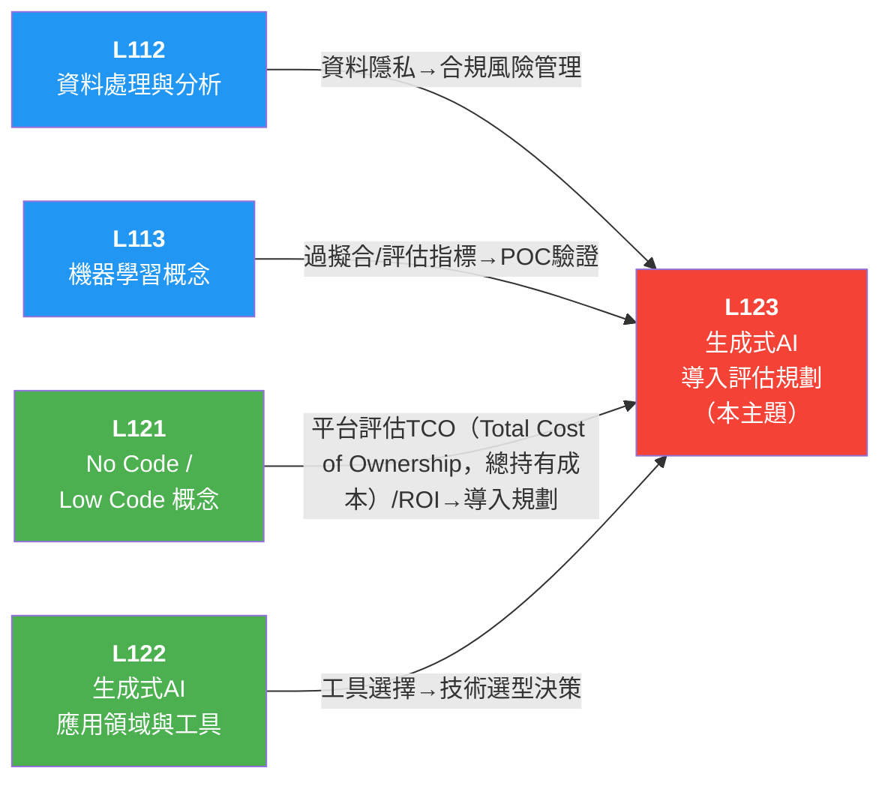

# L123 生成式 AI（Artificial Intelligence，人工智慧） 導入評估規劃 — iPAS（industrial Professional Assessment System，經濟部產業人才能力鑑定）AI應用規劃師（初級）學習指南

> 對應評鑑範圍：**L12301 生成式 AI 導入評估** ＋ **L12302 生成式 AI 導入規劃** ＋ **L12303 生成式 AI 風險管理**

---

## 0. 關鍵概念總覽圖

> 先鳥瞰整個 L123 的知識地圖，搞清楚所有專有名詞彼此之間的關係，之後讀細節時就不會迷路。

```
📋 L123 生成式 AI 導入評估規劃
│
├── L12301 生成式 AI 導入評估
│   │
│   ├── 📖 導入評估五大面向
│   │   ├── ① 需求與現狀評估
│   │   │   ├── 痛點識別（Pain Point Identification）── 流程瓶頸、資源分配失衡、決策不足
│   │   │   ├── SWOT（Strengths, Weaknesses, Opportunities, Threats，優劣機威）分析 ── 優勢/劣勢/機會/威脅全面盤點
│   │   │   ├── 需求矩陣（Requirements Matrix）── 按重要性排序確定優先順序
│   │   │   ├── 應用場景分析（Use Case Analysis）── 提升品質、縮短週期、優化體驗
│   │   │   └── 技術對接性（Technical Compatibility）── AI 是否能有效解決核心問題
│   │   ├── ② 資源與基礎設施評估
│   │   │   ├── 技術人才 ── AI 技術團隊能力是否充足
│   │   │   ├── 數據品質（Data Quality）── 完整性、準確性、格式一致性、歷史豐富度
│   │   │   ├── 硬體與系統 ── 高效能運算資源與彈性儲存空間
│   │   │   └── 系統可擴展性（System Scalability）── 架構需具備彈性，可隨規模擴展
│   │   ├── ③ 資源與基礎設施評估（分階段）
│   │   │   ├── 試點應用（Pilot Application）── 小規模驗證技術可行性
│   │   │   ├── 階段性擴展 ── 根據試點結果逐步擴大
│   │   │   ├── 長期目標設定 ── 納入企業長期策略
│   │   │   └── 持續優化與回饋機制
│   │   ├── ④ 員工技能與文化導入
│   │   │   ├── 技術培訓 ── 針對不同部門設計 AI 應用課程
│   │   │   ├── 實務操作 ── 幫助員工熟悉 AI 工具與應用情境
│   │   │   └── 數位轉型文化（Digital Transformation Culture）── 營造創新文化，促進跨部門合作
│   │   └── ⑤ 風險評估與管理
│   │       ├── 資料安全與隱私 ── 隱私洩漏風險
│   │       ├── 倫理與法規遵循 ── GDPR（General Data Protection Regulation，歐盟通用資料保護規則）合規風險
│   │       ├── 技術風險管理 ── 模型偏誤、技術失效應變
│   │       ├── 資源調度風險 ── 資金與人力可行性
│   │       └── 應對策略 ── 數據加密、SLA（Service Level Agreement，服務等級協議）協商
│   │
│   ├── 🎯 成功導入三大核心因素
│   │   ├── ① 清晰定義痛點 ── 明確 AI 要解決什麼問題
│   │   ├── ② 適配技術 ── 選擇匹配業務需求的 AI 方案
│   │   └── ③ 培養人才 ── 內部團隊具備 AI 應用能力
│   │
│   ├── 🔍 工具選擇核心指標
│   │   ├── 輸出質量（Output Quality）── AI 工具生成內容的品質
│   │   ├── 操作簡便性（Usability）── 使用門檻與學習曲線
│   │   ├── 擴展性（Scalability）── 未來成長彈性
│   │   ├── 成本效益（Cost-effectiveness）── ROI（Return on Investment，投資報酬率）評估
│   │   └── 安全性與合規性（Security & Compliance）── 法規符合度
│   │
│   ├── 📋 導入評估核心步驟（六步流程）
│   │   ├── ① 需求確認（SWOT 分析 + 需求矩陣）
│   │   ├── ② 技術評估（工具特性 + 技術整合性）
│   │   ├── ③ 資源評估（成本效益 + 人力需求）
│   │   ├── ④ 風險與挑戰分析（資料/合規風險 + 應對策略）
│   │   ├── ⑤ 試用與測試（小規模環境 + 測試指標）
│   │   └── ⑥ 成本效益分析（ROI 評估模型）
│   │
│   └── 🏢 企業規模與階段目標
│       ├── 初始階段 ── 試點與驗證（小範圍、低成本、風險可控）
│       ├── 成長階段 ── 推廣與整合（跨部門合作、多場景擴展）
│       └── 成熟階段 ── 全面整合與創新領先（AI 成為業務差異化核心）
│
├── L12302 生成式 AI 導入規劃
│   │
│   ├── 📐 四大導入階段
│   │   ├── ① 準備階段（挑選 AI 應用方案）
│   │   │   ├── A. 掌握企業課題
│   │   │   │   ├── 設立明確目標 ── 導入的第一步！
│   │   │   │   ├── 選定應用範圍 ── 從簡單可行的核心專案開始
│   │   │   │   └── 提取改善項目 ── 識別重複性、規則性、標準化工作
│   │   │   ├── B. 檢視 AI 方案與企業資源
│   │   │   │   ├── 數據品質與豐富度
│   │   │   │   ├── 技術基礎設施
│   │   │   │   ├── 人力資源與技術熟練度
│   │   │   │   └── AI 方案種類：商業產品、開源平台、客製化服務
│   │   │   └── C. 確定應用領域優先順序
│   │   │       ├── 商業價值與效益預估
│   │   │       ├── 技術可行性與成熟度
│   │   │       ├── 風險評估（技術障礙、資源短缺、進度延誤）
│   │   │       └── 長期戰略契合度
│   │   │
│   │   ├── ② 設計階段（確任 AI 生成規格）
│   │   │   ├── A. 確認導入最終目標
│   │   │   │   ├── 設立可量化 KPI（Key Performance Indicator，關鍵績效指標） ── 財務、運營、市場競爭力
│   │   │   │   └── 短期+長期目標並行
│   │   │   ├── B. 確認數據狀態
│   │   │   │   ├── 多來源收集，保證多樣性與代表性
│   │   │   │   ├── 數據清理與標記
│   │   │   │   └── 建立持續更新的數據流程
│   │   │   ├── C. 確認使用情境
│   │   │   │   └── 分析關鍵業務流程，確定適合 AI 的場景
│   │   │   └── D. 估算 AI 導入成本
│   │   │       ├── 技術開發成本（模型構建、測試、部署、優化）
│   │   │       ├── 硬體與雲端服務成本
│   │   │       └── 人員培訓與第三方服務支出
│   │   │
│   │   ├── ③ 驗證 POC（Proof of Concept，概念驗證）（驗證 AI 效果）
│   │   │   ├── A. 模型開發至部署
│   │   │   │   ├── 模型架構選擇 ── 自迴歸、自編碼器、擴散、Transformer
│   │   │   │   ├── 訓練設置 ── Loss Function、Optimizer、Learning Rate、
│   │   │   │   │   Batch Size、Epochs、Cross Validation、Grid Search
│   │   │   │   └── 訓練優化 ── 正則化（L2/Dropout）、Early Stopping、
│   │   │   │       Mixed Precision、Pruning、Quantization、Transfer Learning
│   │   │   ├── B. 驗證方案與檢查效能
│   │   │   │   ├── 設定驗證基準 ── BLEU（Bilingual Evaluation Understudy，雙語評估替補）、ROUGE（Recall-Oriented Understudy for Gisting Evaluation，摘要導向評估）、Perplexity
│   │   │   │   ├── 自動化效能測試與批量測試
│   │   │   │   ├── 主觀人工檢查 ── 領域專家 + 用戶回饋
│   │   │   │   ├── 壓力測試與邊界檢查（Boundary Testing）
│   │   │   │   ├── 敏感性與公平性檢查（Sensitivity & Fairness Testing）
│   │   │   │   └── A/B 測試與線上驗證
│   │   │   ├── C. 導入實務運作流程
│   │   │   │   ├── 業務流程整合
│   │   │   │   ├── 試點運行 ── 受控環境中小規模測試
│   │   │   │   ├── 員工培訓 ── 實際操作演練與案例分析
│   │   │   │   ├── 持續改進機制 ── 常態化回饋收集與分析
│   │   │   │   └── 效益評估與推廣 ── 將成功經驗複製到其他業務單位
│   │   │   └── D. ROI 計算
│   │   │       ├── 成本面 ── 技術開發 + 設備購置 + 維護 + 人力
│   │   │       ├── 收益面 ── 直接效益（營收↑、成本↓）+ 間接效益（效率↑）
│   │   │       ├── 財務指標 ── NPV（Net Present Value，淨現值）、IRR（Internal Rate of Return，內部報酬率）
│   │   │       └── 敏感性分析（Sensitivity Analysis）── 模擬市場/成本變動
│   │   │
│   │   └── ④ 實施/營運（持續發揮價值）
│   │       ├── A. 專案落地
│   │       │   ├── 培養內部專家團隊 + 跨職能支持體系
│   │       │   ├── 明確團隊內責任分工
│   │       │   └── 常態化回饋機制與績效數據分析
│   │       ├── B. 模型監控（Model Monitoring）與重新訓練（Retraining）
│   │       │   ├── 監控指標 ── Accuracy、Recall、Error Rate
│   │       │   ├── Data Drift（數據漂移）檢測 ── 訓練 vs 實際資料分佈差異
│   │       │   └── 自動化重新訓練管道（Retraining Pipeline）
│   │       └── C. AI 價值擴散
│   │           ├── 由單點 → 全企業範圍推廣
│   │           ├── 分享成功案例與培訓活動
│   │           └── 設立創新獎勵機制
│   │
│   └── 📊 導入正確執行順序（114 年考古題）
│       └── 物流公司 AI 導入四步驟：
│           ② 明確目標並設定 KPI → ③ 蒐集清理資料 →
│           ④ 評估選擇 AI 方案 → ① 建立對話邏輯與應答範本
│
└── L12303 生成式 AI 風險管理
    │
    ├── 🔒 資料隱私與安全風險
    │   ├── 常見風險識別
    │   │   ├── 訓練數據洩漏（Training Data Leakage）── 模型可能重複訓練資料中的隱私片段
    │   │   ├── 反向工程（Reverse Engineering）── 推斷模型參數或訓練數據
    │   │   ├── 提示詞攻擊（Prompt Injection）── 多次查詢推斷訓練集中敏感資料
    │   │   └── 對抗性攻擊（Adversarial Attack）── 精心設計輸入操控模型輸出
    │   └── 防範措施
    │       ├── 身份驗證與授權機制（Authentication & Authorization）
    │       ├── 加密技術 ── 存儲與傳輸加密
    │       ├── 差分隱私（Differential Privacy）── 防止敏感資料外洩
    │       └── 資料最小化（Data Minimization）與去識別化（De-identification）
    │
    ├── ⚖️ 倫理偏見與公平性
    │   ├── 訓練資料偏見（Training Data Bias）→ 模型輸出偏見（性別、種族、文化）
    │   ├── 黑箱問題（Black Box）── 用戶無法理解推理過程
    │   ├── 責任歸屬不清（Accountability）── 數據提供方 vs 模型開發者 vs 最終使用者
    │   ├── 解方：多樣性數據集 + 去偏見技術 + 公平性檢測
    │   ├── 解方：可解釋性 AI（Explainable AI）── 提升透明度
    │   └── 解方：第三方評估機制 ── 客觀審視 AI 結果
    │
    ├── 📜 法規遵循
    │   ├── GDPR ── 資料匿名化、差分隱私、知情同意
    │   ├── CCPA（California Consumer Privacy Act，加州消費者隱私法）── 加州消費者隱私保護
    │   ├── 智慧財產權（Intellectual Property / IP）
│   │   ├── AI 生成內容所有權歸屬不明 ── AI 本身不能擁有版權
│   │   ├── 爭議：作品歸使用者、模型開發者、還是數據提供者？
│   │   ├── 訓練數據版權 ── 訓練資料可能含受版權保護的內容
│   │   └──  AI 生成內容的版權問題目前法律仍有灰色地帶
    │   ├── 高風險場景 ── 醫療診斷、自動駕駛、金融決策
    │   │   └── 需建立完善的技術標準和合規性審查機制
    │   └── 透明度承諾 ── 標示「此內容由 AI 生成」
    │
    ├── 🔄 風險管理流程（五步循環）
    │   ├── ① 識別 ── 辨識所有潛在風險
    │   ├── ② 評估 ── 風險矩陣（發生概率 × 影響程度）
    │   ├── ③ 控制 ── 輸入檢查、權限控制
    │   ├── ④ 監控 ── 持續追蹤風險狀態
    │   └── ⑤ 應急響應 ── 預定應變計畫
    │
    ├── 📊 風險評估工具與方法
    │   ├── 風險矩陣（Risk Matrix）── 發生概率 × 影響程度
    │   ├── 風險分級分類（Risk Classification）── 優先處理高風險問題
    │   ├── 風險分析（Risk Analysis）目的 ── 評估風險的影響與發生可能性
    │   └── ISO（International Organization for Standardization，國際標準化組織）31000 ── 國際風險管理框架標準
    │
    ├── ⚙️ 操作風險與供應商風險
    │   ├── 操作風險（Operational Risk）── 工具不穩定、使用者缺乏培訓
    │   │   └── 解方：性能測試 + 用戶培訓
    │   └── 技術依賴與供應商風險（Vendor Lock-in Risk）── 服務中斷、產品停用
    │       └── 解方：多樣化工具選擇，避免單一供應商依賴
    │
    ├── 🚨 應急方案
    │   ├── 輸出錯誤 → 通知相關人員審核修正
    │   └── 數據洩露 → 啟動數據恢復與安全補救措施
    │
    └── 🛡️ 五大風險應對策略
        ├── A. 風險溯源（Risk Traceability）── 數據來源審核 + 可解釋性 AI 確保全流程透明
        ├── B. 風險文化（Risk Culture）── 定期培訓、案例分析、風險報告機制
        ├── C. 風險接受（Risk Acceptance）── 評估風險容忍度 + 制定應急計畫
        ├── D. 風險緩解（Risk Mitigation）── 數據管理 + 內容審查 + 定期評估更新
        ├── E. 風險迴避（Risk Avoidance）── 技術不成熟時暫緩開發，量化迴避標準
        └── F. 風險轉移（Risk Transfer）── 外包給第三方或購買保險
            └──  轉移≠卸責，企業仍需保留監控與審核權限
```

---

## 1. 關鍵術語與定義

### 1-1 策略規劃與需求評估（Strategic Planning & Requirements Assessment）

> 📝 **一句話速記**：導入 AI 前先用 SWOT 和需求矩陣盤點現況，再設定可量化 KPI 作為成功標準。

> ```
> 策略規劃與需求評估
> │
> ├─ ① 現況盤點工具（知己知彼）
> │   ├─ SWOT 分析 ← 內外部全面評估（優勢/劣勢/機會/威脅）
> │   ├─ 需求矩陣 (Requirements Matrix) ← 重要性 × 急迫性 × 可行性排序
> │   └─ 痛點識別 (Pain Point Identification) ← 找出核心瓶頸（成功導入第一步）
> │
> ├─ ② 場景適配評估（選對戰場）
> │   ├─ 應用場景分析 (Use Case Analysis) ← 評估業務場景適合度
> │   └─ 場景適配性 (Scenario Fit) ← 資料充足？重複性高？容錯空間？
> │
> ├─ ③ 技術可行性（做得到嗎？）
> │   └─ 技術對接性 (Technical Compatibility) ← AI 能否整合現有系統
> │
> ├─ ④ 資料與基礎設施（資源準備好了嗎？）
> │   ├─ 數據品質 (Data Quality) ← 完整性/準確性/一致性/歷史豐富度
> │   └─ 系統可擴展性 (System Scalability) ← 能否隨業務成長擴展
> │
> ├─ ⑤ 人員與文化（組織準備好了嗎？）
> │   └─ 數位轉型文化 (Digital Transformation Culture) ← 培訓+跨部門合作
> │
> └─ ⑥ 成功標準設定（怎麼判斷成功？）
>     └─ KPI (關鍵績效指標) ← 財務/運營/品質/競爭力的可量化指標
>
> ─── 評估順序 ───
> 痛點識別 → SWOT 分析 + 需求矩陣（盤點）→ 場景適配評估 → 技術/資料/人員可行性檢查 → 設定 KPI
> ```
>
> 一句話串起來：先用**痛點識別**找出核心問題 → **SWOT + 需求矩陣**盤點現況並排優先順序 → **場景適配**評估哪些業務適合導入 → 檢查**技術/資料/人員/文化**是否到位 → 最後設定**KPI**作為成功標準。

**① 現況盤點工具（知己知彼）**

- **SWOT 分析（SWOT Analysis）** — 評估企業導入 AI 前的全面盤點工具：Strengths（優勢）、Weaknesses（劣勢）、Opportunities（機會）、Threats（威脅）。用於需求確認階段。
  > 🗣️ 範例——某零售公司評估導入 AI 客服：
  >
  > | | 正面 | 負面 |
  > |---|------|------|
  > | **內部** | **S 優勢**：已有大量客服對話紀錄可訓練 | **W 劣勢**：IT 團隊缺乏 AI 經驗 |
  > | **外部** | **O 機會**：競爭對手尚未導入，搶先優勢 | **T 威脅**：客戶可能抗拒跟機器人對話 |

- **需求矩陣（Requirements Matrix）** — 將所有需求按重要性與優先順序排列的評估工具，幫助企業確定 AI 導入的優先領域。
  > 🗣️ 用生活比喻：就像列出所有想做的事，幫每件事打分數——「有多重要？多急？技術做不做得到？」——分數高的先做。範例如下：
  >
  > | 需求項目 | 重要性 (1-5) | 急迫性 (1-5) | 技術可行性 (1-5) | 優先順序 |
  > |---------|-------------|-------------|-----------------|---------|
  > | 客服自動回覆 | 5 | 5 | 4 | ★★★ 最優先 |
  > | 內部文件摘要 | 4 | 3 | 5 | ★★ 次要 |
  > | 產品瑕疵影像辨識 | 5 | 4 | 2 | ★★ 需評估技術 |
  > | AI 自動排程 | 2 | 2 | 3 | ★ 可延後 |

- **痛點識別（Pain Point Identification）** — 在導入評估的需求與現狀評估面向中，識別企業現有流程中的瓶頸、資源分配失衡或決策不足等問題。痛點識別是成功導入三大核心因素之首（清晰定義痛點），也是設定 AI 導入目標的起點。
  > 🗣️ 像醫生看病前先問「哪裡痛」——沒找出核心痛點就導入 AI，等於開錯藥方。

**② 場景適配評估（選對戰場）**

- **應用場景分析（Use Case Analysis）** — 針對具體業務場景評估 AI 導入的適合度，包含提升品質、縮短週期、優化使用者體驗等面向。與場景適配性（Scenario Fit）互為搭配，確保 AI 技術能有效解決核心問題。
  > 🗣️ 像打仗前先看地形——這個場景適不適合 AI 出兵？能產生多少效益？

- **場景適配性（Scenario Fit）** — 評估 AI 工具是否適合特定業務場景的匹配度分析，是導入規劃的重點考量之一。
  > 🗣️ 範例——評估不同業務場景是否適合導入 AI：
  >
  > | 業務場景 | 資料充足？ | 重複性高？ | 容錯空間？ | 適配度 |
  > |---------|----------|----------|----------|--------|
  > | 客服 FAQ 回覆 | 有大量歷史對話 | 高（80% 重複問題） | 中（答錯可補救） | ★★★ 非常適合 |
  > | 法律合約審查 | 有但機密性高 | 中 | 低（錯誤代價大） | ★★ 需謹慎，搭配人工審核 |
  > | 創意行銷文案 | 少 | 低（每次都不同） | 高（可多次修改） | ★★ 適合輔助，不適合全自動 |

**③ 技術可行性（做得到嗎？）**

- **技術對接性（Technical Compatibility）** — 評估 AI 技術方案是否能與企業現有系統、流程及基礎設施有效整合，是導入評估中確認 AI 能否有效解決核心問題的關鍵判斷依據。
  > 🗣️ 像買新電器前先看插頭合不合——AI 再好，接不上現有系統也白搭。

**④ 資料與基礎設施（資源準備好了嗎？）**

- **數據品質（Data Quality）** — 衡量企業資料是否符合 AI 訓練與應用需求的綜合指標。數據品質直接影響模型效能與導入成敗。

  | 指標 | 說明 |
  |---|---|
  | 完整性（Completeness） | 資料欄位與記錄是否齊全 |
  | 準確性（Accuracy） | 資料內容是否正確無誤 |
  | 格式一致性（Consistency） | 資料格式與編碼是否統一 |
  | 歷史豐富度（Historical Richness） | 是否有足夠的歷史資料供模型學習 |

  > 🗣️ 像煮菜前檢查食材——材料不新鮮（資料品質差），再好的廚師也做不出好菜。

- **系統可擴展性（System Scalability）** — 系統架構是否具備彈性，能隨業務規模增長而擴展運算與儲存資源的能力。是資源與基礎設施評估中的核心考量。
  > 🗣️ 像買辦公桌椅要考慮「公司擴編怎麼辦」——系統能不能撐得住未來成長？

**⑤ 人員與文化（組織準備好了嗎？）**

- **數位轉型文化（Digital Transformation Culture）** — 企業在導入 AI 時需營造的創新文化氛圍，透過技術培訓與實務操作幫助員工熟悉 AI 工具，並促進跨部門合作，是「員工技能與文化導入」評估面向的核心。
  > 🗣️ 像種樹要先整地——員工沒培訓、文化沒準備好，AI 種下去也長不起來。

**⑥ 成功標準設定（怎麼判斷成功？）**

- **KPI（關鍵績效指標 / Key Performance Indicator）** — 用來追蹤模型效能的可量化成功標準，涵蓋財務指標、運營效率和市場競爭力等面向。
  > 🗣️ 範例——AI 客服系統的 KPI 設定：
  >
  > | KPI 面向 | 指標 | 目標值 |
  > |---------|------|--------|
  > | 財務 | 客服人力成本節省率 | ≥ 30% |
  > | 運營效率 | 平均回覆時間 | ≤ 5 秒 |
  > | 運營效率 | 自動解決率（不需轉人工） | ≥ 70% |
  > | 品質 | 客戶滿意度 (CSAT) | ≥ 4.0 / 5.0 |
  > | 市場競爭力 | 客戶留存率提升 | ≥ 5% |

> ⚠ **策略規劃與需求評估 考試速記**：
>
> - 成功導入三大核心因素：**清晰定義痛點 + 適配技術 + 培養人才**——痛點識別是第一步。
> - SWOT 分析是**四象限**工具（內外 × 正負），需求矩陣是**三維度**評分（重要性/急迫性/可行性）——兩者搭配使用。
> - 場景適配性三大判斷標準：資料充足？重複性高？容錯空間？——三者都要看。
> - 數據品質四大指標：完整性、準確性、格式一致性、歷史豐富度——缺一不可。
> - KPI 必須是**可量化**指標——題目問「哪個不是 KPI」，答案通常是定性描述（如「提升品牌形象」）。

### 1-2 工具選擇與評估指標（Tool Selection & Evaluation Criteria）

> 📝 **一句話速記**：選 AI 工具看五大核心指標——輸出質量、操作簡便性、擴展性、成本效益、安全性與合規性，缺一不可。

> ```
> 工具選擇與評估指標
> │
> ├─ ① 輸出質量 (Output Quality) ← 首要指標：事實正確/語意連貫/格式一致
> ├─ ② 操作簡便性 (Usability) ← 門檻低不低？員工學得會嗎？
> ├─ ③ 擴展性 (Scalability) ← 能否隨企業成長彈性擴展？
> ├─ ④ 成本效益 (Cost-effectiveness) ← ROI 划不划算？
> └─ ⑤ 安全性與合規性 (Security & Compliance) ← 資料加密/存取控制/符合 GDPR、CCPA
>
> ─── 評估順序 ───
> 先看輸出質量（能不能用）→ 操作簡便性（會不會用）→ 擴展性（能用多久）→ 成本效益（值不值得）→ 安全合規（敢不敢用）
> ```
>
> 一句話串起來：五大指標缺一不可——**輸出質量**是基礎（能不能用），**操作簡便性**決定導入成敗（會不會用），**擴展性**決定長期價值（能用多久），**成本效益**決定投資決策（值不值得），**安全合規**是法律底線（敢不敢用）。

**① 輸出質量（Output Quality）**

- **輸出質量（Output Quality）** — AI 工具生成內容的品質與準確度，是工具選擇的首要評估指標。包含事實正確性、語意連貫性與格式一致性等面向。
  > 🗣️ 像買車先看「能不能跑」——輸出質量不過關，其他指標再好也沒用。

**② 操作簡便性（Usability）**

- **操作簡便性（Usability）** — AI 工具的使用門檻與學習曲線，決定企業員工能否快速上手應用。操作門檻過高會導致導入失敗。
  > 🗣️ 像手機介面複雜到看不懂——功能再強大，員工不會用就是擺設。

**③ 擴展性（Scalability）**

- **擴展性（Scalability）** — AI 工具能否隨企業成長而彈性擴展的能力，包含使用量增加時的效能表現與功能延展性。
  > 🗣️ 像買辦公室要考慮「公司擴編怎麼辦」——今天 10 人用沒問題，明天 1000 人用會不會掛？

**④ 成本效益（Cost-effectiveness）**

- **成本效益（Cost-effectiveness）** — 綜合評估 AI 工具的導入成本與帶來的效益，通常以 ROI（Return on Investment，投資報酬率）作為量化指標。
  > 🗣️ 像買東西算「CP 值」——花 100 萬導入，能省回多少？多久回本？

**⑤ 安全性與合規性（Security & Compliance）**

- **安全性與合規性（Security & Compliance）** — AI 工具在資料安全防護與法規遵循方面的表現，包含資料加密、存取控制及符合 GDPR（General Data Protection Regulation，歐盟通用資料保護規則）、CCPA（California Consumer Privacy Act，加州消費者隱私法）等法規要求。
  > 🗣️ 像租辦公室要看「消防安檢有沒有過」——資料外洩一次，罰款可能超過所有成本效益。

> ⚠ **工具選擇與評估指標 考試速記**：
>
> - 五大指標的**優先順序**：輸出質量 > 安全合規 > 操作簡便性 > 擴展性 > 成本效益——安全出事會倒閉，排第二優先。
> - 操作門檻過高 = 導入失敗最常見原因——題目問「導入失敗最可能原因」，答案常是「使用者不會用」。
> - 擴展性包含兩個面向：**效能擴展**（使用量增加時撐不撐得住）+ **功能擴展**（未來能不能加新功能）。
> - 成本效益用 ROI 量化——投入成本 vs 帶來效益，計算公式：ROI = (收益 - 成本) / 成本 × 100%。
> - GDPR（歐盟）和 CCPA（加州）是最常考的兩大法規——題目問「跨國合規要注意什麼」必選這兩個。

### 1-3 可行性驗證與導入階段（Feasibility Validation & Adoption Stages）

> 📝 **一句話速記**：導入嚴格遵守「準備→設計→POC→Pilot→Rollout」順序，POC 驗證技術可行、Pilot 驗證使用者接受度，不可跳關。

> ```
> 可行性驗證與導入階段
> │
> ├─ ① 準備階段 (Preparation) ← 掌握課題 + 檢視資源 + 確定優先順序
> ├─ ② 設計階段 (Design) ← 設立 KPI + 確認數據 + 確認情境 + 估算成本
> ├─ ③ POC (概念驗證) ← 小規模模擬實驗：技術可行嗎？效能達標嗎？
> ├─ ④ Pilot (小規模試點) ← 真實世界小範圍試用：好不好用？使用者接受嗎？
> └─ ⑤ Rollout (全面導入) ← 全範圍上線：無縫接軌 + 持續優化迴圈
>
> ─── 關鍵對比 ───
> POC vs Pilot：POC = 實驗室測試（驗證技術），Pilot = 真實世界試用（驗證接受度）
> Pilot vs Rollout：Pilot = 小範圍（5-10%），Rollout = 全範圍（100%）
> 試點應用 (Pilot Application) = Pilot 的別名，屬於「分階段擴展」第一步
> ```
>
> 一句話串起來：**準備**盤點資源 → **設計**設定目標與成本 → **POC** 驗證技術可行性 → **Pilot** 驗證使用者接受度 → **Rollout** 全面上線持續優化。五階段順序固定，不可跳關。

**① 準備階段（Preparation）**

（此階段無單獨術語定義，在「考前必記重點」section 2 中有詳述：掌握企業課題 → 檢視 AI 方案與資源 → 確定優先順序）

**② 設計階段（Design）**

（此階段無單獨術語定義，在「考前必記重點」section 2 中有詳述：設立 KPI + 確認數據狀態 + 確認使用情境 + 估算成本）

**③ POC（概念驗證）**

- **POC（概念驗證 / Proof of Concept）** — 在正式大規模導入前，透過小規模模擬實驗測試，評估模型效能、檢視 AI 在真實業務場景中的預測準確度、效率及與現有作業模式的融合度。
  > 🗣️ 像新藥臨床試驗的「實驗室階段」——先在受控環境測試技術可不可行，不直接給真實使用者用。

**④ Pilot（小規模試點）**

- **Pilot（小規模試點）** — 導入框架中 POC 之後的階段，將模型拿到真實世界給小範圍使用者試用，核心目的是驗證「好不好用、使用者接不接受」。
  > 🗣️ 像新藥臨床試驗的「人體試驗階段」——找一小群真實用戶試用（通常 5-10%），看接受度如何。

- **試點應用（Pilot Application）** — 在小規模範圍內驗證 AI 技術可行性的階段性實驗，屬於導入評估中「分階段擴展」的第一步。試點成功後才逐步擴大應用範圍並納入企業長期策略。
  > 🗣️ 「試點應用」是 Pilot 的另一種說法，指同一件事。

**⑤ Rollout（全面導入）**

- **Rollout（全面導入）** — 當技術與市場反應皆確認無誤後，正式於全範圍上線的過程。必須設計無縫接軌給真人的機制，並建立持續優化迴圈。
  > 🗣️ 像新藥上市——Pilot 驗證成功後，全面鋪貨給所有使用者，但要保留「緊急轉人工」的安全機制。

> ⚠ **可行性驗證與導入階段 考試速記**：
>
> - 五階段**順序絕對固定**：準備 → 設計 → POC → Pilot → Rollout——題目問「哪個階段應該先做」，按順序選就對了。
> - POC vs Pilot 最關鍵區別：POC 在**實驗室環境**測試技術，Pilot 在**真實世界**給真實使用者試用——考試常考兩者差異。
> - **不可跳關**：沒做 POC 就直接 Pilot = 技術風險太高，沒做 Pilot 就直接 Rollout = 使用者接受度未知。
> - Rollout 階段必須保留「**無縫接軌給真人**」機制——AI 答不出來或出錯時，要能立刻轉給人工客服，不能讓使用者卡住。
> - Pilot 典型範圍是 5-10% 使用者——題目問「Pilot 應該涵蓋多少使用者」，答案通常是「小範圍 / 少數使用者」，不是「全部」。

### 1-4 成本效益與財務分析（Cost-Benefit & Financial Analysis）

> 📝 **一句話速記**：ROI 衡量整體投資報酬、NPV 把未來現金流折現比較、IRR 是讓 NPV 歸零的折現率，三者搭配評估財務可行性。

> ```
> 成本效益與財務分析
> │
> ├─ ① 快速篩選工具
> │   └─ ROI (投資回報率) ← 最直覺：(收益 - 成本) / 成本，算划不划算
> │
> ├─ ② 精確比較工具
> │   ├─ NPV (淨現值) ← 把未來現金流折現到今天，NPV > 0 就值得投
> │   └─ IRR (內部報酬率) ← 讓 NPV = 0 的折現率，越高越好
> │
> └─ ③ 風險壓力測試
>     └─ 敏感性分析 (Sensitivity Analysis) ← 模擬「如果情況變了」會不會翻車
>
> ─── 關鍵對比 ───
> ROI vs NPV：ROI 看「當下」划不划算，NPV 看「長期」值多少（考慮時間價值）
> NPV vs IRR：NPV 算「絕對值」（賺多少錢），IRR 算「相對值」（年化報酬率 %）
> 三者配合使用順序：ROI 快篩 → NPV/IRR 精確比較 → 敏感性分析壓力測試
> ```
>
> 一句話串起來：**ROI** 是最直覺的「划不划算」指標，**NPV** 把未來收益折現回今天看長期價值，**IRR** 用年化報酬率比較不同方案，**敏感性分析**模擬風險變數對收益的影響。

**① 快速篩選工具**

- **ROI（投資回報率 / Return On Investment）** — 從成本（技術開發、設備、維護）與收益（營收增長、成本節約、效率提升）兩個層面評估 AI 導入的財務可行性。
  > 🗣️ 像算「花 100 元賺回多少」：投入 100 萬導入 AI，一年省下 150 萬，ROI = 50%。最直覺的賺不賺錢指標。

**② 精確比較工具**

- **NPV（淨現值 / Net Present Value）** — 將未來現金流折現到現在的財務指標，用於評估 AI 方案的長期收益潛力。
  > 🗣️ 像算「未來的錢現在值多少」：明年賺的 100 萬不等於今天的 100 萬（因為有通膨、利率），NPV 把未來每年的收益「折現」回今天加總。NPV > 0 就值得投。

- **IRR（內部報酬率 / Internal Rate of Return）** — 使 NPV 等於零的折現率，用於比較不同投資方案的回報率。
  > 🗣️ 像算「這個投資等於年化報酬幾 %」：IRR = 15% 表示這個 AI 方案等於每年賺 15% 的投資。IRR 越高越好，可以拿來跟銀行利率或其他方案比。

**③ 風險壓力測試**

- **敏感性分析（Sensitivity Analysis）** — 模擬市場條件、業務情境或成本變動對方案收益的影響，幫助企業識別風險與機會。
  > 🗣️ 像問「如果情況變了怎麼辦」：如果客戶量少 20%？如果維護費多 30%？模擬各種「萬一」，看方案還撐不撐得住。

> 🔍 **財務評估工具比較表**：
>
> | 工具 | 白話比喻 | 回答的問題 | 計算複雜度 |
> |------|---------|----------|-----------|
> | **ROI** | 花 100 元賺回多少 | 這筆投資划不划算？ | ★ 簡單 |
> | **NPV** | 未來的錢現在值多少 | 長期來看，這個方案到底值多少錢？ | ★★ 中等 |
> | **IRR** | 這個投資等於年化報酬幾 % | 這個方案的年化報酬率是多少？ | ★★★ 複雜 |
> | **敏感性分析** | 如果情況變了怎麼辦 | 哪些因素變動會讓方案翻車？ | ★★ 中等 |
>
> **使用順序**：先用 ROI 快速篩選 → NPV/IRR 做精確比較 → 敏感性分析壓力測試風險。

> ⚠ **成本效益與財務分析 考試速記**：
>
> - ROI 成本面包含：技術開發 + 設備購置 + 基礎設施維護 + 專業人力——題目問「哪個不屬於成本」，答案通常是「營收增長」（那是收益面）。
> - ROI 收益面包含：**直接效益**（營收↑、成本↓）+ **間接效益**（流程效率↑、人力配置最佳化）——兩者都要算。
> - NPV > 0 才值得投資——NPV < 0 代表賠錢，NPV = 0 代表剛好打平（通常不投）。
> - IRR 越高越好，要拿來跟「資金成本」或「其他方案」比——IRR 15% 聽起來不錯，但如果銀行定存有 20%，那還不如存銀行。
> - 敏感性分析的核心是「找出關鍵變數」——哪些因素一變動就會讓方案翻車？（如客戶量、維護成本、市場競爭）

### 1-5 模型訓練與效能驗證（Model Training & Performance Validation）

> 📝 **一句話速記**：POC 階段用 BLEU/ROUGE/Perplexity 量化評估模型品質，搭配 A/B 測試與延遲測試驗證實際效能。

> ```
> 模型訓練與效能驗證
> │
> ├─ ① 訓練階段指標
> │   └─ Cross-Entropy Loss (交叉熵損失) ← 訓練時的損失函數，越低越好
> │
> ├─ ② 模型品質評估（離線測試）
> │   ├─ BLEU ← 翻譯品質（跟標準答案逐字比對）
> │   ├─ ROUGE ← 摘要品質（重點覆蓋率）
> │   └─ Perplexity ← 語言流暢度（越低越好）
> │
> ├─ ③ 系統效能驗證（POC 階段）
> │   ├─ A/B 測試 ← 比較不同版本模型的實際表現
> │   ├─ Latency Testing (延遲測試) ← 回應速度
> │   ├─ 壓力測試與邊界檢查 ← 極端負載與邊緣輸入的容錯
> │   └─ 敏感性與公平性檢查 ← 偏見與歧視檢測
> │
> └─ ④ 上線後持續監控
>     ├─ Performance Metrics (效能指標) ← 準確度、精確度、延遲等
>     └─ 模型監控 (Model Monitoring) ← 追蹤指標衰退，觸發重訓
> ```
>
> 一句話串起來：**訓練時**用 Cross-Entropy Loss 優化 → **離線評估**用 BLEU/ROUGE/Perplexity 量化品質 → **POC 驗證**用 A/B 測試+延遲+壓力+公平性做實戰檢驗 → **上線後**持續監控效能指標，衰退就重訓。

**① 訓練階段指標**

- **Cross-Entropy Loss（交叉熵損失）** — 自迴歸模型中常用的損失函數，能有效評估生成詞語的預測誤差。
  > 🗣️ 像考試扣分表：AI 每猜一個字，猜得越離譜扣越多分。訓練目標就是讓總扣分越來越少。

**② 模型品質評估（離線測試）**

- **BLEU** — 評估生成式 AI 模型翻譯品質的量化標準，透過將 AI 翻譯與標準答案逐字比對，重疊越多分數越高。
  > 🗣️ 像翻譯老師改作業：拿 AI 的翻譯跟標準答案逐字比對，重疊越多分數越高。

- **ROUGE** — 評估生成式 AI 模型摘要品質的量化標準，檢查 AI 的摘要是否涵蓋原文重點。
  > 🗣️ 像摘要老師改作業：看 AI 的摘要有沒有涵蓋原文的重點，漏掉重點就扣分。

- **Perplexity（困惑度）** — 衡量生成式 AI 模型語言流暢性的量化標準，數值越低代表模型越有把握、語句越流暢。
  > 🗣️ 像「AI 有多困惑」：數值越低代表 AI 越有把握、語句越流暢；數值越高代表 AI 在亂猜。

**③ 系統效能驗證（POC 階段）**

- **A/B 測試（A/B Testing）** — 比較不同版本模型效能的方法，選擇生成品質更高且表現更穩定的版本。
  > 🗣️ 像飲料試喝：同時讓兩組人分別用 A 版和 B 版模型，比較誰的回答更好、更穩定。

- **Latency Testing（延遲測試）** — 即時客服系統效能測試中，衡量客戶從輸入問題到收到第一個完整回應所需時間的指標。
  > 🗣️ 像計時賽：從客戶按下「送出」到看到完整回覆，秒錶走了幾秒？越快越好。

- **壓力測試與邊界檢查（Stress Testing & Boundary Testing）** — 壓力測試是在極端負載條件下測試系統穩定性；邊界檢查則是以極端或邊緣輸入值測試模型的容錯能力。兩者皆屬於 POC 驗證階段的效能檢查手段。
  > 🗣️ **白話解釋**：
  >
  > - **壓力測試**：像超商促銷時測試收銀台撐不撐得住——同時湧入 1000 筆請求會不會當機？
  > - **邊界檢查**：像測試「輸入 999999999 或空白會不會出錯」——極端輸入值的容錯測試。

- **敏感性與公平性檢查（Sensitivity & Fairness Testing）** — 在 POC 驗證階段檢查模型對不同群體的輸出是否存在偏見或歧視，確保 AI 系統符合公平性標準。與去偏見技術（Bias Mitigation）搭配使用。
  > 🗣️ 像檢查履歷篩選系統「對男女求職者的通過率是否一致」——避免模型有性別歧視。

**④ 上線後持續監控**

- **Performance Metrics（效能指標）** — 衡量 AI 模型表現的具體數字，如準確度、精確度、延遲時間。上線後須持續監控，作為觸發重訓的依據。
  > 🗣️ 像汽車儀表板上的數字（速度、油耗、溫度）——隨時監控模型的「健康狀態」。

- **模型監控（Model Monitoring）** — 模型部署上線後，持續追蹤 Accuracy（準確率）、Recall（召回率）、Error Rate（錯誤率）等指標的機制，用於及時發現效能衰退並觸發重新訓練。
  > 🗣️ 像汽車定期保養提醒——監控到效能衰退就自動提醒「該重訓了」。

> 🔍 **模型評估與測試工具比較表**：
>
> | 工具 | 白話比喻 | 評估什麼 | 使用時機 |
> |------|---------|---------|---------|
> | **Cross-Entropy Loss** | 考試扣分表 | 模型預測的準確程度 | 訓練階段 |
> | **BLEU** | 翻譯老師改作業 | 翻譯品質（跟參考答案的相似度） | 離線測試 |
> | **ROUGE** | 摘要老師改作業 | 摘要品質（重點覆蓋率） | 離線測試 |
> | **Perplexity** | AI 有多困惑 | 語言流暢度（越低越好） | 離線測試 |
> | **A/B 測試** | 飲料試喝 | 不同版本模型的實際表現比較 | POC 階段 |
> | **Latency Testing** | 計時賽 | 回應速度 | POC 階段 |
> | **壓力測試** | 促銷時測收銀台 | 極端負載下的穩定性 | POC 階段 |
> | **邊界檢查** | 極端輸入值測試 | 容錯能力 | POC 階段 |
> | **公平性檢查** | 檢查性別歧視 | 偏見與歧視檢測 | POC 階段 |
> | **Performance Metrics** | 汽車儀表板 | 準確度、精確度、延遲等 | 上線後 |
> | **模型監控** | 定期保養提醒 | 追蹤指標衰退，觸發重訓 | 上線後 |

> 🗣️ **易混淆區分**：
>
> | 比較項目 | 區分重點 |
> |---|---|
> | BLEU vs ROUGE | BLEU 評「翻譯」（跟標準答案逐字比對），ROUGE 評「摘要」（重點有沒有涵蓋到） |
> | Perplexity vs BLEU/ROUGE | Perplexity 衡量「語言流暢度」（模型本身的困惑程度），BLEU/ROUGE 衡量「跟參考答案的相似度」 |
> | Cross-Entropy Loss vs Perplexity | Cross-Entropy 是「訓練時的損失函數」（用來優化模型），Perplexity 是「評估時的指標」（用來衡量結果）——Perplexity 其實是 Cross-Entropy 的指數形式 |
> | A/B 測試 vs 壓力測試 | A/B 測試比較「哪個版本更好」（品質），壓力測試看「能不能撐住」（穩定性） |
> | Performance Metrics vs 模型監控 | Performance Metrics 是「指標本身」（數字），模型監控是「持續追蹤指標的機制」（流程） |
> | 壓力測試 vs 邊界檢查 | 壓力測試用「大量請求」測負載極限，邊界檢查用「極端輸入值」測容錯能力 |

> ⚠ **模型訓練與效能驗證 考試速記**：
>
> - BLEU 看「翻譯」、ROUGE 看「摘要」、Perplexity 看「流暢度」——三者用途不同，別搞混！這是最高頻考點。
> - Cross-Entropy Loss 和 Perplexity 是**數學上的等價關係**：Perplexity = e^(Cross-Entropy)——一個用於訓練，一個用於評估。
> - A/B 測試選的是「**生成品質更高且表現更穩定**的版本」——不只看品質，還要看穩定性。
> - Latency Testing 測的是「**從輸入到收到第一個完整回應**」的時間——不是「打完第一個字」的時間。
> - 壓力測試 vs 邊界檢查：前者測「能不能撐住大量請求」，後者測「極端輸入會不會出錯」——方向不同。
> - Performance Metrics 包含：Accuracy、Recall、Error Rate、延遲時間等——題目問「哪個是 Performance Metrics」，這些都是。
> - 模型監控的觸發條件是「效能達到設定警戒值」——不是「每天固定重訓」，而是「監控到衰退才重訓」。

### 1-6 風險評估與管理（Risk Assessment & Management）

> 📝 **一句話速記**：風險管理是「識別→評估→控制→監控→應急」五步持續循環，風險轉移不等於卸責，企業仍須保留監控權。

> 🗣️ **風險評估與管理的層次關係**：
>
> ```
> 風險評估與管理
> │
> ├─ ① 評估工具（怎麼看風險？）
> │   ├─ 風險矩陣 (Risk Matrix) ← 機率 × 影響程度，視覺化分級
> │   ├─ 風險分級分類 (Risk Classification) ← 依嚴重度排優先順序
> │   └─ ISO 31000 ← 國際標準風險管理框架
> │
> ├─ ② 風險類型（有哪些風險？）
> │   ├─ 操作風險 (Operational Risk) ← 工具不穩定 / 使用者缺培訓
> │   └─ 供應商風險 (Vendor Lock-in Risk) ← 過度依賴單一供應商
> │
> ├─ ③ 五大風險應對策略（怎麼處理？）
> │   ├─ 風險迴避 (Risk Avoidance) ← 最保守：不做
> │   ├─ 風險緩解 (Risk Mitigation) ← 自己降低風險
> │   ├─ 風險轉移 (Risk Transfer) ← 外包/保險，但仍需監控
> │   ├─ 風險接受 (Risk Acceptance) ← 可接受就不額外處理，但備應急計畫
> │   └─ 風險溯源 (Risk Traceability) ← 全流程透明可追溯
> │
> └─ ④ 管理基礎設施
>     ├─ SLA (服務等級協議) ← 跟供應商的品質承諾合約
>     └─ 風險文化 (Risk Culture) ← 組織層面的風險意識培養
> ```
>
> 流程：先用**風險矩陣 + 分級分類**評估風險大小 → 辨識具體**風險類型**（操作風險、供應商風險等）→ 針對每個風險選擇**五大應對策略**之一 → 搭配 **SLA** 約束供應商、用**風險文化**讓全員有風險意識。

**① 評估工具（怎麼看風險？）**

- **風險矩陣 (Risk Matrix)** — 將風險的發生概率與影響程度進行交叉對比的評估工具，幫助決策者直觀了解各類風險的權重。
  > 🗣️ 範例——AI 系統風險矩陣：
  >
  > |  | 影響：低 | 影響：中 | 影響：高 |
  > |---|---------|---------|---------|
  > | **機率：高** | 🟡 資料格式錯誤 | 🟠 模型回應延遲 | 🔴 大規模資料外洩 |
  > | **機率：中** | 🟢 輸出格式偶爾不一致 | 🟡 模型幻覺誤導用戶 | 🟠 偏見導致歧視性輸出 |
  > | **機率：低** | 🟢 伺服器短暫斷線 | 🟢 API 金鑰過期 | 🟡 競爭對手逆向工程竊取模型 |
  >
  > 🔴 紅 = 最優先處理 → 🟠 橙 = 需要關注 → 🟡 黃 = 持續監控 → 🟢 綠 = 可接受風險

- **風險分級分類（Risk Classification）** — 依據風險的嚴重程度與發生概率進行分級歸類，優先處理高風險問題的管理方法。可搭配風險矩陣使用，確保資源集中在最關鍵的風險上。

- **ISO 31000** — 國際標準化組織制定的風險管理框架標準，提供風險管理的原則、架構與流程指引，可作為生成式 AI 風險管理的參考框架。

**② 風險類型（有哪些風險？）**

- **操作風險（Operational Risk）** — AI 工具不穩定或使用者缺乏培訓所導致的運作風險。解方包含上線前進行充分的性能測試以及對使用者實施完善培訓。

- **供應商風險（Vendor Lock-in Risk）** — 過度依賴單一 AI 供應商導致的風險，包括服務中斷、產品停用或被迫接受不利條款。應對策略為多樣化工具選擇，避免單一供應商依賴。

**③ 五大風險應對策略（怎麼處理？）**

- **風險迴避（Risk Avoidance）** — 當技術不成熟或風險過高時，暫緩開發或放棄特定 AI 應用的策略。需量化迴避標準，避免因過度保守而錯失發展機會。屬於五大風險應對策略之一。

- **風險緩解（Risk Mitigation）** — 企業自行制定數據管理政策、內容審查機制與定期評估更新等措施，以降低風險發生的概率或影響程度。屬於五大風險應對策略之一，注意與風險轉移的區別。

- **風險轉移（Risk Transfer）** — 透過外包給第三方服務供應商或購買保險等方式，將部分或全部風險責任轉移。但企業仍需保留監控與審核權限。

- **風險接受（Risk Acceptance）** — 在評估風險容忍度後，對可接受範圍內的風險不採取額外控制措施，但仍需制定應急計畫以備不時之需。屬於五大風險應對策略之一。

- **風險溯源（Risk Traceability）** — 透過數據來源審核與可解釋性 AI（Explainable AI）確保 AI 決策全流程透明可追溯的風險管理策略，是五大風險應對策略之一。

**④ 管理基礎設施**

- **SLA (服務等級協議 / Service Level Agreement)** — 與 AI 工具供應商協商的服務品質承諾，包括可用性、回應時間、資料安全等保障條款。是風險應對策略中的重要工具。

- **風險文化（Risk Culture）** — 企業透過定期培訓、案例分析與風險報告機制，將風險意識融入組織文化的管理策略。屬於五大風險應對策略之一。

> 🔍 **易混淆區分**：
>
> | 比較項目 | 區分重點 |
> |---|---|
> | 風險緩解 vs 風險轉移 | 緩解是「自己處理」（制定政策降低風險），轉移是「交給別人」（外包/保險）——但轉移不等於卸責，仍需監控 |
> | 風險迴避 vs 風險接受 | 迴避是「不做」（放棄該應用），接受是「照做但備好應急計畫」——兩個極端 |
> | 風險矩陣 vs 風險分級分類 | 風險矩陣是「視覺化工具」（機率×影響的二維表格），分級分類是「管理方法」（排優先順序分配資源） |
> | 操作風險 vs 供應商風險 | 操作風險是「內部問題」（工具不穩/人員沒培訓），供應商風險是「外部依賴」（被單一廠商綁住） |
> | 風險溯源 vs 風險文化 | 溯源是「技術手段」（用 XAI 讓決策可追蹤），風險文化是「組織手段」（培訓+案例分析+報告機制） |

> ⚠ **風險評估與管理 考試速記**：
>
> - 風險轉移不等於「完全卸責」——企業仍需保留監控與審核權限。即使外包給第三方，責任仍在企業身上。
> - 五大應對策略的選擇邏輯：風險迴避（不做）是最保守，風險接受（照做但備應急計畫）是最積極，風險緩解/轉移/溯源是中間地帶。
> - 風險矩陣的四象限分級：「高機率×高影響」（紅色）最優先處理，「低機率×低影響」（綠色）可接受風險。
> - 操作風險的根本原因是「內部能力不足」（工具不穩定/使用者缺培訓），解方是「性能測試+完善培訓」——不是外包或更換供應商。
> - SLA（服務等級協議）是跟供應商的「品質承諾合約」，包括可用性、回應時間、資料安全等指標——題目問「如何約束供應商」，答案就是 SLA。
> - ISO 31000 是「國際標準」風險管理框架，適合作為企業風險管理的參考架構——題目問「風險管理的國際標準」答這個。

### 1-7 倫理、偏見與法規遵循（Ethics, Bias & Regulatory Compliance）

> 📝 **一句話速記**：AI 偏見需靠公平性檢測而非移除敏感屬性來解決，AI 生成內容版權歸屬目前法律仍是灰色地帶。

> 🗣️ **倫理、偏見與法規遵循的層次關係**：
>
> ```
> 倫理、偏見與法規遵循
> │
> ├─ ① 偏見問題（Bias）
> │   ├─ 訓練資料偏見 (Training Data Bias) ← 根源：資料樣本不均/歷史偏見
> │   ├─ Bias Amplification (偏見擴大) ← 惡化：滾雪球效應放大偏見
> │   └─ Bias Mitigation Techniques (去偏見技術) ← 解方：訓練前/中/後三階段介入
> │
> ├─ ② 透明度與可解釋性
> │   ├─ 黑箱問題 (Black Box Problem) ← 問題：決策過程不透明
> │   ├─ Explainable AI (可解釋性 AI) ← 解方：讓決策可理解
> │   └─ 責任歸屬 (Accountability) ← 延伸：出錯時誰負責
> │
> ├─ ③ 安全攻擊與防護
> │   ├─ 攻擊手法
> │   │   ├─ 提示詞攻擊 (Prompt Injection) ← 繞過安全限制
> │   │   ├─ 對抗性攻擊 (Adversarial Attack) ← 操控模型輸出
> │   │   └─ 反向工程 (Reverse Engineering) ← 竊取模型/資料
> │   └─ 防護措施
> │       ├─ 身份驗證與授權 (Authentication & Authorization) ← 管控存取
> │       ├─ 差分隱私 (Differential Privacy) ← 加雜訊保護個體隱私
> │       ├─ 資料最小化 (Data Minimization) ← 只蒐集必要資料
> │       └─ 去識別化 (De-identification) ← 移除可辨識資訊
> │
> ├─ ④ 版權與智財
> │   ├─ AI 生成內容版權 ← 歸屬不明的法律灰色地帶
> │   ├─ 版權範圍聲明 ← 企業自保的法律文件
> │   ├─ 智慧財產權 (IP) ← 訓練資料侵權爭議
> │   └─ 訓練數據洩漏 (Training Data Leakage) ← 模型輸出暴露訓練資料
> │
> └─ ⑤ 法規與治理
>     ├─ GDPR ← 歐盟個資保護（最嚴格）
>     ├─ CCPA ← 美國加州消費者隱私
>     └─ AIEC ← 台灣官方 AI 評測中心
> ```
>
> 五大面向環環相扣：**偏見**從資料端產生並可能被放大，需靠去偏見技術解決；**透明度**靠 XAI 解決黑箱問題，出事靠責任歸屬追責；**安全**面對三大攻擊，用隱私技術+存取控制防護；**版權**是法律灰色地帶，需主動聲明保護；**法規**（GDPR/CCPA）是合規底線，AIEC 是台灣評測標準。

**① 偏見問題（Bias）**

- **訓練資料偏見（Training Data Bias）** — 訓練資料中因樣本不均衡或歷史偏見導致的系統性偏差，會傳導至模型輸出，可能造成對特定性別、種族或文化群體的歧視。

- **Bias Amplification (偏見擴大)** — 訓練資料中原本微小的偏見，因數據漂移觸發滾雪球效應，模型不斷強化放大刻板印象，最終造成嚴重歧視與不公平。

- **Bias Mitigation Techniques (去偏見技術)** — 確保訓練數據多樣性，使用去偏見技術調整模型，並對輸出結果進行監控的方法。
  > 🗣️ 去偏見技術依介入時機分三階段：
  >
  > | 階段 | 技術 | 白話解釋 | 例子 |
  > |------|------|---------|------|
  > | **訓練前（資料端）** | 資料平衡 / 重新取樣 | 確保訓練資料各族群比例均衡，不讓某群體被「淹沒」。 | 履歷資料男女比例 50:50 |
  > | **訓練前（資料端）** | 移除敏感特徵 | 把性別、種族等敏感欄位拿掉，讓模型「看不到」這些資訊。 | 刪掉履歷中的姓名、性別欄 |
  > | **訓練中（模型端）** | 公平性約束 / 對抗去偏 | 在損失函數中加入公平性懲罰項，讓模型在學習時自動避免偏見。 | 要求模型對男女的通過率差異不超過 5% |
  > | **訓練後（輸出端）** | 輸出校準 / 閾值調整 | 對模型的預測結果進行事後調整，確保不同族群得到公平對待。 | 針對不同群體設定不同的通過門檻 |
  > | **持續監控** | 公平性稽核 / 偏見儀表板 | 上線後定期檢查輸出是否出現偏見，發現問題立即修正。 | 每月檢查貸款核准率是否有種族差異 |

**② 透明度與可解釋性**

- **黑箱問題（Black Box Problem）** — AI 模型（尤其深度學習）內部決策過程不透明，用戶無法理解推理邏輯的問題。解方為導入可解釋性 AI（Explainable AI）提升透明度。

- **Explainable AI (可解釋性 AI)** — 讓用戶能理解 AI 決策過程的技術，用於解決黑箱問題，提升模型透明度與公信力。

- **責任歸屬（Accountability）** — AI 系統出錯或產生損害時，釐清數據提供方、模型開發者與最終使用者之間責任歸屬的倫理與法律議題。高風險應用（如醫療、自動駕駛）尤需明確責任框架。

**③ 安全攻擊與防護**

- **提示詞攻擊（Prompt Injection）** — 攻擊者透過精心設計的提示詞或多次查詢，試圖繞過模型安全限制或推斷訓練集中敏感資料的攻擊手法。

- **對抗性攻擊（Adversarial Attack）** — 攻擊者以精心設計的輸入（如微幅修改的圖片）操控模型產生錯誤輸出的攻擊手法。防範措施包括對抗性訓練（Adversarial Training）與輸入檢查。

- **反向工程（Reverse Engineering）** — 攻擊者透過分析模型的輸入與輸出行為，反推模型參數或訓練數據的攻擊手法，可能導致模型結構或訓練資料被竊取。

- **身份驗證與授權機制（Authentication & Authorization）** — 確認使用者身份（驗證）並控制其存取權限（授權）的安全機制，是防範 AI 系統資料安全風險的基礎防護措施。

- **差分隱私（Differential Privacy）** — 在數據中加入適度雜訊（Noise）的隱私保護技術，使攻擊者無法從模型輸出推斷單一個體的資料，同時保持數據整體統計特性可用。

- **資料最小化（Data Minimization）** — 僅蒐集與處理實現 AI 目標所必需的最少量個人資料的原則，是 GDPR 合規的核心要求之一，可降低資料外洩的影響範圍。

- **去識別化（De-identification）** — 將資料中可辨識個人身份的資訊移除或替換的處理方式，使資料無法直接關聯到特定個人，常與資料最小化搭配使用以保護隱私。

**④ 版權與智財**

- **AI 生成內容版權 (AI-Generated Content Copyright)** — AI 創作的內容（文本、圖像、音樂等）所有權歸屬目前法律尚不明確。AI 本身不能擁有版權，但作品是否屬於使用者、模型開發者還是數據提供者，仍是法律灰色地帶。此外，若訓練數據包含受版權保護的內容，生成的作品是否構成侵權也是重要議題。

- **版權範圍聲明** — 企業使用 AI 生成內容時，明確界定版權歸屬與使用範圍的法律文件，用於應對倫理與法律風險。

- **智慧財產權（Intellectual Property / IP）** — 在 AI 導入情境中，涉及 AI 生成內容的所有權歸屬、訓練數據的版權問題等法律爭議。AI 本身不能擁有版權，且訓練資料若含受版權保護的內容可能構成侵權。

- **訓練數據洩漏（Training Data Leakage）** — 模型在生成輸出時可能重複或暴露訓練資料中的隱私片段，屬於資料隱私與安全風險的常見類型之一。

**⑤ 法規與治理**

- **GDPR（General Data Protection Regulation，歐盟通用資料保護規則）** — 歐盟制定的個人資料保護法規，要求企業在處理個人資料時須遵守資料匿名化、差分隱私、知情同意等原則。是 AI 導入合規評估中最常考的國際法規。

- **CCPA（California Consumer Privacy Act，加州消費者隱私法）** — 美國加州的消費者隱私保護法規，賦予消費者對其個人資料的知情權、刪除權與拒絕出售權。與 GDPR 並列為 AI 導入跨國合規的重要參考法規。

- **AIEC (AI 產品與系統評測中心)** — 由數位發展部推動的官方 AI 評測組織，負責協調政策、監督測試實驗室與推動可信賴 AI 發展。下設推動委員會（政策方向）與技術審議小組（技術細節審查）。
  >
  > | 組織 | 角色比喻 | 職責 |
  > |------|---------|------|
  > | **推動委員會** | 大腦（政策面） | 制定評測政策方向、決定評測標準與優先順序、統籌跨部會協調 |
  > | **技術審議小組** | 手腳（技術面） | 執行實際技術評測、審查測試方法與結果、提供技術建議 |

> 🔍 **易混淆區分**：
>
> | 比較項目 | 區分重點 |
> |---|---|
> | 訓練資料偏見 vs Bias Amplification | 前者是「偏見的來源」（資料本身有偏），後者是「偏見的惡化」（模型放大偏見）|
> | Explainable AI vs 責任歸屬 | XAI 解決「技術透明度」（讓人看懂決策），責任歸屬解決「法律問責」（出事誰負責）|
> | 提示詞攻擊 vs 對抗性攻擊 | 提示詞攻擊用「文字指令」繞過限制，對抗性攻擊用「微幅修改的輸入」（如圖片加噪點）欺騙模型 |
> | 差分隱私 vs 去識別化 | 差分隱私「加雜訊」讓統計結果模糊化，去識別化「移除欄位」讓資料無法辨識個人——手段不同 |
> | 資料最小化 vs 去識別化 | 資料最小化是「少蒐集」（源頭減量），去識別化是「蒐集後處理」（事後脫敏）——時機不同 |
> | GDPR vs CCPA | GDPR 是歐盟法規（範圍更廣、罰則更重），CCPA 是加州法規（聚焦消費者權利）|
> | AI 生成內容版權 vs 智慧財產權 | 版權問「AI 產出歸誰」（使用者？開發者？），智財權問「訓練資料是否侵權」（輸入端）|
> | 反向工程 vs 訓練數據洩漏 | 反向工程是「主動攻擊」（攻擊者分析推斷），訓練數據洩漏是「被動洩露」（模型自己吐出來）|

> ⚠ **倫理、偏見與法規遵循 考試速記**：
>
> - 去偏見技術的**最大誤區**：「移除敏感特徵」（如刪掉性別欄位）**不等於**消除偏見——模型仍可能從其他欄位（如名字、興趣）推斷性別，正確做法是「公平性檢測 + 公平性約束」。
> - Bias Amplification（偏見擴大）的觸發條件：訓練資料中原本微小的偏見 + 數據漂移 → 滾雪球效應 → 嚴重歧視。
> - XAI（可解釋性 AI）解決「**黑箱問題**」（技術透明度），責任歸屬解決「**法律問責**」（出錯時誰負責）——兩者不同層次。
> - 三大攻擊手法區分：**提示詞攻擊**用文字指令繞過限制，**對抗性攻擊**用微幅修改的輸入（如圖片加噪點）欺騙模型，**反向工程**分析輸入輸出反推模型參數。
> - 四大隱私保護技術的時機與手段不同：**差分隱私**在數據中加雜訊（事後保護），**資料最小化**只蒐集必要資料（源頭減量），**去識別化**移除可辨識資訊（事後脫敏），**身份驗證與授權**管控誰能存取（事前防護）。
> - GDPR vs CCPA：GDPR 範圍更廣、罰則更重（最高可罰全球營收 4%），CCPA 聚焦消費者權利（知情權、刪除權、拒絕出售權）——題目問「跨國合規」兩者都要選。
> - AI 生成內容版權歸屬是**法律灰色地帶**：AI 本身不能擁有版權，但作品是否屬於使用者、模型開發者還是數據提供者，目前法律尚不明確——企業需主動發布「版權範圍聲明」自保。
> - AIEC 兩層架構：**推動委員會**（政策面，制定方向）+ **技術審議小組**（技術面，執行評測）——題目問「誰負責制定評測政策」答推動委員會，問「誰執行技術評測」答技術審議小組。
> - 訓練數據洩漏 vs 反向工程：前者是「**被動洩露**」（模型自己吐出訓練資料片段），後者是「**主動攻擊**」（攻擊者分析推斷）——防範方式不同。

### 1-8 部署策略與容器化（Deployment Strategies & Containerization）

> 📝 **一句話速記**：藍綠部署瞬間切換但吃雙倍資源、金絲雀發布低風險漸進開放、影子部署最安全的後台比對測試，部署失敗靠 Rollback 止血。

> 🗣️ **部署策略與容器化的層次關係**：
>
> ```
> 部署策略與容器化
> │
> ├─ ① 推論模式（怎麼跑？）
> │   ├─ 即時推論 (Real-time Inference) ← 單筆即時回覆，追求低延遲
> │   ├─ 批次推論 (Batch Inference) ← 大量一次處理，追求高吞吐
> │   └─ 邊緣部署 (Edge Deployment) ← 在設備端就地運算，最快且保護隱私
> │
> ├─ ② 基礎設施（跑在哪？）
> │   ├─ Docker ← 容器化平台，解決環境不一致問題
> │   ├─ 負載平衡 (Load Balancing) ← 流量分散到多台伺服器
> │   └─ 環境管理 (Environment Management) ← Dev / Test / Prod 三環境
> │
> ├─ ③ 部署策略（怎麼上線？風險由低→高）
> │   ├─ 影子部署 (Shadow Deployment) ← 最安全：後台比對，不影響用戶
> │   ├─ 金絲雀發布 (Canary Release) ← 低風險：先開放 5% 用戶試用
> │   ├─ 滾動部署 (Rolling Deployment) ← 中風險：逐批替換舊版
> │   ├─ 藍綠部署 (Blue-Green Deployment) ← 低風險但高成本：兩套環境瞬間切換
> │   └─ 一次性部署 (Big Bang Deployment) ← 最高風險：全部一次換掉
> │
> └─ ④ 安全網
>     └─ Rollback Mechanism (回溯機制) ← 部署失敗時的緊急回退
> ```
>
> 流程：先決定**推論模式**（即時/批次/邊緣）→ 準備**基礎設施**（Docker + 負載平衡 + 環境管理）→ 選擇**部署策略**（依風險承受度選）→ 備好 **Rollback** 安全網。

**① 推論模式（怎麼跑？）**

- **即時推論 (Real-time Inference)** — 收到單一輸入後立刻處理並快速回覆，追求極低延遲（Latency）。適合客服、即時互動場景。

- **批次推論 (Batch Inference)** — 收集大量資料後一次性處理，看重吞吐量（Throughput）。適合月報表、大規模離線分析。

- **邊緣部署 (Edge Deployment)** — 將輕量化 AI 模型直接放於資料產生源頭（如攝影機）進行運算，反應最快且保護隱私、節省頻寬。

**② 基礎設施（跑在哪？）**

- **Docker** — 業界最流行的開源容器化平台。Docker Image（映像檔）是靜態食譜模板，Docker Container（容器）是根據映像檔實際跑起來的獨立環境。解決環境不一致問題。

- **負載平衡 (Load Balancing)** — 在流量暴增時自動將任務平均分配給多台伺服器，確保系統不會被累垮崩潰，維持高可用性。

- **環境管理 (Environment Management)** — 為 AI 模型準備開發（Dev）、測試（Test）與生產（Prod）三個獨立空間，確保環境一致性的規劃過程。

**③ 部署策略（怎麼上線？風險由低→高）**

- **影子部署 (Shadow Deployment)** — 讓新模型在後台與舊模型同時運行並比較結果，不直接影響線上服務的安全測試策略。

- **金絲雀發布 (Canary Release)** — 先將新功能開放給一小群使用者（如 5%）試用監控，沒問題再逐步擴大範圍。初期風險非常低。

- **滾動部署 (Rolling Deployment)** — 分批將線上系統的舊版服務替換為新版服務。

- **藍綠部署 (Blue-Green Deployment)** — 準備兩套完全平行的系統環境（藍色舊版、綠色新版），測試穩定後瞬間切換所有流量。優點是切換快、容易回溯；缺點是需要兩倍硬體資源成本。

- **一次性部署 (Big Bang Deployment)** — 一次性把所有舊系統替換成新系統，是最乾脆但風險最高的部署方式。

> 🗣️ **白話解釋——五大部署策略比較**：
>
> | 策略 | 白話比喻 | 風險 | 成本 | 適合場景 |
> |------|---------|------|------|---------|
> | **藍綠部署** | 像蓋好新房子再搬家——舊房（藍）和新房（綠）同時存在，確認新房沒問題後一秒切換。不滿意隨時搬回去。 | 低 | 高（需兩套環境） | 需要快速切換且可回溯 |
> | **金絲雀發布** | 像礦坑裡先放金絲雀試毒——先讓 5% 的用戶試用新版，沒出事再慢慢開放給所有人。 | 很低 | 中 | 大規模系統、需謹慎上線 |
> | **滾動部署** | 像換燈泡——一次換一顆，換完一顆確認亮了再換下一顆，逐步把舊的全換成新的。 | 中 | 低 | 服務不能中斷的系統 |
> | **影子部署** | 像考試前先模擬考——新模型在後台偷偷跑，結果只拿來比較不公開，完全不影響線上用戶。 | 最低 | 中（兩套同時跑） | 高風險場景的安全驗證 |
> | **一次性部署** | 像搬家當天直接把舊家炸掉——最快最乾脆，但出問題就回不去了。 | 最高 | 最低 | 小型系統或風險可控的場景 |

**④ 安全網**

- **Rollback Mechanism (回溯機制)** — 部署失敗或異常時，迅速將系統恢復到前一個已知穩定狀態的安全機制。

> 🔍 **易混淆區分**：
>
> | 比較項目 | 區分重點 |
> |---|---|
> | 即時推論 vs 批次推論 | 即時追求「低延遲」（一筆一筆快速回），批次追求「高吞吐」（大量一次處理）|
> | 藍綠部署 vs 金絲雀發布 | 藍綠是「全量瞬間切換」（需兩倍資源），金絲雀是「漸進開放」（先 5% 再擴大）|
> | 影子部署 vs 金絲雀發布 | 影子在「後台比對不公開」（零風險測試），金絲雀「真的讓部分用戶用」（有小風險）|
> | 滾動部署 vs 一次性部署 | 滾動「逐批替換」（服務不中斷），一次性「全部換掉」（最快但最險）|
> | Docker Image vs Docker Container | Image 是「食譜」（靜態模板），Container 是「按食譜做出來的菜」（實際運行的環境）|
> | 邊緣部署 vs 雲端部署 | 邊緣在「設備端」運算（快、省頻寬、保隱私），雲端在「伺服器」運算（算力強但有延遲）|

> ⚠ **部署策略與容器化 考試速記**：
>
> - 五大部署策略的風險排序：**影子部署**（最低，零風險後台測試）< **金絲雀發布**（很低，5% 試用）< **滾動部署**（中，逐批替換）< **藍綠部署**（低但需兩倍資源）< **一次性部署**（最高，全部換掉無退路）。
> - 藍綠部署的最大誤區：以為「風險低」就代表「成本低」——藍綠需要**同時維護兩套完整環境**，成本是所有策略中最高的。
> - Docker Image vs Container：Image 是「靜態模板」（食譜），Container 是「運行實例」（按食譜做出來的菜）——題目問「可以直接執行」選 Container，問「可以分享給別人」選 Image。
> - 即時推論 vs 批次推論的選擇標準：看「時效性需求」——客服聊天機器人、自動駕駛選**即時推論**（低延遲），月報表、大規模資料分析選**批次推論**（高吞吐）。
> - 邊緣部署的三大優勢：①**反應最快**（設備端就地運算，無網路延遲）、②**保護隱私**（資料不上傳雲端）、③**節省頻寬**（減少資料傳輸）——缺點是設備算力有限，只能跑輕量化模型。
> - Rollback Mechanism 是部署的**最後安全網**：當新版本出現嚴重錯誤時，立刻恢復到前一個穩定版本——所有部署策略都應該配備 Rollback，否則風險會大幅提高。

### 1-9 監控、漂移偵測與模型維護（Monitoring, Drift Detection & Model Maintenance）

> 📝 **一句話速記**：資料漂移是輸入分佈變了用再訓練解決，概念漂移是底層規則變了用輕量級方法（集合/遷移學習/自適應窗口）快速適應。

> 🗣️ **監控、漂移偵測與模型維護的層次關係**：
>
> ```
> 監控、漂移偵測與模型維護
> │
> ├─ ① 漂移類型（模型為什麼變差？）
> │   ├─ Data Drift (數據漂移) ← 輸入資料的分佈變了
> │   └─ Concept Drift (概念漂移) ← 輸入與輸出的底層規則變了
> │
> ├─ ② 應對 Data Drift（重新訓練路線）
> │   ├─ Retraining Pipeline ← 自動觸發重訓流程
> │   ├─ Feedback Loop (回饋循環) ← 收集真實數據回饋到訓練
> │   └─ Data Augmentation (數據增強) ← 缺新資料時擴充現有資料
> │
> ├─ ③ 應對 Concept Drift（輕量級適應路線）
> │   ├─ Ensemble Methods (模型集合) ← 多模型團隊綜合預測
> │   ├─ Adaptive Windowing (自適應窗口) ← 動態縮小資料時間範圍
> │   └─ Transfer Learning + Fine-tuning ← 用少量新資料微調
> │
> └─ ④ 評估與治理（怎麼衡量與管理？）
>     ├─ Evals (AI 評估) ← 針對業務場景的客製化測試
>     ├─ GDPval (真實經濟價值) ← 衡量 AI 帶來的實際營收/效率
>     └─ 機器學習治理 (ML Governance) ← 模型生命週期管理實務
> ```
>
> 模型上線後會遇到兩種退化：**Data Drift**（資料變了）用重訓解決，**Concept Drift**（規則變了）用輕量級方法快速適應。持續用 **Evals** 評估業務表現、用 **GDPval** 衡量經濟價值，整體由 **ML Governance** 框架管理。

**① 漂移類型（模型為什麼變差？）**

- **Data Drift (數據漂移)** — 部署後實際輸入資料的統計特徵隨時間與訓練數據產生差異，導致模型預測準確性降低的現象。
  > 🗣️ 天氣預報模型在夏天訓練，秋天來了氣溫分佈變了，預測就不準——輸入的「長相」變了

- **Concept Drift (概念漂移)** — 輸入資料與預測目標之間的關係（底層規則）發生根本性改變。例如疫情後消費者價值觀翻轉，判斷好壞的標準完全改變。與資料漂移（僅輸入特徵變化）不同。
  > 🗣️ 疫情前「好餐廳=人多」，疫情後「好餐廳=人少有距離」——判斷標準本身翻轉了

**② 應對 Data Drift（重新訓練路線）**

- **Retraining Pipeline (自動化重新訓練管道)** — 當模型效能達到設定警戒值時，自動觸發重新訓練流程並將更新後的模型部署到生產環境。
  > 🗣️ 車子跑到一定公里數就自動提醒保養——模型效能掉到警戒線就自動重訓

- **Feedback Loop (回饋循環)** — 收集模型在真實世界運行的數據，回饋到開發流程中重新訓練優化模型的閉環系統。
  > 🗣️ 餐廳收集顧客評價來改良菜單——用真實世界的回饋持續優化模型

- **Data Augmentation (數據增強)** — 從現有資料中透過技巧（如翻轉圖片、替換同義詞）創造更多樣化的訓練資料，以提升模型泛化能力。適合缺乏新資料時應對資料漂移。
  > 🗣️ 食材不夠時，把一顆蛋做成煎蛋、蒸蛋、蛋花湯——從現有資料變出更多訓練樣本

**③ 應對 Concept Drift（輕量級適應路線）**

- **Ensemble Methods (模型集合)** — 訓練多個模型組成團隊綜合預測，避免單一模型因概念漂移過時而失效的輕量級適應方法。
  > 🗣️ 不靠一個醫生下診斷，找三個醫生會診取共識——多模型綜合判斷更穩健

- **Adaptive Windowing (自適應窗口)** — 動態調整用來訓練模型的資料時間範圍，偵測到漂移時縮小窗口只看最新資料，快速適應新趨勢。
  > 🗣️ 看股票不看十年均線，改看近一週走勢——縮小時間窗口只看最新趨勢

- **Transfer Learning and Fine-tuning (遷移學習與微調)** — 拿預訓練模型用少量最新資料進行微調，快速適應新規則。是應對概念漂移的輕量級方法之一。

**④ 評估與治理（怎麼衡量與管理？）**

- **Evals (AI 評估 / 模型評估)** — 針對特定場景的測試與改善流程，不只是單純的 Benchmark 分數。企業需要用 Evals 對特定業務場景做測試，確保模型在真實工作中的表現。與 Benchmark 的差異：Benchmark 是標準化的公開測試排名，Evals 是針對「你的場景」的客製化測試與持續改善。
  > 🗣️ Benchmark 像是「全國學測成績排名」——看誰分數高；Evals 像是「到你公司實習三個月的考核報告」——測的是他在你的業務場景中表現好不好

- **GDPval (真實經濟價值衡量)** — 用來衡量 AI 系統的真實經濟工作價值的指標，不只看模型準確率，更看它為企業產生的實際營收、節省的成本或提升的效率。
  > 🗣️ 模型準確率 95% 聽起來很厲害，但如果它做的事情本身不值錢，那 GDPval 就很低——重點不是「考幾分」，而是「賺多少錢」

- **機器學習治理 (ML Governance / 機器學習治理)** — 比初級的 AI 治理更進階，聚焦在模型生命週期的管理與實務，包含模型版本管理、風險評估與監控。與 AI 治理的區分：AI 治理偏向高層次的原則與制度面（如負責任 AI 六大原則），機器學習治理偏向技術實務面（如 MLOps 流程、模型版控、Data Drift 監控）。
  > 🗣️ AI 的「品管部門」——管模型版本、監控效能、確保合規的一套制度

  > ⚠ **考試陷阱**：AI 治理建立制度，不落地會流於形式；機器學習治理落地執行，但不能只有技術沒有制度。兩者互補，非二選一。

> 🔍 **易混淆區分**：
>
> | 比較項目 | 區分重點 |
> |---|---|
> | Data Drift vs Concept Drift | Data Drift 是「輸入分佈變了」（資料長相變），Concept Drift 是「底層規則變了」（判斷標準變）|
> | Retraining vs Fine-tuning | Retraining 是「全面重新訓練」（應對 Data Drift），Fine-tuning 是「少量微調」（應對 Concept Drift）|
> | Evals vs Benchmark | Benchmark 是「標準化公開測試排名」，Evals 是「針對你的業務場景的客製化測試」|
> | GDPval vs Performance Metrics | Performance Metrics 看「模型準確率等技術指標」，GDPval 看「真實經濟價值（營收/成本/效率）」|
> | AI 治理 vs ML Governance | AI 治理偏「制度面」（原則、政策），ML Governance 偏「技術實務面」（MLOps、版控、漂移監控）|
> | Data Augmentation vs Retraining | Data Augmentation 是「擴充資料的技巧」（手段），Retraining 是「重新訓練的流程」（目的）——增強資料可以是重訓的一部分 |

> ⚠ **監控、漂移偵測與模型維護 考試速記**：
>
> - **Data Drift vs Concept Drift 是高頻考點**：Data Drift 是「資料分佈變了」用 Retraining 解決，Concept Drift 是「規則變了」用 Fine-tuning / Ensemble / Adaptive Windowing 等輕量級方法快速適應。
> - **Evals vs Benchmark 易混淆**：Benchmark 是公開標準化排名（全國學測），Evals 是針對你的業務場景的客製化測試（公司實習考核）。
> - **GDPval 重點在「經濟價值」不是「技術指標」**：不問模型準確率多少，問的是帶來多少營收/省多少成本/提升多少效率。
> - **Retraining Pipeline 是自動化流程**：模型效能掉到警戒線就自動觸發重訓並部署，不是手動執行。
> - **AI 治理 vs ML Governance 互補非對立**：AI 治理建立原則制度（負責任 AI 六大原則），ML Governance 落地技術實務（MLOps、版控、漂移監控）——兩者缺一不可。
> - **Data Augmentation 是應對資料不足的權宜之計**：當缺乏新資料時用現有資料變出更多樣本，但最終還是需要真實新資料來重訓。

---

## 2. 考前必記重點

> 考前最後掃一遍這裡，把每一條都確認自己記住了。

**🔑 導入評估基礎**
1. 企業導入生成式 AI 的**第一步** = **設定可量化、可追蹤的明確經營目標**（非硬體升級、非員工培訓、非購買軟體）
2. 構想階段應首先專注 = **明確經營目標與核心價值**
3. 成功導入三大核心因素 = **清晰定義痛點 + 適配技術 + 培養人才**
4. 評估導入問題領域需從**企業現有瓶頸出發**（如市場趨勢預測能力不足）
4a. ⭐ 需求確認階段可用 **SWOT 分析**全面盤點 + **需求矩陣**按重要性排序
4b. ⭐ 導入評估核心六步流程：**需求確認 → 技術評估 → 資源評估 → 風險分析 → 試用測試 → 成本效益分析**
4c. ⭐ 工具選擇五大核心指標：**輸出質量、操作簡便性、擴展性、成本效益、安全性與合規性**

**🔑 資源與基礎設施**
5. 支援生成式 AI 運行的核心 IT（Information Technology，資訊科技） 條件 = **高效能運算資源與彈性儲存空間**（非辦公設備、非精簡流程）
6. 數據品質要求：完整性、準確性、格式一致性、歷史豐富度 + 多來源收集保證多樣性
7. 估算成本需包括：技術開發、模型構建/測試/部署、硬體/雲端、人員培訓、第三方服務

**🔑 四大導入階段**
8. **準備 → 設計 → 驗證 POC → 實施/營運**，順序固定
9. 準備階段三步驟：掌握企業課題 → 檢視 AI 方案與資源 → 確定優先順序
10. 設計階段核心：設立 KPI + 確認數據狀態 + 確認使用情境 + 估算成本

**🔑 導入正確執行順序（高頻考點！）**
11. 物流公司導入 AI 四步驟：**② 明確目標設定 KPI → ③ 蒐集清理資料 → ④ 評估選擇 AI 方案 → ① 建立對話邏輯與應答範本**
12. 保險公司導入合約查詢系統，資安優先考量：在**需求確認階段即納入法遵與稽核單位**，設定準確率 KPI，透過 MVP（Minimum Viable Product，最小可行產品）驗證成效
13. 改進 ASR（Automatic Speech Recognition，自動語音辨識）+LLM（Large Language Model，大型語言模型）系統順序：擴充語音資料微調 ASR → 微調 LLM 並加入 RAG（Retrieval-Augmented Generation，檢索增強生成） → 優化系統架構引入批次推論 → 動態調整溫度

**🔑 驗證 POC**
14. POC 階段：小規模實驗測試 → 評估模型效能 → 計算 ROI 與回收週期
15. 模型訓練常用損失函數：**Cross-Entropy Loss**（交叉熵損失）
16. 防止過擬合/欠擬合：**正則化**（L2/Dropout）+ **Early Stopping** + Cross Validation
17. 驗證基準：BLEU（翻譯）、ROUGE（摘要）、Perplexity（流暢性）
18. 醫療 AI 測試階段最應優先關注：**生成內容的醫療準確性與臨床一致性**

**🔑 實施/營運**
19. 正式實施階段企業應優先 = **確保相關人員熟悉新流程與工具**（員工培訓）
20. 模型監控三大指標：**Accuracy、Recall、Error Rate**
21. **Data Drift** = 訓練 vs 實際資料分佈隨時間產生差異 → 模型表現衰退
22. 自動化 Retraining Pipeline → 效能觸及警戒值 → 自動重新訓練 → 部署更新模型

**🔑 ROI 計算**
23. ROI 成本面 = 技術開發 + 設備購置 + 基礎設施維護 + 專業人力
24. ROI 收益面 = 直接效益（營收↑、成本↓）+ 間接效益（流程效率↑、人力配置最佳化）
25. 進階財務指標：**NPV**（淨現值）、**IRR**（內部報酬率）
26. **敏感性分析** = 模擬市場/業務/成本變動對收益的影響

**🔑 風險管理**
27. 資料安全與隱私保護最重要考量 = **權限控管與合規要求**
28. 風險分析階段主要目的 = **評估風險的影響與發生可能性**
29. 五大風險應對策略：**溯源（Traceability）、文化（Culture）、接受（Acceptance）、緩解（Mitigation）、迴避（Avoidance）、轉移（Transfer）**
30. 資料安全管理外包給第三方 = **風險轉移（Risk Transfer）**（非風險緩解、非風險接受、非風險規避）
31. 風險管理策略效果下降時 = **快速調整並進行必要改進**（非繼續沿用、非停止 AI、非全交外部顧問）
31a. ⭐ **風險管理五步循環**：識別 → 評估（風險矩陣）→ 控制（輸入檢查/權限控制）→ 監控 → 應急響應
31b. ⭐ **ISO 31000** = 國際風險管理框架標準，可作為 AI 風險管理的參考依據
31c. ⭐ 五大風險類型：**① 數據隱私與安全** ② 輸出不準確或偏見 ③ 倫理與法律 **④ 操作風險**（工具不穩定/缺乏培訓）**⑤ 技術依賴與供應商風險**（服務中斷/產品停用）
31d. ⭐ 供應商風險應對：**多樣化工具選擇**，避免單一供應商依賴
31e. ⭐ 應急方案：輸出錯誤 → 通知審核修正；數據洩露 → 數據恢復與安全補救

**🔑 導入規劃重點考量**
31f. ⭐ 導入目標分兩層：**短期目標**（解決特定任務）vs **長期目標**（建立 AI 應用生態系）
31g. ⭐ 技術選型（Technology Selection）核心看：**技術匹配度（Technical Fit）**（CRM（Customer Relationship Management，客戶關係管理）/ERP（Enterprise Resource Planning，企業資源規劃）兼容性 + API（Application Programming Interface，應用程式介面）擴展能力）
31h. ⭐ 資源規劃三維度：**人力**（工程師/分析師/培訓）+ **財務**（訂閱/硬體/運營）+ **時間**（階段性節點：試用 → 正式部署）
31i. ⭐ 測試指標三面向：**功能性、效率性、易用性**
31j. ⭐ 導入規劃五大重點考量：**場景適配性（Scenario Fit）、資料安全（GDPR/CCPA）、ROI、使用者體驗（User Experience / UX）、風險應急方案（Contingency Plan）**
31k. ⭐ 與供應商協商 **SLA（服務等級協議）**是風險應對的重要手段

**🔑 倫理、偏見與法規**
32. 演算法偏見（Algorithmic Bias）降低：**導入資料與結果的公平性檢測流程（Fairness Audit）**，依合規規範調整模型或決策邏輯
33. 降低偏見 ≠ 全面移除敏感屬性（可能反而造成模型因變數影響而產生偏差）
34. 跨國合規知識庫最關鍵 AI 能力：**跨語言專業術語對齊與條文語意抽取能力**
35. 黑箱問題解方 = **Explainable AI**（可解釋性 AI），提升模型透明度
36. AI 生成內容透明度 = 標示**「此內容由 AI 生成」**
37. **AI 生成內容版權**：AI 本身**不能擁有版權**；作品歸屬（使用者/開發者/數據提供者）法律尚未明確；訓練數據含版權內容可能構成侵權風險

**🔑 延遲測試與效能指標**
38. 即時客服 Latency Testing 最能反映用戶體驗的指標 = **客戶從輸入到收到第一個完整回應所需時間**
39. 聯邦學習（Federated Learning）導入場景：分散於不同部門的敏感文本資料，確保隱私前提下讓模型持續優化

**🔑 結構化導入三階段（POC → Pilot → Rollout）**
40. **POC** = 驗證「技術行不行」（極小範圍測試技術可行性）
41. **Pilot** = 驗證「好不好用」（小範圍真實使用者試用，測接受度）
42. **Rollout** = 全面上線（必須設計**真人接軌機制** + **持續優化迴圈**）
43. 三者**嚴格先後順序不可跳關**：POC → Pilot → Rollout（ POC 成功不能直接 Rollout，必須先 Pilot）
44. KPI 評估三大面向：**① 財務效益**（成本節約）+ **② 營運效益**（處理時間縮短）+ **③ 客戶體驗**（滿意度提升）
45. ROI 計算公式：**ROI = (淨效益 / 投資成本) × 100%**

**🔑 部署策略與容器化**
46. **推論模式（Inference Mode）**選擇：即時互動/低延遲 → **即時推論（Real-time Inference）**；離線大量分析/高吞吐量 → **批次推論（Batch Inference）**
47. **部署環境**選擇：極機密資料 → **地端（On-premises）**；突發高流量 → **雲端（Cloud）**；即時反應+隱私+省頻寬 → **邊緣（Edge）**
48. **Docker 容器化**：解決「在我的電腦能跑，伺服器卻壞掉」的環境不一致問題（ Docker Image = 靜態模板；Container = 實際執行環境）
49. AI 服務化黃金方程式：**打包（Docker）+ 服務（API）+ 擴展（負載平衡）**
50. **負載平衡**（Load Balancing）= 將流量平均分配給多台伺服器，確保高可用性

**🔑 進階部署策略**
51. **金絲雀發布（Canary Release）** = 先開放 5% 使用者試水溫（風險低）；**藍綠部署（Blue-Green Deployment）** = 兩套平行環境瞬間切換（資源成本高）
52. **影子部署（Shadow Deployment）** = 新模型後台跟著舊模型跑、比對結果，不影響線上服務（最安全測試方法）
53. 發現模型變笨 → **不能直接替換**，應採用影子部署比對後才切換，並備妥 **Rollback（回溯機制）**
54. 異常應變 SOP（Standard Operating Procedure，標準作業程序）：第一動作是**啟動 Rollback 退回穩定版本**止血，然後再透過回饋循環重訓

**🔑 漂移偵測與對症下藥**
55. **資料漂移（Data Drift）** vs **概念漂移（Concept Drift）**：前者只是輸入資料分佈變了（客群變了），規則沒變；後者是**判斷標準/底層規則本身變了**
56. 漂移偵測（Drift Detection）三指標：**統計指標（Statistical Metrics）**（平均值/變異數，抓資料漂移）、**距離指標（Distance Metrics）**（新舊資料差距）、**模型效能指標（Performance Metrics）**（準確率/F1 Score（F1 分數，精確率與召回率的調和平均數）下降，暗示概念漂移）
57. 對症下藥：**資料漂移** → 再訓練（Retraining）或數據增強（Data Augmentation）；**概念漂移** → 輕量級適應方法（權重調整、模型集合、遷移學習、自適應窗口）
58. 概念漂移不能砍掉重練（成本太高、來不及），必須用**輕量級方法快速適應**

**🔑 偏見擴大與 MLOps（Machine Learning Operations，機器學習維運）**
59. **偏見擴大**（Bias Amplification）：微小偏見 + 數據漂移 = 滾雪球效應 → 嚴重歧視（如招募系統對女性歧視）
60. **MLOps（Machine Learning Operations）五大支柱**：自動化監控 → CI/CD（Continuous Integration / Continuous Delivery，持續整合／持續交付） → 模型版本控制（Model Versioning）→ 回饋迴路 → 自動化再訓練
61. **環境管理（Environment Management）**：開發（Dev）、測試（Test）、生產（Prod）三環境獨立隔離，新功能必須在測試環境驗證後才能上線
62. **回饋循環**（Feedback Loop）：收集線上真實數據 → 重新訓練優化 → 讓 AI 持續進化、不被淘汰
63. AI 上線**不是終點，而是挑戰的真正開始**。沒有版本控制、環境管理與回饋循環的系統，模型品質會逐漸下降
64. **再訓練兩種方式**：完整再訓練（Full Retraining，砍掉重練）vs **增量學習（Incremental Learning）**（微調更新，成本較低）→ 資料漂移常用再訓練，概念漂移則避免砍掉重練
65. **負責任 AI 治理（Responsible AI Governance）四大職責**：① 數據治理（Data Governance）② 偏見偵測與緩解 ③ 採用 XAI（eXplainable Artificial Intelligence，可解釋性人工智慧）④ 利害關係人溝通（Stakeholder Communication）
66. **一次性部署（Big Bang）**：一次性替換所有舊系統，最乾脆但**風險最高**的部署方式 → 考試中常作為錯誤選項
67. Rollout 全面上線時，**絕對不能強制關閉真人客服管道**→ 必須設計 AI 答不出來時**無縫接軌給真人**的機制
68. **數據增強（Data Augmentation）**：當缺乏新資料時，透過翻轉圖片、替換同義詞等技巧從現有資料創造更多樣化訓練資料
69. **模型集合（Ensemble Methods）**：訓練多個模型組成團隊綜合預測，避免單一模型因概念漂移過時而失效
70. **自適應窗口（Adaptive Windowing）**：動態調整訓練用的資料時間範圍，偵測到漂移時**縮小窗口**只看最新資料

**🔑 AIEC 評測框架（台灣本土）**
63. **AIEC**（AI 產品與系統評測中心）= 數位發展部主導的官方 AI 評測組織
64. AIEC 五大評測原則：**準確性、可靠性（韌性）、公平性、隱私、資安**
65. **準確性** = 答案對不對（事實正確）；**可靠性** = 遇到突發狀況不當機（系統韌性）→ 兩者容易混淆
66. 在地化測驗：AI 必須「懂台灣」（在地用語、文化知識、社會價值觀）
67. AIEC 組織分工：**推動委員會**（大腦/政策方向）vs **技術審議小組**（手腳/技術細節）

**🔑 考試策略與考古題重點**
68. **KPI 設定**須具體可量化，常見範例：處理時間減少 20%、客服回覆準確率提升 15%（常以情境題出現）
69. **MCP（Model Context Protocol，模型上下文協定）架構資料流**必背：AI Host → MCP Client → MCP Server → 查詢資料 → 回傳結果給 AI Host（114 年考古題已出）
70. **Agentic AI 導入風險**：任務分工不明確 → 邏輯崩潰或資源耗盡，屬於 L123 導入評估規劃範疇
71. 維運階段兩大挑戰：**回應一致性**問題 + **安全風險**（版權侵權、資料洩密）
72. **跨科目交叉主題**：聯邦學習（Federated Learning）、災難性遺忘（Catastrophic Forgetting）、資料漂移（Data Drift）在科目一和科目二都可能出現
73. 科目二出題趨勢聚焦**前沿技術**（RAG、Agentic AI、Prompt 工程、Benchmark），但考核層面停留在「概念應用規劃」而非實作調參

**🔑 評估與治理進階**
74. **Evals vs Benchmark**：Evals 是針對特定場景的測試與改善流程（你公司的實習考核），Benchmark 是標準化公開測試（全國學測排名）→ 不可混淆
75. **GDPval**：衡量 AI 的真實經濟工作價值 → 不只看模型準確率，更看實際營收/節省成本
76. **機器學習治理 vs AI 治理**：AI 治理 = 高層次原則與制度（負責任 AI）；機器學習治理 = 技術實務（MLOps、版控、Data Drift 監控）→ 兩者互補非二選一
---

## 3. 常見陷阱與誤解

- **❌ 陷阱一：以為導入 AI 的第一步是硬體升級或購買軟體。**
  - ✅ 導入生成式 AI 的第一步是**設定明確的、可量化的經營目標**。所有後續步驟（硬體、軟體、培訓）都以此為依據。

- **❌ 陷阱二：以為 AI 導入只是技術升級。**
  - ✅ 導入生成式 AI 不僅是技術升級，更是對企業整體**營運模式與策略的全面革新**。需要多面向的評估與規劃，確保技術與業務需求緊密結合。

- **❌ 陷阱三：以為資料安全管理外包等於風險緩解。**
  - ✅ 將資料安全管理外包給第三方是**風險轉移**，不是風險緩解。風險緩解是指企業自己制定數據管理政策、進行內容審查等措施。即使風險轉移，企業仍需保留監控與審核權限。

- **❌ 陷阱四：以為 Data Drift 是資料前處理問題。**
  - ✅ Data Drift 是**部署後**的問題——訓練時使用的資料分佈與部署後實際輸入資料的統計特徵隨時間逐漸出現差異，導致模型表現衰退。不是資料前處理階段的缺失值或格式問題。

- **❌ 陷阱五：以為風險管理策略效果下降時應該繼續沿用原策略或停止 AI 應用。**
  - ✅ 當發現策略效果下降時，企業應**快速調整並進行必要改進**，確保風險管理的持續有效性。繼續沿用原策略或直接停止 AI 都是極端且不恰當的做法。

- **❌ 陷阱六：以為全面移除敏感屬性就能消除模型偏見。**
  - ✅ 降低演算法偏見（Algorithmic Bias）的正確做法是**導入公平性檢測流程（Fairness Audit）**，而非全面移除敏感屬性。全面移除可能導致模型因變數影響而產生其他偏差。

- **❌ 陷阱七：以為構想階段應先進行員工 AI 培訓或提升儲存容量。**
  - ✅ 構想階段應首先**明確經營目標與核心價值**。員工培訓是正式實施階段的工作；儲存容量是基礎設施評估的一部分，不是起點。

- **❌ 陷阱八：以為即時客服延遲測試指標是「AI 模型每分鐘可完成的回覆訊息數量」。**
  - ✅ Latency Testing 最能反映用戶即時互動需求的指標是**客戶從輸入問題到收到第一個完整回應所需的時間**（TTFR, Time to First Response，首次回應時間），而非每分鐘處理量或連續運行時長。

- **❌ 陷阱九：以為 POC 成功後就可以直接全面上線（Rollout）。**
  - ✅ POC 只證明了「技術可行性」，直接上線風險極大。必須經過 **Pilot（小規模試點）**測試真實使用者反應與接受度，才能全面導入。嚴格順序：**POC → Pilot → Rollout**，不可跳關。

- **❌ 陷阱十：混淆資料漂移與概念漂移。**
  - ✅ **資料漂移（Data Drift）**只是輸入資料的統計特徵變了（如顧客年齡層改變），但底層規則沒變；**概念漂移（Concept Drift）**是輸入與輸出之間的關聯性（規則本身）發生根本性改變（如疫情後消費價值觀翻轉）。兩者的應對方法完全不同。

- **❌ 陷阱十一：遇到概念漂移時，直覺砍掉重練（完整再訓練）。**
  - ✅ 概念漂移代表規則說變就變，砍掉重練**成本太高且來不及**。必須採用**輕量級適應方法**（模型集合（Ensemble）、權重調整、遷移學習（Transfer Learning）、自適應窗口（Adaptive Windowing））快速調整。

- **❌ 陷阱十二：發現模型變笨時，立刻在正式環境修 Bug 或直接替換新模型。**
  - ✅ 在高風險場景（如醫療）中，首要任務是**啟動 Rollback（回溯機制）退回穩定版本**止血。更新模型應採用**影子部署（Shadow Deployment）**在後台比對結果，確認無誤後才切換。

- **❌ 陷阱十三：混淆 AIEC 五大原則中的「準確性」與「可靠性」。**
  - ✅ **準確性** = 答案對不對（AI 給的事實是否正確）；**可靠性** = 遇到突發狀況或沒見過的情境時不當機（系統韌性）。自駕車遇到變形標誌仍安全減速是「可靠性」，不是「準確性」。

- **❌ 陷阱十四：忽視初期資料中的微小偏見，以為不影響大局。**
  - ✅ 微小偏見碰上數據漂移會產生**偏見擴大（Bias Amplification）**的滾雪球效應。例如招募系統可能從微小的性別偏見演變為對女性求職者的嚴重歧視。

- **❌ 陷阱十五：以為 AI 上線就代表專案結束了。**
  - ✅ AI 模型上線後挑戰才真正開始。若沒有一套包含**版本控制、環境管理與回饋循環**的管理系統，模型品質會持續下降並被淘汰。

- **❌ 陷阱十六：混淆藍綠部署與金絲雀發布。**
  - ✅ **金絲雀發布（Canary Release）**是拿少數群體（如 5%）當測試以**最小化影響範圍**（風險低）；**藍綠部署（Blue-Green Deployment）**是開兩套完整環境來**瞬間切換**（資源成本高）。前者省資源但驗證慢，後者快速但吃硬體。

- **❌ 陷阱十七：全面導入（Rollout）時強制關閉真人客服以節省成本。**
  - ✅ 全面導入**絕對需要保留真人接軌機制**。必須設計當 AI 答不出來時，可**無縫接軌給真人**客服的機制，並建立讓 AI 持續學習的優化迴圈。

- **❌ 陷阱十八：評估 AI 效益時，只依賴員工或客戶「感覺變快了」的主觀回饋。**
  - ✅ 必須使用最客觀的數據（**ROI 與具體 KPI**）來出具成績單。KPI 須涵蓋三大面向：**財務效益**（成本節約）、**營運效益**（處理時間縮短）、**客戶體驗**（滿意度提升）。

- **❌ 陷阱十九：以為模型在工程師電腦能跑，就能直接搬到伺服器上線。**
  - ✅ 這會引發**環境不一致**的問題（如缺少函式庫）。必須透過 **Docker 容器化（Containerization）**將模型與依賴環境全部打包成映像檔（Image），確保在任何環境執行結果一致。

- **❌ 陷阱二十：以為導入評估只需要看技術可行性。**
  - ✅ 導入評估是**全面分析**，核心六步流程包括：需求確認（SWOT + 需求矩陣）→ 技術評估 → 資源評估 → 風險分析 → 試用測試 → 成本效益分析。缺一不可。

- **❌ 陷阱二十一：以為選擇 AI 工具只需要看功能強不強。**
  - ✅ 工具選擇需考量**五大核心指標**：輸出質量、操作簡便性、擴展性、成本效益、安全性與合規性。只看功能而忽視操作門檻或合規性會導致導入失敗。

- **❌ 陷阱二十二：忽視操作風險與供應商依賴風險。**
  - ✅ 除了資料安全和倫理風險外，**操作風險**（工具不穩定、使用者缺乏培訓）和**技術依賴風險**（供應商服務中斷、產品停用）同樣重要。應採用**多樣化工具選擇**降低供應商依賴。

- **❌ 陷阱二十三：以為風險管理只需要事前評估就夠了。**
  - ✅ 風險管理是**持續循環**的五步流程：識別 → 評估 → 控制 → 監控 → 應急響應。需建立常態化的監控機制與預定應急方案（如 ISO 31000 框架）。

- **❌ 陷阱二十四：以為 MCP 資料流是從 AI Host 直接連到 MCP Server。**
  - ✅ 正確流程必須經過中間層：**AI Host → MCP Client → MCP Server → 查詢資料 → 回傳結果給 AI Host**。MCP Client 是不可省略的中介。

- **❌ 陷阱二十五：規劃 Agentic AI 導入時忽視任務分工風險。**
  - ✅ Agentic AI 若**任務分工不明確**，會導致邏輯崩潰或資源耗盡。導入評估時必須將任務劃分的清晰度納入風險評估。

- **❌ 陷阱二十六：以為科目一考過的概念不會再出現在科目二。**
  - ✅ 聯邦學習（Federated Learning）、災難性遺忘（Catastrophic Forgetting）、資料漂移（Data Drift）等概念屬於**跨科目交叉主題**，科目一和科目二都可能出現。

- **❌ 陷阱二十七：以為 Evals 和 Benchmark 是同一回事。**
  - ✅ **Benchmark** 是公開的標準化測試（如 MMLU、GSM8K），看的是模型在通用場景的排名分數。**Evals** 是針對企業特定場景的客製化測試與持續改善流程，更貼近真實工作價值。上線後如果不做 Evals 持續監控 Data Drift，模型就會慢慢變笨。

- **❌ 陷阱二十八：以為 AI 治理和機器學習治理是一樣的。**
  - ✅ **AI 治理**偏向制度面（如負責任 AI 六大原則、公司政策），**機器學習治理**偏向技術實務面（如 MLOps 流程、模型版本管理、Data Drift 監控）。一堆文件和規則如果沒有落地執行，就成了空話；只有技術沒有制度指引，負責任 AI 就只是口號。

---

## 4. 跨主題關聯

準備 iPAS 考試時，建議將本主題與下列相關評鑑主題交叉複習：



- **L112 資料處理與分析：** L112 的資料隱私與安全（GDPR、聯邦學習、差分隱私、去識別化）是 L123 風險管理和合規評估的基礎。L112 的資料品質概念（清洗、轉換、特徵工程）直接影響 L123 設計階段的數據狀態確認。
- **L113 機器學習概念：** L113 的過擬合/欠擬合、正則化、交叉驗證、評估指標等概念，直接應用在 L123 的 POC 驗證階段（模型訓練與效能檢查）。
- **L121 No Code / Low Code 概念：** L121 的平台選擇評估（TCO、ROI、安全性、擴展性）直接銜接 L123 的導入成本估算和方案比較。
- **L122 生成式 AI 應用領域與工具：** L122 的工具知識（Fine-tuning、RAG、Prompt Engineering）和應用場景理解，是 L123 做出正確技術選型和導入規劃決策的前提。

---

> 📅 **學習順序建議：** L112 → L113 → L114 → L121 → L122 → L123，將所有基礎知識（資料處理、機器學習、AI 概念、開發平台、工具應用）串連後，以 L123 導入評估規劃作為整合收尾。

## 5. 補充：生成式 AI 導入的合規要求（台灣法規框架）

> 以下整理自台灣 AI 合規法規框架備考筆記中與 L123 導入評估規劃直接相關的內容。完整法規框架請見 L111 第 7 節。

### 導入規劃必須考慮的合規要點

**行政院生成式 AI 參考指引（113.10 函頒）：**
- 不得將機密或敏感資料輸入外部 AI 工具
- 生成內容需由人員專業審核（**Human-in-the-Loop**）
- 應訂定使用規範與內控管理措施
- 使用 AI 執行業務時應進行**風險評估**

**金管會金融業 AI 指引 — AI 系統生命週期四階段：**
1. 規劃與設計 → 2. 開發與測試 → 3. 部署與上線 → 4. 監控與維護

> ⭐ 對比 L123 的導入四階段（準備→設計→POC 驗證→實施/營運），金管會版本更強調「監控與維護」，呼應 MLOps 和 Data Drift 的持續管理需求。

**第三方 AI 評測（AIEC）：**
- 高風險 AI 系統建議進行獨立第三方審查評測
- AIEC 評測通過可作為政府機關及金融業導入依據
- 導入規劃時應考慮是否需要 AIEC 認證

**人工智慧基本法（114.12 三讀）的導入影響：**
- 高風險 AI 應用需分級管理
- 需建立責任歸屬與救濟補償機制
- 各機關需依法檢討調整相關業務與法規
